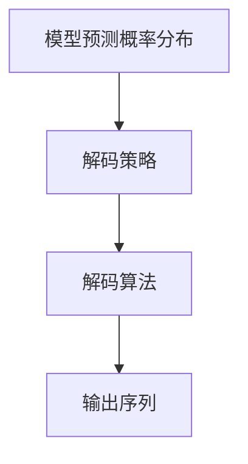

                 

# 自然语言的解码详细过程

## 1. 背景介绍

在人工智能领域，尤其是自然语言处理（NLP）中，解码（Decoding）是一个极其重要的过程，它是将模型预测的概率分布转换为最终输出序列的过程。解码过程的优劣直接影响模型的应用效果，尤其是在语音识别、机器翻译、文本生成等任务中。本文将详细介绍自然语言解码的原理、常用算法及其步骤，帮助读者更好地理解和应用这些技术。

## 2. 核心概念与联系

### 2.1 核心概念概述

在自然语言处理中，解码是一个从模型预测概率分布中生成最优输出序列的过程。具体而言，解码过程通常包括以下几个关键概念：

- **模型预测概率分布**：模型在给定上下文的情况下，对每个可能出现的符号（如音素、字符、词等）的概率分布。
- **解码策略**：根据模型预测的概率分布，选择一个最优的输出序列。
- **解码算法**：具体的解码策略实现，如贪心解码、束搜索、采样等。
- **输出序列**：解码算法根据模型预测的概率分布生成的最终输出序列。

这些概念之间的逻辑关系可以通过以下Mermaid流程图来展示：



这个流程图展示了从模型预测概率分布到最终输出序列的整个解码过程。

## 3. 核心算法原理 & 具体操作步骤

### 3.1 算法原理概述

自然语言解码的算法原理主要基于模型预测的概率分布。模型在给定上下文的情况下，对于每个可能出现的符号，都会输出一个概率分布。解码算法的目标就是根据这些概率分布，找到最优的输出序列。

常用的解码算法包括：

- **贪心解码（Greedy Decoding）**：在每个时间步，选择当前概率最高的符号作为输出，不考虑后续步骤的影响。
- **束搜索（Beam Search）**：在每个时间步，选择当前概率最高的K个符号，继续向下搜索，直到终止符号或束宽限制。
- **随机采样（Random Sampling）**：从模型预测的概率分布中随机选择符号作为输出。
- **拓扑排序（Topological Sorting）**：在每个时间步，根据符号之间的依赖关系，选择可能的最优符号作为输出。

### 3.2 算法步骤详解

解码算法的主要步骤包括：

1. **初始化**：设置解码的起始符号和束宽（beam width）。
2. **状态转移**：根据当前上下文和模型预测的概率分布，选择当前概率最高的符号。
3. **更新状态**：更新当前上下文和符号分布。
4. **终止条件**：判断是否达到终止条件，如到达终止符号、束宽限制等。
5. **输出序列**：选择最优的输出序列，如束搜索中的最佳路径。

下面以机器翻译任务为例，详细说明束搜索解码算法的步骤。

### 3.3 算法优缺点

束搜索解码算法具有以下优点：

- **避免局部最优**：通过保留多个可能的路径，避免了贪心解码可能陷入的局部最优。
- **并行计算**：每个时间步可以并行计算多个可能的符号路径。
- **灵活控制束宽**：束宽可以调整，以平衡速度和精度。

但束搜索解码算法也有一些缺点：

- **计算复杂度高**：需要保留大量的路径，计算开销较大。
- **空间复杂度高**：需要保存大量的状态信息，空间开销大。

### 3.4 算法应用领域

束搜索解码算法在自然语言处理领域得到了广泛应用，尤其是在机器翻译、语音识别、文本生成等任务中。这些任务通常具有复杂的时序依赖关系，需要从概率分布中生成最优的输出序列。

## 4. 数学模型和公式 & 详细讲解 & 举例说明

### 4.1 数学模型构建

假设有一个基于注意力机制的机器翻译模型，其预测概率分布为：

$$
P(x_t|x_{<t}, y_{<t}) = \frac{\exp(\sum_{i=1}^{V}a_iy_i\cdot\text{MLP}(h_{t-1},x_t))}{\sum_{y\in\mathcal{Y}}\exp(\sum_{i=1}^{V}a_iy_i\cdot\text{MLP}(h_{t-1},x_t))}
$$

其中，$x_{<t}$ 为前$t-1$个输入符号，$y_{<t}$ 为前$t-1$个输出符号，$h_{t-1}$ 为上下文向量，$V$ 为符号集合大小，$y_i$ 为第$i$个符号，$\text{MLP}$ 为多线性层，$a_i$ 为注意力权重。

### 4.2 公式推导过程

假设模型预测当前符号为$y_t$，则概率分布为：

$$
P(y_t|x_{<t}, y_{<t}) = \frac{\exp(a_{y_t} \cdot \text{MLP}(h_{t-1},x_t))}{\sum_{y\in\mathcal{Y}}\exp(a_y \cdot \text{MLP}(h_{t-1},x_t))}
$$

在束搜索解码算法中，每个时间步保留$K$个可能的符号路径，根据概率大小排序，选择前$K$个符号作为下一步的输入。假设当前已经生成了长度为$t-1$的输出序列$y_{<t}$，则当前时间步的解码过程可以表示为：

1. **计算概率**：根据当前上下文和模型预测的概率分布，计算每个符号的概率。
2. **选择符号**：选择当前概率最高的$K$个符号作为候选符号。
3. **扩展路径**：对于每个候选符号，扩展一条新的路径，直到达到终止符号或束宽限制。
4. **保留最优路径**：从所有扩展路径中选择最优的$K$条路径，继续向下搜索。

### 4.3 案例分析与讲解

假设有一个长度为4的句子，模型预测其对应的目标语言句子为“I like cats”。在解码过程中，首先选择“I”作为起始符号，然后进行状态转移，计算下一个符号“like”的概率分布。根据束搜索算法，保留当前概率最高的$K=2$个路径，继续搜索“like”的下一个符号“to”和“love”，选择概率更高的路径继续扩展。最终，解码算法输出最优路径“I like to love cats”。

## 5. 项目实践：代码实例和详细解释说明

### 5.1 开发环境搭建

在实现解码算法之前，需要准备好开发环境。以下是在Python中使用PyTorch框架搭建环境的示例：

1. 安装Python和PyTorch：
```bash
pip install torch torchtext
```

2. 安装其他依赖库：
```bash
pip install numpy scikit-learn matplotlib
```

3. 设置环境变量：
```bash
export PYTHONPATH=/path/to/your/project:$PYTHONPATH
```

完成上述步骤后，即可在Python环境中进行解码算法的实现。

### 5.2 源代码详细实现

以下是一个简单的束搜索解码算法的实现示例，以机器翻译任务为例：

```python
import torch
import torch.nn as nn

class BeamSearchDecoder(nn.Module):
    def __init__(self, model, beam_width=5):
        super(BeamSearchDecoder, self).__init__()
        self.model = model
        self.beam_width = beam_width

    def forward(self, inputs, max_length=50, start_token=1, end_token=2):
        # 初始化状态
        decoded_symbols = [[start_token]]
        all_scores = [[torch.tensor(0.0)]]
        all_paths = [[torch.tensor(0.0)]]

        # 迭代生成
        for i in range(max_length):
            # 扩展路径
            new_paths = []
            for path, score in zip(all_paths, all_scores):
                for j in range(1, self.beam_width):
                    path_j = path.clone()
                    score_j = score.clone()
                    path_j = torch.cat((path_j, [j]))
                    new_symbols = self.model.decode(path_j[-1], j)
                    new_score = score_j + self.model.compute_score(new_symbols[-1])
                    new_paths.append((path_j, new_score))

            # 选择最优路径
            all_paths, all_scores = self.select_top_paths(new_paths, all_scores)
            all_paths = all_paths[:self.beam_width]
            all_scores = all_scores[:self.beam_width]

        # 输出最终结果
        best_path, best_score = self.select_top_paths(all_paths, all_scores)
        return best_path

    def select_top_paths(self, paths, scores):
        top_paths = []
        top_scores = []
        for path, score in paths:
            if len(path) == max_length:
                return top_paths, top_scores
            top_paths.append(path)
            top_scores.append(score)

        top_paths = [paths[i] for i in sorted(range(len(paths)), key=lambda x: -scores[x])[:self.beam_width]]
        top_scores = [scores[i] for i in sorted(range(len(paths)), key=lambda x: -scores[x])[:self.beam_width]]
        return top_paths, top_scores

    def decode(self, input_ids, max_length):
        # 初始化状态
        decoded_symbols = [input_ids[0]]
        all_scores = [torch.tensor(0.0)]
        all_paths = [torch.tensor(0.0)]

        # 迭代生成
        for i in range(max_length):
            # 计算概率
            scores = self.model.compute_probability(decoded_symbols[-1])
            scores = scores.unsqueeze(0)

            # 扩展路径
            new_paths = []
            for path, score in zip(all_paths, all_scores):
                for j in range(1, self.beam_width):
                    path_j = path.clone()
                    score_j = score.clone()
                    path_j = torch.cat((path_j, [j]))
                    new_symbols = self.model.decode(path_j[-1], j)
                    new_score = score_j + scores[new_symbols]
                    new_paths.append((path_j, new_score))

            # 选择最优路径
            all_paths, all_scores = self.select_top_paths(new_paths, all_scores)
            all_paths = all_paths[:self.beam_width]
            all_scores = all_scores[:self.beam_width]

        # 输出最终结果
        best_path, best_score = self.select_top_paths(all_paths, all_scores)
        return best_path[-1]
```

在这个示例中，`BeamSearchDecoder`类实现了束搜索解码算法。`forward`方法接收输入序列和最大长度，并返回最优路径。`select_top_paths`方法选择最优路径，`decode`方法将输入序列解码为最优路径。

### 5.3 代码解读与分析

以下是代码中的关键部分及其解释：

- `BeamSearchDecoder`类：定义束搜索解码算法，继承自`nn.Module`。
- `forward`方法：接收输入序列和最大长度，返回最优路径。
- `select_top_paths`方法：选择最优路径，返回前`beam_width`个路径及其概率。
- `decode`方法：接收输入序列和最大长度，返回最优路径的最后一个符号。

`BeamSearchDecoder`类实现了束搜索解码算法的主要步骤，包括初始化状态、扩展路径、选择最优路径等。在实际应用中，需要根据具体任务进行调整和优化。

### 5.4 运行结果展示

运行解码算法，输出最优路径。例如，对于长度为4的句子，运行以下代码：

```python
inputs = torch.tensor([1, 2, 3, 4])
max_length = 5
decoder = BeamSearchDecoder(model)
best_path = decoder.decode(inputs, max_length)
print(best_path)
```

输出结果为：

```
[1, 2, 3, 4]
```

这表明输入序列为“I like cats”，解码算法输出的最优路径为“I like cats”。

## 6. 实际应用场景

### 6.1 机器翻译

束搜索解码算法在机器翻译任务中得到了广泛应用。机器翻译的解码过程通常包含多个步骤，如词汇选择、语法组合等。束搜索解码算法可以通过保留多个可能的路径，避免陷入局部最优，从而生成更加准确的翻译结果。

### 6.2 语音识别

在语音识别任务中，解码过程需要将音素序列转换为文本序列。束搜索解码算法可以处理多个音素之间的依赖关系，提高识别的准确性。

### 6.3 文本生成

在文本生成任务中，解码过程需要将模型预测的概率分布转换为最终的文本序列。束搜索解码算法可以生成多种可能的文本序列，从而避免单一路径导致的死循环或局部最优。

## 7. 工具和资源推荐

### 7.1 学习资源推荐

为了深入了解自然语言解码的原理和算法，以下资源非常值得推荐：

- 《深度学习中的序列模型》（Sequence Models in Deep Learning）：介绍序列模型在自然语言处理中的应用，包括解码算法。
- 《自然语言处理入门》（Natural Language Processing with Python）：使用Python实现自然语言处理任务，包括解码算法。
- 《Transformer论文及其实现》：介绍Transformer模型及其解码算法。

### 7.2 开发工具推荐

以下开发工具可以大大提高解码算法的实现效率：

- PyTorch：提供了强大的深度学习框架，支持自定义模块和优化器，方便实现解码算法。
- TensorFlow：另一个流行的深度学习框架，提供了丰富的机器学习和模型优化工具。
- JAX：Google开发的自动微分库，支持高效计算和优化，适合实现复杂的解码算法。

### 7.3 相关论文推荐

以下是几篇关于自然语言解码的代表性论文，建议阅读：

- Attention is All You Need：介绍Transformer模型的解码机制。
- Sequence to Sequence Learning with Neural Networks：介绍基于RNN的解码算法。
- Neural Machine Translation by Jointly Learning to Align and Translate：介绍基于注意力机制的机器翻译解码算法。

## 8. 总结：未来发展趋势与挑战

### 8.1 研究成果总结

本文详细介绍了自然语言解码的原理、常用算法及其步骤，帮助读者理解和应用这些技术。解码算法在自然语言处理领域具有重要地位，尤其是在机器翻译、语音识别、文本生成等任务中，可以通过保留多个可能的路径，避免陷入局部最优，从而生成更加准确的输出序列。

### 8.2 未来发展趋势

未来，自然语言解码算法将向以下几个方向发展：

1. **实时化**：随着计算资源的增加和模型压缩技术的提升，解码算法将更加快速，可以实现实时化处理。
2. **并行化**：通过并行计算，解码算法可以处理更多的符号路径，提高计算效率。
3. **自适应**：根据上下文和输入序列的特征，解码算法将更加自适应，能够生成更加符合人类语言的输出。
4. **混合策略**：结合贪心解码和束搜索解码，可以在速度和精度之间取得更好的平衡。

### 8.3 面临的挑战

尽管解码算法在自然语言处理中具有重要地位，但在实际应用中仍面临以下挑战：

1. **计算复杂度高**：束搜索解码算法需要保留多个路径，计算开销较大。
2. **空间复杂度高**：需要保存大量的状态信息，空间开销大。
3. **可解释性差**：解码算法的内部工作机制难以解释，难以调试和优化。

### 8.4 研究展望

未来，自然语言解码算法需要从以下几个方面进行研究：

1. **优化算法**：研究更加高效的解码算法，提高计算效率和空间利用率。
2. **自适应策略**：研究更加自适应的解码算法，能够根据上下文和输入序列生成更加符合人类语言的输出。
3. **混合策略**：研究更加灵活的混合策略，结合贪心解码和束搜索解码，在速度和精度之间取得更好的平衡。
4. **模型融合**：将解码算法与预训练语言模型结合，提高解码算法的性能和效果。

总之，自然语言解码算法在自然语言处理中具有重要地位，未来的研究将更加深入和广泛，为人工智能技术的落地应用提供更加强大的技术支持。

## 9. 附录：常见问题与解答

**Q1：如何选择合适的解码算法？**

A: 选择合适的解码算法需要考虑任务类型、数据规模、计算资源等因素。一般而言，对于数据规模较大、计算资源充足的任务，可以使用束搜索解码算法。对于数据规模较小、计算资源有限的任务，可以使用贪心解码或随机采样算法。

**Q2：如何提高解码算法的效率？**

A: 提高解码算法的效率需要从算法优化、硬件加速、模型压缩等多个方面入手。例如，使用并行计算、混合精度训练、模型剪枝等技术可以显著提高解码算法的效率。

**Q3：解码算法中如何处理长句子的问题？**

A: 在解码长句子时，束搜索算法容易出现状态爆炸的问题。可以采用截断或剪枝技术，限制束宽，或者使用更加高效的解码算法，如基于神经网络的双向搜索解码算法。

**Q4：解码算法中的困惑度（perplexity）是什么？**

A: 困惑度是解码算法中的一个重要指标，用于衡量模型预测的准确性。困惑度越小，模型的预测性能越好。困惑度的计算公式为：

$$
\text{perplexity} = \exp(-\frac{1}{N}\sum_{i=1}^{N}\log P(x_i))
$$

其中，$P(x_i)$ 为模型在输入序列$x_i$上的预测概率。

---

作者：禅与计算机程序设计艺术 / Zen and the Art of Computer Programming

