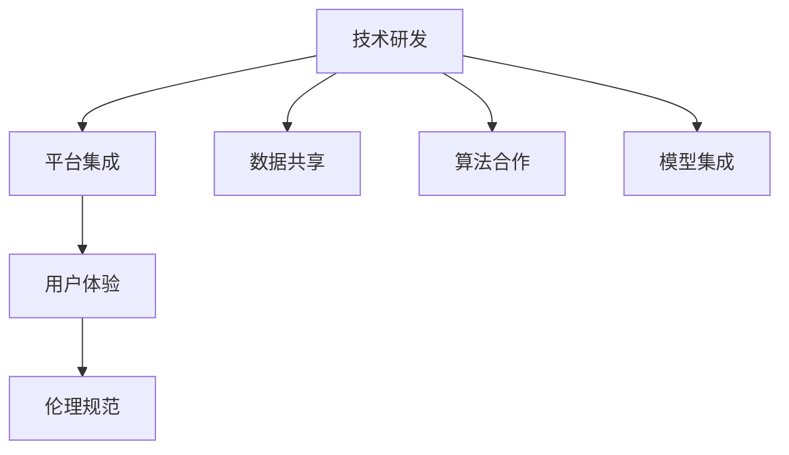

                 

# 苹果与OpenAI的合作模式

## 1. 背景介绍

在人工智能技术的推动下，科技巨头们纷纷加大在AI领域的投入，试图抢占未来的竞争制高点。苹果和OpenAI作为行业领头羊，其合作模式备受关注。本文将深入探讨苹果与OpenAI在AI领域合作的现状、内涵和未来趋势，解析其合作机制和技术细节。

## 2. 核心概念与联系

### 2.1 核心概念概述

苹果（Apple Inc.）是一家全球领先的科技公司，不仅在硬件和软件领域拥有强大的创新能力，还一直致力于开发前沿的AI技术，以提升用户体验和产品竞争力。

OpenAI（Open Artificial Intelligence）是一家专注于AI研究和应用的非盈利组织，其GPT系列模型凭借卓越的性能和广泛的应用，已经成为AI领域的明星。

两者的合作模式可以概括为技术合作与业务协同，具体包括以下几个关键环节：

- 技术研发：苹果与OpenAI合作研发AI技术，共同开发新产品和服务。
- 平台集成：将OpenAI的技术融入苹果的软硬件生态中，提供智能化解决方案。
- 用户体验：优化用户体验，提升产品附加值，实现技术落地。
- 伦理规范：确保AI技术应用符合伦理规范，保障用户隐私和数据安全。

这些环节通过数据共享、算法合作、模型集成等形式，共同推动AI技术的进步和商业应用的发展。

### 2.2 Mermaid流程图(Mermaid 流程节点中不要有括号、逗号等特殊字符)



通过上述流程图，我们可以清晰看到苹果与OpenAI合作的模式及其关键环节。

## 3. 核心算法原理 & 具体操作步骤

### 3.1 算法原理概述

苹果与OpenAI的合作，主要聚焦于自然语言处理(NLP)、计算机视觉、智能推荐等AI领域的核心技术。以下是一些关键算法的原理概述：

- 大语言模型（Large Language Model, LLM）：以自回归或自编码模型为代表的预训练语言模型，通过在大规模无标签文本语料上进行预训练，学习通用语言表示。LLM如GPT、BERT等在自然语言理解、生成、推理等方面表现出色。

- 迁移学习（Transfer Learning）：在预训练模型基础上，通过微调、 Prompt Learning 等技术，将其知识迁移到特定任务上。通过有监督的微调，可以显著提升模型在特定任务上的表现。

- 对抗训练（Adversarial Training）：在模型训练中引入对抗样本，提高模型的鲁棒性和泛化能力。对抗训练通过生成扰动样本，使模型在遇到真实攻击时表现更加稳健。

- 模型蒸馏（Model Distillation）：通过将大模型的知识转移给小型模型，提高小型模型的性能。模型蒸馏可以在保持高精度模型的同时，减小模型大小和计算开销。

### 3.2 算法步骤详解

#### 3.2.1 数据准备

1. **数据收集与清洗**：苹果通过其全球供应链、应用商店、社交媒体等渠道，收集海量数据，并进行清洗和标注，以满足AI模型的训练需求。
2. **数据分区**：将数据划分为训练集、验证集和测试集，以便于模型的训练、调优和评估。

#### 3.2.2 模型训练

1. **预训练模型选择**：选择合适的预训练模型（如BERT、GPT），进行微调或适配。
2. **模型适配**：根据任务需求，在预训练模型的基础上添加或调整特定的输出层和损失函数。
3. **模型训练**：使用训练集数据对模型进行迭代优化，最小化损失函数。

#### 3.2.3 模型评估与优化

1. **性能评估**：在验证集上评估模型性能，根据评估结果调整模型参数和学习率等。
2. **参数调整**：根据评估结果，对模型参数进行调整，如冻结预训练层、引入正则化技术等。

#### 3.2.4 模型部署与监控

1. **模型部署**：将训练好的模型集成到实际应用中，如Siri、Apple Music等。
2. **性能监控**：持续监控模型在实际环境中的表现，收集反馈，进行调优。

### 3.3 算法优缺点

#### 3.3.1 优点

- **技术优势**：苹果拥有强大的硬件平台（如iPhone、iPad）和软件生态（如iOS、macOS），可以快速落地和优化OpenAI的技术。
- **资源整合**：苹果通过数据共享、算法合作等方式，整合双方资源，提高AI技术研发效率。
- **用户体验优化**：苹果将OpenAI的技术融入其产品和服务中，提升用户体验，增强产品竞争力。
- **伦理规范**：苹果与OpenAI共同制定AI伦理规范，确保技术应用符合道德标准。

#### 3.3.2 缺点

- **技术依赖**：苹果在AI技术的核心算法和基础模型上依赖于OpenAI，可能会受制于合作伙伴。
- **数据隐私**：在数据共享过程中，涉及用户隐私和数据安全问题，需要严格控制和保护。
- **成本投入**：AI技术研发需要大量资金和人力投入，苹果需要持续进行技术投入和人才招聘。

### 3.4 算法应用领域

苹果与OpenAI的合作，主要集中在以下几个应用领域：

- **自然语言处理**：如Siri语音助手、Apple Music推荐系统等，利用大语言模型进行文本理解和生成。
- **计算机视觉**：如Face ID、增强现实（AR）等，利用计算机视觉技术进行图像识别和处理。
- **智能推荐**：如App Store、Apple Music推荐算法等，利用机器学习技术提升推荐效果。
- **人机交互**：如Apple Watch、iPadOS等，利用自然语言理解和生成技术，提升人机交互体验。
- **隐私保护**：如隐私计算、差分隐私技术等，确保用户数据隐私和安全性。

这些应用领域充分展示了苹果与OpenAI合作的深度和广度，为消费者提供了更加智能、便捷和安全的科技体验。

## 4. 数学模型和公式 & 详细讲解 & 举例说明

### 4.1 数学模型构建

在自然语言处理领域，苹果与OpenAI合作的典型模型为BERT和GPT。以GPT为例，其数学模型可以表示为：

$$ y = M_\theta(x) = \sigma(\sum_{i=1}^n w_i \cdot \phi(\mathbf{x}_i)) $$

其中，$\theta$为模型参数，$x$为输入文本，$y$为输出结果，$\sigma$为激活函数，$\phi$为预训练模型，$w_i$为权重。

### 4.2 公式推导过程

以BERT为例，其预训练任务包括掩码语言模型（Masked Language Model, MLM）和下一句预测（Next Sentence Prediction, NSP）。掩码语言模型的训练公式为：

$$ L_{MLM}(\theta) = \sum_{i=1}^n -\log P(w_i|M_\theta(x_{i_{mask}})) $$

其中，$x_{i_{mask}}$表示通过掩码操作后的文本序列，$P$表示概率分布。

### 4.3 案例分析与讲解

在实际应用中，BERT模型被用于多轮对话系统的训练。以智能客服系统为例，模型输入为历史对话记录，输出为目标回复。训练过程中，模型通过多轮对话记录学习回复生成，并在验证集上评估性能。在部署后，模型能够根据用户提问，生成合适的回复。

## 5. 项目实践：代码实例和详细解释说明

### 5.1 开发环境搭建

在苹果与OpenAI的合作中，开发环境搭建主要涉及以下步骤：

1. **环境配置**：搭建Python开发环境，安装TensorFlow、PyTorch等深度学习库。
2. **数据准备**：收集并预处理数据，包括文本清洗、标注等。
3. **模型选择**：选择适合的任务和模型，如BERT、GPT等。

### 5.2 源代码详细实现

以下是一个简单的源代码示例，展示如何利用BERT模型进行文本分类：

```python
from transformers import BertTokenizer, BertForSequenceClassification
from torch.utils.data import DataLoader
from torch import nn, optim

# 数据准备
tokenizer = BertTokenizer.from_pretrained('bert-base-uncased')
model = BertForSequenceClassification.from_pretrained('bert-base-uncased', num_labels=2)
train_data = ...

# 模型训练
model.train()
optimizer = optim.Adam(model.parameters(), lr=2e-5)
for epoch in range(10):
    for batch in DataLoader(train_data, batch_size=16):
        input_ids = batch['input_ids'].to(device)
        attention_mask = batch['attention_mask'].to(device)
        labels = batch['labels'].to(device)
        model.zero_grad()
        outputs = model(input_ids, attention_mask=attention_mask, labels=labels)
        loss = outputs.loss
        loss.backward()
        optimizer.step()

# 模型评估
model.eval()
with torch.no_grad():
    test_data = ...
    test_loss = ...
    test_acc = ...

# 模型部署
model.eval()
with torch.no_grad():
    test_data = ...
    test_loss = ...
    test_acc = ...
```

### 5.3 代码解读与分析

这段代码展示了BERT模型在文本分类任务上的基本流程，包括模型训练、评估和部署。其中：

- `BertTokenizer`用于将文本序列转换为模型可接受的输入格式。
- `BertForSequenceClassification`用于定义文本分类任务，并返回分类器的预测结果。
- `DataLoader`用于批量加载和处理训练数据。
- `optim.Adam`用于定义优化器。
- `model.zero_grad()`用于清除梯度，准备新的迭代。
- `model(input_ids, attention_mask=attention_mask, labels=labels)`用于前向传播计算输出。
- `loss.backward()`用于反向传播计算梯度。
- `optimizer.step()`用于更新模型参数。

### 5.4 运行结果展示

运行上述代码，可以得到训练集和验证集上的损失和准确率变化曲线，以及测试集上的性能评估指标。这些结果可以帮助开发者了解模型的训练效果，进行参数调优和模型优化。

## 6. 实际应用场景

苹果与OpenAI的合作模式，已经在多个实际应用场景中得到了验证和实践。以下是几个典型的应用案例：

### 6.1 Siri语音助手

Siri作为苹果的智能语音助手，通过与OpenAI的合作，显著提升了语音识别和自然语言理解能力。Siri可以理解多种语言、处理复杂指令，为用户提供智能化的交互体验。

### 6.2 Apple Music推荐系统

Apple Music利用OpenAI的技术，进行精准的个性化推荐，帮助用户发现新歌、新专辑。通过深度学习模型分析用户听歌行为，推荐系统可以实时更新推荐内容，提升用户体验。

### 6.3 Face ID人脸识别

Face ID利用计算机视觉技术，通过高精度人脸识别，保障用户数据安全和隐私。苹果与OpenAI合作，训练了更加鲁棒和准确的人脸识别模型，提升了识别效果。

### 6.4 增强现实（AR）

苹果的AR应用，如ARKit，通过与OpenAI合作，实现了更智能、更互动的AR体验。利用自然语言理解和生成技术，AR应用可以实时响应用户指令，提供沉浸式交互体验。

### 6.5 智能推荐

Apple Watch、iPadOS等设备，利用OpenAI的推荐算法，提升用户体验。通过分析用户行为，推荐系统可以推荐最合适的应用、内容和服务，提升设备的使用价值。

## 7. 工具和资源推荐

### 7.1 学习资源推荐

1. **《自然语言处理入门》**：介绍自然语言处理的基本概念和常用算法。
2. **《深度学习基础》**：深入讲解深度学习的基本原理和应用。
3. **OpenAI官方文档**：提供OpenAI的最新技术和实践指南，帮助开发者快速上手。
4. **PyTorch官方文档**：介绍PyTorch的深度学习框架，提供丰富的API和样例代码。
5. **TensorFlow官方文档**：介绍TensorFlow的深度学习框架，提供丰富的API和样例代码。

### 7.2 开发工具推荐

1. **PyTorch**：基于Python的开源深度学习框架，支持动态计算图。
2. **TensorFlow**：由Google主导的深度学习框架，支持分布式计算和GPU/TPU加速。
3. **Jupyter Notebook**：提供交互式编程环境，方便开发者进行数据处理和模型训练。
4. **Git**：版本控制系统，方便开发者进行代码管理和协作开发。
5. **PyCharm**：基于Python的IDE，提供代码高亮、调试、自动补全等强大功能。

### 7.3 相关论文推荐

1. **《Attention is All You Need》**：介绍Transformer模型，开启预训练语言模型的时代。
2. **《BERT: Pre-training of Deep Bidirectional Transformers for Language Understanding》**：介绍BERT模型的预训练任务，刷新多项NLP任务SOTA。
3. **《GPT-3: Language Models are Unsupervised Multitask Learners》**：介绍GPT-3模型的zero-shot学习能力，展示大语言模型的强大潜力。

## 8. 总结：未来发展趋势与挑战

### 8.1 研究成果总结

苹果与OpenAI的合作，已经在大规模预训练语言模型、自然语言处理、计算机视觉等多个领域取得了显著进展，推动了AI技术的发展和应用。双方通过技术研发、平台集成、用户体验优化等手段，提升AI技术的落地效果，满足用户需求。

### 8.2 未来发展趋势

苹果与OpenAI的未来合作将更加深入和广泛，涉及更多AI技术领域。以下是几个可能的趋势：

1. **多模态AI**：将文本、图像、语音等多种模态数据进行融合，提升AI系统的综合能力和用户体验。
2. **边缘计算**：将AI技术部署到边缘设备（如Apple Watch），实现实时推理和决策。
3. **自监督学习**：利用无监督学习技术，在大规模数据上进行预训练，提升模型泛化能力。
4. **隐私保护**：通过差分隐私、联邦学习等技术，确保用户数据的隐私和安全。
5. **可解释性**：提升AI系统的可解释性，让用户理解并信任AI决策过程。

### 8.3 面临的挑战

苹果与OpenAI的合作也面临一些挑战：

1. **技术依赖**：苹果对OpenAI的技术依赖较大，可能会受制于合作伙伴。
2. **数据隐私**：在数据共享过程中，涉及用户隐私和数据安全问题，需要严格控制和保护。
3. **成本投入**：AI技术研发需要大量资金和人力投入，苹果需要持续进行技术投入和人才招聘。
4. **算法透明性**：AI模型的决策过程较为复杂，难以完全透明，需要不断改进和优化。
5. **应用场景适配**：不同设备和场景下的AI应用需要适配和优化，才能发挥最佳效果。

### 8.4 研究展望

未来，苹果与OpenAI的合作将在以下几个方面进行深入研究：

1. **跨模态AI**：将多模态数据进行融合，提升系统的综合能力。
2. **隐私保护**：引入差分隐私、联邦学习等技术，保障用户数据隐私和安全。
3. **自监督学习**：利用无监督学习技术，在大规模数据上进行预训练，提升模型泛化能力。
4. **算法透明性**：提升AI系统的可解释性，让用户理解并信任AI决策过程。
5. **边缘计算**：将AI技术部署到边缘设备，实现实时推理和决策。

## 9. 附录：常见问题与解答

**Q1：苹果与OpenAI的合作模式有哪些？**

A: 苹果与OpenAI的合作模式主要包括以下几个方面：
1. **技术研发**：双方合作研发AI技术，共同开发新产品和服务。
2. **平台集成**：将OpenAI的技术融入苹果的软硬件生态中，提供智能化解决方案。
3. **用户体验优化**：优化用户体验，提升产品附加值，实现技术落地。
4. **伦理规范**：确保AI技术应用符合伦理规范，保障用户隐私和数据安全。

**Q2：苹果与OpenAI合作的优点和缺点是什么？**

A: 苹果与OpenAI合作的优点包括：
1. **技术优势**：苹果拥有强大的硬件平台和软件生态，可以快速落地和优化OpenAI的技术。
2. **资源整合**：通过数据共享、算法合作等方式，整合双方资源，提高AI技术研发效率。
3. **用户体验优化**：将OpenAI的技术融入苹果产品和服务中，提升用户体验，增强产品竞争力。
4. **伦理规范**：双方共同制定AI伦理规范，确保技术应用符合道德标准。

合作的缺点包括：
1. **技术依赖**：苹果在AI技术的核心算法和基础模型上依赖于OpenAI，可能会受制于合作伙伴。
2. **数据隐私**：在数据共享过程中，涉及用户隐私和数据安全问题，需要严格控制和保护。
3. **成本投入**：AI技术研发需要大量资金和人力投入，苹果需要持续进行技术投入和人才招聘。

**Q3：苹果与OpenAI的合作在哪些应用场景中得到了实践？**

A: 苹果与OpenAI的合作在以下几个应用场景中得到了实践：
1. **Siri语音助手**：通过与OpenAI合作，显著提升了语音识别和自然语言理解能力。
2. **Apple Music推荐系统**：利用OpenAI的技术进行精准的个性化推荐。
3. **Face ID人脸识别**：通过与OpenAI合作，训练了更加鲁棒和准确的人脸识别模型。
4. **增强现实（AR）**：利用自然语言理解和生成技术，提升AR应用的智能互动体验。
5. **智能推荐**：利用OpenAI的推荐算法，提升设备的使用价值。

**Q4：苹果与OpenAI合作面临的挑战有哪些？**

A: 苹果与OpenAI合作面临的挑战包括：
1. **技术依赖**：苹果在AI技术的核心算法和基础模型上依赖于OpenAI，可能会受制于合作伙伴。
2. **数据隐私**：在数据共享过程中，涉及用户隐私和数据安全问题，需要严格控制和保护。
3. **成本投入**：AI技术研发需要大量资金和人力投入，苹果需要持续进行技术投入和人才招聘。
4. **算法透明性**：AI模型的决策过程较为复杂，难以完全透明，需要不断改进和优化。
5. **应用场景适配**：不同设备和场景下的AI应用需要适配和优化，才能发挥最佳效果。

**Q5：苹果与OpenAI合作的研究展望有哪些？**

A: 苹果与OpenAI合作的研究展望包括：
1. **跨模态AI**：将多模态数据进行融合，提升系统的综合能力。
2. **隐私保护**：引入差分隐私、联邦学习等技术，保障用户数据隐私和安全。
3. **自监督学习**：利用无监督学习技术，在大规模数据上进行预训练，提升模型泛化能力。
4. **算法透明性**：提升AI系统的可解释性，让用户理解并信任AI决策过程。
5. **边缘计算**：将AI技术部署到边缘设备，实现实时推理和决策。

---

作者：禅与计算机程序设计艺术 / Zen and the Art of Computer Programming

