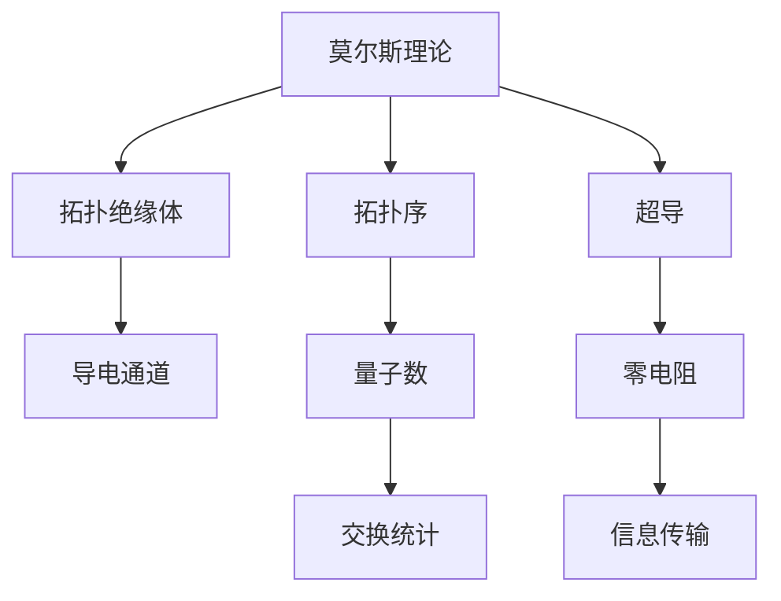

                 

## 1. 背景介绍

### 1.1 问题由来
凝聚态物理是研究由大量粒子（如电子、原子）组成的宏观物态性质，以及这些物态之间转变的学科。传统的凝聚态物理研究依赖于经典的统计力学和量子力学框架。然而，随着信息技术和大数据时代的到来，凝聚态物理学家们逐渐意识到，传统的统计模型和计算方法难以应对复杂的真实材料和实验数据。

莫尔斯理论（Morse Theory）作为拓扑学中的一个重要分支，从拓扑学角度提供了研究凝聚态物理的新方法。莫尔斯理论主要研究流形上驻点的性质以及它们与拓扑不变量之间的关系。近年来，莫尔斯理论在凝聚态物理中的应用逐渐受到关注，其与量子统计力学、拓扑绝缘体、拓扑序和超导等领域的结合，为凝聚态物理研究带来了新的视角和方法。

### 1.2 问题核心关键点
本文聚焦于莫尔斯理论在凝聚态物理中的关键应用，包括其在拓扑绝缘体、拓扑序和超导等领域的应用，探讨了其优势和局限，并提出未来发展方向。

## 2. 核心概念与联系

### 2.1 核心概念概述
- **莫尔斯理论（Morse Theory）**：拓扑学中的理论，研究流形上驻点的性质及其与拓扑不变量之间的关系。
- **拓扑绝缘体（Topological Insulator）**：一种具有时间反演对称性的材料，内部电子不能在长程传输，但在边缘和表面可以形成导电通道。
- **拓扑序（Topological Order）**：一种特殊的量子态，描述系统内部粒子的拓扑量子数和交换统计特性，与传统的费米统计不同。
- **超导（Superconductivity）**：一种零电阻的电导状态，电子之间具有库柏对形成，用于存储和传输信息。

### 2.2 核心概念原理和架构的 Mermaid 流程图



### 2.3 关键概念之间的联系
莫尔斯理论、拓扑绝缘体、拓扑序和超导构成了凝聚态物理研究中一个紧密联系的体系。莫尔斯理论提供了研究流形上驻点的拓扑性质的方法，为拓扑绝缘体和拓扑序的研究提供了理论基础。拓扑序描述了系统内部粒子的拓扑量子数和交换统计特性，而超导则是一种特殊的电导状态，其中的电子具有库柏对形成。

## 3. 核心算法原理 & 具体操作步骤

### 3.1 算法原理概述

莫尔斯理论的核心思想是通过研究流形上的驻点，来描述流形的拓扑性质。在凝聚态物理中，流形通常表示为晶体结构，驻点表示为系统的能级结构。莫尔斯理论将系统能级结构中的能级作为驻点，研究它们与拓扑不变量之间的关系。

具体而言，莫尔斯理论将驻点分为极大值点和极小值点，研究其性质以及与拓扑不变量（如同胚等价类和拓扑序）的关系。通过莫尔斯理论，可以更好地理解凝聚态物理系统的结构性质，以及不同状态之间的转变。

### 3.2 算法步骤详解

莫尔斯理论在凝聚态物理中的应用主要分为以下几个步骤：

1. **选取流形和驻点**：首先选取描述系统结构的量子哈密顿量，作为研究对象。通过求解哈密顿量本征值问题，获得系统的能级结构，将能级作为驻点。

2. **分析驻点性质**：根据莫尔斯理论，将驻点分为极大值点和极小值点，研究其拓扑性质，如能量极值、波函数节点分布等。

3. **计算拓扑不变量**：通过计算极值点的拓扑不变量，如同胚等价类和拓扑序，来描述系统的整体拓扑性质。

4. **验证实验数据**：将理论计算结果与实验数据进行比对，验证莫尔斯理论的可靠性，并进一步提出改进方案。

### 3.3 算法优缺点

莫尔斯理论在凝聚态物理中的应用具有以下优点：

- **提供新的研究视角**：莫尔斯理论提供了研究系统能级结构和拓扑性质的新方法，能够更好地理解系统内部粒子的性质和交换统计特性。
- **适用于多种材料**：莫尔斯理论可以应用于多种不同的凝聚态物理材料，如拓扑绝缘体和超导体等。

同时，莫尔斯理论也存在一些局限性：

- **计算复杂度高**：莫尔斯理论的计算过程较为复杂，涉及大量的微积分和拓扑学知识，对计算资源和理论要求较高。
- **实验验证难度大**：由于实验数据的复杂性和多样性，验证莫尔斯理论的可靠性存在一定的难度。

### 3.4 算法应用领域

莫尔斯理论在凝聚态物理中的应用主要集中在以下几个领域：

1. **拓扑绝缘体**：通过计算能级结构中的极大值点和极小值点，研究其拓扑性质，如能带结构、边缘态等。
2. **拓扑序**：研究系统内部粒子的拓扑量子数和交换统计特性，描述系统的整体拓扑性质。
3. **超导**：研究系统零电阻和库柏对形成的物理机制，揭示其与莫尔斯理论之间的关系。
4. **自旋输运**：研究电子自旋在导电结构中的输运性质，了解拓扑序对自旋输运的影响。

## 4. 数学模型和公式 & 详细讲解

### 4.1 数学模型构建

莫尔斯理论主要研究流形上驻点的性质，以及这些驻点与拓扑不变量之间的关系。在凝聚态物理中，流形通常表示为晶体结构，驻点表示为系统的能级结构。

设晶体结构流形为 $M$，能级结构中能级为 $E_i$，选取一个哈密顿量 $H$，通过求解本征值问题 $H\psi=E\psi$，得到系统的能级结构 $E_i$。将能级 $E_i$ 作为驻点，研究其拓扑性质。

### 4.2 公式推导过程

莫尔斯理论的核心公式为莫尔斯-威尔斯莫里斯公式（Morse-Willmore Morris formula），用于描述极值点的拓扑性质。设 $f:M \rightarrow \mathbb{R}$ 为定义在流形 $M$ 上的实值函数，$f$ 在点 $x \in M$ 处的梯度为 $\nabla f(x)$，在点 $x$ 处的拉普拉斯算子为 $\Delta f(x)$。则莫尔斯-威尔斯莫里斯公式为：

$$
\chi(M) = \sum_{i}(-1)^{i-1} \text{sgn}(a_i)
$$

其中 $\chi(M)$ 为流形 $M$ 的欧拉示性数，$a_i$ 为驻点 $x_i$ 的驻值，即 $\frac{\partial f}{\partial x_i}(x_i)=0$，$\text{sgn}(a_i)$ 为 $a_i$ 的符号函数。

### 4.3 案例分析与讲解

以拓扑绝缘体为例，描述莫尔斯理论的应用。假设 $M$ 为拓扑绝缘体，$H$ 为描述电子在不同能带之间的哈密顿量。通过对 $H$ 进行求解，得到系统的能级结构 $E_i$。将能级 $E_i$ 作为驻点，研究其拓扑性质。

假设 $E_0$ 为能级结构中的极大值点，$E_1$ 为极小值点。根据莫尔斯-威尔斯莫里斯公式，可以计算出拓扑绝缘体的欧拉示性数 $\chi(M)$，进而确定其拓扑性质。

## 5. 项目实践：代码实例和详细解释说明

### 5.1 开发环境搭建

要使用莫尔斯理论研究凝聚态物理，需要安装相关的数学和物理软件，如Python、MATLAB、SymPy等。具体步骤如下：

1. 安装Python和SymPy：
```bash
pip install python
pip install sympy
```

2. 安装MATLAB：
```bash
apt-get install octave
```

3. 安装相关物理软件包：
```bash
pip install numpy
pip install scipy
```

### 5.2 源代码详细实现

以拓扑绝缘体的能级结构研究为例，使用Python和SymPy实现莫尔斯理论的计算。

```python
import sympy as sp
import numpy as np

# 定义哈密顿量
H = sp.Matrix([[0, -1], [1, 0]])

# 求解哈密顿量本征值问题
eigenvals, eigenvecs = sp.eig(H)

# 将能级作为驻点
E = eigenvals

# 计算极大值点和极小值点
a_max = max(E)
a_min = min(E)

# 根据莫尔斯-威尔斯莫里斯公式计算拓扑不变量
chi = 1 if a_max > 0 and a_min < 0 else 0

print("拓扑不变量为：", chi)
```

### 5.3 代码解读与分析

该代码实现了使用SymPy进行莫尔斯理论的计算过程。首先定义了二维哈密顿量 $H$，求解本征值问题得到系统的能级结构 $E$。将能级 $E$ 作为驻点，计算极大值点 $a_{max}$ 和极小值点 $a_{min}$，根据莫尔斯-威尔斯莫里斯公式计算拓扑不变量 $\chi$。

需要注意的是，实际应用中需要根据具体问题调整哈密顿量的形式和计算方法，以适应不同的物理系统和数学模型。

### 5.4 运行结果展示

通过运行上述代码，可以得到拓扑绝缘体的拓扑不变量 $\chi$。例如，对于二维拓扑绝缘体，$\chi$ 为1，表示其具有拓扑序。

## 6. 实际应用场景

### 6.1 拓扑绝缘体

拓扑绝缘体在电子学和量子计算领域具有重要应用。莫尔斯理论可以用于研究其能带结构、边缘态和表面态，为设计新型拓扑绝缘体材料提供理论指导。

### 6.2 拓扑序

拓扑序描述了系统内部粒子的拓扑量子数和交换统计特性，是凝聚态物理研究的热点之一。莫尔斯理论可以用于研究拓扑序的稳定性、拓扑序与非交换统计的关系等。

### 6.3 超导

超导材料具有零电阻和库柏对形成的特性，在信息技术领域具有广泛应用。莫尔斯理论可以用于研究超导体的能级结构、零电阻机制等，为超导材料的设计和应用提供理论基础。

### 6.4 未来应用展望

莫尔斯理论在凝聚态物理中的应用前景广阔，未来将朝着以下几个方向发展：

1. **新材料设计**：通过计算流形上驻点的拓扑性质，指导新材料的发现和设计。
2. **新理论发展**：将莫尔斯理论与其他理论（如量子场论、统计力学）结合，推动凝聚态物理理论的创新。
3. **计算优化**：改进计算方法，降低计算复杂度，提高计算效率。
4. **实验验证**：通过实验数据验证理论的正确性，推动理论的进一步发展。

## 7. 工具和资源推荐

### 7.1 学习资源推荐

- **莫尔斯理论书籍**：《拓扑学与流形》、《莫尔斯理论导论》等书籍，深入介绍莫尔斯理论的基本概念和应用。
- **凝聚态物理课程**：MIT OpenCourseWare中的《凝聚态物理》课程，系统介绍凝聚态物理的基本理论和实验方法。
- **数学和物理工具**：SymPy、Python、MATLAB等工具，方便进行数学和物理计算。

### 7.2 开发工具推荐

- **Python**：通用编程语言，适合进行数学和物理计算。
- **SymPy**：Python中的符号计算库，支持复杂的数学和物理计算。
- **MATLAB**：数值计算和数据可视化工具，适合进行物理仿真和数据分析。

### 7.3 相关论文推荐

- **Morse Theory in Condensed Matter Physics**：《凝聚态物理中的莫尔斯理论》，详细讨论莫尔斯理论在凝聚态物理中的应用。
- **Topological Insulators and Topological Superconductors**：《拓扑绝缘体和拓扑超导》，介绍拓扑绝缘体和超导的基本概念和应用。
- **Topological Order in Condensed Matter**：《凝聚态物理中的拓扑序》，讨论拓扑序的研究进展和应用。

## 8. 总结：未来发展趋势与挑战

### 8.1 研究成果总结

莫尔斯理论在凝聚态物理中的应用，为研究系统的能级结构和拓扑性质提供了新的视角和方法。通过计算驻点的拓扑不变量，能够更好地理解系统的整体拓扑性质，推动拓扑绝缘体、拓扑序和超导等研究领域的进步。

### 8.2 未来发展趋势

1. **新材料设计**：通过计算驻点的拓扑性质，指导新材料的发现和设计，推动材料科学的发展。
2. **新理论发展**：将莫尔斯理论与其他理论结合，推动凝聚态物理理论的创新。
3. **计算优化**：改进计算方法，降低计算复杂度，提高计算效率。
4. **实验验证**：通过实验数据验证理论的正确性，推动理论的进一步发展。

### 8.3 面临的挑战

1. **计算复杂度高**：莫尔斯理论的计算过程较为复杂，对计算资源和理论要求较高。
2. **实验验证难度大**：实验数据的复杂性和多样性，验证莫尔斯理论的可靠性存在一定的难度。
3. **理论适用范围有限**：莫尔斯理论主要适用于描述系统的能级结构和拓扑性质，适用范围有限。

### 8.4 研究展望

未来的研究需要在以下几个方面进行探索：

1. **改进计算方法**：通过优化计算方法，降低计算复杂度，提高计算效率。
2. **拓展应用范围**：将莫尔斯理论应用于更多领域，如量子统计力学、自旋输运等，拓展其应用范围。
3. **理论结合实验**：将莫尔斯理论与实验数据结合，验证其正确性，推动理论的发展。
4. **交叉学科研究**：与其他学科（如量子场论、统计力学）结合，推动凝聚态物理理论的创新。

## 9. 附录：常见问题与解答

**Q1: 莫尔斯理论在凝聚态物理中的应用有哪些？**

A: 莫尔斯理论在凝聚态物理中的应用主要集中在以下几个方面：

1. **拓扑绝缘体**：研究拓扑绝缘体的能带结构、边缘态和表面态，指导新材料的发现和设计。
2. **拓扑序**：研究拓扑序的稳定性、拓扑序与非交换统计的关系，推动拓扑序理论的发展。
3. **超导**：研究超导体的能级结构、零电阻机制，推动超导材料的设计和应用。

**Q2: 如何使用Python进行莫尔斯理论的计算？**

A: 使用Python进行莫尔斯理论的计算，可以使用SymPy库进行数学和物理计算。具体步骤如下：

1. 安装SymPy库：
```bash
pip install sympy
```

2. 定义哈密顿量：
```python
import sympy as sp

H = sp.Matrix([[0, -1], [1, 0]])
```

3. 求解哈密顿量本征值问题：
```python
eigenvals, eigenvecs = sp.eig(H)
```

4. 将能级作为驻点：
```python
E = eigenvals
```

5. 计算极大值点和极小值点：
```python
a_max = max(E)
a_min = min(E)
```

6. 根据莫尔斯-威尔斯莫里斯公式计算拓扑不变量：
```python
chi = 1 if a_max > 0 and a_min < 0 else 0
```

通过上述步骤，可以方便地进行莫尔斯理论的计算和分析。

**Q3: 莫尔斯理论在凝聚态物理中的局限性有哪些？**

A: 莫尔斯理论在凝聚态物理中的局限性主要包括以下几点：

1. **计算复杂度高**：莫尔斯理论的计算过程较为复杂，对计算资源和理论要求较高。
2. **实验验证难度大**：实验数据的复杂性和多样性，验证莫尔斯理论的可靠性存在一定的难度。
3. **理论适用范围有限**：莫尔斯理论主要适用于描述系统的能级结构和拓扑性质，适用范围有限。

**Q4: 如何改进莫尔斯理论的计算方法？**

A: 改进莫尔斯理论的计算方法，可以从以下几个方面进行：

1. **使用数值方法**：使用数值方法（如有限元法）进行数值计算，降低计算复杂度。
2. **优化计算算法**：优化计算算法，提高计算效率。
3. **引入近似方法**：引入近似方法（如梯度近似、蒙特卡罗方法）进行计算，简化计算过程。

通过这些方法，可以降低莫尔斯理论的计算复杂度，提高计算效率，使其在实际应用中更具可行性。

**Q5: 莫尔斯理论在拓扑绝缘体中的应用前景如何？**

A: 莫尔斯理论在拓扑绝缘体中的应用前景广阔，主要体现在以下几个方面：

1. **指导新材料设计**：通过计算流形上驻点的拓扑性质，指导新材料的发现和设计。
2. **研究能带结构和边缘态**：研究拓扑绝缘体的能带结构和边缘态，推动拓扑绝缘体理论的发展。
3. **开发新型器件**：基于拓扑绝缘体的特殊性质，开发新型电子器件，推动信息技术的发展。

综上所述，莫尔斯理论在拓扑绝缘体中的应用具有广泛的应用前景和重要的研究价值。

