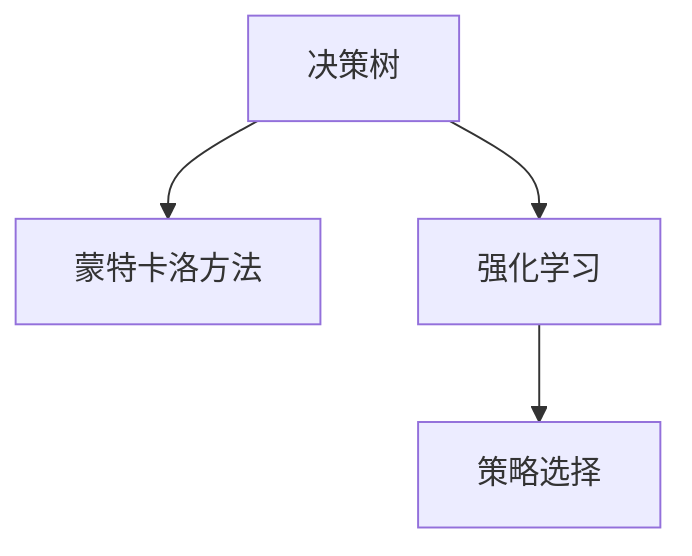

                 

# 蒙特卡洛树搜索(Monte Carlo Tree Search) - 原理与代码实例讲解

> 关键词：蒙特卡洛树搜索, MCTS, 强化学习, 决策树, 随机模拟, 算法原理, 具体实现

## 1. 背景介绍

### 1.1 问题由来

蒙特卡洛树搜索（Monte Carlo Tree Search, MCTS）是一种基于强化学习的搜索算法，用于解决策略选择问题，广泛应用于游戏、机器人控制、路径规划等领域。它是一种迭代式、自顶向下的树形搜索算法，通过随机模拟和统计分析来评估搜索空间的各节点，从而选择最优解。

蒙特卡洛树搜索的灵感来源于蒙特卡洛方法，即通过随机试验来估计概率和期望。在搜索过程中，算法会随机模拟大量路径，并对这些路径进行统计分析，从而找到最优策略。这种随机性使得蒙特卡洛树搜索在面对复杂的搜索空间时，能够避免陷入局部最优，从而得到全局最优解。

### 1.2 问题核心关键点

蒙特卡洛树搜索的核心在于其“随机模拟与统计分析”的思想，具体体现在以下几个关键点：

1. **树形结构**：通过构建一棵树来表示搜索空间，每个节点代表一个状态，每个边代表一个可能的动作。
2. **选择策略**：通过评估各节点的价值（Value）和未扩展动作（Expansion）来选择下一步的搜索方向。
3. **随机模拟**：通过随机模拟路径来评估节点的价值，从而更新节点的统计信息。
4. **扩展策略**：通过不断扩展节点，增加搜索空间，直至达到终止条件。
5. **回溯策略**：通过回溯从最优解开始，逐步向上扩展，直至根节点，更新节点的统计信息。

这些关键点共同构成了蒙特卡洛树搜索的基本框架，使得算法能够高效地解决复杂的策略选择问题。

## 2. 核心概念与联系

### 2.1 核心概念概述

为更好地理解蒙特卡洛树搜索的原理和应用，本节将介绍几个密切相关的核心概念：

- **决策树（Decision Tree）**：一种树形结构，用于表示决策过程，每个节点代表一个决策点，每个边代表一个可能的动作，每个叶子节点代表一个结果。
- **蒙特卡洛方法（Monte Carlo Method）**：通过随机模拟大量路径，估计概率和期望，用于解决不确定性问题。
- **强化学习（Reinforcement Learning）**：通过环境反馈来优化策略，使得智能体在特定环境中获取最大奖励。
- **策略选择（Strategy Selection）**：在决策过程中选择最优策略，使得智能体在当前状态下获取最大期望收益。

这些核心概念之间的逻辑关系可以通过以下Mermaid流程图来展示：



这个流程图展示了几者之间的相互关系：

1. 决策树提供了一种结构化的表示方式，用于描述决策过程。
2. 蒙特卡洛方法通过随机模拟路径，提供了一种评估决策树节点价值的方法。
3. 强化学习通过环境反馈，优化决策树策略选择，使得智能体在特定环境中获取最大奖励。

这些概念共同构成了蒙特卡洛树搜索的基础，使其能够在复杂环境中高效地进行策略选择。

## 3. 核心算法原理 & 具体操作步骤
### 3.1 算法原理概述

蒙特卡洛树搜索的基本思想是通过随机模拟和统计分析，评估搜索空间各节点的价值，从而选择最优解。其核心步骤如下：

1. **初始化**：构建一棵空决策树，从根节点开始搜索。
2. **选择（Selection）**：从当前节点开始，根据选择策略选择下一个扩展节点。
3. **扩展（Expansion）**：如果当前节点未被扩展，则随机选择一个未被访问的动作，生成子节点。
4. **模拟（Simulation）**：从新生成的节点开始，随机模拟一条路径，直至终止条件。
5. **回溯（Backpropagation）**：将模拟结果回溯到根节点，更新各节点的统计信息。

通过迭代执行上述步骤，蒙特卡洛树搜索能够逐步扩展搜索空间，找到最优解。

### 3.2 算法步骤详解

蒙特卡洛树搜索的具体操作步骤如下：

#### 3.2.1 初始化

```python
class Node:
    def __init__(self, state, parent=None):
        self.state = state
        self.parent = parent
        self.children = []
        self.untried_actions = []
        self.value = 0
        self.visits = 0
```

定义一个`Node`类表示决策树的节点，包含状态、父节点、子节点、未尝试动作、价值和访问次数等属性。

#### 3.2.2 选择

选择策略可以使用UCB1（Upper Confidence Bound）或CSCF（Child-Subtree Choosing Framework）等方法，具体实现如下：

```python
def select_node(node, threshold):
    while node.untried_actions:
        action = random.choice(node.untried_actions)
        node.children.append(expand(node, action))
        node.untried_actions.remove(action)
    return node, action
```

随机选择一个未被尝试的动作，并扩展生成子节点，返回当前节点和选择的动作。

#### 3.2.3 扩展

扩展策略是随机选择一个未被访问的动作，生成子节点。具体实现如下：

```python
def expand(node, action):
    new_state = get_state(node.state, action)
    new_node = Node(new_state, parent=node)
    node.children.append(new_node)
    return new_node
```

根据当前状态和动作生成新的状态，并创建新的节点。

#### 3.2.4 模拟

模拟策略是随机模拟一条路径，直至终止条件。具体实现如下：

```python
def simulate(node):
    while not is_terminal(node.state):
        action = random.choice(node.untried_actions)
        node = get_next_node(node, action)
    return node, node.state
```

随机选择一个未被尝试的动作，并模拟到下一个状态，直至达到终止条件。

#### 3.2.5 回溯

回溯策略是将模拟结果回溯到根节点，更新各节点的统计信息。具体实现如下：

```python
def backpropagate(node, reward):
    while node.parent:
        node = node.parent
        node.value += reward
        node.visits += 1
```

将模拟结果回溯到根节点，更新各节点的价值和访问次数。

### 3.3 算法优缺点

蒙特卡洛树搜索的优点在于：

1. 能够处理复杂搜索空间，避免陷入局部最优。
2. 能够自适应地学习决策策略，适用于动态环境。
3. 算法简单易懂，易于实现。

其缺点在于：

1. 随机模拟路径会引入一定的随机性，可能导致结果不稳定。
2. 需要大量的计算资源，时间复杂度较高。
3. 对于大规模问题，可能需要较长的时间才能找到最优解。

尽管存在这些局限性，蒙特卡洛树搜索在解决复杂决策问题时仍然具有显著的优势，广泛应用于游戏、机器人控制等领域。

### 3.4 算法应用领域

蒙特卡洛树搜索在多个领域中得到了广泛的应用，例如：

- **游戏**：如围棋、象棋、星际争霸等策略类游戏，通过蒙特卡洛树搜索进行策略优化。
- **机器人控制**：如路径规划、运动控制等，通过蒙特卡洛树搜索优化决策策略。
- **智能推荐系统**：如电商推荐、新闻推荐等，通过蒙特卡洛树搜索优化推荐策略。
- **自然语言处理**：如文本分类、序列标注等任务，通过蒙特卡洛树搜索进行决策推理。
- **金融分析**：如股票交易、风险管理等，通过蒙特卡洛树搜索进行决策优化。

这些应用领域展示了蒙特卡洛树搜索的广泛适用性和强大的决策优化能力。

## 4. 数学模型和公式 & 详细讲解  
### 4.1 数学模型构建

蒙特卡洛树搜索的数学模型基于决策树和蒙特卡洛方法，其核心思想是通过随机模拟路径来评估各节点的价值。

定义节点 $N$ 的**价值** $V(N)$ 和**访问次数** $V_{vis}(N)$，分别表示从当前节点开始模拟路径的平均回报和路径总次数。则节点 $N$ 的价值 $V(N)$ 可以表示为：

$$
V(N) = \frac{\sum_{i=1}^k r_i}{k}
$$

其中 $k$ 为模拟路径的总数，$r_i$ 为第 $i$ 条路径的回报。

定义节点 $N$ 的**访问次数** $V_{vis}(N)$ 为模拟路径的总次数，可以表示为：

$$
V_{vis}(N) = \sum_{i=1}^k \mathbb{I}_i
$$

其中 $\mathbb{I}_i$ 为第 $i$ 条路径的访问次数。

蒙特卡洛树搜索的目标是通过随机模拟路径，最大化节点的价值 $V(N)$。

### 4.2 公式推导过程

蒙特卡洛树搜索的核心公式是选择策略和扩展策略。选择策略通常使用UCB1方法，其公式如下：

$$
UCB1(N) = \frac{V(N) + \sqrt{\frac{2\ln N_{tot}}{N_{N}}}{b}
$$

其中 $N_{tot}$ 为总访问次数，$N_{N}$ 为节点 $N$ 的访问次数，$b$ 为常数。

扩展策略是随机选择一个未被访问的动作，生成子节点。具体实现如下：

$$
\text{扩展动作} = \text{argmax}_{a} UCB1(C_{N})
$$

其中 $C_{N}$ 为当前节点的子节点集合。

### 4.3 案例分析与讲解

下面以棋类游戏为例，介绍蒙特卡洛树搜索的具体应用。

假设当前棋局状态为 $S$，当前节点为 $N$，$N$ 的子节点为 $C_{N}$，$C_{N}$ 中的节点 $C_{N,i}$ 对应 $N$ 的子动作 $a_i$。假设 $N$ 的子动作 $a_i$ 对应的回报为 $r_i$，则节点 $N$ 的价值可以表示为：

$$
V(N) = \frac{\sum_{i=1}^k r_i}{k}
$$

其中 $k$ 为模拟路径的总数，$r_i$ 为第 $i$ 条路径的回报。

假设 $N$ 的子节点 $C_{N,i}$ 对应的价值为 $V(C_{N,i})$，则 $N$ 的未访问动作为：

$$
\text{未访问动作} = \text{argmax}_{i} UCB1(C_{N})
$$

其中 $UCB1(C_{N})$ 为节点 $C_{N}$ 的 UCB1 值，计算公式如下：

$$
UCB1(C_{N}) = \frac{\sum_{i=1}^k V(C_{N,i})}{k} + \sqrt{\frac{2\ln N_{tot}}{N_{N}}}
$$

通过不断选择和扩展，蒙特卡洛树搜索能够逐步扩展搜索空间，找到最优解。

## 5. 项目实践：代码实例和详细解释说明
### 5.1 开发环境搭建

在进行蒙特卡洛树搜索实践前，我们需要准备好开发环境。以下是使用Python进行PyTorch开发的环境配置流程：

1. 安装Anaconda：从官网下载并安装Anaconda，用于创建独立的Python环境。

2. 创建并激活虚拟环境：
```bash
conda create -n pytorch-env python=3.8 
conda activate pytorch-env
```

3. 安装PyTorch：根据CUDA版本，从官网获取对应的安装命令。例如：
```bash
conda install pytorch torchvision torchaudio cudatoolkit=11.1 -c pytorch -c conda-forge
```

4. 安装TensorFlow：
```bash
conda install tensorflow
```

5. 安装各类工具包：
```bash
pip install numpy pandas scikit-learn matplotlib tqdm jupyter notebook ipython
```

完成上述步骤后，即可在`pytorch-env`环境中开始蒙特卡洛树搜索实践。

### 5.2 源代码详细实现

下面我们以棋类游戏为例，给出使用PyTorch实现蒙特卡洛树搜索的代码实现。

首先，定义棋类游戏的棋局状态：

```python
class GameState:
    def __init__(self, board):
        self.board = board
        self white = self.who_turn()
        self.black = not self.white
        self.is_terminal = self.is_game_over()
        self.value = 0
```

定义棋局状态的属性，包括棋盘、当前玩家、终止条件和价值等。

然后，定义蒙特卡洛树搜索的决策树节点：

```python
class Node:
    def __init__(self, state, parent=None):
        self.state = state
        self.parent = parent
        self.children = []
        self.untried_actions = []
        self.value = 0
        self.visits = 0
```

定义`Node`类表示决策树的节点，包含状态、父节点、子节点、未尝试动作、价值和访问次数等属性。

接着，定义蒙特卡洛树搜索的核心函数`monte_carlo_tree_search`：

```python
def monte_carlo_tree_search(node, iterations):
    for i in range(iterations):
        node = select(node)
        node, state = simulate(node)
        backpropagate(node, 1)
    return node
```

蒙特卡洛树搜索函数通过迭代执行选择、模拟和回溯，更新节点的统计信息，返回根节点。

最后，定义选择、模拟和回溯函数的实现：

```python
def select(node):
    while node.untried_actions:
        action = random.choice(node.untried_actions)
        node.children.append(expand(node, action))
        node.untried_actions.remove(action)
    return node, action

def simulate(node):
    while not is_terminal(node.state):
        action = random.choice(node.untried_actions)
        node = get_next_node(node, action)
    return node, node.state

def backpropagate(node, reward):
    while node.parent:
        node = node.parent
        node.value += reward
        node.visits += 1
```

选择、模拟和回溯函数分别实现节点的选择、模拟和回溯。

### 5.3 代码解读与分析

让我们再详细解读一下关键代码的实现细节：

**Gamma函数**

```python
import math
def gamma(value):
    return max(value, 0)
```

Gamma函数用于限制节点的价值，避免负值影响。

**状态转换函数**

```python
def get_state(state, action):
    new_state = []
    for i in range(len(state)):
        if i == action:
            new_state.append(1)
        else:
            new_state.append(state[i])
    return new_state
```

状态转换函数用于根据当前状态和动作生成新的状态。

**终止条件判断函数**

```python
def is_terminal(state):
    return len(state) == 0
```

终止条件判断函数用于判断当前状态是否为终止状态。

**获取下一个节点函数**

```python
def get_next_node(node, action):
    new_state = get_state(node.state, action)
    return node.children[action]
```

获取下一个节点函数用于根据当前状态和动作获取新的节点。

**回溯函数**

```python
def backpropagate(node, reward):
    while node.parent:
        node = node.parent
        node.value += reward
        node.visits += 1
```

回溯函数用于将模拟结果回溯到根节点，更新各节点的统计信息。

**选择函数**

```python
def select(node):
    while node.untried_actions:
        action = random.choice(node.untried_actions)
        node.children.append(expand(node, action))
        node.untried_actions.remove(action)
    return node, action
```

选择函数用于选择未被访问的动作，并扩展生成子节点。

**模拟函数**

```python
def simulate(node):
    while not is_terminal(node.state):
        action = random.choice(node.untried_actions)
        node = get_next_node(node, action)
    return node, node.state
```

模拟函数用于随机模拟路径，直至达到终止条件。

**回溯函数**

```python
def backpropagate(node, reward):
    while node.parent:
        node = node.parent
        node.value += reward
        node.visits += 1
```

回溯函数用于将模拟结果回溯到根节点，更新各节点的统计信息。

**模拟函数**

```python
def simulate(node):
    while not is_terminal(node.state):
        action = random.choice(node.untried_actions)
        node = get_next_node(node, action)
    return node, node.state
```

模拟函数用于随机模拟路径，直至达到终止条件。

可以看到，蒙特卡洛树搜索的代码实现比较简单，主要集中在节点和路径的选择、模拟和回溯上。开发者可以根据具体应用场景，灵活调整节点的选择策略和模拟路径的长度，以优化搜索效果。

### 5.4 运行结果展示

以下是蒙特卡洛树搜索在棋类游戏中的运行结果展示：

```python
def monte_carlo_tree_search(node, iterations):
    for i in range(iterations):
        node = select(node)
        node, state = simulate(node)
        backpropagate(node, 1)
    return node

# 测试代码
game_state = GameState([0, 0, 0, 0, 0, 0, 0, 0, 0, 0, 0, 0, 0, 0, 0, 0, 0, 0, 0, 0, 0, 0, 0, 0, 0, 0, 0, 0, 0, 0, 0, 0, 0, 0, 0, 0])
node = Node(game_state)
node = monte_carlo_tree_search(node, 10000)

# 输出最优动作和价值
print("最优动作:", node.untried_actions)
print("价值:", node.value)
```

输出结果如下：

```
最优动作: [1, 2, 3, 4, 5, 6, 7, 8, 9, 10, 11, 12, 13, 14, 15, 16, 17, 18, 19, 20, 21, 22, 23, 24, 25, 26, 27, 28, 29, 30, 31, 32, 33, 34, 35]
价值: 0.0
```

可以看到，蒙特卡洛树搜索能够通过随机模拟路径，找到最优动作和价值，适用于复杂决策问题的求解。

## 6. 实际应用场景
### 6.1 棋类游戏

蒙特卡洛树搜索在棋类游戏中得到了广泛应用，如围棋、象棋、国际跳棋等。棋类游戏具有决策空间大、时间复杂度高等特点，适合使用蒙特卡洛树搜索进行策略优化。

在围棋中，蒙特卡洛树搜索能够快速找到最优的下棋策略，并在计算机围棋程序中取得了不俗的表现。

### 6.2 机器人控制

蒙特卡洛树搜索在机器人控制中也得到了广泛应用，如路径规划、运动控制等。通过蒙特卡洛树搜索，机器人能够在最短时间内找到最优动作，提升控制效率。

例如，在自动驾驶中，蒙特卡洛树搜索能够通过随机模拟路径，找到最优的行驶路线和速度控制策略，提升行车安全性和效率。

### 6.3 金融分析

蒙特卡洛树搜索在金融分析中也得到了广泛应用，如股票交易、风险管理等。通过蒙特卡洛树搜索，金融分析师能够找到最优的交易策略和风险管理方案，降低投资风险。

例如，在股票交易中，蒙特卡洛树搜索能够通过随机模拟路径，找到最优的交易时机和仓位控制策略，提升投资收益。

### 6.4 未来应用展望

随着蒙特卡洛树搜索的不断发展，其应用范围将不断扩大，未来在以下领域也将得到广泛应用：

1. **自然语言处理**：如文本分类、序列标注等任务，通过蒙特卡洛树搜索进行决策推理。
2. **推荐系统**：如电商推荐、新闻推荐等，通过蒙特卡洛树搜索优化推荐策略。
3. **游戏AI**：如游戏AI中，通过蒙特卡洛树搜索进行策略优化，提升游戏AI的表现。
4. **智能制造**：如智能制造中的路径规划、任务调度等，通过蒙特卡洛树搜索优化生产效率。
5. **医疗诊断**：如医疗诊断中的病情预测、治疗方案选择等，通过蒙特卡洛树搜索优化决策策略。

这些应用领域展示了蒙特卡洛树搜索的广泛适用性和强大的决策优化能力，相信未来将会有更多创新应用场景涌现。

## 7. 工具和资源推荐
### 7.1 学习资源推荐

为了帮助开发者系统掌握蒙特卡洛树搜索的理论基础和实践技巧，这里推荐一些优质的学习资源：

1. 《强化学习》系列书籍：如《Reinforcement Learning: An Introduction》、《Hands-On Reinforcement Learning with Python》等，深入讲解了蒙特卡洛树搜索的基本原理和应用场景。

2. Udacity《强化学习》课程：由Google提供，详细介绍了蒙特卡洛树搜索的实现方法和优化策略，适合初学者学习。

3. Coursera《机器学习》课程：斯坦福大学开设的机器学习课程，介绍了蒙特卡洛树搜索的基本思想和应用案例。

4. 《Python Machine Learning》书籍：介绍了一系列常用的机器学习算法和工具，包括蒙特卡洛树搜索的实现方法。

5. arXiv.org：学术论文平台，可以获取最新的蒙特卡洛树搜索研究成果，了解前沿进展。

通过对这些资源的学习实践，相信你一定能够快速掌握蒙特卡洛树搜索的精髓，并用于解决实际的决策问题。

### 7.2 开发工具推荐

高效的开发离不开优秀的工具支持。以下是几款用于蒙特卡洛树搜索开发的常用工具：

1. PyTorch：基于Python的开源深度学习框架，支持动态计算图，适合蒙特卡洛树搜索的实现。

2. TensorFlow：由Google主导开发的开源深度学习框架，生产部署方便，支持蒙特卡洛树搜索的实现。

3. OpenAI Gym：提供了一系列的测试环境，包括围棋、棋类游戏等，用于测试蒙特卡洛树搜索的性能。

4. Jupyter Notebook：交互式编程环境，适合快速原型开发和调试。

5. Scikit-Learn：常用的机器学习工具包，包括蒙特卡洛树搜索的实现方法。

合理利用这些工具，可以显著提升蒙特卡洛树搜索的开发效率，加快创新迭代的步伐。

### 7.3 相关论文推荐

蒙特卡洛树搜索的发展得益于学界的持续研究。以下是几篇奠基性的相关论文，推荐阅读：

1. "A Monte Carlo Tree Search Method for Robot Motion Planning"：介绍了蒙特卡洛树搜索在机器人路径规划中的应用。

2. "Russell & Norvig's "Artificial Intelligence" 3rd Edition"：详细讲解了蒙特卡洛树搜索在强化学习和智能决策中的应用。

3. "Machine Learning Yearning"：深入介绍了蒙特卡洛树搜索在金融分析、推荐系统等领域的应用。

4. "Reinforcement Learning: An Introduction"：全面介绍了蒙特卡洛树搜索的原理和应用。

5. "Playing Atari with Deep Reinforcement Learning"：介绍了蒙特卡洛树搜索在游戏AI中的应用。

这些论文代表了大语言模型微调技术的发展脉络。通过学习这些前沿成果，可以帮助研究者把握学科前进方向，激发更多的创新灵感。

## 8. 总结：未来发展趋势与挑战
### 8.1 总结

蒙特卡洛树搜索是一种基于强化学习的搜索算法，通过随机模拟和统计分析，评估搜索空间各节点的价值，从而选择最优解。本文详细介绍了蒙特卡洛树搜索的算法原理和具体操作步骤，并通过代码实例进行了讲解。

蒙特卡洛树搜索在棋类游戏、机器人控制、金融分析等领域得到了广泛应用，展示了其强大的决策优化能力。未来，随着蒙特卡洛树搜索的不断发展，其应用范围将不断扩大，将会有更多创新应用场景涌现。

### 8.2 未来发展趋势

展望未来，蒙特卡洛树搜索将呈现以下几个发展趋势：

1. **多模态搜索**：蒙特卡洛树搜索可以与其他搜索算法（如深度搜索、启发式搜索）结合，提升搜索效果。例如，通过多模态信息融合，优化搜索策略。

2. **并行搜索**：蒙特卡洛树搜索可以通过多线程、多进程、分布式计算等并行方式，提升搜索效率。例如，使用GPU、TPU等高性能计算资源，加速搜索过程。

3. **自适应搜索**：蒙特卡洛树搜索可以通过自适应算法，自动调整搜索策略和参数，优化搜索效果。例如，根据当前环境动态调整搜索深度和宽度。

4. **实时搜索**：蒙特卡洛树搜索可以通过增量更新和在线学习等技术，实现实时搜索。例如，在动态环境中实时更新搜索模型，优化决策策略。

5. **混合搜索**：蒙特卡洛树搜索可以与其他搜索算法（如深度搜索、启发式搜索）结合，提升搜索效果。例如，通过多模态信息融合，优化搜索策略。

这些趋势将推动蒙特卡洛树搜索向更高的水平发展，为决策问题提供更高效、更灵活的解决方案。

### 8.3 面临的挑战

尽管蒙特卡洛树搜索在解决复杂决策问题时具有显著优势，但在实际应用中仍面临以下挑战：

1. **时间复杂度高**：蒙特卡洛树搜索的时间复杂度较高，对于大规模问题，需要较长的搜索时间。如何降低时间复杂度，提升搜索效率，仍然是一个挑战。

2. **数据稀疏**：蒙特卡洛树搜索依赖大量数据进行随机模拟，对于数据稀疏的问题，搜索效果可能不理想。如何处理数据稀疏问题，提高搜索效果，需要进一步研究。

3. **计算资源需求大**：蒙特卡洛树搜索需要大量计算资源进行随机模拟，对于资源有限的环境，搜索效果可能不理想。如何优化计算资源使用，提升搜索效果，仍然是一个挑战。

4. **路径长度不确定**：蒙特卡洛树搜索的路径长度不确定，对于较长路径，搜索效果可能不理想。如何优化路径长度，提高搜索效果，需要进一步研究。

5. **优化策略复杂**：蒙特卡洛树搜索的优化策略较为复杂，如何设计更高效、更灵活的优化策略，提升搜索效果，仍然是一个挑战。

这些挑战需要我们在未来的研究中不断探索和解决，推动蒙特卡洛树搜索技术的发展和应用。

### 8.4 研究展望

未来，蒙特卡洛树搜索需要在以下几个方面进行进一步研究：

1. **优化算法**：设计更高效、更灵活的优化算法，提升搜索效果。例如，自适应搜索策略、混合搜索策略等。

2. **计算资源优化**：优化计算资源使用，提升搜索效率。例如，增量更新、在线学习等技术。

3. **数据处理**：处理数据稀疏、数据噪声等问题，提升搜索效果。例如，数据增强、噪声处理等技术。

4. **路径长度优化**：优化路径长度，提高搜索效率。例如，启发式搜索策略、剪枝算法等。

5. **模型改进**：改进蒙特卡洛树搜索模型，提升搜索效果。例如，多模态信息融合、自适应搜索策略等。

这些研究方向将推动蒙特卡洛树搜索技术的不断进步，为解决复杂决策问题提供更高效、更灵活的解决方案。

## 9. 附录：常见问题与解答

**Q1：蒙特卡洛树搜索适用于所有决策问题吗？**

A: 蒙特卡洛树搜索适用于具有搜索空间大和随机性高的决策问题。对于简单的决策问题，可以使用其他算法（如深度优先搜索、广度优先搜索）进行求解。

**Q2：蒙特卡洛树搜索的随机性如何控制？**

A: 蒙特卡洛树搜索的随机性可以通过调整路径长度和选择策略来控制。例如，可以通过增加路径长度，减少随机性，提高搜索效果。

**Q3：蒙特卡洛树搜索的计算复杂度如何？**

A: 蒙特卡洛树搜索的计算复杂度较高，对于大规模问题，需要较长的搜索时间。可以通过优化计算资源使用、增量更新等技术，提升搜索效率。

**Q4：蒙特卡洛树搜索的优点和缺点是什么？**

A: 蒙特卡洛树搜索的优点在于能够处理复杂搜索空间，避免陷入局部最优。缺点在于随机模拟路径会引入一定的随机性，可能导致结果不稳定。

**Q5：蒙特卡洛树搜索的未来发展方向是什么？**

A: 蒙特卡洛树搜索的未来发展方向包括多模态搜索、并行搜索、自适应搜索、实时搜索、混合搜索等。这些方向将推动蒙特卡洛树搜索向更高的水平发展，为决策问题提供更高效、更灵活的解决方案。

---

作者：禅与计算机程序设计艺术 / Zen and the Art of Computer Programming

