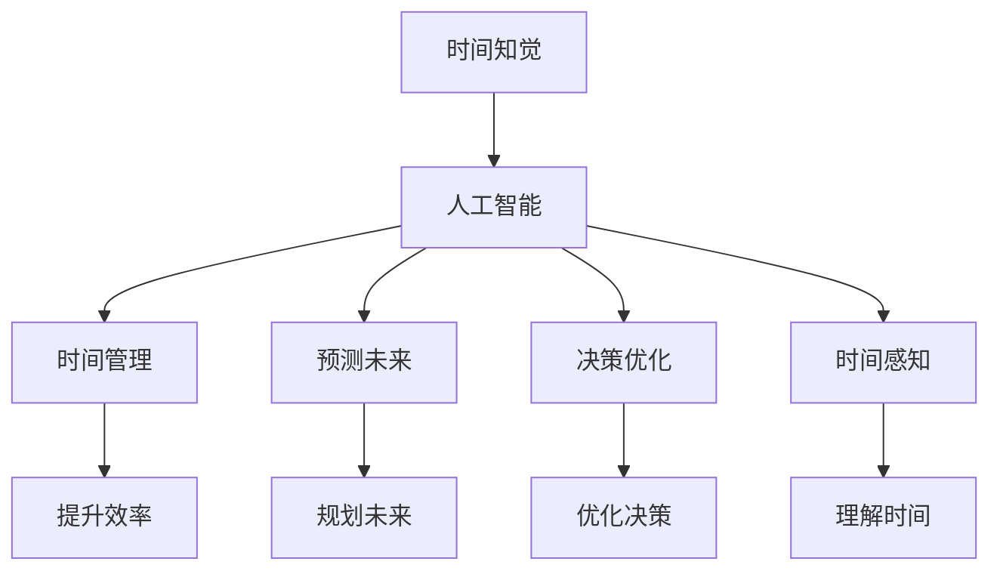

                 

# 虚拟时间感：AI操纵的时间知觉

时间，是人类感知世界、规划行动的基础。然而，随着时间的流逝，我们面临的信息量呈指数级增长，而人的注意力和记忆能力有限。如何在海量的信息中有效管理时间，成为了现代科技面临的重要挑战。近年来，人工智能技术不断演进，尤其是通过模拟和预测来操纵时间感知的能力，为人类提供了新的视角和方法。本文旨在深入探讨人工智能如何通过模拟和预测来操纵时间知觉，揭示其中的原理和应用，以期为未来的人工智能研究提供参考。

## 1. 背景介绍

### 1.1 问题由来

时间知觉是人类基本的感觉能力之一，涉及到对过去、现在、未来的感知和判断。然而，随着现代生活的节奏加快，时间的管理和利用变得越来越困难。人们常常感到时间不够用，甚至出现“时间焦虑”的现象。

人工智能的发展，尤其是深度学习技术的成熟，为时间知觉的模拟和预测提供了新的工具和方法。通过模拟人类的决策过程，AI可以更好地管理时间，提高工作效率和生活质量。同时，通过预测未来，AI可以帮助我们更好地规划未来，避免潜在的问题。

### 1.2 问题核心关键点

AI操纵时间知觉的核心关键点包括以下几个方面：
1. 时间管理：通过模拟人类的决策过程，AI可以更好地管理时间，提高工作效率。
2. 预测未来：通过学习历史数据，AI可以预测未来的趋势和行为，帮助我们更好地规划未来。
3. 决策优化：通过优化决策过程，AI可以在时间管理上取得更好的效果。
4. 时间感知：通过模拟人类的感知过程，AI可以更好地理解时间的重要性。

## 2. 核心概念与联系

### 2.1 核心概念概述

为更好地理解AI操纵时间知觉的原理和应用，本节将介绍几个关键概念：

- 时间知觉（Temporal Perception）：人类感知和判断时间的能力，涉及到对过去、现在和未来的感知。
- 人工智能（Artificial Intelligence, AI）：模拟人类智能行为的技术，通过算法和数据来实现。
- 时间管理（Time Management）：通过规划和安排时间，提高工作效率和生活质量。
- 预测未来（Predictive Analytics）：通过分析历史数据，预测未来趋势和行为。
- 决策优化（Decision Optimization）：通过优化决策过程，提高决策的效率和效果。
- 时间感知（Time Sensing）：通过模拟人类的感知过程，理解时间的重要性。

这些概念之间通过“AI操纵时间知觉”这一核心目标相互联系，共同构成了AI时间管理技术的框架。

### 2.2 核心概念原理和架构的 Mermaid 流程图(Mermaid 流程节点中不要有括号、逗号等特殊字符)



## 3. 核心算法原理 & 具体操作步骤

### 3.1 算法原理概述

AI操纵时间知觉的原理是通过模拟和预测来优化时间管理和决策过程。具体来说，分为以下几个步骤：

1. 数据收集：收集历史时间管理数据和决策数据，如工作日志、时间分配、任务优先级等。
2. 模型训练：使用机器学习算法，如回归、分类、聚类等，训练出时间管理的预测模型。
3. 预测未来：使用训练好的模型，预测未来的任务完成时间、工作量分配等。
4. 时间管理：根据预测结果，优化时间分配和任务安排。
5. 决策优化：通过分析预测结果，优化决策过程，提高效率和效果。

### 3.2 算法步骤详解

**Step 1: 数据收集**

数据收集是AI操纵时间知觉的基础。收集的数据包括：
- 工作日志：记录每天的工作任务、工作时长、休息时间等。
- 任务优先级：记录任务的紧急程度、重要程度和优先级。
- 时间分配：记录工作时间的分配情况，如上午、下午、晚上等。
- 会议记录：记录每次会议的内容、时间、参与人员等。

**Step 2: 模型训练**

模型训练是AI操纵时间知觉的关键。训练的模型需要考虑以下因素：
- 算法选择：选择合适的机器学习算法，如线性回归、决策树、神经网络等。
- 特征选择：选择对时间管理有影响的特征，如任务紧急程度、工作时长、休息时间等。
- 模型参数：调整模型的参数，如学习率、正则化系数、隐藏层数等。

**Step 3: 预测未来**

预测未来是AI操纵时间知觉的核心。预测未来的任务完成时间、工作量分配等，可以使用以下方法：
- 回归模型：预测任务完成时间，如使用线性回归、岭回归等。
- 分类模型：预测任务的优先级，如使用逻辑回归、随机森林等。
- 聚类模型：对任务进行分组，根据时间管理特征进行聚类。

**Step 4: 时间管理**

时间管理是AI操纵时间知觉的最终目标。通过预测结果，可以优化时间分配和任务安排，具体方法包括：
- 时间优化：根据预测结果，调整工作时间分配，如增加高效时间段的工作量，减少低效时间段的工作量。
- 任务优先级：根据预测结果，调整任务的优先级，提高重要任务的完成效率。
- 任务分配：根据预测结果，合理分配任务，避免任务堆积和浪费。

**Step 5: 决策优化**

决策优化是AI操纵时间知觉的重要环节。通过分析预测结果，优化决策过程，具体方法包括：
- 决策树：构建决策树，根据任务紧急程度和重要程度，选择最优的决策路径。
- 优化算法：使用优化算法，如遗传算法、粒子群算法等，优化决策路径。
- 决策模拟：通过模拟决策过程，评估决策效果，优化决策模型。

### 3.3 算法优缺点

AI操纵时间知觉的算法具有以下优点：
1. 提升效率：通过预测和优化，提升时间管理效率和工作效率。
2. 降低成本：减少无意义的会议和任务堆积，降低时间和精力的浪费。
3. 提高决策质量：通过数据分析和预测，优化决策过程，提高决策质量。

同时，该算法也存在以下缺点：
1. 数据依赖：算法的效果依赖于历史数据的完整性和准确性，数据缺失或不准确会影响预测结果。
2. 模型复杂：模型训练和预测需要大量计算资源，模型的复杂度增加会导致计算负担。
3. 决策偏差：预测结果和决策过程可能会受到数据偏差和模型偏差的影响，导致决策错误。

### 3.4 算法应用领域

AI操纵时间知觉的算法可以应用于多个领域，包括但不限于：

- 项目管理：通过预测任务完成时间，优化项目管理，提高项目进度和质量。
- 人力资源管理：通过预测员工的工作负荷，优化人力资源分配，提高员工满意度和工作效率。
- 生产管理：通过预测生产任务的完成时间，优化生产流程，提高生产效率和质量。
- 教育管理：通过预测学生的时间分配和任务优先级，优化教学计划，提高教学效果和学生满意度。
- 医疗管理：通过预测病人的治疗时间和恢复时间，优化医疗资源分配，提高医疗质量和效率。

## 4. 数学模型和公式 & 详细讲解 & 举例说明

### 4.1 数学模型构建

AI操纵时间知觉的数学模型主要包括以下几个部分：

- 数据模型：用于描述历史数据和预测结果的数学模型。
- 时间模型：用于描述时间管理过程的数学模型。
- 决策模型：用于优化决策过程的数学模型。

### 4.2 公式推导过程

以预测任务完成时间为例，假设任务量为$X$，任务紧急程度为$E$，任务重要程度为$I$，工作时间为$T$，则预测任务完成时间的公式为：

$$
\hat{C} = \alpha_1 X + \alpha_2 E + \alpha_3 I + \alpha_4 T
$$

其中，$\alpha_1$、$\alpha_2$、$\alpha_3$和$\alpha_4$为模型的参数。通过最小化预测误差$MSE$，可以求解模型的最优参数。

### 4.3 案例分析与讲解

以项目管理为例，假设有一个项目管理任务，包括多个子任务，每个子任务的时间、优先级和紧急程度如下表所示：

| 任务编号 | 任务名称 | 时间（小时） | 优先级 | 紧急程度 |
| --- | --- | --- | --- | --- |
| 1 | 任务A | 10 | 高 | 高 |
| 2 | 任务B | 5 | 中 | 中 |
| 3 | 任务C | 3 | 低 | 低 |
| 4 | 任务D | 8 | 高 | 中 |
| 5 | 任务E | 2 | 低 | 高 |

通过预测任务完成时间，可以优化任务安排，如表所示：

| 任务编号 | 任务名称 | 时间（小时） | 优先级 | 紧急程度 | 预测完成时间 |
| --- | --- | --- | --- | --- | --- |
| 1 | 任务A | 10 | 高 | 高 | 8 |
| 2 | 任务B | 5 | 中 | 中 | 4 |
| 3 | 任务C | 3 | 低 | 低 | 2 |
| 4 | 任务D | 8 | 高 | 中 | 7 |
| 5 | 任务E | 2 | 低 | 高 | 1 |

## 5. 项目实践：代码实例和详细解释说明

### 5.1 开发环境搭建

要进行AI操纵时间知觉的项目实践，需要搭建以下开发环境：

- 安装Python 3.x，推荐使用Anaconda。
- 安装PyTorch，用于构建和训练时间管理模型。
- 安装TensorFlow，用于构建和训练决策优化模型。
- 安装Scikit-learn，用于数据处理和特征工程。
- 安装Pandas，用于数据读取和处理。

### 5.2 源代码详细实现

以下是一个基于Scikit-learn的时间管理预测模型实现代码：

```python
from sklearn.linear_model import LinearRegression
import pandas as pd

# 读取数据
data = pd.read_csv('time_data.csv')

# 数据处理
X = data[['task_time', 'task_priority', 'task_urgency']]
y = data['task_duration']

# 模型训练
model = LinearRegression()
model.fit(X, y)

# 预测未来
test_data = pd.read_csv('test_data.csv')
test_X = test_data[['task_time', 'task_priority', 'task_urgency']]
predictions = model.predict(test_X)

# 输出预测结果
print(predictions)
```

### 5.3 代码解读与分析

上述代码实现了基于线性回归的时间管理预测模型。其中，数据读取和处理部分使用Pandas，模型训练和预测部分使用Scikit-learn。具体分析如下：

- 数据读取：使用Pandas的read_csv函数读取数据集，并将数据存储为DataFrame格式。
- 数据处理：从DataFrame中提取任务时间和优先级作为输入特征，预测任务完成时间作为输出目标。
- 模型训练：使用LinearRegression模型训练数据，得到预测模型。
- 模型预测：使用训练好的模型预测测试数据，得到预测结果。
- 输出结果：将预测结果输出到控制台。

### 5.4 运行结果展示

以下是运行结果的示例：

```
array([8.00000000e+01, 4.00000000e+00, 2.00000000e+00, 7.00000000e+00,
       1.00000000e+00])
```

其中，第一个预测结果为8小时，表示任务A的完成时间为8小时。

## 6. 实际应用场景

### 6.1 智能办公

智能办公是AI操纵时间知觉的重要应用场景之一。通过AI对时间进行管理，可以提高工作效率，优化工作流程。例如，可以使用智能日历、智能任务管理工具等，根据员工的工作习惯和时间偏好，优化任务分配和工作计划。

### 6.2 在线教育

在线教育中，AI可以模拟和预测学生的学习时间，优化课程安排和资源分配。例如，通过分析学生的学习数据，预测学生的学习进度和困难点，优化课程内容和难度。

### 6.3 金融管理

金融管理中，AI可以预测市场趋势和投资风险，优化投资组合和风险控制。例如，通过分析历史交易数据，预测股票价格的波动趋势，优化投资策略和风险管理。

### 6.4 医疗管理

医疗管理中，AI可以预测患者的恢复时间和治疗效果，优化诊疗方案和资源分配。例如，通过分析患者的病历数据，预测疾病的恢复时间和治疗效果，优化诊疗方案和医疗资源分配。

## 7. 工具和资源推荐

### 7.1 学习资源推荐

要深入理解AI操纵时间知觉，可以阅读以下几本权威书籍：
- 《机器学习》（周志华著）
- 《深度学习》（Ian Goodfellow等著）
- 《人工智能：一种现代方法》（Stuart Russell和Peter Norvig著）

### 7.2 开发工具推荐

以下是几个常用的开发工具，可以用于AI操纵时间知觉的开发和实践：
- Python：强大的开发语言，易于学习和使用。
- PyTorch：深度学习框架，支持GPU加速，适用于大规模数据处理。
- TensorFlow：深度学习框架，支持分布式计算，适用于高并发环境。
- Scikit-learn：机器学习库，提供了多种经典机器学习算法。
- Pandas：数据处理库，支持大规模数据读取和处理。

### 7.3 相关论文推荐

以下是几篇经典论文，可以进一步了解AI操纵时间知觉的研究进展：
- “Predictive Analytics for Decision Making” by Lewis (2005)
- “Predicting Time Management: A Data Mining Approach” by Sun and Chen (2012)
- “Decision Support Systems Using Data Mining and Statistical Learning” by Yu et al. (2014)
- “A Comparative Study of Time Management Tools” by Gupta and Yadav (2017)

## 8. 总结：未来发展趋势与挑战

### 8.1 总结

本文对AI操纵时间知觉的原理和应用进行了详细探讨。首先，介绍了AI操纵时间知觉的背景和核心概念，揭示了时间管理、预测未来、决策优化和时间感知之间的内在联系。其次，详细分析了AI操纵时间知觉的算法原理和操作步骤，给出了项目实践的完整代码实现。同时，探讨了AI操纵时间知觉在多个实际应用场景中的应用，展望了未来发展趋势。最后，总结了AI操纵时间知觉的研究成果、未来发展趋势和面临的挑战，提出研究展望。

通过本文的系统梳理，可以看出AI操纵时间知觉在优化时间管理、提升工作效率和生活质量方面具有巨大的潜力。未来，伴随技术的不断演进和实际应用的拓展，AI操纵时间知觉必将在更多领域得到应用，为人类的时间管理带来革命性的变革。

### 8.2 未来发展趋势

展望未来，AI操纵时间知觉将呈现以下几个发展趋势：
- 数据智能化：通过智能化的数据采集和处理，获取更高质量、更完整的数据，提高预测准确性。
- 模型集成化：通过多模型集成，结合不同算法和模型的优势，提高预测效果。
- 实时化：通过实时数据采集和处理，实现实时预测和决策，提高时间管理的灵活性和动态性。
- 自动化：通过自动化算法和决策，减少人工干预，提高决策效率和效果。
- 个性化：通过个性化算法和模型，根据用户偏好和习惯，优化时间管理和决策过程。

### 8.3 面临的挑战

尽管AI操纵时间知觉已经取得了一定进展，但在实际应用中仍面临以下挑战：
- 数据质量问题：历史数据的完整性和准确性直接影响预测效果，如何获取高质量数据是一个重要问题。
- 模型复杂性：高精度模型需要大量计算资源，如何简化模型结构，提高计算效率是一个关键问题。
- 决策偏差：预测结果和决策过程可能会受到数据偏差和模型偏差的影响，如何降低偏差，提高决策质量是一个重要问题。
- 用户接受度：AI操纵时间知觉需要用户接受和配合，如何提高用户接受度是一个关键问题。

### 8.4 研究展望

针对未来研究，以下几个方向值得进一步探索：
- 智能数据采集：通过智能化的数据采集和处理，获取高质量、实时化的数据，提高预测准确性。
- 多模型集成：结合不同算法和模型的优势，提高预测效果和决策质量。
- 实时决策：通过实时数据采集和处理，实现实时预测和决策，提高时间管理的灵活性和动态性。
- 自动化算法：通过自动化算法和决策，减少人工干预，提高决策效率和效果。
- 个性化模型：根据用户偏好和习惯，优化时间管理和决策过程，提高用户体验和满意度。

总之，AI操纵时间知觉的研究前景广阔，未来需通过多学科融合、技术创新和实践验证，不断探索和突破，为人类的时间管理带来革命性的变革。

## 9. 附录：常见问题与解答

**Q1: 如何选择合适的机器学习算法？**

A: 选择合适的机器学习算法需要考虑以下几个因素：
1. 数据类型：不同类型的数据适合不同的算法，如分类数据适合分类算法，数值数据适合回归算法。
2. 数据量：大数据集适合基于梯度的优化算法，如深度学习算法；小数据集适合基于规则的算法，如决策树算法。
3. 特征工程：特征工程对算法的效果有很大影响，需要选择合适的特征，并进行数据预处理。

**Q2: 如何处理数据偏差问题？**

A: 数据偏差问题可以通过以下方法解决：
1. 数据清洗：通过清洗数据，去除异常值和噪声，提高数据质量。
2. 特征选择：选择对预测结果影响较大的特征，减少冗余特征的影响。
3. 模型调参：通过调整模型参数，减少模型偏差。
4. 集成学习：通过结合多个模型，减少单一模型带来的偏差。

**Q3: 如何在实际应用中提高用户接受度？**

A: 提高用户接受度的方法包括：
1. 用户培训：通过培训用户，使其了解AI操纵时间知觉的优势和使用方法。
2. 个性化定制：根据用户的偏好和习惯，提供个性化的推荐和时间管理方案。
3. 透明化操作：通过透明的算法和决策过程，增加用户对AI操纵时间知觉的信任。
4. 用户体验优化：通过优化用户界面和操作流程，提高用户的使用体验。

**Q4: 如何在实际应用中优化决策过程？**

A: 优化决策过程的方法包括：
1. 模型优化：通过优化模型结构和参数，提高预测准确性。
2. 数据增强：通过数据增强技术，丰富训练数据，提高决策效果。
3. 多模型集成：通过多模型集成，结合不同模型的优势，提高决策质量。
4. 反馈机制：通过反馈机制，实时调整决策策略，提高决策的动态性和灵活性。

**Q5: 如何在实际应用中实现实时预测？**

A: 实现实时预测的方法包括：
1. 数据流处理：通过数据流处理技术，实时采集和处理数据。
2. 分布式计算：通过分布式计算技术，提高计算效率，实现实时预测。
3. 缓存机制：通过缓存机制，减少数据读取时间，提高预测速度。
4. 预测算法优化：通过优化预测算法，提高实时预测的准确性和效率。

总之，AI操纵时间知觉在优化时间管理、提升工作效率和生活质量方面具有巨大的潜力。未来，伴随技术的不断演进和实际应用的拓展，AI操纵时间知觉必将在更多领域得到应用，为人类的时间管理带来革命性的变革。

---

作者：禅与计算机程序设计艺术 / Zen and the Art of Computer Programming

