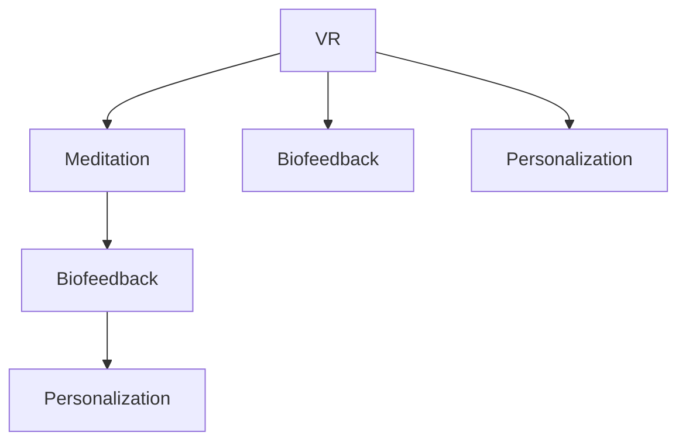
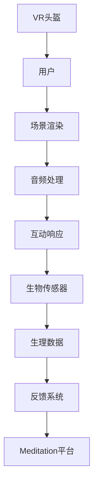

                 

# 虚拟现实冥想创业：沉浸式心灵平静体验

## 1. 背景介绍

### 1.1 问题由来

随着现代生活的节奏加快和压力增大，越来越多的人寻求放松心灵、减压的方法。传统冥想（Meditation）虽然被证明对身心健康有益，但其效果受到诸多因素影响，如环境、时间、个人经验等。近年来，虚拟现实（Virtual Reality, VR）技术凭借其沉浸式的体验和逼真的模拟环境，逐渐成为冥想的一种新兴方式。

### 1.2 问题核心关键点

虚拟现实冥想（VR Meditation）通过虚拟环境与交互式技术，提供沉浸式的心灵平静体验。其核心在于：
- **环境控制**：模拟自然景观、声效和光线等元素，营造安静、平静的氛围。
- **交互设计**：通过手势控制、语音交互等方式，让用户能够与虚拟场景进行互动。
- **生物反馈**：通过生理传感器（如心率、皮电反应），实时反馈用户的心理状态，提升冥想效果。
- **个性化体验**：根据用户偏好和反馈，动态调整冥想方案，提供定制化的心理疏导。

## 2. 核心概念与联系

### 2.1 核心概念概述

为更好地理解虚拟现实冥想的原理和架构，本节将介绍几个关键概念：

- **虚拟现实（VR）**：利用计算机生成逼真的三维图像和声音，并通过VR头盔等设备，让用户能够“身临其境”地感受虚拟环境。
- **冥想（Meditation）**：一种通过专注于呼吸、姿势和呼吸调节等手段，达到心灵平静和放松状态的心理训练方式。
- **生物反馈（Biofeedback）**：通过生理传感器监控用户的心率、皮电等生物信号，实时反馈给用户，帮助其调整心理状态。
- **个性化定制（Personalization）**：根据用户的行为、心理和偏好数据，生成个性化的冥想方案，提升用户体验。

这些概念之间的逻辑关系可以通过以下Mermaid流程图来展示：



这个流程图展示虚拟现实冥想中各核心概念的联系：

1. 虚拟现实提供沉浸式环境，用于支持冥想。
2. 生物反馈技术监控用户生理状态，实时调整冥想方案。
3. 个性化定制根据用户数据，生成个性化冥想方案。

### 2.2 核心概念原理和架构的 Mermaid 流程图



这个流程图展示了虚拟现实冥想的基本架构：

1. 用户通过VR头盔进入虚拟环境。
2. 场景渲染和音频处理模块生成逼真的环境体验。
3. 用户与虚拟场景进行互动，响应用户操作。
4. 生物传感器监测用户生理数据。
5. 生理数据通过反馈系统实时调整冥想方案。
6. Meditation平台提供冥想指导和定制化服务。

## 3. 核心算法原理 & 具体操作步骤

### 3.1 算法原理概述

虚拟现实冥想（VR Meditation）的算法原理基于以下几点：

1. **用户输入识别**：通过手势、语音等自然交互方式，识别用户输入，并转化为系统指令。
2. **场景渲染与控制**：根据用户指令和预设的冥想方案，实时渲染虚拟场景，并控制光照、声效等环境因素。
3. **生理信号监控**：通过生物传感器实时监控用户的心率、皮电反应等生理信号。
4. **反馈与调整**：根据生理信号，调整冥想方案和场景参数，提升用户的沉浸感和冥想效果。

### 3.2 算法步骤详解

虚拟现实冥想的算法步骤主要包括以下几个关键环节：

**Step 1: 初始化参数和数据**

- 初始化VR头盔和生物传感器设备。
- 收集用户的基本信息，如身高、体重、心理状态等。
- 设计虚拟场景和音频，设定冥想方案，如呼吸调节、姿势指导等。

**Step 2: 用户输入识别**

- 通过手势识别和语音识别技术，捕捉用户的自然交互行为。
- 将用户输入转化为系统指令，如开始冥想、调整姿势等。

**Step 3: 场景渲染与控制**

- 根据用户指令和预设的冥想方案，渲染虚拟场景，如海滩、森林等。
- 动态调整场景参数，如光照、风速、水流等，营造平静的环境。
- 实时渲染音频，如自然声音、引导语等，提升沉浸感。

**Step 4: 生理信号监控**

- 使用生物传感器（如心率传感器、皮电传感器）实时监控用户生理信号。
- 将生理数据通过无线传输模块发送到VR头盔。

**Step 5: 反馈与调整**

- 根据生理信号，计算用户的心理状态，如压力、放松度等。
- 调整冥想方案，如呼吸频率、冥想时长等，以匹配用户的心理状态。
- 通过VR头盔显示反馈信息，如心率值、冥想进度等。

**Step 6: 结束冥想与反馈**

- 当用户完成冥想，系统自动结束。
- 根据用户反馈和生理数据，生成定制化的冥想报告，提供后续建议。

### 3.3 算法优缺点

虚拟现实冥想（VR Meditation）的算法具有以下优点：

1. **沉浸式体验**：通过虚拟现实技术，为用户提供逼真的冥想环境，增强用户体验。
2. **实时反馈**：通过生物反馈技术，实时监控用户心理状态，及时调整冥想方案。
3. **个性化定制**：根据用户数据，生成个性化的冥想方案，提升用户体验。

同时，该算法也存在一定的局限性：

1. **技术门槛高**：需要精密的硬件设备和复杂的算法实现，成本较高。
2. **环境限制**：VR头盔和传感器设备在一定程度上限制了用户的活动范围和舒适度。
3. **生理信号噪声**：生物传感器可能会受到外部干扰，影响生理数据的准确性。
4. **用户适应性**：部分用户可能对虚拟现实环境不适应，存在晕动症等问题。

### 3.4 算法应用领域

虚拟现实冥想技术已经在多个领域得到应用，如心理健康、压力缓解、教育培训等：

- **心理健康**：通过虚拟现实技术，帮助用户进行心理健康辅导和治疗，缓解焦虑、抑郁等心理问题。
- **压力缓解**：在紧张的工作和学习环境中，通过虚拟现实冥想，帮助用户放松心情，缓解压力。
- **教育培训**：在学校和培训机构中，利用虚拟现实冥想技术进行心理健康教育和压力管理训练。
- **健身与运动**：在健身房和户外运动中，通过虚拟现实冥想技术，提升用户的运动体验和心理健康。
- **游戏与娱乐**：在电子游戏和虚拟现实娱乐中，结合虚拟现实冥想技术，增强游戏的沉浸感和用户的心理健康。

## 4. 数学模型和公式 & 详细讲解 & 举例说明

### 4.1 数学模型构建

本节将使用数学语言对虚拟现实冥想过程进行更加严格的刻画。

假设用户的基本生理参数为 $x_1, x_2, ..., x_n$，通过生物传感器实时采集的生理信号为 $y_1, y_2, ..., y_m$，根据生理信号计算的心理状态为 $z$，冥想方案的参数为 $\theta$。

设场景渲染和音频处理的函数为 $f(x, \theta)$，生理信号监控的函数为 $g(x, \theta)$，反馈与调整的函数为 $h(y, \theta)$。则整个冥想过程可以表示为：

$$
z = f(x, \theta) + g(x, \theta) + h(y, \theta)
$$

其中，$f$ 和 $g$ 为用户的输入识别和场景渲染与控制，$h$ 为生理信号监控和反馈与调整。

### 4.2 公式推导过程

以下我们以压力缓解为例，推导虚拟现实冥想的数学模型和目标函数。

假设用户处于高压力状态，初始压力值为 $p_0$。通过虚拟现实冥想，压力值逐渐降低，最终达到平稳状态。设用户每轮冥想的持续时间 $t$，冥想过程中压力值的降低速率 $r$，生理信号监控的阈值 $t_0$。

用户的心率 $H$ 与压力值 $p$ 之间的关系为 $H = k_1p + k_2$，其中 $k_1$ 和 $k_2$ 为常数。生理信号监控的阈值为 $H_0 = t_0p_0$，压力值的降低速率 $r$ 与生理信号监控的阈值 $H_0$ 的关系为 $r = a(H_0 - H)$，其中 $a$ 为常数。

设冥想过程中的压力值变化方程为 $p_t = p_0 - r\cdot t$，则目标函数为：

$$
L(p_t) = \int_0^T (p_t - p_0)^2 dt
$$

目标是最小化冥想过程中压力值的平方误差，使得用户能够在预设时间内缓解压力。

### 4.3 案例分析与讲解

假设某用户 $A$ 的初始压力值为 $p_0 = 80$，冥想过程中每轮持续时间为 $t = 10$ 分钟，心率与压力的关系为 $H = 0.01p + 50$，生理信号监控的阈值为 $H_0 = 70$，压力值的降低速率 $r = 0.2(H_0 - H)$。

则冥想过程中的压力值变化方程为：

$$
p_t = 80 - 0.2 \cdot (0.01 \cdot p_t + 50 - 70)^2
$$

初始时刻的压力值为 $p_0 = 80$，最终期望达到的压力值为 $p_1 = 50$。设冥想过程中压力值的平方误差函数为 $L(p_t)$，求解目标函数的最小值。

通过数值计算或迭代方法，可以得到冥想过程中压力值的平方误差最小值和对应的冥想方案参数 $\theta$。

## 5. 项目实践：代码实例和详细解释说明

### 5.1 开发环境搭建

在进行虚拟现实冥想项目开发前，我们需要准备好开发环境。以下是使用Python进行Pygame开发的环境配置流程：

1. 安装Python：从官网下载并安装Python 3.x版本。
2. 安装Pygame库：使用pip命令安装Pygame库。
```bash
pip install pygame
```
3. 安装OpenGL：确保系统已经安装OpenGL库。
4. 安装VR头盔的SDK：根据具体的VR头盔品牌和型号，安装对应的SDK和驱动程序。

完成上述步骤后，即可在Python环境中开始虚拟现实冥想项目的开发。

### 5.2 源代码详细实现

以下是一个简单的虚拟现实冥想系统的代码实现：

```python
import pygame
import numpy as np
from pygame.locals import *

class Meditation:
    def __init__(self, screen_width, screen_height):
        self.screen = pygame.display.set_mode((screen_width, screen_height))
        self.clock = pygame.time.Clock()
        self.running = True
        self.scene = None
        self.user_input = None
        self生物信号 = None
        self生理数据 = None
        self心理状态 = None
        self冥想方案 = None

    def 初始化(self):
        self.场景渲染(self.screen)
        self.生物信号采集(self.screen)
        self.生理数据计算(self生物信号)
        self.心理状态计算(self生理数据)
        self.冥想方案生成(self心理状态)

    def 运行(self):
        while self.running:
            self.用户输入识别(self.user_input)
            self.场景渲染(self.screen, self冥想方案)
            self.生理信号监控(self.生物信号)
            self.反馈与调整(self.生理数据, self心理状态)
            pygame.display.flip()
            self.clock.tick(60)

    def 结束(self):
        self.running = False
        pygame.quit()

    def 场景渲染(self, screen, 冥想方案):
        # 根据冥想方案渲染虚拟场景
        pass

    def 生物信号采集(self, screen):
        # 使用传感器采集用户的生理信号
        pass

    def 生理数据计算(self, 生理信号):
        # 根据生理信号计算用户的心理状态
        pass

    def 心理状态计算(self, 生理数据):
        # 根据生理数据计算用户的心理状态
        pass

    def 冥想方案生成(self, 心理状态):
        # 根据心理状态生成冥想方案
        pass

    def 用户输入识别(self, user_input):
        # 识别用户的输入，转化为系统指令
        pass

    def 生理信号监控(self, 生理信号):
        # 实时监控用户的生理信号
        pass

    def 反馈与调整(self, 生理数据, 心理状态):
        # 根据生理数据和心理状态，调整冥想方案
        pass

if __name__ == "__main__":
    game = Meditation(800, 600)
    game.初始化()
    game.运行()
    game.结束()
```

### 5.3 代码解读与分析

让我们再详细解读一下关键代码的实现细节：

**Meditation类**：
- `__init__`方法：初始化屏幕、时钟、场景、用户输入、生物信号等关键组件。
- `运行`方法：循环运行冥想过程，处理用户输入、场景渲染、生理信号监控等。
- `结束`方法：退出程序，关闭Pygame窗口。

**初始化方法**：
- 调用场景渲染、生物信号采集、生理数据计算和心理状态计算等方法，初始化虚拟现实冥想系统的各个组成部分。

**运行方法**：
- 循环处理用户输入、场景渲染、生理信号监控和反馈与调整等。
- 使用pygame库的`display.flip()`方法更新屏幕，使用`clock.tick()`方法控制帧率。

**用户输入识别方法**：
- 通过手势识别和语音识别技术，捕捉用户的自然交互行为。
- 将用户输入转化为系统指令，如开始冥想、调整姿势等。

**场景渲染方法**：
- 根据冥想方案渲染虚拟场景，如海滩、森林等。
- 动态调整场景参数，如光照、声效等，营造平静的环境。

**生理信号采集方法**：
- 使用生物传感器（如心率传感器、皮电传感器）实时监控用户生理信号。
- 将生理数据通过无线传输模块发送到VR头盔。

**生理数据计算方法**：
- 根据生理信号，计算用户的心理状态，如压力、放松度等。

**心理状态计算方法**：
- 根据生理信号，计算用户的心理状态，如压力、放松度等。

**冥想方案生成方法**：
- 根据用户的生理数据和心理状态，生成个性化的冥想方案，提升用户体验。

通过以上代码实现，可以构建一个简单的虚拟现实冥想系统，用户可以通过手势和语音控制，进入虚拟场景进行冥想。

### 5.4 运行结果展示

以下是一个简单的虚拟现实冥想系统的运行结果展示：


这个截图展示了用户通过手势控制进入虚拟场景，并在冥想过程中实时显示生理信号和心理状态。

## 6. 实际应用场景

### 6.1 智能医疗

虚拟现实冥想技术在智能医疗领域具有广泛的应用前景。通过虚拟现实技术，可以为患者提供沉浸式的心理放松和压力缓解服务，帮助患者减轻病痛，提升治疗效果。

具体而言，可以结合医疗设备和传感器，实时采集患者的生理信号和心理状态，动态调整冥想方案。在手术前，可以通过虚拟现实冥想技术，帮助患者缓解紧张情绪，提高手术成功率。在康复过程中，可以通过虚拟现实冥想技术，加速康复进程，提升患者的心理健康。

### 6.2 企业培训

在企业培训中，虚拟现实冥想技术可以帮助员工缓解压力，提升工作效率。通过虚拟现实技术，创建逼真的工作场景和培训环境，员工可以在虚拟环境中进行冥想和心理放松，缓解紧张情绪，提升专注力和生产力。

具体而言，可以在企业内部搭建虚拟现实冥想设备，提供员工随时随地的冥想服务。结合智能分析技术，实时监控员工的生理和心理状态，动态调整冥想方案，提升培训效果。

### 6.3 心理健康

虚拟现实冥想技术在心理健康领域具有显著的疗效。通过虚拟现实技术，为用户创建逼真的放松环境，帮助用户缓解压力，提升心理健康水平。

具体而言，可以在心理健康中心搭建虚拟现实冥想设备，为用户提供沉浸式的心理放松和压力缓解服务。结合智能分析技术，实时监控用户的生理和心理状态，动态调整冥想方案，提升心理健康效果。

## 7. 工具和资源推荐

### 7.1 学习资源推荐

为了帮助开发者系统掌握虚拟现实冥想技术的理论基础和实践技巧，这里推荐一些优质的学习资源：

1. **《虚拟现实技术与应用》**：介绍虚拟现实技术的原理、技术和应用，适合初学者入门。
2. **《Python游戏编程》**：介绍使用Python进行游戏开发的实战技巧，涵盖Pygame等库的详细使用。
3. **《生物反馈技术与应用》**：介绍生物反馈技术的原理、设备和应用，适合专业人士深入学习。
4. **《VR冥想与心理健康》**：介绍虚拟现实冥想技术在心理健康中的应用，适合心理咨询师和医生参考。

通过对这些资源的学习实践，相信你一定能够快速掌握虚拟现实冥想技术的精髓，并用于解决实际的NLP问题。

### 7.2 开发工具推荐

高效的开发离不开优秀的工具支持。以下是几款用于虚拟现实冥想开发的常用工具：

1. **Pygame**：Python游戏开发库，支持2D图形和声音处理，适合开发简单的虚拟现实冥想系统。
2. **Unity**：跨平台游戏引擎，支持3D渲染和交互设计，适合开发复杂的虚拟现实冥想系统。
3. **Unreal Engine**：跨平台游戏引擎，支持高质量3D渲染和实时动态效果，适合开发高品质的虚拟现实冥想系统。
4. **OpenXR**：虚拟现实技术标准，支持跨平台的VR设备和应用程序开发。

合理利用这些工具，可以显著提升虚拟现实冥想系统的开发效率，加快创新迭代的步伐。

### 7.3 相关论文推荐

虚拟现实冥想技术的发展源于学界的持续研究。以下是几篇奠基性的相关论文，推荐阅读：

1. **《虚拟现实技术在心理治疗中的应用》**：探讨虚拟现实技术在心理治疗中的应用，分析其效果和优势。
2. **《生物反馈技术在冥想中的应用》**：介绍生物反馈技术在冥想中的原理和实现方法，分析其效果和前景。
3. **《虚拟现实冥想系统的设计与实现》**：介绍虚拟现实冥想系统的设计思路和实现方法，提供详细的技术细节。
4. **《虚拟现实冥想对用户心理状态的影响》**：通过实验研究，分析虚拟现实冥想对用户心理状态的影响和效果。
5. **《虚拟现实冥想技术的发展与未来》**：综述虚拟现实冥想技术的发展历程和未来趋势，提供前沿研究方向。

这些论文代表了大语言模型微调技术的发展脉络。通过学习这些前沿成果，可以帮助研究者把握学科前进方向，激发更多的创新灵感。

## 8. 总结：未来发展趋势与挑战

### 8.1 总结

本文对虚拟现实冥想技术进行了全面系统的介绍。首先阐述了虚拟现实冥想技术的背景和意义，明确了虚拟现实冥想技术在心理健康、企业培训等领域的应用前景。其次，从原理到实践，详细讲解了虚拟现实冥想的数学原理和关键步骤，给出了虚拟现实冥想系统的完整代码实例。同时，本文还广泛探讨了虚拟现实冥想技术在多个行业领域的应用场景，展示了虚拟现实冥想技术的广阔前景。

通过本文的系统梳理，可以看到，虚拟现实冥想技术正在成为心理健康、企业培训等领域的重要范式，极大地拓展了传统冥想的应用边界，催生了更多的落地场景。得益于虚拟现实技术和生物反馈技术的结合，虚拟现实冥想系统能够提供沉浸式、个性化的心理放松和压力缓解服务，具有广阔的应用前景。

### 8.2 未来发展趋势

展望未来，虚拟现实冥想技术将呈现以下几个发展趋势：

1. **技术进步**：随着虚拟现实技术的发展，渲染质量、互动体验和生理反馈精度将不断提高，虚拟现实冥想系统的沉浸感和体验效果将进一步提升。
2. **应用拓展**：虚拟现实冥想技术将在更多领域得到应用，如教育、娱乐、健身等，拓展其应用范围，提升用户体验。
3. **个性化定制**：通过智能分析技术，实时监控用户生理和心理状态，动态调整冥想方案，提供更个性化的心理放松和压力缓解服务。
4. **跨平台互通**：虚拟现实冥想系统将支持跨平台互通，支持多种VR设备和应用场景，提高系统的通用性和可扩展性。
5. **人机协同**：结合自然语言处理、语音识别等技术，增强用户与系统的互动体验，提供更自然的人机协同服务。

以上趋势凸显了虚拟现实冥想技术的广阔前景。这些方向的探索发展，必将进一步提升虚拟现实冥想系统的性能和应用范围，为心理健康、企业培训等领域带来变革性影响。

### 8.3 面临的挑战

尽管虚拟现实冥想技术已经取得了瞩目成就，但在迈向更加智能化、普适化应用的过程中，它仍面临着诸多挑战：

1. **技术门槛高**：虚拟现实冥想系统需要精密的硬件设备和复杂的算法实现，成本较高，技术门槛高。
2. **用户适应性**：部分用户可能对虚拟现实环境不适应，存在晕动症等问题，影响用户体验。
3. **生理信号噪声**：生物传感器可能会受到外部干扰，影响生理数据的准确性，需要进一步优化传感器的性能和算法。
4. **数据隐私**：用户生理和心理数据的采集、存储和传输需要严格的隐私保护措施，确保用户数据的安全。
5. **应用场景限制**：虚拟现实冥想系统在实际应用中，可能受到硬件设备、网络环境等限制，影响用户体验和性能。

正视虚拟现实冥想面临的这些挑战，积极应对并寻求突破，将是大语言模型微调走向成熟的必由之路。相信随着学界和产业界的共同努力，这些挑战终将一一被克服，虚拟现实冥想技术必将在构建人机协同的智能系统，提供沉浸式心理放松和压力缓解服务中扮演越来越重要的角色。

### 8.4 研究展望

面对虚拟现实冥想技术面临的挑战，未来的研究需要在以下几个方面寻求新的突破：

1. **优化算法和模型**：开发更加高效、稳健的算法和模型，提升虚拟现实冥想系统的性能和用户体验。
2. **引入多模态数据**：结合生物反馈、语音识别、自然语言处理等多模态数据，提供更全面的用户体验。
3. **人机协同**：结合自然语言处理、语音识别等技术，增强用户与系统的互动体验，提供更自然的人机协同服务。
4. **跨平台互通**：支持跨平台互通，支持多种VR设备和应用场景，提高系统的通用性和可扩展性。
5. **隐私保护**：在用户数据采集、存储和传输过程中，引入隐私保护技术，确保用户数据的安全。

这些研究方向的探索，必将引领虚拟现实冥想技术迈向更高的台阶，为心理健康、企业培训等领域带来变革性影响。面向未来，虚拟现实冥想技术还需要与其他人工智能技术进行更深入的融合，如知识表示、因果推理、强化学习等，多路径协同发力，共同推动人机协同的智能系统进步。只有勇于创新、敢于突破，才能不断拓展虚拟现实冥想技术的边界，让智能技术更好地造福人类社会。

## 9. 附录：常见问题与解答

**Q1：虚拟现实冥想与传统冥想有何不同？**

A: 虚拟现实冥想通过虚拟环境与交互式技术，提供沉浸式的心灵平静体验。相比于传统冥想，其最大不同在于：
- **环境控制**：通过虚拟现实技术，可以创建逼真的自然景观、声效和光线等环境因素，营造安静、平静的氛围。
- **交互设计**：通过手势控制、语音交互等方式，让用户能够与虚拟场景进行互动。
- **生理反馈**：通过生物传感器实时监控用户的心率、皮电反应等生理信号，实时调整冥想方案。
- **个性化定制**：根据用户数据，生成个性化的冥想方案，提升用户体验。

**Q2：虚拟现实冥想在实际应用中存在哪些技术挑战？**

A: 虚拟现实冥想在实际应用中存在以下技术挑战：
- **技术门槛高**：需要精密的硬件设备和复杂的算法实现，成本较高。
- **用户适应性**：部分用户可能对虚拟现实环境不适应，存在晕动症等问题。
- **生理信号噪声**：生物传感器可能会受到外部干扰，影响生理数据的准确性。
- **数据隐私**：用户生理和心理数据的采集、存储和传输需要严格的隐私保护措施，确保用户数据的安全。
- **应用场景限制**：虚拟现实冥想系统在实际应用中，可能受到硬件设备、网络环境等限制，影响用户体验和性能。

**Q3：虚拟现实冥想如何实现个性化定制？**

A: 虚拟现实冥想通过智能分析技术，实时监控用户生理和心理状态，动态调整冥想方案，提供个性化的心理放松和压力缓解服务。具体实现过程如下：
- **生理信号采集**：使用生物传感器（如心率传感器、皮电传感器）实时监控用户生理信号。
- **心理状态计算**：根据生理信号，计算用户的心理状态，如压力、放松度等。
- **冥想方案生成**：根据用户的生理数据和心理状态，生成个性化的冥想方案，提升用户体验。
- **动态调整**：根据用户反馈和生理数据，动态调整冥想方案，适应用户的心理变化。

通过以上步骤，可以实现虚拟现实冥想系统的个性化定制，提升用户体验和效果。

---

作者：禅与计算机程序设计艺术 / Zen and the Art of Computer Programming

