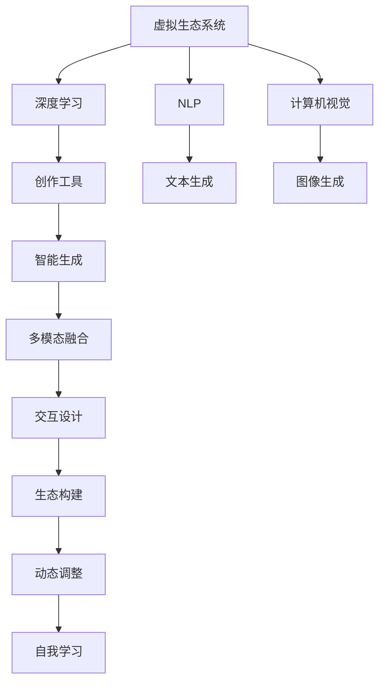

                 

# 虚拟生态系统建筑师：AI驱动的数字世界创造者

> 关键词：虚拟生态系统, 人工智能, 数字世界, 创造者, 生态设计, 自动化, 深度学习, 自然语言处理(NLP), 计算机视觉, 模型训练, 数据驱动, 云计算

## 1. 背景介绍

### 1.1 问题由来

随着人工智能技术的迅猛发展，AI驱动的数字世界创造正迅速成为新时代的重要趋势。通过深度学习、计算机视觉、自然语言处理等前沿技术，AI系统能够从海量数据中自动提取知识、生成创意、设计方案，在建筑设计、影视制作、虚拟现实(VR)、游戏开发等多个领域，展现出前所未有的潜力。

然而，当前AI驱动的设计和创造工作往往依赖于大量的人工标注和复杂的手动干预，效率低、成本高，难以快速响应变化。如何利用AI技术自动构建并优化数字世界，提高创作效率和质量，成为了迫切需要解决的问题。

### 1.2 问题核心关键点

构建AI驱动的数字世界创造系统，需要解决的核心问题包括：

- **数据获取与处理**：从何种来源获取高质量的创作素材数据，并通过数据处理技术，将其转化为适合AI模型训练的数据集。
- **模型训练与优化**：设计合适的AI模型架构，进行高效的数据驱动训练，并通过自动化调优技术提升模型性能。
- **创作辅助与智能生成**：开发智能工具和算法，支持设计者进行创意构思、方案设计、自动化生成等，提高创作效率和质量。
- **多模态融合与交互**：实现多模态数据的融合，并构建虚拟生态系统，促进人与人、人与机器、机器与机器间的交互协作。
- **动态调整与自我学习**：设计机制使系统能够根据反馈和需求，动态调整设计思路，自我学习和优化。

这些核心问题相互关联，共同构成了一个复杂的AI驱动数字世界创造系统。

## 2. 核心概念与联系

### 2.1 核心概念概述

为了更好地理解AI驱动的数字世界创造系统，我们需要理解几个关键概念：

- **虚拟生态系统**：指由AI系统构建的多模态交互环境，其中包含了多种AI模型和服务，相互协作，共同提供创作、设计、交互等功能。

- **数字世界**：指由虚拟生态系统构建的，具备高度仿真、智能化、交互性的虚拟空间。数字世界通过AI技术，能够模拟现实世界的各种场景和行为。

- **AI驱动**：指AI系统作为核心技术，承担数据处理、模型训练、智能生成、多模态融合等任务，驱动数字世界的创建与演化。

- **创作工具**：指支持设计师进行方案设计、创意构思、自动化生成等工作的智能工具。创作工具集成AI算法，能够根据设计师的输入，提供实时反馈和建议。

- **深度学习**：指一类基于神经网络的机器学习方法，通过多层非线性变换，实现复杂模式识别和智能生成。

- **自然语言处理(NLP)**：指利用AI技术，使计算机能够理解、处理、生成自然语言的能力。NLP技术在对话、问答、文本生成等方面应用广泛。

- **计算机视觉**：指利用AI技术，使计算机能够理解、处理、生成视觉信息的领域。计算机视觉技术在图像识别、目标检测、场景理解等方面有重要应用。

这些概念共同构成了AI驱动数字世界创造的基本框架，为我们探索如何构建高效、智能、自适应、可扩展的虚拟生态系统提供了基础。

### 2.2 核心概念原理和架构的 Mermaid 流程图(Mermaid 流程节点中不要有括号、逗号等特殊字符)



这个Mermaid流程图展示了虚拟生态系统的基本架构，各个模块通过深度学习、NLP、计算机视觉等技术相互关联，共同构建创作工具和智能生成系统，支持多模态融合和交互设计，最终形成动态调整和自我学习的虚拟生态系统。

## 3. 核心算法原理 & 具体操作步骤

### 3.1 算法原理概述

AI驱动的数字世界创造系统，核心算法包括深度学习、自然语言处理、计算机视觉等。这些算法通过数据驱动的方式，实现模式识别、智能生成、多模态融合等功能。

以文本生成为例，深度学习模型（如GAN、Transformer等）可以从训练数据中学习到语言的语法、语义和风格规律，并能够生成逼真的自然语言文本。自然语言处理技术（如BERT、GPT等）可以理解文本含义，提供词向量表示，辅助文本生成模型的训练和优化。

### 3.2 算法步骤详解

构建AI驱动的数字世界创造系统，通常需要以下几个关键步骤：

**Step 1: 数据收集与预处理**

1. 确定所需创作素材的类型和来源，如图片、音频、文本等。
2. 从互联网、公共数据集、用户生成内容等渠道，获取高质量的创作素材数据。
3. 对数据进行清洗、标注、分割等预处理，确保数据质量和一致性。
4. 使用数据增强技术，如数据扩充、回译等，丰富训练集的多样性。

**Step 2: 模型设计与训练**

1. 选择合适的深度学习模型架构，如GAN、Transformer、CNN等。
2. 设计合适的损失函数和优化器，如交叉熵损失、Adam优化器等。
3. 使用大规模数据集进行模型训练，通过迭代优化提升模型性能。
4. 应用正则化技术，如L2正则、Dropout等，防止过拟合。
5. 在验证集上评估模型效果，调整超参数和模型结构，确保最佳性能。

**Step 3: 创作工具与智能生成**

1. 开发支持多模态数据的创作工具，集成深度学习、自然语言处理等技术。
2. 设计可视化界面，支持设计师输入创意、设计方案、反馈等操作。
3. 实时捕捉用户输入，通过AI算法生成文本、图像、音频等创作素材。
4. 提供智能建议，帮助设计师优化方案、调整风格等。

**Step 4: 多模态融合与交互设计**

1. 实现多模态数据的融合，支持文本、图像、音频等数据的协同处理。
2. 构建虚拟生态系统，支持用户与系统、用户与用户、系统与系统间的交互。
3. 设计交互界面，支持自然语言问答、手势控制、VR体验等交互方式。
4. 实时响应用户输入，提供实时反馈和调整。

**Step 5: 动态调整与自我学习**

1. 设计反馈机制，收集用户评价、优化建议等反馈信息。
2. 基于反馈信息，动态调整AI模型的训练目标和参数设置。
3. 应用持续学习技术，不断优化模型性能，适应新需求。
4. 应用对抗训练、迁移学习等技术，提升模型的鲁棒性和泛化能力。

### 3.3 算法优缺点

AI驱动的数字世界创造系统具有以下优点：

- **高效创作**：通过自动化创作工具和智能生成技术，显著提升创作效率，减少人力投入。
- **高质量生成**：深度学习等算法能够生成高质量、风格多样的创作素材。
- **多模态融合**：支持多模态数据的融合，提供更丰富、逼真的创作体验。
- **用户互动**：通过虚拟生态系统，实现人机互动，提升用户体验和满意度。
- **灵活调整**：能够根据反馈和需求，动态调整和优化模型，提升创作效果。

但同时也存在一些缺点：

- **数据依赖**：系统高度依赖高质量、大规模的训练数据，数据获取和处理成本较高。
- **算法复杂**：深度学习等技术算法复杂，模型训练和优化难度较大。
- **用户依赖**：需要设计师和用户的积极参与，才能提供优质的反馈和创意。
- **模型鲁棒性**：模型对输入数据的噪声、异常值等敏感，易受干扰。
- **交互界面设计**：用户界面设计复杂，用户体验和交互流畅度需要不断优化。

## 4. 数学模型和公式 & 详细讲解 & 举例说明（备注：数学公式请使用latex格式，latex嵌入文中独立段落使用 $$，段落内使用 $)
### 4.1 数学模型构建

以文本生成为例，构建一个基于Transformer的文本生成模型。假设输入为序列 $X = \{x_1, x_2, ..., x_T\}$，输出为序列 $Y = \{y_1, y_2, ..., y_T\}$。模型定义如下：

$$
Y = \text{Transformer}(X)
$$

Transformer模型的核心架构包括编码器-解码器结构，每层由多头自注意力机制和前馈神经网络构成。输入 $X$ 通过编码器转换为中间表示 $H$，再通过解码器生成输出 $Y$。编码器-解码器的参数共享，以提升模型的泛化能力。

### 4.2 公式推导过程

以Transformer的编码器为例，推导其核心公式。假设输入序列长度为 $T$，特征维度为 $d$，多头注意力机制的维度为 $d_k$，多头注意力头数为 $h$。编码器的输出表示为：

$$
H = \text{Encoder}(X) = \text{Attention}(X, H^{(0)}) + H^{(0)}
$$

其中，$\text{Attention}(X, H^{(0)})$ 为多头自注意力机制，$H^{(0)}$ 为初始隐表示。注意力机制公式为：

$$
\text{Attention}(Q, K, V) = \text{Softmax}(\frac{QK^T}{\sqrt{d_k}})V
$$

其中，$Q, K, V$ 分别为查询、键、值矩阵，$\text{Softmax}$ 函数用于计算注意力权重，$QK^T$ 为查询向量和键向量的点积。

### 4.3 案例分析与讲解

以图像生成为例，使用GAN（Generative Adversarial Networks）模型生成逼真的自然图像。GAN模型由生成器和判别器两部分组成，生成器负责生成假图像，判别器负责判断图像的真实性。模型定义如下：

$$
G(Z) = \text{GAN}(X) = \text{Decoder}(\text{Encoder}(Z))
$$

其中，$Z$ 为噪声向量，$X$ 为输入图像，$\text{Encoder}$ 和 $\text{Decoder}$ 分别为编码器和解码器。模型训练时，生成器和判别器通过对抗训练（Adversarial Training）相互博弈，最终生成逼真的图像。

## 5. 项目实践：代码实例和详细解释说明
### 5.1 开发环境搭建

为构建AI驱动的数字世界创造系统，需要进行如下开发环境搭建：

1. 安装Python和相关依赖库，如TensorFlow、PyTorch、OpenCV等。
2. 搭建分布式计算环境，如Docker、Kubernetes等，支持大规模数据处理和模型训练。
3. 配置云计算资源，如AWS、Google Cloud、阿里云等，支持高性能计算和存储需求。
4. 部署Web服务器，如Nginx、Apache等，支持创作工具和交互界面的部署。

### 5.2 源代码详细实现

以下以图像生成为例，提供使用TensorFlow和Keras框架实现GAN模型的代码实现：

```python
import tensorflow as tf
from tensorflow.keras import layers

# 定义生成器和判别器
class Generator(tf.keras.Model):
    def __init__(self, latent_dim, img_dim):
        super(Generator, self).__init__()
        self.img_dim = img_dim
        self.dense1 = layers.Dense(256, input_dim=latent_dim)
        self.dense2 = layers.Dense(512)
        self.dense3 = layers.Dense(img_dim, activation='tanh')
        
    def call(self, z):
        x = self.dense1(z)
        x = layers.LeakyReLU(alpha=0.2)(x)
        x = self.dense2(x)
        x = layers.LeakyReLU(alpha=0.2)(x)
        x = self.dense3(x)
        return x

class Discriminator(tf.keras.Model):
    def __init__(self, img_dim):
        super(Discriminator, self).__init__()
        self.img_dim = img_dim
        self.flatten = layers.Flatten()
        self.dense1 = layers.Dense(256)
        self.dense2 = layers.Dense(1, activation='sigmoid')
        
    def call(self, img):
        x = self.flatten(img)
        x = self.dense1(x)
        x = layers.LeakyReLU(alpha=0.2)(x)
        x = self.dense2(x)
        return x

# 定义GAN模型
class GAN(tf.keras.Model):
    def __init__(self, latent_dim, img_dim):
        super(GAN, self).__init__()
        self.generator = Generator(latent_dim, img_dim)
        self.discriminator = Discriminator(img_dim)
        
    def call(self, z):
        img = self.generator(z)
        real = self.discriminator(img)
        real = self.discriminator(tf.random.normal(shape=(img.shape[0], self.discriminator.img_dim)))
        real += 0.5 * tf.random.normal(shape=(img.shape[0], self.discriminator.img_dim))
        fake = self.discriminator(img)
        return real, fake

# 定义损失函数和优化器
loss_fn = tf.keras.losses.BinaryCrossentropy()
optimizer = tf.keras.optimizers.Adam()

# 训练GAN模型
@tf.function
def train_step(img):
    with tf.GradientTape() as gen_tape, tf.GradientTape() as disc_tape:
        gen_input = tf.random.normal(shape=(64, latent_dim))
        real = img
        fake = generator(gen_input)
        real_loss = loss_fn(discriminator(real), tf.ones_like(real))
        fake_loss = loss_fn(discriminator(fake), tf.zeros_like(fake))
        total_loss = real_loss + fake_loss
        
        gradients_of_generator = gen_tape.gradient(total_loss, generator.trainable_variables)
        gradients_of_discriminator = disc_tape.gradient(total_loss, discriminator.trainable_variables)
        
        optimizer.apply_gradients(zip(gradients_of_generator, generator.trainable_variables))
        optimizer.apply_gradients(zip(gradients_of_discriminator, discriminator.trainable_variables))
```

### 5.3 代码解读与分析

以上代码展示了使用TensorFlow和Keras框架实现GAN模型的全过程。代码中定义了生成器和判别器，构建了GAN模型，并定义了损失函数和优化器。训练时，通过前向传播和反向传播更新模型参数，实现对抗训练。

需要注意的是，GAN模型训练过程具有高度的非稳定性，需要精心调参和调试，才能获得高质量的生成图像。代码中使用了@tf.function装饰器，将训练过程转化为TensorFlow函数，提高了训练效率和稳定性和。

## 6. 实际应用场景

### 6.1 智能建筑设计

AI驱动的数字世界创造系统，可以应用于智能建筑设计。通过整合深度学习、计算机视觉、自然语言处理等技术，系统能够自动生成建筑设计方案，进行风格转换、自动化渲染等。设计师可以根据系统生成的方案，快速进行创意构思和优化调整，提高设计效率和质量。

具体而言，系统可以通过设计者输入的建筑描述，使用自然语言处理技术理解设计意图，使用计算机视觉技术捕捉建筑图样，自动生成建筑设计和方案。设计师可以随时对生成方案进行调整和优化，最终得到符合设计要求的高质量建筑设计。

### 6.2 虚拟现实游戏开发

AI驱动的数字世界创造系统，还可以应用于虚拟现实游戏开发。通过深度学习、计算机视觉、自然语言处理等技术，系统能够自动生成逼真的游戏场景、角色、物品等，提供自然流畅的互动体验。游戏开发者可以根据系统生成的素材，快速进行创意构思和优化调整，提高游戏制作效率和质量。

具体而言，系统可以通过游戏场景描述，使用自然语言处理技术生成场景图样，使用计算机视觉技术捕捉游戏角色动作，自动生成逼真的游戏场景和角色。游戏开发者可以随时对生成素材进行调整和优化，最终得到符合设计要求的高质量游戏素材。

### 6.3 虚拟展览

AI驱动的数字世界创造系统，可以应用于虚拟展览。通过深度学习、计算机视觉、自然语言处理等技术，系统能够自动生成虚拟展览素材，进行自动化渲染和交互设计，提供沉浸式参观体验。展览组织者可以根据系统生成的素材，快速进行展览设计和管理，提高展览质量和参观体验。

具体而言，系统可以通过展览描述，使用自然语言处理技术生成展览素材，使用计算机视觉技术进行场景渲染，自动生成虚拟展览。展览组织者可以随时对生成素材进行调整和优化，最终得到符合展览要求的高质量展览素材。

### 6.4 未来应用展望

未来，AI驱动的数字世界创造系统将在更多领域得到应用，为各行各业带来变革性影响。

- **智慧城市**：通过AI驱动的数字世界创造系统，可以实现智慧城市的城市规划、建筑设计、环境监控等功能，提升城市管理水平和居民生活品质。
- **医疗健康**：通过AI驱动的数字世界创造系统，可以实现智慧医疗的远程诊断、个性化治疗、医学图像生成等功能，提升医疗服务水平和患者体验。
- **教育培训**：通过AI驱动的数字世界创造系统，可以实现智能教育的个性化教学、虚拟实验室、虚拟场景模拟等功能，提升教育培训效果和学生学习体验。
- **金融服务**：通过AI驱动的数字世界创造系统，可以实现智能金融的智能投顾、智能风控、智能客服等功能，提升金融服务水平和客户满意度。
- **创意设计**：通过AI驱动的数字世界创造系统，可以实现创意设计的智能辅助、智能生成、智能优化等功能，提升创意设计效率和质量。

随着技术的不断发展，未来AI驱动的数字世界创造系统将在更多领域得到应用，为各行各业带来变革性影响。

## 7. 工具和资源推荐

### 7.1 学习资源推荐

为了帮助开发者系统掌握AI驱动的数字世界创造技术，这里推荐一些优质的学习资源：

1. **Deep Learning Specialization**：由Andrew Ng教授主讲的Coursera深度学习课程，涵盖深度学习的基础理论和实践应用。
2. **CS231n：Convolutional Neural Networks for Visual Recognition**：斯坦福大学开设的计算机视觉课程，讲解计算机视觉的经典算法和前沿研究。
3. **Natural Language Processing Specialization**：由Christopher Manning教授主讲的Coursera自然语言处理课程，涵盖自然语言处理的基础理论和应用实践。
4. **Transformers in Action**：由Thomas Rokem和Ronen G Properties教授主讲的Coursera Transformers课程，讲解Transformer模型的理论和应用。
5. **GANs for Real-Time Arbitrary Style Transfer**：由Adnan Dalca教授主讲的Coursera深度学习课程，讲解GAN模型的理论和应用。

通过这些课程的学习实践，相信你一定能够系统掌握AI驱动的数字世界创造技术，并应用于实际的创作设计中。

### 7.2 开发工具推荐

高效的开发离不开优秀的工具支持。以下是几款用于AI驱动的数字世界创造开发的常用工具：

1. **TensorFlow**：由Google主导开发的开源深度学习框架，生产部署方便，适合大规模工程应用。
2. **PyTorch**：由Facebook主导开发的开源深度学习框架，灵活高效，适合快速迭代研究。
3. **Keras**：基于TensorFlow和Theano的高层API，提供简单易用的API接口，支持快速模型构建。
4. **Jupyter Notebook**：支持Python和R等语言的交互式编程环境，便于编写和运行Python代码。
5. **VS Code**：开源的跨平台IDE，支持多种编程语言和扩展，便于开发和调试。

合理利用这些工具，可以显著提升AI驱动的数字世界创造任务的开发效率，加快创新迭代的步伐。

### 7.3 相关论文推荐

AI驱动的数字世界创造技术的发展源于学界的持续研究。以下是几篇奠基性的相关论文，推荐阅读：

1. **Generative Adversarial Nets**：Ian Goodfellow等人发表的GAN模型论文，奠定了GAN模型的理论基础。
2. **Attention Is All You Need**：Ashish Vaswani等人发表的Transformer模型论文，开创了基于自注意力机制的深度学习模型。
3. **BERT: Pre-training of Deep Bidirectional Transformers for Language Understanding**：Jacob Devlin等人发表的BERT模型论文，展示了预训练语言模型在NLP任务上的强大性能。
4. **Human Interpretation of Deep Learning Models**：Jacob Perkins等人发表的论文，讨论了深度学习模型的可解释性和人类解释的需求。
5. **Deep Learning for Flexibility**：Han Liu等人发表的论文，讨论了深度学习模型在自动化设计中的应用。

这些论文代表了大语言模型微调技术的发展脉络。通过学习这些前沿成果，可以帮助研究者把握学科前进方向，激发更多的创新灵感。

## 8. 总结：未来发展趋势与挑战

### 8.1 总结

本文对AI驱动的数字世界创造技术进行了全面系统的介绍。首先阐述了AI驱动的数字世界创造系统的背景和意义，明确了系统构建的核心问题。其次，从原理到实践，详细讲解了系统设计的关键步骤，给出了实际应用场景的代码实现。最后，总结了未来技术发展趋势和面临的挑战，提出了研究方向展望。

通过本文的系统梳理，可以看到，AI驱动的数字世界创造系统正在成为新一代AI技术的重要应用方向，极大地拓展了人工智能在虚拟生态系统中的应用边界，为各行各业带来了全新的变革。未来，伴随AI技术的持续演进，相信AI驱动的数字世界创造系统将进一步拓展应用领域，引领AI技术的发展潮流。

### 8.2 未来发展趋势

展望未来，AI驱动的数字世界创造技术将呈现以下几个发展趋势：

1. **多模态融合**：系统将更加重视多模态数据的融合，支持文本、图像、音频等多种模态数据的协同处理，提升创作体验和效果。
2. **实时交互**：系统将更加注重实时交互体验，支持自然语言问答、手势控制、VR体验等多种交互方式，增强用户参与度。
3. **自动化设计**：系统将更加自动化和智能化，支持智能辅助、智能生成、智能优化等功能，提升设计效率和质量。
4. **个性化定制**：系统将更加注重个性化定制，根据用户需求和偏好，生成符合要求的创作素材，提升用户满意度和体验。
5. **跨领域应用**：系统将更加广泛地应用于智慧城市、医疗健康、教育培训、金融服务、创意设计等多个领域，带来深远影响。
6. **可持续发展**：系统将更加注重可持续性和环保，支持虚拟生态系统的动态调整和优化，减少资源消耗和环境影响。

这些趋势凸显了AI驱动的数字世界创造技术的广阔前景。这些方向的探索发展，必将进一步提升系统性能和应用范围，为人类社会带来深刻的变革。

### 8.3 面临的挑战

尽管AI驱动的数字世界创造技术已经取得了瞩目成就，但在迈向更加智能化、普适化应用的过程中，仍面临诸多挑战：

1. **数据质量与获取**：高质量、大规模的创作素材数据获取和处理成本较高，难以快速构建完备的数据集。
2. **算法复杂与调参**：深度学习等算法复杂，模型训练和优化难度较大，需要精心调参和调试。
3. **用户参与与交互**：系统需要设计师和用户的积极参与，才能提供优质的反馈和创意，互动体验仍有待提升。
4. **模型鲁棒性与泛化**：模型对输入数据的噪声、异常值等敏感，易受干扰，鲁棒性和泛化能力有待提升。
5. **交互界面与体验**：用户界面设计复杂，用户体验和交互流畅度需要不断优化，互动体验仍有提升空间。

这些挑战需要在未来研究中不断克服，以推动AI驱动的数字世界创造技术进一步发展。

### 8.4 研究展望

面对AI驱动的数字世界创造技术所面临的挑战，未来的研究需要在以下几个方面寻求新的突破：

1. **数据增强与预处理**：探索更多数据增强和预处理技术，提高数据质量和多样性，降低数据获取和处理的成本。
2. **模型架构与优化**：研究更高效的模型架构和优化方法，提高模型训练和调参效率，提升模型性能和泛化能力。
3. **用户互动与体验**：设计更加自然流畅的交互界面和体验，提高用户参与度和满意度，提升互动效果。
4. **多模态融合与交互**：研究多模态数据的融合方法和交互技术，支持文本、图像、音频等多种模态数据的协同处理，提升创作体验和效果。
5. **模型鲁棒性与泛化**：研究提高模型鲁棒性和泛化能力的技术，提升模型的稳定性和泛化性能，增强系统的适用性和可靠性。

这些研究方向凸显了AI驱动的数字世界创造技术的复杂性和挑战性。只有不断创新、不断突破，才能将这一技术推向新的高度，实现AI驱动的数字世界创造系统的广泛应用。

## 9. 附录：常见问题与解答

**Q1：AI驱动的数字世界创造系统与传统创作工具相比有何优势？**

A: AI驱动的数字世界创造系统具有以下几个优势：

1. **自动化创作**：通过深度学习等技术，系统能够自动生成高质量、风格多样的创作素材，提高创作效率和质量。
2. **多模态融合**：支持文本、图像、音频等多种模态数据的协同处理，提供更加丰富、逼真的创作体验。
3. **实时交互**：支持自然语言问答、手势控制、VR体验等多种交互方式，提升用户参与度和满意度。
4. **智能优化**：能够根据用户反馈和需求，动态调整和优化创作素材和模型，提升创作效果。

**Q2：如何选择合适的深度学习模型进行数字世界创造？**

A: 选择合适的深度学习模型需要考虑以下几个因素：

1. **任务类型**：根据创作素材类型和任务需求，选择合适的模型。如文本生成使用Transformer，图像生成使用GAN等。
2. **数据规模**：根据创作素材数据规模和质量，选择合适的模型。大规模数据集适合使用复杂的模型，小规模数据集适合使用参数高效的模型。
3. **计算资源**：根据计算资源和硬件设备，选择合适的模型。高性能设备适合使用复杂的模型，普通设备适合使用轻量级模型。
4. **性能要求**：根据创作素材质量和性能要求，选择合适的模型。高质量素材适合使用复杂的模型，低质量素材适合使用简单的模型。

**Q3：如何训练高效的AI驱动的数字世界创造系统？**

A: 训练高效的AI驱动的数字世界创造系统需要考虑以下几个方面：

1. **数据预处理**：对创作素材进行清洗、标注、分割等预处理，确保数据质量和一致性。
2. **模型设计**：选择合适的模型架构，设计合适的损失函数和优化器，使用正则化技术防止过拟合。
3. **超参数调优**：通过网格搜索、随机搜索等方法，调整模型参数和超参数，提升模型性能。
4. **模型验证**：在验证集上评估模型效果，调整模型结构，确保最佳性能。
5. **模型部署**：将模型部署到高性能计算和存储环境中，支持实时创作和交互。

**Q4：AI驱动的数字世界创造系统如何支持实时交互？**

A: 支持实时交互需要考虑以下几个方面：

1. **自然语言处理**：使用自然语言处理技术，实现自然语言问答和文本输入输出。
2. **多模态融合**：支持文本、图像、音频等多种模态数据的协同处理，提供自然流畅的交互体验。
3. **实时渲染**：使用高性能计算和渲染技术，支持实时渲染和交互。
4. **智能优化**：根据用户输入和反馈，动态调整和优化创作素材和模型，提升互动效果。

**Q5：如何设计高效的AI驱动的数字世界创造系统？**

A: 设计高效的AI驱动的数字世界创造系统需要考虑以下几个方面：

1. **需求分析**：分析用户需求和任务需求，明确系统功能和性能要求。
2. **系统架构**：设计合理的系统架构，支持多模态数据的融合和实时交互。
3. **技术选择**：选择合适的技术栈和工具，支持高效开发和部署。
4. **用户体验**：设计自然流畅的用户界面和体验，提升用户参与度和满意度。
5. **系统测试**：进行系统测试和优化，确保系统稳定性和可靠性。

通过这些方法，可以设计出高效、智能、自适应、可扩展的AI驱动的数字世界创造系统。

---

作者：禅与计算机程序设计艺术 / Zen and the Art of Computer Programming

