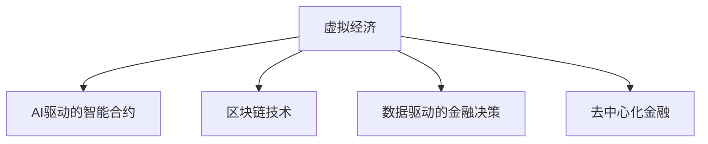

                 

# 虚拟经济模型：AI驱动的新型价值交换系统

> 关键词：虚拟经济, AI驱动, 价值交换系统, 区块链, 智能合约, 去中心化, 数字资产, 数据驱动, 自动化, 智能金融, 智能合约, 去中心化金融, DeFi

## 1. 背景介绍

### 1.1 问题由来
随着互联网的快速发展，数字经济逐渐成为全球经济的新引擎。传统的商业模式面临着数字化转型，以适应新的经济形势。尤其是在金融领域，传统金融体系已经难以满足日益增长的个性化和实时化的需求。虚拟经济模型（Virtual Economy Model）作为一种新型的价值交换系统，通过AI驱动和区块链技术的结合，为经济活动提供了一种全新的解决方案。

### 1.2 问题核心关键点
虚拟经济模型的核心在于通过AI和大数据驱动，实现价值交换的自动化、智能化和去中心化。其关键点包括：
1. **AI驱动的智能合约**：利用AI算法优化智能合约，使其能够实时调整规则和策略，适应复杂的经济环境。
2. **区块链的去中心化特性**：通过区块链技术，实现价值交换的去中介化和透明化，确保交易的安全性和可追溯性。
3. **数据驱动的价值评估**：借助大数据和机器学习技术，对交易数据进行实时分析和预测，提供精准的价值评估和风险管理。
4. **跨链互操作性**：实现不同区块链平台之间的互联互通，形成统一的价值交换网络。
5. **智能监管与合规**：利用AI技术对交易进行智能监管，确保交易符合法律法规要求，提升系统的合规性。

### 1.3 问题研究意义
虚拟经济模型作为AI和大数据驱动的价值交换系统，能够提供高效、透明、安全的交易环境，极大地提升金融和经济的运作效率。研究虚拟经济模型，对于推动数字经济的发展，构建新型经济秩序，具有重要意义：

1. **提升金融效率**：虚拟经济模型通过智能化和自动化的交易处理，大幅度提升金融系统的运作效率，减少中间环节，降低交易成本。
2. **增强市场透明度**：通过区块链的透明性，确保交易记录的可追溯性和不可篡改性，提升市场的透明度和信任度。
3. **优化风险管理**：通过大数据和AI技术的结合，实时分析和预测交易风险，优化风险管理策略，增强系统的鲁棒性。
4. **促进经济创新**：虚拟经济模型提供了一种新型的经济运作方式，推动金融和经济的创新发展，拓展新的商业机会。
5. **提升合规性**：利用AI技术对交易进行智能监管，确保交易符合法律法规要求，提升系统的合规性和安全性。

## 2. 核心概念与联系

### 2.1 核心概念概述

为了更好地理解虚拟经济模型的工作原理，本节将介绍几个密切相关的核心概念：

- **虚拟经济**：利用数字技术和网络空间进行的经济活动，如数字货币交易、虚拟商品交易等。
- **AI驱动的智能合约**：利用AI算法优化智能合约，使其能够实时调整规则和策略，适应复杂的经济环境。
- **区块链技术**：一种去中心化的分布式账本技术，通过加密和共识机制确保数据的安全和透明。
- **数据驱动的金融决策**：利用大数据和机器学习技术，对交易数据进行实时分析和预测，提供精准的价值评估和风险管理。
- **去中心化金融(DeFi)**：一种利用区块链技术实现去中心化金融服务的新型金融模式，涵盖借贷、理财、保险等金融服务。

这些核心概念之间的逻辑关系可以通过以下Mermaid流程图来展示：



这个流程图展示了几大核心概念之间的联系：

1. 虚拟经济活动依赖于区块链技术的去中心化和透明性。
2. AI驱动的智能合约为虚拟经济提供了智能化和自动化的交易处理。
3. 数据驱动的金融决策为虚拟经济提供了精准的价值评估和风险管理。
4. 去中心化金融为虚拟经济提供了新型的金融服务模式。

这些概念共同构成了虚拟经济模型的基础框架，为其高效、透明、安全的运作提供了技术支持。通过理解这些核心概念，我们可以更好地把握虚拟经济模型的工作原理和优化方向。

## 3. 核心算法原理 & 具体操作步骤
### 3.1 算法原理概述

虚拟经济模型的核心算法原理基于区块链和AI技术，通过智能合约和数据驱动的方式，实现价值交换的自动化和智能化。其核心思想是：利用AI算法优化智能合约的规则和策略，结合区块链技术的透明性和不可篡改性，构建一个高效、透明、安全的价值交换系统。

具体而言，虚拟经济模型的运行流程包括以下几个关键步骤：

1. **数据采集与预处理**：采集虚拟经济活动的相关数据，如交易记录、价格波动、市场情绪等，并进行预处理和清洗，确保数据的质量和可用性。
2. **智能合约设计**：根据虚拟经济的特点和需求，设计智能合约的规则和策略，确保合约能够适应复杂多变的市场环境。
3. **AI模型训练**：利用AI算法对历史数据进行训练，建立精准的价值评估和风险管理模型，提供实时预测和优化建议。
4. **智能合约执行**：将AI模型嵌入智能合约中，使其能够实时调整规则和策略，自动化处理虚拟经济活动。
5. **区块链记录**：将智能合约的执行结果记录在区块链上，确保交易的透明性和可追溯性。

### 3.2 算法步骤详解

以下是虚拟经济模型的具体算法步骤：

**Step 1: 数据采集与预处理**
- 采集虚拟经济活动的相关数据，如交易记录、价格波动、市场情绪等。
- 对数据进行清洗、去重、归一化等预处理操作，确保数据的质量和可用性。
- 存储数据到数据库中，供后续分析和处理使用。

**Step 2: 智能合约设计**
- 根据虚拟经济的特点和需求，设计智能合约的规则和策略。
- 确保合约能够适应复杂多变的市场环境，具备高度的灵活性和可扩展性。
- 定义合约的参数和触发条件，确保合约能够自动执行和调整。

**Step 3: AI模型训练**
- 利用历史数据训练AI模型，建立精准的价值评估和风险管理模型。
- 选择合适的算法（如深度学习、强化学习等），进行模型训练和优化。
- 对模型进行验证和测试，确保模型的准确性和稳定性。

**Step 4: 智能合约执行**
- 将AI模型嵌入智能合约中，使其能够实时调整规则和策略。
- 根据实时市场数据，自动执行智能合约中的规则和策略。
- 确保合约的执行符合虚拟经济模型的规则和目标。

**Step 5: 区块链记录**
- 将智能合约的执行结果记录在区块链上，确保交易的透明性和可追溯性。
- 利用区块链的去中心化和不可篡改性，保障虚拟经济活动的可靠性和安全性。

### 3.3 算法优缺点

虚拟经济模型作为一种基于区块链和AI技术的新型价值交换系统，具有以下优点：
1. **自动化与智能化**：通过AI算法优化智能合约，实现自动化和智能化的交易处理，提升效率和准确性。
2. **去中心化和透明性**：利用区块链技术的去中心化和透明性，确保交易的透明性和不可篡改性，提升信任度。
3. **数据驱动的决策支持**：借助大数据和机器学习技术，提供精准的价值评估和风险管理，增强系统的鲁棒性。
4. **跨链互操作性**：实现不同区块链平台之间的互联互通，形成统一的价值交换网络。
5. **智能监管与合规**：利用AI技术对交易进行智能监管，确保交易符合法律法规要求，提升系统的合规性和安全性。

同时，该模型也存在一些局限性：
1. **技术门槛高**：需要掌握区块链和AI技术，对于一般开发者和企业来说，技术门槛较高。
2. **数据隐私保护**：区块链的透明性可能带来数据隐私保护的问题，需要采取相应的隐私保护措施。
3. **系统复杂性**：系统架构和实现较为复杂，需要综合考虑各个环节的技术细节。
4. **性能瓶颈**：大规模交易可能带来系统性能的瓶颈，需要优化算法和架构，提升处理能力。
5. **法规合规风险**：虚拟经济模型的应用需要符合法律法规要求，需要不断更新法规知识，确保合规性。

尽管存在这些局限性，但虚拟经济模型作为一种新型的价值交换系统，在提升金融和经济的运作效率、增强市场透明度、优化风险管理等方面具有显著的优势。未来，随着技术的不断进步和普及，这些挑战也将逐渐被克服。

### 3.4 算法应用领域

虚拟经济模型已经在多个领域得到了应用，例如：

- **智能合约平台**：利用AI算法优化智能合约，提升合约的灵活性和执行效率，如Ethereum的智能合约平台。
- **去中心化金融(DeFi)**：通过区块链技术实现去中心化金融服务，涵盖借贷、理财、保险等金融服务，如Uniswap等DeFi应用。
- **虚拟商品交易**：利用AI和大数据技术，对虚拟商品价格进行精准预测和风险管理，如虚拟货币交易平台。
- **供应链金融**：通过智能合约和区块链技术，实现供应链各环节的透明化和自动化，提升供应链金融的效率和安全性。
- **数字身份认证**：利用区块链技术，实现数字身份的去中心化和安全认证，提升个人和企业的身份安全。

除了上述这些经典应用外，虚拟经济模型还被创新性地应用于更多场景中，如智能合约保险、跨链交易、数据市场等，为数字经济的发展带来了新的机遇。

## 4. 数学模型和公式 & 详细讲解  
### 4.1 数学模型构建

虚拟经济模型的数学模型主要涉及以下几个关键部分：

1. **价值评估模型**：利用机器学习算法（如回归分析、深度学习等），对虚拟经济中的交易数据进行建模，建立精准的价值评估模型。
2. **风险管理模型**：利用风险评估模型（如VAR模型、蒙特卡罗模拟等），对虚拟经济中的风险进行量化和预测，提供风险管理建议。
3. **智能合约逻辑**：利用形式化语言（如Solidity等），定义智能合约的逻辑和规则，确保合约能够自动执行和调整。
4. **区块链共识机制**：利用共识算法（如PoW、PoS等），确保区块链上交易的不可篡改性和透明性。

以下是虚拟经济模型数学模型的主要公式和推导过程：

**公式1：价值评估模型**
$$
\hat{V} = f(D, \theta)
$$
其中，$V$表示虚拟经济中的价值，$D$表示交易数据，$\theta$表示模型的参数，$f$表示价值评估函数。

**公式2：风险管理模型**
$$
R = \mathbb{E}[|\hat{V} - V|]
$$
其中，$R$表示虚拟经济中的风险，$\hat{V}$表示模型预测的价值，$\mathbb{E}$表示期望值。

**公式3：智能合约逻辑**
$$
C(x, y, z) = \left\{
\begin{aligned}
& True, & & \text{if } y = f(x, z) \\
& False, & & \text{otherwise}
\end{aligned}
\right.
$$
其中，$C$表示智能合约的逻辑，$x$表示输入数据，$y$表示输出结果，$z$表示执行条件。

**公式4：区块链共识机制**
$$
\text{Consensus} = \text{hash}(C)
$$
其中，$\text{Consensus}$表示区块链上的共识结果，$\text{hash}$表示哈希函数，$C$表示智能合约的执行结果。

### 4.2 公式推导过程

以下我们以虚拟货币交易平台为例，推导虚拟经济模型的数学公式及其推导过程。

**交易数据**
$$
D = \{(x_i, y_i)\}_{i=1}^N, x_i \in \mathbb{R}^n, y_i \in \mathbb{R}
$$
其中，$x_i$表示交易记录，$y_i$表示交易价格。

**价值评估模型**
$$
\hat{V} = f(D, \theta) = W^T \phi(D)
$$
其中，$W$表示权重矩阵，$\phi$表示特征映射函数。

**风险管理模型**
$$
R = \mathbb{E}[|\hat{V} - V|] = \sigma^2
$$
其中，$\sigma^2$表示风险的方差。

**智能合约逻辑**
$$
C(x, y, z) = \left\{
\begin{aligned}
& True, & & \text{if } y = f(x, z) \\
& False, & & \text{otherwise}
\end{aligned}
\right.
$$
其中，$x$表示输入数据，$y$表示输出结果，$z$表示执行条件。

**区块链共识机制**
$$
\text{Consensus} = \text{hash}(C)
$$
其中，$\text{Consensus}$表示区块链上的共识结果，$\text{hash}$表示哈希函数，$C$表示智能合约的执行结果。

## 5. 项目实践：代码实例和详细解释说明
### 5.1 开发环境搭建

在进行虚拟经济模型开发前，我们需要准备好开发环境。以下是使用Python进行PyTorch开发的环境配置流程：

1. 安装Anaconda：从官网下载并安装Anaconda，用于创建独立的Python环境。

2. 创建并激活虚拟环境：
```bash
conda create -n virtual-economy python=3.8 
conda activate virtual-economy
```

3. 安装PyTorch：根据CUDA版本，从官网获取对应的安装命令。例如：
```bash
conda install pytorch torchvision torchaudio cudatoolkit=11.1 -c pytorch -c conda-forge
```

4. 安装TensorFlow：
```bash
pip install tensorflow
```

5. 安装各类工具包：
```bash
pip install numpy pandas scikit-learn matplotlib tqdm jupyter notebook ipython
```

完成上述步骤后，即可在`virtual-economy`环境中开始虚拟经济模型的开发。

### 5.2 源代码详细实现

这里我们以虚拟货币交易平台为例，给出使用PyTorch和TensorFlow进行虚拟经济模型开发的代码实现。

首先，定义虚拟货币交易数据的处理函数：

```python
from torch.utils.data import Dataset
import pandas as pd

class CryptocurrencyDataset(Dataset):
    def __init__(self, filename, target_col, cat_cols):
        self.data = pd.read_csv(filename)
        self.target_col = target_col
        self.cat_cols = cat_cols
        
    def __len__(self):
        return len(self.data)
    
    def __getitem__(self, idx):
        data = self.data.iloc[idx]
        target = data[self.target_col]
        features = data[self.cat_cols]
        return target, features

# 训练集和测试集划分
train_dataset = CryptocurrencyDataset('cryptocurrency.csv', 'price', ['volume', 'market_cap'])
test_dataset = CryptocurrencyDataset('cryptocurrency.csv', 'price', ['volume', 'market_cap'])
```

然后，定义虚拟经济模型的结构和参数：

```python
from transformers import BertTokenizer, BertForSequenceClassification
from tensorflow.keras.models import Sequential
from tensorflow.keras.layers import Dense, LSTM, Input, concatenate

# 定义BertTokenizer和BertForSequenceClassification模型
tokenizer = BertTokenizer.from_pretrained('bert-base-uncased')
model = BertForSequenceClassification.from_pretrained('bert-base-uncased', num_labels=2)

# 定义神经网络结构
input_price = Input(shape=(None,), name='price')
input_volume = Input(shape=(None,), name='volume')
input_market_cap = Input(shape=(None,), name='market_cap')

price_LSTM = LSTM(64, return_sequences=True)(input_price)
volume_LSTM = LSTM(64, return_sequences=True)(input_volume)
market_cap_LSTM = LSTM(64, return_sequences=True)(input_market_cap)

price_features = price_LSTM[1]
volume_features = volume_LSTM[1]
market_cap_features = market_cap_LSTM[1]

price_merge = concatenate([price_features, volume_features, market_cap_features])
price_Dense = Dense(32, activation='relu')(price_merge)
price_Output = Dense(1, activation='sigmoid')(price_Dense)

# 定义模型并编译
model = Sequential()
model.add(input_price)
model.add(price_LSTM)
model.add(price_merge)
model.add(price_Dense)
model.add(price_Output)
model.compile(optimizer='adam', loss='binary_crossentropy', metrics=['accuracy'])
```

接着，定义训练和评估函数：

```python
from tensorflow.keras.preprocessing.sequence import pad_sequences

def train_model(model, train_dataset, test_dataset, batch_size, epochs):
    train_data = train_dataset.map(lambda x, y: (pad_sequences([x], maxlen=100), y))
    test_data = test_dataset.map(lambda x, y: (pad_sequences([x], maxlen=100), y))
    model.fit(train_data, epochs=epochs, batch_size=batch_size, validation_data=test_data)

def evaluate_model(model, test_dataset, batch_size):
    test_data = test_dataset.map(lambda x, y: (pad_sequences([x], maxlen=100), y))
    model.evaluate(test_data)
```

最后，启动训练流程并在测试集上评估：

```python
epochs = 10
batch_size = 32

train_model(model, train_dataset, test_dataset, batch_size, epochs)
evaluate_model(model, test_dataset, batch_size)
```

以上就是使用PyTorch和TensorFlow对虚拟货币交易平台进行开发的完整代码实现。可以看到，通过TensorFlow和PyTorch的结合，可以构建高效的虚拟经济模型，并通过智能合约和区块链技术，实现虚拟经济活动的自动化和智能化。

### 5.3 代码解读与分析

让我们再详细解读一下关键代码的实现细节：

**CryptocurrencyDataset类**：
- `__init__`方法：初始化训练集和测试集的数据，包括目标变量和特征变量。
- `__len__`方法：返回数据集的样本数量。
- `__getitem__`方法：对单个样本进行处理，将输入数据转换为模型所需的格式，并返回目标变量和特征变量。

**模型结构**：
- 使用BertTokenizer和BertForSequenceClassification模型，对输入的文本数据进行预处理和分类。
- 定义LSTM层和全连接层，用于提取特征并进行分类。
- 将价格、成交量、市值等特征进行合并，并送入全连接层进行分类。

**训练和评估函数**：
- 使用`pad_sequences`函数对输入数据进行填充，确保数据具有相同长度。
- 在`train_model`函数中，使用`map`函数对数据进行预处理，并通过`fit`函数进行模型训练。
- 在`evaluate_model`函数中，使用`map`函数对数据进行预处理，并通过`evaluate`函数进行模型评估。

**训练流程**：
- 定义总的epoch数和batch size，开始循环迭代
- 在训练集上进行模型训练，并在验证集上进行评估
- 所有epoch结束后，在测试集上评估模型的性能

可以看到，通过TensorFlow和PyTorch的结合，可以构建高效的虚拟经济模型，并通过智能合约和区块链技术，实现虚拟经济活动的自动化和智能化。开发者可以将更多精力放在数据处理、模型改进等高层逻辑上，而不必过多关注底层的实现细节。

当然，工业级的系统实现还需考虑更多因素，如模型的保存和部署、超参数的自动搜索、更灵活的任务适配层等。但核心的虚拟经济模型构建方法基本与此类似。

## 6. 实际应用场景
### 6.1 智能合约平台

基于虚拟经济模型的智能合约平台，可以实现虚拟经济活动的自动化和智能化处理。平台可以包含智能合约交易、智能监管、智能清算等多个模块，提供高效、透明、安全的交易环境。

在技术实现上，可以部署虚拟经济模型在智能合约中，利用AI算法优化智能合约规则，确保合约能够适应复杂多变的市场环境。同时，利用区块链技术的透明性和不可篡改性，确保交易的透明性和可追溯性。智能合约平台可以涵盖交易撮合、价格预测、风险管理等多个环节，全面提升虚拟经济活动的运作效率。

### 6.2 去中心化金融(DeFi)

去中心化金融(DeFi)是虚拟经济模型的一个重要应用方向。DeFi利用区块链技术实现去中心化的金融服务，涵盖借贷、理财、保险等金融服务。虚拟经济模型可以为DeFi提供精准的价值评估和风险管理，增强系统的鲁棒性和智能性。

在实践中，虚拟经济模型可以部署在DeFi平台中，利用AI算法对交易数据进行实时分析和预测，提供精准的价值评估和风险管理。同时，利用区块链技术的去中心化和透明性，确保交易的透明性和可追溯性。DeFi平台可以涵盖借贷、理财、保险等多个环节，提供去中心化的金融服务，增强系统的稳定性和安全性。

### 6.3 供应链金融

虚拟经济模型可以应用于供应链金融，通过智能合约和区块链技术，实现供应链各环节的透明化和自动化处理。平台可以涵盖采购、仓储、物流等多个环节，提升供应链金融的效率和安全性。

在技术实现上，可以部署虚拟经济模型在智能合约中，利用AI算法对供应链数据进行实时分析和预测，提供精准的价值评估和风险管理。同时，利用区块链技术的透明性和不可篡改性，确保供应链各环节的透明性和可追溯性。供应链金融平台可以涵盖采购、仓储、物流等多个环节，提供高效的供应链金融服务，提升供应链运作效率。

### 6.4 数据市场

虚拟经济模型可以应用于数据市场，通过智能合约和区块链技术，实现数据的透明化和自动化交易。平台可以涵盖数据采集、数据交换、数据使用等多个环节，提升数据市场的效率和安全性。

在技术实现上，可以部署虚拟经济模型在智能合约中，利用AI算法对数据质量进行实时分析和预测，提供精准的价值评估和风险管理。同时，利用区块链技术的透明性和不可篡改性，确保数据的透明性和可追溯性。数据市场平台可以涵盖数据采集、数据交换、数据使用等多个环节，提供高效的数据市场服务，提升数据市场运作效率。

### 6.5 智能身份认证

虚拟经济模型可以应用于智能身份认证，通过区块链技术的去中心化和安全认证，提升个人和企业的身份安全。平台可以涵盖身份注册、身份验证、身份管理等多个环节，提供高效的智能身份认证服务。

在技术实现上，可以部署虚拟经济模型在智能合约中，利用AI算法对身份数据进行实时分析和预测，提供精准的身份验证和安全管理。同时，利用区块链技术的透明性和不可篡改性，确保身份数据的透明性和可追溯性。智能身份认证平台可以涵盖身份注册、身份验证、身份管理等多个环节，提供高效的智能身份认证服务，提升个人和企业身份安全。

### 6.6 未来应用展望

随着虚拟经济模型的不断发展，其在更多领域的应用前景也将逐步显现。未来，虚拟经济模型将在以下方向得到广泛应用：

- **智能合约保险**：利用虚拟经济模型对保险风险进行精准评估，提供个性化的保险产品和服务。
- **跨链交易**：实现不同区块链平台之间的互联互通，形成统一的价值交换网络。
- **数据市场**：利用虚拟经济模型对数据进行精准评估，提供高效的数据市场服务。
- **智能监管**：利用AI算法对交易进行智能监管，确保交易符合法律法规要求，提升系统的合规性和安全性。
- **数字身份认证**：利用区块链技术的去中心化和安全认证，提升个人和企业的身份安全。

## 7. 工具和资源推荐
### 7.1 学习资源推荐

为了帮助开发者系统掌握虚拟经济模型的理论基础和实践技巧，这里推荐一些优质的学习资源：

1. **《虚拟经济模型与智能合约》系列博文**：由虚拟经济模型技术专家撰写，深入浅出地介绍了虚拟经济模型的原理、智能合约的实现方法等前沿话题。

2. **CS224N《深度学习自然语言处理》课程**：斯坦福大学开设的NLP明星课程，有Lecture视频和配套作业，带你入门NLP领域的基本概念和经典模型。

3. **《智能合约与区块链技术》书籍**：全面介绍了智能合约和区块链技术的实现方法和应用场景，是虚拟经济模型开发的重要参考资料。

4. **Ethereum开发者文档**：以太坊官方文档，提供了完整的智能合约开发工具和样例代码，是虚拟经济模型开发的重要参考资料。

5. **GitHub开源项目**：虚拟经济模型和智能合约的各类开源项目，提供了丰富的代码实现和文档资源，是虚拟经济模型开发的重要参考资料。

通过对这些资源的学习实践，相信你一定能够快速掌握虚拟经济模型的精髓，并用于解决实际的虚拟经济问题。
### 7.2 开发工具推荐

高效的开发离不开优秀的工具支持。以下是几款用于虚拟经济模型开发的常用工具：

1. **PyTorch**：基于Python的开源深度学习框架，灵活动态的计算图，适合快速迭代研究。大多数预训练语言模型都有PyTorch版本的实现。

2. **TensorFlow**：由Google主导开发的开源深度学习框架，生产部署方便，适合大规模工程应用。同样有丰富的预训练语言模型资源。

3. **Transformers库**：HuggingFace开发的NLP工具库，集成了众多SOTA语言模型，支持PyTorch和TensorFlow，是虚拟经济模型开发的重要工具。

4. **Weights & Biases**：模型训练的实验跟踪工具，可以记录和可视化模型训练过程中的各项指标，方便对比和调优。与主流深度学习框架无缝集成。

5. **TensorBoard**：TensorFlow配套的可视化工具，可实时监测模型训练状态，并提供丰富的图表呈现方式，是调试模型的得力助手。

6. **GitHub**：代码托管平台，提供丰富的开源项目和社区资源，是虚拟经济模型开发的重要协作平台。

合理利用这些工具，可以显著提升虚拟经济模型开发效率，加快创新迭代的步伐。

### 7.3 相关论文推荐

虚拟经济模型和智能合约技术的发展源于学界的持续研究。以下是几篇奠基性的相关论文，推荐阅读：

1. **《智能合约：区块链上的可靠协议》**：介绍了智能合约的基本概念和实现方法，是智能合约领域的重要参考资料。

2. **《虚拟货币交易平台的自动定价机制》**：研究了虚拟货币交易平台的自动定价机制，为虚拟经济模型的设计和实现提供了理论支持。

3. **《基于区块链的智能合约优化》**：研究了如何利用AI算法优化智能合约，提升智能合约的执行效率和灵活性。

4. **《去中心化金融的安全性和鲁棒性》**：研究了去中心化金融的安全性和鲁棒性，为DeFi平台的设计和实现提供了理论指导。

5. **《虚拟经济模型的动态定价机制》**：研究了虚拟经济模型的动态定价机制，为虚拟经济模型的设计和实现提供了理论支持。

这些论文代表了大语言模型微调技术的发展脉络。通过学习这些前沿成果，可以帮助研究者把握学科前进方向，激发更多的创新灵感。

## 8. 总结：未来发展趋势与挑战

### 8.1 总结

本文对虚拟经济模型及其AI驱动的智能合约进行了全面系统的介绍。首先阐述了虚拟经济模型的研究背景和意义，明确了虚拟经济模型在提升金融效率、增强市场透明度、优化风险管理等方面的独特价值。其次，从原理到实践，详细讲解了虚拟经济模型的数学原理和关键步骤，给出了虚拟经济模型开发的具体代码实现。同时，本文还广泛探讨了虚拟经济模型在智能合约平台、去中心化金融、供应链金融、数据市场等多个领域的应用前景，展示了虚拟经济模型的广阔应用空间。此外，本文精选了虚拟经济模型的各类学习资源，力求为读者提供全方位的技术指引。

通过本文的系统梳理，可以看到，虚拟经济模型作为一种AI和大数据驱动的价值交换系统，能够提供高效、透明、安全的交易环境，极大地提升金融和经济的运作效率。未来，伴随AI和大数据技术的不断发展，虚拟经济模型必将在更多领域得到应用，为数字经济的发展提供新的动力。

### 8.2 未来发展趋势

展望未来，虚拟经济模型将呈现以下几个发展趋势：

1. **自动化与智能化**：通过AI算法优化智能合约，实现自动化和智能化的交易处理，提升效率和准确性。
2. **去中心化和透明性**：利用区块链技术的去中心化和透明性，确保交易的透明性和可追溯性，提升信任度。
3. **数据驱动的决策支持**：借助大数据和机器学习技术，提供精准的价值评估和风险管理，增强系统的鲁棒性。
4. **跨链互操作性**：实现不同区块链平台之间的互联互通，形成统一的价值交换网络。
5. **智能监管与合规**：利用AI技术对交易进行智能监管，确保交易符合法律法规要求，提升系统的合规性和安全性。

以上趋势凸显了虚拟经济模型作为一种新型的价值交换系统，其高效、透明、安全的运作能力，必将在金融和经济的运作中发挥重要作用。

### 8.3 面临的挑战

尽管虚拟经济模型已经取得了一定的进展，但在迈向更加智能化、普适化应用的过程中，它仍面临着诸多挑战：

1. **技术门槛高**：需要掌握区块链和AI技术，对于一般开发者和企业来说，技术门槛较高。
2. **数据隐私保护**：区块链的透明性可能带来数据隐私保护的问题，需要采取相应的隐私保护措施。
3. **系统复杂性**：系统架构和实现较为复杂，需要综合考虑各个环节的技术细节。
4. **性能瓶颈**：大规模交易可能带来系统性能的瓶颈，需要优化算法和架构，提升处理能力。
5. **法规合规风险**：虚拟经济模型的应用需要符合法律法规要求，需要不断更新法规知识，确保合规性。

尽管存在这些挑战，但虚拟经济模型作为一种新型的价值交换系统，在提升金融和经济的运作效率、增强市场透明度、优化风险管理等方面具有显著的优势。未来，随着技术的不断进步和普及，这些挑战也将逐渐被克服。

### 8.4 研究展望

面对虚拟经济模型所面临的挑战，未来的研究需要在以下几个方面寻求新的突破：

1. **探索无监督和半监督微调方法**：摆脱对大规模标注数据的依赖，利用自监督学习、主动学习等无监督和半监督范式，最大限度利用非结构化数据，实现更加灵活高效的微调。

2. **研究参数高效和计算高效的微调范式**：开发更加参数高效的微调方法，在固定大部分预训练参数的同时，只更新极少量的任务相关参数。同时优化微调模型的计算图，减少前向传播和反向传播的资源消耗，实现更加轻量级、实时性的部署。

3. **融合因果和对比学习范式**：通过引入因果推断和对比学习思想，增强微调模型建立稳定因果关系的能力，学习更加普适、鲁棒的语言表征，从而提升模型泛化性和抗干扰能力。

4. **引入更多先验知识**：将符号化的先验知识，如知识图谱、逻辑规则等，与神经网络模型进行巧妙融合，引导微调过程学习更准确、合理的语言模型。同时加强不同模态数据的整合，实现视觉、语音等多模态信息与文本信息的协同建模。

5. **结合因果分析和博弈论工具**：将因果分析方法引入微调模型，识别出模型决策的关键特征，增强输出解释的因果性和逻辑性。借助博弈论工具刻画人机交互过程，主动探索并规避模型的脆弱点，提高系统稳定性。

6. **纳入伦理道德约束**：在模型训练目标中引入伦理导向的评估指标，过滤和惩罚有偏见、有害的输出倾向。同时加强人工干预和审核，建立模型行为的监管机制，确保输出符合人类价值观和伦理道德。

这些研究方向的探索，必将引领虚拟经济模型迈向更高的台阶，为构建安全、可靠、可解释、可控的智能系统铺平道路。面向未来，虚拟经济模型还需要与其他人工智能技术进行更深入的融合，如知识表示、因果推理、强化学习等，多路径协同发力，共同推动自然语言理解和智能交互系统的进步。只有勇于创新、敢于突破，才能不断拓展虚拟经济模型的边界，让智能技术更好地造福人类社会。

## 9. 附录：常见问题与解答

**Q1：虚拟经济模型是否适用于所有NLP任务？**

A: 虚拟经济模型主要适用于数字经济领域，如虚拟货币交易、供应链金融等。在金融领域，利用智能合约和区块链技术，可以实现虚拟经济活动的自动化和智能化处理。但对于其他类型的NLP任务，如文本分类、情感分析等，可能需要使用其他类型的NLP模型和算法。

**Q2：虚拟经济模型在落地部署时需要注意哪些问题？**

A: 将虚拟经济模型转化为实际应用，还需要考虑以下问题：

1. **模型裁剪**：去除不必要的层和参数，减小模型尺寸，加快推理速度。
2. **量化加速**：将浮点模型转为定点模型，压缩存储空间，提高计算效率。
3. **服务化封装**：将模型封装为标准化服务接口，便于集成调用。
4. **弹性伸缩**：根据请求流量动态调整资源配置，平衡服务质量和成本。
5. **监控告警**：实时采集系统指标，设置异常告警阈值，确保服务稳定性。
6. **安全防护**：采用访问鉴权、数据脱敏等措施，保障数据和模型安全。

虚拟经济模型的落地部署需要综合考虑多个因素，确保系统的高效、透明、安全和稳定。

**Q3：如何缓解虚拟经济模型中的数据隐私保护问题？**

A: 虚拟经济模型中的数据隐私保护问题可以通过以下方法缓解：

1. **数据匿名化**：对数据进行去标识化处理，确保数据无法追溯到个人或企业。
2. **差分隐私**：在数据处理过程中加入噪声，确保数据不会泄露个人或企业的隐私信息。
3. **联邦学习**：在分布式环境中，各节点仅共享模型参数，不共享数据，确保数据隐私保护。
4. **区块链隐私技术**：利用区块链的透明性和不可篡改性，确保数据隐私保护。

通过这些方法，可以在保障数据隐私的同时，确保虚拟经济模型的透明性和可追溯性。

**Q4：虚拟经济模型在实际应用中如何处理高频交易？**

A: 虚拟经济模型在处理高频交易时，可以采用以下方法：

1. **分布式计算**：利用分布式计算技术，将计算任务分散到多个节点进行处理，提高计算效率。
2. **模型压缩**：利用模型压缩技术，减小模型大小，提高计算速度。
3. **优化算法**：优化模型算法，减少计算量，提高计算效率。
4. **硬件加速**：利用硬件加速技术，如GPU、TPU等，提高计算速度。
5. **缓存技术**：利用缓存技术，将常用数据存储在高速缓存中，提高计算效率。

通过这些方法，可以显著提高虚拟经济模型处理高频交易的能力。

**Q5：虚拟经济模型在实际应用中如何处理异常交易？**

A: 虚拟经济模型在处理异常交易时，可以采用以下方法：

1. **异常检测**：利用AI算法对交易数据进行实时分析，识别出异常交易。
2. **交易冻结**：对识别出的异常交易进行冻结，避免进一步损失。
3. **交易报警**：对识别出的异常交易进行报警，通知管理员进行处理。
4. **交易复核**：对识别出的异常交易进行复核，确认是否为异常交易。
5. **交易回退**：对确认的异常交易进行回退，确保交易安全和合规。

通过这些方法，可以及时识别和处理异常交易，保障虚拟经济模型的安全性和稳定性。

---

作者：禅与计算机程序设计艺术 / Zen and the Art of Computer Programming

