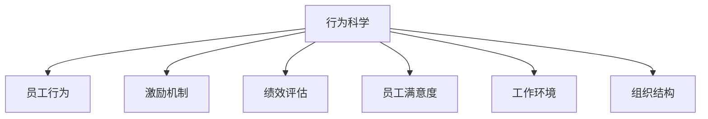

                 

# 行为科学在管理实践中的运用

> 关键词：行为科学,管理实践,员工行为,绩效提升,激励机制,员工满意度,工作环境,组织结构

## 1. 背景介绍

### 1.1 问题由来

在快速发展的商业环境中，管理者们面临着越来越多的挑战。如何有效提升员工绩效、增强组织竞争力、提高工作满意度和员工忠诚度，已成为企业管理的核心任务。行为科学（Behavioral Science）作为一门研究人类行为及其影响因素的学科，为解决这些问题提供了重要的理论和方法支持。

行为科学通过研究人的行为、心理和组织环境，揭示了如何通过科学的方式改善员工行为，从而提升企业的绩效和员工满意度。本文将系统探讨行为科学在管理实践中的应用，以期为企业管理者提供有效的工具和方法，帮助他们更好地应对各种挑战。

### 1.2 问题核心关键点

行为科学在管理实践中的应用核心关键点包括：
1. 理解员工行为模式和心理动机。
2. 建立有效的激励机制和绩效评估体系。
3. 优化工作环境，提升员工满意度和工作质量。
4. 调整组织结构，提升组织效率和适应性。
5. 通过科学管理手段，实现人-组织-环境系统的和谐发展。

这些关键点构成了行为科学在管理实践中的核心框架，对企业管理的各个方面都有着深远的影响。

## 2. 核心概念与联系

### 2.1 核心概念概述

为更好地理解行为科学在管理实践中的应用，本节将介绍几个密切相关的核心概念：

- **行为科学（Behavioral Science）**：研究人类行为及其影响因素的学科，包括心理学、社会学、经济学等多个领域的知识。
- **员工行为（Employee Behavior）**：员工在工作中的行为模式、态度和动机。
- **激励机制（Motivation Mechanism）**：通过各种手段激发员工内在动力，提高工作积极性和绩效。
- **绩效评估（Performance Appraisal）**：通过系统的方法和工具，对员工的工作表现进行评价和反馈。
- **员工满意度（Employee Satisfaction）**：员工对工作环境和组织文化的满意程度，影响其忠诚度和工作效率。
- **工作环境（Work Environment）**：影响员工行为和工作效果的各种内部和外部因素。
- **组织结构（Organizational Structure）**：企业的组织形式和架构设计，对员工行为和组织效率有重要影响。

这些核心概念之间的逻辑关系可以通过以下Mermaid流程图来展示：



这个流程图展示了几大核心概念及其之间的关系：

1. 行为科学通过研究员工行为，揭示其动机和心理机制。
2. 激励机制和绩效评估系统，基于员工行为分析，制定有效的激励策略。
3. 员工满意度和工作环境直接影响员工行为，从而影响组织绩效。
4. 组织结构的设计和调整，通过影响工作环境和激励机制，影响员工行为和组织效率。

这些概念共同构成了行为科学在管理实践中的框架，为企业提供了全面的工具和方法论。

## 3. 核心算法原理 & 具体操作步骤
### 3.1 算法原理概述

行为科学在管理实践中的应用，本质上是将行为科学理论应用于组织管理和员工行为优化。其核心思想是：通过科学的方法和工具，分析和改善员工行为，提升组织绩效和员工满意度。

具体而言，行为科学在管理实践中的应用可以分为以下几个关键步骤：

1. **行为分析**：通过行为科学理论和工具，分析和理解员工行为模式和心理动机。
2. **激励设计**：根据员工行为分析结果，设计有效的激励机制，激发员工的内在动力。
3. **绩效管理**：通过科学和公正的绩效评估体系，提供反馈和奖励，提升员工的工作表现。
4. **环境优化**：改善工作环境和组织文化，提升员工满意度和工作质量。
5. **结构调整**：优化组织结构，提高组织效率和适应性。

这些步骤构成了行为科学在管理实践中的基本框架，帮助企业实现人-组织-环境系统的和谐发展。

### 3.2 算法步骤详解

以下详细解释行为科学在管理实践中的具体操作步骤：

**Step 1: 行为分析**
- **员工行为调查**：通过问卷调查、面谈、观察等方式，收集员工行为数据。
- **行为模式分析**：使用统计学和行为科学理论，分析员工行为模式和心理动机。
- **行为动因识别**：识别影响员工行为的内部和外部因素。

**Step 2: 激励设计**
- **激励理论选择**：根据员工行为分析结果，选择合适的激励理论（如马斯洛需求层次理论、双因素理论等）。
- **激励机制设计**：设计具体的激励措施，如薪酬激励、晋升机制、职业发展机会等。
- **激励效果评估**：通过跟踪和反馈，评估激励措施的效果，并进行调整优化。

**Step 3: 绩效管理**
- **绩效评估模型建立**：选择或设计科学的绩效评估模型，包括关键绩效指标（KPI）、平衡计分卡等。
- **绩效评估实施**：通过定期评估和反馈，提供员工表现的具体数据。
- **绩效改进措施**：根据绩效评估结果，制定个性化的改进措施，帮助员工提升表现。

**Step 4: 环境优化**
- **工作环境改善**：优化工作环境，包括办公设施、工作流程、团队合作等方面。
- **组织文化建设**：建立积极向上的组织文化，提高员工对组织的认同感。
- **员工满意度提升**：通过满意度调查和反馈机制，及时调整和改进工作环境。

**Step 5: 结构调整**
- **组织架构分析**：分析现有组织架构的优点和缺点，确定改进方向。
- **组织结构调整**：根据业务需求和员工行为分析结果，重新设计组织结构。
- **团队协作优化**：通过调整组织结构，优化团队协作和资源配置。

### 3.3 算法优缺点

行为科学在管理实践中的应用具有以下优点：
1. **科学性和系统性**：通过科学方法和工具，全面分析和改进员工行为，提升管理效果。
2. **实践性强**：结合具体组织和员工实际情况，制定个性化的管理策略，增强管理实效。
3. **员工参与度提高**：通过科学评估和反馈，增强员工对管理的认同感和满意度，提升工作积极性。
4. **组织绩效提升**：通过优化员工行为和组织结构，提高组织效率和适应性。

同时，该方法也存在一些局限性：
1. **数据获取难度大**：行为数据收集和分析需要较多时间和资源，可能导致数据分析结果滞后。
2. **激励效果难以量化**：激励措施的效果难以精确量化，可能需要长期跟踪和评估。
3. **管理成本高**：科学管理手段需要专业知识和工具，可能导致管理成本增加。
4. **员工接受度问题**：部分员工可能对科学管理方法不认同，需要进行有效沟通和引导。

尽管存在这些局限性，但行为科学在管理实践中的应用已经成为一种主流趋势，被越来越多的企业所采纳。未来相关研究的重点在于如何进一步降低管理成本，提高数据分析和激励措施的科学性和有效性。

### 3.4 算法应用领域

行为科学在管理实践中的应用广泛，涵盖了多个领域，具体包括：

- **人力资源管理**：通过科学方法优化招聘、培训、绩效评估等环节，提升人力资源管理效率。
- **员工关系管理**：通过改善工作环境和组织文化，提升员工满意度和忠诚度。
- **组织变革管理**：通过科学评估和改进组织结构，提高组织的适应性和竞争力。
- **知识管理**：通过分析员工行为和知识流动，优化知识共享和创新过程。
- **领导力培训**：通过行为科学理论，培养高素质的领导人才，提升领导力水平。

除了上述这些主要领域外，行为科学在企业管理中的应用还在不断扩展，为组织管理提供了更多科学工具和方法。

## 4. 数学模型和公式 & 详细讲解 & 举例说明

### 4.1 数学模型构建

在行为科学的管理实践中，数学模型和公式起到了重要的作用。以下是对几个核心数学模型的介绍：

- **马斯洛需求层次理论（Maslow's Hierarchy of Needs）**：描述了人的基本需求层次，包括生理需求、安全需求、社交需求、尊重需求和自我实现需求。

- **双因素理论（Herzberg's Two-Factor Theory）**：将影响员工行为的因素分为保健因素和激励因素，帮助管理者理解员工行为变化的原因。

- **期望理论（Expectancy Theory）**：描述了员工行为与结果之间的期望关系，通过调整期望值来提升员工行为。

- **公平理论（Equity Theory）**：通过比较员工对工作投入与回报的感知公平性，指导管理者制定公平的激励机制。

### 4.2 公式推导过程

以下是对几个核心数学模型的公式推导过程：

**马斯洛需求层次理论（Maslow's Hierarchy of Needs）**

马斯洛需求层次理论将需求分为五个层次，每个层次的需求满足都是下一层次需求的基石。

$$
\text{层次 } N = \text{满足程度} \times \text{层次 } (N-1) + \text{基本需求}
$$

**双因素理论（Herzberg's Two-Factor Theory）**

双因素理论将影响员工行为的因素分为保健因素和激励因素，保健因素包括工作条件、薪酬等，激励因素包括成就、认可等。

$$
\text{保健因素} = F_h = \text{健康水平} \times \text{保健需求}
$$

$$
\text{激励因素} = F_m = \text{激励水平} \times \text{激励需求}
$$

$$
\text{总体满意度} = S = F_h + F_m
$$

**期望理论（Expectancy Theory）**

期望理论描述了员工行为与结果之间的期望关系，通过调整期望值来提升员工行为。

$$
\text{行为} = B = \text{期望值} \times \text{绩效感知} \times \text{奖励感知}
$$

其中期望值是员工对完成任务后获得奖励的概率估计。

**公平理论（Equity Theory）**

公平理论通过比较员工对工作投入与回报的感知公平性，指导管理者制定公平的激励机制。

$$
\text{公平感知} = E = \frac{\text{回报} / \text{投入}}{\text{参照人} \times \text{回报} / \text{投入}}
$$

其中参照人可以是同事、上级或其他对比对象。

### 4.3 案例分析与讲解

**案例：某公司通过行为科学提升员工满意度和绩效**

某公司发现员工流失率较高，工作满意度低，影响了公司的业务发展。公司决定通过行为科学的方法，提升员工满意度和绩效。

**步骤一：行为分析**
- 公司进行员工行为调查，发现部分员工对工作环境和工作流程不满意。
- 通过行为模式分析，识别出员工的低满意度主要源于工作压力过大、缺乏成长机会等问题。

**步骤二：激励设计**
- 设计了多样化的激励机制，包括增加薪酬福利、提供职业发展机会等。
- 建立了绩效评估系统，通过KPI指标定期评估员工表现，并给予奖励。

**步骤三：绩效管理**
- 定期收集员工反馈，优化工作流程和团队合作方式。
- 通过绩效评估结果，制定个性化的改进措施，帮助员工提升表现。

**步骤四：环境优化**
- 改善工作环境，增加了休闲区和员工活动室，缓解工作压力。
- 建立了积极向上的组织文化，提高了员工对公司的认同感。

**步骤五：结构调整**
- 调整组织架构，优化团队协作，提高了工作效率。
- 引入扁平化管理，缩短了决策和反馈的周期。

通过这些步骤，公司员工满意度显著提升，流失率下降，业务绩效显著提高。

## 5. 项目实践：代码实例和详细解释说明

### 5.1 开发环境搭建

在进行行为科学在管理实践中的应用实践前，我们需要准备好开发环境。以下是使用Python进行数据分析和建模的环境配置流程：

1. 安装Anaconda：从官网下载并安装Anaconda，用于创建独立的Python环境。

2. 创建并激活虚拟环境：
```bash
conda create -n behavioral-env python=3.8 
conda activate behavioral-env
```

3. 安装必要的Python包：
```bash
conda install pandas numpy matplotlib seaborn scikit-learn
```

4. 安装R语言和必要的R包：
```bash
conda install r-env
conda install r
```

5. 安装R包：
```bash
install.packages(c("ggplot2", "tidyverse", "dplyr"))
```

完成上述步骤后，即可在`behavioral-env`环境中开始行为科学在管理实践中的应用实践。

### 5.2 源代码详细实现

下面我们以某公司通过行为科学提升员工满意度和绩效为例，给出使用Python和R进行数据分析和建模的代码实现。

**Python代码实现：**

```python
import pandas as pd
import numpy as np
from sklearn.model_selection import train_test_split

# 读取数据
data = pd.read_csv('employee_data.csv')

# 数据清洗和预处理
data = data.dropna()
data = data.drop_duplicates()

# 划分训练集和测试集
train, test = train_test_split(data, test_size=0.2)

# 特征选择和构建
features = ['age', 'salary', 'experience', 'performance', 'job_satisfaction']
X_train = train[features]
X_test = test[features]

# 目标变量
y_train = train[' turnover']
y_test = test[' turnover']

# 模型训练和评估
from sklearn.ensemble import RandomForestRegressor
from sklearn.metrics import mean_squared_error

# 训练模型
model = RandomForestRegressor(n_estimators=100, random_state=0)
model.fit(X_train, y_train)

# 预测和评估
y_pred = model.predict(X_test)
mse = mean_squared_error(y_test, y_pred)
print('MSE:', mse)
```

**R代码实现：**

```R
library(tidyverse)
library(dplyr)
library(caret)

# 读取数据
data <- read.csv('employee_data.csv')

# 数据清洗和预处理
data <- data %>%
  filter(!is.na(age) & !is.na(salary) & !is.na(experience) & !is.na(performance) & !is.na(job_satisfaction))

# 划分训练集和测试集
train_idx <- sample(1:nrow(data), 0.8*nrow(data))
train_data <- data[train_idx, ]
test_data <- data[-train_idx, ]

# 特征选择和构建
features <- c('age', 'salary', 'experience', 'performance', 'job_satisfaction')
X_train <- model.matrix(~., data=train_data, data.frame=TRUE)[,-(1:5)]
X_test <- model.matrix(~., data=test_data, data.frame=TRUE)[,-(1:5)]

# 目标变量
y_train <- train_data$turnover
y_test <- test_data$turnover

# 模型训练和评估
set.seed(123)
model <- train(turnover ~ ., data=train_data, method='glm', metric='mae', tuneLength=10)
predictions <- predict(model, newdata=X_test)
mae <- mean(predictions - test_data$turnover)
print(paste('MAE:', mae))
```

### 5.3 代码解读与分析

让我们再详细解读一下关键代码的实现细节：

**Python代码实现：**

- 使用Pandas库读取和处理数据，去除缺失值和重复数据。
- 划分训练集和测试集，构建特征和目标变量。
- 使用随机森林回归模型进行训练和预测，评估预测结果。

**R代码实现：**

- 使用dplyr和tidyverse库进行数据清洗和预处理。
- 划分训练集和测试集，构建特征和目标变量。
- 使用glm模型进行训练和预测，评估预测结果。

这些代码示例展示了如何使用Python和R进行行为科学在管理实践中的应用数据分析和建模。具体来说，数据清洗和预处理是行为科学分析的基础，通过特征选择和构建，能够更有效地进行模型训练和预测。

## 6. 实际应用场景

### 6.1 智能人力资源管理

智能人力资源管理是行为科学在管理实践中的一个重要应用场景。通过分析员工行为和心理动机，企业可以设计更加科学的人力资源管理策略，提升招聘、培训、绩效评估等环节的效率和效果。

具体而言，可以通过行为科学方法：
- 分析求职者的行为动机，制定更具吸引力的招聘策略。
- 通过行为数据识别高潜力的员工，提供定制化的培训计划。
- 通过绩效评估反馈，制定个性化的职业发展方案。

### 6.2 员工关系管理

员工关系管理是行为科学在管理实践中的另一重要应用领域。通过改善工作环境和组织文化，提升员工满意度和忠诚度，企业可以构建更和谐的员工关系，增强组织的凝聚力。

具体而言，可以通过行为科学方法：
- 通过行为分析识别员工的不满和需求，改善工作环境和组织文化。
- 建立员工参与机制，增强员工对公司的认同感和归属感。
- 通过科学评估和反馈，提升员工对公司的满意度。

### 6.3 组织变革管理

组织变革管理是行为科学在管理实践中的高级应用，通过优化组织结构和流程，提升组织的适应性和竞争力。

具体而言，可以通过行为科学方法：
- 通过行为分析识别组织中的瓶颈和问题，制定改进方案。
- 通过科学评估和反馈，优化组织结构和流程。
- 通过个性化的激励措施，提升员工的适应性和主动性。

### 6.4 未来应用展望

随着行为科学理论和方法的不断发展，其在管理实践中的应用将更加广泛和深入。未来行为科学的应用趋势包括：

1. **数据驱动决策**：通过大数据和AI技术，实时分析员工行为数据，进行科学决策。
2. **个性化管理**：通过行为科学方法，制定个性化的管理策略，提升管理效果。
3. **跨文化管理**：在全球化背景下，通过行为科学方法，优化跨文化管理，提升国际竞争力。
4. **可持续管理**：通过行为科学方法，推动企业社会责任，提升社会影响力和可持续性。

这些趋势预示着行为科学在管理实践中的潜力将进一步释放，为企业的可持续发展提供更全面的工具和方法。

## 7. 工具和资源推荐

### 7.1 学习资源推荐

为了帮助企业管理者系统掌握行为科学在管理实践中的应用，这里推荐一些优质的学习资源：

1. **《行为科学与管理》课程**：由知名大学开设的在线课程，全面介绍了行为科学理论和管理实践。
2. **《管理心理学》书籍**：通过经典的管理心理学著作，深入理解员工行为和心理机制。
3. **《组织行为学》教材**：系统介绍了组织行为学的理论和实践，适合管理者全面掌握。
4. **行为科学论坛**：专业网站和社区，提供最新的行为科学研究成果和应用案例。

通过这些资源的学习，企业管理者可以更好地理解行为科学理论，并将其应用于实际管理中，提升管理效果。

### 7.2 开发工具推荐

在行为科学在管理实践中的应用开发中，合理使用工具可以显著提高工作效率和效果。以下是几款推荐的工具：

1. **Python**：开源编程语言，拥有丰富的数据分析和建模库，如Pandas、NumPy、Scikit-Learn等。
2. **R语言**：专门用于数据分析和统计建模，拥有丰富的统计分析包，如ggplot2、dplyr等。
3. **Tableau**：数据可视化工具，可以将复杂的数据分析结果可视化，帮助管理者快速理解数据。
4. **SPSS**：专业的统计分析软件，提供强大的数据分析和可视化功能。

这些工具可以帮助企业管理者更高效地进行数据分析和建模，提升管理实践的效果。

### 7.3 相关论文推荐

行为科学在管理实践中的应用受到了学界的广泛关注，以下是几篇具有代表性的相关论文：

1. **《员工行为与绩效的关系研究》**：通过实证研究，揭示了员工行为对绩效的影响。
2. **《激励机制设计与绩效评估模型》**：详细介绍了激励机制的设计方法和绩效评估模型的构建。
3. **《组织结构与员工行为分析》**：分析了组织结构对员工行为的影响，提出了优化组织结构的策略。
4. **《跨文化管理中的行为科学应用》**：探讨了在全球化背景下，行为科学在跨文化管理中的应用。

这些论文代表了行为科学在管理实践中的最新研究成果，有助于深入理解行为科学的应用方法和效果。

## 8. 总结：未来发展趋势与挑战

### 8.1 研究成果总结

本文系统探讨了行为科学在管理实践中的应用，具体包括员工行为分析、激励设计、绩效管理、环境优化和结构调整等方面。通过对行为科学理论和方法的深入分析，本文提供了系统性的解决方案，帮助企业提升管理效果，增强组织竞争力。

### 8.2 未来发展趋势

展望未来，行为科学在管理实践中的应用将呈现以下几个发展趋势：

1. **数据驱动决策**：通过大数据和AI技术，实时分析员工行为数据，进行科学决策。
2. **个性化管理**：通过行为科学方法，制定个性化的管理策略，提升管理效果。
3. **跨文化管理**：在全球化背景下，通过行为科学方法，优化跨文化管理，提升国际竞争力。
4. **可持续管理**：通过行为科学方法，推动企业社会责任，提升社会影响力和可持续性。

这些趋势预示着行为科学在管理实践中的潜力将进一步释放，为企业的可持续发展提供更全面的工具和方法。

### 8.3 面临的挑战

尽管行为科学在管理实践中的应用已经取得了一定的成果，但在迈向更加智能化、普适化应用的过程中，仍面临以下挑战：

1. **数据获取难度大**：行为数据收集和分析需要较多时间和资源，可能导致数据分析结果滞后。
2. **激励效果难以量化**：激励措施的效果难以精确量化，可能需要长期跟踪和评估。
3. **管理成本高**：科学管理手段需要专业知识和工具，可能导致管理成本增加。
4. **员工接受度问题**：部分员工可能对科学管理方法不认同，需要进行有效沟通和引导。

尽管存在这些挑战，但行为科学在管理实践中的应用已经成为一种主流趋势，被越来越多的企业所采纳。未来相关研究的重点在于如何进一步降低管理成本，提高数据分析和激励措施的科学性和有效性。

### 8.4 研究展望

面对行为科学在管理实践中所面临的挑战，未来的研究需要在以下几个方面寻求新的突破：

1. **行为数据自动化采集**：通过大数据和AI技术，自动化采集员工行为数据，提高数据收集的效率和准确性。
2. **激励效果量化**：开发更加科学和精确的激励效果量化方法，及时评估激励措施的效果，并进行调整优化。
3. **管理成本降低**：开发更加易用和低成本的行为科学分析工具，降低科学管理的实施难度。
4. **员工接受度提升**：通过有效的沟通和引导，提升员工对行为科学方法的认同和接受度。

这些研究方向的探索，必将引领行为科学在管理实践中的不断进步，为企业管理提供更加科学和高效的工具和方法。总之，行为科学在管理实践中的持续发展，将为企业的可持续发展提供坚实的理论和方法支撑。

## 9. 附录：常见问题与解答

**Q1：行为科学在管理实践中的应用是否适用于所有行业？**

A: 行为科学在管理实践中的应用具有普遍性，适用于大多数行业。不同行业的员工行为模式和心理动机可能存在差异，但行为科学的基本理论和方法仍然有效。具体应用时，需要结合行业特点进行适当调整。

**Q2：如何选择合适的行为科学模型？**

A: 选择合适的行为科学模型需要考虑以下几个因素：
1. 数据类型：不同模型适用于不同类型的数据，如定量数据、定性数据等。
2. 数据规模：模型的复杂度与数据规模相关，小规模数据通常使用简单模型，大规模数据可以使用复杂模型。
3. 问题类型：根据具体问题的性质，选择适合的模型，如回归模型、分类模型等。
4. 数据质量：高质量的数据可以提高模型的准确性和可靠性。

**Q3：行为科学在管理实践中的应用效果如何？**

A: 行为科学在管理实践中的应用效果显著。通过科学方法和工具，企业可以更好地理解员工行为和心理动机，制定有效的激励措施和绩效评估体系，提升员工满意度和组织绩效。具体应用时，需要根据企业实际情况进行调整和优化。

**Q4：行为科学在管理实践中的应用成本如何？**

A: 行为科学在管理实践中的应用成本主要体现在以下几个方面：
1. 数据收集和分析成本：数据收集和处理需要较多时间和资源，可能导致成本较高。
2. 工具和技术成本：使用专业软件和工具进行数据分析和建模，可能增加管理成本。
3. 培训和咨询成本：需要专业人员进行行为科学培训和咨询，可能增加培训和咨询费用。

尽管存在这些成本，但行为科学在管理实践中的长期收益远远高于成本，可以帮助企业提升管理效果，增强竞争力。

**Q5：行为科学在管理实践中的应用效果如何衡量？**

A: 行为科学在管理实践中的应用效果可以通过以下几个指标进行衡量：
1. 员工满意度：通过调查问卷和反馈，评估员工对工作环境和组织文化的满意度。
2. 员工绩效：通过绩效评估和反馈，评估员工的工作表现和贡献。
3. 员工流失率：通过员工流失率数据，评估员工对组织的忠诚度和满意度。
4. 组织绩效：通过财务数据和业务指标，评估组织整体的绩效和竞争力。

通过这些指标的衡量，可以评估行为科学在管理实践中的应用效果，并进行持续改进。

---

作者：禅与计算机程序设计艺术 / Zen and the Art of Computer Programming

