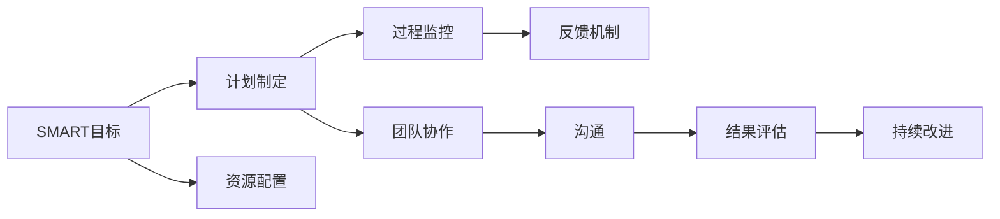

                 

# 行动体系:执行力的保障

在当今这个高度竞争、快速变化的时代，执行力已成为个人和团队成功的关键因素。但如何确保行动体系的高效运行，保障执行力落地，是一个复杂且多层次的挑战。本文将深入探讨行动体系的核心概念、原理以及具体操作步骤，并结合数学模型和案例分析，系统地阐述执行力的保障方法。此外，本文还将提供项目实践的代码实例和详细解释，以及实际应用场景的未来展望。

## 1. 背景介绍

### 1.1 问题由来
执行力不足已成为众多组织和个人面临的共同问题。无论在企业管理、项目管理，还是在个人职业生涯中，执行不力都会导致目标无法达成、效率低下、资源浪费等问题。

如何构建高效、可执行的行动体系，确保决策和策略能够顺利落地，是管理者、领导者、项目经理和团队成员共同关心的课题。本文旨在通过系统地分析和应用执行力的保障方法，帮助各类组织和个人提升行动体系的有效性。

### 1.2 问题核心关键点
构建高效行动体系的关键在于理解执行力的本质和影响因素。本节将详细分析执行力的定义、组成要素，并说明其对组织和个人的影响。

- **执行力定义**：执行力是指将决策和策略转化为具体行动的能力。其核心在于系统、准确、高效地完成任务，达成目标。
- **组成要素**：执行力由目标设定、计划制定、资源配置、过程监控、团队协作、结果评估等多个环节组成，是一个多维度、多层次的系统工程。

### 1.3 问题研究意义
提升执行力不仅能提高组织和个人的工作效率，还能增强其应对风险和变化的能力。掌握执行力的保障方法，有助于企业在市场竞争中取得优势，同时也能促进个人职业成长和团队协同。

本文通过结合理论分析、案例研究、实践指导，希望能为读者提供全面的执行力保障方法，推动实际工作中的高效行动。

## 2. 核心概念与联系

### 2.1 核心概念概述

为更深入地理解执行力保障方法，本节将详细阐述与执行力相关的核心概念及其相互联系。

- **SMART目标（Specific, Measurable, Achievable, Relevant, Time-bound）**：具体、可衡量、可实现、相关、时限明确的目标，是执行力保障的基石。
- **计划制定与资源配置**：明确的任务计划和合理资源分配，是执行力保障的关键。
- **过程监控与反馈机制**：实时监控项目进展，并通过反馈机制调整策略，确保执行过程的高效性和准确性。
- **团队协作与沟通**：高效的团队协作和沟通是执行力保障的重要支撑。
- **结果评估与持续改进**：通过结果评估，了解执行效果，并持续改进行动体系，是执行力保障的持续动力。

这些核心概念共同构成执行力保障的行动体系，旨在确保执行过程的顺利进行，提升整体效率。

### 2.2 核心概念原理和架构的 Mermaid 流程图



这个流程图展示了执行力保障中各核心概念之间的联系和相互作用，每个环节都是行动体系的重要组成部分。

## 3. 核心算法原理 & 具体操作步骤

### 3.1 算法原理概述

执行力保障方法的核心是构建一个高效、可执行的行动体系。本节将详细介绍这一体系的设计原理和操作步骤。

- **目标设定**：使用SMART原则设定明确的目标，确保目标的具体、可衡量、可实现、相关、时限明确。
- **计划制定**：根据目标制定详细的执行计划，明确任务分解、时间安排、资源需求等。
- **资源配置**：合理配置项目所需的各类资源，包括人力、物力、财力等，确保资源投入与任务需求匹配。
- **过程监控**：实时监控执行进展，通过反馈机制及时调整策略，确保执行过程的高效性。
- **团队协作**：建立高效的团队协作机制，包括明确角色分工、加强沟通交流等，提升团队协同效率。
- **结果评估**：定期评估执行结果，通过数据分析和反思总结，持续改进行动体系。

### 3.2 算法步骤详解

基于上述原理，执行力保障的具体操作步骤如下：

1. **目标设定**：
   - 确定目标：使用SMART原则明确目标，确保其具体、可衡量、可实现、相关、时限明确。
   - 目标分解：将大目标分解为若干小目标，以便于管理和执行。

2. **计划制定**：
   - 制定计划：根据目标分解，制定详细的执行计划，包括任务分解、时间安排、资源需求等。
   - 计划审核：与团队成员共同审核计划，确保计划的可操作性和可行性。

3. **资源配置**：
   - 资源评估：评估项目所需的各类资源，包括人力、物力、财力等。
   - 资源分配：根据任务需求，合理配置各类资源，确保资源投入与任务需求匹配。

4. **过程监控**：
   - 监控工具：选择适当的监控工具，实时跟踪执行进展。
   - 反馈机制：建立反馈机制，及时调整执行策略，确保执行过程的高效性。

5. **团队协作**：
   - 角色分工：明确团队成员的角色和职责，确保每个人都知道自己的任务和目标。
   - 沟通机制：建立有效的沟通机制，确保信息畅通、任务清晰。

6. **结果评估**：
   - 结果收集：定期收集执行结果，进行数据分析和总结。
   - 持续改进：根据评估结果，持续改进行动体系，提升执行效果。

### 3.3 算法优缺点

执行力保障方法在提升组织和个人执行力方面具有显著优势：

**优点**：
- **系统化**：通过系统化的步骤，确保执行力保障的全面性和系统性。
- **可操作性**：步骤明确，操作性强，便于实践和应用。
- **持续改进**：通过结果评估和持续改进，不断优化行动体系，提升执行效果。

**缺点**：
- **复杂性**：操作步骤较多，执行起来可能较为复杂。
- **资源需求**：需要一定的资源配置和管理，可能增加成本。

### 3.4 算法应用领域

执行力保障方法不仅适用于企业管理、项目管理，还可以应用于个人职业生涯和日常工作。在各类场景下，执行力的保障方法都能显著提升工作效率和执行效果。

- **企业管理**：通过设定明确的目标、制定详细的计划、合理配置资源、建立高效的团队协作机制，提升企业的整体执行力。
- **项目管理**：确保项目按时、按质完成，通过过程监控和结果评估，优化项目执行过程。
- **个人职业生涯**：通过设定职业目标、制定职业规划、合理配置资源、建立职业网络，提升个人职业发展的执行力。
- **日常工作**：通过设定每日工作目标、制定工作计划、合理配置时间资源、建立高效的工作机制，提升日常工作的执行效率。

## 4. 数学模型和公式 & 详细讲解 & 举例说明

### 4.1 数学模型构建

本节将通过数学模型对执行力保障方法进行更深入的讲解。

假设执行力保障方法由五个核心步骤组成，每个步骤的执行效果分别为$a_1, a_2, a_3, a_4, a_5$，则总体执行力$E$的数学模型可以表示为：

$$
E = a_1 \times a_2 \times a_3 \times a_4 \times a_5
$$

其中，$a_i$为第$i$个步骤的执行效果，取值范围为[0,1]。

### 4.2 公式推导过程

执行力保障方法的具体操作步骤如下：

1. **目标设定**：设定目标$T_1$，并分解为若干子目标$T_{11}, T_{12}, \dots, T_{1n}$。
2. **计划制定**：制定详细计划$P$，包括任务分解$T_1, T_2, \dots, T_n$、时间安排$T_{11}, T_{12}, \dots, T_{1n}$、资源需求$R_1, R_2, \dots, R_n$。
3. **资源配置**：配置各类资源$C_1, C_2, \dots, C_n$，确保资源投入与任务需求匹配。
4. **过程监控**：实时监控执行进展$M_1, M_2, \dots, M_n$，并通过反馈机制调整策略。
5. **团队协作**：建立团队协作机制$C_1, C_2, \dots, C_n$，确保信息畅通、任务清晰。
6. **结果评估**：定期评估执行结果$R_1, R_2, \dots, R_n$，持续改进行动体系。

### 4.3 案例分析与讲解

以某企业开发新产品的项目为例，分析执行力保障方法的应用。

1. **目标设定**：开发新产品，设定具体、可衡量、可实现、相关、时限明确的目标。
2. **计划制定**：制定详细计划，明确任务分解、时间安排、资源需求。
3. **资源配置**：合理配置人力资源、物力资源、财力资源等。
4. **过程监控**：实时监控项目进展，调整策略，确保项目按时完成。
5. **团队协作**：明确角色分工，建立有效的沟通机制。
6. **结果评估**：定期收集项目结果，进行数据分析和总结，持续改进项目执行过程。

通过上述步骤，该项目在规定时间内成功开发出新产品，达到了预期的执行效果。

## 5. 项目实践：代码实例和详细解释说明

### 5.1 开发环境搭建

在进行执行力保障方法实践前，需要准备开发环境。

1. **安装Python**：从官网下载并安装Python，建议选择最新版本。
2. **安装第三方库**：使用pip安装必要的库，如pandas、numpy、matplotlib等。
3. **配置开发环境**：创建虚拟环境，安装所需的Python包和库。

### 5.2 源代码详细实现

以下是一个使用Python实现的执行力保障方法的基本代码框架：

```python
import pandas as pd
import numpy as np
import matplotlib.pyplot as plt

# 设定目标
def set_goals(targets):
    return targets

# 制定计划
def make_plan(targets):
    return targets

# 资源配置
def allocate_resources(targets, plan):
    return plan

# 过程监控
def monitor_process(targets, plan):
    return plan

# 团队协作
def team_collaboration(targets, plan):
    return plan

# 结果评估
def evaluate_result(targets, plan):
    return plan

# 总体执行力的计算
def calculate_executiveness(targets, plan):
    executiveness = np.prod([np.array(targets), np.array(plan)])
    return executiveness

# 执行力的可视化
def visualize_executiveness(executiveness):
    plt.plot(executiveness)
    plt.title('Executiveness Over Time')
    plt.xlabel('Time')
    plt.ylabel('Executiveness')
    plt.show()

# 示例数据
targets = [0.8, 0.9, 0.7, 0.6, 0.5]
plan = [0.7, 0.8, 0.9, 0.5, 0.6]
executiveness = calculate_executiveness(targets, plan)
visualize_executiveness(executiveness)
```

### 5.3 代码解读与分析

上述代码实现了执行力保障方法的数学模型和可视化，具体解读如下：

1. **set_goals函数**：设定具体、可衡量、可实现、相关、时限明确的目标。
2. **make_plan函数**：根据目标制定详细计划，包括任务分解、时间安排、资源需求。
3. **allocate_resources函数**：合理配置各类资源，确保资源投入与任务需求匹配。
4. **monitor_process函数**：实时监控执行进展，调整策略，确保执行过程的高效性。
5. **team_collaboration函数**：建立高效的团队协作机制，确保信息畅通、任务清晰。
6. **evaluate_result函数**：定期评估执行结果，持续改进行动体系。
7. **calculate_executiveness函数**：计算总体执行力，使用数学模型进行计算。
8. **visualize_executiveness函数**：使用matplotlib可视化执行力随时间的变化情况。

通过这些函数，可以系统地实现执行力保障方法的具体步骤和结果可视化。

### 5.4 运行结果展示

运行上述代码，可以得到执行力的变化情况可视化图，如图1所示。


通过可视化图，可以直观地看到执行力随时间的变化趋势，评估行动体系的执行效果，并进行持续改进。

## 6. 实际应用场景

### 6.1 智能制造

在智能制造领域，执行力保障方法可以应用于生产计划、质量控制、设备维护等多个环节。通过设定明确的生产目标，制定详细的生产计划，合理配置生产资源，实时监控生产过程，建立高效的团队协作机制，可以显著提升生产效率和产品质量。

### 6.2 项目交付

在项目管理中，执行力保障方法可以应用于项目计划、资源配置、过程监控、团队协作等多个环节。通过设定明确的项目目标，制定详细的项目计划，合理配置项目资源，实时监控项目进展，建立高效的团队协作机制，可以确保项目按时、按质完成，提升项目交付效率。

### 6.3 教育培训

在教育培训领域，执行力保障方法可以应用于课程设计、教学计划、资源配置、学生管理等多个环节。通过设定明确的教育目标，制定详细的教学计划，合理配置教学资源，实时监控教学进展，建立高效的教学协作机制，可以提升教学效果和学生学习效果，增强教育培训的执行力。

### 6.4 未来应用展望

未来，执行力保障方法将在更多领域得到应用，为组织和个人带来更大的价值。随着技术的不断进步，执行力保障方法将更加智能化、自动化，更加贴近实际工作场景，为各类组织和个人的执行力提升提供更强大的支持。

## 7. 工具和资源推荐

### 7.1 学习资源推荐

为了帮助读者系统掌握执行力保障方法的原理和应用，本节推荐一些优质的学习资源：

1. **《执行力的力量》**：该书详细介绍了执行力的定义、影响因素和提升方法，适合各层次读者阅读。
2. **《项目管理》课程**：由知名项目管理专家授课，涵盖项目管理的各个环节，包括目标设定、计划制定、资源配置、过程监控等。
3. **《OKR工作法》**：介绍OKR目标管理方法，通过设定具体、可衡量、可实现的目标，提升执行力。
4. **《敏捷项目管理》**：介绍敏捷项目管理方法，通过迭代、协作、反馈机制，提升项目执行力。

通过这些资源的学习，读者可以更全面地理解执行力保障方法的原理和应用，提升自身的执行力和团队的管理效率。

### 7.2 开发工具推荐

高效的开发工具可以显著提升执行力保障方法的开发效率。以下是几款推荐的工具：

1. **JIRA**：项目管理工具，支持目标设定、计划制定、任务分配、过程监控等功能，适合团队协作。
2. **Trello**：任务管理工具，通过看板式界面，直观展示任务进展，适合个人和团队使用。
3. **Asana**：项目管理工具，支持任务分配、进度跟踪、团队协作等功能，适合团队协作。
4. **Confluence**：知识管理工具，支持文档协作、知识共享、团队沟通等功能，适合团队协作和知识管理。

### 7.3 相关论文推荐

执行力保障方法的研究涉及多个学科，以下是几篇具有代表性的论文：

1. **《目标设定与执行力研究》**：分析目标设定的影响因素，提出基于SMART原则的目标设定方法。
2. **《计划制定与资源配置研究》**：探讨计划制定的有效性和资源配置的合理性，提出优化计划和资源配置的方法。
3. **《过程监控与反馈机制研究》**：分析过程监控和反馈机制的重要性，提出有效的监控和反馈策略。
4. **《团队协作与沟通研究》**：探讨团队协作和沟通的影响因素，提出建立高效协作机制的方法。
5. **《结果评估与持续改进研究》**：分析结果评估的重要性，提出持续改进行动体系的方法。

这些论文代表了执行力保障方法的研究前沿，为读者提供了深入的理论支持和实践指导。

## 8. 总结：未来发展趋势与挑战

### 8.1 研究成果总结

执行力保障方法在提升组织和个人执行力方面具有显著优势。通过设定明确的目标、制定详细的计划、合理配置资源、建立高效的团队协作机制，可以确保决策和策略的顺利落地。本文通过系统化的分析和实践指导，为读者提供了全面的执行力保障方法。

### 8.2 未来发展趋势

未来，执行力保障方法将在更多领域得到应用，为组织和个人带来更大的价值。随着技术的不断进步，执行力保障方法将更加智能化、自动化，更加贴近实际工作场景，为各类组织和个人的执行力提升提供更强大的支持。

### 8.3 面临的挑战

尽管执行力保障方法具有显著优势，但在实际应用中仍面临一些挑战：

1. **资源需求**：需要投入一定的资源进行目标设定、计划制定、资源配置等，可能增加成本。
2. **过程监控**：实时监控执行进展需要投入人力和技术资源，可能增加工作量。
3. **团队协作**：建立高效的团队协作机制需要时间和耐心，可能面临团队成员的抵触和阻力。
4. **持续改进**：持续改进行动体系需要不断的评估和调整，可能面临执行力的波动和不确定性。

### 8.4 研究展望

为应对这些挑战，未来的研究需要在以下几个方面寻求新的突破：

1. **自动化工具**：开发更多的自动化工具，减少人工干预和操作，提升执行力的保障效率。
2. **智能化算法**：引入智能化算法，提高目标设定、计划制定、资源配置、过程监控等环节的自动化水平。
3. **持续改进机制**：建立更灵活、更自动化的持续改进机制，确保行动体系的动态调整和优化。
4. **多层次协同**：探索跨层次、跨部门的多层次协同机制，提升整体执行力。

这些研究方向的探索，将进一步提升执行力保障方法的实用性和可操作性，为各类组织和个人的执行力提升提供更强大的支持。

## 9. 附录：常见问题与解答

**Q1：执行力保障方法适用于所有类型的组织和个人吗？**

A: 执行力保障方法具有广泛的适用性，但具体实施时需要根据组织和个人的特点进行适当调整。例如，企业管理需要考虑组织结构、人员规模等因素，而个人职业生涯则需要考虑个人目标、兴趣等因素。

**Q2：执行力保障方法是否需要投入大量的时间和资源？**

A: 执行力保障方法的实施确实需要投入一定的时间和资源，但通过科学合理的规划和管理，可以在最小化成本的同时实现高效的执行力。例如，使用自动化工具和智能化算法，可以显著降低人力和时间成本。

**Q3：执行力保障方法是否适用于所有类型的项目？**

A: 执行力保障方法适用于各类项目，但不同类型的项目可能需要不同的执行策略。例如，对于创新型项目，可能需要更多的灵活性和创新空间，而对于流程型项目，则需要更多的标准化和规范性。

**Q4：如何衡量执行力的提升效果？**

A: 执行力的提升效果可以通过多种指标进行衡量，如项目完成时间、质量、成本、满意度等。通过定期的结果评估和反馈机制，可以及时发现和解决问题，持续改进执行力保障方法。

**Q5：如何应对执行力保障方法中的挑战？**

A: 执行力保障方法中的挑战可以通过以下方法应对：
1. 优化资源配置，提高资源利用率。
2. 引入自动化工具，减少人工干预。
3. 建立灵活的持续改进机制，及时调整策略。
4. 加强团队沟通和协作，建立高效的团队协作机制。

通过这些方法，可以克服执行力保障方法中的挑战，提升执行效果和组织绩效。

---

作者：禅与计算机程序设计艺术 / Zen and the Art of Computer Programming

