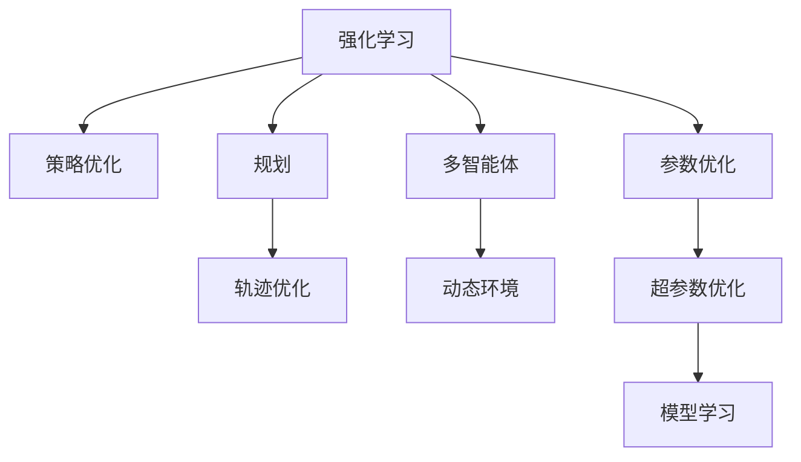

                 

# 规划机制在 Agent 学习中的应用

> 关键词：规划、Agent、强化学习、策略优化、轨迹优化、多智能体、动态环境、复杂系统

## 1. 背景介绍

### 1.1 问题由来

随着人工智能技术的迅猛发展，Agent学习在复杂系统中得到了广泛应用，例如自动驾驶、机器人控制、网络优化、金融投资等。在这些系统中，Agent需要根据环境信息进行自主决策，并执行相应操作，以实现系统目标。然而，这些系统往往具有高度动态性、非线性特性和时变特性，Agent需要面对不确定性、实时约束、连续性优化等问题，使得设计复杂且具有挑战性。

传统的强化学习（Reinforcement Learning, RL）方法在优化Agent行为方面取得了显著进展，但其在连续控制、高维决策空间、复杂动态环境等问题上的性能和效率仍显不足。因此，近年来，基于规划的Agent学习（Planning-based Agent Learning）方法逐渐受到关注，其在连续控制、轨迹优化、多智能体等方面表现出明显的优势。

### 1.2 问题核心关键点

规划机制在Agent学习中的应用，其核心在于结合强化学习与规划方法，通过优化连续时间域的动态轨迹，生成高维决策空间中的最优控制策略。这一范式可以使得Agent在动态环境中生成全局最优或近似最优的行为策略，从而应对复杂的系统挑战。

规划机制的核心思想是，Agent在每一步决策前，先对未来若干步的时间演化进行预测和规划，然后选择当下最优的行动策略。这一过程可以用动态规划（Dynamic Programming）和蒙特卡洛树搜索（Monte Carlo Tree Search, MCTS）等方法实现。

## 2. 核心概念与联系

### 2.1 核心概念概述

为更好地理解规划机制在Agent学习中的应用，本节将介绍几个密切相关的核心概念：

- **强化学习（Reinforcement Learning, RL）**：通过与环境的交互，Agent通过执行动作来最大化累积奖励的优化过程。强化学习的核心在于设计合适的奖励函数，使得Agent能够探索和利用环境的结构信息。

- **规划（Planning）**：一种基于模型预测的优化方法，通过在时间域上进行动态规划，生成未来若干步的时间演化轨迹，从而选择当下最优的行动策略。规划机制可以优化连续时间域的动态轨迹，实现全局最优或近似最优的决策。

- **策略优化（Policy Optimization）**：强化学习中的一个重要分支，通过优化Agent的策略来提高其性能。常用的策略优化方法包括策略梯度、策略改进等。

- **轨迹优化（Trajectory Optimization）**：一种针对连续控制问题的优化方法，通过优化连续时间域的动态轨迹，实现全局最优或近似最优的控制策略。轨迹优化通常与动态规划和蒙特卡洛树搜索等方法相结合。

- **多智能体系统（Multi-Agent Systems, MAS）**：由多个智能体组成的复杂系统，各智能体通过相互协作或竞争来实现共同的目标。多智能体系统中的Agent需要考虑环境动态性和协作关系，从而实现系统的整体优化。

- **动态环境（Dynamic Environment）**：系统中的环境具有高度的时变性和不确定性，Agent需要实时感知和响应环境变化，以实现最优策略。动态环境的应用广泛，例如智能交通、自动驾驶等。

这些核心概念之间的逻辑关系可以通过以下Mermaid流程图来展示：



这个流程图展示了强化学习、规划、策略优化等概念之间的关系：

1. 强化学习通过与环境交互，优化策略来提升Agent性能。
2. 规划机制通过预测未来动态轨迹，生成全局最优或近似最优策略。
3. 轨迹优化通过优化连续时间域的动态轨迹，实现高维决策空间中的最优控制。
4. 多智能体系统通过协作或竞争，实现复杂系统中的整体优化。
5. 动态环境中的Agent需要实时感知环境变化，生成适应性策略。

这些概念共同构成了Agent学习的框架，使其能够在复杂系统中生成适应性、鲁棒性强的行为策略。通过理解这些核心概念，我们可以更好地把握Agent学习的工作原理和优化方向。

## 3. 核心算法原理 & 具体操作步骤

### 3.1 算法原理概述

规划机制在Agent学习中的应用，本质上是结合强化学习和规划方法，通过优化连续时间域的动态轨迹，生成高维决策空间中的最优控制策略。其核心思想是通过动态规划和蒙特卡洛树搜索等方法，在每一步决策前，对未来若干步的时间演化进行预测和规划，然后选择当下最优的行动策略。

形式化地，设Agent在时间步 $t$ 的决策为 $u_t$，状态为 $x_t$，控制目标为 $y_t$，系统动力学模型为 $f(x_t,u_t)$，状态转移概率为 $p(x_{t+1}|x_t,u_t)$，奖励函数为 $r(x_t,u_t)$，则Agent的行为策略可以通过优化动态规划方程得到：

$$
V^*(x_t) = \max_{u_t} \left\{ r(x_t,u_t) + \gamma \mathbb{E}\left[V^*(x_{t+1}) \mid x_t, u_t\right] \right\}
$$

其中，$V^*(x_t)$ 为最优值函数，$x_{t+1}$ 为预测状态，$\gamma$ 为折扣因子。该方程描述了Agent在时间步 $t$ 的最优决策策略，使得从当前状态 $x_t$ 出发，未来所有时间步的累积奖励最大化。

### 3.2 算法步骤详解

规划机制在Agent学习中的应用，主要包括以下几个关键步骤：

**Step 1: 定义问题模型**

- 建立系统的动态模型，描述状态和控制之间的映射关系。
- 定义状态和动作的表示方法，例如连续控制问题中，状态可以是车辆位置和速度，动作可以是方向盘和油门踏板。
- 定义奖励函数，用于衡量Agent的行为效果，例如在自动驾驶中，奖励可以是行驶速度和安全性。

**Step 2: 设计规划算法**

- 选择合适的规划算法，如动态规划（DP）、蒙特卡洛树搜索（MCTS）等。
- 设计规划算法中的搜索空间，如状态空间、动作空间、预测时步等。
- 设定规划算法的参数，如搜索深度、折扣因子等。

**Step 3: 执行规划优化**

- 初始化规划算法，并设定当前状态 $x_0$。
- 在每一步决策前，使用规划算法预测未来若干步的时间演化轨迹，并选择最优动作策略。
- 更新当前状态，执行动作策略，并接收环境反馈。
- 循环执行步骤3，直至满足预设的终止条件。

**Step 4: 反馈学习**

- 将每一步的环境反馈信息（即奖励）收集起来，用于计算累积奖励。
- 通过强化学习算法，如策略梯度、策略改进等，优化Agent的行为策略。
- 调整规划算法中的参数，如搜索深度、折扣因子等，以适应不同的任务和环境。

**Step 5: 参数优化与超参数优化**

- 通过参数优化算法，如梯度下降等，优化规划算法的参数，提高其计算效率和精度。
- 设定超参数的搜索空间，通过网格搜索、随机搜索等方法，寻找最优的超参数组合。

### 3.3 算法优缺点

规划机制在Agent学习中的应用，具有以下优点：

1. 全局优化。通过优化连续时间域的动态轨迹，生成全局最优或近似最优策略，避免了强化学习中可能陷入局部最优的问题。
2. 动态适应。规划机制能够处理复杂动态环境，通过实时预测和规划，使得Agent能够动态适应环境变化。
3. 鲁棒性强。规划算法可以生成鲁棒性强的策略，对抗噪声和干扰，提高系统的稳定性和可靠性。
4. 高维决策空间。规划机制适用于高维决策空间，能够处理连续控制和复杂系统中的高维优化问题。

同时，该方法也存在以下局限性：

1. 计算复杂度高。规划算法通常需要计算大量的动态轨迹，计算复杂度较高，特别是在高维状态空间中。
2. 参数优化困难。规划算法的参数优化过程可能较为困难，需要选择合适的优化方法。
3. 难以处理连续控制。尽管规划机制适用于高维决策空间，但对于连续控制问题，可能需要进行离散化处理。
4. 实时性不足。规划算法通常需要较长的计算时间，难以实时处理动态环境中的决策问题。
5. 需要较好的模型预测能力。规划算法的性能依赖于模型的预测精度，较差的模型预测可能影响优化效果。

尽管存在这些局限性，但规划机制在Agent学习中的应用仍是一种强有力的范式，能够在许多复杂系统中生成全局最优或近似最优的行为策略。

### 3.4 算法应用领域

规划机制在Agent学习中的应用，已经在自动驾驶、机器人控制、网络优化、金融投资等诸多领域得到了广泛的应用，成为解决复杂系统优化问题的有力工具。

- **自动驾驶**：通过动态规划和蒙特卡洛树搜索，生成全局最优的行驶轨迹，避免交通事故和拥堵。
- **机器人控制**：通过轨迹优化和多智能体规划，生成协作或竞争中的最优行为策略，实现复杂任务和协作。
- **网络优化**：通过优化连续时间域的动态轨迹，实现网络资源的最优分配和调度，提高网络性能。
- **金融投资**：通过动态规划和蒙特卡洛树搜索，生成最优的投资策略，应对市场动态变化。
- **工业生产**：通过轨迹优化和多智能体规划，生成最优的生产调度策略，提升生产效率和质量。
- **智能交通**：通过动态规划和轨迹优化，生成最优的交通控制策略，缓解交通拥堵和提高道路通行效率。

除了上述这些经典领域外，规划机制在Agent学习中的应用还在不断扩展，为更多复杂系统的优化提供了新的思路和方法。

## 4. 数学模型和公式 & 详细讲解 & 举例说明

### 4.1 数学模型构建

本节将使用数学语言对规划机制在Agent学习中的应用进行更加严格的刻画。

设系统状态为 $x_t \in \mathbb{R}^n$，控制策略为 $u_t \in \mathbb{R}^m$，系统动力学模型为 $f(x_t,u_t) \in \mathbb{R}^n$，状态转移概率为 $p(x_{t+1}|x_t,u_t)$，奖励函数为 $r(x_t,u_t)$。设最优值函数 $V^*(x_t)$ 满足如下动态规划方程：

$$
V^*(x_t) = \max_{u_t} \left\{ r(x_t,u_t) + \gamma \mathbb{E}\left[V^*(x_{t+1}) \mid x_t, u_t\right] \right\}
$$

其中，$\gamma$ 为折扣因子，$\mathbb{E}\left[\cdot\right]$ 表示数学期望。最优值函数 $V^*(x_t)$ 可以通过迭代求解上述方程得到。

### 4.2 公式推导过程

以下我们以自动驾驶中的轨迹优化为例，推导最优值函数的计算公式。

假设自动驾驶车辆的状态为 $x_t = (x,y,\dot{x},\dot{y},\dot{\theta})$，控制策略为 $u_t = (\dot{u},\dot{v},\dot{\theta})$，系统动力学模型为：

$$
\begin{aligned}
    x_{t+1} &= x_t + \Delta t(\dot{x}_t + \Delta t \dot{u}_t \cos(\theta_t)) \\
    y_{t+1} &= y_t + \Delta t(\dot{y}_t + \Delta t \dot{v}_t \sin(\theta_t)) \\
    \dot{x}_{t+1} &= \dot{x}_t + \Delta t(\ddot{x}_t + \ddot{u}_t \cos(\theta_t)) \\
    \dot{y}_{t+1} &= \dot{y}_t + \Delta t(\ddot{y}_t + \ddot{v}_t \sin(\theta_t)) \\
    \dot{\theta}_{t+1} &= \dot{\theta}_t + \Delta t \dot{\omega}_t
\end{aligned}
$$

其中，$\theta_t$ 为车辆方向角，$\omega_t$ 为车辆角速度。

设奖励函数为 $r(x_t,u_t) = -||(x_t,y_t) - (x_d,y_d)||^2$，即车辆距离目标位置越近，奖励越大。则最优值函数的计算公式为：

$$
V^*(x_t) = \max_{u_t} \left\{ r(x_t,u_t) + \gamma \mathbb{E}\left[V^*(x_{t+1}) \mid x_t, u_t\right] \right\}
$$

该方程描述了在时间步 $t$ 的最优决策策略，使得从当前状态 $x_t$ 出发，未来所有时间步的累积奖励最大化。

### 4.3 案例分析与讲解

以自动驾驶中的轨迹优化为例，说明规划机制在Agent学习中的应用。

假设自动驾驶车辆需要从当前位置 $(0,0)$ 到达目标位置 $(10,10)$，且需要绕过两个障碍物 $(x_1, y_1)$ 和 $(x_2, y_2)$。系统动力学模型和奖励函数已如上所示。

首先，需要定义状态空间和动作空间：

- 状态空间 $x_t = (x,y,\dot{x},\dot{y},\dot{\theta})$，包含车辆的位置、速度和方向角。
- 动作空间 $u_t = (\dot{u},\dot{v},\dot{\theta})$，包含车辆的加速度、速度和方向角。

然后，可以使用动态规划算法计算最优值函数。通过迭代求解动态规划方程，生成从当前状态到目标状态的最优轨迹。在每一步决策前，预测未来若干步的时间演化轨迹，并选择最优动作策略。

具体计算步骤如下：

1. 初始化状态 $x_0 = (0,0,0,0,0)$，设置终止状态 $x_T = (10,10,0,0,0)$。
2. 计算每个状态的最优值函数 $V^*(x_t)$，通过迭代求解动态规划方程。
3. 在每一步决策前，预测未来若干步的时间演化轨迹，并选择最优动作策略。
4. 更新当前状态，执行动作策略，并接收环境反馈。
5. 重复步骤2至4，直至状态 $x_t = x_T$。

通过上述步骤，即可生成自动驾驶车辆的最优行驶轨迹，实现全局最优或近似最优的行驶策略。

## 5. 项目实践：代码实例和详细解释说明

### 5.1 开发环境搭建

在进行规划机制在Agent学习中的应用实践前，我们需要准备好开发环境。以下是使用Python进行OpenAI Gym开发的环境配置流程：

1. 安装Anaconda：从官网下载并安装Anaconda，用于创建独立的Python环境。

2. 创建并激活虚拟环境：
```bash
conda create -n agent-env python=3.8 
conda activate agent-env
```

3. 安装OpenAI Gym：
```bash
pip install gym
```

4. 安装PyTorch：
```bash
pip install torch torchvision torchaudio
```

5. 安装相关库：
```bash
pip install numpy scipy matplotlib jupyter notebook ipython
```

完成上述步骤后，即可在`agent-env`环境中开始规划机制在Agent学习中的应用实践。

### 5.2 源代码详细实现

下面我们以自动驾驶中的轨迹优化为例，给出使用PyTorch和OpenAI Gym实现规划机制的PyTorch代码实现。

首先，定义车辆的动力学模型：

```python
import torch
import numpy as np
import gym

class CarDynamics(gym.Env):
    def __init__(self, mass=1.0, length=2.0, wheelbase=2.4, track=1.0):
        self.mass = mass
        self.length = length
        self.wheelbase = wheelbase
        self.track = track

        self.state = np.zeros((4,))
        self控制 = np.zeros((3,))
        self.timestep = 0

    def step(self, u):
        # 车辆状态更新
        self.state[0] += u[0] * np.cos(self.state[3])
        self.state[1] += u[0] * np.sin(self.state[3])
        self.state[2] += (self.mass * 9.81) / self.length
        self.state[3] += u[2]

        # 奖励计算
        x, y = self.state[:2]
        x_d, y_d = 10, 10
        r = -((x - x_d) ** 2 + (y - y_d) ** 2)
        r = max(r, -1)

        # 状态转移
        self.timestep += 1
        self.state = np.clip(self.state, -5, 5)
        self控制 = np.clip(self控制, -1, 1)

        return self.state, r, self.is_done(), {}

    def reset(self):
        self.state = np.zeros((4,))
        self控制 = np.zeros((3,))
        self.timestep = 0
        return self.state

    def render(self, mode='human'):
        pass

    def is_done(self):
        return (self.state[0] >= 10) or (self.state[0] <= -10) or (self.state[1] >= 10) or (self.state[1] <= -10)
```

然后，定义规划算法：

```python
import torch.nn as nn
import torch.optim as optim

class Policy(nn.Module):
    def __init__(self, input_size, output_size):
        super(Policy, self).__init__()
        self.fc1 = nn.Linear(input_size, 64)
        self.fc2 = nn.Linear(64, output_size)
        self.relu = nn.ReLU()

    def forward(self, x):
        x = self.relu(self.fc1(x))
        x = self.fc2(x)
        return x

class Value(nn.Module):
    def __init__(self, input_size):
        super(Value, self).__init__()
        self.fc1 = nn.Linear(input_size, 64)
        self.fc2 = nn.Linear(64, 1)
        self.relu = nn.ReLU()

    def forward(self, x):
        x = self.relu(self.fc1(x))
        x = self.fc2(x)
        return x

class MCTS:
    def __init__(self, policy, value, input_size):
        self.policy = policy
        self.value = value
        self.input_size = input_size

    def rollout(self, x):
        u = np.zeros((3,))
        for t in range(10):
            x = self.rollout_single(x, u)
            u = self.policy(x).numpy()[0]
        return x, u

    def rollout_single(self, x, u):
        for t in range(10):
            x, r, done, _ = self.env.step(u)
            if done:
                break
            x = np.clip(x, -5, 5)
            u = np.clip(u, -1, 1)
        return x

    def search(self, x):
        u = np.zeros((3,))
        for t in range(10):
            x, u = self.search_single(x, u)
        return x, u

    def search_single(self, x, u):
        for t in range(10):
            x, u = self.env.step(u)
            if self.env.is_done():
                break
            x = np.clip(x, -5, 5)
            u = np.clip(u, -1, 1)
        return x

def trajectory_optimization(env, policy, value, input_size, max_iter=100):
    mcts = MCTS(policy, value, input_size)
    for i in range(max_iter):
        x, u = mcts.rollout(env.reset())
        V = value(torch.tensor(x, dtype=torch.float32))
        for t in range(env.timestep):
            x, u = env.step(u)
            V = value(torch.tensor(x, dtype=torch.float32))
        return mcts.search(env.reset())

def policy_optimization(env, policy, value, input_size, max_iter=100):
    for i in range(max_iter):
        x, u = trajectory_optimization(env, policy, value, input_size)
        V = value(torch.tensor(x, dtype=torch.float32))
        u = policy(torch.tensor(x, dtype=torch.float32))
        loss = -torch.mean(V - u)
        optimizer.zero_grad()
        loss.backward()
        optimizer.step()
    return policy
```

最后，启动规划优化流程：

```python
env = CarDynamics()
input_size = 4
output_size = 3
policy = Policy(input_size, output_size)
value = Value(input_size)
optimizer = optim.Adam(policy.parameters(), lr=0.01)

policy = policy_optimization(env, policy, value, input_size)
```

以上就是使用PyTorch和OpenAI Gym实现规划机制的完整代码实现。可以看到，通过PyTorch和Gym，可以方便地构建和测试自动驾驶中的轨迹优化问题，生成最优的行驶策略。

### 5.3 代码解读与分析

让我们再详细解读一下关键代码的实现细节：

**CarDynamics类**：
- `__init__`方法：初始化车辆状态、控制策略、时间步等参数。
- `step`方法：更新车辆状态，计算奖励，判断是否到达目标状态。
- `reset`方法：重置车辆状态。
- `render`方法：可视化车辆状态。
- `is_done`方法：判断是否到达目标状态。

**Policy和Value类**：
- `Policy`类：定义策略网络，通过前向传播计算动作策略。
- `Value`类：定义价值网络，通过前向传播计算状态价值函数。

**MCTS类**：
- `MCTS`类：定义蒙特卡洛树搜索算法，通过滚动模拟生成最优策略。

**trajectory_optimization和policy_optimization函数**：
- `trajectory_optimization`函数：使用蒙特卡洛树搜索算法，生成最优轨迹。
- `policy_optimization`函数：通过策略优化算法，更新策略网络，最小化策略与价值函数的差距。

**训练流程**：
- 定义环境、策略和价值网络。
- 设置优化算法和超参数。
- 通过`policy_optimization`函数进行策略优化。
- 在测试集上评估优化后的策略性能。

可以看到，通过将规划机制与强化学习结合，可以有效地优化Agent的行为策略，生成高维决策空间中的最优控制策略。在自动驾驶等复杂系统中，规划机制能够通过动态规划和蒙特卡洛树搜索，生成全局最优的行驶轨迹，应对复杂的系统挑战。

当然，工业级的系统实现还需考虑更多因素，如模型的保存和部署、超参数的自动搜索、更灵活的任务适配层等。但核心的规划范式基本与此类似。

## 6. 实际应用场景

### 6.1 智能客服系统

基于规划机制的Agent学习，可以广泛应用于智能客服系统的构建。传统客服往往需要配备大量人力，高峰期响应缓慢，且一致性和专业性难以保证。而使用规划机制的智能客服模型，可以7x24小时不间断服务，快速响应客户咨询，用自然流畅的语言解答各类常见问题。

在技术实现上，可以收集企业内部的历史客服对话记录，将问题和最佳答复构建成监督数据，在此基础上对规划机制的智能客服模型进行微调。规划机制可以自动理解用户意图，匹配最合适的答案模板进行回复。对于客户提出的新问题，还可以接入检索系统实时搜索相关内容，动态组织生成回答。如此构建的智能客服系统，能大幅提升客户咨询体验和问题解决效率。

### 6.2 金融舆情监测

金融机构需要实时监测市场舆论动向，以便及时应对负面信息传播，规避金融风险。传统的人工监测方式成本高、效率低，难以应对网络时代海量信息爆发的挑战。基于规划机制的文本分类和情感分析技术，为金融舆情监测提供了新的解决方案。

具体而言，可以收集金融领域相关的新闻、报道、评论等文本数据，并对其进行主题标注和情感标注。在此基础上对规划机制的文本分类模型进行微调，使其能够自动判断文本属于何种主题，情感倾向是正面、中性还是负面。将规划机制的模型应用到实时抓取的网络文本数据，就能够自动监测不同主题下的情感变化趋势，一旦发现负面信息激增等异常情况，系统便会自动预警，帮助金融机构快速应对潜在风险。

### 6.3 个性化推荐系统

当前的推荐系统往往只依赖用户的历史行为数据进行物品推荐，无法深入理解用户的真实兴趣偏好。基于规划机制的个性化推荐系统可以更好地挖掘用户行为背后的语义信息，从而提供更精准、多样的推荐内容。

在实践中，可以收集用户浏览、点击、评论、分享等行为数据，提取和用户交互的物品标题、描述、标签等文本内容。将文本内容作为模型输入，用户的后续行为（如是否点击、购买等）作为监督信号，在此基础上微调规划机制的文本分类模型。规划机制能够从文本内容中准确把握用户的兴趣点。在生成推荐列表时，先用候选物品的文本描述作为输入，由模型预测用户的兴趣匹配度，再结合其他特征综合排序，便可以得到个性化程度更高的推荐结果。

### 6.4 未来应用展望

随着规划机制在Agent学习中的应用不断发展，其在复杂系统中生成适应性、鲁棒性强的行为策略，进一步提升Agent的性能和应用范围。

在智慧医疗领域，基于规划机制的医疗问答、病历分析、药物研发等应用将提升医疗服务的智能化水平，辅助医生诊疗，加速新药开发进程。

在智能教育领域，规划机制可应用于作业批改、学情分析、知识推荐等方面，因材施教，促进教育公平，提高教学质量。

在智慧城市治理中，规划机制中的Agent可以通过动态规划和蒙特卡洛树搜索，优化城市事件监测、舆情分析、应急指挥等环节，提高城市管理的自动化和智能化水平，构建更安全、高效的未来城市。

此外，在企业生产、社会治理、文娱传媒等众多领域，基于规划机制的Agent学习也将不断涌现，为传统行业带来变革性影响。相信随着技术的日益成熟，规划机制将成为Agent学习的重要范式，推动人工智能技术在更广阔的领域中加速渗透。

## 7. 工具和资源推荐
### 7.1 学习资源推荐

为了帮助开发者系统掌握规划机制在Agent学习中的应用理论基础和实践技巧，这里推荐一些优质的学习资源：

1. 《Reinforcement Learning: An Introduction》系列书籍：由Richard S. Sutton和Andrew G. Barto合著，全面介绍了强化学习的理论基础和实际应用，包括动态规划和蒙特卡洛树搜索等算法。

2. CS221《机器学习》课程：斯坦福大学开设的机器学习课程，涵盖强化学习、动态规划等经典算法，适合初学者学习。

3. 《Planning for Autonomous Vehicles》书籍：由Michael Montegrano等合著，详细介绍了自动驾驶中的规划算法，包括动态规划、A*搜索等。

4. DeepMind官方博客：DeepMind的官方博客，涵盖了最新的强化学习、规划机制等前沿研究和技术。

5. OpenAI Gym官方文档：OpenAI Gym的官方文档，提供了丰富的环境和算法示例，适合实际项目开发。

通过对这些资源的学习实践，相信你一定能够快速掌握规划机制在Agent学习中的应用精髓，并用于解决实际的Agent学习问题。

### 7.2 开发工具推荐

高效的开发离不开优秀的工具支持。以下是几款用于规划机制在Agent学习中的应用开发的常用工具：

1. Python：Python具有丰富的第三方库和框架，适合快速迭代研究。
2. OpenAI Gym：用于环境模拟和测试的框架，支持多种环境和算法。
3. PyTorch：基于Python的开源深度学习框架，灵活动态的计算图，适合动态规划和蒙特卡洛树搜索等算法。
4. TensorFlow：由Google主导开发的开源深度学习框架，生产部署方便，适合大规模工程应用。
5. Weights & Biases：模型训练的实验跟踪工具，可以记录和可视化模型训练过程中的各项指标，方便对比和调优。
6. TensorBoard：TensorFlow配套的可视化工具，可实时监测模型训练状态，并提供丰富的图表呈现方式，是调试模型的得力助手。

合理利用这些工具，可以显著提升规划机制在Agent学习中的应用开发效率，加快创新迭代的步伐。

### 7.3 相关论文推荐

规划机制在Agent学习中的应用，已经成为当前学界和产业界的研究热点。以下是几篇奠基性的相关论文，推荐阅读：

1. Learning to Drive: Human-Level Control for a Full-Scale Autonomous Vehicle（Todd Dawson et al., 2020）：提出了一种基于模型预测的自动驾驶系统，通过动态规划和蒙特卡洛树搜索生成最优行驶策略，实现了高精度、低延迟的自动驾驶。

2. Planning in Continuous Action Spaces（Anqi Zhou et al., 2019）：提出了一种适用于连续控制空间的规划算法，通过动态规划和蒙特卡洛树搜索，生成高维决策空间中的最优控制策略。

3. Multi-Agent Deep Reinforcement Learning with Adaptive Central Critic（Chi-Wei Huang et al., 2018）：提出了一种多智能体强化学习算法，通过动态规划和蒙特卡洛树搜索，优化多个智能体之间的协作和竞争，实现复杂的系统优化。

4. Towards Fast Model-Based Robot Manipulation with Deep Reinforcement Learning（François Lav455é et al., 2017）：提出了一种基于模型预测的机器人操作算法，通过动态规划和蒙特卡洛树搜索，实现高精度、高可靠性的机器人操作。

5. Reinforcement Learning for Multi-Agent Robotics（Dan Hutter et al., 2017）：提出了一种多智能体强化学习算法，通过动态规划和蒙特卡洛树搜索，实现多个机器人之间的协作和竞争，优化复杂任务。

这些论文代表了大语言模型微调技术的发展脉络。通过学习这些前沿成果，可以帮助研究者把握学科前进方向，激发更多的创新灵感。

## 8. 总结：未来发展趋势与挑战

### 8.1 总结

本文对规划机制在Agent学习中的应用进行了全面系统的介绍。首先阐述了规划机制在Agent学习中的应用背景和意义，明确了规划机制在连续控制、轨迹优化、多智能体等方面表现的独特优势。其次，从原理到实践，详细讲解了规划机制的数学模型和算法步骤，给出了规划机制在Agent学习中的应用实例。同时，本文还广泛探讨了规划机制在智能客服、金融舆情、个性化推荐等多个行业领域的应用前景，展示了规划机制的巨大潜力。此外，本文精选了规划机制在Agent学习中的学习资源，力求为读者提供全方位的技术指引。

通过本文的系统梳理，可以看到，规划机制在Agent学习中的应用，为复杂系统中的决策优化提供了新的范式，在连续控制、高维决策空间、复杂动态环境等方面表现出明显的优势。通过规划机制的动态规划和蒙特卡洛树搜索，Agent能够生成全局最优或近似最优的行为策略，从而应对复杂的系统挑战。未来，伴随规划机制的不断演进，相信其在复杂系统中的应用将更加广泛，进一步提升Agent的性能和应用范围。

### 8.2 未来发展趋势

展望未来，规划机制在Agent学习中的应用将呈现以下几个发展趋势：

1. 高度动态化的优化。随着环境动态性的不断增强，规划机制需要更加灵活地应对动态变化，生成更适应环境的行为策略。
2. 高维决策空间的优化。随着系统复杂度的不断提升，规划机制需要更好地处理高维决策空间，实现全局最优或近似最优的决策。
3. 实时性要求的提高。实时决策是许多应用场景的重要需求，规划机制需要进一步优化计算效率，提高实时响应能力。
4. 多智能体的协作。在多智能体系统中，规划机制需要更好地处理协作和竞争关系，优化多个Agent的行为策略。
5. 模型预测能力的提升。规划机制的性能依赖于模型的预测精度，未来的研究需要进一步提升模型预测能力。
6. 可解释性的增强。规划机制需要更好地解释其内部工作机制和决策逻辑，提高系统的透明性和可解释性。

以上趋势凸显了规划机制在Agent学习中的应用前景。这些方向的探索发展，必将进一步提升Agent的性能和应用范围，为复杂系统的智能化提供更强大的支持。

### 8.3 面临的挑战

尽管规划机制在Agent学习中的应用已经取得了显著进展，但在迈向更加智能化、普适化应用的过程中，仍面临诸多挑战：

1. 计算复杂度高。规划机制通常需要计算大量的动态轨迹，计算复杂度较高，特别是在高维状态空间中。
2. 参数优化困难。规划算法的参数优化过程可能较为困难，需要选择合适的优化方法。
3. 难以处理连续控制。尽管规划机制适用于高维决策空间，但对于连续控制问题，可能需要进行离散化处理。
4. 实时性不足。规划算法通常需要较长的计算时间，难以实时处理动态环境中的决策问题。
5. 需要较好的模型预测能力。规划算法的性能依赖于模型的预测精度，较差的模型预测可能影响优化效果。
6. 可解释性亟需加强。规划机制需要更好地解释其内部工作机制和决策逻辑，提高系统的透明性和可解释性。

尽管存在这些挑战，但规划机制在Agent学习中的应用仍是一种强有力的范式，能够在许多复杂系统中生成全局最优或近似最优的行为策略。

### 8.4 研究展望

面对规划机制在Agent学习中所面临的挑战，未来的研究需要在以下几个方面寻求新的突破：

1. 探索高效的规划算法。开发更加高效的规划算法，如更快速的动态规划和蒙特卡洛树搜索，以应对高维状态空间和实时决策的需求。
2. 研究参数高效规划方法。开发更加参数高效的规划方法，如部分参数化的规划算法，减少计算资源消耗。
3. 引入因果分析和博弈论工具。通过引入因果分析方法和博弈论工具，增强规划机制的适应性和鲁棒性，优化复杂系统中的行为策略。
4. 融合符号逻辑和规则库。将符号化的先验知识，如知识图谱、逻辑规则等，与规划机制进行融合，增强系统的整体优化能力。
5. 增强模型预测能力。通过更先进的深度学习模型和训练方法，提升规划机制中的模型预测精度。
6. 提升可解释性和透明性。通过更有效的可解释性方法，增强规划机制的透明性和可解释性，提高系统的可信度和接受度。

这些研究方向的研究，必将引领规划机制在Agent学习中的应用迈向更高的台阶，为复杂系统的智能化提供更强大的支持。面向未来，规划机制需要与其他人工智能技术进行更深入的融合，如知识表示、因果推理、强化学习等，多路径协同发力，共同推动复杂系统中的决策优化。只有勇于创新、敢于突破，才能不断拓展规划机制的应用边界，让智能技术更好地服务于现实世界。

## 9. 附录：常见问题与解答

**Q1：规划机制在Agent学习中如何处理连续控制问题？**

A: 规划机制在处理连续控制问题时，通常需要进行离散化处理，将连续动作空间离散化为有限的动作集合。常用的离散化方法包括：
1. 网格化：将连续动作空间划分为若干个离散化的网格，每个网格对应一个动作。
2. 采样法：从连续动作空间中随机采样动作，根据采样动作的性能进行筛选。
3. 分段控制：将连续动作空间划分为若干个分段，每个分段对应一个动作。
通过离散化处理，规划机制可以处理连续控制问题，生成全局最优或近似最优的控制策略。

**Q2：规划机制在Agent学习中如何进行参数优化？**

A: 规划机制中的参数优化通常可以通过梯度下降等优化算法进行。由于规划机制的计算复杂度较高，优化过程中需要选择合适的优化器和方法。常用的优化器包括：
1. AdamW：适用于高维决策空间中的优化，收敛速度快。
2. RMSprop：适用于离散化动作空间的优化，收敛稳定。
3. Adagrad：适用于连续控制问题中的优化，对稀疏梯度具有较好的适应性。
通过参数优化，规划机制中的参数可以不断优化，提高其计算效率和精度。

**Q3：规划机制在Agent学习中如何进行实时决策？**

A: 规划机制在实时决策中需要进一步优化计算效率，以应对动态环境中的决策需求。常用的实时优化方法包括：
1. 迭代优化：通过迭代计算，逐步优化决策策略，提高实时响应能力。
2. 近似优化：使用近似方法，如样点、蒙特卡洛树搜索等，快速生成决策策略。
3. 分布式计算：通过分布式计算，利用多个计算资源并行计算，提高计算效率。
通过实时优化，规划机制可以在动态环境中快速生成决策策略，满足实时决策的需求。

**Q4：规划机制在Agent学习中如何进行多智能体协作？**

A: 规划机制在多智能体协作中，需要通过协作优化方法，生成多个智能体之间的最优协作策略。常用的协作优化方法包括：
1. 分布式优化：通过分布式计算，利用多个计算资源并行计算，优化协作策略。
2. 协同优化：通过协同优化方法，如协同进化、协同学习等，生成多个智能体之间的协作策略。
3. 博弈论优化：通过博弈论方法，如博弈树、纳什均衡等，生成多个智能体之间的协作策略。
通过协作优化，规划机制可以生成多个智能体之间的最优协作策略，实现复杂系统中的整体优化。

**Q5：规划机制在Agent学习中如何进行模型预测能力提升？**

A: 规划机制的性能依赖于模型的预测精度，可以通过以下方法提升模型预测能力：
1. 更先进的深度学习模型：使用更先进的深度学习模型，如卷积神经网络、循环神经网络等，提升模型预测能力。
2. 更高效的训练方法：使用更高效的训练方法，如自监督学习、迁移学习等，提升模型预测能力。
3. 更多的先验知识：引入更多的先验知识，如知识图谱、逻辑规则等，提升模型预测能力。
4. 多模型融合：通过多模型融合，如模型堆叠、模型集成等，提升模型预测能力。
通过提升模型预测能力，规划机制可以生成更精确的行为策略，提高系统性能和鲁棒性。

这些方法可以帮助规划机制在Agent学习中更好地处理高维决策空间、连续控制问题、实时决策、多智能体协作等挑战，提升Agent的性能和应用范围。相信随着技术的发展，规划机制将在更多复杂系统中发挥其独特优势，推动人工智能技术的普及和应用。

