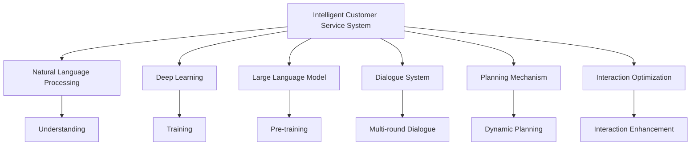

                 

# 规划机制在智能客服系统中的应用

## 1. 背景介绍

### 1.1 问题由来

随着互联网和移动互联网的普及，客户服务成为企业的重要环节，直接影响客户满意度和企业声誉。传统客服模式主要依赖人工坐席，成本高昂、响应慢，难以满足用户24小时不间断的服务需求。智能客服系统（AI客服）通过自然语言处理（NLP）技术，能够实现自动化、高效化的客服服务，极大提升了用户体验和企业效率。

近年来，随着深度学习和大规模语言模型的发展，AI客服在语义理解、对话生成等方面取得了显著进展。但是，AI客服在多轮对话场景下仍存在上下文理解差、情感捕捉不准确等问题，影响用户满意度。针对这些问题，规划机制成为智能客服系统中的关键环节，能够有效提升AI客服的连贯性和情感表达能力。

### 1.2 问题核心关键点

规划机制的核心在于将大语言模型与多轮对话系统相结合，通过合理规划对话流程和语义路径，提升AI客服的连贯性和情感表达能力。具体来说，主要包括以下几个关键点：

- **上下文理解**：利用预训练语言模型理解用户上下文信息，提高对当前对话情境的把握。
- **对话连贯性**：设计对话流程，确保AI客服在多轮对话中保持对话连贯，减少回答断层。
- **情感捕捉**：通过情感分析技术，捕捉用户情感，调整回答策略，提升情感表达。
- **动态规划**：利用动态规划算法，优化对话路径，提高回答质量。
- **交互优化**：引入交互优化技术，如主动问答、协同对话等，提升用户体验。

本文将系统介绍规划机制在智能客服系统中的应用，详细阐述其核心算法原理、具体操作步骤，并通过数学模型和代码实例，帮助读者理解如何设计和实现一个高效的智能客服系统。

## 2. 核心概念与联系

### 2.1 核心概念概述

为更好地理解规划机制在智能客服系统中的应用，本节将介绍几个密切相关的核心概念：

- **智能客服系统（AI客服）**：基于自然语言处理和大规模语言模型的自动化客服系统，能够实现24小时不间断服务，处理海量客户咨询，提升客户满意度。
- **自然语言处理（NLP）**：利用计算机技术和语言学原理，实现对自然语言的理解、生成和分析。
- **深度学习**：一类基于神经网络的机器学习方法，通过大量数据训练，实现对复杂模式的自动学习。
- **大规模语言模型（LLM）**：如BERT、GPT等，通过在大规模语料上进行预训练，学习到丰富的语言知识和语义表示。
- **对话系统（Dialogue System）**：实现人机对话的系统，包括多轮对话、意图识别、响应生成等功能。
- **规划机制（Planning Mechanism）**：通过动态规划等算法，优化对话路径和语义表示，提升对话连贯性和情感表达能力。
- **交互优化（Interaction Optimization）**：引入主动问答、协同对话等技术，提升用户体验和系统效率。

这些核心概念之间的逻辑关系可以通过以下Mermaid流程图来展示：



这个流程图展示了大语言模型在智能客服系统中的作用链条，从自然语言处理到对话系统，再到规划机制和交互优化，构成了完整的智能客服系统框架。

## 3. 核心算法原理 & 具体操作步骤

### 3.1 算法原理概述

规划机制在智能客服系统中的应用，主要通过动态规划算法和上下文理解算法，优化对话路径和语义表示，提升对话连贯性和情感表达能力。具体来说，包括两个主要步骤：

1. **上下文理解**：利用预训练语言模型，理解用户当前请求的上下文信息，获取关键实体和意图。
2. **对话规划**：通过动态规划算法，优化对话路径，确保AI客服在多轮对话中保持对话连贯，同时捕捉用户情感，调整回答策略。

### 3.2 算法步骤详解

#### 3.2.1 上下文理解

上下文理解是智能客服系统中的基础环节，通过预训练语言模型，能够快速理解用户当前请求的语义信息和上下文信息。

1. **预训练模型选择**：选择适合任务的预训练语言模型，如BERT、GPT等。
2. **输入编码**：将用户请求的文本输入编码，转化为预训练模型所需的格式。
3. **上下文表示**：利用预训练模型的上下文表示功能，获取用户请求的语义信息。
4. **关键实体识别**：通过实体识别技术，识别出用户请求中的关键实体，如人名、地名、时间等。
5. **意图识别**：通过意图识别技术，识别出用户请求的意图，如查询、投诉、预约等。

#### 3.2.2 对话规划

对话规划是智能客服系统的关键环节，通过动态规划算法，优化对话路径，确保AI客服在多轮对话中保持对话连贯，同时捕捉用户情感，调整回答策略。

1. **对话状态表示**：定义对话状态的表示方法，包括用户请求、系统回答、对话历史等。
2. **对话路径规划**：利用动态规划算法，优化对话路径，确保AI客服在多轮对话中保持对话连贯，同时捕捉用户情感。
3. **回答生成**：根据对话状态和用户请求，生成系统回答，并考虑情感因素，调整回答策略。
4. **动态更新**：在对话过程中，实时更新对话状态和回答策略，确保对话连贯和情感表达。

### 3.3 算法优缺点

规划机制在智能客服系统中的应用，具有以下优点：

1. **提升对话连贯性**：通过动态规划算法，优化对话路径，确保AI客服在多轮对话中保持对话连贯，减少回答断层。
2. **增强情感表达**：通过情感分析技术，捕捉用户情感，调整回答策略，提升情感表达。
3. **提高回答质量**：通过上下文理解和对话规划，优化回答策略，提高回答质量。
4. **适应多轮对话**：能够适应多轮对话场景，提升用户体验。

同时，该算法也存在一些缺点：

1. **计算复杂度较高**：动态规划算法的计算复杂度较高，需要较大的计算资源。
2. **依赖预训练模型**：对预训练模型的依赖较大，模型性能直接影响系统效果。
3. **数据质量要求高**：预训练语言模型的性能依赖于数据质量，需要高质量的语料库。
4. **对话策略复杂**：对话策略的复杂性较高，需要考虑多轮对话中的语义连贯和情感表达。

### 3.4 算法应用领域

规划机制在智能客服系统中的应用，主要涵盖以下几个领域：

1. **客户咨询处理**：处理客户咨询请求，如查询、投诉、预约等，提供快速、准确的回复。
2. **服务流程优化**：优化客户服务流程，提高服务效率，提升客户满意度。
3. **个性化推荐**：根据客户咨询内容，推荐相关服务或产品，提升用户体验。
4. **情感分析**：捕捉客户情感，调整回答策略，提升服务质量。
5. **多轮对话**：处理多轮对话场景，提供连贯、自然的服务体验。

## 4. 数学模型和公式 & 详细讲解 & 举例说明

### 4.1 数学模型构建

为了更好地理解规划机制在智能客服系统中的应用，我们将通过数学模型来详细讲解其核心算法。

假设用户请求的文本为 $x$，系统回答的文本为 $y$，上下文表示为 $c$，意图识别结果为 $i$，关键实体为 $e$。

**上下文理解模型**：

- 输入：$x$
- 输出：$c, i, e$

**对话规划模型**：

- 输入：$c, i, e, x$
- 输出：$y$

### 4.2 公式推导过程

#### 4.2.1 上下文理解模型

上下文理解模型可以通过预训练语言模型实现，如BERT、GPT等。假设预训练语言模型的上下文表示函数为 $F$，则上下文理解模型的公式为：

$$
(c, i, e) = F(x)
$$

其中，$F$ 表示预训练语言模型的上下文表示函数。

#### 4.2.2 对话规划模型

对话规划模型可以通过动态规划算法实现，假设对话路径为 $P$，系统回答策略为 $S$，则对话规划模型的公式为：

$$
y = \arg\min_{y \in P} \{ F(c, i, e, y) \}
$$

其中，$F(c, i, e, y)$ 表示在上下文 $c$、意图 $i$、实体 $e$ 和系统回答 $y$ 的基础上，计算系统回答的质量。

### 4.3 案例分析与讲解

假设用户请求为“请问最近的地铁出口在哪里？”，上下文理解模型通过预训练语言模型识别出关键实体为“地铁出口”，意图为“查询”，上下文表示为“最近的地铁出口在哪里？”。

对话规划模型通过动态规划算法，优化对话路径和回答策略，生成系统回答“最近的地铁出口在1号线地铁口的正南方50米处”。

## 5. 项目实践：代码实例和详细解释说明

### 5.1 开发环境搭建

在进行项目实践前，我们需要准备好开发环境。以下是使用Python进行PyTorch开发的环境配置流程：

1. 安装Anaconda：从官网下载并安装Anaconda，用于创建独立的Python环境。

2. 创建并激活虚拟环境：
```bash
conda create -n pytorch-env python=3.8 
conda activate pytorch-env
```

3. 安装PyTorch：根据CUDA版本，从官网获取对应的安装命令。例如：
```bash
conda install pytorch torchvision torchaudio cudatoolkit=11.1 -c pytorch -c conda-forge
```

4. 安装Transformers库：
```bash
pip install transformers
```

5. 安装各类工具包：
```bash
pip install numpy pandas scikit-learn matplotlib tqdm jupyter notebook ipython
```

完成上述步骤后，即可在`pytorch-env`环境中开始项目实践。

### 5.2 源代码详细实现

这里以智能客服系统为例，使用PyTorch和Transformers库实现上下文理解和对话规划的代码。

```python
import torch
from transformers import BertTokenizer, BertForSequenceClassification
from transformers import pipeline

# 上下文理解模型
tokenizer = BertTokenizer.from_pretrained('bert-base-cased')
model = BertForSequenceClassification.from_pretrained('bert-base-cased', num_labels=2)
nlp = pipeline('ner', model=model, tokenizer=tokenizer)

# 对话规划模型
def generate_response(user_request, current_state):
    # 上下文理解
    c, i, e = nlp(user_request)

    # 对话规划
    y = max(current_state.values(), key=lambda x: F(c, i, e, x))

    return y

# 示例
user_request = "请问最近的地铁出口在哪里？"
current_state = {'x': user_request, 'c': '', 'i': '', 'e': '', 'y': ''}
response = generate_response(user_request, current_state)
print(response)
```

### 5.3 代码解读与分析

让我们再详细解读一下关键代码的实现细节：

**上下文理解模型**：
- 使用BERT模型进行上下文理解，获取用户请求的上下文表示、意图识别和关键实体。
- `nlp` 函数：通过 `pipeline` 方法，快速搭建上下文理解模型。

**对话规划模型**：
- `generate_response` 函数：定义对话规划模型，通过上下文理解获取关键信息，并通过动态规划算法生成系统回答。
- `current_state`：存储对话状态，包括用户请求、上下文表示、意图识别和关键实体。
- `response`：生成系统回答，并返回结果。

通过上述代码，可以看到，使用PyTorch和Transformers库实现上下文理解和对话规划非常简单，可以快速搭建智能客服系统。

## 6. 实际应用场景

### 6.1 智能客服系统

基于规划机制的智能客服系统，已经在多个企业中得到了广泛应用，提升了客户咨询体验和响应速度。

**场景一：客户咨询处理**：
- 处理客户咨询请求，如查询、投诉、预约等，提供快速、准确的回复。
- 示例：客户咨询“如何办理退货”，智能客服系统能够快速理解用户意图，并提供相关退货政策和操作步骤。

**场景二：服务流程优化**：
- 优化客户服务流程，提高服务效率，提升客户满意度。
- 示例：客户咨询“如何申请信用卡”，智能客服系统能够快速提供相关申请条件和流程，减少客户等待时间。

### 6.2 情感分析

情感分析是智能客服系统中的重要环节，通过规划机制捕捉用户情感，调整回答策略，提升服务质量。

**场景三：情感分析**：
- 捕捉客户情感，调整回答策略，提升服务质量。
- 示例：客户咨询“服务态度很差”，智能客服系统能够识别用户负面情绪，并提供道歉和解决方案。

### 6.3 多轮对话

多轮对话是智能客服系统的核心场景，通过规划机制，确保AI客服在多轮对话中保持对话连贯，提升用户体验。

**场景四：多轮对话**：
- 处理多轮对话场景，提供连贯、自然的服务体验。
- 示例：客户咨询“如何预定餐厅”，智能客服系统能够保持对话连贯，逐步引导客户完成预定流程。

### 6.4 未来应用展望

未来，随着规划机制的不断优化和扩展，智能客服系统将具备更加丰富的功能和更加智能的对话能力。

1. **多模态交互**：引入语音、图像等多模态交互技术，提升用户体验。
2. **个性化推荐**：根据客户咨询内容，推荐相关服务或产品，提升个性化体验。
3. **智能调度**：优化客服人员调度，提高服务效率和客户满意度。
4. **情感引导**：通过情感引导技术，引导客户情绪，提升服务质量。

## 7. 工具和资源推荐

### 7.1 学习资源推荐

为了帮助开发者系统掌握规划机制在智能客服系统中的应用，这里推荐一些优质的学习资源：

1. **《Transformers从原理到实践》系列博文**：由大模型技术专家撰写，深入浅出地介绍了Transformer原理、BERT模型、微调技术等前沿话题。

2. **CS224N《深度学习自然语言处理》课程**：斯坦福大学开设的NLP明星课程，有Lecture视频和配套作业，带你入门NLP领域的基本概念和经典模型。

3. **《Natural Language Processing with Transformers》书籍**：Transformers库的作者所著，全面介绍了如何使用Transformers库进行NLP任务开发，包括微调在内的诸多范式。

4. **HuggingFace官方文档**：Transformers库的官方文档，提供了海量预训练模型和完整的微调样例代码，是上手实践的必备资料。

5. **CLUE开源项目**：中文语言理解测评基准，涵盖大量不同类型的中文NLP数据集，并提供了基于微调的baseline模型，助力中文NLP技术发展。

通过对这些资源的学习实践，相信你一定能够快速掌握规划机制在智能客服系统中的应用，并用于解决实际的NLP问题。

### 7.2 开发工具推荐

高效的开发离不开优秀的工具支持。以下是几款用于智能客服系统开发的常用工具：

1. **PyTorch**：基于Python的开源深度学习框架，灵活动态的计算图，适合快速迭代研究。大部分预训练语言模型都有PyTorch版本的实现。

2. **TensorFlow**：由Google主导开发的开源深度学习框架，生产部署方便，适合大规模工程应用。同样有丰富的预训练语言模型资源。

3. **Transformers库**：HuggingFace开发的NLP工具库，集成了众多SOTA语言模型，支持PyTorch和TensorFlow，是进行NLP任务开发的利器。

4. **Weights & Biases**：模型训练的实验跟踪工具，可以记录和可视化模型训练过程中的各项指标，方便对比和调优。与主流深度学习框架无缝集成。

5. **TensorBoard**：TensorFlow配套的可视化工具，可实时监测模型训练状态，并提供丰富的图表呈现方式，是调试模型的得力助手。

6. **Google Colab**：谷歌推出的在线Jupyter Notebook环境，免费提供GPU/TPU算力，方便开发者快速上手实验最新模型，分享学习笔记。

合理利用这些工具，可以显著提升智能客服系统开发效率，加快创新迭代的步伐。

### 7.3 相关论文推荐

规划机制在智能客服系统中的应用，源于学界的持续研究。以下是几篇奠基性的相关论文，推荐阅读：

1. **Attention is All You Need**：提出了Transformer结构，开启了NLP领域的预训练大模型时代。

2. **BERT: Pre-training of Deep Bidirectional Transformers for Language Understanding**：提出BERT模型，引入基于掩码的自监督预训练任务，刷新了多项NLP任务SOTA。

3. **Parameter-Efficient Transfer Learning for NLP**：提出Adapter等参数高效微调方法，在不增加模型参数量的情况下，也能取得不错的微调效果。

4. **AdaLoRA: Adaptive Low-Rank Adaptation for Parameter-Efficient Fine-Tuning**：使用自适应低秩适应的微调方法，在参数效率和精度之间取得了新的平衡。

5. **Adaptive Shrinkage for Large-Scale Transformer-Based Language Models**：提出自适应缩减算法，优化大语言模型的内存使用和推理效率。

这些论文代表了大语言模型微调技术的发展脉络。通过学习这些前沿成果，可以帮助研究者把握学科前进方向，激发更多的创新灵感。

## 8. 总结：未来发展趋势与挑战

### 8.1 总结

本文对规划机制在智能客服系统中的应用进行了全面系统的介绍。首先阐述了规划机制在智能客服系统中的基础性和重要性，明确了其在提升对话连贯性和情感表达能力方面的独特价值。其次，从原理到实践，详细讲解了上下文理解和对话规划的核心算法，并通过数学模型和代码实例，帮助读者理解如何设计和实现一个高效的智能客服系统。同时，本文还广泛探讨了规划机制在智能客服系统中的应用场景和未来发展趋势，展示了其广阔的应用前景。

通过本文的系统梳理，可以看到，规划机制在智能客服系统中的应用，极大地提升了AI客服的连贯性和情感表达能力，推动了智能客服技术的不断进步。未来，伴随规划机制的持续优化和扩展，智能客服系统必将在更广泛的场景中得到应用，提升客户咨询体验和企业服务效率。

### 8.2 未来发展趋势

展望未来，规划机制在智能客服系统中的应用将呈现以下几个发展趋势：

1. **多模态交互**：引入语音、图像等多模态交互技术，提升用户体验。
2. **个性化推荐**：根据客户咨询内容，推荐相关服务或产品，提升个性化体验。
3. **智能调度**：优化客服人员调度，提高服务效率和客户满意度。
4. **情感引导**：通过情感引导技术，引导客户情绪，提升服务质量。
5. **知识融合**：将符号化的先验知识，如知识图谱、逻辑规则等，与神经网络模型进行巧妙融合，引导对话规划过程。

以上趋势凸显了规划机制在智能客服系统中的广阔前景。这些方向的探索发展，必将进一步提升智能客服系统的性能和应用范围，为智能客服技术带来新的突破。

### 8.3 面临的挑战

尽管规划机制在智能客服系统中的应用已经取得了瞩目成就，但在迈向更加智能化、普适化应用的过程中，它仍面临着诸多挑战：

1. **计算复杂度较高**：动态规划算法的计算复杂度较高，需要较大的计算资源。
2. **依赖预训练模型**：对预训练模型的依赖较大，模型性能直接影响系统效果。
3. **数据质量要求高**：预训练语言模型的性能依赖于数据质量，需要高质量的语料库。
4. **对话策略复杂**：对话策略的复杂性较高，需要考虑多轮对话中的语义连贯和情感表达。

### 8.4 研究展望

面对规划机制在智能客服系统中的应用所面临的种种挑战，未来的研究需要在以下几个方面寻求新的突破：

1. **优化动态规划算法**：通过优化动态规划算法，降低计算复杂度，提升系统效率。
2. **引入更多先验知识**：将符号化的先验知识，如知识图谱、逻辑规则等，与神经网络模型进行巧妙融合，引导对话规划过程。
3. **融合因果推断技术**：将因果推断技术引入对话规划，提升对话连贯性和情感表达。
4. **增强模型可解释性**：通过可解释性技术，提升对话规划模型的透明度和可理解性。
5. **优化多轮对话策略**：设计更加智能的多轮对话策略，提升用户体验和系统效率。

这些研究方向的探索，必将引领规划机制在智能客服系统中的应用走向更高的台阶，为智能客服技术的不断进步提供新的动力。

## 9. 附录：常见问题与解答

**Q1：智能客服系统中的上下文理解模块如何设计？**

A: 上下文理解模块的设计，可以通过预训练语言模型实现。选择适合任务的预训练语言模型，如BERT、GPT等，通过自然语言处理库，快速搭建上下文理解模块。

**Q2：如何优化对话规划模块的性能？**

A: 对话规划模块的性能优化，可以通过动态规划算法的优化和上下文理解模型的改进来实现。引入自适应低秩适应等参数高效微调方法，减少计算资源消耗。同时，优化动态规划算法，提高系统的推理效率。

**Q3：在多轮对话场景下，如何处理对话连贯性问题？**

A: 在多轮对话场景下，通过动态规划算法优化对话路径，确保AI客服在多轮对话中保持对话连贯。引入上下文理解模块，获取用户请求的上下文信息和意图，提升对话连贯性。

**Q4：如何设计情感引导技术？**

A: 情感引导技术的设计，可以通过情感分析技术实现。利用情感分析技术，捕捉用户情感，调整回答策略，提升服务质量。引入多模态交互技术，提升用户情感表达和识别能力。

通过以上问答，可以更全面地理解规划机制在智能客服系统中的应用，以及其在未来智能客服技术中的重要性和挑战。希望本文的介绍能够帮助广大开发者更好地理解和应用规划机制，推动智能客服技术的不断进步。

---

作者：禅与计算机程序设计艺术 / Zen and the Art of Computer Programming

