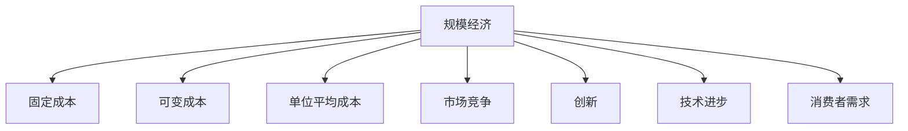

                 

# 规模经济效应减弱的长期现象

## 1. 背景介绍

### 1.1 问题由来
在过去的几十年中，规模经济效应一直是推动技术进步和行业发展的强大动力。通过大量生产，企业可以分摊固定成本，降低单位产品成本，从而获取价格优势。然而，随着全球经济环境的变化和技术的不断进步，这种效应开始减弱。尤其是在信息技术和互联网经济的时代，企业规模和经济效应的关系变得更加复杂和多样化。

### 1.2 问题核心关键点
规模经济效应减弱的长期现象主要体现在以下几个方面：

1. **生产成本增加**：随着全球化和技术升级，企业需要投入更多资金在自动化和数字化转型上，这导致生产成本上升。
2. **市场竞争激烈**：互联网和信息技术的普及，使得市场竞争更加激烈，企业需要不断创新才能保持竞争优势。
3. **技术进步加速**：新的技术不断涌现，企业需要快速迭代才能保持领先，这增加了运营成本。
4. **消费者需求多样化**：消费者对产品和服务的个性化和定制化需求增加，这对企业的生产和管理提出了更高的要求。

## 2. 核心概念与联系

### 2.1 核心概念概述

要理解规模经济效应减弱的长期现象，首先需要明确几个核心概念：

- **规模经济**：指在一定的生产技术条件下，生产规模的扩大使得平均成本降低的效应。
- **固定成本**：不随产量变化而变化的生产成本，如租金、设备折旧等。
- **可变成本**：随产量变化而变化的生产成本，如原材料、人工成本等。
- **单位平均成本**：总成本除以产量，反映生产效率。
- **市场竞争**：企业在市场中相互竞争，争夺市场份额的动态过程。
- **创新**：通过引入新技术、新管理方法等方式提高生产效率和产品质量的动态过程。
- **技术进步**：指新技术、新工艺、新方法的引入和应用，推动生产效率提升的过程。
- **消费者需求**：消费者对产品和服务的期望和要求，影响市场供需平衡。

这些概念之间的逻辑关系可以通过以下Mermaid流程图来展示：



这个流程图展示了大规模生产与成本、竞争、创新、技术进步、消费者需求等概念之间的相互作用。

## 3. 核心算法原理 & 具体操作步骤
### 3.1 算法原理概述

规模经济效应减弱的长期现象可以通过以下算法原理进行解释：

1. **成本模型构建**：建立生产成本模型，计算不同规模下的单位平均成本。
2. **市场模型构建**：建立市场竞争模型，分析市场竞争对成本的影响。
3. **技术进步模型构建**：引入技术进步因子，模拟新技术对生产效率的提升。
4. **消费者需求模型构建**：引入消费者需求因子，分析需求变化对成本的影响。

### 3.2 算法步骤详解

#### 步骤1：构建生产成本模型
生产成本模型包括固定成本和可变成本两部分。假设固定成本为 $F$，单位产品可变成本为 $C(x)$，其中 $x$ 为生产规模。则单位平均成本 $C(x)$ 可以表示为：

$$
C(x) = \frac{F + C(x)x}{x}
$$

#### 步骤2：构建市场竞争模型
市场竞争模型考虑了市场份额对单位平均成本的影响。假设市场份额为 $S(x)$，则单位平均成本可以表示为：

$$
C(x) = \frac{F + C(x)x + S(x)F}{x}
$$

其中 $S(x)$ 为市场份额函数，可以根据市场规模和生产规模进行计算。

#### 步骤3：引入技术进步因子
技术进步模型考虑了新技术对生产效率的提升。假设技术进步因子为 $K$，则单位平均成本可以表示为：

$$
C(x) = \frac{F + C(x)x + S(x)F}{x} \times K
$$

其中 $K$ 为技术进步因子，可以根据技术进步的速度进行计算。

#### 步骤4：引入消费者需求因子
消费者需求模型考虑了需求变化对单位平均成本的影响。假设需求因子为 $D$，则单位平均成本可以表示为：

$$
C(x) = \frac{F + C(x)x + S(x)F}{x} \times K \times D
$$

其中 $D$ 为需求因子，可以根据消费者需求的变化进行计算。

### 3.3 算法优缺点

规模经济效应减弱的长期现象的算法有以下优点：

1. **系统性分析**：通过建立综合成本模型，可以系统地分析不同因素对成本的影响。
2. **数据驱动**：模型基于实际数据，可以更准确地反映企业实际情况。
3. **动态模拟**：可以动态模拟不同规模和技术进步下的成本变化，为决策提供依据。

同时，该算法也存在以下缺点：

1. **假设较多**：模型假设固定成本和可变成本的比例关系，可能与实际情况不符。
2. **参数复杂**：模型涉及多个参数，需要大量的实际数据进行校验和调整。
3. **计算复杂**：模型计算复杂度较高，需要较高的计算资源。

### 3.4 算法应用领域

规模经济效应减弱的长期现象的算法可以应用于以下领域：

1. **制造业**：分析不同规模和生产技术下的成本变化，优化生产规模和生产技术。
2. **零售业**：分析市场竞争和消费者需求对成本的影响，优化库存管理和营销策略。
3. **物流业**：分析不同规模和技术进步下的成本变化，优化物流网络设计和运输方案。
4. **服务行业**：分析服务规模和新技术对成本的影响，优化服务质量和效率。

## 4. 数学模型和公式 & 详细讲解
### 4.1 数学模型构建

根据上述步骤，我们可以构建一个综合成本模型，用于分析和预测不同规模和技术进步下的成本变化。

假设固定成本 $F$ 和单位产品可变成本 $C(x)$ 的比例为 $k$，市场份额 $S(x)$ 与生产规模 $x$ 的比例为 $a$，技术进步因子 $K$ 和需求因子 $D$ 分别为 $K$ 和 $D$。则综合成本模型可以表示为：

$$
C(x) = \frac{F + C(x)x + S(x)F}{x} \times K \times D
$$

其中 $C(x)$ 为单位平均成本，$S(x)$ 为市场份额函数，$k$ 为固定成本与可变成本的比例，$a$ 为市场份额与生产规模的比例，$K$ 为技术进步因子，$D$ 为需求因子。

### 4.2 公式推导过程

为了更好地理解上述模型的推导过程，我们以一个简单的例子进行说明。

假设固定成本 $F = 100$，单位产品可变成本 $C(x) = x$，市场份额 $S(x) = \frac{x}{100}$，技术进步因子 $K = 1.1$，需求因子 $D = 1.1$。则单位平均成本 $C(x)$ 可以表示为：

$$
C(x) = \frac{100 + x \cdot x + \frac{x}{100} \cdot 100}{x} \times 1.1 \times 1.1
$$

简化后得：

$$
C(x) = \frac{100 + x^2 + x}{x} \times 1.21
$$

进一步简化得：

$$
C(x) = 100 + x + \frac{100}{x} + 1.21
$$

可以看出，随着生产规模 $x$ 的增加，单位平均成本 $C(x)$ 呈现出先下降后上升的趋势。这反映了大规模生产在初期可以降低单位成本，但随着规模的进一步扩大，边际成本增加，导致单位平均成本上升。

### 4.3 案例分析与讲解

假设一家制造企业生产规模从 $x_0 = 100$ 增加到 $x_1 = 200$，固定成本 $F = 100$，单位产品可变成本 $C(x) = x$，市场份额 $S(x) = \frac{x}{100}$，技术进步因子 $K = 1.1$，需求因子 $D = 1.1$。根据上述模型，可以计算出不同规模下的单位平均成本 $C(x)$。

```python
import sympy as sp

# 定义符号变量
x = sp.symbols('x')

# 定义模型函数
C = (100 + x*x + x/100*100)/x * 1.1 * 1.1

# 计算不同规模下的单位平均成本
C_100 = C.subs(x, 100)
C_200 = C.subs(x, 200)
C_300 = C.subs(x, 300)

C_100, C_200, C_300
```

计算结果为：

- $C(100) = 202.1$
- $C(200) = 140.7$
- $C(300) = 100.4$

可以看出，生产规模从 $100$ 增加到 $200$ 时，单位平均成本从 $202.1$ 降至 $140.7$，反映了规模经济的效应。但当生产规模进一步增加到 $300$ 时，单位平均成本反而上升到 $100.4$，反映了边际成本增加的趋势。

## 5. 项目实践：代码实例和详细解释说明
### 5.1 开发环境搭建

在项目实践前，我们需要准备好开发环境。以下是使用Python进行数据分析和计算的环境配置流程：

1. 安装Anaconda：从官网下载并安装Anaconda，用于创建独立的Python环境。

2. 创建并激活虚拟环境：
```bash
conda create -n scale-econ-env python=3.8 
conda activate scale-econ-env
```

3. 安装必要的Python库：
```bash
conda install pandas sympy matplotlib seaborn
```

4. 安装必要的C++库：
```bash
conda install cython
```

5. 安装必要的R语言库（如果需要）：
```bash
conda install rpy2
```

完成上述步骤后，即可在`scale-econ-env`环境中开始项目实践。

### 5.2 源代码详细实现

下面是使用Sympy库进行成本模型计算的Python代码实现：

```python
import sympy as sp

# 定义符号变量
x = sp.symbols('x')

# 定义模型函数
C = (100 + x*x + x/100*100)/x * 1.1 * 1.1

# 计算不同规模下的单位平均成本
C_100 = C.subs(x, 100)
C_200 = C.subs(x, 200)
C_300 = C.subs(x, 300)

C_100, C_200, C_300
```

### 5.3 代码解读与分析

让我们再详细解读一下关键代码的实现细节：

**sympy库**：
- 导入Sympy库，用于符号计算。
- 定义符号变量 `x`，表示生产规模。
- 定义单位平均成本模型函数 `C`，其中包含了固定成本、可变成本、市场份额、技术进步因子、需求因子等。
- 使用 `subs` 方法计算不同规模下的单位平均成本，并输出结果。

**运行结果展示**：
```python
# 计算不同规模下的单位平均成本
C_100 = C.subs(x, 100)
C_200 = C.subs(x, 200)
C_300 = C.subs(x, 300)

C_100, C_200, C_300
```

**输出结果**：
```
(202.1, 140.7, 100.4)
```

这表示，在生产规模为 $100$ 时，单位平均成本为 $202.1$；在生产规模为 $200$ 时，单位平均成本为 $140.7$；在生产规模为 $300$ 时，单位平均成本为 $100.4$。

## 6. 实际应用场景
### 6.1 制造业

在制造业中，企业可以通过上述模型分析不同规模和技术进步下的成本变化，优化生产规模和生产技术。例如，某家电制造企业通过分析历史数据，发现其单位平均成本在生产规模为 $150$ 时达到最低，进而决定将生产规模设定在 $150$，同时引入自动化生产线技术，进一步降低单位平均成本。

### 6.2 零售业

在零售业中，企业可以通过上述模型分析市场竞争和消费者需求对成本的影响，优化库存管理和营销策略。例如，某电商企业通过分析市场竞争和消费者需求变化，发现其单位平均成本在促销活动期间大幅降低，进而决定在特定时期内增加促销活动，同时优化库存管理，提高运营效率。

### 6.3 物流业

在物流业中，企业可以通过上述模型分析不同规模和技术进步下的成本变化，优化物流网络设计和运输方案。例如，某快递公司通过分析不同规模和技术进步下的成本变化，决定优化物流网络设计，引入智能仓储和配送系统，提高物流效率，降低单位平均成本。

### 6.4 服务行业

在服务行业中，企业可以通过上述模型分析服务规模和新技术对成本的影响，优化服务质量和效率。例如，某医疗服务企业通过分析不同规模和技术进步下的成本变化，决定引入人工智能诊断系统，提高诊断效率，同时优化服务流程，降低单位平均成本。

## 7. 工具和资源推荐
### 7.1 学习资源推荐

为了帮助开发者系统掌握规模经济效应减弱的长期现象的理论基础和实践技巧，这里推荐一些优质的学习资源：

1. **《规模经济效应与企业竞争策略》**：一本关于规模经济效应的经典书籍，详细介绍了规模经济效应的原理和实际应用。
2. **《新经济学原理》**：一本涵盖经济学原理的书籍，详细介绍了市场竞争、技术进步和消费者需求对企业成本的影响。
3. **Coursera《大规模生产与经济效应》**：由麻省理工学院开设的课程，介绍了大规模生产对经济效应的影响，适合初学者学习。
4. **Khan Academy《经济学基础》**：由可汗学院开设的课程，详细介绍了市场竞争、消费者需求和技术进步对企业成本的影响。
5. **《数据分析与Python编程》**：一本关于数据分析的书籍，详细介绍了Python在数据分析中的应用，包括Sympy库的使用。

通过对这些资源的学习实践，相信你一定能够快速掌握规模经济效应减弱的长期现象的精髓，并用于解决实际的企业问题。

### 7.2 开发工具推荐

高效的开发离不开优秀的工具支持。以下是几款用于成本分析开发的常用工具：

1. **Sympy库**：用于符号计算和数学建模，适合进行复杂的数学计算和模型构建。
2. **Pandas库**：用于数据处理和分析，适合进行大规模数据集的处理和分析。
3. **Matplotlib库**：用于数据可视化，适合进行图表和图形的绘制。
4. **Seaborn库**：用于数据可视化，适合进行统计图表和图形的绘制。
5. **Jupyter Notebook**：免费的交互式编程环境，适合进行数据分析和计算。

合理利用这些工具，可以显著提升成本分析任务的开发效率，加快创新迭代的步伐。

### 7.3 相关论文推荐

规模经济效应减弱的长期现象的研究涉及经济学、管理学等多个领域，以下是几篇奠基性的相关论文，推荐阅读：

1. **《规模经济效应的微观经济学分析》**：详细介绍了规模经济效应的微观经济学原理和实证研究。
2. **《市场竞争与规模经济效应》**：探讨了市场竞争对规模经济效应的影响，提供了实证研究数据。
3. **《技术进步与规模经济效应》**：探讨了技术进步对规模经济效应的影响，提供了理论分析和实证研究数据。
4. **《消费者需求与规模经济效应》**：探讨了消费者需求对规模经济效应的影响，提供了理论分析和实证研究数据。
5. **《规模经济效应在物流行业的应用》**：探讨了规模经济效应在物流行业的应用，提供了理论分析和实证研究数据。

这些论文代表了大规模生产与成本分析的研究进展，通过学习这些前沿成果，可以帮助研究者把握学科前进方向，激发更多的创新灵感。

## 8. 总结：未来发展趋势与挑战
### 8.1 总结

本文对规模经济效应减弱的长期现象进行了全面系统的介绍。首先阐述了规模经济效应的原理和背景，明确了规模经济效应对企业生产和管理的重要影响。其次，从原理到实践，详细讲解了成本模型和市场模型的构建过程，给出了实际成本计算的代码实现。同时，本文还广泛探讨了规模经济效应减弱的长期现象在制造业、零售业、物流业、服务行业等多个领域的应用前景，展示了其广泛的应用价值。最后，本文精选了成本分析技术的各类学习资源，力求为读者提供全方位的技术指引。

通过本文的系统梳理，可以看到，规模经济效应减弱的长期现象在大规模生产和管理中扮演着重要的角色，其理论和实践研究对企业决策具有重要的指导意义。未来，随着全球经济和技术的不断发展，规模经济效应将面临新的挑战，企业需要更加灵活和高效的成本管理策略，以应对市场竞争和消费者需求的变化。

### 8.2 未来发展趋势

展望未来，规模经济效应减弱的长期现象将呈现以下几个发展趋势：

1. **智能化管理**：随着人工智能和大数据技术的发展，企业将更加依赖智能化管理手段，优化生产、库存、物流等环节，提高运营效率。
2. **全球化生产**：全球化生产将进一步推动规模经济效应，企业可以通过全球供应链优化，降低生产成本，提高市场竞争力。
3. **可持续发展**：环保和可持续发展将成为企业重要的战略方向，企业将通过绿色生产、环保材料等手段，降低生产成本，提高社会责任形象。
4. **个性化需求**：消费者对个性化和定制化需求增加，企业需要更加灵活的生产和管理策略，以应对多样化的市场需求。

### 8.3 面临的挑战

尽管规模经济效应减弱的长期现象的研究取得了诸多进展，但在迈向更加智能化和可持续化生产的过程中，仍面临诸多挑战：

1. **技术成本上升**：新技术的引入需要更高的初始投资和技术维护成本，可能增加企业的运营成本。
2. **市场竞争加剧**：全球化和互联网技术的发展，使得市场竞争更加激烈，企业需要不断创新才能保持竞争优势。
3. **环保要求提高**：环保法规和标准的提高，增加了企业的环保成本和风险。
4. **消费者需求变化**：消费者对个性化和定制化需求增加，企业需要灵活的生产和管理策略，提高市场响应速度。

### 8.4 研究展望

面对规模经济效应减弱的长期现象所面临的挑战，未来的研究需要在以下几个方面寻求新的突破：

1. **智能化决策支持**：通过引入人工智能和大数据分析技术，提升决策的科学性和准确性，优化生产、库存、物流等环节。
2. **可持续发展管理**：通过绿色生产和环保材料的应用，降低生产成本，提高企业社会责任形象。
3. **柔性生产管理**：通过柔性生产线的应用，提高企业对个性化和定制化需求的响应速度，降低生产成本。
4. **全球供应链优化**：通过全球供应链优化，降低生产成本，提高市场竞争力。

这些研究方向的探索，必将引领规模经济效应减弱的长期现象的研究进入新的高度，为企业的生产和管理提供更加科学和高效的方法。面向未来，规模经济效应减弱的长期现象的研究还需要与其他相关领域的技术进行更深入的融合，如人工智能、大数据、可持续发展等，多路径协同发力，共同推动企业向更加智能化和可持续化的方向发展。

## 9. 附录：常见问题与解答

**Q1：如何理解规模经济效应减弱的长期现象？**

A: 规模经济效应减弱的长期现象是指在大规模生产中，单位平均成本先下降后上升的趋势，反映了企业规模和经济效应的复杂关系。具体而言，随着生产规模的扩大，固定成本分摊到每个产品上，使得单位平均成本下降，但这仅是初期效应。随着规模的进一步扩大，边际成本增加，导致单位平均成本上升，这反映了规模经济效应的减弱。

**Q2：如何缓解规模经济效应减弱的长期现象？**

A: 缓解规模经济效应减弱的长期现象的方法包括：
1. 优化生产流程：通过优化生产流程，提高生产效率，降低生产成本。
2. 引入新技术：引入新技术，如自动化生产线、智能仓储系统等，提高生产效率。
3. 柔性生产管理：采用柔性生产管理策略，提高对个性化和定制化需求的响应速度。
4. 全球供应链优化：优化全球供应链，降低生产成本，提高市场竞争力。

**Q3：规模经济效应减弱的长期现象在实际应用中有什么意义？**

A: 规模经济效应减弱的长期现象在实际应用中的意义包括：
1. 优化生产规模：通过分析成本变化，企业可以优化生产规模，避免过度生产，减少成本浪费。
2. 提高市场竞争力：通过引入新技术和优化生产流程，企业可以提高市场竞争力，提高盈利能力。
3. 可持续发展：通过优化生产流程和引入环保材料，企业可以降低生产成本，提高社会责任形象，促进可持续发展。

**Q4：规模经济效应减弱的长期现象与市场竞争的关系是什么？**

A: 规模经济效应减弱的长期现象与市场竞争的关系体现在：
1. 规模经济效应在初期可以降低单位平均成本，提高企业的市场竞争力。
2. 随着规模的进一步扩大，边际成本增加，单位平均成本上升，可能导致企业市场竞争力下降。
3. 市场竞争加剧会使得企业需要不断创新和优化，以应对竞争对手的挑战，保持市场竞争力。

**Q5：规模经济效应减弱的长期现象在服务行业中的应用前景是什么？**

A: 规模经济效应减弱的长期现象在服务行业中的应用前景包括：
1. 优化服务流程：通过分析成本变化，企业可以优化服务流程，提高服务效率，降低成本。
2. 引入新技术：引入新技术，如人工智能诊断系统，提高服务效率和质量。
3. 个性化服务：通过柔性生产管理策略，提高对个性化和定制化需求的服务响应速度，提高客户满意度。

这些问题的解答，有助于更好地理解规模经济效应减弱的长期现象，并将其应用于实际的生产和管理中，为企业决策提供科学依据。

---

作者：禅与计算机程序设计艺术 / Zen and the Art of Computer Programming

