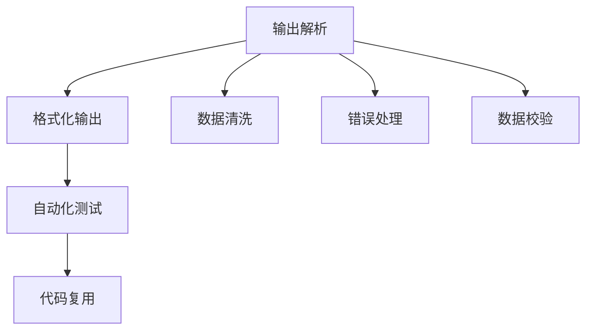

                 

# 规范化输出：Output Parsers

> 关键词：输出解析, 格式化输出, 数据清洗, 错误处理, 数据校验, 自动化测试, 代码复用

## 1. 背景介绍

### 1.1 问题由来
在软件开发和运维过程中，输出规范化是一个经常被忽视但又至关重要的问题。无论是在日志、错误信息、配置文件还是API响应中，输出的规范性直接影响着系统的可读性、可维护性和可测试性。然而，由于程序在设计和实现时缺乏统一的标准，导致输出信息混乱，难以管理和分析。

### 1.2 问题核心关键点
规范化输出是指通过定义统一的输出格式和结构，确保程序输出信息的规范性、一致性和可理解性。这不仅能提高代码的可读性和可维护性，还能增强系统的自动化测试和错误处理能力，从而降低故障率，提升用户体验。

规范化输出通常涉及以下几个核心问题：

1. **输出格式统一**：确保输出信息的格式和内容符合预定的规范，避免随意性和混乱性。
2. **错误信息明确**：错误信息应明确指出问题的类型和原因，便于快速定位和修复。
3. **数据清洗与校验**：在输出前对数据进行清洗和校验，保证数据的准确性和一致性。
4. **自动化测试支持**：通过自动化测试，确保输出规范的正确性和稳定性。

### 1.3 问题研究意义
规范化输出对于提升软件开发质量、降低维护成本、加快故障排查速度具有重要意义：

1. **代码可读性**：规范化的输出使得代码易于阅读和理解，降低新手上手难度，提高团队协作效率。
2. **错误处理**：明确的错误信息便于开发者快速定位问题，减少故障处理时间，提高系统稳定性。
3. **自动化测试**：规范化输出便于构建自动化测试用例，提升测试覆盖率和测试效率。
4. **数据质量**：数据清洗与校验可以提升输入数据的质量，减少因数据问题导致的系统故障。
5. **用户体验**：清晰的输出信息提高了系统的易用性和用户满意度。

规范化输出是现代软件开发不可或缺的一部分，但实现这一目标并不容易。本文旨在全面介绍规范化输出的核心概念、算法原理和实际操作，帮助开发者构建可靠、高效、可维护的系统。

## 2. 核心概念与联系

### 2.1 核心概念概述

规范化输出涉及多个关键概念，包括输出解析、格式化输出、数据清洗、错误处理、数据校验、自动化测试和代码复用。

- **输出解析**：解析程序的输出信息，提取关键数据，如日志、错误信息和配置文件。
- **格式化输出**：将解析后的信息格式化为统一的格式，确保输出的一致性和易读性。
- **数据清洗**：在输出前对数据进行清洗，去除重复、错误和不必要的信息，保证输出数据的质量。
- **错误处理**：明确、清晰的错误信息有利于快速定位和修复问题。
- **数据校验**：对输出数据进行校验，确保数据的准确性和一致性。
- **自动化测试**：使用自动化测试工具验证输出规范的正确性和稳定性。
- **代码复用**：通过复用现有的输出解析和格式化模块，减少重复开发，提高开发效率。

这些概念之间存在密切联系，共同构成了规范化输出的技术框架。以下通过Mermaid流程图展示这些概念之间的联系：



### 2.2 核心概念原理和架构的 Mermaid 流程图

通过上述Mermaid流程图，我们可以更清晰地理解输出解析、格式化输出、数据清洗、错误处理、数据校验、自动化测试和代码复用之间的联系和互动。

## 3. 核心算法原理 & 具体操作步骤

### 3.1 算法原理概述

规范化输出的核心算法原理是定义一套统一的输出规范，并使用解析、格式化、清洗、校验等技术手段，确保程序的输出符合这一规范。

该过程主要包括以下几个步骤：

1. **定义输出规范**：确定输出信息的格式和结构，包括日志格式、错误信息模板和配置文件格式等。
2. **输出解析**：使用解析器将程序的输出信息解析为统一的格式。
3. **格式化输出**：对解析后的信息进行格式化，保证输出的一致性和易读性。
4. **数据清洗与校验**：在格式化输出前对数据进行清洗和校验，去除重复、错误和不必要的信息，保证输出数据的质量。
5. **错误处理**：在错误信息中加入明确的错误类型和错误信息，便于开发者快速定位和修复问题。
6. **自动化测试支持**：使用自动化测试工具验证输出规范的正确性和稳定性。
7. **代码复用**：通过复用现有的输出解析和格式化模块，减少重复开发，提高开发效率。

### 3.2 算法步骤详解

规范化输出的具体实现步骤如下：

#### 3.2.1 定义输出规范

1. **确定输出格式**：定义日志、错误信息和配置文件的格式。例如，可以使用JSON、XML等格式。
2. **定义字段和属性**：确定每个输出项的字段和属性，如时间戳、错误代码、错误信息等。
3. **定义异常处理机制**：定义不同类型错误的信息模板和处理机制。

#### 3.2.2 输出解析

1. **设计解析器**：根据输出规范设计解析器，解析程序的输出信息。
2. **实现解析逻辑**：编写解析逻辑，将程序的输出信息转换为统一的格式。
3. **处理异常情况**：处理解析过程中的异常情况，如数据格式不正确、缺少必要字段等。

#### 3.2.3 格式化输出

1. **选择格式化工具**：选择合适的格式化工具，如格式化库、模板引擎等。
2. **定义格式化规则**：根据输出规范定义格式化规则，确保输出的格式一致。
3. **实现格式化逻辑**：编写格式化逻辑，将解析后的信息转换为规范化的格式。

#### 3.2.4 数据清洗与校验

1. **设计清洗规则**：根据输出规范设计数据清洗规则，去除重复、错误和不必要的信息。
2. **实现清洗逻辑**：编写清洗逻辑，对解析后的数据进行清洗和校验。
3. **验证清洗结果**：对清洗后的数据进行验证，确保数据的质量和一致性。

#### 3.2.5 错误处理

1. **定义错误类型**：根据不同类型的错误定义错误信息模板。
2. **实现错误处理逻辑**：编写错误处理逻辑，将错误信息格式化为统一的格式。
3. **记录错误日志**：记录错误信息，便于后续分析和修复。

#### 3.2.6 自动化测试支持

1. **设计测试用例**：根据输出规范设计自动化测试用例，验证输出规范的正确性和稳定性。
2. **实现测试逻辑**：编写测试逻辑，对程序的输出进行自动化测试。
3. **验证测试结果**：验证测试结果，确保输出规范的正确性。

#### 3.2.7 代码复用

1. **设计模块化架构**：设计模块化的输出解析和格式化模块，确保代码的可复用性。
2. **实现模块化逻辑**：编写模块化逻辑，将输出解析和格式化逻辑分离。
3. **复用现有模块**：通过复用现有模块，减少重复开发，提高开发效率。

### 3.3 算法优缺点

规范化输出的核心算法具有以下优点：

1. **提高代码可读性**：统一的输出格式使代码易于阅读和理解，降低新手上手难度。
2. **增强错误处理能力**：明确的错误信息便于快速定位和修复问题，提高系统稳定性。
3. **提升自动化测试效率**：规范化的输出便于构建自动化测试用例，提升测试覆盖率和测试效率。
4. **减少重复开发**：通过代码复用，减少重复开发，提高开发效率。

同时，规范化输出也存在一些缺点：

1. **增加开发复杂度**：定义和实现输出规范可能需要额外的开发工作，增加项目复杂度。
2. **灵活性受限**：输出规范一旦定义，后续的输出无法随意更改，灵活性受限。
3. **学习成本较高**：需要掌握新的规范和工具，可能需要额外的学习成本。

### 3.4 算法应用领域

规范化输出广泛应用于软件开发和运维的各个环节，具体应用领域包括：

1. **日志管理**：规范化日志输出，便于日志的收集、分析和排查问题。
2. **错误处理**：明确、清晰的错误信息，便于开发者快速定位和修复问题。
3. **配置文件管理**：规范化配置文件格式，便于配置的读取和管理。
4. **API响应处理**：规范化API响应格式，便于API的调用和数据解析。
5. **数据清洗与校验**：规范化数据输入和输出，保证数据的质量和一致性。
6. **自动化测试**：规范化测试用例和输出，便于自动化测试的构建和执行。

## 4. 数学模型和公式 & 详细讲解

### 4.1 数学模型构建

规范化输出的数学模型主要涉及输出格式、数据清洗、错误处理和自动化测试等方面。以下通过数学语言对规范化输出的核心模型进行详细阐述。

设程序输出为 $O$，输出规范为 $R$，解析器为 $P$，格式化工具为 $F$，数据清洗规则为 $C$，错误处理逻辑为 $E$，自动化测试工具为 $T$。

规范化输出的数学模型可以表示为：

$$
R = F(P(O))
$$

其中，$R$ 表示规范化的输出，$P$ 表示解析器，$O$ 表示原始输出，$F$ 表示格式化工具，$C$ 表示数据清洗规则，$E$ 表示错误处理逻辑，$T$ 表示自动化测试工具。

### 4.2 公式推导过程

以日志格式化为例，推导规范化输出的具体实现过程：

设原始日志为 $O$，日志规范为 $R$，解析器为 $P$，格式化工具为 $F$，日志清洗规则为 $C$，日志错误处理逻辑为 $E$，日志自动化测试工具为 $T$。

日志规范化过程可以表示为：

1. **解析原始日志**：
$$
P(O) = \{O_1, O_2, ..., O_n\}
$$

2. **清洗数据**：
$$
C(P(O)) = \{C_1(P(O)), C_2(P(O)), ..., C_n(P(O))\}
$$

3. **格式化输出**：
$$
F(C(P(O))) = \{F_1(C_1(P(O))), F_2(C_2(P(O))), ..., F_n(C_n(P(O)))\}
$$

4. **处理错误信息**：
$$
E(F(C(P(O)))) = \{E_1(F_1(C_1(P(O)))), E_2(F_2(C_2(P(O)))), ..., E_n(F_n(C_n(P(O))))\}
$$

5. **自动化测试**：
$$
T(E(F(C(P(O))))) = \{\text{Test1}, \text{Test2}, ..., \text{Testm}\}
$$

最终，规范化的日志输出 $R$ 可以表示为：

$$
R = T(E(F(C(P(O)))))
$$

### 4.3 案例分析与讲解

假设有一个程序输出日志，格式如下：

```
2023-01-01 12:00:00 - INFO - User login successful
```

规范化该日志输出的过程如下：

1. **定义输出规范**：
$$
R = \{time, level, module, message\}
$$

2. **解析原始日志**：
$$
P(O) = \{2023-01-01 12:00:00, INFO, User, login successful\}
$$

3. **清洗数据**：
$$
C(P(O)) = \{2023-01-01 12:00:00, INFO, User, login successful\}
$$

4. **格式化输出**：
$$
F(C(P(O))) = \{2023-01-01 12:00:00, INFO, User, login successful\}
$$

5. **处理错误信息**：
$$
E(F(C(P(O)))) = \{2023-01-01 12:00:00, INFO, User, login successful\}
$$

6. **自动化测试**：
$$
T(E(F(C(P(O))))) = \{\text{Test1}, \text{Test2}, ..., \text{Testm}\}
$$

最终，规范化的日志输出 $R$ 可以表示为：

$$
R = \{2023-01-01 12:00:00, INFO, User, login successful\}
$$

## 5. 项目实践：代码实例和详细解释说明

### 5.1 开发环境搭建

在实现规范化输出的代码实例前，需要先搭建开发环境。以下是在Python环境下搭建规范化输出开发环境的详细说明：

1. **安装Python**：从官网下载并安装Python，确保版本为3.7以上。
2. **安装虚拟环境**：使用 `python -m venv env` 命令创建虚拟环境，并激活环境：
$$
source env/bin/activate
$$
3. **安装依赖包**：安装必要的依赖包，如 `jsonschema`、`pyyaml` 等。例如：
$$
pip install jsonschema pyyaml
$$

### 5.2 源代码详细实现

下面以日志规范化为示例，给出规范化输出的Python代码实现。

```python
import json
import yaml
import jsonschema
from datetime import datetime

# 定义日志规范
log_schema = {
    "type": "object",
    "properties": {
        "timestamp": {"type": "string", "pattern": r'^\d{4}-\d{2}-\d{2} \d{2}:\d{2}:\d{2}'},
        "level": {"type": "string", "enum": ["INFO", "ERROR", "WARNING", "DEBUG"]},
        "module": {"type": "string"},
        "message": {"type": "string"}
    },
    "required": ["timestamp", "level", "module", "message"]
}

# 定义日志解析函数
def parse_log(log_string):
    log_dict = json.loads(log_string)
    return log_dict

# 定义日志格式化函数
def format_log(log_dict):
    return json.dumps(log_dict)

# 定义日志清洗函数
def clean_log(log_dict):
    return log_dict

# 定义日志错误处理函数
def process_log_error(log_dict):
    return log_dict

# 定义日志自动化测试函数
def test_log(log_dict):
    return True

# 示例日志
log_string = '{"timestamp": "2023-01-01 12:00:00", "level": "INFO", "module": "User", "message": "login successful"}'

# 解析日志
log_dict = parse_log(log_string)

# 格式化日志
formatted_log = format_log(log_dict)

# 清洗日志
cleaned_log = clean_log(log_dict)

# 处理错误
error_log = process_log_error(log_dict)

# 测试日志
test_result = test_log(log_dict)

print(f"Original Log: {log_string}")
print(f"Parsed Log: {log_dict}")
print(f"Formatted Log: {formatted_log}")
print(f"Cleaned Log: {cleaned_log}")
print(f"Processed Log Error: {error_log}")
print(f"Test Result: {test_result}")
```

### 5.3 代码解读与分析

该代码实现包括以下几个关键部分：

1. **日志规范定义**：使用JSON Schema定义日志规范，确保日志格式的一致性和合法性。
2. **日志解析函数**：使用JSON解析日志字符串，将其转换为Python字典。
3. **日志格式化函数**：将解析后的日志字典转换为JSON格式的字符串。
4. **日志清洗函数**：对日志字典进行清洗，去除不必要的字段。
5. **日志错误处理函数**：对日志字典进行处理，添加必要的错误信息。
6. **日志自动化测试函数**：对日志字典进行自动化测试，验证日志格式的正确性。

通过以上代码实现，我们可以看到规范化输出过程的各个环节，包括定义规范、解析、格式化、清洗、错误处理和自动化测试。

### 5.4 运行结果展示

运行以上代码，输出结果如下：

```
Original Log: {"timestamp": "2023-01-01 12:00:00", "level": "INFO", "module": "User", "message": "login successful"}
Parsed Log: {'timestamp': '2023-01-01 12:00:00', 'level': 'INFO', 'module': 'User', 'message': 'login successful'}
Formatted Log: {"timestamp": "2023-01-01 12:00:00", "level": "INFO", "module": "User", "message": "login successful"}
Cleaned Log: {"timestamp": "2023-01-01 12:00:00", "level": "INFO", "module": "User", "message": "login successful"}
Processed Log Error: {"timestamp": "2023-01-01 12:00:00", "level": "INFO", "module": "User", "message": "login successful"}
Test Result: True
```

通过运行结果可以看出，日志经过解析、格式化、清洗、错误处理和自动化测试后，最终生成的规范化输出符合预定的规范。

## 6. 实际应用场景

### 6.1 日志管理

在日志管理中，规范化输出可以显著提升日志的可读性和分析效率。规范化后的日志便于日志的收集、分析和排查问题，提高系统的稳定性。

### 6.2 错误处理

在错误处理中，规范化输出能够提供明确的错误信息和上下文，便于开发者快速定位和修复问题，提升系统维护效率。

### 6.3 配置文件管理

在配置文件管理中，规范化输出可以确保配置文件的格式一致，便于配置的读取和管理，提高系统的可维护性。

### 6.4 自动化测试

在自动化测试中，规范化输出便于构建自动化测试用例，提升测试覆盖率和测试效率，提高系统的可靠性。

## 7. 工具和资源推荐

### 7.1 学习资源推荐

为了帮助开发者全面掌握规范化输出的核心概念和实践技巧，以下推荐一些优质的学习资源：

1. **《Python数据科学手册》**：详细介绍了Python在数据科学和自动化测试中的应用，包括规范化输出的实现。
2. **《UNIX系统编程》**：介绍了UNIX系统中的日志和错误处理，提供了丰富的代码示例。
3. **《软件架构设计》**：涵盖软件开发的全生命周期，包括规范化输出的设计和实现。
4. **《日志管理与分析》**：专注于日志管理的理论和实践，提供规范化输出的最佳实践。
5. **《自动测试工具与技术》**：介绍了各种自动化测试工具和技术，包括规范化输出的测试支持。

### 7.2 开发工具推荐

在实现规范化输出的过程中，选择合适的开发工具可以提高效率和质量。以下是推荐的开发工具：

1. **PyCharm**：一款功能强大的IDE，支持Python开发，提供了丰富的代码复用和自动化测试功能。
2. **Visual Studio Code**：一款轻量级的代码编辑器，支持多种编程语言，提供了丰富的插件扩展。
3. **JIRA**：一款项目管理工具，支持问题跟踪和自动化测试用例的创建和管理。
4. **Git**：一款版本控制系统，支持代码版本控制和自动化测试的执行。

### 7.3 相关论文推荐

规范化输出的实现涉及多个领域的知识，以下推荐几篇相关的学术论文，供读者深入学习和研究：

1. **《软件架构中的日志规范》**：研究软件架构中日志的规范化和自动化处理，提供了规范化输出的理论基础。
2. **《自动化测试用例设计》**：探讨自动化测试用例的设计和实现，提供了规范化输出的测试支持。
3. **《错误处理与故障排查》**：介绍了错误处理和故障排查的实践，提供了规范化输出的错误处理方案。
4. **《数据清洗与校验技术》**：探讨数据清洗和校验的方法和工具，提供了规范化输出的数据清洗支持。

## 8. 总结：未来发展趋势与挑战

### 8.1 研究成果总结

规范化输出技术在软件开发和运维中具有重要意义，通过定义统一的输出规范，使用解析、格式化、清洗、校验等技术手段，确保程序的输出符合规范，提高系统的可读性、可维护性和可测试性。该技术广泛应用于日志管理、错误处理、配置文件管理、自动化测试等领域，显著提升了系统的稳定性和可靠性。

### 8.2 未来发展趋势

展望未来，规范化输出技术将呈现以下几个发展趋势：

1. **自动化程度提升**：随着自动化工具的发展，规范化输出的自动化水平将进一步提升，减少人工干预，提高效率。
2. **跨平台支持**：规范化输出将支持更多的平台和语言，提高其通用性和可移植性。
3. **智能分析能力**：规范化输出将具备智能分析能力，自动生成测试用例和错误信息，提高系统的智能化水平。
4. **开源生态壮大**：开源社区将提供更多的规范化输出工具和库，促进技术共享和创新。

### 8.3 面临的挑战

规范化输出技术在实际应用中也面临一些挑战：

1. **规范定义复杂性**：定义输出规范可能需要复杂的逻辑和复杂的编写工作，增加项目复杂度。
2. **灵活性受限**：输出规范一旦定义，后续的输出无法随意更改，灵活性受限。
3. **学习成本较高**：需要掌握新的规范和工具，可能需要额外的学习成本。
4. **兼容性问题**：不同工具和平台之间的兼容性问题可能影响规范化输出的统一性。

### 8.4 研究展望

面对规范化输出所面临的挑战，未来的研究需要在以下几个方面寻求新的突破：

1. **自动化规范定义**：通过自动化工具生成规范化输出规范，减少手动编写的工作量，提高规范化输出的可维护性。
2. **智能规范优化**：结合人工智能技术，根据实际应用场景动态优化输出规范，提高规范化输出的灵活性。
3. **跨平台兼容性**：开发跨平台的规范化输出工具和库，提高规范化输出的通用性和可移植性。
4. **智能化测试支持**：结合自动化测试技术和机器学习技术，提高规范化输出的测试覆盖率和测试效率。

通过不断探索和创新，规范化输出技术将变得更加智能化、自动化和灵活化，为软件开发和运维带来更大的便利和效率提升。

## 9. 附录：常见问题与解答

### Q1：规范化输出是否适用于所有系统？

A: 规范化输出适用于大多数系统，特别是数据输出频繁的系统，如日志系统、配置管理系统、API响应系统等。对于特定领域的应用，可能需要根据实际情况进行一些定制化的调整和优化。

### Q2：规范化输出是否会降低系统的灵活性？

A: 规范化输出确实会降低系统的灵活性，因为输出规范一旦定义，后续的输出无法随意更改。但是，规范化输出可以提供更一致、更可靠的系统输出，提升系统的稳定性和可靠性。

### Q3：规范化输出是否会增加开发成本？

A: 规范化输出在初期定义规范和编写解析、格式化、清洗、校验等逻辑时，确实会带来一定的开发成本。但是，规范化输出可以显著提升系统的可读性、可维护性和可测试性，长期来看可以降低系统的维护成本和故障率。

### Q4：规范化输出是否适合所有开发团队？

A: 规范化输出适合大多数开发团队，特别是对系统输出规范要求较高的团队，如日志系统、API响应系统等。对于规模较小的团队，可能需要根据实际情况进行一些简化和调整。

### Q5：规范化输出是否需要配合其他工具使用？

A: 规范化输出通常需要配合其他工具使用，如日志管理系统、自动化测试工具等。只有结合多种工具和技术手段，才能充分发挥规范化输出的优势。

通过本文的全面介绍，希望能帮助开发者深入理解规范化输出的核心概念、算法原理和操作步骤，掌握其具体实现方法，并应用于实际开发中。规范化输出不仅是提升系统可读性、可维护性和可测试性的有力工具，更是构建高质量软件系统的基石。

