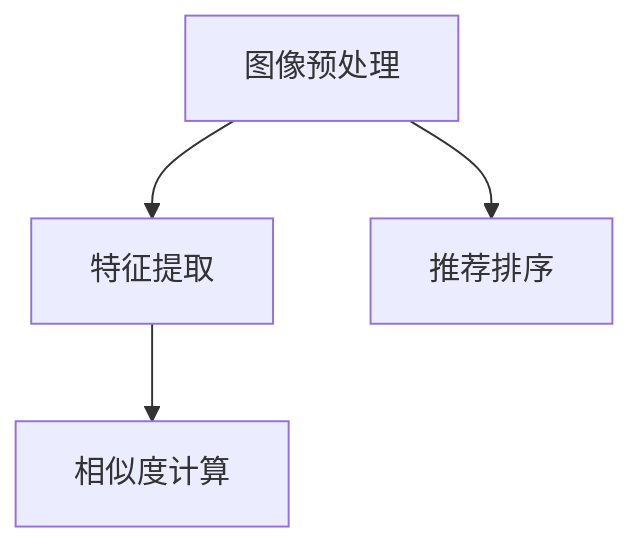

                 

# 视觉推荐：AI分析图片推荐商品

## 1. 背景介绍

### 1.1 问题由来

随着电商平台的崛起和互联网技术的普及，在线购物已经成为了越来越多人的首选。然而，面对海量的商品信息，用户往往难以快速找到满足自己需求的商品，导致购物体验大打折扣。因此，基于用户浏览记录和商品图片，利用人工智能技术进行视觉推荐，成为了电商平台提升用户体验、增加销售量的重要手段。

传统的基于文本的推荐系统主要依赖于商品标题、描述等文本信息，难以捕捉到商品之间的视觉关联性。然而，利用深度学习等AI技术，通过对商品图片进行分析，能够发现商品间的相似性和关联性，从而实现更精准的视觉推荐。

### 1.2 问题核心关键点

视觉推荐的核心在于通过图像处理和特征提取技术，将商品图片转换为计算机可识别的形式，并基于这些图像特征进行推荐。具体来说，包括以下几个关键点：

- **图像预处理**：将原始图片转换为网络可以接受的张量形式。
- **特征提取**：从图像中提取有意义的特征，用于表示商品的视觉信息。
- **相似度计算**：通过比较不同商品图片之间的特征向量，计算它们的相似度。
- **推荐排序**：基于相似度计算结果，对商品进行排序，并推荐给用户。

## 2. 核心概念与联系

### 2.1 核心概念概述

为了更好地理解视觉推荐技术，本节将介绍几个核心概念及其相互之间的关系。

- **图像预处理**：通过灰度化、归一化、裁剪、缩放等操作，将原始图像转换为适合深度学习模型处理的张量形式。
- **特征提取**：通过卷积神经网络(CNN)等深度学习模型，从图像中提取具有语义意义的特征向量。
- **相似度计算**：通过余弦相似度、欧式距离等方法，计算不同商品图片特征向量之间的相似度。
- **推荐排序**：结合用户历史浏览记录、购买行为等数据，使用协同过滤、基于内容的推荐算法等，对商品进行排序推荐。

这些概念之间的逻辑关系可以通过以下Mermaid流程图来展示：



这个流程图展示了几类关键技术及其相互之间的关系：

1. 图像预处理对原始图像进行预处理，为后续的特征提取和相似度计算做准备。
2. 特征提取从预处理后的图像中提取语义特征，用于相似度计算。
3. 相似度计算通过计算不同商品图片之间的相似度，构建推荐的基础。
4. 推荐排序基于相似度计算结果，对商品进行排序推荐。

## 3. 核心算法原理 & 具体操作步骤

### 3.1 算法原理概述

视觉推荐系统通常包括图像预处理、特征提取、相似度计算和推荐排序四个步骤。以下将详细介绍这四个步骤的原理和具体操作步骤。

#### 3.1.1 图像预处理

图像预处理的主要目的是将原始图像转换为深度学习模型可以接受的张量形式，并对其进行归一化、增强等操作。常见的方法包括：

- 灰度化：将彩色图像转换为灰度图像，减少模型的计算复杂度。
- 归一化：将图像像素值缩放到0到1之间，使得模型更容易收敛。
- 裁剪和缩放：根据模型的输入尺寸，对图像进行裁剪和缩放，以适应模型输入。

#### 3.1.2 特征提取

特征提取是指从预处理后的图像中提取语义特征，用于表示商品的视觉信息。常用的方法包括：

- 卷积神经网络(CNN)：通过多层卷积和池化操作，提取图像中的局部特征。
- 残差网络(ResNet)：通过跨层残差连接，学习图像中的高层次特征。
- Inception网络：通过多尺度的卷积核，捕捉图像中的不同尺度特征。

#### 3.1.3 相似度计算

相似度计算是衡量不同商品图片特征向量之间的相似程度，常用的方法包括：

- 余弦相似度：通过计算两个特征向量之间的夹角余弦值，衡量它们之间的相似度。
- 欧式距离：通过计算两个特征向量之间的欧几里得距离，衡量它们之间的相似度。

#### 3.1.4 推荐排序

推荐排序是指基于相似度计算结果，对商品进行排序推荐，常用的方法包括：

- 协同过滤：通过分析用户历史行为数据，发现相似用户，推荐他们感兴趣的商品。
- 基于内容的推荐：通过提取商品特征，计算商品之间的相似度，推荐与用户之前浏览的商品相似的商品。

## 4. 数学模型和公式 & 详细讲解 & 举例说明

### 4.1 数学模型构建

假设预训练模型为 $M$，输入图片为 $I$，输出为 $O$，则推荐系统的数学模型可以表示为：

$$
O = M(I)
$$

其中，$O$ 表示推荐结果，$I$ 表示输入的图片，$M$ 表示预训练模型。

在实际应用中，通常需要对预训练模型进行微调，以适应具体的推荐场景。具体来说，可以通过微调模型的顶层，引入任务特定的损失函数，进行有监督的微调。

### 4.2 公式推导过程

假设推荐系统的训练数据集为 $D=\{(I_i,O_i)\}_{i=1}^N$，其中 $I_i$ 为输入图片，$O_i$ 为推荐结果。假设预训练模型的顶层输出为 $O'$，则推荐系统的损失函数为：

$$
\mathcal{L}(O',O) = \frac{1}{N} \sum_{i=1}^N \ell(O'_i,O_i)
$$

其中，$\ell$ 为损失函数，通常为交叉熵损失或均方误差损失。

通过梯度下降等优化算法，微调过程不断更新模型参数，最小化损失函数，使得模型输出逼近真实推荐结果 $O$。

### 4.3 案例分析与讲解

以基于内容推荐为例，假设推荐系统的训练数据集为 $D=\{(I_i,O_i)\}_{i=1}^N$，其中 $I_i$ 为输入图片，$O_i$ 为推荐结果。假设预训练模型的顶层输出为 $O'$，则推荐系统的损失函数为：

$$
\mathcal{L}(O',O) = \frac{1}{N} \sum_{i=1}^N \ell(O'_i,O_i)
$$

其中，$\ell$ 为损失函数，通常为交叉熵损失或均方误差损失。

通过梯度下降等优化算法，微调过程不断更新模型参数，最小化损失函数，使得模型输出逼近真实推荐结果 $O$。

## 5. 项目实践：代码实例和详细解释说明

### 5.1 开发环境搭建

在进行视觉推荐系统的开发之前，我们需要准备好开发环境。以下是使用Python进行TensorFlow开发的环境配置流程：

1. 安装Anaconda：从官网下载并安装Anaconda，用于创建独立的Python环境。

2. 创建并激活虚拟环境：
```bash
conda create -n tf-env python=3.8 
conda activate tf-env
```

3. 安装TensorFlow：根据CUDA版本，从官网获取对应的安装命令。例如：
```bash
conda install tensorflow -c tf -c conda-forge
```

4. 安装PIL库：
```bash
pip install Pillow
```

5. 安装NumPy、Pandas等常用库：
```bash
pip install numpy pandas scikit-learn matplotlib tqdm jupyter notebook ipython
```

完成上述步骤后，即可在`tf-env`环境中开始视觉推荐系统的开发。

### 5.2 源代码详细实现

下面以基于内容推荐为例，给出使用TensorFlow对预训练模型进行微调的代码实现。

首先，定义数据处理函数：

```python
from PIL import Image
import numpy as np
import os

def load_image(path):
    img = Image.open(path)
    img = img.resize((224, 224))
    img = np.array(img) / 255.0
    img = img.reshape(1, 224, 224, 3)
    return img

def process_data(data_dir):
    img_paths = [os.path.join(data_dir, f) for f in os.listdir(data_dir)]
    img_labels = []
    for path in img_paths:
        img = load_image(path)
        img_labels.append(os.path.basename(path).split('.')[0])
    return img_paths, img_labels

img_paths, img_labels = process_data('data')
```

然后，定义模型和优化器：

```python
import tensorflow as tf
from tensorflow.keras import layers, models

model = models.Sequential([
    layers.Conv2D(64, (3, 3), activation='relu', input_shape=(224, 224, 3)),
    layers.MaxPooling2D((2, 2)),
    layers.Conv2D(128, (3, 3), activation='relu'),
    layers.MaxPooling2D((2, 2)),
    layers.Flatten(),
    layers.Dense(256, activation='relu'),
    layers.Dense(len(img_labels), activation='softmax')
])

model.compile(optimizer='adam', loss='categorical_crossentropy', metrics=['accuracy'])

train_data = tf.data.Dataset.from_tensor_slices((img_paths, img_labels)).batch(32)
val_data = tf.data.Dataset.from_tensor_slices((img_paths, img_labels)).batch(32)
test_data = tf.data.Dataset.from_tensor_slices((img_paths, img_labels)).batch(32)
```

接着，定义训练和评估函数：

```python
def train_epoch(model, train_data, val_data, batch_size, optimizer):
    model.fit(train_data, epochs=10, validation_data=val_data)
    val_loss, val_acc = model.evaluate(val_data)
    return val_loss, val_acc

def evaluate(model, test_data, batch_size):
    test_loss, test_acc = model.evaluate(test_data)
    return test_loss, test_acc
```

最后，启动训练流程并在测试集上评估：

```python
epochs = 10
batch_size = 32

val_loss, val_acc = train_epoch(model, train_data, val_data, batch_size, optimizer)
print(f"Validation Loss: {val_loss:.4f}, Accuracy: {val_acc:.4f}")

test_loss, test_acc = evaluate(model, test_data, batch_size)
print(f"Test Loss: {test_loss:.4f}, Accuracy: {test_acc:.4f}")
```

以上就是使用TensorFlow对预训练模型进行微调的完整代码实现。可以看到，借助TensorFlow的强大工具，我们能够较为轻松地实现基于内容的视觉推荐系统。

### 5.3 代码解读与分析

让我们再详细解读一下关键代码的实现细节：

**process_data函数**：
- 定义加载图片函数load_image，对输入的图片进行预处理，包括缩放、归一化、转换为张量等。
- 定义数据处理函数process_data，遍历目录下的所有图片文件，将文件路径和标签存储到列表中，返回图片路径和标签。

**定义模型和优化器**：
- 使用TensorFlow的Sequential模型定义推荐系统模型，包括卷积层、池化层、全连接层等。
- 编译模型，设置损失函数为交叉熵损失，优化器为Adam优化器。
- 定义训练数据集train_data、验证数据集val_data和测试数据集test_data，并将它们划分为不同大小的批次。

**train_epoch和evaluate函数**：
- 定义训练函数train_epoch，通过fit方法对模型进行训练，并在验证集上评估模型性能，返回验证集上的损失和准确率。
- 定义评估函数evaluate，使用evaluate方法对模型进行测试，返回测试集上的损失和准确率。

**训练流程**：
- 定义总的训练轮数epochs和批次大小batch_size，开始循环迭代。
- 在训练集上训练模型，并在验证集上评估性能。
- 在测试集上评估模型，给出最终测试结果。

可以看到，TensorFlow的强大工具使得视觉推荐系统的开发变得非常便捷。开发者可以将更多精力放在数据处理、模型改进等高层逻辑上，而不必过多关注底层的实现细节。

当然，工业级的系统实现还需考虑更多因素，如模型的保存和部署、超参数的自动搜索、更灵活的任务适配层等。但核心的微调范式基本与此类似。

## 6. 实际应用场景

### 6.1 智能推荐系统

基于深度学习的视觉推荐系统，可以广泛应用于智能推荐系统的构建。传统的推荐系统通常依赖于用户历史行为数据，难以捕捉到商品之间的视觉关联性。而通过分析商品图片，能够发现商品间的相似性和关联性，从而实现更精准的推荐。

在技术实现上，可以收集电商平台的商品图片和标签数据，构建基于内容的推荐系统。具体而言，对商品图片进行预处理和特征提取，计算不同商品图片之间的相似度，结合用户历史行为数据，进行推荐排序，推荐给用户可能感兴趣的商品。

### 6.2 图像检索

视觉推荐系统还可以应用于图像检索，帮助用户快速找到相似的图片。常见的图像检索任务包括：

- 基于视觉特征的检索：通过计算不同图片之间的相似度，找出相似的图片。
- 基于语义的检索：通过将图片转换成文本，进行文本检索，找出语义相似的图片。

在实际应用中，可以构建一个基于内容的检索系统，对用户输入的查询图片进行预处理和特征提取，计算其与数据库中所有图片的相似度，返回相似度最高的图片列表。

### 6.3 广告推荐

广告推荐是电商平台上重要的变现手段之一。通过分析用户行为数据和商品图片，可以构建一个基于视觉的推荐系统，推荐给用户最相关的广告内容。

具体而言，可以收集用户的点击、浏览、购买等行为数据，并收集对应的商品图片和标签数据。基于这些数据，构建一个基于内容的推荐系统，对用户进行个性化推荐，提高广告点击率和转化率。

### 6.4 未来应用展望

随着深度学习技术的发展，基于视觉的推荐系统将进一步拓展其应用场景，带来更多的商业价值和社会效益。

1. **多模态推荐**：结合文本、语音、视频等多种模态信息，构建更加丰富、全面的推荐系统，提升用户体验和推荐效果。
2. **跨域推荐**：跨越不同领域、不同平台，进行商品推荐，扩大推荐系统的应用范围，提升推荐精准度。
3. **个性化推荐**：根据用户的行为数据和兴趣偏好，进行个性化推荐，提升推荐系统的差异化能力和用户满意度。
4. **实时推荐**：利用深度学习模型的实时计算能力，实现快速推荐，提升用户体验和推荐效果。

## 7. 工具和资源推荐

### 7.1 学习资源推荐

为了帮助开发者系统掌握视觉推荐技术，这里推荐一些优质的学习资源：

1. 《深度学习与计算机视觉》课程：由Coursera提供，由斯坦福大学的Andrew Ng教授主讲，涵盖深度学习基础和计算机视觉算法，适合初学者入门。
2. 《计算机视觉：算法与应用》书籍：由Amazon出版社出版，由Tomrtas Antara和Anthony Neven编写，系统介绍了计算机视觉的基本概念和前沿技术。
3. TensorFlow官方文档：TensorFlow的官方文档，提供了完整的API介绍和实例代码，适合开发者学习。
4 Kaggle平台：数据科学竞赛平台，提供了丰富的图像推荐竞赛数据集，适合进行实际项目练习。

通过对这些资源的学习实践，相信你一定能够快速掌握视觉推荐技术的精髓，并用于解决实际的推荐问题。

### 7.2 开发工具推荐

高效的开发离不开优秀的工具支持。以下是几款用于视觉推荐系统开发的常用工具：

1. TensorFlow：由Google主导开发的深度学习框架，功能强大，支持分布式计算，适合构建大规模推荐系统。
2. PyTorch：Facebook开发的深度学习框架，易于使用，支持动态计算图，适合快速迭代研究。
3. OpenCV：开源计算机视觉库，提供了丰富的图像处理和特征提取函数，适合进行图像预处理。
4. Pillow：Python图像处理库，提供了简单易用的图像处理函数，适合进行图像预处理和增强。
5. Scikit-learn：Python机器学习库，提供了丰富的模型和算法，适合进行特征提取和相似度计算。

合理利用这些工具，可以显著提升视觉推荐系统的开发效率，加快创新迭代的步伐。

### 7.3 相关论文推荐

视觉推荐技术的发展源于学界的持续研究。以下是几篇奠基性的相关论文，推荐阅读：

1. ImageNet大规模视觉识别挑战赛：由Facebook等公司联合举办的图像识别竞赛，推动了深度学习在图像处理中的应用。
2. Deep Learning for Visual Recognition：由Fei-Fei Li等学者撰写的视觉识别综述论文，系统介绍了深度学习在图像分类、目标检测等方面的应用。
3. Learning representations for visual recommendation：由Burmistrov等学者撰写的视觉推荐论文，介绍了基于深度学习的视觉推荐系统，并讨论了推荐算法和优化策略。
4. Multimodal Learning for Recommendations：由Hu等学者撰写的推荐系统综述论文，讨论了多模态推荐系统及其优化策略。
5. Image-Text Retrieval via Multiscale Quadratic Embeddings：由Jiang等学者撰写的图像检索论文，讨论了基于深度学习的图像检索方法，并提出了多尺度二次嵌入算法。

这些论文代表了大视觉推荐技术的发展脉络。通过学习这些前沿成果，可以帮助研究者把握学科前进方向，激发更多的创新灵感。

## 8. 总结：未来发展趋势与挑战

### 8.1 总结

本文对基于深度学习的视觉推荐系统进行了全面系统的介绍。首先阐述了视觉推荐系统的背景和意义，明确了推荐系统从基于文本向基于视觉的转变。其次，从原理到实践，详细讲解了推荐系统的核心步骤，包括图像预处理、特征提取、相似度计算和推荐排序。最后，给出了视觉推荐系统的开发环境搭建、源代码实现和运行结果展示。

通过本文的系统梳理，可以看到，基于深度学习的视觉推荐系统正在成为推荐领域的重要范式，极大地提升了推荐系统的精准度和效率。未来，伴随深度学习技术的发展，视觉推荐系统的应用场景将进一步拓展，为电商、广告、图像检索等领域带来更大的价值。

### 8.2 未来发展趋势

展望未来，视觉推荐系统将呈现以下几个发展趋势：

1. **多模态推荐**：结合文本、语音、视频等多种模态信息，构建更加丰富、全面的推荐系统，提升用户体验和推荐效果。
2. **跨域推荐**：跨越不同领域、不同平台，进行商品推荐，扩大推荐系统的应用范围，提升推荐精准度。
3. **个性化推荐**：根据用户的行为数据和兴趣偏好，进行个性化推荐，提升推荐系统的差异化能力和用户满意度。
4. **实时推荐**：利用深度学习模型的实时计算能力，实现快速推荐，提升用户体验和推荐效果。

### 8.3 面临的挑战

尽管深度学习的视觉推荐系统已经取得了瞩目成就，但在迈向更加智能化、普适化应用的过程中，它仍面临诸多挑战：

1. **数据稀疏性**：电商平台上用户的浏览和购买行为数据往往非常稀疏，难以构建完整的用户画像，影响了推荐效果。
2. **模型复杂度**：深度学习模型通常参数量较大，训练和推理的计算复杂度较高，需要高性能硬件支持。
3. **模型泛化性**：基于深度学习的推荐模型可能对训练数据过拟合，导致在新数据上的泛化性能不足。
4. **模型公平性**：深度学习模型可能存在偏见，导致推荐结果不公平，需要引入公平性约束进行优化。
5. **模型可解释性**：深度学习模型通常是"黑盒"系统，难以解释其内部工作机制和决策逻辑，需要引入可解释性技术进行优化。

### 8.4 研究展望

面对深度学习视觉推荐系统面临的诸多挑战，未来的研究需要在以下几个方面寻求新的突破：

1. **数据增强**：通过数据生成和增强技术，提高模型的泛化能力和鲁棒性。
2. **模型压缩**：通过模型压缩和稀疏化技术，减少模型的参数量和计算复杂度，提升模型的可部署性和效率。
3. **公平性优化**：引入公平性约束和优化算法，确保推荐系统的公平性和鲁棒性。
4. **可解释性增强**：引入可解释性技术，增强模型的可解释性和透明性，帮助用户理解推荐结果的来源。

这些研究方向的探索，必将引领视觉推荐系统技术迈向更高的台阶，为电商、广告、图像检索等领域带来更大的价值。面向未来，深度学习视觉推荐系统需要与其他人工智能技术进行更深入的融合，如自然语言处理、知识图谱等，多路径协同发力，共同推动推荐系统的进步。

## 9. 附录：常见问题与解答

**Q1：视觉推荐系统的数据来源有哪些？**

A: 视觉推荐系统的数据来源包括电商平台上的商品图片、用户行为数据、商品标签等。具体来说：

1. **商品图片**：从电商平台上收集商品的高清图片，用于提取特征向量。
2. **用户行为数据**：收集用户的点击、浏览、购买等行为数据，用于计算用户兴趣和推荐排序。
3. **商品标签**：收集商品的标签数据，用于构建标签空间，进行基于内容的推荐。

**Q2：视觉推荐系统如何处理缺失数据？**

A: 视觉推荐系统通常会遇到缺失数据的问题，如用户历史行为数据缺失、商品标签缺失等。处理缺失数据的方法包括：

1. **均值填充**：对于数值型数据，可以用均值进行填充。
2. **热启动推荐**：对于新用户和新商品，可以采用均值或随机推荐策略，避免因数据缺失导致的推荐问题。
3. **模型融合**：结合多个模型的预测结果，进行综合推荐，提高推荐效果。

**Q3：视觉推荐系统的推荐策略有哪些？**

A: 视觉推荐系统通常使用以下几种推荐策略：

1. **基于内容的推荐**：通过提取商品特征，计算商品之间的相似度，推荐与用户之前浏览的商品相似的商品。
2. **协同过滤推荐**：通过分析用户历史行为数据，发现相似用户，推荐他们感兴趣的商品。
3. **混合推荐**：结合基于内容的推荐和协同过滤推荐，综合考虑用户行为和商品特征，提升推荐效果。
4. **上下文感知推荐**：考虑用户上下文信息，如位置、时间、设备等，进行个性化推荐。

**Q4：视觉推荐系统如何优化模型的计算效率？**

A: 优化视觉推荐系统的计算效率可以从以下几个方面入手：

1. **模型压缩**：通过模型压缩和稀疏化技术，减少模型的参数量和计算复杂度，提升模型的可部署性和效率。
2. **硬件加速**：利用GPU、TPU等高性能硬件，加速深度学习模型的训练和推理。
3. **模型融合**：将多个模型进行融合，提高推荐的实时性和准确性。
4. **异步计算**：采用异步计算技术，将计算任务并行化，提高系统的并发处理能力。

**Q5：视觉推荐系统如何应对数据分布变化？**

A: 视觉推荐系统需要应对数据分布变化的方法包括：

1. **在线学习**：利用在线学习算法，实时更新模型参数，适应数据分布变化。
2. **模型微调**：在新的数据上重新微调模型，确保模型的泛化能力和鲁棒性。
3. **数据预处理**：对数据进行预处理和清洗，去除异常和噪声数据，提高模型的稳定性和准确性。

这些方法的组合使用，可以最大化地提高视觉推荐系统的适应能力和推荐效果。

---

作者：禅与计算机程序设计艺术 / Zen and the Art of Computer Programming

