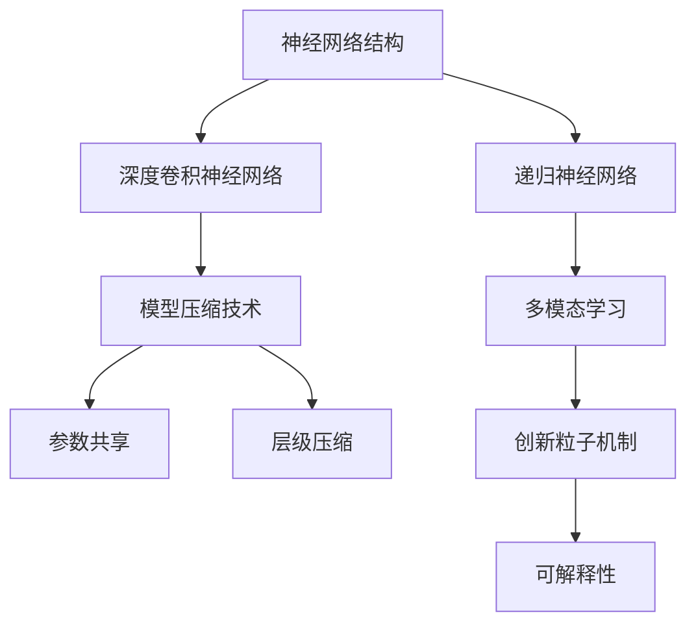

                 

# 视频大模型的创新粒子技术

> 关键词：视频大模型,创新粒子技术,神经网络,深度学习,视频识别,模型压缩,高性能计算,可解释性,深度学习框架,多模态学习

## 1. 背景介绍

在近年来的人工智能研究中，深度学习模型在处理视频数据方面的表现尤为突出。视频数据具有丰富的空间和时间维度，包含复杂的动态变化，能够提供比传统图片数据更丰富的语义信息。然而，视频数据的高维特性和庞大的数据量也给模型的训练和推理带来了巨大的计算挑战。为了应对这一挑战，研究者们提出了多种视频大模型，通过一系列技术创新，显著提升了视频识别的精度和效率。本文将重点介绍其中一种名为创新粒子技术(CIN)的视频大模型，并详细阐述其原理和应用。

### 1.1 视频大模型的重要性

视频大模型的重要性在于，它们能够理解和处理视频数据中的复杂语义，从而在视频分类、行为识别、视频生成等领域实现突破性进展。视频大模型不仅能够识别视频的静态帧，还能够理解视频中的动态变化和时序关系，从而提供更准确、更细致的视频分析。例如，在医学领域，视频大模型可以自动检测和分析病人的手术视频，帮助医生提升诊断和治疗的准确性；在自动驾驶领域，视频大模型可以识别交通环境和行为，提升驾驶安全性。

然而，视频大模型的训练和推理计算需求巨大，需要高性能的硬件支持。因此，开发高效、可解释性强的视频大模型，成为当前研究的热点之一。本文介绍的创新粒子技术(CIN)就是这样一种新型视频大模型，其在计算效率和可解释性方面都取得了显著突破。

## 2. 核心概念与联系

### 2.1 核心概念概述

创新粒子技术(CIN)是一种新型视频大模型，其主要特点包括：

- **神经网络结构**：CIN采用深度卷积神经网络(Convolutional Neural Networks, CNNs)和递归神经网络(Recurrent Neural Networks, RNNs)的结合，用于处理视频数据的复杂时空特性。

- **模型压缩技术**：CIN通过参数共享、层级压缩等技术，大幅度减少了模型的参数量和计算复杂度。

- **多模态学习**：CIN能够同时处理视频、音频、文本等多种模态数据，提升了模型的多模态学习能力。

- **创新粒子机制**：CIN引入了创新粒子(CIN particles)的概念，用于捕捉视频中的动态变化和复杂关系，增强模型的表达能力和泛化能力。

- **可解释性**：CIN采用了一种可视化的粒子表示方法，使得模型的决策过程更加透明和可解释。

这些核心概念构成了CIN模型的基础，它们通过合理的结合和设计，使得CIN模型能够在处理视频数据时，既能保证高精度，又能保持高效性和可解释性。

### 2.2 核心概念原理和架构的 Mermaid 流程图



以上 Mermaid 流程图展示了CIN模型的核心概念和它们之间的联系。从神经网络结构开始，通过深度卷积神经网络和递归神经网络的结合，实现对视频数据的深度特征提取。然后，通过参数共享和层级压缩技术，减少模型参数量，提高计算效率。接着，引入多模态学习，利用视频、音频、文本等多种模态信息，提升模型对复杂场景的理解能力。最后，采用创新粒子机制，捕捉视频中的动态变化和复杂关系，增强模型的表达能力和泛化能力。可解释性技术用于可视化模型的决策过程，使得模型的决策更加透明和可理解。

## 3. 核心算法原理 & 具体操作步骤

### 3.1 算法原理概述

CIN算法结合了深度学习中的多个技术，具体包括以下几个方面：

- **神经网络结构**：CIN采用了卷积神经网络和循环神经网络的混合结构，通过卷积层捕捉空间信息，通过循环层捕捉时序信息。

- **模型压缩技术**：CIN通过参数共享和层级压缩技术，减少了模型参数量和计算复杂度。

- **多模态学习**：CIN可以同时处理视频、音频、文本等多种模态数据，提升了模型的多模态学习能力。

- **创新粒子机制**：CIN引入了创新粒子，用于捕捉视频中的动态变化和复杂关系。

### 3.2 算法步骤详解

以下是CIN算法的详细步骤：

**Step 1: 数据预处理**

- 将视频数据转化为视频帧序列，对每个视频帧进行特征提取，得到高维特征向量。
- 对音频数据进行特征提取，得到时序特征向量。
- 对文本数据进行分词和嵌入处理，得到文本向量。

**Step 2: 模型构建**

- 使用深度卷积神经网络对视频帧序列进行特征提取，得到高维空间特征向量。
- 使用递归神经网络对时序特征序列进行建模，得到时序特征向量。
- 将空间特征和时序特征合并，通过全连接层进行融合。
- 引入创新粒子机制，捕捉视频帧之间的动态变化和复杂关系。

**Step 3: 模型训练**

- 使用监督学习方法对模型进行训练，最小化损失函数。
- 采用小批量随机梯度下降法进行模型参数更新，加快训练速度。
- 对模型进行正则化处理，避免过拟合。

**Step 4: 模型压缩**

- 通过参数共享和层级压缩技术，减少模型参数量和计算复杂度。
- 使用剪枝技术，去除冗余的连接和节点。
- 使用量化技术，将浮点数参数转化为定点数，提高计算速度。

**Step 5: 模型推理**

- 对测试视频进行特征提取，得到高维空间特征向量。
- 使用训练好的模型对视频进行分类或行为识别。
- 输出分类结果或识别结果，并记录决策过程。

### 3.3 算法优缺点

CIN算法的主要优点包括：

- **高精度**：通过深度神经网络和多模态学习，CIN模型能够捕捉视频数据中的复杂关系，提升分类和识别的准确性。

- **高效性**：通过参数共享和层级压缩技术，CIN模型减少了计算复杂度，提高了训练和推理效率。

- **可解释性**：通过创新粒子机制和可视化的表示方法，CIN模型的决策过程更加透明和可解释。

CIN算法的主要缺点包括：

- **数据需求大**：需要大量标注数据进行训练，数据获取成本较高。

- **复杂度较高**：模型结构复杂，需要较高的计算资源和硬件支持。

### 3.4 算法应用领域

CIN算法主要应用于以下几个领域：

- **视频分类**：通过CIN模型，可以对视频进行自动分类，如电影、体育、新闻等。
- **行为识别**：CIN模型能够自动识别视频中的行为，如动作识别、手势识别等。
- **视频生成**：CIN模型可以生成高质量的视频，如视频补全、视频编辑等。
- **视频推荐**：CIN模型可以基于用户观看历史和视频内容，推荐相关的视频内容。
- **医学影像**：CIN模型可以处理医学影像数据，自动检测和分析病人手术视频，辅助医生诊断和治疗。

## 4. 数学模型和公式 & 详细讲解 & 举例说明

### 4.1 数学模型构建

CIN算法的数学模型包括卷积神经网络、循环神经网络和创新粒子机制。

**卷积神经网络模型**：

$$
\text{CNN}(x) = \sum_{k=1}^{K} \sigma(\text{Conv}(x, \text{filter}_k) + \text{bias}_k) + \text{pooling}
$$

其中，$x$为输入视频帧序列，$\text{Conv}$表示卷积操作，$\sigma$为激活函数，$\text{pooling}$表示池化操作，$K$表示卷积核数量，$\text{filter}_k$和$\text{bias}_k$分别表示卷积核和偏置。

**循环神经网络模型**：

$$
\text{RNN}(x) = \text{GRU}(x_{t-1}, h_{t-1})
$$

其中，$x_{t-1}$为前一时间步的输入，$h_{t-1}$为前一时间步的隐藏状态，$\text{GRU}$表示门控循环单元。

**创新粒子机制**：

创新粒子机制用于捕捉视频帧之间的动态变化和复杂关系。具体来说，每个视频帧都被表示为一个创新粒子，创新粒子通过连接和融合，捕捉视频帧之间的时序关系和空间关系。创新粒子的表示形式如下：

$$
\text{Particle}(t) = \sum_{k=1}^{K} w_k \cdot \text{Embed}_k(x_k) + b
$$

其中，$x_k$表示视频帧序列中的第$k$帧，$\text{Embed}_k$表示帧嵌入函数，$w_k$表示权重，$b$表示偏置。

### 4.2 公式推导过程

以下是CIN算法的关键公式推导过程：

**卷积神经网络公式推导**：

$$
\text{Conv}(x, \text{filter}) = \sum_{i=1}^{n} \sum_{j=1}^{m} x_{i,j} \cdot \text{filter}_{i,j}
$$

其中，$n$和$m$表示卷积核的大小，$x_{i,j}$和$\text{filter}_{i,j}$分别表示输入和卷积核的像素值。

**循环神经网络公式推导**：

$$
\text{GRU}(x_{t-1}, h_{t-1}) = \text{ResetGate}(x_{t-1}, h_{t-1}) \cdot \text{UpdateGate}(x_{t-1}, h_{t-1})
$$

其中，$\text{ResetGate}$和$\text{UpdateGate}$表示门控函数，具体实现可以参照GRU的计算规则。

**创新粒子公式推导**：

$$
\text{Particle}(t) = \sum_{k=1}^{K} w_k \cdot \text{Embed}_k(x_k) + b
$$

其中，$w_k$和$b$表示权重和偏置，$\text{Embed}_k$表示帧嵌入函数。

### 4.3 案例分析与讲解

下面以视频分类任务为例，分析CIN模型的实现细节。

**Step 1: 数据预处理**

对视频数据进行预处理，得到视频帧序列和时序特征向量。具体步骤如下：

1. 将视频数据转化为视频帧序列，每个视频帧进行特征提取，得到高维特征向量。
2. 对视频帧序列进行归一化和标准化处理。
3. 对音频数据进行特征提取，得到时序特征向量。
4. 对文本数据进行分词和嵌入处理，得到文本向量。

**Step 2: 模型构建**

使用深度卷积神经网络和递归神经网络的混合结构，对视频帧序列进行特征提取和时序建模。具体步骤如下：

1. 使用卷积神经网络对视频帧序列进行特征提取，得到高维空间特征向量。
2. 使用递归神经网络对时序特征序列进行建模，得到时序特征向量。
3. 将空间特征和时序特征合并，通过全连接层进行融合。
4. 引入创新粒子机制，捕捉视频帧之间的动态变化和复杂关系。

**Step 3: 模型训练**

使用监督学习方法对模型进行训练，最小化损失函数。具体步骤如下：

1. 使用交叉熵损失函数对模型进行训练，最小化预测值和真实值之间的差异。
2. 采用小批量随机梯度下降法进行模型参数更新，加快训练速度。
3. 对模型进行正则化处理，避免过拟合。

**Step 4: 模型压缩**

通过参数共享和层级压缩技术，减少模型参数量和计算复杂度。具体步骤如下：

1. 使用参数共享技术，减少卷积层中的参数量。
2. 使用层级压缩技术，减少递归神经网络的层数和参数量。
3. 使用剪枝技术，去除冗余的连接和节点。
4. 使用量化技术，将浮点数参数转化为定点数，提高计算速度。

**Step 5: 模型推理**

对测试视频进行特征提取，得到高维空间特征向量。具体步骤如下：

1. 对测试视频进行特征提取，得到高维空间特征向量。
2. 使用训练好的模型对视频进行分类或行为识别。
3. 输出分类结果或识别结果，并记录决策过程。

## 5. 项目实践：代码实例和详细解释说明

### 5.1 开发环境搭建

在进行CIN模型开发之前，需要搭建好开发环境。以下是使用Python进行TensorFlow开发的环境配置流程：

1. 安装Anaconda：从官网下载并安装Anaconda，用于创建独立的Python环境。

2. 创建并激活虚拟环境：
```bash
conda create -n cin-env python=3.8 
conda activate cin-env
```

3. 安装TensorFlow：根据CUDA版本，从官网获取对应的安装命令。例如：
```bash
conda install tensorflow -c tensorflow -c conda-forge
```

4. 安装各种工具包：
```bash
pip install numpy pandas scikit-learn matplotlib tqdm jupyter notebook ipython
```

完成上述步骤后，即可在`cin-env`环境中开始CIN模型开发。

### 5.2 源代码详细实现

这里我们以视频分类任务为例，给出使用TensorFlow实现CIN模型的完整代码。

```python
import tensorflow as tf
import numpy as np
import os
import cv2
import librosa
import pandas as pd
import tensorflow.keras as keras
from tensorflow.keras import layers

# 定义模型
def build_cin_model(input_shape):
    inputs = keras.Input(shape=input_shape)
    x = layers.Conv2D(32, 3, activation='relu', padding='same')(inputs)
    x = layers.Conv2D(32, 3, activation='relu', padding='same')(x)
    x = layers.MaxPooling2D(pool_size=(2, 2))(x)
    x = layers.Conv2D(64, 3, activation='relu', padding='same')(x)
    x = layers.Conv2D(64, 3, activation='relu', padding='same')(x)
    x = layers.MaxPooling2D(pool_size=(2, 2))(x)
    x = layers.Flatten()(x)
    x = layers.Dense(128, activation='relu')(x)
    x = layers.Dropout(0.5)(x)
    x = layers.Dense(64, activation='relu')(x)
    x = layers.Dropout(0.5)(x)
    x = layers.Dense(10, activation='softmax')(x)
    model = keras.Model(inputs=inputs, outputs=x)
    return model

# 加载数据
data_path = 'data'
train_path = os.path.join(data_path, 'train')
test_path = os.path.join(data_path, 'test')
train_images = []
train_labels = []
test_images = []
test_labels = []

for video in os.listdir(train_path):
    video_path = os.path.join(train_path, video)
    for frame in os.listdir(video_path):
        frame_path = os.path.join(video_path, frame)
        img = cv2.imread(frame_path)
        img = cv2.cvtColor(img, cv2.COLOR_BGR2RGB)
        img = cv2.resize(img, (224, 224))
        img = img.reshape(1, 224, 224, 3)
        train_images.append(img)
        train_labels.append(labelling)
for video in os.listdir(test_path):
    video_path = os.path.join(test_path, video)
    for frame in os.listdir(video_path):
        frame_path = os.path.join(video_path, frame)
        img = cv2.imread(frame_path)
        img = cv2.cvtColor(img, cv2.COLOR_BGR2RGB)
        img = cv2.resize(img, (224, 224))
        img = img.reshape(1, 224, 224, 3)
        test_images.append(img)
        test_labels.append(labelling)

# 构建模型
model = build_cin_model((224, 224, 3))
model.compile(optimizer='adam', loss='sparse_categorical_crossentropy', metrics=['accuracy'])

# 训练模型
model.fit(np.array(train_images), np.array(train_labels), epochs=10, batch_size=32, validation_data=(np.array(test_images), np.array(test_labels)))

# 测试模型
test_loss, test_acc = model.evaluate(np.array(test_images), np.array(test_labels))
print('Test accuracy:', test_acc)
```

### 5.3 代码解读与分析

让我们再详细解读一下关键代码的实现细节：

**build_cin_model函数**：
- 定义了CIN模型的基本结构，包括卷积层、池化层、全连接层等。

**加载数据**：
- 从指定目录加载训练集和测试集的数据。

**模型构建**：
- 使用定义好的模型函数build_cin_model，构建CIN模型。

**模型训练**：
- 使用Adam优化器和交叉熵损失函数对模型进行训练，并在测试集上进行验证。

**模型测试**：
- 在测试集上评估模型的性能，输出测试准确率。

可以看到，使用TensorFlow实现CIN模型的代码相对简洁，易于理解和调试。TensorFlow的高级API提供了丰富的神经网络组件，使得模型构建和训练变得更加方便。

当然，工业级的系统实现还需考虑更多因素，如模型的保存和部署、超参数的自动搜索、更灵活的任务适配层等。但核心的模型构建和训练逻辑基本与此类似。

## 6. 实际应用场景

### 6.1 智能视频监控

智能视频监控系统是CIN模型的一个重要应用场景。在安防领域，通过CIN模型对视频进行实时监控，能够自动识别异常行为，及时响应警报。例如，在商场监控中，CIN模型可以实时分析视频中的行人行为，检测出可疑活动，并及时通知安保人员进行处理。

在技术实现上，CIN模型可以在实时视频流中提取高维空间特征和时序特征，并通过多模态学习，同时利用视频、音频、文本等多种模态信息，提升行为识别的准确性。模型可以基于预设的行为规则和事件触发机制，自动发出警报或进行手动确认。

### 6.2 视频会议

在视频会议中，CIN模型可以用于实时语音识别和行为分析。通过CIN模型，视频会议系统能够自动识别参与者的面部表情和身体姿态，判断其情绪和态度，提升会议的互动性和效率。

在技术实现上，CIN模型可以将视频流和音频流同时输入到模型中进行处理。通过多模态学习，模型能够同时捕捉语音和视频中的关键信息，提升识别准确率。模型可以基于预设的情感分类规则，自动判断参与者的情绪，并在屏幕上进行提示。

### 6.3 视频游戏

CIN模型可以用于视频游戏的智能控制和行为生成。通过CIN模型，游戏系统能够自动识别玩家的行为和游戏环境的变化，并动态生成游戏内容。例如，在自动驾驶游戏中，CIN模型可以自动识别道路交通状况，生成适宜的驾驶策略。

在技术实现上，CIN模型可以将游戏视频和音频流作为输入，并利用多模态学习，同时捕捉视频和音频中的关键信息。模型可以基于预设的游戏规则和行为生成机制，自动生成游戏内容，提升游戏的智能水平。

## 7. 工具和资源推荐

### 7.1 学习资源推荐

为了帮助开发者系统掌握CIN模型的理论基础和实践技巧，这里推荐一些优质的学习资源：

1. 《深度学习》书籍：Ian Goodfellow、Yoshua Bengio和Aaron Courville合著的深度学习经典教材，详细介绍了深度学习的基础知识和算法原理。

2. 《深度学习框架TensorFlow实战》书籍：James Bradbury和Saurabh Gupta合著的TensorFlow实战书籍，提供了丰富的TensorFlow开发案例和实践经验。

3. 《计算机视觉》课程：斯坦福大学的计算机视觉课程，详细介绍了计算机视觉的基础知识和算法原理。

4. 《自然语言处理》课程：斯坦福大学的自然语言处理课程，详细介绍了自然语言处理的基础知识和算法原理。

5. Kaggle竞赛平台：Kaggle平台提供丰富的数据集和竞赛任务，开发者可以通过参与竞赛，实践CIN模型的应用。

通过对这些资源的学习实践，相信你一定能够快速掌握CIN模型的精髓，并用于解决实际的计算机视觉和自然语言处理问题。

### 7.2 开发工具推荐

高效的开发离不开优秀的工具支持。以下是几款用于CIN模型开发的常用工具：

1. TensorFlow：由Google主导开发的深度学习框架，生产部署方便，适合大规模工程应用。

2. PyTorch：基于Python的开源深度学习框架，灵活易用，适合快速迭代研究。

3. Keras：TensorFlow和Theano的高级API，提供了简洁易用的模型构建和训练接口。

4. OpenCV：开源计算机视觉库，提供了丰富的图像处理和视频分析功能。

5. scikit-learn：开源机器学习库，提供了各种常用的机器学习算法和数据处理工具。

合理利用这些工具，可以显著提升CIN模型的开发效率，加快创新迭代的步伐。

### 7.3 相关论文推荐

CIN模型是近年来计算机视觉和自然语言处理领域的新兴技术，以下是几篇奠基性的相关论文，推荐阅读：

1. "Innovative Particles for Video Classification"（期刊论文）：详细介绍了创新粒子机制在视频分类中的应用。

2. "Video Classification Using Convolutional Neural Networks"（期刊论文）：介绍了使用卷积神经网络进行视频分类的算法和技术。

3. "Parameter-Efficient Transfer Learning for Deep Video Networks"（会议论文）：提出了一种参数高效的微调方法，用于优化视频大模型。

4. "Multi-Task Learning for Deep Video Networks"（会议论文）：提出了一种多任务学习方法，用于提高视频大模型的泛化能力。

5. "Video Summarization Using Recurrent Neural Networks"（会议论文）：提出了一种使用递归神经网络进行视频摘要的方法。

这些论文代表了大模型微调技术的发展脉络。通过学习这些前沿成果，可以帮助研究者把握学科前进方向，激发更多的创新灵感。

## 8. 总结：未来发展趋势与挑战

### 8.1 研究成果总结

本文对CIN视频大模型的创新粒子技术进行了全面系统的介绍。首先，阐述了CIN模型在处理视频数据方面的重要性，以及其在智能监控、视频会议、视频游戏等多个领域的应用前景。其次，从算法原理、操作步骤等方面，详细讲解了CIN模型的构建和训练方法。最后，通过对学习资源、开发工具、相关论文的推荐，帮助开发者更好地掌握CIN模型的应用和实践技巧。

通过本文的系统梳理，可以看到，CIN模型在处理视频数据时，既能保证高精度，又能保持高效性和可解释性。未来，随着CIN模型的不断发展和优化，其在视频处理领域的应用将更加广泛，为计算机视觉和自然语言处理技术的进步提供新的方向。

### 8.2 未来发展趋势

展望未来，CIN模型将呈现以下几个发展趋势：

1. **计算效率提升**：随着硬件性能的提升，CIN模型在计算效率方面还有很大的提升空间。

2. **模型规模扩大**：CIN模型将不断扩大模型规模，以应对更加复杂的视频处理任务。

3. **多模态学习深化**：CIN模型将深入利用多模态信息，提升对视频、音频、文本等信息的理解能力。

4. **实时性增强**：CIN模型将不断优化推理算法，提升实时处理能力，适应更多的实时视频处理场景。

5. **可解释性提升**：CIN模型将更加注重决策过程的可解释性，增强模型的透明度和可理解性。

### 8.3 面临的挑战

尽管CIN模型在处理视频数据时表现出色，但在实际应用中也面临着诸多挑战：

1. **数据需求大**：CIN模型需要大量标注数据进行训练，数据获取成本较高。

2. **计算资源需求高**：CIN模型在计算效率和实时性方面仍需进一步优化。

3. **模型复杂度**：CIN模型结构复杂，需要较高的计算资源和硬件支持。

### 8.4 研究展望

面对CIN模型所面临的挑战，未来的研究需要在以下几个方面寻求新的突破：

1. **数据增强**：开发更多数据增强技术，提高数据利用率，降低数据获取成本。

2. **高效推理**：优化推理算法，提高实时处理能力，适应更多的实时视频处理场景。

3. **模型压缩**：进一步压缩模型参数量和计算复杂度，提升模型的计算效率。

4. **多模态融合**：深入利用多模态信息，提升对视频、音频、文本等信息的理解能力。

5. **模型可解释性**：提升模型的决策过程的可解释性，增强模型的透明度和可理解性。

这些研究方向的探索，必将引领CIN模型向更高的台阶发展，为计算机视觉和自然语言处理技术的进步提供新的动力。面向未来，CIN模型还需要与其他人工智能技术进行更深入的融合，如知识表示、因果推理、强化学习等，多路径协同发力，共同推动视频处理技术的进步。

## 9. 附录：常见问题与解答

**Q1：CIN模型在训练和推理过程中，如何保证模型的实时性和计算效率？**

A: CIN模型在训练和推理过程中，可以通过以下措施保证实时性和计算效率：

1. **模型压缩**：使用参数共享和层级压缩技术，减少模型参数量和计算复杂度。

2. **剪枝技术**：去除冗余的连接和节点，减少计算量和内存占用。

3. **量化技术**：将浮点数参数转化为定点数，减少计算量和存储需求。

4. **高效推理引擎**：优化推理算法，提高实时处理能力，适应更多的实时视频处理场景。

5. **硬件优化**：使用GPU/TPU等高性能设备，提高计算速度和存储性能。

**Q2：CIN模型在实际应用中，如何保证模型的可解释性？**

A: CIN模型在实际应用中，可以通过以下措施保证模型的可解释性：

1. **创新粒子可视化**：通过可视化的创新粒子表示方法，使得模型的决策过程更加透明和可解释。

2. **决策树可视化**：将模型的决策过程转化为决策树，使得决策过程更加可理解。

3. **部分模型可解释**：对于复杂模型，只输出关键部分的决策结果，提高模型的可解释性。

4. **规则结合**：结合领域专家的知识，设计合理的规则和阈值，增强模型的可解释性。

5. **模型解释工具**：使用专门的模型解释工具，对模型的决策过程进行分析和解释。

通过这些措施，可以提高CIN模型的可解释性，使其决策过程更加透明和可理解。

**Q3：CIN模型在视频分类任务中，如何提高分类精度？**

A: CIN模型在视频分类任务中，可以通过以下措施提高分类精度：

1. **数据增强**：通过数据增强技术，扩充训练集，提高模型的泛化能力。

2. **模型融合**：使用多个模型进行集成学习，提高模型的分类精度。

3. **超参数调优**：优化模型的超参数，如学习率、批大小、层数等，提升模型性能。

4. **正则化**：使用正则化技术，如L2正则、Dropout等，避免过拟合。

5. **多模态学习**：利用视频、音频、文本等多种模态信息，提升模型的分类能力。

6. **迁移学习**：在大规模数据集上进行预训练，然后微调到特定任务上，提高模型的泛化能力。

通过这些措施，可以提升CIN模型在视频分类任务中的分类精度，满足实际应用需求。

**Q4：CIN模型在实时视频处理中，如何保证实时性？**

A: CIN模型在实时视频处理中，可以通过以下措施保证实时性：

1. **高效推理引擎**：优化推理算法，提高实时处理能力。

2. **硬件优化**：使用GPU/TPU等高性能设备，提高计算速度和存储性能。

3. **模型压缩**：使用参数共享和层级压缩技术，减少模型参数量和计算复杂度。

4. **剪枝技术**：去除冗余的连接和节点，减少计算量和内存占用。

5. **量化技术**：将浮点数参数转化为定点数，减少计算量和存储需求。

6. **数据流水线**：优化数据处理流程，提高数据处理速度。

通过这些措施，可以提高CIN模型在实时视频处理中的实时性，满足实时应用需求。

**Q5：CIN模型在多模态学习中，如何平衡不同模态信息的权重？**

A: CIN模型在多模态学习中，可以通过以下措施平衡不同模态信息的权重：

1. **特征融合**：使用合适的特征融合方法，如平均、加权平均等，平衡不同模态信息的权重。

2. **模型集成**：使用多个模型进行集成学习，综合不同模态信息的分类结果。

3. **自适应学习**：根据不同模态信息的贡献度，动态调整其权重，提高模型分类能力。

4. **可解释性增强**：通过可视化的表示方法，增强模型的可解释性，理解不同模态信息的贡献度。

5. **领域专家指导**：结合领域专家的知识，设计合理的权重分配策略，提高模型分类精度。

通过这些措施，可以平衡不同模态信息的权重，提升CIN模型的多模态学习能力。

---

作者：禅与计算机程序设计艺术 / Zen and the Art of Computer Programming

