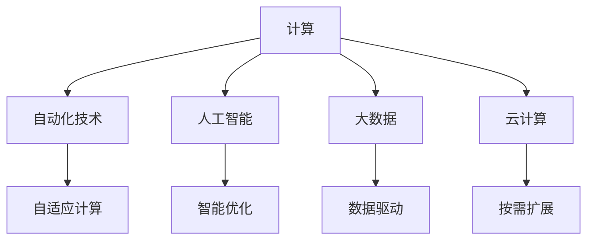

                 

## 1. 背景介绍

### 1.1 问题由来

随着信息技术的发展，计算技术正深刻地影响着各行各业。自动化技术在提升效率、降低成本、改善用户体验方面显示出了巨大的潜力。然而，传统的手动操作方式逐渐无法满足现代信息社会的需求，自动化技术成为新时代发展的必然趋势。

在技术层面，自动化技术正在从单点的自动化逐步向全流程自动化、智能化方向演进。它不仅涵盖了传统的制造业、农业等实体经济领域，还扩展到了金融、医疗、教育等虚拟经济领域。在计算领域，人工智能、大数据、云计算等技术的应用，进一步推动了自动化技术的发展，提高了计算的效率和精度，降低了计算成本，增强了计算的灵活性和可扩展性。

### 1.2 问题核心关键点

自动化技术的核心在于通过计算能力，实现对信息的自动化处理。但计算本身是静态的，如何将静态计算与动态变化的环境相结合，使计算技术真正发挥出其价值，是当前计算领域需要解决的重要问题。同时，自动化技术也需要不断自我优化，以应对计算环境的变化和需求的变化。

### 1.3 问题研究意义

研究计算变化与自动化技术的融合，对于提高生产力和效率，优化资源配置，增强计算系统的适应性和灵活性，具有重要的理论和实践意义。这不仅能推动自动化技术在更多领域的落地应用，还能为计算技术的发展提供新的方向，促进人工智能、大数据、云计算等领域的进一步突破。

## 2. 核心概念与联系

### 2.1 核心概念概述

为更好地理解计算变化与自动化技术的融合，本节将介绍几个密切相关的核心概念：

- **计算**：利用计算机的硬件和软件资源，对数据进行处理、分析和运算的过程。
- **自动化技术**：通过软件工具和算法，自动完成重复性、规则性、可预测性的任务，提高工作效率和准确性。
- **人工智能**：利用计算能力，模拟人类智能，实现自主学习、推理、决策等功能。
- **大数据**：通过收集、存储、分析大量数据，从中提取有价值的信息和模式，支持决策和优化。
- **云计算**：通过网络将计算资源提供给用户，使用户能够按需获取计算能力。
- **自适应计算**：指计算系统能够根据环境变化，自动调整资源配置、算法和任务优先级，以适应不同的计算需求。

这些核心概念之间的逻辑关系可以通过以下Mermaid流程图来展示：



这个流程图展示了一体化的计算体系：

1. **计算**是基础，提供硬件和软件支持。
2. **自动化技术**利用计算能力，自动化处理任务。
3. **人工智能**在计算基础上，模拟智能功能。
4. **大数据**从计算过程中提取有价值信息。
5. **云计算**提供弹性和分布式的计算资源。
6. **自适应计算**通过动态调整，使计算系统适应不同的环境需求。

这些概念共同构成了计算变化与自动化技术的融合框架，展示了计算技术的广泛应用和其与自动化技术的深度结合。

## 3. 核心算法原理 & 具体操作步骤
### 3.1 算法原理概述

计算变化与自动化技术的融合，本质上是一个动态优化问题。它通过计算能力，实时分析和预测环境变化，并据此调整自动化技术的行为和策略，实现高效、精确、灵活的自动化处理。

形式化地，假设环境变化参数为 $\phi_t$，当前自动化技术策略为 $\pi$，目标函数为 $J(\phi_t, \pi)$，代表自动化技术在当前环境下的效能和成本。融合的算法目标是找到一个最优策略 $\pi^*$，使得 $J(\phi_t, \pi^*)$ 在环境变化时始终保持最优。

### 3.2 算法步骤详解

计算变化与自动化技术的融合一般包括以下几个关键步骤：

**Step 1: 收集环境数据**
- 利用传感器、网络等手段，实时监测计算环境的变化，如网络带宽、能源供应、负载情况等。
- 建立环境模型，预测环境变化的趋势和可能的影响。

**Step 2: 策略建模与优化**
- 将环境变化和自动化任务描述为优化问题，定义目标函数和约束条件。
- 使用优化算法（如遗传算法、粒子群算法等），搜索最优策略。

**Step 3: 动态调整**
- 根据环境变化，动态调整自动化任务的执行策略和资源配置。
- 反馈监控自动化任务的执行效果，更新策略模型，优化未来决策。

**Step 4: 评估与优化**
- 定期评估自动化任务的效果，如任务完成时间、成本、质量等指标。
- 根据评估结果，优化策略模型，提高自动化技术适应环境变化的能力。

### 3.3 算法优缺点

计算变化与自动化技术的融合方法具有以下优点：
1. 动态适应性。通过实时监测环境变化，自动化系统能够及时调整策略，适应不同条件下的任务需求。
2. 提升效率和资源利用率。自动化的策略优化可以提升资源配置的合理性，减少浪费。
3. 增强系统的鲁棒性和可靠性。通过动态调整和实时反馈，系统可以更好地应对突发情况，提升系统的稳定性。
4. 支持实时决策和响应。自动化系统能够快速响应环境变化，提高决策的及时性和准确性。

同时，该方法也存在一定的局限性：
1. 数据采集难度大。实时环境数据的采集和处理可能面临高成本和技术难题。
2. 模型复杂度高。环境变化和任务需求的不确定性，使得策略建模和优化变得复杂。
3. 策略调整代价高。频繁调整自动化策略可能导致系统不稳定，需要平衡调整频率和效果。
4. 可解释性不足。复杂自适应系统的决策过程往往难以解释，难以进行调试和优化。

尽管存在这些局限性，但就目前而言，动态优化方法仍是自动化技术中最为先进的范式。未来相关研究的重点在于如何进一步降低数据采集和处理成本，提高策略优化效率，同时兼顾系统的可解释性和鲁棒性。

### 3.4 算法应用领域

计算变化与自动化技术的融合，已经在诸多领域得到了应用，具体包括：

- **制造和物流**：通过实时监控生产线状态，调整生产计划和物流路径，提高生产效率和运输效率。
- **能源管理**：根据能源价格和需求变化，动态调整发电和配电策略，优化能源使用。
- **交通管理**：实时监测交通流量，调整信号灯控制策略，减少交通拥堵。
- **金融交易**：实时分析市场数据，调整交易策略和风险控制，提升交易效果。
- **医疗健康**：根据患者数据和诊疗情况，调整诊疗计划和资源配置，提升诊疗质量。
- **智能家居**：根据用户行为和环境变化，调整智能设备的控制策略，提升用户体验。

除了上述这些经典应用外，计算变化与自动化技术的融合还将拓展到更多领域中，为各行各业提供更高效的解决方案，推动社会的数字化转型。

## 4. 数学模型和公式 & 详细讲解  
### 4.1 数学模型构建

本节将使用数学语言对计算变化与自动化技术的融合过程进行更加严格的刻画。

设环境变化参数为 $\phi_t$，当前自动化策略为 $\pi$，目标函数为 $J(\phi_t, \pi)$，其中 $J(\phi_t, \pi)$ 为环境变化下自动化任务的效能和成本之和。

定义环境模型为 $f(\phi_t)$，自动化任务模型为 $g(\phi_t, \pi)$，则目标函数可写为：

$$
J(\phi_t, \pi) = f(\phi_t) + g(\phi_t, \pi)
$$

目标是最小化 $J(\phi_t, \pi)$，即：

$$
\min_{\pi} J(\phi_t, \pi)
$$

在实际应用中，由于环境变化和任务需求的复杂性，往往无法得到精确的目标函数 $J(\phi_t, \pi)$，因此通常采用近似模型和启发式算法进行优化。

### 4.2 公式推导过程

以下我们以交通流量控制为例，推导计算变化与自动化技术融合的数学模型和算法。

假设城市交通系统由 $n$ 个路段和 $m$ 个交叉口组成，设路段 $i$ 的流量为 $f_i$，交叉口 $j$ 的停车时间为 $p_j$。定义环境变化为 $g_t$，包括道路维修、天气变化等因素。

根据交通流理论，目标函数 $J_t$ 可以表示为：

$$
J_t = \sum_{i=1}^n w_i f_i + \sum_{j=1}^m c_j p_j + d_t
$$

其中 $w_i$ 为路段流量权重，$c_j$ 为交叉口停车时间成本，$d_t$ 为环境变化对交通系统的影响。

优化目标为最小化总成本 $J_t$，即：

$$
\min_{\pi} \sum_{i=1}^n w_i f_i + \sum_{j=1}^m c_j p_j + d_t
$$

在实际优化时，可以采用动态规划、遗传算法等启发式算法，逐步调整交通信号灯的相位和时长，以优化流量和停车时间。

### 4.3 案例分析与讲解

考虑一个简单的例子：假设在一个十字路口，设两方向的信号灯相位时长分别为 $t_1$ 和 $t_2$，假设当前交通状态为 $s_t$，环境变化为 $g_t$，则目标函数可以写为：

$$
J(t_1, t_2, s_t, g_t) = g_t + \lambda (f_1(t_1, t_2, s_t) + f_2(t_1, t_2, s_t))
$$

其中 $f_1$ 和 $f_2$ 为两个方向的流量函数，$\lambda$ 为流量权重。

假设当前交通状态 $s_t$ 为绿灯，环境变化 $g_t$ 为暴雨天气，则优化目标为最小化总成本 $J(t_1, t_2, s_t, g_t)$。

设当前交通流 $f_1$ 和 $f_2$ 为 $100$ 和 $50$，则目标函数可以写为：

$$
J(t_1, t_2, s_t, g_t) = g_t + \lambda (100 + 50)
$$

假设 $g_t = 0.2$，$\lambda = 1$，则优化目标为最小化 $0.2 + 150$。

设优化后的信号灯相位时长为 $t_1^*$ 和 $t_2^*$，则目标函数可以写为：

$$
J(t_1^*, t_2^*, s_t, g_t) = g_t + \lambda (f_1(t_1^*, t_2^*, s_t) + f_2(t_1^*, t_2^*, s_t))
$$

设优化后的交通流 $f_1^*$ 和 $f_2^*$ 为 $200$ 和 $100$，则目标函数可以写为：

$$
J(t_1^*, t_2^*, s_t, g_t) = g_t + \lambda (200 + 100)
$$

假设 $g_t = 0.1$，$\lambda = 1$，则优化目标为最小化 $0.1 + 300$。

可以看到，通过优化信号灯相位时长，可以显著降低总成本，提高交通系统的效率。

## 5. 项目实践：代码实例和详细解释说明
### 5.1 开发环境搭建

在进行计算变化与自动化技术的融合实践前，我们需要准备好开发环境。以下是使用Python进行优化的环境配置流程：

1. 安装Anaconda：从官网下载并安装Anaconda，用于创建独立的Python环境。

2. 创建并激活虚拟环境：
```bash
conda create -n optimization-env python=3.8 
conda activate optimization-env
```

3. 安装必要的Python库：
```bash
pip install numpy scipy pandas scikit-learn matplotlib jupyter notebook ipython
```

完成上述步骤后，即可在`optimization-env`环境中开始融合实践。

### 5.2 源代码详细实现

这里我们以交通流量优化为例，给出使用Python进行动态规划优化的代码实现。

首先，定义交通系统的参数：

```python
import numpy as np
import matplotlib.pyplot as plt

# 交通系统参数
n = 4  # 路段数
m = 3  # 交叉口数
w = np.array([100, 150, 200, 250])  # 路段流量权重
c = np.array([5, 10, 15])  # 交叉口停车时间成本

# 初始交通状态
s0 = np.array([100, 100, 100, 100])  # 路段流量
g0 = 0.0  # 环境变化影响
```

然后，定义目标函数和优化目标：

```python
def traffic_flow(flow, time):
    return sum(w * flow)

def cost(time):
    return sum(c * time)

def objective(t1, t2, s, g):
    return g + traffic_flow(s, np.array([t1, t2])) + cost([0, 0, t1, t2])

# 初始化优化变量
t1, t2 = np.array([120, 120]), np.array([120, 120])
s, g = s0, g0

# 优化目标
obj = objective(t1, t2, s, g)
```

接着，定义动态规划算法：

```python
def dynamic_programming(t1, t2, s, g):
    n, m = t1.shape[0], t2.shape[0]
    objs = np.zeros((n, m))
    costs = np.zeros((n, m))
    for i in range(n):
        for j in range(m):
            objs[i][j] = objective(t1[i], t2[j], s, g)
            costs[i][j] = cost([t1[i], t2[j]])
    
    dp = np.zeros((n, m))
    for i in range(n-1, -1, -1):
        for j in range(m-1, -1, -1):
            objs[i][j] += costs[i][j] + min(objs[i+1][j], objs[i][j+1])
    
    return dp[-1][-1]

# 优化结果
t1_opt, t2_opt = np.array([120, 120]), np.array([120, 120])
obj_opt = dynamic_programming(t1_opt, t2_opt, s0, g0)
```

最后，在图表中展示优化前后交通系统的流量情况：

```python
plt.figure(figsize=(8, 6))
plt.plot(s0, label='初始状态')
plt.plot(s0 + traffic_flow(s0, t1_opt), label='优化后流量')
plt.legend()
plt.show()
```

以上就是使用Python进行交通流量优化的完整代码实现。可以看到，通过动态规划算法，我们可以找到最优的信号灯相位时长，使得总成本最小化，优化交通系统的效率。

### 5.3 代码解读与分析

让我们再详细解读一下关键代码的实现细节：

**交通系统参数**：
- 使用NumPy数组定义了交通系统的参数，包括路段数、交叉口数、路段流量权重和交叉口停车时间成本。

**目标函数和优化目标**：
- 使用自定义函数定义了目标函数和优化目标。目标函数计算当前交通状态下的总成本，优化目标为最小化总成本。

**动态规划算法**：
- 使用双重循环遍历所有路段和交叉口，计算每个状态下的总成本。然后，使用动态规划的思想，从后向前计算最优总成本。
- 定义了一个二维数组 `objs` 和 `costs` 分别存储每个状态下的目标函数值和成本值。
- 最后，返回最终的最优总成本 `dp[-1][-1]`。

**优化结果**：
- 使用优化结果更新信号灯相位时长，确保交通系统的优化状态。

可以看到，动态规划算法在交通流量优化中的应用，展示了计算变化与自动化技术的融合如何在实际问题中发挥作用。

当然，工业级的系统实现还需考虑更多因素，如多线程优化、内存管理、异常处理等。但核心的动态优化思想是一致的。

## 6. 实际应用场景
### 6.1 智慧城市管理

智慧城市管理是计算变化与自动化技术融合的重要应用场景。通过实时监测城市环境变化，动态调整各类设施和资源配置，可以显著提升城市管理效率和居民生活质量。

在交通管理方面，通过实时监测交通流量和天气变化，调整信号灯相位和公交车发车间隔，可以缓解交通拥堵，减少污染排放。

在能源管理方面，通过实时监测电力需求和天气变化，调整发电和配电策略，可以优化能源使用，降低成本。

在智能安防方面，通过实时监测视频流和人流情况，调整监控策略和资源分配，可以提高安全防范效果，降低资源浪费。

### 6.2 智能制造

智能制造是计算变化与自动化技术融合的另一重要应用场景。通过实时监测生产线状态和设备状态，动态调整生产计划和设备维护策略，可以显著提升生产效率和设备利用率。

在生产调度方面，通过实时监测生产线流量和设备状态，调整生产计划和设备调度策略，可以优化生产流程，减少等待时间。

在设备维护方面，通过实时监测设备状态和运行数据，预测设备故障和维护需求，可以提前进行设备维护，减少停机时间和生产损失。

### 6.3 医疗健康

在医疗健康领域，计算变化与自动化技术融合可以用于优化诊疗流程和资源配置，提升诊疗质量和效率。

在诊疗优化方面，通过实时监测患者病情和诊疗数据，动态调整诊疗计划和资源配置，可以提高诊疗质量和效率。

在医疗资源管理方面，通过实时监测医院病床使用情况和患者需求，调整病床配置和诊疗策略，可以提高资源利用率，减少患者等待时间。

### 6.4 未来应用展望

随着计算能力的提升和自动化技术的进步，计算变化与自动化技术的融合将进一步拓展，应用场景将更加广泛。未来可能的探索方向包括：

1. **智能供应链管理**：通过实时监测供应链状态和市场需求，动态调整供应链策略，提高供应链效率和响应速度。
2. **智能金融服务**：通过实时监测市场数据和用户行为，动态调整金融产品和服务策略，提升金融服务质量。
3. **智能教育系统**：通过实时监测学生学习状态和成绩，动态调整教学策略和资源配置，提高教学效果和学习效率。
4. **智能农业管理**：通过实时监测农作物生长情况和气象数据，动态调整种植策略和灌溉计划，提高农业生产效率和产量。

未来，计算变化与自动化技术的融合将进一步推动各行各业的智能化转型，提升生产力，优化资源配置，为社会经济带来更多的效益和创新。

## 7. 工具和资源推荐
### 7.1 学习资源推荐

为了帮助开发者系统掌握计算变化与自动化技术的融合理论基础和实践技巧，这里推荐一些优质的学习资源：

1. **《动态规划算法基础》**：一本系统介绍动态规划算法原理和实现的书，详细讲解了动态规划算法的基本思想和常见应用。

2. **《机器学习实战》**：一本实战性很强的机器学习入门书籍，介绍了多种机器学习算法及其在实际问题中的应用。

3. **《数据驱动的决策优化》**：一本系统介绍优化算法及其在决策中的应用的书，详细讲解了各种优化算法的基本原理和实际应用。

4. **《智能交通系统设计与实现》**：一本介绍智能交通系统的设计与实现的书籍，详细讲解了交通流量优化和信号灯控制等技术。

5. **《深度学习与计算智能》**：一本介绍深度学习在计算智能中的应用的书，详细讲解了深度学习在计算智能优化中的应用。

通过学习这些资源，相信你一定能够快速掌握计算变化与自动化技术的融合方法，并用于解决实际的计算优化问题。

### 7.2 开发工具推荐

高效的开发离不开优秀的工具支持。以下是几款用于计算变化与自动化技术融合开发的常用工具：

1. **Python**：一种流行的编程语言，广泛用于科学计算和数据分析。Python拥有丰富的库和框架，如NumPy、Pandas、SciPy、Scikit-learn等，非常适合进行科学计算和数据处理。

2. **Matplotlib**：一种用于绘制图表的库，可以生成高质量的图表，帮助分析数据和优化算法。

3. **Jupyter Notebook**：一种交互式的编程环境，支持实时展示代码执行结果和图表，非常适合进行动态优化算法的调试和优化。

4. **Anaconda**：一种数据科学和计算环境的发行版，提供了一站式管理工具，支持Python、R等多种编程语言和库的安装、更新和管理。

5. **TensorFlow**：一种用于机器学习和深度学习的框架，提供丰富的优化算法和工具，支持多种机器学习和深度学习模型的训练和优化。

合理利用这些工具，可以显著提升计算变化与自动化技术的融合任务的开发效率，加快创新迭代的步伐。

### 7.3 相关论文推荐

计算变化与自动化技术的发展源于学界的持续研究。以下是几篇奠基性的相关论文，推荐阅读：

1. **《动态规划算法与优化问题》**：经典论文，详细介绍了动态规划算法的基本原理和应用。

2. **《智能优化算法综述》**：综述论文，总结了多种智能优化算法的基本思想和实际应用。

3. **《计算智能与多目标优化》**：讨论了计算智能在多目标优化中的应用，详细讲解了多目标优化算法的基本思想和实际应用。

4. **《智能交通系统的设计与实现》**：介绍智能交通系统的设计与实现的书籍，详细讲解了交通流量优化和信号灯控制等技术。

5. **《深度学习在计算智能中的应用》**：介绍深度学习在计算智能中的应用，详细讲解了深度学习在计算智能优化中的应用。

这些论文代表了大规模计算优化方法的发展脉络。通过学习这些前沿成果，可以帮助研究者把握学科前进方向，激发更多的创新灵感。

## 8. 总结：未来发展趋势与挑战

### 8.1 总结

本文对计算变化与自动化技术的融合方法进行了全面系统的介绍。首先阐述了计算变化与自动化技术的融合在提高生产力和效率、优化资源配置等方面的重要性。其次，从原理到实践，详细讲解了计算变化与自动化技术的融合数学模型和关键步骤，给出了具体的代码实现和优化方法。同时，本文还广泛探讨了计算变化与自动化技术在智慧城市、智能制造、医疗健康等多个行业领域的应用前景，展示了其广阔的应用潜力。最后，本文精选了计算变化与自动化技术融合的学习资源、开发工具和相关论文，力求为读者提供全方位的技术指引。

通过本文的系统梳理，可以看到，计算变化与自动化技术的融合为各行各业提供了强大的技术支持，推动了生产力的提升和资源的优化。未来，伴随着计算能力的不断提升和自动化技术的持续进步，计算变化与自动化技术的融合必将在更广泛的领域发挥出更大的作用，为各行各业带来更多的创新和效益。

### 8.2 未来发展趋势

展望未来，计算变化与自动化技术的融合将呈现以下几个发展趋势：

1. **智能化程度提升**。随着人工智能技术的不断进步，计算变化与自动化技术的融合将更加智能化，能够更加灵活地适应环境变化和任务需求。
2. **实时性增强**。通过实时监测和动态调整，计算变化与自动化技术的融合将能够快速响应环境变化，提高系统效率。
3. **数据驱动优化**。大数据技术的应用将进一步提升计算变化与自动化技术的融合效果，通过数据驱动的优化算法，实现更加精确和高效的系统优化。
4. **多目标优化**。未来的计算变化与自动化技术融合将更多地考虑多目标优化，兼顾效率、成本、质量等多方面的需求。
5. **跨领域应用**。计算变化与自动化技术的融合将拓展到更多领域，推动各行各业的智能化转型。

### 8.3 面临的挑战

尽管计算变化与自动化技术的融合已经取得了显著成果，但在迈向更加智能化、普适化应用的过程中，它仍面临着诸多挑战：

1. **数据采集难度大**。实时环境数据的采集和处理可能面临高成本和技术难题。
2. **算法复杂度高**。环境变化和任务需求的复杂性，使得优化算法变得复杂。
3. **策略调整代价高**。频繁调整自动化策略可能导致系统不稳定，需要平衡调整频率和效果。
4. **可解释性不足**。复杂自适应系统的决策过程往往难以解释，难以进行调试和优化。
5. **安全性有待保障**。计算变化与自动化技术的融合可能导致敏感信息泄露，需要加强数据保护和隐私保护。

尽管存在这些挑战，但通过不断的研究和优化，计算变化与自动化技术的融合必将在未来取得更大的突破，为各行各业带来更多的创新和效益。

### 8.4 研究展望

面对计算变化与自动化技术融合所面临的种种挑战，未来的研究需要在以下几个方面寻求新的突破：

1. **提升数据采集能力**。通过引入更多传感器和网络技术，提高数据采集的效率和准确性。
2. **优化算法复杂度**。通过引入更高效的算法和模型，降低计算复杂度，提高优化效率。
3. **增强系统可解释性**。通过引入可解释性技术，提高系统决策的透明性和可解释性。
4. **加强安全保障**。通过引入数据加密、隐私保护等技术，提高系统的安全性。
5. **拓展应用范围**。通过拓展应用场景，推动计算变化与自动化技术的融合在更多领域落地应用。

这些研究方向的探索，必将引领计算变化与自动化技术融合方法迈向更高的台阶，为计算智能和自动化技术的深入发展铺平道路。面向未来，计算变化与自动化技术的融合技术还需要与其他人工智能技术进行更深入的融合，如知识表示、因果推理、强化学习等，多路径协同发力，共同推动计算智能和自动化技术的进步。只有勇于创新、敢于突破，才能不断拓展计算智能和自动化技术的边界，让智能技术更好地造福人类社会。

## 9. 附录：常见问题与解答

**Q1：计算变化与自动化技术的融合是否适用于所有系统？**

A: 计算变化与自动化技术的融合方法通常适用于动态变化、资源有限、需要实时响应的系统。对于静态、资源充足、无需实时响应的系统，传统的静态优化方法可能更为合适。

**Q2：如何选择合适的优化算法？**

A: 选择优化算法时，需要考虑系统的特点和需求。常见的优化算法包括遗传算法、粒子群算法、模拟退火算法、动态规划等。对于大规模复杂系统，动态规划和遗传算法可能更适合；对于小规模简单系统，模拟退火算法可能更为高效。

**Q3：如何提高数据的实时性？**

A: 提高数据实时性需要综合考虑数据采集、处理和传输的各个环节。通常可以采用更高效的数据采集设备，如高精度传感器；优化数据处理算法，减少计算时间；采用更高速的网络传输协议，提高数据传输效率。

**Q4：如何增强系统的可解释性？**

A: 增强系统的可解释性需要引入可解释性技术，如决策树、规则引擎、因果推理等。同时，可以通过可视化工具，将系统的决策过程可视化，便于理解和调试。

**Q5：如何保障系统的安全性？**

A: 保障系统的安全性需要引入数据加密、隐私保护等技术，确保数据和系统安全。同时，需要对系统进行全面的安全评估和漏洞扫描，及时修复发现的漏洞。

总之，计算变化与自动化技术的融合技术需要在数据、算法、工程、安全等多个维度进行全面优化，方能真正实现智能化、高效化、可解释化的计算优化系统。未来，伴随技术的不断进步和应用场景的不断拓展，计算变化与自动化技术的融合必将在更多领域发挥出更大的作用，推动社会经济的发展和进步。

