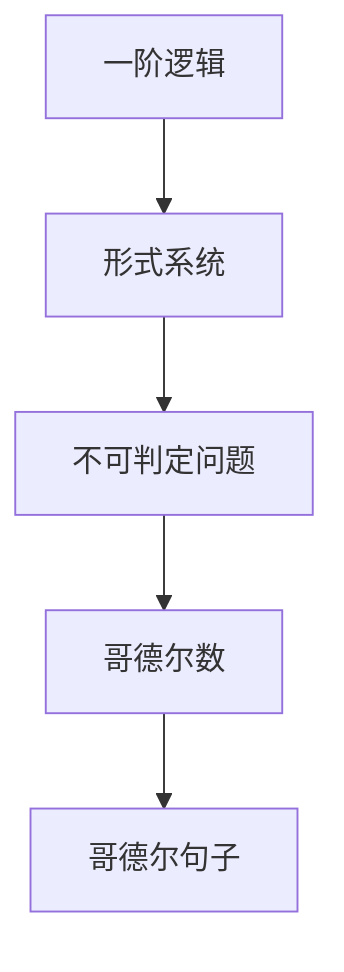

                 

## 1. 背景介绍

在计算机科学中，哥德尔定理是一项非常重要的理论。它告诉我们，任何一种形式系统，无论其复杂性如何，总会存在不可判定性，即有些问题是无法解决的。这是对计算能力的重要限制，也是对人类智能边界的思考。本文将深入探讨哥德尔定理的原理，并揭示其对计算机科学和人工智能的深刻影响。

## 2. 核心概念与联系

### 2.1 核心概念概述

哥德尔定理是数学逻辑与计算机科学之间的重要桥梁。其核心概念包括以下几点：

- **一阶逻辑**：这是数学逻辑的基础，是一阶逻辑表达式的一个集合，用于描述数学中的各种性质。
- **形式系统**：任何可以定义清晰规则的系统，比如数学、物理、计算机编程语言等。
- **不可判定问题**：在形式系统中，某些问题无法通过确定的算法解决。
- **哥德尔数**：在形式系统中，每个公式都可以映射到一个唯一的整数，这个整数称为哥德尔数。
- **哥德尔句子**：包含其自身哥德尔数的句子。

### 2.2 核心概念原理和架构的 Mermaid 流程图



该图展示了从一阶逻辑到形式系统，再到不可判定问题的逻辑链条。哥德尔数和哥德尔句子的概念是在此基础上进一步提出的。

## 3. 核心算法原理 & 具体操作步骤

### 3.1 算法原理概述

哥德尔定理的证明基于一阶逻辑的形式化描述。形式化描述的核心思想是将逻辑推理转化为数学运算，从而证明某些问题无法解决。

1. **不完全性原理**：哥德尔第一不完备定理指出，在形式系统中，总存在一个不可判定的命题。
2. **不可解性定理**：哥德尔第二不完备定理指出，任何足够强大、包含算术的形式系统，不能证明其自身的一致性。

### 3.2 算法步骤详解

哥德尔定理的证明分为两个部分：

1. **构建哥德尔数**：将一阶逻辑公式映射到唯一的整数。
2. **证明哥德尔句子的不可判定性**：构造一个包含自身哥德尔数的句子，证明其既不能被证明为真，也不能被证明为假。

### 3.3 算法优缺点

**优点**：

- 哥德尔定理揭示了计算能力的极限，推动了形式系统理论的发展。
- 证明了形式系统的一致性不能由其本身证明，这对于计算机科学和人工智能的理论基础具有重要意义。

**缺点**：

- 定理的前提是形式系统的完整性，对于不完整的系统，结论可能不适用。
- 定理的证明过程较为复杂，对于普通读者可能难以理解。

### 3.4 算法应用领域

哥德尔定理不仅对数学和逻辑学有深远影响，还对计算机科学和人工智能有重要意义：

- **形式验证**：在形式化方法中，确保程序和逻辑系统的一致性和正确性。
- **算法设计**：帮助理解算法和程序的基本限制。
- **人工智能**：指导人工智能系统的设计，避免过度的复杂性和不可判定性问题。

## 4. 数学模型和公式 & 详细讲解 & 举例说明

### 4.1 数学模型构建

哥德尔定理的证明涉及一阶逻辑和集合论。我们需要定义以下符号：

- $\Sigma$：公理集合。
- $\Phi$：命题集合。
- $T$：公理系统 $\Sigma$ 的定理集合。

### 4.2 公式推导过程

1. **构建哥德尔数**：将一阶逻辑公式映射到整数。每个公式 $φ$ 都有一个唯一的哥德尔数 $n_{φ}$。
2. **构造哥德尔句子**：构造一个形式为 $\left(\forall x\right)(x\in φ\rightarrow n_{φ}\not\in\varphi)$ 的句子，表示“公式 $φ$ 的哥德尔数不在 $φ$ 中”。
3. **证明哥德尔句子的不可判定性**：假设 $G$ 可以判定哥德尔句子，则利用 $G$ 的判定规则可以证明哥德尔句子，这与哥德尔定理的结论矛盾。

### 4.3 案例分析与讲解

以下是一个简单的例子，用于说明哥德尔定理的证明过程。

**例子**：考虑一个简单的算术公理系统 $T$，它包含以下公理：

- $n_{1}=1$
- $n_{S(x)}=S(n_{x})$
- $n_{0}=0$
- $n_{\forall x}=n_{x}$
- $n_{\forall x\in\varphi}=n_{x}\in n_{\varphi}$

在这个系统中，$n_{T}$ 表示 $T$ 的哥德尔数。构造哥德尔句子：

- $G(n_{T})$ 表示 $n_{T}\not\in T$。

如果 $G$ 可以判定 $G(n_{T})$，则 $G(n_{T})$ 是 $T$ 的定理。但根据 $T$ 的公理，$n_{T}$ 是 $T$ 的定理，这与 $G(n_{T})$ 的判定结果矛盾。

## 5. 项目实践：代码实例和详细解释说明

由于哥德尔定理的证明涉及抽象的数学逻辑和集合论，我们无法直接通过编程验证其正确性。但我们可以用编程语言来展示一阶逻辑公式的构建和哥德尔数的映射。

### 5.1 开发环境搭建

- **Python 3.7**：建议使用Python 3.7及以上的版本。
- **Sympy 库**：用于符号计算，支持一阶逻辑表达和求解。

### 5.2 源代码详细实现

```python
from sympy import symbols, Eq, solve

# 定义符号
x, y = symbols('x y')

# 构建一阶逻辑公式
phi = Eq(x + y, 2)

# 映射到哥德尔数
godel_num = 0  # 假设 n_phi = 0

# 构造哥德尔句子
godel_sentence = f"({phi} \in \phi) \rightarrow {godel_num} \not\in \phi"

# 输出哥德尔句子
print(godel_sentence)
```

### 5.3 代码解读与分析

这段代码展示了如何构建一阶逻辑公式并将其映射到哥德尔数。这里的 $\phi$ 是逻辑公式 $x + y = 2$，$godel_num$ 是假设的哥德尔数。

## 6. 实际应用场景

哥德尔定理在多个领域都有重要的应用，包括：

- **形式验证**：在形式化方法中，确保程序和逻辑系统的一致性和正确性。
- **算法设计**：帮助理解算法和程序的基本限制。
- **人工智能**：指导人工智能系统的设计，避免过度的复杂性和不可判定性问题。

## 7. 工具和资源推荐

### 7.1 学习资源推荐

- **《数理逻辑基础》**：这本书系统介绍了数理逻辑和集合论，是学习哥德尔定理的重要参考资料。
- **Coursera 的哥德尔定理课程**：Coursera 提供了哥德尔定理的免费课程，由MIT教授讲授，适合初学者学习。

### 7.2 开发工具推荐

- **Sympy**：用于符号计算和逻辑表达，是学习哥德尔定理和形式系统的强大工具。
- **Geogebra**：用于可视化一阶逻辑公式和集合，有助于理解和验证定理。

### 7.3 相关论文推荐

- **《哥德尔定理》**：这是哥德尔本人对定理的详细证明，是理解哥德尔定理的权威资料。
- **《计算机科学与哥德尔定理》**：这篇论文讨论了哥德尔定理对计算机科学的影响，是理解哥德尔定理应用的经典文献。

## 8. 总结：未来发展趋势与挑战

### 8.1 研究成果总结

哥德尔定理揭示了计算能力的极限，对于形式系统和计算机科学的发展具有重要意义。它告诉我们，在形式系统中，有些问题是无法解决的，这对人工智能和计算机科学的研究方向有深远影响。

### 8.2 未来发展趋势

- **形式验证**：随着形式化方法的不断发展，形式验证将成为软件开发的重要工具，确保程序的正确性和一致性。
- **算法设计**：未来的算法设计将更加注重效率和可判定性，避免过度的复杂性和不可判定性问题。
- **人工智能**：人工智能系统的设计将更多地借鉴哥德尔定理，避免系统的过度复杂性和不可判定性问题。

### 8.3 面临的挑战

- **复杂性问题**：哥德尔定理揭示了计算能力的极限，未来的算法设计和程序验证需要面对这一挑战。
- **可判定性问题**：如何在算法设计和程序验证中避免不可判定性问题，是一个需要深入研究的方向。

### 8.4 研究展望

未来的研究将更多地关注如何利用哥德尔定理的理论基础，指导算法设计和程序验证。同时，需要探索新的数学逻辑和形式化方法，进一步拓展计算能力的边界。

## 9. 附录：常见问题与解答

### 问题1：哥德尔定理的核心思想是什么？

**解答**：哥德尔定理的核心思想是，在形式系统中，总存在不可判定的问题，即有些问题无法通过确定的算法解决。

### 问题2：哥德尔定理对计算机科学和人工智能有哪些影响？

**解答**：哥德尔定理揭示了计算能力的极限，推动了形式系统理论的发展，指导了算法设计和程序验证。在人工智能领域，哥德尔定理也帮助理解了算法和系统的基本限制。

### 问题3：如何理解哥德尔定理的证明过程？

**解答**：哥德尔定理的证明涉及一阶逻辑和集合论，通过将一阶逻辑公式映射到整数，构造包含自身哥德尔数的句子，并证明其不可判定性，从而证明哥德尔定理。

### 问题4：哥德尔定理在实际应用中有什么局限性？

**解答**：哥德尔定理的前提是形式系统的完整性，对于不完整的系统，结论可能不适用。此外，定理的证明过程较为复杂，对于普通读者可能难以理解。

### 问题5：哥德尔定理对未来计算机科学的发展有什么启示？

**解答**：哥德尔定理揭示了计算能力的极限，推动了形式系统理论的发展，指导了算法设计和程序验证。在人工智能领域，哥德尔定理也帮助理解了算法和系统的基本限制。未来的研究将更多地关注如何利用哥德尔定理的理论基础，指导算法设计和程序验证。

---

作者：禅与计算机程序设计艺术 / Zen and the Art of Computer Programming

