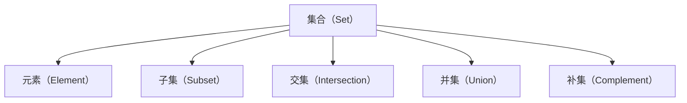

                 

# 计算：第二部分 计算的数学基础 第 4 章 数学的基础 集合论的诞生

> 关键词：集合论,数学基础,公理化方法, 抽象化, 数学逻辑

## 1. 背景介绍

### 1.1 问题由来
在人类探索宇宙奥秘和破解复杂问题的历史长河中，数学逐渐成为一种强大的工具，极大地促进了科学和技术的发展。随着计算机科学的兴起，数学和计算之间的联系变得越来越紧密。在《计算：第一部分 理论与算法》中，我们探讨了计算机科学中的一些核心概念和算法。本章我们将深入探讨数学的基础——集合论，并讨论其对计算和计算机科学的影响。

### 1.2 问题核心关键点
集合论是现代数学的基础，它提供了一种形式化的方式来描述和处理集合及其之间的操作。集合论的核心概念包括元素、集合、子集、交集、并集、补集等，这些概念在数学、逻辑学、计算机科学等领域都有广泛的应用。在计算机科学中，集合论被用于描述算法的数据结构，如数组、列表、集合等，以及描述计算过程的逻辑结构。

集合论的诞生和发展，为计算机科学提供了坚实的数学基础。它不仅促进了数据结构和算法的创新，还推动了形式化方法的发展，如逻辑和谓词演算，这些方法在软件工程和人工智能中具有重要的应用价值。

### 1.3 问题研究意义
了解集合论的基础理论，有助于我们深入理解计算机科学中的核心概念，如数据结构、算法、编程语言等。它可以帮助我们更系统地分析和设计程序，从而提高软件开发的效率和质量。同时，集合论也是计算机科学和其他科学领域进行跨学科研究的桥梁，有助于推动科学研究的进步。

## 2. 核心概念与联系

### 2.1 核心概念概述

集合论（Set Theory）是一种数学理论，它通过研究集合（Set）及其之间的操作，来提供一种形式化的语言来描述和处理数据。集合论的核心概念包括：

- **集合（Set）**：一组对象的集合，可以是任何对象，如数字、字母、图形等。
- **元素（Element）**：集合中的对象。
- **子集（Subset）**：属于某个集合的所有元素的集合。
- **交集（Intersection）**：两个集合中共有的元素组成的集合。
- **并集（Union）**：两个集合中所有元素组成的集合。
- **补集（Complement）**：一个集合在全集中除了自身元素之外的所有元素组成的集合。

这些概念之间的联系可以用下面的Mermaid流程图来展示：



### 2.2 核心概念原理和架构的 Mermaid 流程图

集合论的原理可以通过以下Mermaid流程图来表示：

```mermaid
graph LR
    A[集合]
    B[元素]
    C[子集]
    D[交集]
    E[并集]
    F[补集]
    G[全集]
    H[真子集]
    I[真交集]
    J[真并集]
    A -- 属于 --> B
    A -- 包含 --> C
    A -- 与C -- 交集 --> D
    A -- 与C -- 并集 --> E
    A -- 与C -- 补集 --> F
    A -- 属于 --> G
    C -- 属于 --> H
    D -- 属于 --> I
    E -- 属于 --> J
```

## 3. 核心算法原理 & 具体操作步骤

### 3.1 算法原理概述
集合论的算法主要围绕集合的基本操作，如创建集合、元素添加、删除、查询、交并补等，以及如何处理复杂的集合运算，如多集合操作。

### 3.2 算法步骤详解

**Step 1: 集合的创建与初始化**
创建一个空集合：

```python
my_set = set()
```

添加元素：

```python
my_set.add(1)
my_set.add(2)
my_set.add(3)
```

**Step 2: 元素的操作**
查询元素：

```python
if 2 in my_set:
    print("2 exists in the set")
```

删除元素：

```python
my_set.remove(2)
```

**Step 3: 集合操作**
创建两个集合：

```python
set1 = {1, 2, 3}
set2 = {2, 3, 4}
```

求交集：

```python
intersection = set1.intersection(set2)
print(intersection)  # {2, 3}
```

求并集：

```python
union = set1.union(set2)
print(union)  # {1, 2, 3, 4}
```

求补集：

```python
full_set = {1, 2, 3, 4, 5}
complement = full_set.difference(set1)
print(complement)  # {4, 5}
```

### 3.3 算法优缺点

集合论的算法优点包括：

- **简洁性**：集合论提供了一种简洁的描述和处理集合的方式。
- **一致性**：集合论提供了一致的数学框架，可以避免逻辑上的混乱和错误。
- **普适性**：集合论的原理和概念被广泛应用于各种数学和计算机科学领域。

其缺点主要包括：

- **抽象性**：集合论的概念和操作可能较为抽象，理解起来有一定难度。
- **复杂性**：处理复杂集合操作时，可能需要使用高级数学工具，如布尔代数、拓扑学等。
- **性能开销**：某些集合操作，如查找和删除，可能存在时间复杂度较高的问题。

### 3.4 算法应用领域

集合论在计算机科学中具有广泛的应用，包括但不限于以下几个领域：

- **数据结构**：如数组、列表、集合等数据结构，都是基于集合论的原理来设计的。
- **算法设计**：很多算法的设计和分析都依赖于集合论的基本概念，如排序算法、搜索算法等。
- **编程语言**：现代编程语言中的集合类型和集合操作都是基于集合论的原理来实现的。
- **数据库**：数据库中的表和集合，以及它们之间的操作，都是基于集合论的原理。

## 4. 数学模型和公式 & 详细讲解 & 举例说明

### 4.1 数学模型构建

集合论的数学模型可以通过以下公式来表示：

1. 集合的表示：

   $$ A = \{x \in U | p(x) \} $$

   其中 $U$ 是全集，$p(x)$ 是元素 $x$ 的性质。

2. 元素与集合的关系：

   $$ a \in A \quad \text{if and only if} \quad p(a) $$

3. 集合的并集与交集：

   $$ A \cup B = \{x | x \in A \quad \text{or} \quad x \in B \} $$
   
   $$ A \cap B = \{x | x \in A \quad \text{and} \quad x \in B \} $$

4. 集合的差集：

   $$ A - B = \{x | x \in A \quad \text{and} \quad x \notin B \} $$

### 4.2 公式推导过程

假设有一个全集 $U = \{1, 2, 3, 4, 5\}$，定义集合 $A = \{2, 4\}$ 和 $B = \{3, 4\}$。

- **求交集 $A \cap B$**：
   
  $$ A \cap B = \{2, 4\} \cap \{3, 4\} = \{4\} $$

- **求并集 $A \cup B$**：

  $$ A \cup B = \{2, 4\} \cup \{3, 4\} = \{2, 3, 4\} $$

- **求差集 $A - B$**：

  $$ A - B = \{2, 4\} - \{3, 4\} = \{2\} $$

### 4.3 案例分析与讲解

假设有一个集合 $S = \{1, 2, 3, 4\}$，求它的幂集（Powerset）：

- **幂集的表示**：

  $$ P(S) = \{\emptyset, \{1\}, \{2\}, \{3\}, \{4\}, \{1, 2\}, \{1, 3\}, \{1, 4\}, \{2, 3\}, \{2, 4\}, \{3, 4\}, \{1, 2, 3\}, \{1, 2, 4\}, \{1, 3, 4\}, \{2, 3, 4\}, \{1, 2, 3, 4\} \} $$

## 5. 项目实践：代码实例和详细解释说明

### 5.1 开发环境搭建

在Python环境中，可以使用标准库的集合类型 `set` 来操作集合。

```python
from typing import Set

def create_set() -> Set[int]:
    return set()
```

### 5.2 源代码详细实现

```python
from typing import Set

def create_set() -> Set[int]:
    return set()

def add_element(s: Set[int], e: int) -> None:
    s.add(e)

def remove_element(s: Set[int], e: int) -> None:
    s.discard(e)

def intersection(s1: Set[int], s2: Set[int]) -> Set[int]:
    return s1.intersection(s2)

def union(s1: Set[int], s2: Set[int]) -> Set[int]:
    return s1.union(s2)

def complement(s: Set[int], u: Set[int]) -> Set[int]:
    return u.difference(s)
```

### 5.3 代码解读与分析

以上代码实现了集合的基本操作，包括创建、添加、删除、交集、并集和补集等。

- **创建集合**：使用 `set()` 函数创建空集合。
- **添加元素**：使用 `add()` 方法添加元素。
- **删除元素**：使用 `discard()` 方法删除元素。
- **求交集**：使用 `intersection()` 方法计算两个集合的交集。
- **求并集**：使用 `union()` 方法计算两个集合的并集。
- **求补集**：使用 `difference()` 方法计算一个集合在全集中的补集。

### 5.4 运行结果展示

```python
s = create_set()
add_element(s, 1)
add_element(s, 2)
add_element(s, 3)
add_element(s, 4)

print(s)  # {1, 2, 3, 4}

remove_element(s, 2)

print(s)  # {1, 3, 4}

s1 = {1, 2, 3}
s2 = {2, 3, 4}

print(intersection(s1, s2))  # {3}

print(union(s1, s2))  # {1, 2, 3, 4}

u = {1, 2, 3, 4, 5}
print(complement(s1, u))  # {5}
```

## 6. 实际应用场景

### 6.1 数据库系统

集合论在数据库系统中得到了广泛的应用，如关系数据库中的表和视图，都是由集合理论来定义的。关系数据库中的JOIN操作就是基于集合的交集和并集来处理的。

### 6.2 操作系统

在操作系统中，进程管理、内存管理等都涉及到集合操作。例如，进程的调度和内存的分配都可以看作集合的操作。

### 6.3 软件工程

在软件工程中，集合论被用于描述软件的模块结构、代码库和依赖关系等。

### 6.4 未来应用展望

随着人工智能和机器学习的不断发展，集合论将会在更多的领域得到应用。例如，在深度学习和神经网络中，集合论被用于描述网络的层和节点，以及它们之间的连接关系。

## 7. 工具和资源推荐

### 7.1 学习资源推荐

1. 《离散数学》（Discrete Mathematics）：这本书详细介绍了集合论的基础知识和应用。
2. 《数学分析》（Analysis）：这本书提供了集合论和实数分析的深入介绍。
3. 《计算机科学导论》（Introduction to Computer Science）：这本书介绍了计算机科学中的集合论和数据结构。

### 7.2 开发工具推荐

1. Python：Python是一种流行的编程语言，内置了集合类型和操作函数。
2. Java：Java也提供了集合类型和操作函数，如 `Set`、`List`、`Map` 等。
3. C++：C++中的 `std::set` 和 `std::map` 提供了集合类型和操作函数。

### 7.3 相关论文推荐

1. "Set Theory and Foundations" by J. R. Bindings：这本书详细介绍了集合论的基础理论和应用。
2. "A Computational Introduction to Logic" by J. Russell Miller：这本书介绍了逻辑学和集合论的计算基础。

## 8. 总结：未来发展趋势与挑战

### 8.1 研究成果总结

集合论作为现代数学的基础，其核心概念和原理已经得到了广泛的应用。在计算机科学中，集合论被用于描述数据结构、算法和编程语言等核心概念。然而，集合论的理论和技术仍然存在一些挑战，如抽象性和复杂性等。

### 8.2 未来发展趋势

未来，集合论将会继续在计算机科学和其他领域得到应用。随着人工智能和机器学习的不断进步，集合论将被用于描述和分析更加复杂的系统。

### 8.3 面临的挑战

尽管集合论在计算机科学中得到了广泛的应用，但仍然存在一些挑战：

- **抽象性**：集合论的概念和操作可能较为抽象，理解起来有一定难度。
- **复杂性**：处理复杂集合操作时，可能需要使用高级数学工具，如布尔代数、拓扑学等。
- **性能开销**：某些集合操作，如查找和删除，可能存在时间复杂度较高的问题。

### 8.4 研究展望

未来的研究可以在以下几个方面进行探索：

- **形式化方法**：进一步发展形式化方法，如逻辑和谓词演算，以便更好地描述和分析复杂系统。
- **计算复杂性**：研究集合操作的时间复杂性和空间复杂性，以便更好地优化算法性能。
- **应用扩展**：将集合论的理论和技术扩展到更多的应用领域，如人工智能、深度学习等。

## 9. 附录：常见问题与解答

**Q1: 集合论有哪些应用？**

A: 集合论在计算机科学中具有广泛的应用，包括但不限于以下几个领域：数据结构、算法设计、编程语言、数据库系统、操作系统、软件工程等。

**Q2: 如何理解集合论的抽象性？**

A: 集合论的概念和操作可能较为抽象，理解起来有一定难度。可以通过类比现实世界的例子来帮助理解，如描述一个超市中的商品，可以使用集合论的概念来描述。

**Q3: 集合论的复杂性如何处理？**

A: 处理复杂集合操作时，可能需要使用高级数学工具，如布尔代数、拓扑学等。可以进一步学习相关领域的知识，以便更好地理解和处理复杂的集合操作。

**Q4: 集合论的性能开销如何解决？**

A: 某些集合操作，如查找和删除，可能存在时间复杂度较高的问题。可以通过优化算法和数据结构来提高性能，如使用哈希表等数据结构。

---

作者：禅与计算机程序设计艺术 / Zen and the Art of Computer Programming

