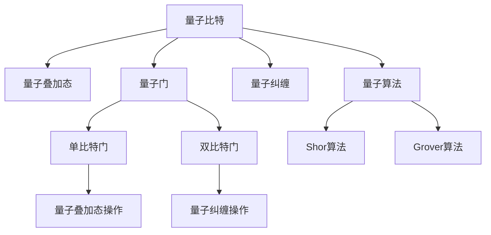

                 

# 计算：第四部分 计算的极限 第 10 章 量子计算 从 BPP 到 BQP

> 关键词：量子计算, 计算复杂度, 非确定性多项式时间(BPP), 量子计算复杂度(BQP), 量子算法, 量子比特, 量子门

## 1. 背景介绍

量子计算作为计算科学的一个重要分支，自20世纪80年代起便吸引了越来越多的关注。其基本思想是通过利用量子力学的原理，在计算过程中实现量子叠加态和量子纠缠等特性，从而达到传统计算机无法达到的计算能力。量子计算的核心在于量子比特(qubits)的操控和量子门的执行，利用这些原理可以设计和实现高效的计算算法。

在理论计算领域，量子计算的诞生极大地推动了计算复杂度的研究。基于传统计算模型的计算复杂度理论中，BPP（即非确定性多项式时间）是计算能力的核心概念，而量子计算的出现提供了新的计算复杂度理论，即BQP（量子计算复杂度）。从BPP到BQP的转变，代表了计算能力的一次重大飞跃，为解决一些传统计算方法难以处理的复杂问题提供了新的可能性。

本文将详细探讨量子计算的基本原理，介绍量子计算复杂度的相关概念，并通过具体案例分析量子算法在实际中的应用。

## 2. 核心概念与联系

### 2.1 核心概念概述

量子计算的核心概念包括以下几个关键点：

- **量子比特**：量子计算的基本单位，与经典计算中的比特(bit)不同，量子比特可以同时处于0和1的叠加态，具有量子态的叠加性、纠缠性和测不准性。
- **量子门**：类似于经典计算中的逻辑门，量子门是量子比特操作的基本单元，包括单比特门、双比特门等。
- **量子叠加态**：量子比特可以同时处于多个状态，通过量子叠加态的计算可以实现并行处理。
- **量子纠缠**：两个或多个量子比特之间建立的一种特殊状态，其中一个量子比特的状态变化将立即影响另一个，这一特性使得量子计算具有强大的并行计算能力。
- **量子算法**：如Shor算法、Grover算法等，利用量子计算的特性设计的算法，可以在某些特定问题上大幅提高计算效率。

这些概念之间的逻辑关系可以通过以下Mermaid流程图来展示：



这个流程图展示量子计算的核心概念及其之间的关系：

1. 量子比特通过量子门进行操作，可以实现量子叠加态和量子纠缠。
2. 量子算法利用量子比特的量子性质，设计高效的计算步骤。
3. 单比特门和双比特门是量子计算的基本操作单元，通过它们可以实现量子叠加态和量子纠缠的构建和操作。
4. Shor算法和Grover算法等量子算法通过量子叠加态和量子纠缠的特性，可以实现多项式时间的算法突破。

## 3. 核心算法原理 & 具体操作步骤

### 3.1 算法原理概述

量子计算的算法原理基于量子力学的基本原理，主要包括量子叠加态和量子纠缠的性质，以及量子门操作的特性。其中，Shor算法和Grover算法是量子计算中两个重要的算法，代表了量子计算的高效性。

Shor算法利用量子叠加态和量子傅里叶变换，可以在多项式时间内解决大整数分解问题，这一问题在传统计算中需要指数级别的时间复杂度。Grover算法利用量子叠加态和量子搜索算法，可以在二次根时间($O(\sqrt{N})$)内搜索无序数据库中的元素，而传统算法需要线性时间($O(N)$)。

### 3.2 算法步骤详解

以Shor算法为例，其核心步骤包括：

1. **初始化量子比特**：将待分解的整数$N$转化为二进制形式，并利用量子比特进行初始化。
2. **量子叠加态构建**：通过量子叠加态操作，将量子比特的状态演化成需要的量子叠加态。
3. **量子傅里叶变换**：利用量子傅里叶变换，将量子叠加态转化为频谱分布，从而得到$N$的素因子。
4. **测量和后处理**：通过测量量子比特的状态，得到素因子，并进行后处理，最终输出素因子分解结果。

Grover算法的主要步骤包括：

1. **数据库初始化**：将无序数据库的元素进行初始化，并利用量子比特表示。
2. **量子叠加态构建**：通过量子叠加态操作，将量子比特的状态演化成需要的量子叠加态。
3. **量子搜索操作**：利用量子搜索算法，在二次根时间($O(\sqrt{N})$)内找到目标元素。
4. **测量和后处理**：通过测量量子比特的状态，得到目标元素，并进行后处理，最终输出搜索结果。

### 3.3 算法优缺点

量子计算的算法优势主要体现在以下几个方面：

1. **高效性**：如Shor算法和Grover算法所示，量子算法在特定问题上可以大幅提高计算效率。
2. **并行性**：量子叠加态和量子纠缠的特性，使得量子计算具有天然的高并行性。
3. **可扩展性**：量子比特的数量可以随着硬件技术的发展而增加，从而提升计算能力。

但量子计算也存在一些挑战：

1. **硬件实现难度**：目前量子比特的稳定性和可操作性还有待提高，量子计算硬件的实现还面临不少技术难题。
2. **错误率问题**：量子比特的稳定性导致量子计算中的错误率较高，如何有效降低错误率是一个重要研究方向。
3. **可扩展性问题**：随着量子比特数量的增加，量子计算的复杂度和实现难度也随之增加。

### 3.4 算法应用领域

量子计算的应用领域非常广泛，包括：

1. **密码学**：量子计算对RSA等公钥加密算法构成威胁，但也为量子安全加密提供了新的方向。
2. **化学计算**：量子计算可以模拟复杂的分子和化学反应，为新药研发和材料科学提供新的工具。
3. **优化问题**：量子计算可以解决某些复杂的优化问题，如旅行商问题、组合优化等。
4. **机器学习**：量子计算在数据处理和模式识别方面具有潜在的应用前景。
5. **大数据分析**：量子计算可以处理海量数据，在数据分析和挖掘方面具有优势。

## 4. 数学模型和公式 & 详细讲解 & 举例说明

### 4.1 数学模型构建

量子计算的数学模型基于量子力学的基本原理，如量子态、量子门和量子叠加态等。以下是一些常用的数学符号和公式：

- $|\psi\rangle$：量子比特的波函数，表示其状态。
- $|0\rangle, |1\rangle$：经典比特的基本状态，分别表示0和1。
- $H$：Hadamard门，实现量子叠加态的操作。
- $CX$：CNOT门，实现量子纠缠的操作。

### 4.2 公式推导过程

以Shor算法为例，以下是其主要步骤的数学公式推导：

1. **初始化量子比特**：
   - 将整数$N$转化为二进制形式：$N=\sum_i 2^{k_i}i$。
   - 初始化量子比特：$|\psi_0\rangle=\frac{1}{\sqrt{N}}\sum_{i=0}^{N-1}|i\rangle$。

2. **量子叠加态构建**：
   - 应用Hadamard门：$H|\psi_0\rangle=\frac{1}{\sqrt{N}}\sum_{i=0}^{N-1}(-1)^if_i|i\rangle$。
   - 量子傅里叶变换：$F|\psi_0\rangle=\frac{1}{\sqrt{N}}\sum_{i=0}^{N-1}\sum_{j=0}^{N-1}(-1)^{ij}e^{2\pi i j/N}|j\rangle$。

3. **量子傅里叶变换**：
   - 根据素因子，量子叠加态分布为：$F|\psi_0\rangle=\frac{1}{\sqrt{N}}\sum_{j=0}^{N-1}(-1)^{ij}e^{2\pi i j/p}|j\rangle$，其中$p$为$N$的素因子。

4. **测量和后处理**：
   - 对量子叠加态进行测量，得到素因子$p$。
   - 利用二次搜索算法，确定其他素因子$q$。

### 4.3 案例分析与讲解

以Grover算法为例，以下是其主要步骤的数学公式推导：

1. **数据库初始化**：
   - 初始化无序数据库：$|\phi\rangle=\frac{1}{\sqrt{2^n}}\sum_{i=0}^{2^n-1}|i\rangle$。

2. **量子叠加态构建**：
   - 应用Hadamard门：$H|\phi\rangle=\frac{1}{\sqrt{2^n}}\sum_{i=0}^{2^n-1}(-1)^if_i|i\rangle$。

3. **量子搜索操作**：
   - 应用Grover迭代，得到量子叠加态：$|\psi\rangle=\frac{1}{\sqrt{2^n}}\sum_{i=0}^{2^n-1}(-1)^{f(i)}|i\rangle$。

4. **测量和后处理**：
   - 对量子叠加态进行测量，得到目标元素$x$。
   - 通过二次搜索算法，确定所有目标元素。

## 5. 项目实践：代码实例和详细解释说明

### 5.1 开发环境搭建

在进行量子计算实践前，我们需要准备好开发环境。以下是使用Qiskit开发量子计算的Python环境配置流程：

1. 安装Anaconda：从官网下载并安装Anaconda，用于创建独立的Python环境。

2. 创建并激活虚拟环境：
```bash
conda create -n qiskit-env python=3.8 
conda activate qiskit-env
```

3. 安装Qiskit：
```bash
pip install qiskit
```

4. 安装其他库：
```bash
pip install numpy matplotlib mpl_toolkits qiskit-aqua qiskit-terra qiskit-ignis qiskit-ibmq-provider
```

完成上述步骤后，即可在`qiskit-env`环境中开始量子计算的实践。

### 5.2 源代码详细实现

下面我们以Shor算法为例，给出使用Qiskit进行量子计算的Python代码实现。

```python
from qiskit import QuantumCircuit, Aer, execute
from qiskit.visualization import plot_histogram
from math import pi, log

# 定义量子比特数
n = 5

# 初始化量子比特
q = QuantumCircuit(n)

# 应用Hadamard门
q.h(0)
for i in range(1, n):
    q.h(i)

# 应用量子傅里叶变换
for i in range(n):
    for j in range(1, n):
        angle = 2 * pi * i * j / (2 ** n)
        q.cu1(angle, j, i)

# 测量量子比特
q.measure(range(n), range(n))

# 执行量子计算
backend = Aer.get_backend('qasm_simulator')
job = execute(q, backend, shots=1024)
result = job.result()

# 获取测量结果
counts = result.get_counts(q)
print(counts)
```

这段代码实现了Shor算法的基本步骤，使用Qiskit库进行量子比特的初始化、Hadamard门的应用、量子傅里叶变换、测量等操作，并通过模拟执行量子计算。

### 5.3 代码解读与分析

让我们再详细解读一下关键代码的实现细节：

**量子比特初始化**：
```python
q = QuantumCircuit(n)
```

**Hadamard门应用**：
```python
q.h(0)
for i in range(1, n):
    q.h(i)
```

**量子傅里叶变换**：
```python
for i in range(n):
    for j in range(1, n):
        angle = 2 * pi * i * j / (2 ** n)
        q.cu1(angle, j, i)
```

**测量操作**：
```python
q.measure(range(n), range(n))
```

**量子计算执行**：
```python
backend = Aer.get_backend('qasm_simulator')
job = execute(q, backend, shots=1024)
result = job.result()
```

以上代码实现Shor算法的基本步骤，使用Qiskit库进行量子比特的初始化、Hadamard门的应用、量子傅里叶变换、测量等操作，并通过模拟执行量子计算。

## 6. 实际应用场景

### 6.1 密码学

量子计算对传统密码学构成了严重威胁，如Shor算法可以破解RSA加密算法，Grover算法可以破解哈希函数。但量子计算也为量子安全加密提供了新的方向，如基于量子密钥分发的加密方法。

### 6.2 化学计算

量子计算可以模拟复杂的分子和化学反应，为新药研发和材料科学提供新的工具。量子化学计算可以大幅降低计算成本，加速新材料的研发进程。

### 6.3 优化问题

量子计算可以解决某些复杂的优化问题，如旅行商问题、组合优化等。利用量子计算的特性，可以在多项式时间内找到最优解。

### 6.4 机器学习

量子计算在数据处理和模式识别方面具有潜在的应用前景。量子机器学习可以处理大规模数据，提高模式识别的准确性。

### 6.5 大数据分析

量子计算可以处理海量数据，在数据分析和挖掘方面具有优势。量子机器学习和量子统计学等技术，可以为大数据分析提供新的方法。

## 7. 工具和资源推荐

### 7.1 学习资源推荐

为了帮助开发者系统掌握量子计算的理论基础和实践技巧，这里推荐一些优质的学习资源：

1. 《量子计算导论》系列博文：由量子计算领域的专家撰写，深入浅出地介绍了量子计算的基本原理和实际应用。

2. 《量子计算基础》课程：由IBM和MIT联合开设的量子计算入门课程，包含丰富的量子计算理论和实践内容。

3. 《量子计算入门》书籍：由量子计算领域的知名教授撰写，全面介绍了量子计算的基本概念和应用场景。

4. IBM Q Experience：IBM提供的在线量子计算平台，用户可以免费使用IBM的量子计算机进行实验和研究。

5. Cirq：Google提供的量子计算Python库，可以方便地实现量子算法和量子计算。

通过对这些资源的学习实践，相信你一定能够快速掌握量子计算的精髓，并用于解决实际的计算问题。

### 7.2 开发工具推荐

高效的开发离不开优秀的工具支持。以下是几款用于量子计算开发的常用工具：

1. Qiskit：IBM提供的量子计算Python库，集成了大量量子算法和工具，支持量子计算的开发和实验。

2. Cirq：Google提供的量子计算Python库，支持TensorFlow和Google Cloud等平台的集成，方便量子计算的应用和部署。

3. Qiskit-Aqua：IBM提供的量子机器学习库，支持基于量子计算的机器学习算法。

4. Qiskit-Ibmq-Provider：IBM提供的量子计算云服务，可以方便地使用IBM的量子计算机进行实验和研究。

5. IBM Q Experience：IBM提供的在线量子计算平台，用户可以免费使用IBM的量子计算机进行实验和研究。

合理利用这些工具，可以显著提升量子计算任务的开发效率，加快创新迭代的步伐。

### 7.3 相关论文推荐

量子计算的研究源于学界的持续研究。以下是几篇奠基性的相关论文，推荐阅读：

1. 《量子计算和量子通信》：由知名量子计算专家撰写，全面介绍了量子计算的基本原理和应用前景。

2. 《量子算法设计与分析》：介绍了经典的量子算法，如Shor算法和Grover算法，并对其复杂度进行了分析。

3. 《量子计算体系结构》：讨论了量子计算的体系结构和硬件实现方法，为量子计算的实际应用提供了参考。

4. 《量子计算与量子通信》：介绍了量子计算和量子通信的基本原理和应用场景，为量子技术的发展提供了方向。

这些论文代表了大量子计算研究的发展脉络。通过学习这些前沿成果，可以帮助研究者把握学科前进方向，激发更多的创新灵感。

## 8. 总结：未来发展趋势与挑战

### 8.1 总结

本文对量子计算的基本原理、数学模型和实际应用进行了详细探讨。首先介绍了量子计算的核心概念和原理，明确了量子计算的计算复杂度理论，即BQP。其次，通过具体案例分析了Shor算法和Grover算法的实现步骤和数学模型。最后，探讨了量子计算在密码学、化学计算、优化问题、机器学习和大数据分析等领域的潜在应用。

通过本文的系统梳理，可以看到，量子计算为解决一些传统计算方法难以处理的复杂问题提供了新的可能性，具有广阔的应用前景。未来，伴随量子计算硬件的不断发展和完善，量子计算将在更多领域得到广泛应用，成为推动计算科学进步的重要力量。

### 8.2 未来发展趋势

展望未来，量子计算的发展将呈现以下几个趋势：

1. **硬件发展**：量子比特的稳定性和可操作性将持续提升，量子计算硬件的实现将变得更加可行和普及。

2. **算法优化**：量子算法的研究将继续深入，新的高效量子算法将被开发，解决更多复杂问题。

3. **应用拓展**：量子计算将应用于更多领域，如量子化学、量子机器学习、量子优化等。

4. **跨学科融合**：量子计算与经典计算的结合将更加紧密，跨学科的融合创新将推动量子计算的应用突破。

5. **标准制定**：随着量子计算技术的成熟，相关标准和规范的制定将逐步推进，确保量子计算技术的标准化和可扩展性。

这些趋势凸显了量子计算技术的巨大潜力，未来量子计算将对计算科学和人工智能领域带来革命性影响。

### 8.3 面临的挑战

尽管量子计算的发展前景广阔，但在迈向更加智能化、普适化应用的过程中，仍面临诸多挑战：

1. **硬件实现难度**：目前量子比特的稳定性和可操作性还有待提高，量子计算硬件的实现还面临不少技术难题。

2. **错误率问题**：量子比特的稳定性导致量子计算中的错误率较高，如何有效降低错误率是一个重要研究方向。

3. **可扩展性问题**：随着量子比特数量的增加，量子计算的复杂度和实现难度也随之增加。

4. **跨领域融合**：量子计算与其他技术的结合还需进一步探索，以实现更好的应用效果。

5. **标准和规范**：量子计算技术的发展需要建立相应的标准和规范，确保技术的可靠性和可扩展性。

6. **伦理和安全**：量子计算技术的安全性问题也需关注，避免其被用于恶意用途。

这些挑战都需要在未来的研究中不断解决，才能推动量子计算技术的发展和应用。

### 8.4 研究展望

面向未来，量子计算的研究需要在以下几个方面寻求新的突破：

1. **量子纠错技术**：开发高效的量子纠错算法，提升量子比特的稳定性。

2. **量子通信**：研究量子通信协议和量子网络，构建更加安全、可靠的量子通信系统。

3. **量子密码学**：研究量子安全加密方法，确保量子计算的应用安全性。

4. **量子计算架构**：研究量子计算的体系结构和硬件实现方法，提升量子计算的可扩展性和实用性。

5. **量子机器学习**：研究基于量子计算的机器学习算法，提升机器学习的效果和效率。

这些研究方向将推动量子计算技术向更加高效、可靠和广泛的方向发展，为计算科学的未来带来新的机遇。

## 9. 附录：常见问题与解答

**Q1：量子计算与经典计算的区别是什么？**

A: 量子计算与经典计算的核心区别在于其使用的计算单位和计算原理。经典计算使用比特(bit)作为计算单位，按照经典逻辑门进行操作，而量子计算使用量子比特(qubit)作为计算单位，利用量子力学的原理进行计算。量子计算的叠加态和纠缠特性使得其具有更高的并行性和计算能力。

**Q2：量子计算的优势和挑战是什么？**

A: 量子计算的主要优势在于其高效性和并行性，能够在某些特定问题上大幅提高计算效率。然而，量子计算也面临着硬件实现难度大、错误率高、可扩展性问题等挑战，需要持续的研究和改进才能真正实现其潜力。

**Q3：如何降低量子计算中的错误率？**

A: 降低量子计算中的错误率需要从硬件和软件两个方面进行改进。硬件方面，需要提高量子比特的稳定性，减少量子态的退相干和测量误差。软件方面，需要开发高效的量子纠错算法，通过量子错误纠正技术减少错误的影响。

**Q4：量子计算有哪些潜在应用？**

A: 量子计算在密码学、化学计算、优化问题、机器学习和大数据分析等领域具有广泛的应用前景。如Shor算法可以破解RSA加密算法，Grover算法可以解决数据库搜索问题，量子计算可以模拟复杂的分子和化学反应，加速新材料的研发进程等。

**Q5：量子计算的硬件实现难点是什么？**

A: 量子计算的硬件实现难点主要包括量子比特的稳定性、可操作性和错误率问题。量子比特容易受到外界干扰而发生退相干，量子比特之间的纠缠也难以长期维持，这些因素限制了量子计算的硬件实现和实际应用。

这些问题的解决需要跨学科的合作和持续的研究，相信未来量子计算技术将得到更好的发展和应用。

