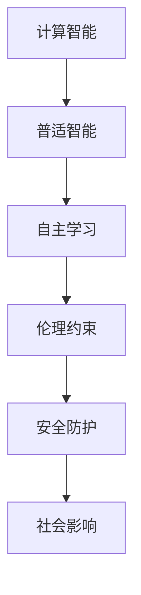

                 

# 计算：附录 C 世界需要什么样的智能系统

> 关键词：计算智能、普适智能、自主学习、伦理约束、安全防护、社会影响

## 1. 背景介绍

### 1.1 问题由来

在当今快速发展的数字化时代，智能系统已经成为推动社会进步和产业升级的重要力量。从工业自动化到金融交易，从医疗诊断到教育培训，智能系统的应用渗透到生活的方方面面。然而，随着技术的不断进步，如何构建具有更强适应性、更高效、更安全、更可靠、更符合人类价值观的智能系统，成为了一个亟待解决的课题。

在智能系统的构建过程中，智能计算扮演着核心角色。计算智能，是指智能系统利用计算模型模拟人类的感知、认知和行为能力，从而实现智能决策和自主学习的机制。计算智能不仅推动了技术创新，也在改变着人类社会的运行模式。然而，当前的智能计算体系在适应性、安全性、可解释性等方面仍存在不足，迫切需要新的发展方向。

### 1.2 问题核心关键点

智能系统的构建，不仅仅是一个技术问题，更是一个复杂的社会问题。智能系统的设计、开发、应用过程中，涉及伦理、隐私、安全等多个方面，需要综合考虑。以下是在智能系统构建中需要重点关注的几个关键点：

- **适应性**：智能系统应能够适应不断变化的环境和需求，具备自适应和自主学习的能力。
- **安全性**：智能系统在处理敏感信息时，应具备强大的安全防护能力，避免数据泄露和滥用。
- **可解释性**：智能系统的决策过程应具有可解释性，便于用户理解和信任。
- **公平性**：智能系统应保证不同群体之间的公平对待，避免偏见和歧视。
- **可扩展性**：智能系统应具备良好的可扩展性，能够轻松地集成到各种应用场景中。
- **社会影响**：智能系统的设计和使用应考虑其对社会的影响，确保技术的发展造福人类。

### 1.3 问题研究意义

研究智能系统的构建方法，对于推动社会进步、提升生产力、改善人类生活质量具有重要意义：

1. **推动技术创新**：智能系统的研究与应用，可以催生新的技术方向和商业模式，推动技术进步。
2. **提高生产效率**：智能系统在工业、金融、医疗等多个领域的应用，可以显著提高生产效率，降低成本。
3. **改善用户体验**：智能系统可以提供个性化的服务和体验，提升用户满意度。
4. **促进社会公平**：智能系统的设计应考虑社会公平，帮助弱势群体获得更好的服务。
5. **保障安全隐私**：智能系统的安全性和隐私保护是社会发展的基石，需优先考虑。
6. **提升社会治理能力**：智能系统可以辅助社会治理，提高决策效率和精准度。

## 2. 核心概念与联系

### 2.1 核心概念概述

智能系统构建的核心概念包括：

- **计算智能**：通过计算模型模拟人类的感知、认知和行为能力，实现自主学习和智能决策。
- **普适智能**：智能系统应具备广泛的应用范围，能够在不同的环境和任务中发挥作用。
- **自主学习**：智能系统应能够通过数据驱动的方式进行学习和优化。
- **伦理约束**：智能系统的设计和应用应遵守伦理原则，避免对人类造成伤害。
- **安全防护**：智能系统应具备强大的安全机制，保护数据隐私和系统安全。
- **社会影响**：智能系统对社会的影响需全面考虑，确保技术应用带来的正面效应。

这些概念之间的逻辑关系可以通过以下Mermaid流程图来展示：



这个流程图展示了智能系统的核心概念及其之间的关系：

1. 计算智能通过模拟人类智能，为普适智能提供基础。
2. 普适智能强调智能系统的广泛应用和自适应能力。
3. 自主学习使得智能系统能够不断优化和进步。
4. 伦理约束确保智能系统符合社会伦理标准。
5. 安全防护保障智能系统的稳定性和数据隐私。
6. 社会影响评估智能系统对社会的广泛影响。

这些概念共同构成了智能系统的设计原则和应用方向，有助于构建更加全面和可持续的智能系统。

## 3. 核心算法原理 & 具体操作步骤
### 3.1 算法原理概述

智能系统的构建，本质上是一个多学科融合的复杂系统工程。其核心算法原理主要包括：

- **计算模型**：通过模拟人类认知过程，构建计算模型，实现智能决策。
- **学习算法**：通过数据驱动的方式，训练和优化计算模型，提高其智能水平。
- **优化算法**：通过迭代优化，提升计算模型的性能和适应性。
- **知识融合**：将外部知识库与计算模型相结合，增强智能系统的常识推理能力。

智能系统的构建需要综合考虑这些算法原理，才能实现高效的智能决策和自主学习。

### 3.2 算法步骤详解

智能系统的构建一般包括以下几个关键步骤：

**Step 1: 需求分析与定义**

- 明确智能系统的应用场景和目标。
- 确定智能系统的功能需求和技术指标。
- 设计智能系统的总体架构和系统框架。

**Step 2: 数据准备**

- 收集和整理智能系统的数据集，包括训练数据、测试数据和验证数据。
- 清洗和预处理数据，确保数据质量和一致性。
- 设计数据流和数据存储方案，确保数据安全。

**Step 3: 模型选择与训练**

- 选择合适的计算模型和算法。
- 使用训练数据集对计算模型进行训练，优化参数和结构。
- 在验证数据集上评估模型性能，调整训练策略。

**Step 4: 系统集成与测试**

- 将训练好的计算模型集成到智能系统中。
- 进行系统测试，确保系统的稳定性和可靠性。
- 进行性能评估和优化，提升系统性能。

**Step 5: 部署与应用**

- 将智能系统部署到实际应用环境中。
- 进行系统监控和维护，确保系统正常运行。
- 收集反馈和数据，不断改进和优化系统。

### 3.3 算法优缺点

智能系统的构建，具有以下优点：

- **高效性**：通过计算模型和算法优化，智能系统能够在短时间内处理大量数据，实现高效决策。
- **灵活性**：智能系统能够自适应不同的环境和任务，具备较强的灵活性。
- **可扩展性**：智能系统易于扩展和集成到各种应用场景中，适应复杂需求。

同时，智能系统也存在以下缺点：

- **复杂性**：智能系统的构建和维护涉及多个学科，技术复杂度高。
- **数据依赖**：智能系统依赖大量的数据进行训练，数据质量直接影响系统性能。
- **伦理风险**：智能系统的设计和应用需考虑伦理问题，避免对人类造成伤害。
- **安全风险**：智能系统的安全性需重点考虑，避免数据泄露和系统攻击。

### 3.4 算法应用领域

智能系统的构建，已经在诸多领域得到了广泛应用，例如：

- **工业自动化**：通过智能监控和控制，提高生产效率和产品质量。
- **金融交易**：利用智能算法进行风险管理和投资决策。
- **医疗诊断**：通过智能系统进行疾病诊断和个性化治疗。
- **教育培训**：提供个性化学习和智能辅助，提升教学效果。
- **智能家居**：实现语音识别和智能控制，提升生活便捷性。
- **智慧城市**：辅助城市管理，提升公共服务水平。

这些领域的应用，展示了智能系统在提升生产效率、改善用户体验、优化决策过程等方面的巨大潜力。

## 4. 数学模型和公式 & 详细讲解  
### 4.1 数学模型构建

智能系统的构建，通常需要构建数学模型来描述计算过程和决策机制。以下是一个简单的智能决策模型的数学模型构建过程：

- **输入层**：输入特征 $x$，表示智能系统接收到的数据和信息。
- **计算层**：通过计算模型对输入进行处理，得到中间结果 $y$。
- **输出层**：根据中间结果 $y$，输出决策 $z$。

数学模型可以表示为：

$$
z = f(y) = g(x)
$$

其中，$f$ 和 $g$ 分别表示计算模型和决策模型。

### 4.2 公式推导过程

以一个简单的分类问题为例，推导智能系统的分类公式：

假设输入特征为 $x$，输出为 $z$，计算模型为 $f$，决策模型为 $g$。分类问题可以表示为：

$$
z = f(x) = g(x)
$$

其中，$g(x)$ 可以表示为：

$$
g(x) = \begin{cases}
1, & \text{if } f(x) > \tau \\
0, & \text{otherwise}
\end{cases}
$$

其中，$\tau$ 为分类阈值。

假设计算模型 $f(x)$ 为线性回归模型：

$$
f(x) = \theta^T x
$$

其中，$\theta$ 为模型参数，$x$ 为输入特征向量。

假设决策模型 $g(x)$ 为逻辑回归模型：

$$
g(x) = \sigma(\theta^T x)
$$

其中，$\sigma$ 为逻辑函数。

将这些模型结合，得到分类公式：

$$
z = \sigma(\theta^T x) > \tau
$$

通过计算模型和决策模型的结合，智能系统可以实现分类决策。

### 4.3 案例分析与讲解

以下是一个简单的智能系统案例：

假设智能系统用于判断图像是否包含猫。输入为图像像素值 $x$，输出为是否包含猫的决策 $z$。

假设计算模型为卷积神经网络，可以提取图像的特征，表示为 $y$。

$$
y = f(x)
$$

其中，$f(x)$ 为卷积神经网络模型。

假设决策模型为逻辑回归模型，可以判断图像是否包含猫，表示为 $z$。

$$
z = g(y) = \sigma(\theta^T y)
$$

其中，$\theta$ 为模型参数，$y$ 为卷积神经网络的输出特征。

将这些模型结合，得到分类公式：

$$
z = \sigma(\theta^T f(x)) > \tau
$$

通过训练计算模型和决策模型，智能系统可以实现图像分类。

## 5. 项目实践：代码实例和详细解释说明
### 5.1 开发环境搭建

在进行智能系统开发前，我们需要准备好开发环境。以下是使用Python进行TensorFlow开发的环境配置流程：

1. 安装Anaconda：从官网下载并安装Anaconda，用于创建独立的Python环境。

2. 创建并激活虚拟环境：
```bash
conda create -n tf-env python=3.8 
conda activate tf-env
```

3. 安装TensorFlow：根据CUDA版本，从官网获取对应的安装命令。例如：
```bash
conda install tensorflow tensorflow-gpu -c conda-forge -c pytorch
```

4. 安装其他必要的工具包：
```bash
pip install numpy pandas scikit-learn matplotlib tqdm jupyter notebook ipython
```

完成上述步骤后，即可在`tf-env`环境中开始智能系统开发。

### 5.2 源代码详细实现

这里我们以图像分类为例，给出使用TensorFlow构建智能系统的PyTorch代码实现。

首先，定义图像分类模型的数据处理函数：

```python
import tensorflow as tf
from tensorflow.keras import layers

def preprocess_image(x):
    x = tf.image.resize(x, (224, 224))
    x = tf.keras.applications.resnet50.preprocess_input(x)
    return x

# 定义卷积神经网络模型
model = tf.keras.Sequential([
    layers.Conv2D(64, (3, 3), activation='relu', input_shape=(224, 224, 3)),
    layers.MaxPooling2D((2, 2)),
    layers.Conv2D(128, (3, 3), activation='relu'),
    layers.MaxPooling2D((2, 2)),
    layers.Conv2D(256, (3, 3), activation='relu'),
    layers.MaxPooling2D((2, 2)),
    layers.Flatten(),
    layers.Dense(512, activation='relu'),
    layers.Dense(1, activation='sigmoid')
])
```

然后，定义训练和评估函数：

```python
from tensorflow.keras.preprocessing.image import ImageDataGenerator

# 定义训练集和测试集数据增强
train_datagen = ImageDataGenerator(
    rescale=1./255,
    shear_range=0.2,
    zoom_range=0.2,
    horizontal_flip=True
)

test_datagen = ImageDataGenerator(rescale=1./255)

# 加载训练集和测试集数据
train_generator = train_datagen.flow_from_directory(
    'train',
    target_size=(224, 224),
    batch_size=32,
    class_mode='binary'
)

test_generator = test_datagen.flow_from_directory(
    'test',
    target_size=(224, 224),
    batch_size=32,
    class_mode='binary'
)

# 定义损失函数和优化器
loss = tf.keras.losses.BinaryCrossentropy()
optimizer = tf.keras.optimizers.Adam()

# 定义评估指标
metrics = [tf.keras.metrics.BinaryAccuracy('acc')]

# 训练模型
model.compile(optimizer=optimizer, loss=loss, metrics=metrics)
model.fit(
    train_generator,
    steps_per_epoch=train_generator.n // train_generator.batch_size,
    epochs=10,
    validation_data=test_generator,
    validation_steps=test_generator.n // test_generator.batch_size
)

# 评估模型
model.evaluate(test_generator)
```

最后，启动训练流程并在测试集上评估：

```python
# 保存模型
model.save('model.h5')
```

以上就是使用TensorFlow进行图像分类的完整代码实现。可以看到，TensorFlow提供了丰富的API和工具，使得智能系统的构建变得相对简单。

### 5.3 代码解读与分析

让我们再详细解读一下关键代码的实现细节：

**定义模型**：
- 通过`tf.keras.Sequential`定义卷积神经网络模型。
- 模型包括卷积层、池化层、全连接层等组件。

**数据处理**：
- 通过`tf.image.resize`和`tf.keras.applications.resnet50.preprocess_input`函数对图像进行预处理。

**训练和评估**：
- 通过`ImageDataGenerator`进行数据增强。
- 使用`compile`方法定义模型编译，包括损失函数、优化器、评估指标。
- 使用`fit`方法进行模型训练。
- 使用`evaluate`方法进行模型评估。

**模型保存**：
- 使用`model.save`方法将模型保存为HDF5格式。

可以看到，TensorFlow提供的强大API和工具，使得智能系统的构建和训练变得相对简单高效。

## 6. 实际应用场景
### 6.1 智能客服系统

智能客服系统是一种典型的智能应用场景。通过使用智能系统，可以提升客服效率和用户满意度，降低企业运营成本。

智能客服系统通常包括以下几个组件：

- **自然语言理解**：通过智能系统理解用户输入的自然语言，提取意图和参数。
- **自然语言生成**：通过智能系统生成自然语言回答。
- **对话管理**：通过智能系统管理对话流程，保持对话的连贯性和逻辑性。

智能客服系统可以广泛应用于各种服务场景，如电商客服、金融客服、医疗客服等，为消费者提供7x24小时不间断的服务。

### 6.2 金融舆情监测

金融舆情监测是一种智能系统的典型应用。通过使用智能系统，可以实时监测金融市场动态，及时发现和防范金融风险。

金融舆情监测系统通常包括以下几个组件：

- **文本分析**：通过智能系统分析金融新闻、评论等文本数据，提取情感、主题等信息。
- **情感分析**：通过智能系统判断金融市场情绪，识别潜在风险。
- **事件检测**：通过智能系统检测金融事件，提前预警风险。

金融舆情监测系统可以应用于银行、证券、保险等多个金融领域，为金融决策提供数据支持和预警机制。

### 6.3 个性化推荐系统

个性化推荐系统是一种典型的智能应用场景。通过使用智能系统，可以提升用户的体验和满意度，增加用户粘性。

个性化推荐系统通常包括以下几个组件：

- **用户画像**：通过智能系统分析用户行为数据，构建用户画像。
- **物品画像**：通过智能系统分析物品属性和用户反馈，构建物品画像。
- **推荐引擎**：通过智能系统计算用户和物品之间的相似度，推荐相关物品。

个性化推荐系统可以应用于电商、音乐、视频等多个领域，为消费者提供个性化的购物、娱乐等服务。

### 6.4 未来应用展望

随着智能系统的不断发展，未来将在更多领域得到应用，为人类带来新的变革。

在智慧医疗领域，智能系统可以帮助医生进行诊断和治疗决策，提高医疗服务的效率和质量。

在智能教育领域，智能系统可以提供个性化的学习路径和辅导，提升教育效果和公平性。

在智慧城市治理中，智能系统可以辅助城市管理，提升公共服务的水平和效率。

此外，智能系统将在智能家居、智慧农业、智能制造等多个领域得到应用，为社会发展和进步提供新的动力。

## 7. 工具和资源推荐
### 7.1 学习资源推荐

为了帮助开发者系统掌握智能系统的构建方法，这里推荐一些优质的学习资源：

1. 《深度学习》系列课程：斯坦福大学、MIT等名校开设的深度学习课程，涵盖机器学习、计算智能等多个方向。
2. 《TensorFlow实战》书籍：TensorFlow官方出版的实战教程，详细介绍了TensorFlow的使用和应用。
3. 《智能系统设计与实现》书籍：介绍智能系统的设计原则、构建方法和应用案例。
4. 《机器学习》课程：由Coursera等在线教育平台提供的机器学习课程，涵盖监督学习、无监督学习、强化学习等多个方向。
5. Kaggle竞赛：参加Kaggle数据科学竞赛，积累实战经验，提升技能水平。

通过对这些资源的学习实践，相信你一定能够快速掌握智能系统的构建方法，并用于解决实际的智能系统问题。

### 7.2 开发工具推荐

高效的开发离不开优秀的工具支持。以下是几款用于智能系统开发的常用工具：

1. TensorFlow：由Google主导开发的深度学习框架，支持分布式计算和模型部署，适合大规模工程应用。
2. PyTorch：由Facebook主导开发的深度学习框架，灵活动态的计算图，适合快速迭代研究。
3. Jupyter Notebook：Python编程的交互式开发环境，方便调试和实验。
4. Visual Studio Code：跨平台的编程编辑器，支持多种编程语言和工具插件。
5. Git：版本控制系统，方便团队协作和代码管理。

合理利用这些工具，可以显著提升智能系统的开发效率，加快创新迭代的步伐。

### 7.3 相关论文推荐

智能系统的构建和发展，得益于学界的持续研究。以下是几篇奠基性的相关论文，推荐阅读：

1. AlphaGo论文：DeepMind发表的AlphaGo论文，展示了深度学习在复杂决策问题中的潜力。
2. GPT-3论文：OpenAI发表的GPT-3论文，展示了大规模语言模型的强大能力。
3. Adversarial Machine Learning：NIPS 2013论文，展示了对抗学习的思想和应用。
4. Generative Adversarial Networks：ICLR 2014论文，展示了生成对抗网络的原理和应用。
5. Reinforcement Learning for Human-Robot Interaction：IJRR 2017论文，展示了强化学习在人机交互中的应用。

这些论文代表了大数据、深度学习、强化学习等方向的研究进展，展示了智能系统构建的理论基础和前沿技术。

## 8. 总结：未来发展趋势与挑战

### 8.1 总结

本文对智能系统的构建方法进行了全面系统的介绍。首先阐述了智能系统构建的背景和意义，明确了智能系统在提升生产效率、改善用户体验、优化决策过程等方面的独特价值。其次，从原理到实践，详细讲解了智能系统的数学模型和构建步骤，给出了智能系统开发的完整代码实例。同时，本文还广泛探讨了智能系统在多个行业领域的应用前景，展示了智能系统的巨大潜力。

通过本文的系统梳理，可以看到，智能系统的构建方法已经相对成熟，但在适应性、安全性、可解释性等方面仍存在不足，需要进一步探索和改进。

### 8.2 未来发展趋势

展望未来，智能系统的构建将呈现以下几个发展趋势：

1. **自主学习能力增强**：智能系统将具备更强的自主学习能力，能够通过数据驱动的方式进行持续优化。
2. **适应性更强**：智能系统将具备更强的适应性，能够自适应不同的环境和任务。
3. **多模态融合**：智能系统将实现多模态数据的融合，提升系统的综合感知能力。
4. **伦理和社会影响评估**：智能系统的设计和应用将更多考虑伦理和社会影响，确保技术应用带来的正面效应。
5. **安全性保障**：智能系统的安全机制将进一步完善，避免数据泄露和系统攻击。
6. **广泛应用**：智能系统将在更多领域得到应用，推动社会进步和经济发展。

以上趋势凸显了智能系统的广阔前景，预示着未来将有更多的创新和突破。

### 8.3 面临的挑战

尽管智能系统的构建已经取得了一定进展，但在迈向更加智能化、普适化应用的过程中，仍面临诸多挑战：

1. **数据质量和获取**：智能系统的构建依赖大量的数据，数据的质量和获取是关键。如何获取高质量、多样化的数据，是亟待解决的问题。
2. **模型复杂性**：智能系统的模型通常较为复杂，训练和推理的资源消耗较大。如何优化模型结构，提升计算效率，是重要的研究方向。
3. **伦理和社会影响**：智能系统的设计和应用需考虑伦理和社会影响，避免对人类造成伤害。如何在技术创新和伦理约束之间取得平衡，是重要的课题。
4. **安全性问题**：智能系统的安全性需重点考虑，避免数据泄露和系统攻击。如何构建安全机制，保障系统稳定运行，是重要的研究方向。

### 8.4 研究展望

面对智能系统构建所面临的挑战，未来的研究需要在以下几个方面寻求新的突破：

1. **数据增强技术**：通过数据增强技术，丰富训练集多样性，提高模型泛化能力。
2. **模型压缩与优化**：通过模型压缩和优化技术，减小模型规模，提升计算效率。
3. **公平性和透明性**：通过公平性和透明性研究，确保智能系统的公平性、可解释性和可审计性。
4. **安全性机制**：通过安全机制研究，增强智能系统的安全防护能力。
5. **跨领域融合**：通过跨领域融合技术，实现多模态数据的整合和协同建模。

这些研究方向的探索，必将引领智能系统构建技术迈向更高的台阶，为人类社会带来更多福祉。

## 9. 附录：常见问题与解答

**Q1: 智能系统构建的核心难点是什么？**

A: 智能系统构建的核心难点在于数据获取、模型训练、系统优化等多个环节的复杂性和不确定性。特别是对于大数据、深度学习等技术的应用，需要大量的资源和人力投入。

**Q2: 智能系统在哪些领域有应用前景？**

A: 智能系统在工业自动化、金融交易、医疗诊断、教育培训、智能家居、智慧城市等多个领域有广泛的应用前景。智能系统的构建和应用，将极大地提升生产效率和生活质量。

**Q3: 智能系统如何确保数据隐私和安全？**

A: 智能系统应采用数据加密、访问控制、审计日志等措施，确保数据隐私和安全。同时，应引入区块链、分布式存储等技术，提升系统的鲁棒性和抗攻击能力。

**Q4: 智能系统的设计和应用需考虑哪些伦理问题？**

A: 智能系统的设计和应用需考虑伦理问题，如公平性、透明性、可解释性等。应避免对人类造成伤害，确保技术的正面效应。

**Q5: 智能系统如何实现跨领域融合？**

A: 智能系统可以通过知识图谱、逻辑规则等手段，实现不同领域知识的整合和协同建模。同时，引入多模态融合技术，实现视觉、语音、文本等多种数据源的整合和协同处理。

通过上述问题的解答，可以看到智能系统的构建和应用涉及多方面的挑战和解决方案，需要综合考虑技术、伦理、社会等多个维度。只有综合多方力量，共同努力，才能推动智能系统构建技术的不断进步和完善。

