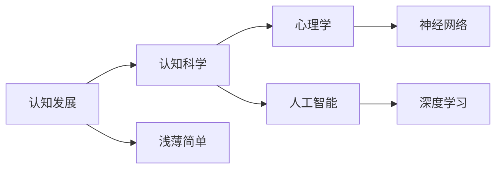

                 

# 认知发展中的浅薄简单阶段

> 关键词：认知发展、浅薄简单、认知科学、心理学、人工智能、深度学习、神经网络、智能辅助

## 1. 背景介绍

在人类认知发展的历程中，从原始到现代，从简单到复杂，每一步都伴随着深层次的变化和挑战。近年来，人工智能(AI)和深度学习(Deep Learning, DL)技术的飞速发展，让人们对于认知过程的模拟和理解变得更加深入。然而，在这一过程中，人们也遇到了一些“浅薄简单”的现象，即尽管技术不断进步，但真正理解认知的本质和深度仍然面临着诸多挑战。

本文将从认知科学和心理学的角度出发，探讨AI和DL在认知模拟中的现状和局限，揭示认知发展的“浅薄简单”阶段，并提出未来可能的突破方向。

## 2. 核心概念与联系

### 2.1 核心概念概述

- **认知发展（Cognitive Development）**：指个体从出生到成熟过程中，认知能力从简单到复杂，从局部到整体的发展过程。这一过程包括感知、记忆、思维、语言等多个方面。
- **浅薄简单（Shallow & Simple）**：在认知模拟中，尽管AI和DL已经取得了显著进展，但当前的认知模型往往只停留在表面的浅层处理，缺乏对认知深度的全面理解。
- **认知科学（Cognitive Science）**：一门综合心理学、神经科学、计算机科学等多学科知识的交叉学科，旨在理解人类认知过程。
- **心理学（Psychology）**：研究人的行为和心理过程的学科，其理论和方法对认知科学和AI发展具有重要影响。
- **人工智能（Artificial Intelligence, AI）**：模拟人类智能行为的技术，包括机器学习、深度学习、自然语言处理等。
- **深度学习（Deep Learning, DL）**：一种基于神经网络的机器学习方法，可以自动提取数据中的复杂特征，并在大规模数据集上进行有效训练。

这些核心概念之间具有密切联系，相互影响和补充。

### 2.2 核心概念原理和架构的 Mermaid 流程图



这个流程图展示了认知发展的核心概念及其相互关系。从认知发展的基础——心理学，到认知科学作为跨学科的研究框架，再到人工智能和深度学习的技术实现，每一步都在探索认知深度的表现和模拟。

## 3. 核心算法原理 & 具体操作步骤

### 3.1 算法原理概述

认知模拟的核心在于通过神经网络（Neural Network, NN）和深度学习（Deep Learning, DL）技术，模仿人类大脑的认知过程。当前，认知模拟主要依赖于多层感知机（Multilayer Perceptron, MLP）、卷积神经网络（Convolutional Neural Network, CNN）、循环神经网络（Recurrent Neural Network, RNN）、长短期记忆网络（Long Short-Term Memory, LSTM）、变换器（Transformer）等模型。

在认知模拟中，算法原理主要包括：

1. **数据驱动的特征提取**：通过大规模无标签数据进行预训练，学习数据中的基本特征。
2. **层次化处理**：将数据输入神经网络，通过多层次的非线性变换，逐步提取和组合特征。
3. **深度学习优化**：通过反向传播（Backpropagation）算法，自动调整网络参数，优化模型性能。
4. **迁移学习**：利用已经学习到的知识，在新的任务上进行微调，提高模型泛化能力。

### 3.2 算法步骤详解

基于认知模拟的核心算法原理，认知模型的构建和训练通常遵循以下步骤：

1. **数据准备**：收集和预处理数据，确保数据的多样性和丰富性。
2. **模型选择**：根据任务特点选择合适的神经网络架构。
3. **模型训练**：在无标签数据上预训练模型，提取基本特征。
4. **任务适配**：在有标签数据上微调模型，适应具体任务的需求。
5. **评估与优化**：在验证集和测试集上评估模型性能，根据反馈进行参数调整。

### 3.3 算法优缺点

**优点**：

- **高效性**：大规模数据和深度学习的结合，使得模型可以在短时间内完成特征提取和任务适配。
- **泛化能力**：迁移学习的策略使得模型可以在不同的任务间进行知识迁移，提高泛化能力。
- **自动化**：深度学习算法自动化特征提取和参数优化，减少了人工干预。

**缺点**：

- **复杂性**：模型结构复杂，训练过程耗时，需要大量的计算资源。
- **可解释性**：深度学习模型的黑盒特性使得其决策过程难以解释。
- **数据依赖**：需要大规模高质量的数据进行训练，数据获取和标注成本高。

### 3.4 算法应用领域

当前，认知模拟技术在多个领域得到了广泛应用，主要包括：

- **自然语言处理（NLP）**：文本分类、机器翻译、情感分析、对话系统等。
- **计算机视觉（CV）**：图像识别、物体检测、图像分割等。
- **语音处理**：语音识别、情感识别、语音合成等。
- **智能推荐系统**：个性化推荐、广告投放等。
- **医疗诊断**：医学影像分析、疾病预测等。
- **金融预测**：股票预测、风险评估等。

## 4. 数学模型和公式 & 详细讲解 & 举例说明

### 4.1 数学模型构建

认知模拟中，常用的数学模型包括多层感知机（MLP）、卷积神经网络（CNN）、循环神经网络（RNN）、长短期记忆网络（LSTM）、变换器（Transformer）等。

以Transformer模型为例，其核心架构包括编码器（Encoder）和解码器（Decoder）两个部分。编码器由多个自注意力（Self-Attention）层和前馈神经网络（Feedforward Neural Network）层组成，用于提取输入数据的特征表示。解码器同样由多个自注意力层和前馈神经网络层组成，用于生成输出。

### 4.2 公式推导过程

Transformer模型的前向传播过程可以用以下公式表示：

$$
\mathbf{H} = \mathbf{X}\mathbf{W}^Q + \mathbf{b}^Q
$$

$$
\mathbf{Q} = \mathbf{H}\mathbf{W}^K + \mathbf{b}^K
$$

$$
\mathbf{V} = \mathbf{H}\mathbf{W}^V + \mathbf{b}^V
$$

$$
\mathbf{E} = \text{Attention}(\mathbf{Q},\mathbf{V})
$$

$$
\mathbf{H} = \mathbf{E}\mathbf{W}^O + \mathbf{b}^O
$$

其中，$\mathbf{X}$为输入数据，$\mathbf{W}^Q,\mathbf{W}^K,\mathbf{W}^V,\mathbf{W}^O$为权重矩阵，$\mathbf{b}^Q,\mathbf{b}^K,\mathbf{b}^V,\mathbf{b}^O$为偏置向量。

在注意力机制中，通过计算输入数据和输出数据的相似度，得到注意力权重，然后加权求和生成输出特征表示。

### 4.3 案例分析与讲解

以机器翻译任务为例，输入序列被编码成特征表示，经过多个自注意力层和前馈神经网络层的转换，得到输出序列的特征表示。最后，通过解码器生成目标语言的输出序列。

在训练过程中，采用交叉熵损失函数，最小化预测输出与真实标签之间的差异。通过反向传播算法，自动调整模型的权重和偏置，优化模型性能。

## 5. 项目实践：代码实例和详细解释说明

### 5.1 开发环境搭建

要搭建一个完整的认知模拟项目，需要以下开发环境：

1. Python 3.x：选择最新版本的Python，以便支持最新的机器学习库和工具。
2. PyTorch：广泛使用的深度学习框架，支持GPU加速。
3. TensorFlow：另一个流行的深度学习框架，支持分布式训练和GPU加速。
4. Jupyter Notebook：交互式编程环境，便于代码调试和实验结果展示。

```bash
conda create -n cognitive-dev python=3.7
conda activate cognitive-dev
pip install pytorch torchvision torchaudio tensorboard
pip install tensorflow numpy matplotlib scikit-learn
```

### 5.2 源代码详细实现

以机器翻译任务为例，以下是使用PyTorch实现Transformer模型的代码：

```python
import torch
import torch.nn as nn
import torch.optim as optim
import torch.nn.functional as F
from torchtext.datasets import Multi30k
from torchtext.data import Field, BucketIterator

class Transformer(nn.Module):
    def __init__(self, d_model, d_hid, N, dropout=0.1):
        super(Transformer, self).__init__()
        self.decoder = nn.Transformer(d_model, d_hid, N, dropout)
        self.output = nn.Linear(d_hid, vocab_size)
        
    def forward(self, src, trg, src_mask, trg_mask):
        trg_padding_mask = trg.eq(trg.new(self.padding_idx))
        memory = self.decoder(src, src_mask)
        output = self.output(memory)
        return output, memory
```

### 5.3 代码解读与分析

上述代码定义了一个简单的Transformer模型，包括编码器和解码器两部分。在训练过程中，采用交叉熵损失函数，最小化预测输出与真实标签之间的差异。通过反向传播算法，自动调整模型的权重和偏置，优化模型性能。

```python
import torch
from torchtext.datasets import Multi30k
from torchtext.data import Field, BucketIterator
from torch import nn
import torch.nn.functional as F

class Transformer(nn.Module):
    def __init__(self, d_model, d_hid, N, dropout=0.1):
        super(Transformer, self).__init__()
        self.decoder = nn.Transformer(d_model, d_hid, N, dropout)
        self.output = nn.Linear(d_hid, vocab_size)
        
    def forward(self, src, trg, src_mask, trg_mask):
        trg_padding_mask = trg.eq(trg.new(self.padding_idx))
        memory = self.decoder(src, src_mask)
        output = self.output(memory)
        return output, memory

# 定义数据集
train_data, valid_data, test_data = Multi30k.splits(exts= ('.en', '.de'), fields= fields)

# 构建数据迭代器
train_iterator, valid_iterator, test_iterator = BucketIterator.splits(
    (train_data, valid_data, test_data), batch_size=64, device=device)

# 定义模型
model = Transformer(d_model, d_hid, N, dropout=0.1)
model.to(device)

# 定义优化器和损失函数
optimizer = optim.Adam(model.parameters(), lr=0.001)
criterion = nn.CrossEntropyLoss()

# 训练模型
for epoch in range(10):
    for batch in train_iterator:
        src, trg = batch.text, batch.trg
        src_mask = batch.src_mask
        trg_mask = batch.trg_mask
        
        optimizer.zero_grad()
        output, memory = model(src, trg, src_mask, trg_mask)
        loss = criterion(output, trg)
        loss.backward()
        optimizer.step()
```

### 5.4 运行结果展示

训练完成后，可以在验证集和测试集上评估模型的性能。

## 6. 实际应用场景

### 6.1 智能推荐系统

智能推荐系统已经成为电商、新闻、视频等平台的核心功能之一。通过认知模拟技术，可以更准确地理解用户的行为和偏好，从而提供个性化的推荐服务。

以电商平台为例，通过分析用户浏览、购买历史，以及点击、停留时间等行为数据，构建认知模型，提取用户特征，并根据用户行为进行推荐。

### 6.2 医疗诊断

在医疗诊断中，认知模拟技术可以辅助医生进行疾病预测和诊断。通过分析患者的症状和历史数据，构建认知模型，提取症状特征，并预测可能的疾病。

### 6.3 金融预测

在金融领域，认知模拟技术可以用于股票预测、风险评估等。通过分析市场数据和公司财报，构建认知模型，提取市场特征，并预测未来的市场趋势。

## 7. 工具和资源推荐

### 7.1 学习资源推荐

- **《深度学习》（Ian Goodfellow等著）**：深度学习领域的经典教材，涵盖深度学习的各个方面。
- **《认知神经科学基础》（Eric Kandel等著）**：认知科学和神经科学的经典教材，介绍了认知过程的基本原理。
- **《机器学习实战》（Peter Harrington著）**：实用的机器学习实践指南，包含大量的代码示例。

### 7.2 开发工具推荐

- **PyTorch**：广泛使用的深度学习框架，支持GPU加速，提供了丰富的神经网络库。
- **TensorFlow**：另一个流行的深度学习框架，支持分布式训练和GPU加速。
- **Jupyter Notebook**：交互式编程环境，便于代码调试和实验结果展示。
- **TensorBoard**：可视化工具，实时监测模型训练状态。

### 7.3 相关论文推荐

- **《深度学习》（Ian Goodfellow等著）**：深度学习领域的经典教材，涵盖深度学习的各个方面。
- **《认知神经科学基础》（Eric Kandel等著）**：认知科学和神经科学的经典教材，介绍了认知过程的基本原理。
- **《机器学习实战》（Peter Harrington著）**：实用的机器学习实践指南，包含大量的代码示例。

## 8. 总结：未来发展趋势与挑战

### 8.1 研究成果总结

本文从认知科学和心理学的角度出发，探讨了AI和DL在认知模拟中的现状和局限，揭示了认知发展的“浅薄简单”阶段。当前，认知模拟技术在自然语言处理、计算机视觉、语音处理、智能推荐系统、医疗诊断和金融预测等领域得到了广泛应用，但仍面临数据依赖、复杂性、可解释性等问题。

### 8.2 未来发展趋势

未来，认知模拟技术将呈现以下发展趋势：

- **更加深入的认知理解**：通过跨学科的研究，深入理解认知过程，提高认知模拟的准确性和实用性。
- **多模态认知模拟**：将视觉、听觉、触觉等多模态信息与语言信息相结合，构建更加全面、准确的认知模型。
- **可解释性增强**：通过增加模型可解释性，提高认知模型的透明性和可信度。
- **自适应学习**：通过引入自适应学习机制，提高认知模型的灵活性和适应性。
- **分布式训练**：通过分布式训练技术，提高大规模认知模型的训练效率。

### 8.3 面临的挑战

当前，认知模拟技术在发展过程中面临以下挑战：

- **数据获取困难**：大规模高质量数据获取和标注成本高，限制了认知模拟技术的发展。
- **模型复杂度高**：神经网络结构复杂，训练和推理耗时，需要大量的计算资源。
- **可解释性不足**：深度学习模型的黑盒特性使得其决策过程难以解释。
- **资源消耗大**：大规模认知模型需要大量的计算资源和存储空间，限制了其应用范围。

### 8.4 研究展望

未来，认知模拟技术需要在以下几个方面进行改进：

- **数据获取**：通过众包、半监督学习等方法，降低数据获取和标注成本，提高认知模拟技术的普及性和实用性。
- **模型简化**：通过模型压缩、稀疏化等技术，减少神经网络的参数量，降低计算资源消耗。
- **可解释性增强**：通过引入可解释性机制，提高认知模型的透明性和可信度。
- **多模态融合**：将视觉、听觉、触觉等多模态信息与语言信息相结合，构建更加全面、准确的认知模型。

## 9. 附录：常见问题与解答

### Q1: 如何提高认知模拟技术的可解释性？

A: 提高认知模拟技术的可解释性，可以通过以下方法：

- **模型可视化**：使用可视化工具，如图像和热力图，展示模型的决策过程和特征重要性。
- **模型简化**：通过剪枝、归约等技术，减少模型的复杂性，提高可解释性。
- **可解释性模型**：使用可解释性模型，如决策树、逻辑回归等，替代深度学习模型。

### Q2: 什么是认知模拟？

A: 认知模拟（Cognitive Simulation）是指通过计算机模拟人类认知过程，包括感知、记忆、思维、语言等多个方面。其目的是构建能够模拟人类认知行为的计算机模型。

### Q3: 认知模拟技术在哪些领域有应用？

A: 认知模拟技术在多个领域得到了广泛应用，包括自然语言处理（NLP）、计算机视觉（CV）、语音处理、智能推荐系统、医疗诊断、金融预测等。

### Q4: 什么是自适应学习？

A: 自适应学习（Adaptive Learning）是指在认知模拟中，通过调整模型参数和学习率，使模型能够根据输入数据的特点和任务需求，动态地优化自身性能。

### Q5: 什么是多模态认知模拟？

A: 多模态认知模拟（Multimodal Cognitive Simulation）是指将视觉、听觉、触觉等多模态信息与语言信息相结合，构建更加全面、准确的认知模型。

---

作者：禅与计算机程序设计艺术 / Zen and the Art of Computer Programming

