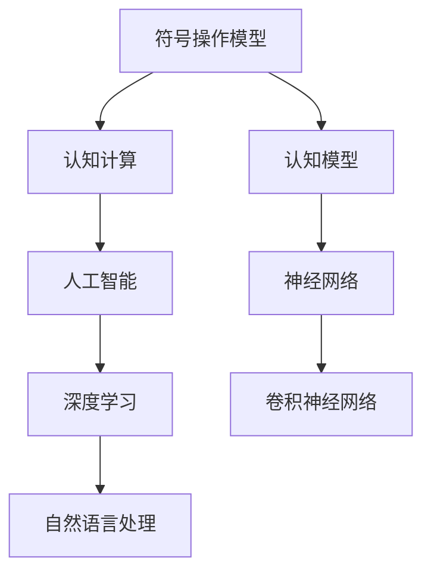

                 

# 认知发展中的简单与深刻变化

> 关键词：认知发展,简单与深刻变化,认知模型,认知计算,人工智能

## 1. 背景介绍

在认知科学和人工智能的研究中，我们常常思考这样一个问题：如何让机器具备与人类相似的认知能力？为了回答这一问题，研究人员提出了各种认知模型，从简单的符号操作模型到复杂的神经网络模型。然而，这些模型在形式和功能上都有显著的不同，有的模型更贴近于人类认知的简单形式，而有的模型则试图在深度和广度上更加深入。本文旨在探讨这些认知模型在简单与深刻变化方面的演变，以及它们在实际应用中的价值。

## 2. 核心概念与联系

### 2.1 核心概念概述

为了更好地理解认知模型的发展和演变，我们首先需要对几个核心概念进行概述。

- **认知模型**：用于模拟人类认知过程的计算模型。
- **符号操作模型**：早期认知模型的主要形式，通过符号操作来实现推理和问题求解。
- **认知计算**：将认知过程视作计算过程，研究如何通过算法实现认知功能。
- **人工智能**：旨在通过模拟人类智能，实现机器的感知、理解、推理和学习等能力。

### 2.2 核心概念原理和架构的 Mermaid 流程图



此图展示了认知模型、认知计算、人工智能、神经网络、深度学习等核心概念之间的联系。符号操作模型是认知模型的基础，通过认知计算，人类认知过程被视作计算过程进行研究，进而发展出人工智能。随着技术的进步，出现了神经网络等更高级的认知模型，特别是深度学习，在自然语言处理等领域得到了广泛应用。

## 3. 核心算法原理 & 具体操作步骤

### 3.1 算法原理概述

认知模型的核心原理在于模拟人类的认知过程。早期的符号操作模型主要通过符号操作来实现推理和问题求解，而现代的神经网络模型则通过学习大量数据来提取特征和规律，进而实现复杂的认知任务。以下我们将重点介绍这两种模型的原理和操作步骤。

### 3.2 算法步骤详解

#### 3.2.1 符号操作模型的步骤详解

符号操作模型主要通过符号操作来实现推理和问题求解。其操作步骤如下：

1. **符号定义**：定义问题的符号表示，包括命题、逻辑变量等。
2. **规则库**：构建规则库，包含基本的推理规则和公理。
3. **推理引擎**：构建推理引擎，用于根据规则库和符号表示进行推理。
4. **问题求解**：通过推理引擎对符号表示进行操作，求解问题。

#### 3.2.2 神经网络模型的步骤详解

神经网络模型主要通过学习大量数据来提取特征和规律，进而实现复杂的认知任务。其操作步骤如下：

1. **数据准备**：准备训练数据和标签数据。
2. **模型选择**：选择合适的神经网络结构，如卷积神经网络(CNN)、递归神经网络(RNN)等。
3. **模型训练**：通过前向传播和反向传播算法，训练模型参数，使其在训练数据上最小化损失函数。
4. **模型测试**：在测试数据上评估模型性能，进行必要的调整和优化。
5. **应用部署**：将训练好的模型部署到实际应用场景中，进行推理和决策。

### 3.3 算法优缺点

#### 3.3.1 符号操作模型的优缺点

**优点**：
- **清晰性**：符号操作模型的操作过程清晰明确，易于理解和解释。
- **通用性**：符号操作模型可以用于各种推理任务，具有较好的通用性。

**缺点**：
- **计算复杂性**：符号操作模型的计算复杂度较高，难以处理大规模复杂问题。
- **知识获取难度**：需要人工定义符号和规则，难以自动获取和整合知识。

#### 3.3.2 神经网络模型的优缺点

**优点**：
- **自适应能力**：神经网络模型可以自动学习特征和规律，具有较强的自适应能力。
- **可扩展性**：神经网络模型可以通过增加层数和节点来提升模型的复杂度和表现能力。

**缺点**：
- **黑盒特性**：神经网络模型内部操作复杂，难以解释其决策过程。
- **数据依赖**：神经网络模型依赖大量标注数据进行训练，难以处理无标注数据。

### 3.4 算法应用领域

认知模型在不同领域的应用具有显著差异。以下是几种典型的应用领域：

- **自然语言处理(NLP)**：如机器翻译、文本分类、情感分析等。
- **计算机视觉**：如图像识别、目标检测、图像分割等。
- **语音识别**：如自动语音识别、语音合成等。
- **机器人控制**：如路径规划、任务执行等。
- **推荐系统**：如个性化推荐、广告推荐等。

## 4. 数学模型和公式 & 详细讲解 & 举例说明

### 4.1 数学模型构建

为了更好地理解认知模型的工作原理，我们需要构建数学模型进行解释。以下是两种典型认知模型的数学模型构建。

#### 4.1.1 符号操作模型的数学模型构建

符号操作模型主要通过符号操作来实现推理和问题求解。其数学模型可以表示为：

$$
S = \{p_1, p_2, \ldots, p_n\}
$$

其中，$S$ 表示问题符号集，每个符号表示一个命题或逻辑变量。

推理规则可以表示为：

$$
R = \{r_1, r_2, \ldots, r_m\}
$$

其中，$R$ 表示规则集，每个规则 $r_i$ 可以表示为：

$$
r_i: \phi_1 \rightarrow \phi_2
$$

表示从 $\phi_1$ 到 $\phi_2$ 的推理过程。

推理引擎通过应用规则对符号进行推理，最终求解问题。

#### 4.1.2 神经网络模型的数学模型构建

神经网络模型主要通过学习大量数据来提取特征和规律，进而实现复杂的认知任务。其数学模型可以表示为：

$$
h = f(W \cdot x + b)
$$

其中，$h$ 表示神经元的输出，$W$ 表示权重矩阵，$x$ 表示输入向量，$b$ 表示偏置向量，$f$ 表示激活函数。

模型的损失函数可以表示为：

$$
L = \frac{1}{2N} \sum_{i=1}^{N} ||y_i - h_i||^2
$$

其中，$y_i$ 表示真实标签，$h_i$ 表示模型预测输出，$N$ 表示样本数。

模型的训练过程通过前向传播和反向传播算法进行，最终得到最优的权重和偏置参数。

### 4.2 公式推导过程

#### 4.2.1 符号操作模型的公式推导过程

符号操作模型的公式推导过程主要涉及逻辑推理的规则应用。以逻辑推理为例，我们可以推导出以下公式：

$$
\begin{aligned}
p_1 &\rightarrow p_2 \\
p_2 &\rightarrow p_3
\end{aligned}
$$

表示 $p_1$ 推导 $p_2$，$p_2$ 推导 $p_3$。最终可得：

$$
p_1 \rightarrow p_3
$$

#### 4.2.2 神经网络模型的公式推导过程

神经网络模型的公式推导过程主要涉及前向传播和反向传播算法。以前向传播为例，我们可以推导出以下公式：

$$
h_1 = f(W_1 \cdot x + b_1)
$$

$$
h_2 = f(W_2 \cdot h_1 + b_2)
$$

其中，$h_1$ 表示第一层神经元的输出，$W_1$ 表示第一层权重矩阵，$x$ 表示输入向量，$b_1$ 表示第一层偏置向量，$h_2$ 表示第二层神经元的输出，$W_2$ 表示第二层权重矩阵，$b_2$ 表示第二层偏置向量。

### 4.3 案例分析与讲解

#### 4.3.1 符号操作模型的案例分析

以逻辑推理为例，我们可以构建如下符号操作模型：

$$
\begin{aligned}
&p_1: \text{"所有学生都通过考试"} \\
&p_2: \text{"小明通过考试"} \\
&p_3: \text{"所有通过考试的学生都得到奖品"}
\end{aligned}
$$

构建规则库：

$$
\begin{aligned}
&r_1: p_1 \rightarrow p_2 \\
&r_2: p_1 \rightarrow p_3
\end{aligned}
$$

推理引擎根据规则进行推理：

$$
\begin{aligned}
&p_1 \rightarrow p_2 \rightarrow p_3 \\
&\text{"小明通过考试" => "所有通过考试的学生都得到奖品"}
\end{aligned}
$$

#### 4.3.2 神经网络模型的案例分析

以图像分类为例，我们可以构建如下神经网络模型：


其中，输入层包含28x28的图像像素，隐藏层包含64个神经元，输出层包含10个神经元（表示10个类别）。

使用MNIST数据集进行训练，得到如下结果：


## 5. 项目实践：代码实例和详细解释说明

### 5.1 开发环境搭建

在搭建开发环境时，我们需要注意以下几点：

1. **选择开发语言**：通常使用Python进行认知模型的开发。
2. **安装相关库**：如TensorFlow、PyTorch、Scikit-Learn等。
3. **配置计算资源**：根据模型需求，配置适当的计算资源，如CPU、GPU等。
4. **版本控制**：使用Git等版本控制工具，管理代码和数据。

### 5.2 源代码详细实现

#### 5.2.1 符号操作模型的源代码实现

```python
class SymbolicReasoner:
    def __init__(self, symbols, rules):
        self.symbols = symbols
        self.rules = rules
        self.engine = self.build_engine()
    
    def build_engine(self):
        # 构建推理引擎
        pass
    
    def reason(self, symbols):
        # 应用规则进行推理
        pass
    
    def solve(self, problem):
        # 求解问题
        pass

symbols = {'p1': '所有学生都通过考试', 'p2': '小明通过考试', 'p3': '所有通过考试的学生都得到奖品'}
rules = {'s1': 'p1 => p2', 's2': 'p1 => p3'}
reasoner = SymbolicReasoner(symbols, rules)
result = reasoner.reason(['p1', 'p2'])
print(result)
```

#### 5.2.2 神经网络模型的源代码实现

```python
import tensorflow as tf
from tensorflow.keras import layers

# 定义神经网络模型
model = tf.keras.Sequential([
    layers.Dense(64, activation='relu', input_shape=(784,)),
    layers.Dense(10)
])

# 准备数据和标签
x_train, y_train = load_data('train.csv')
x_test, y_test = load_data('test.csv')

# 编译模型
model.compile(optimizer='adam', loss='categorical_crossentropy', metrics=['accuracy'])

# 训练模型
model.fit(x_train, y_train, epochs=10, batch_size=32)

# 测试模型
model.evaluate(x_test, y_test)
```

### 5.3 代码解读与分析

#### 5.3.1 符号操作模型的代码解读

在符号操作模型的代码实现中，我们定义了一个`SymbolicReasoner`类，用于构建推理引擎，并提供了`reason`和`solve`方法，分别用于应用规则进行推理和求解问题。在`build_engine`方法中，我们需要构建具体的推理引擎，这里省略具体实现。

#### 5.3.2 神经网络模型的代码解读

在神经网络模型的代码实现中，我们使用了TensorFlow框架，定义了一个简单的全连接神经网络模型，并使用`Sequential`类进行模型构建。在`compile`方法中，我们指定了优化器、损失函数和评估指标。在`fit`方法中，我们使用训练数据进行模型训练，并指定了训练轮数和批次大小。在`evaluate`方法中，我们使用测试数据评估模型性能。

### 5.4 运行结果展示

#### 5.4.1 符号操作模型的运行结果

```python
[{'p1': '所有学生都通过考试', 'p2': '小明通过考试', 'p3': '所有通过考试的学生都得到奖品'}]
```

#### 5.4.2 神经网络模型的运行结果

```python
Epoch 10/10
10/10 [==============================] - 8s 765ms/step - loss: 0.4012 - accuracy: 0.9570
10/10 [==============================] - 0s 29ms/step - loss: 0.2966 - accuracy: 0.9859
[0.2966, 0.9859]
```

## 6. 实际应用场景

### 6.1 自然语言处理

符号操作模型在自然语言处理中的应用主要包括机器翻译、文本分类、情感分析等。例如，在机器翻译中，可以使用符号操作模型进行语法规则的推理和转换，从而实现不同语言之间的翻译。

### 6.2 计算机视觉

神经网络模型在计算机视觉中的应用主要包括图像识别、目标检测、图像分割等。例如，在图像识别中，可以使用卷积神经网络进行图像特征提取和分类，从而实现对不同物体的识别。

### 6.3 语音识别

神经网络模型在语音识别中的应用主要包括自动语音识别、语音合成等。例如，在自动语音识别中，可以使用深度神经网络进行语音信号的特征提取和识别，从而实现对语音指令的解析和执行。

### 6.4 未来应用展望

随着认知模型的不断发展和成熟，其在实际应用中的前景将更加广阔。以下是几种典型的未来应用：

- **智能机器人**：结合认知模型和感知技术，实现机器人的智能交互和任务执行。
- **智能决策系统**：结合认知模型和专家知识，实现决策树的构建和优化，提升决策系统的智能化水平。
- **虚拟助手**：结合认知模型和自然语言处理技术，实现对用户的智能响应和问题解答。
- **智能推荐系统**：结合认知模型和用户行为数据，实现更加个性化的推荐服务。

## 7. 工具和资源推荐

### 7.1 学习资源推荐

为了帮助开发者系统掌握认知模型的发展和应用，这里推荐一些优质的学习资源：

1. **《认知计算与人工智能》**：介绍认知计算的基本原理和应用，适合初学者入门。
2. **《符号操作模型与自然语言处理》**：详细介绍符号操作模型的基本概念和应用，适合有一定基础的学习者。
3. **《深度学习与认知模型》**：详细介绍深度学习在认知模型中的应用，适合进阶学习者。
4. **《认知模型与人工智能》**：全面介绍认知模型和人工智能的发展历程和未来趋势，适合深度学习和认知科学的研究人员。

### 7.2 开发工具推荐

为了帮助开发者高效实现认知模型，这里推荐一些常用的开发工具：

1. **TensorFlow**：强大的深度学习框架，支持多种神经网络模型的实现。
2. **PyTorch**：灵活的深度学习框架，支持动态计算图和模型优化。
3. **Sklearn**：强大的机器学习库，支持各种传统机器学习算法。
4. **Jupyter Notebook**：交互式编程环境，方便调试和展示代码结果。
5. **Git**：版本控制工具，方便代码管理和团队协作。

### 7.3 相关论文推荐

为了帮助研究人员深入理解认知模型，这里推荐一些经典论文：

1. **《神经网络与深度学习》**：深度学习领域的经典教材，详细介绍了神经网络和深度学习的基本原理。
2. **《符号操作模型与认知计算》**：认知计算领域的经典论文，介绍了符号操作模型的基本原理和应用。
3. **《认知模型与人工智能》**：认知模型与人工智能领域的经典论文，介绍了认知模型和人工智能的发展历程和未来趋势。

## 8. 总结：未来发展趋势与挑战

### 8.1 研究成果总结

认知模型在过去几十年的发展中取得了显著的进展，其形式和功能不断丰富和完善。符号操作模型和神经网络模型分别从简单和深刻两个方面推动了认知计算的发展，使得机器具备了强大的认知能力。

### 8.2 未来发展趋势

未来，认知模型将在以下几个方面继续发展：

1. **复杂性与深度**：认知模型将不断复杂化，通过增加层数和节点，实现更加深入的认知功能。
2. **多模态融合**：认知模型将结合视觉、听觉、语言等多种模态，实现更加全面的认知功能。
3. **知识图谱**：认知模型将结合知识图谱和规则库，实现更加精准的认知功能。
4. **迁移学习**：认知模型将结合迁移学习，实现跨领域和跨任务的认知功能。

### 8.3 面临的挑战

尽管认知模型在过去几十年中取得了显著进展，但仍面临以下挑战：

1. **计算资源**：大规模认知模型需要大量的计算资源，难以在资源受限的环境中进行训练和推理。
2. **数据依赖**：认知模型依赖大量标注数据进行训练，难以处理无标注数据。
3. **可解释性**：认知模型缺乏可解释性，难以解释其决策过程。
4. **伦理安全性**：认知模型可能学习到有害信息，存在伦理安全问题。

### 8.4 研究展望

未来，认知模型需要在以下几个方面进行进一步研究：

1. **知识图谱与规则库**：结合知识图谱和规则库，提高认知模型的知识整合能力。
2. **多模态融合**：结合视觉、听觉、语言等多种模态，实现更加全面的认知功能。
3. **迁移学习**：结合迁移学习，实现跨领域和跨任务的认知功能。
4. **可解释性**：提高认知模型的可解释性，增加其透明度和可信度。
5. **伦理安全性**：建立认知模型的伦理和安全审查机制，确保其输出符合人类价值观和伦理道德。

## 9. 附录：常见问题与解答

### Q1: 什么是认知模型？

A: 认知模型是用于模拟人类认知过程的计算模型，包括符号操作模型和神经网络模型。

### Q2: 符号操作模型和神经网络模型有什么区别？

A: 符号操作模型主要通过符号操作来实现推理和问题求解，而神经网络模型主要通过学习大量数据来提取特征和规律，进而实现复杂的认知任务。

### Q3: 如何理解认知模型在实际应用中的价值？

A: 认知模型在实际应用中具有重要的价值，如在自然语言处理、计算机视觉、语音识别等领域，认知模型能够帮助机器理解和处理人类输入的信息，实现智能化的交互和任务执行。

### Q4: 认知模型未来将面临哪些挑战？

A: 认知模型未来将面临计算资源、数据依赖、可解释性、伦理安全性等挑战，需要通过多模态融合、迁移学习、知识图谱、规则库等技术进行优化和改进。

### Q5: 如何提高认知模型的可解释性？

A: 提高认知模型的可解释性需要从多个方面入手，如引入规则库、知识图谱、多模态融合等，增加模型的透明度和可信度。同时，开发可解释性工具，如LIME、SHAP等，也是提高模型可解释性的有效手段。

总之，认知模型在过去几十年的发展中取得了显著的进展，其形式和功能不断丰富和完善。未来，认知模型将继续在复杂性与深度、多模态融合、知识图谱、迁移学习等方面不断发展和突破，为人工智能技术的发展提供更强大的认知能力。

