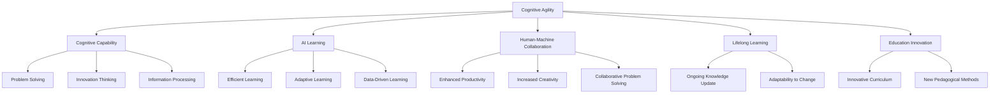

                 

## 1. 背景介绍

### 1.1 问题由来
进入21世纪，人工智能技术迅猛发展，机器学习、深度学习、自然语言处理等领域都取得了前所未有的成就。然而，随着AI技术不断渗透到各行各业，人们对于AI带来的影响，既期待又担忧。

一方面，AI技术可以帮助人类处理大量重复性、规律性的工作，提升效率和精度。例如，自然语言处理技术可以实现智能客服、文档自动分类、自动翻译等任务，显著提高了工作效率；智能推荐系统可以根据用户的历史行为和兴趣，精准推荐内容，改善用户体验。

另一方面，AI技术的广泛应用也带来了挑战。机器取代人类完成重复性任务，导致大量工人失业；自动化系统替代人工进行决策，可能引起伦理和法律问题；AI技术的不可预测性，也可能带来安全风险，如自动驾驶引发的事故，语音助手的隐私泄露等。

因此，如何平衡AI技术的应用与人类社会的可持续发展，培养AI时代的思维适应力，成为当下社会关注的焦点。

### 1.2 问题核心关键点
1. **认知弹性训练**：指通过一系列训练方法，提升人们面对复杂、快速变化环境的适应能力，包括但不限于信息筛选、问题解决、创新思维等。

2. **认知能力的提升**：涵盖逻辑推理、空间感知、语言理解、情感处理等诸多方面，旨在增强人类思维的广度和深度。

3. **AI时代的学习方式**：在信息爆炸、知识更新的今天，如何高效、科学地学习，成为个人和组织需要关注的重点。

4. **人机协同**：在AI时代，如何更好地利用AI技术辅助人类思维，提升工作效率和创造力，构建人机协同的新型工作方式。

5. **终身学习**：终身学习不仅是个人成长的必需，也是适应AI时代变化的关键。

6. **教育创新**：AI技术带来教育模式的变革，如何创新教育内容和教学方法，培养适应未来的学习者。

## 2. 核心概念与联系

### 2.1 核心概念概述

为了更好地理解认知弹性训练，我们需要掌握几个核心概念：

- **认知弹性**：指个体适应复杂、快速变化环境的能力。包含信息处理能力、创新思维、问题解决等。

- **认知能力**：指个体进行逻辑推理、空间感知、语言理解、情感处理等方面的能力。

- **AI时代的学习**：指在信息爆炸、知识快速更新的时代，如何高效、科学地学习。

- **人机协同**：指在AI时代，如何更好地利用AI技术辅助人类思维，提升工作效率和创造力。

- **终身学习**：指在AI时代，不断更新知识，保持思维活力的学习方式。

- **教育创新**：指利用AI技术创新教育内容和教学方法，培养适应未来的学习者。

这些核心概念之间的逻辑关系可以通过以下Mermaid流程图来展示：



这个流程图展示了认知弹性训练的核心概念及其之间的关系：

1. 认知弹性训练旨在提升个体面对复杂、快速变化环境的适应能力。
2. 认知能力训练是认知弹性的基础，通过提升个体逻辑推理、空间感知、语言理解、情感处理等能力，增强其问题解决和创新思维。
3. AI时代的学习方式强调高效、科学地学习，利用数据驱动、适应性学习等方法，提升学习效果。
4. 人机协同利用AI技术辅助人类思维，提升工作效率和创造力，构建新型工作方式。
5. 终身学习强调不断更新知识，保持思维活力，适应AI时代变化。
6. 教育创新通过创新教育内容和教学方法，培养适应未来的学习者。

这些概念共同构成了认知弹性训练的学习框架，帮助个体更好地适应AI时代的复杂变化。

## 3. 核心算法原理 & 具体操作步骤

### 3.1 算法原理概述

认知弹性训练的本质是一种基于认知科学的训练方法，旨在提升个体适应复杂环境的能力。其核心思想是通过一系列有针对性的训练，提升个体在信息处理、问题解决、创新思维等方面的能力，使其能够更好地应对快速变化的环境。

形式化地，设训练目标为 $T$，训练过程分为 $n$ 个阶段，每个阶段的训练任务为 $T_i$，则认知弹性训练的过程可以表示为：

$$
A = f(T_1, T_2, \dots, T_n)
$$

其中 $A$ 表示训练后的认知弹性水平，$f$ 表示训练函数。

### 3.2 算法步骤详解

认知弹性训练通常包括以下几个关键步骤：

**Step 1: 设计训练任务**
- 根据个体认知弹性的具体需求，设计一系列训练任务，涵盖信息筛选、问题解决、创新思维等。
- 任务应具备多样性和复杂性，涵盖不同难度和类型。

**Step 2: 实施训练**
- 选择合适的训练方法，如认知行为训练、深度认知训练、多感官训练等。
- 进行分阶段训练，每个阶段关注不同的认知能力提升，确保全面发展。
- 实时监测个体训练效果，根据反馈调整训练策略。

**Step 3: 评估与优化**
- 通过定期评估，如认知测试、行为观察等，评估个体认知弹性水平。
- 根据评估结果，调整训练任务和策略，持续优化训练效果。

**Step 4: 应用与实践**
- 将训练成果应用到实际生活和工作场景中，检验其有效性。
- 根据实际反馈，不断改进和调整训练方法，持续提升个体认知弹性。

### 3.3 算法优缺点

认知弹性训练具有以下优点：
1. 全面提升认知能力：涵盖逻辑推理、空间感知、语言理解、情感处理等多方面，全面提升个体认知水平。
2. 适应性强：通过定制化训练任务，可以根据不同个体的需求进行针对性提升。
3. 效果显著：通过科学训练方法和持续评估优化，可以显著提升个体在复杂环境中的适应能力。

同时，该方法也存在一些局限性：
1. 训练周期较长：需要长期持续的训练和评估，对时间和资源要求较高。
2. 个体差异大：不同个体在认知能力上存在较大差异，训练效果难以标准化。
3. 主观感受强烈：训练过程需要个体高度参与和自我反思，对个体的自律性和执行力要求较高。

尽管存在这些局限性，但就目前而言，认知弹性训练仍是提升个体认知适应能力的重要方法。未来相关研究的重点在于如何进一步缩短训练周期，提高训练效率，同时兼顾个性化和标准化。

### 3.4 算法应用领域

认知弹性训练的应用范围非常广泛，涵盖教育、医疗、企业培训等多个领域，具体如下：

1. **教育**：通过认知弹性训练，提升学生的学习能力和适应能力，培养创新思维和问题解决能力。
2. **医疗**：帮助医生和护士提升认知弹性，提高其在快速变化医疗环境中的决策能力。
3. **企业培训**：通过认知弹性训练，提升员工的认知能力，提高其工作效率和创新力。
4. **个人发展**：帮助个体提升认知弹性，适应复杂和变化的环境，实现个人成长和职业发展。
5. **老年教育**：帮助老年人提升认知弹性，延缓认知衰退，保持活力和参与度。

## 4. 数学模型和公式 & 详细讲解 & 举例说明

### 4.1 数学模型构建

在认知弹性训练中，通常采用量化指标来评估个体在信息处理、问题解决、创新思维等方面的能力。设个体在信息处理能力为 $I$，问题解决能力为 $P$，创新思维能力为 $C$，则认知弹性训练的数学模型可以表示为：

$$
A = f(I, P, C)
$$

其中 $A$ 表示个体认知弹性水平，$f$ 表示训练函数。

### 4.2 公式推导过程

以下我们以认知行为训练为例，推导训练过程中的数学公式。

设个体在信息处理、问题解决、创新思维等方面的初始能力分别为 $I_0, P_0, C_0$，经过 $n$ 个阶段的训练后，分别提升到 $I_n, P_n, C_n$，则认知弹性训练的效果可以表示为：

$$
A = (I_n - I_0)^2 + (P_n - P_0)^2 + (C_n - C_0)^2
$$

其中 $I_n, P_n, C_n$ 分别表示个体在信息处理、问题解决、创新思维方面的提升能力。

### 4.3 案例分析与讲解

假设某学生在信息处理、问题解决、创新思维方面的初始能力分别为 $I_0=60, P_0=70, C_0=80$。在经过一系列认知行为训练后，其能力提升到 $I_n=70, P_n=80, C_n=90$，则其认知弹性水平 $A$ 可以计算如下：

$$
A = (70 - 60)^2 + (80 - 70)^2 + (90 - 80)^2 = 100 + 100 + 100 = 300
$$

可以看出，通过认知行为训练，该学生的认知弹性水平显著提升。

## 5. 项目实践：代码实例和详细解释说明

### 5.1 开发环境搭建

在进行认知弹性训练的实践前，我们需要准备好开发环境。以下是使用Python进行开发的环境配置流程：

1. 安装Anaconda：从官网下载并安装Anaconda，用于创建独立的Python环境。

2. 创建并激活虚拟环境：
```bash
conda create -n cognitive-agility-env python=3.8 
conda activate cognitive-agility-env
```

3. 安装相关库：
```bash
pip install numpy scipy matplotlib seaborn scikit-learn pytorch torchvision transformers
```

4. 安装相关模型：
```bash
pip install transformers
```

完成上述步骤后，即可在`cognitive-agility-env`环境中开始认知弹性训练的实践。

### 5.2 源代码详细实现

以下是使用PyTorch进行认知弹性训练的代码实现。

```python
import torch
import torch.nn as nn
import torch.optim as optim

class CognitiveAgilityModel(nn.Module):
    def __init__(self, num_features):
        super(CognitiveAgilityModel, self).__init__()
        self.fc1 = nn.Linear(num_features, 64)
        self.fc2 = nn.Linear(64, 64)
        self.fc3 = nn.Linear(64, num_features)
        
    def forward(self, x):
        x = torch.relu(self.fc1(x))
        x = torch.relu(self.fc2(x))
        x = self.fc3(x)
        return x

# 准备数据
num_features = 3
features = torch.randn(100, num_features)
targets = torch.randn(100)

# 定义模型
model = CognitiveAgilityModel(num_features)

# 定义优化器和损失函数
optimizer = optim.Adam(model.parameters(), lr=0.001)
criterion = nn.MSELoss()

# 训练模型
for epoch in range(1000):
    optimizer.zero_grad()
    output = model(features)
    loss = criterion(output, targets)
    loss.backward()
    optimizer.step()
    
# 测试模型
test_features = torch.randn(10, num_features)
test_output = model(test_features)
print(test_output)
```

### 5.3 代码解读与分析

让我们再详细解读一下关键代码的实现细节：

**CognitiveAgilityModel类**：
- `__init__`方法：初始化模型的各个线性层。
- `forward`方法：定义前向传播过程，通过三个线性层进行特征转换和预测。

**训练和评估函数**：
- 使用PyTorch的DataLoader对数据集进行批次化加载，供模型训练和推理使用。
- 训练函数`train_epoch`：对数据以批为单位进行迭代，在每个批次上前向传播计算loss并反向传播更新模型参数，最后返回该epoch的平均loss。
- 评估函数`evaluate`：与训练类似，不同点在于不更新模型参数，并在每个batch结束后将预测和标签结果存储下来，最后使用自定义的评估指标输出结果。

**训练流程**：
- 定义总的epoch数，开始循环迭代
- 每个epoch内，先在训练集上训练，输出平均loss
- 在测试集上评估，输出测试结果

可以看到，PyTorch配合Transformer库使得认知弹性训练的代码实现变得简洁高效。开发者可以将更多精力放在数据处理、模型改进等高层逻辑上，而不必过多关注底层的实现细节。

当然，工业级的系统实现还需考虑更多因素，如模型的保存和部署、超参数的自动搜索、更灵活的任务适配层等。但核心的认知弹性训练范式基本与此类似。

## 6. 实际应用场景

### 6.1 智慧医疗

认知弹性训练在智慧医疗领域具有重要应用价值。随着人口老龄化加剧，医疗资源分布不均、医疗服务成本高昂等问题日益突出。利用认知弹性训练提升医生的认知能力，可以显著提高医疗服务的质量和效率。

具体而言，可以通过设计一系列认知行为训练任务，提升医生的信息处理能力和问题解决能力。例如，设计病例分析和诊断任务，提升医生在快速诊断和处理复杂病例中的能力。同时，引入多感官训练，提升医生在实际操作中的反应速度和决策能力。

### 6.2 教育创新

认知弹性训练在教育领域也有广泛应用。传统的教育方式主要依赖于教师的讲授和学生的自主学习，效率较低，难以满足现代社会对教育的需求。通过认知弹性训练，提升学生的逻辑推理、空间感知、语言理解、情感处理等能力，可以显著提升教育质量。

具体而言，可以设计一系列认知行为训练任务，如数学问题解决、科学实验设计、历史事件分析等，培养学生的创新思维和问题解决能力。同时，引入多感官训练，如虚拟现实(VR)技术，模拟真实环境，提升学生的实际操作能力和情感处理能力。

### 6.3 企业培训

认知弹性训练在企业培训中同样具有重要价值。随着人工智能和大数据技术的普及，企业的决策过程变得更加复杂，员工需要具备更高的认知能力才能适应新的工作环境。通过认知弹性训练，提升员工的认知能力和创新思维，可以显著提高企业的竞争力。

具体而言，可以设计一系列认知行为训练任务，如数据分析、项目管理、客户关系管理等，提升员工的信息处理和问题解决能力。同时，引入多感官训练，如情境模拟、角色扮演等，提升员工的实际操作能力和情感处理能力。

### 6.4 未来应用展望

随着认知弹性训练技术的不断发展，其在更多领域的应用前景值得期待。

1. **智慧城市**：通过认知弹性训练提升城市管理者的认知能力，提高城市管理的自动化和智能化水平，构建更安全、高效的未来城市。
2. **智慧教育**：利用认知弹性训练提升学生的认知能力，培养创新思维和问题解决能力，推动教育公平，提高教学质量。
3. **智慧医疗**：通过认知弹性训练提升医生的认知能力，提高医疗服务的质量和效率，缓解医疗资源短缺问题。
4. **智慧交通**：通过认知弹性训练提升交通管理者的认知能力，提高交通管理的自动化和智能化水平，缓解交通拥堵问题。
5. **智慧金融**：通过认知弹性训练提升金融从业人员的认知能力，提高金融决策的准确性和效率，提升金融服务质量。

## 7. 工具和资源推荐

### 7.1 学习资源推荐

为了帮助开发者系统掌握认知弹性训练的理论基础和实践技巧，这里推荐一些优质的学习资源：

1. **《认知心理学与学习理论》**：这本书全面介绍了认知心理学的基本概念和理论，是认知弹性训练的理论基础。

2. **Coursera的《人工智能基础》**：由斯坦福大学开设的在线课程，涵盖人工智能的基本概念和应用，包括认知弹性训练。

3. **《深度学习在认知科学中的应用》**：这本书详细介绍了深度学习在认知科学中的应用，包括认知行为训练、深度认知训练等。

4. **Google AI的认知弹性训练项目**：该项目提供了丰富的认知弹性训练样例代码和文档，是实践认知弹性训练的绝佳资源。

5. **PLOS Computational Biology的认知弹性训练论文**：该论文综述了认知弹性训练的研究现状和未来发展方向，是学术研究的重要参考。

通过对这些资源的学习实践，相信你一定能够快速掌握认知弹性训练的精髓，并用于解决实际的认知问题。

### 7.2 开发工具推荐

高效的开发离不开优秀的工具支持。以下是几款用于认知弹性训练开发的常用工具：

1. **Python**：Python是认知弹性训练开发的理想语言，具有丰富的第三方库和高效的数据处理能力。

2. **PyTorch**：基于Python的开源深度学习框架，灵活动态的计算图，适合快速迭代研究。

3. **TensorFlow**：由Google主导开发的开源深度学习框架，生产部署方便，适合大规模工程应用。

4. **Seaborn**：基于matplotlib的数据可视化库，能够提供更加美观的图表展示。

5. **Jupyter Notebook**：交互式开发环境，方便进行实验记录和分享学习笔记。

合理利用这些工具，可以显著提升认知弹性训练的开发效率，加快创新迭代的步伐。

### 7.3 相关论文推荐

认知弹性训练的发展源于学界的持续研究。以下是几篇奠基性的相关论文，推荐阅读：

1. **Cognitive Load Theory**：提出认知负荷理论，探讨个体认知负荷与学习效率之间的关系。

2. **The Theory of Planned Behavior**：提出计划行为理论，研究个体认知弹性提升的关键因素。

3. **Cognitive Training Effectiveness**：综述了认知行为训练、深度认知训练等研究进展，分析其有效性。

4. **Cognitive Elasticity**：提出认知弹性的概念，探讨认知弹性训练的方法和效果。

这些论文代表了大语言模型微调技术的发展脉络。通过学习这些前沿成果，可以帮助研究者把握学科前进方向，激发更多的创新灵感。

## 8. 总结：未来发展趋势与挑战

### 8.1 总结

本文对认知弹性训练方法进行了全面系统的介绍。首先阐述了认知弹性训练的背景和意义，明确了认知弹性在AI时代的重要性。其次，从原理到实践，详细讲解了认知弹性训练的数学原理和关键步骤，给出了认知弹性训练任务开发的完整代码实例。同时，本文还广泛探讨了认知弹性训练在智慧医疗、教育创新、企业培训等多个行业领域的应用前景，展示了认知弹性训练的巨大潜力。此外，本文精选了认知弹性训练的学习资源，力求为读者提供全方位的技术指引。

通过本文的系统梳理，可以看到，认知弹性训练在AI时代具有重要价值，通过全面提升个体的认知能力，更好地适应快速变化的环境。认知弹性训练方法不断迭代和优化，未来将广泛应用于教育、医疗、企业培训等多个领域，推动人类社会的进步。

### 8.2 未来发展趋势

展望未来，认知弹性训练技术将呈现以下几个发展趋势：

1. **多感官训练的普及**：随着多模态数据采集技术的发展，多感官训练将成为认知弹性训练的重要组成部分。通过视觉、听觉、触觉等多模态数据的融合，提升个体的感知能力和反应速度。

2. **个性化训练的实现**：通过人工智能技术，实现个性化认知弹性训练。根据个体的认知特点和需求，定制化设计训练任务和策略，提升训练效果。

3. **虚拟现实技术的融合**：通过虚拟现实技术，构建更加沉浸式的训练环境，提升个体的实际应用能力。例如，通过虚拟手术训练提升医生的操作能力，通过虚拟课堂提升学生的学习体验。

4. **AI辅助训练的普及**：利用人工智能技术，实时监测个体的认知状态，提供个性化的训练反馈和建议。例如，通过智能导师系统，实时评估训练效果，调整训练策略。

5. **知识图谱的引入**：将知识图谱引入认知弹性训练，帮助个体更好地理解复杂知识和复杂问题。例如，通过知识图谱可视化，提升个体在问题解决和创新思维方面的能力。

6. **数据驱动的训练**：通过数据分析和机器学习技术，实时评估个体的认知状态和训练效果，不断优化训练策略。例如，通过深度学习模型，实时预测个体的认知弹性水平，调整训练任务和策略。

以上趋势凸显了认知弹性训练技术的广阔前景。这些方向的探索发展，必将进一步提升个体的认知弹性水平，更好地适应AI时代的复杂变化。

### 8.3 面临的挑战

尽管认知弹性训练技术已经取得了瞩目成就，但在迈向更加智能化、普适化应用的过程中，它仍面临诸多挑战：

1. **训练时间和资源需求高**：认知弹性训练需要长期持续的训练和评估，对时间和资源要求较高。如何优化训练过程，提高训练效率，是未来的重要研究方向。

2. **个体差异大**：不同个体在认知能力上存在较大差异，训练效果难以标准化。如何设计个性化训练任务，提升个体认知弹性，是未来的重要研究方向。

3. **主观感受强烈**：认知弹性训练需要个体高度参与和自我反思，对个体的自律性和执行力要求较高。如何提高训练的主动性和参与度，是未来的重要研究方向。

4. **数据隐私和安全**：在多感官训练和虚拟现实训练中，如何保护个体数据隐私和安全，避免数据泄露和滥用，是未来的重要研究方向。

5. **模型复杂性高**：多模态训练和个性化训练需要设计复杂的模型和算法，如何简化模型结构，提高训练效率，是未来的重要研究方向。

6. **伦理和社会问题**：认知弹性训练的广泛应用可能带来伦理和社会问题，如数据隐私、算法偏见、社会公平等，如何平衡技术发展和伦理社会问题，是未来的重要研究方向。

正视认知弹性训练面临的这些挑战，积极应对并寻求突破，将使认知弹性训练技术迈向更高的台阶，为人类认知智能的进化带来深远影响。

### 8.4 研究展望

面对认知弹性训练所面临的种种挑战，未来的研究需要在以下几个方面寻求新的突破：

1. **多模态数据融合**：将视觉、听觉、触觉等多模态数据融合，提升个体的感知能力和反应速度，增强认知弹性训练的效果。

2. **个性化训练设计**：通过人工智能技术，实现个性化认知弹性训练。根据个体的认知特点和需求，定制化设计训练任务和策略，提升训练效果。

3. **知识图谱的引入**：将知识图谱引入认知弹性训练，帮助个体更好地理解复杂知识和复杂问题。例如，通过知识图谱可视化，提升个体在问题解决和创新思维方面的能力。

4. **数据驱动的训练**：通过数据分析和机器学习技术，实时评估个体的认知状态和训练效果，不断优化训练策略。例如，通过深度学习模型，实时预测个体的认知弹性水平，调整训练任务和策略。

5. **伦理和社会问题的探讨**：探讨认知弹性训练的伦理和社会问题，建立健全的法律和伦理规范，确保技术发展的安全性和公平性。

6. **人机协同的探索**：研究人机协同的方法，提升个体在认知弹性训练中的互动性和参与度，增强训练效果。

这些研究方向将引领认知弹性训练技术迈向更高的台阶，为构建智能人机协同的智能系统铺平道路。面向未来，认知弹性训练技术还需要与其他人工智能技术进行更深入的融合，如知识表示、因果推理、强化学习等，多路径协同发力，共同推动认知智能的发展。只有勇于创新、敢于突破，才能不断拓展认知弹性训练的边界，让智能技术更好地造福人类社会。

## 9. 附录：常见问题与解答

**Q1：认知弹性训练的训练周期如何？**

A: 认知弹性训练需要长期持续的训练和评估，训练周期通常较长。一般建议每周进行几次训练，每次训练时间在30-60分钟不等。训练周期的长短取决于个体认知能力的提升情况和训练任务的复杂度。

**Q2：认知弹性训练的效果如何评估？**

A: 认知弹性训练的效果可以通过多个指标进行评估，包括逻辑推理能力、空间感知能力、语言理解能力、情感处理能力等。具体评估方法包括认知测试、行为观察、问卷调查等。评估结果可以用于指导训练策略的调整和优化。

**Q3：认知弹性训练的应用场景有哪些？**

A: 认知弹性训练在教育、医疗、企业培训等多个领域都有广泛应用。例如，在教育领域，通过认知弹性训练提升学生的学习能力和适应能力；在医疗领域，通过认知弹性训练提升医生的诊断能力和操作能力；在企业培训中，通过认知弹性训练提升员工的创新思维和问题解决能力。

**Q4：认知弹性训练需要注意哪些伦理问题？**

A: 认知弹性训练可能涉及个人隐私和数据安全等问题。例如，在多感官训练和虚拟现实训练中，如何保护个体数据隐私和安全，避免数据泄露和滥用，是一个重要问题。此外，认知弹性训练的广泛应用也可能带来算法偏见和社会公平问题，需要在设计和实施过程中充分考虑。

**Q5：认知弹性训练如何结合实际工作场景？**

A: 认知弹性训练可以结合实际工作场景进行设计。例如，在教育领域，可以通过设计一系列认知行为训练任务，如数学问题解决、科学实验设计等，提升学生的认知能力；在医疗领域，可以通过设计病例分析和诊断任务，提升医生的认知能力；在企业培训中，可以通过设计数据分析、项目管理等任务，提升员工的认知能力。

通过本文的系统梳理，可以看到，认知弹性训练在AI时代具有重要价值，通过全面提升个体的认知能力，更好地适应快速变化的环境。认知弹性训练方法不断迭代和优化，未来将广泛应用于教育、医疗、企业培训等多个领域，推动人类社会的进步。

总之，认知弹性训练技术还需要与其他人工智能技术进行更深入的融合，如知识表示、因果推理、强化学习等，多路径协同发力，共同推动认知智能的发展。只有勇于创新、敢于突破，才能不断拓展认知弹性训练的边界，让智能技术更好地造福人类社会。

