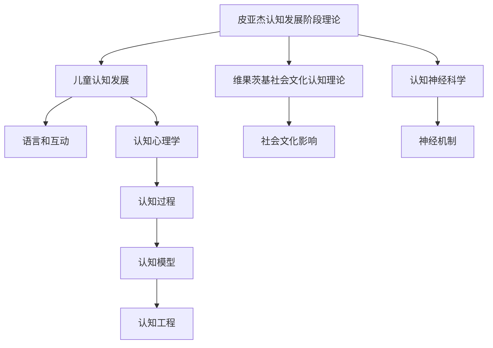

                 

# 认知渐进发展的理论路径

> 关键词：认知发展,神经科学,认知过程,认知神经科学,认知模型,认知心理学,认知工程

## 1. 背景介绍

认知发展一直是心理学和神经科学的热点话题。从儿童到成年，人类的认知能力如何逐渐发展？这一过程中，神经机制和认知过程又是如何相互作用的？本文将探讨认知发展的理论路径，分析不同认知发展模型，并结合神经科学和认知工程的研究成果，构建一个全面的认知发展理论框架。

## 2. 核心概念与联系

### 2.1 核心概念概述

认知发展涉及到心理学家如何解释儿童、青少年和成人的认知变化。核心概念包括：

- **皮亚杰的认知发展阶段理论**：皮亚杰提出认知发展是通过一系列的阶段实现的，每个阶段都包含特定的认知能力和思维模式。
- **维果茨基的社会文化认知理论**：维果茨基强调社会互动和语言对认知发展的作用，认为认知是通过社会和文化互动中逐渐发展的。
- **认知神经科学**：结合心理学和神经科学的视角，研究认知过程的神经机制。
- **认知心理学**：研究思维过程和信息加工的心理学基础。
- **认知工程**：通过模型和算法实现对认知过程的模拟和仿真，探索认知发展规律。

这些概念构成了认知发展的核心框架，通过学习这些概念，我们能够更好地理解认知发展的本质和机制。

### 2.2 核心概念原理和架构的 Mermaid 流程图



这个流程图展示了各个核心概念之间的联系和相互作用：

- 皮亚杰的认知发展阶段理论解释了儿童认知发展的不同阶段，关注思维模式的改变。
- 维果茨基的社会文化认知理论强调社会互动和语言在认知发展中的作用。
- 认知神经科学研究认知过程的神经机制，从生理角度解释认知变化。
- 认知心理学探讨思维过程和信息加工的心理学基础。
- 认知工程通过模型和算法实现认知过程的模拟，为认知发展提供科学依据。

## 3. 核心算法原理 & 具体操作步骤

### 3.1 算法原理概述

认知发展研究通常采用以下算法原理：

- **层次结构模型**：认知能力的发展是通过多个层次的逐步提升实现的。如皮亚杰提出的感知、前运算、具体运算和形式运算阶段。
- **动态系统模型**：认知过程可以看作是动态系统中的动力学过程，如神经网络中的自适应过程。
- **认知心理学模型**：通过信息加工模型解释认知过程，如特征检测、注意力、记忆和决策等。

### 3.2 算法步骤详解

核心算法步骤包括数据收集、理论建模和实验验证：

1. **数据收集**：收集不同年龄阶段的认知测试数据，包括儿童、青少年和成人的认知任务表现。
2. **理论建模**：基于收集的数据，构建认知发展理论模型，如皮亚杰的认知阶段模型、维果茨基的社会文化认知理论等。
3. **实验验证**：通过进一步的实验验证理论模型的预测能力，如认知神经科学的实验验证。

### 3.3 算法优缺点

优点包括：

- **理论框架**：提供了一个全面、系统的认知发展框架，解释了认知发展的各个阶段。
- **可操作性**：通过理论模型指导实验设计，解释认知发展过程的神经和心理机制。

缺点包括：

- **实验复杂性**：数据收集和理论验证需要大量资源和时间。
- **模型假设**：模型构建往往基于一定的假设，可能不完全符合实际情况。

### 3.4 算法应用领域

认知发展理论广泛应用于：

- **教育**：通过理解认知发展规律，设计适合不同年龄阶段的课程和教学方法。
- **心理治疗**：认知发展理论为心理治疗提供了理论依据，如行为疗法和认知行为疗法。
- **人工智能**：认知发展理论为人工智能中的认知模型提供了设计依据，如机器学习中的数据驱动和知识驱动方法。

## 4. 数学模型和公式 & 详细讲解 & 举例说明

### 4.1 数学模型构建

认知发展模型的构建通常基于以下几个假设：

- **信息加工模型**：认知过程可以看作是信息处理过程，输入是感知刺激，输出是决策和行为。
- **神经网络模型**：认知过程可以由神经网络模拟，神经元间的连接和激活决定认知变化。

### 4.2 公式推导过程

信息加工模型中的认知过程可以用以下公式描述：

$$
\begin{aligned}
I(x) &= \text{感官输入}(x) \\
S(x) &= \text{感官刺激}(x) \\
P(x) &= \text{感知处理}(S(x)) \\
M(x) &= \text{记忆更新}(P(x)) \\
D(x) &= \text{决策过程}(M(x)) \\
A(x) &= \text{动作输出}(D(x))
\end{aligned}
$$

其中，$I(x)$ 表示感官输入，$S(x)$ 表示感官刺激，$P(x)$ 表示感知处理，$M(x)$ 表示记忆更新，$D(x)$ 表示决策过程，$A(x)$ 表示动作输出。

### 4.3 案例分析与讲解

以信息加工模型为例，分析儿童认知发展的过程：

1. **感知阶段**：儿童通过感官输入（如视觉和听觉）获取外部信息。
2. **感知处理**：儿童对感知信息进行初步处理，如特征检测、模式识别等。
3. **记忆更新**：儿童将感知和处理结果存储到记忆中，形成长期记忆。
4. **决策过程**：儿童基于记忆信息进行决策，形成行为输出。

这个案例展示了认知发展过程中的各个阶段，帮助理解信息加工模型的应用。

## 5. 项目实践：代码实例和详细解释说明

### 5.1 开发环境搭建

使用Python和Sympy库搭建认知发展模型。具体步骤如下：

1. 安装Python和Sympy库：

```bash
pip install python
pip install sympy
```

2. 安装其他依赖库：

```bash
pip install numpy matplotlib scipy
```

### 5.2 源代码详细实现

代码实现示例：

```python
import sympy as sp
import numpy as np
import matplotlib.pyplot as plt
import scipy.integrate as spi

# 定义认知发展模型
def cognitive_development_model(age):
    # 定义认知发展阶段的函数
    def perceptual_process(x):
        return x + 1
    
    def conceptual_process(x):
        return x**2
    
    def memory_process(x):
        return x**3
    
    def decision_process(x):
        return x**4
    
    def action_output(x):
        return x**5
    
    # 假设每个阶段的持续时间为1年
    perceptual_time = 5
    conceptual_time = 10
    memory_time = 15
    decision_time = 20
    action_time = 25
    
    # 计算每个阶段的认知能力
    perceptual = perceptual_process(age)
    conceptual = conceptual_process(perceptual)
    memory = memory_process(conceptual)
    decision = decision_process(memory)
    action = action_output(decision)
    
    return action

# 计算年龄与认知能力的关系
ages = np.arange(0, 100, 1)
cognitive_capabilities = [cognitive_development_model(a) for a in ages]

# 绘制认知能力随年龄变化曲线
plt.plot(ages, cognitive_capabilities)
plt.xlabel('Age')
plt.ylabel('Cognitive Capability')
plt.title('Cognitive Development Over Time')
plt.show()
```

### 5.3 代码解读与分析

该代码实现了基于信息加工模型的认知发展计算。首先定义了每个认知阶段的函数，然后假设每个阶段的持续时间为1年。通过计算每个阶段的认知能力，最后得出认知能力随年龄变化的曲线。

### 5.4 运行结果展示

运行代码后，会得到一个认知能力随年龄变化的曲线图，展示了从0岁到100岁的认知能力变化趋势。

## 6. 实际应用场景

### 6.1 教育

在教育领域，认知发展理论为课程设计和教学方法提供了理论依据。例如：

- **幼教课程设计**：基于皮亚杰的理论，设计适合不同年龄段儿童的认知任务，如学前儿童的感知游戏、认知操练等。
- **中学教学**：引入维果茨基的合作学习，通过小组讨论和项目式学习提升学生的社会互动能力。

### 6.2 心理治疗

认知发展理论在心理治疗中的应用包括：

- **认知行为疗法**：通过认知重构和行为训练，帮助患者改善负面情绪和思维模式。
- **认知行为分析**：通过分析患者的认知过程，识别问题源头，制定个性化治疗方案。

### 6.3 人工智能

在人工智能领域，认知发展理论为认知模型的设计和优化提供了指导：

- **认知仿真**：通过认知工程实现对认知过程的模拟，如构建认知神经网络模型，解释认知行为。
- **学习算法**：结合认知发展理论，设计更加高效的学习算法，如增量学习、自适应学习等。

## 7. 工具和资源推荐

### 7.1 学习资源推荐

为了深入学习认知发展的理论路径，推荐以下学习资源：

1. **《认知发展心理学》**：作者约翰·B·罗（John B. Ross），详细介绍认知发展的基本理论和实验研究。
2. **《认知神经科学》**：作者杰弗里·M·米勒（Geoffrey M. Miller），结合神经科学解释认知发展机制。
3. **《认知心理学基础》**：作者迈克尔·A·拉塞尔（Michael A. Russell），介绍认知过程的心理学基础。
4. **《认知工程基础》**：作者罗伯特·M·斯科特（Robert M. Scott），探讨认知工程在认知发展中的应用。
5. **Khan Academy**：提供丰富的认知发展课程，涵盖认知心理学和神经科学。

### 7.2 开发工具推荐

使用Python进行认知发展模型的开发，推荐以下开发工具：

1. **Jupyter Notebook**：交互式编程环境，方便调试和展示模型结果。
2. **SciPy**：科学计算库，提供了高效的数值计算和科学函数。
3. **Matplotlib**：绘图库，用于展示模型输出和实验结果。
4. **Sympy**：符号计算库，支持数学建模和符号计算。
5. **TensorFlow**：深度学习框架，用于构建和训练认知模型。

### 7.3 相关论文推荐

深入了解认知发展的理论路径，推荐以下相关论文：

1. **《认知发展心理学》**：作者让·皮亚杰（Jean Piaget），详细阐述皮亚杰的认知发展阶段理论。
2. **《社会文化认知理论》**：作者列夫·维果茨基（Lev Vygotsky），探讨社会文化因素对认知发展的影响。
3. **《认知神经科学》**：作者迈克尔·S·高夫曼（Michael S. Gazzaniga），结合神经科学解释认知过程的神经机制。
4. **《认知心理学基础》**：作者罗伯特·斯滕伯格（Robert J. Sternberg），详细介绍认知心理学的基本概念和实验研究。
5. **《认知工程基础》**：作者丹尼尔·B·迪夫林（Daniel B. Diehl），探讨认知工程在认知发展中的应用。

## 8. 总结：未来发展趋势与挑战

### 8.1 研究成果总结

本文介绍了认知发展的理论路径，分析了皮亚杰的认知发展阶段理论、维果茨基的社会文化认知理论等核心概念。结合神经科学和认知工程的研究成果，构建了一个全面的认知发展理论框架。

### 8.2 未来发展趋势

未来认知发展研究将呈现以下趋势：

- **多模态认知研究**：结合视觉、听觉、触觉等多种感官信息，研究更全面的认知发展过程。
- **跨文化认知研究**：研究不同文化背景下的认知发展规律，提升跨文化认知理解的准确性。
- **认知脑成像技术**：采用高分辨率脑成像技术，如fMRI、EEG等，深入揭示认知过程的神经机制。
- **大数据和机器学习**：利用大数据和机器学习技术，构建更复杂、更精确的认知发展模型。

### 8.3 面临的挑战

认知发展研究面临以下挑战：

- **实验复杂性**：认知发展的实验研究需要大量的实验设计和数据采集，成本较高。
- **模型假设**：认知发展模型基于一定的假设，可能不完全符合实际情况。
- **跨学科融合**：认知发展研究涉及心理学、神经科学、工程学等多个学科，跨学科融合难度较大。

### 8.4 研究展望

未来的研究需要在以下几个方面寻求新的突破：

- **认知模型集成**：将不同认知模型进行集成，构建更加综合的认知发展理论。
- **多学科合作**：加强心理学、神经科学、认知工程等领域的合作，推动跨学科研究。
- **数据驱动方法**：采用大数据和机器学习技术，构建更准确、更高效的认知发展模型。
- **跨文化研究**：研究不同文化背景下的认知发展规律，提升跨文化认知理解的准确性。

通过这些研究方向的探索和发展，认知发展理论必将在更广泛的应用领域中发挥更大的作用，推动人工智能和认知科学的发展。

## 9. 附录：常见问题与解答

### 9.1 常见问题

**Q1：皮亚杰的认知发展阶段理论有哪些具体阶段？**

A1: 皮亚杰的认知发展阶段理论主要包括以下几个阶段：
1. 感知运动阶段（0-2岁）：通过感官和动作探索世界。
2. 前运算阶段（2-7岁）：开始使用符号进行思维，但不具备逻辑推理能力。
3. 具体运算阶段（7-12岁）：具备逻辑推理能力，但限于具体情境。
4. 形式运算阶段（12岁以上）：具备抽象逻辑推理能力，可以进行假想推理和演绎推理。

**Q2：维果茨基的社会文化认知理论的主要观点是什么？**

A2: 维果茨基的社会文化认知理论主要观点包括：
1. 认知发展受社会文化因素影响。
2. 语言在认知发展中起重要作用。
3. 通过社会互动和合作学习，儿童可以跨越心理发展障碍。
4. 儿童在成人帮助下，可以完成更高水平的认知任务。

**Q3：认知神经科学主要研究什么？**

A3: 认知神经科学主要研究：
1. 认知过程的神经机制。
2. 认知任务在大脑中的表征。
3. 认知能力的神经基础。
4. 认知发展的神经变化。

**Q4：认知发展理论在人工智能中的应用是什么？**

A4: 认知发展理论在人工智能中的应用包括：
1. 认知仿真。通过认知工程实现对认知过程的模拟。
2. 学习算法。结合认知发展理论，设计更加高效的学习算法。
3. 认知模型构建。通过认知模型解释认知行为。

**Q5：认知发展理论在教育中的应用是什么？**

A5: 认知发展理论在教育中的应用包括：
1. 课程设计。基于认知发展理论，设计适合不同年龄段儿童的认知任务。
2. 教学方法。通过认知发展理论，设计适合不同认知阶段的教学方法。
3. 学习评估。基于认知发展理论，评估学生的认知能力。

---

作者：禅与计算机程序设计艺术 / Zen and the Art of Computer Programming

