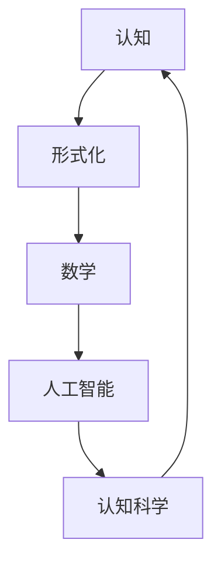

                 

# 认知的形式化：宇宙应该是数学的“皇帝”

## 1. 背景介绍

### 1.1 问题由来

> 在面对复杂的自然现象和宇宙本质时，人类历史上的哲学家和科学家们一直在探寻能够描述和解释这些现象的原理和方法。在现代科学中，一个核心的观念是宇宙的运作方式可以由数学语言来描述，并且这种描述可以是精确和统一的。

> 近年来，随着人工智能（AI）和机器学习（ML）技术的迅猛发展，特别是深度学习模型在图像识别、自然语言处理和语音识别等领域取得的突破性进展，认知科学和计算认知等领域也得到了广泛关注。深度学习和神经网络的模型被视为对人类大脑的某种形式化的模拟，其在各个领域的广泛应用引发了深入思考：认知的形式化是否应该以数学作为其核心框架？

## 2. 核心概念与联系

### 2.1 核心概念概述

> 1. **认知**：指对信息处理、感知、学习、记忆、思维等心理活动进行描述和分析。
> 
> 2. **形式化**：将复杂的认知过程用数学模型或逻辑框架进行精确表达和分析。
> 
> 3. **数学**：作为一门精确的科学，数学能够描述客观世界的各种现象和关系。
> 
> 4. **人工智能与认知科学**：结合计算技术对认知过程进行建模和模拟。

### 2.2 核心概念原理和架构的 Mermaid 流程图



这个流程图展示了认知、形式化、数学、人工智能和认知科学之间的关系，其中认知作为起点，通过形式化和数学工具，在人工智能和认知科学的推动下不断深化和扩展。

## 3. 核心算法原理 & 具体操作步骤

### 3.1 算法原理概述

> 认知的形式化通常涉及将认知过程抽象为数学模型，并使用算法来模拟和分析这些模型。在深度学习领域，这种形式化表现为用神经网络模型来描述和模拟人脑的认知过程。

### 3.2 算法步骤详解

1. **模型构建**：选择适当的神经网络架构，如卷积神经网络（CNN）、递归神经网络（RNN）、长短时记忆网络（LSTM）等，根据认知任务的特性进行设计。

2. **数据准备**：收集和准备与认知任务相关的数据，通常包括图像、文本、音频等多种形式的数据。

3. **模型训练**：使用大规模数据集对模型进行训练，通过反向传播算法调整模型参数，使其能够准确预测或分类输入数据。

4. **模型评估**：使用验证集或测试集对训练好的模型进行评估，通过指标如准确率、召回率、F1分数等评估模型性能。

5. **模型优化**：根据评估结果，调整模型结构或参数，如增加或减少网络层数、调整学习率、引入正则化等，以提高模型性能。

6. **实际应用**：将优化后的模型应用到实际问题中，如图像识别、语音识别、自然语言处理等。

### 3.3 算法优缺点

**优点**：
- 能够处理大规模的数据集和复杂的认知任务。
- 通过数学和算法工具可以精确分析和优化认知过程。
- 人工智能技术的发展促进了认知科学的研究。

**缺点**：
- 模型复杂，难以解释和理解其内部机制。
- 需要大量的数据和计算资源进行训练。
- 可能存在过拟合问题，导致模型泛化性能差。

### 3.4 算法应用领域

> 当前，基于数学形式化的认知模型已经广泛应用于以下领域：

1. **计算机视觉**：图像识别、目标检测、人脸识别等。
2. **自然语言处理**：机器翻译、文本分类、情感分析等。
3. **语音识别**：语音识别、语音合成、语音情感分析等。
4. **机器人学**：机器人视觉、机器人语音、机器人认知等。
5. **医疗诊断**：医学影像分析、病理诊断、药物发现等。

## 4. 数学模型和公式 & 详细讲解 & 举例说明

### 4.1 数学模型构建

> 以图像识别为例，一个基本的神经网络模型包括输入层、隐藏层和输出层。输入层接收图像数据，隐藏层进行特征提取和特征映射，输出层产生预测结果。

### 4.2 公式推导过程

> 以卷积神经网络（CNN）为例，输入数据 $x$ 通过一系列卷积层 $f_\theta(x)$ 和池化层 $g_\theta(x)$ 得到特征映射 $h_\theta(x)$，再通过全连接层 $f_\theta(x)$ 和 softmax 函数输出预测概率分布 $y$。
> 
> \[
> y = \text{softmax}(f_\theta(g_\theta(f_\theta(x))))
> \]

### 4.3 案例分析与讲解

> 以自然语言处理中的情感分析为例，模型接收一段文本作为输入，通过嵌入层将文本转换为向量表示，再经过一个或多个循环层进行特征提取，最后通过全连接层输出情感分类结果。
> 
> \[
> \text{emb} = \text{embedding}(x)
> \]
> 
> \[
> \text{hidden} = \text{LSTM}(\text{emb})
> \]
> 
> \[
> y = \text{softmax}(f_\theta(\text{hidden}))
> \]

## 5. 项目实践：代码实例和详细解释说明

### 5.1 开发环境搭建

> 以下是一个简单的 Python 开发环境搭建过程：

1. 安装 Anaconda，创建虚拟环境。
2. 安装 TensorFlow 和 Keras。
3. 准备数据集，如 MNIST 手写数字识别数据集。
4. 编写代码，包括模型定义、数据加载、训练、评估等步骤。

### 5.2 源代码详细实现

> 以下是一个简单的 TensorFlow 图像识别模型的 Python 代码实现：

```python
import tensorflow as tf
from tensorflow.keras import layers

# 定义模型
model = tf.keras.Sequential([
    layers.Conv2D(32, (3, 3), activation='relu', input_shape=(28, 28, 1)),
    layers.MaxPooling2D((2, 2)),
    layers.Conv2D(64, (3, 3), activation='relu'),
    layers.MaxPooling2D((2, 2)),
    layers.Flatten(),
    layers.Dense(64, activation='relu'),
    layers.Dense(10, activation='softmax')
])

# 编译模型
model.compile(optimizer='adam',
              loss='sparse_categorical_crossentropy',
              metrics=['accuracy'])

# 加载数据集
(x_train, y_train), (x_test, y_test) = tf.keras.datasets.mnist.load_data()
x_train = x_train.reshape((60000, 28, 28, 1))
x_train = x_train / 255.0
x_test = x_test.reshape((10000, 28, 28, 1))
x_test = x_test / 255.0

# 训练模型
model.fit(x_train, y_train, epochs=5, batch_size=64, validation_data=(x_test, y_test))
```

### 5.3 代码解读与分析

> 以上代码实现了一个简单的卷积神经网络模型，用于识别 MNIST 数据集中的手写数字。模型包括两个卷积层、两个池化层和两个全连接层。编译模型时选择了 Adam 优化器和交叉熵损失函数。训练过程中，数据被归一化处理，训练了 5 个 epoch，并使用验证集评估模型性能。

## 6. 实际应用场景

### 6.1 智能机器人

> 在智能机器人领域，形式化的认知模型可以帮助机器人进行环境感知、物体识别和行为规划等。例如，通过深度学习模型对传感器数据进行处理，可以训练机器人识别和定位环境中的物体，从而进行自主导航和操作。

### 6.2 医学影像分析

> 在医学影像分析中，形式化的认知模型可以帮助医生进行疾病诊断和病理分析。例如，通过卷积神经网络模型对医学影像进行特征提取和分类，可以识别出肿瘤、病变等异常结构，提供辅助诊断。

### 6.3 自动驾驶

> 在自动驾驶领域，形式化的认知模型可以帮助车辆进行环境感知和决策制定。例如，通过深度学习模型对摄像头和雷达数据进行处理，可以训练车辆识别交通标志、行人、车辆等，从而进行安全驾驶。

### 6.4 未来应用展望

> 随着计算技术的进步，形式化的认知模型将广泛应用于更多领域。未来可能包括：

1. **智能家居**：通过认知模型对语音、视觉数据进行处理，实现家庭自动化控制和场景智能分析。
2. **金融分析**：通过认知模型对金融数据进行处理，进行风险评估、投资决策和欺诈检测。
3. **环境监测**：通过认知模型对环境数据进行处理，进行气候变化监测、环境污染评估等。

## 7. 工具和资源推荐

### 7.1 学习资源推荐

> 以下是一些推荐的学习资源，帮助理解认知形式化的原理和应用：

1. 《深度学习》书籍：Ian Goodfellow 等著，全面介绍了深度学习的基本概念和应用。
2. 《计算认知科学》书籍：Dean Burnett 等著，介绍了认知科学和计算认知的基本理论和方法。
3. Coursera 和 edX 等在线课程：提供深度学习和认知科学的课程，涵盖从基础到高级的知识点。

### 7.2 开发工具推荐

> 以下是一些推荐的工具，帮助开发和优化形式化的认知模型：

1. TensorFlow 和 PyTorch：深度学习框架，支持多种神经网络模型的构建和训练。
2. Keras：高级神经网络 API，提供了简单易用的接口和丰富的功能。
3. Scikit-learn：机器学习库，提供了各种常用的模型和工具。

### 7.3 相关论文推荐

> 以下是一些推荐的相关论文，帮助深入理解认知形式化的理论和技术：

1. "Deep Learning" by Ian Goodfellow, Yoshua Bengio, and Aaron Courville。
2. "Human Visual Perception and the Machine Vision Revolution" by David Marr。
3. "The Computational Machinery of Cognition" by Marvin Minsky 和 Seymour Papert。

## 8. 总结：未来发展趋势与挑战

### 8.1 研究成果总结

> 形式化的认知模型在深度学习领域取得了重要进展，并在多个实际应用中展现了强大的能力。其研究范围涵盖了计算机视觉、自然语言处理、语音识别等领域，推动了认知科学的发展。

### 8.2 未来发展趋势

> 未来，形式化的认知模型将向以下几个方向发展：

1. **多模态认知模型**：结合视觉、听觉、触觉等多种感官数据，实现更全面、准确的环境感知。
2. **认知推理**：结合因果推断、知识图谱等工具，增强模型的推理能力和泛化能力。
3. **认知计算**：结合认知科学和计算技术，实现更加智能和自主的认知过程。

### 8.3 面临的挑战

> 形式化的认知模型面临以下挑战：

1. **数据需求**：需要大量的标注数据进行训练，数据的获取和标注成本较高。
2. **模型复杂性**：模型结构和参数量较大，训练和推理效率较低。
3. **泛化能力**：模型在特定场景下可能表现良好，但在新场景下泛化能力较弱。
4. **解释性**：模型的内部机制难以解释，难以理解和调试。
5. **伦理和安全**：模型可能存在偏见和误导，需要考虑伦理和安全问题。

### 8.4 研究展望

> 为了应对这些挑战，未来的研究可以从以下几个方向进行：

1. **无监督学习**：减少对标注数据的依赖，利用自监督学习提高模型的泛化能力。
2. **模型压缩**：使用知识蒸馏、剪枝等技术，减小模型规模，提高训练和推理效率。
3. **可解释性**：结合符号化方法，增强模型的解释性和可理解性。
4. **伦理和安全**：引入伦理导向的评估指标，建立模型的监管机制，确保模型输出符合伦理和安全标准。

## 9. 附录：常见问题与解答

**Q1: 什么是认知的形式化？**

A: 认知的形式化是指将复杂的认知过程通过数学模型和算法进行精确描述和分析。

**Q2: 形式化的认知模型是否适用于所有认知任务？**

A: 形式化的认知模型适用于许多认知任务，但在处理复杂的、非结构化的认知过程时可能存在局限性。

**Q3: 如何选择合适的深度学习框架进行认知建模？**

A: 选择合适的深度学习框架需要考虑模型的复杂度、计算资源和应用场景。常见的框架包括 TensorFlow、PyTorch、Keras 等。

**Q4: 如何提高形式化认知模型的泛化能力？**

A: 提高泛化能力的方法包括：增加数据量、使用数据增强、引入正则化、模型集成等。

**Q5: 如何解释形式化的认知模型？**

A: 模型解释的方法包括：可视化模型内部的激活图、使用符号化方法解释模型输出、使用可解释的模型结构等。

---

作者：禅与计算机程序设计艺术 / Zen and the Art of Computer Programming

