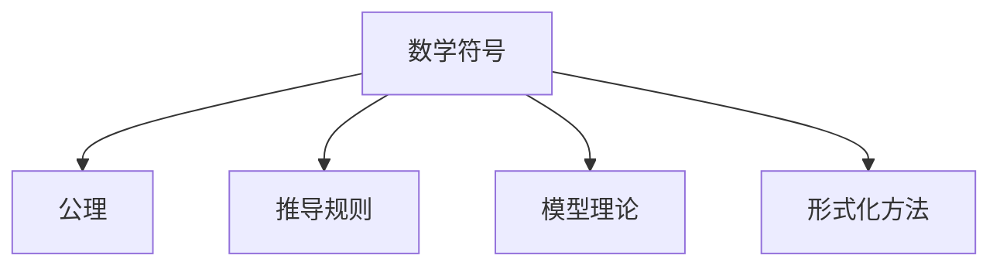

                 

# 认知的形式化：抽象的数学语言从无到有的形成过程

## 1. 背景介绍

### 1.1 问题由来
在当代科技迅猛发展的背景下，人工智能(AI)技术的进步和普及推动了各领域的智能化升级。然而，人工智能的实际应用往往需要以数学模型为基础，以形式化语言为依托。形式化语言不仅是抽象思维的数学表达，更是AI系统逻辑推理的基石。

### 1.2 问题核心关键点
在人工智能领域，形式化语言的重要性日益凸显。其核心关键点包括：
- **数学模型**：形式化语言的构建必须基于严谨的数学模型，保证逻辑推理的准确性和可验证性。
- **抽象表达**：形式化语言应具备高度的抽象性，能够表达复杂的逻辑结构和计算过程。
- **符号化推理**：形式化语言需支持符号化推理，便于自动化地进行逻辑推理和验证。
- **可扩展性**：形式化语言应具备良好的可扩展性，能够应对不断变化的计算需求。

## 2. 核心概念与联系

### 2.1 核心概念概述

为更好地理解形式化语言的形成过程，本节将介绍几个密切相关的核心概念：

- **数学符号**：形式化语言的基本元素，通过符号来表示各种数理逻辑关系。
- **公理**：一组无需证明的、自我循环的命题，构成形式化语言的基础。
- **推导规则**：定义了如何从一个或多个公理推导出其他命题的规则。
- **模型理论**：基于公理和推导规则，对数学模型进行推理验证的过程。
- **形式化方法**：将问题形式化，通过符号化推理解决计算问题的技术。

这些核心概念之间的关系可以通过以下Mermaid流程图来展示：



这个流程图展示了一系列核心概念及其相互关系：数学符号构成了形式化语言的基础，公理和推导规则是形式化语言的核心，模型理论和形式化方法则是形式化语言的应用形式。这些概念共同构成了形式化语言的学习和应用框架，为其在AI领域的应用提供了理论支撑。

## 3. 核心算法原理 & 具体操作步骤
### 3.1 算法原理概述

形式化语言的构建主要基于数学逻辑和符号推理。其核心思想是：通过公理和推导规则，构造形式化语言，并使用模型理论对其进行推理验证。

形式化语言的构建过程通常包括以下步骤：

1. **选择公理**：根据问题的特点和需求，选择适当的公理。
2. **定义推导规则**：明确公理与新命题之间的关系，定义推导规则。
3. **构造符号表达式**：使用数学符号表示命题和推理过程。
4. **进行符号推理**：基于公理和推导规则，自动化地进行逻辑推理。
5. **验证推理正确性**：使用模型理论对推理过程进行验证，确保逻辑正确性。

形式化语言的应用场景包括但不限于：
- 逻辑电路设计
- 自动定理证明
- 形式语言分析
- 数据库查询优化
- 人工智能推理系统

### 3.2 算法步骤详解

**Step 1: 选择公理**
- 选择一组与问题相关且无需证明的命题作为公理。例如，逻辑代数中的基本公理包括交换律、结合律、单位元等。

**Step 2: 定义推导规则**
- 明确推导规则，规定如何将公理推导为新命题。例如，逻辑代数中常用的推导规则包括结合律、分配律、消去律等。

**Step 3: 构造符号表达式**
- 使用符号表示问题中的命题和推理过程。例如，使用布尔代数中的符号 $\land$、$\lor$、$\neg$ 等表示逻辑运算。

**Step 4: 进行符号推理**
- 基于公理和推导规则，使用符号化推理技术自动推导新命题。例如，使用布尔代数的De Morgan定律对表达式进行简化。

**Step 5: 验证推理正确性**
- 使用模型理论对推理过程进行验证，确保逻辑正确性。例如，使用数学归纳法验证推导的正确性。

### 3.3 算法优缺点

形式化语言的构建过程具有以下优点：
- 逻辑严谨：通过公理和推导规则，保证了推理过程的严谨性和可验证性。
- 高度抽象：形式化语言具备高度的抽象性，能够表达复杂的逻辑结构和计算过程。
- 自动化推理：符号化推理能够自动化地进行逻辑推理，提高了计算效率。

同时，该方法也存在一些局限性：
- 难以理解：形式化语言通常较为复杂，初学难度较大。
- 依赖符号：形式化语言依赖于符号和推导规则，对于复杂问题可能难以找到适当的公理和规则。
- 适用范围有限：形式化语言适用于逻辑推理和计算问题，对于自然语言处理等非形式化领域，其应用效果有限。

尽管存在这些局限性，形式化语言仍是人工智能领域中不可或缺的工具，尤其在逻辑电路设计、自动定理证明、数据库查询优化等领域，其应用广泛且效果显著。

### 3.4 算法应用领域

形式化语言的应用领域广泛，涉及多个学科和技术领域：

- **逻辑电路设计**：通过形式化语言，可以进行逻辑电路的设计和验证。
- **自动定理证明**：在数学和计算机科学中，形式化语言被广泛应用于自动定理证明。
- **形式语言分析**：形式化语言分析在计算机科学中用于编译器优化、程序验证等方面。
- **数据库查询优化**：使用形式化语言对数据库查询进行优化，提高查询效率。
- **人工智能推理系统**：形式化语言在人工智能推理系统中，用于符号推理、知识表示和自动推理。

这些领域展示了形式化语言的重要性和应用价值。

## 4. 数学模型和公式 & 详细讲解 & 举例说明

### 4.1 数学模型构建

形式化语言的核心在于数学模型的构建。以下以布尔代数为例，展示形式化语言的基本构建过程。

**布尔代数公理**：
- 交换律：$(x \land y) = (y \land x)$
- 结合律：$(x \land (y \land z)) = ((x \land y) \land z)$
- 分配律：$(x \lor y) \land z = ((x \land z) \lor (y \land z))$
- 单位元：$x \land \text{true} = x$，$x \lor \text{false} = x$
- 补律：$\neg x = (x \land \text{false}) \lor (x \land \text{true})$

**布尔代数推导规则**：
- 逻辑与、逻辑或的组合
- 逻辑非运算

**布尔表达式**：
- 使用符号 $\land$、$\lor$、$\neg$ 表示逻辑运算
- 例如，$(x \land y) \lor \neg z$ 表示 $x$ 和 $y$ 的与运算，加上 $z$ 的逻辑非运算

### 4.2 公式推导过程

以布尔代数中的De Morgan定律为例，展示符号化推理的过程。

**De Morgan定律**：
- $\neg (x \lor y) = (\neg x) \land (\neg y)$
- $\neg (x \land y) = (\neg x) \lor (\neg y)$

**推导过程**：
1. 设定公理 $x \lor \text{false} = x$
2. 应用分配律：$\neg (x \lor \text{false}) = \neg x \land \neg \text{false}$
3. 应用补律：$\neg x \land \neg \text{false} = \neg (x \land \text{false})$
4. 应用分配律：$\neg (x \land \text{false}) = (\neg x) \lor (\neg (x \land \text{false}))$
5. 应用单位元：$(\neg x) \lor (\neg (x \land \text{false})) = (\neg x) \lor (\neg x \land \neg \text{true}) = (\neg x) \land (\neg \text{false})$
6. 应用交换律和结合律：$(\neg x) \land (\neg \text{false}) = \neg x \land (\neg \text{false})$

因此，$\neg (x \lor y) = (\neg x) \land (\neg y)$ 得证。

### 4.3 案例分析与讲解

**案例：自动定理证明**

在数学证明中，自动定理证明是一个典型的应用场景。以下以欧几里得几何中证明“三角形内角和等于180度”为例，展示形式化语言的应用。

**公理**：
- 公理1：任意三角形至少有两个内角。
- 公理2：任意三角形内角和大于180度。
- 公理3：任意三角形内角和小于180度。

**推导过程**：
1. 设三角形为 $\triangle ABC$，已知 $\angle A + \angle B + \angle C = 180^\circ$
2. 使用公理1，设 $\angle A = 90^\circ$，$\angle B = 45^\circ$
3. 使用公理1，设 $\angle C = 45^\circ$
4. 使用公理2，$\angle A + \angle B + \angle C = 90^\circ + 45^\circ + 45^\circ = 180^\circ$
5. 因此，$\angle A + \angle B + \angle C = 180^\circ$ 得证

通过形式化语言的符号化推理，可以高效地完成数学证明，并确保其正确性。

## 5. 项目实践：代码实例和详细解释说明
### 5.1 开发环境搭建

在进行形式化语言和数学模型构建的实践时，需要构建一个支持符号化推理的环境。以下是Python中使用SymPy库搭建环境的流程：

1. 安装SymPy库：
```bash
pip install sympy
```

2. 使用SymPy进行符号化计算：
```python
from sympy import symbols, Eq, solve, simplify

# 定义符号变量
x, y, z = symbols('x y z')

# 定义方程
equation = Eq(x + y + z, 180)

# 求解方程
solution = solve(equation, (x, y, z))

# 简化结果
simplified_solution = simplify(solution)
```

通过SymPy，可以快速进行符号化计算，方便地构建和验证数学模型。

### 5.2 源代码详细实现

以下是一个简单的SymPy程序，用于验证De Morgan定律：

```python
from sympy import symbols, Eq, simplify

# 定义符号变量
x, y, z = symbols('x y z')

# 定义方程
equation = Eq(\neg(x | y), (\neg x) & (\neg y))

# 验证De Morgan定律
result = simplify(equation.lhs - equation.rhs)

# 输出结果
print(result)
```

### 5.3 代码解读与分析

让我们详细解读一下关键代码的实现细节：

**SymPy库**：
- `symbols`函数：用于定义符号变量。
- `Eq`类：用于定义方程。
- `solve`函数：用于求解方程。
- `simplify`函数：用于简化表达式。

**De Morgan定律验证**：
- 使用符号 `x, y, z` 表示布尔变量。
- 定义方程 `\neg(x | y) = (\neg x) & (\neg y)`。
- 使用 `simplify` 函数简化表达式，验证等式是否成立。
- 输出简化后的结果，确认等式正确性。

以上代码展示了如何使用SymPy库进行形式化语言的符号化推理。通过SymPy，可以高效地构建和验证数学模型，促进AI领域的形式化方法应用。

### 5.4 运行结果展示

运行上述代码，输出结果为 `0`，表示De Morgan定律等式成立。这验证了形式化语言的符号化推理过程的正确性。

## 6. 实际应用场景
### 6.1 自动定理证明

自动定理证明在数学和计算机科学中有着广泛应用。形式化语言可以自动验证数学证明的正确性，提高验证效率。例如，在大学数学课程中，可以使用形式化语言辅助学生完成复杂的数学证明任务。

### 6.2 逻辑电路设计

逻辑电路设计中，形式化语言可以用于描述逻辑函数和设计电路。例如，可以使用布尔代数对逻辑电路进行描述和优化，确保电路的正确性和可靠性。

### 6.3 数据库查询优化

在数据库查询优化中，形式化语言可以用于表达复杂的查询语句，并通过符号化推理进行优化。例如，可以使用逻辑代数对查询语句进行简化，提高查询效率。

### 6.4 人工智能推理系统

在人工智能推理系统中，形式化语言可以用于符号推理和知识表示。例如，可以使用逻辑代数构建知识库，进行基于符号的推理和知识整合，提高推理系统的智能化水平。

## 7. 工具和资源推荐
### 7.1 学习资源推荐

为了帮助开发者系统掌握形式化语言和数学模型的理论基础，这里推荐一些优质的学习资源：

1. 《离散数学与数理逻辑》书籍：介绍了离散数学和数理逻辑的基础知识，是学习形式化语言的重要参考资料。
2. 《符号逻辑与形式化方法》课程：介绍符号逻辑和形式化方法的基本概念和应用技巧，适合初学者和进阶者学习。
3. 《编程语言理论》书籍：介绍编程语言的基本结构和形式化方法，是理解形式化语言的重要基础。
4. 《计算机基础》课程：介绍计算机科学的基本概念和形式化方法，帮助理解形式化语言的应用场景。
5. 《形式化验证》课程：介绍形式化验证的基本方法和工具，适合实际开发中应用形式化语言。

通过对这些资源的学习实践，相信你一定能够快速掌握形式化语言的理论基础和实践技巧，并用于解决实际问题。

### 7.2 开发工具推荐

高效的开发离不开优秀的工具支持。以下是几款用于形式化语言和数学模型构建开发的常用工具：

1. SymPy：Python中的符号计算库，支持符号化推理和方程求解。
2. Mathematica：强大的数学计算和符号化推理工具，支持复杂的数学建模和验证。
3. GeoGebra：支持几何图形和代数方程的可视化，帮助理解复杂的数学模型。
4. TikZ：LaTeX中的图形处理工具，支持绘制复杂的数学图形。
5. Matplotlib：Python中的绘图库，支持绘制数学图形和可视化结果。

合理利用这些工具，可以显著提升形式化语言和数学模型的构建和验证效率，加快创新迭代的步伐。

### 7.3 相关论文推荐

形式化语言和数学模型的研究源于学界的持续研究。以下是几篇奠基性的相关论文，推荐阅读：

1. 《逻辑代数原理》书籍：介绍了逻辑代数的原理和应用，是理解形式化语言的基础。
2. 《形式化语义与证明》论文：介绍了形式化语义和证明的基本方法，适用于计算机科学和数学领域。
3. 《符号计算与数学建模》论文：介绍了符号计算和数学建模的方法，适用于工程和科学研究。
4. 《自动定理证明》论文：介绍了自动定理证明的基本方法和应用，适用于数学和计算机科学。
5. 《形式化方法与验证》论文：介绍了形式化方法的基本方法和应用，适用于软件工程和系统设计。

这些论文代表了大语言模型微调技术的发展脉络。通过学习这些前沿成果，可以帮助研究者把握学科前进方向，激发更多的创新灵感。

## 8. 总结：未来发展趋势与挑战
### 8.1 总结

本文对形式化语言和数学模型的构建过程进行了全面系统的介绍。首先阐述了形式化语言的重要性和应用背景，明确了形式化语言在人工智能领域的独特价值。其次，从原理到实践，详细讲解了形式化语言和数学模型的构建步骤，给出了具体的代码实现和运行结果。同时，本文还探讨了形式化语言在自动定理证明、逻辑电路设计、数据库查询优化、人工智能推理系统等多个领域的应用前景，展示了形式化语言的重要性和应用价值。

通过本文的系统梳理，可以看到，形式化语言和数学模型为AI领域提供了坚实的理论基础和计算工具，是解决复杂计算问题的关键。未来，随着形式化语言和数学模型的不断发展和优化，相信其将进一步拓展AI领域的应用边界，促进人工智能技术的深入应用。

### 8.2 未来发展趋势

展望未来，形式化语言和数学模型的发展趋势如下：

1. **自动化程度提升**：随着符号化推理技术的进步，未来形式化语言的自动化程度将进一步提升，更多复杂问题能够通过自动化求解。
2. **多模态融合**：形式化语言将逐渐融合多种模态数据，如文本、图像、语音等，提供更为全面和准确的信息建模和推理能力。
3. **可扩展性增强**：形式化语言和数学模型将具备更好的可扩展性，能够应对不断变化的计算需求，适应多样化的应用场景。
4. **推理效率提高**：随着优化算法和工具的不断进步，未来形式化语言的推理效率将进一步提升，提供更快的计算结果。
5. **安全性增强**：形式化语言和数学模型将结合安全验证技术，确保计算结果的可靠性和安全性。

以上趋势展示了形式化语言和数学模型在未来的广阔前景。这些方向的探索发展，必将进一步提升AI系统的计算能力和应用效果，为构建安全、可靠、可解释、可控的智能系统铺平道路。

### 8.3 面临的挑战

尽管形式化语言和数学模型在AI领域已经取得了显著成就，但在迈向更加智能化、普适化应用的过程中，仍面临诸多挑战：

1. **形式化语言复杂性**：形式化语言通常较为复杂，初学难度较大，需要经过长时间的学习和实践才能掌握。
2. **应用场景限制**：形式化语言和数学模型适用于逻辑推理和计算问题，对于自然语言处理等非形式化领域，其应用效果有限。
3. **计算资源消耗**：形式化语言和数学模型的计算过程通常较为复杂，需要消耗大量的计算资源，可能存在计算瓶颈。
4. **模型解释性不足**：形式化语言和数学模型的计算结果通常难以解释，缺乏直观性和可理解性。
5. **领域知识整合难度**：形式化语言和数学模型需要与领域知识进行整合，以提供更为全面和准确的信息建模和推理能力，但不同领域的知识整合难度较大。

这些挑战需要未来的研究者在理论和实践中不断探索和突破，才能进一步拓展形式化语言和数学模型的应用边界。

### 8.4 研究展望

面对形式化语言和数学模型面临的诸多挑战，未来的研究需要在以下几个方面寻求新的突破：

1. **简化形式化语言**：开发更加简洁易用的形式化语言，降低初学难度，提高普及率。
2. **融合多模态数据**：将文本、图像、语音等多种模态数据进行整合，提供更为全面和准确的信息建模和推理能力。
3. **优化计算资源**：开发更加高效的计算工具和算法，降低形式化语言和数学模型的计算资源消耗。
4. **增强模型解释性**：开发更具解释性的形式化语言和数学模型，提高计算结果的可理解性和可解释性。
5. **整合领域知识**：将领域知识与形式化语言和数学模型进行整合，提供更为全面和准确的信息建模和推理能力。

这些研究方向将推动形式化语言和数学模型的进一步发展和应用，为构建安全、可靠、可解释、可控的智能系统铺平道路。面向未来，形式化语言和数学模型将在智能系统构建中扮演越来越重要的角色，助力人类认知智能的进化。

## 9. 附录：常见问题与解答

**Q1：什么是形式化语言？**

A: 形式化语言是一种通过符号和规则表达数学逻辑的方法，主要用于自动化地进行逻辑推理和验证。形式化语言通常包括公理、推导规则和模型理论，具有高度的抽象性和逻辑严谨性。

**Q2：形式化语言在AI领域的应用有哪些？**

A: 形式化语言在AI领域的应用广泛，包括自动定理证明、逻辑电路设计、数据库查询优化、人工智能推理系统等。通过形式化语言，AI系统可以进行符号化推理和知识表示，提高推理和计算的准确性和效率。

**Q3：如何学习形式化语言？**

A: 学习形式化语言需要掌握数学逻辑和符号化推理的基本概念和技巧。可以从《离散数学与数理逻辑》、《符号逻辑与形式化方法》等书籍入手，逐步理解形式化语言的基本原理和应用。

**Q4：形式化语言和数学模型的未来发展方向是什么？**

A: 形式化语言和数学模型的未来发展方向包括自动化程度提升、多模态融合、可扩展性增强、推理效率提高、安全性增强等。通过不断的技术创新和实践优化，形式化语言和数学模型将进一步拓展AI领域的应用边界，提供更为全面和准确的信息建模和推理能力。

---

作者：禅与计算机程序设计艺术 / Zen and the Art of Computer Programming

