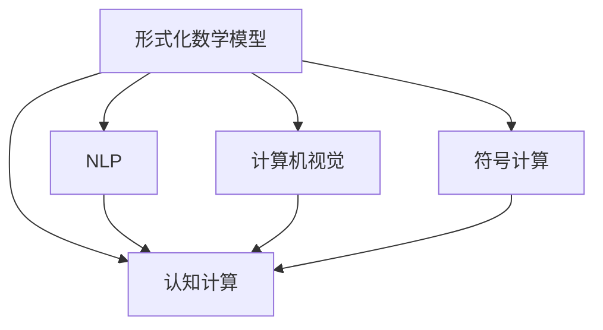

                 

## 1. 背景介绍

### 1.1 问题由来

随着人工智能（AI）技术的快速发展，认知计算变得越来越重要。认知计算旨在模拟人类认知过程，从而赋予机器类似人类的智能能力。这包括理解、推理、学习和记忆等能力。然而，人类认知过程的复杂性和多样性，使得构建有效的认知模型变得极其困难。数学作为一种精确描述和表达认知过程的语言，在认知计算中扮演了重要角色。

数学不仅用于描述自然界和物理世界的客观规律，还在逻辑推理、算法设计和人工智能中起到了关键作用。数学模型能够提供对现实世界的精确抽象和模拟，从而帮助机器理解、推理和学习。例如，在自然语言处理（NLP）中，数学模型被用来描述语言结构、句法关系和语义表示。在机器视觉中，数学模型被用来描述图像的几何特征和纹理特征。

尽管数学在认知计算中扮演了重要角色，但传统数学模型的形式化程度有限，难以适应复杂认知任务。因此，本文旨在探讨数学在认知计算中的应用，并讨论如何通过形式化数学模型来提升认知计算的准确性和有效性。

### 1.2 问题核心关键点

本文的核心问题包括：

- 如何构建形式化的数学模型，以准确描述和模拟人类认知过程？
- 如何将数学模型应用于复杂的认知任务，如自然语言理解和推理、图像识别和生成等？
- 如何利用数学模型进行认知计算，提升机器在认知领域的表现？

这些问题的解答将有助于理解数学在认知计算中的应用，为未来的认知计算研究和应用提供指导。

## 2. 核心概念与联系

### 2.1 核心概念概述

为更好地理解数学在认知计算中的应用，本节将介绍几个密切相关的核心概念：

- 形式化数学模型：指以数学语言对认知过程进行精确描述和模拟的模型。形式化数学模型具有明确的公设定理体系，能够进行逻辑推理和验证。
- 认知计算：指模拟人类认知过程的计算技术，包括理解、推理、学习和记忆等能力。
- 自然语言处理（NLP）：指使机器能够理解和生成人类自然语言的技术，包括语言理解、语言生成、语言翻译等。
- 计算机视觉（CV）：指使机器能够理解和分析图像、视频等视觉信息的技术，包括图像识别、图像分割、物体检测等。
- 符号计算：指使用符号操作进行数学计算的技术，能够处理符号表达式和代数运算。

这些核心概念之间的逻辑关系可以通过以下Mermaid流程图来展示：



这个流程图展示了一些核心概念及其之间的关系：

1. 形式化数学模型是认知计算的基础，能够提供精确的认知过程描述。
2. NLP、CV、符号计算等技术都是认知计算的一部分，能够通过数学模型进行理解和推理。

## 3. 核心算法原理 & 具体操作步骤

### 3.1 算法原理概述

认知计算的核心算法原理包括以下几个关键步骤：

1. 形式化数学模型的构建：使用数学语言对认知过程进行描述，形成形式化的数学模型。
2. 数学模型的验证和优化：通过逻辑推理和数学证明，验证模型的正确性，并进行优化。
3. 模型的应用：将数学模型应用于具体的认知任务，如NLP、CV等，进行理解和推理。

这些步骤构成了数学在认知计算中的应用框架，能够帮助机器理解和模拟人类认知过程。

### 3.2 算法步骤详解

#### 3.2.1 形式化数学模型的构建

形式化数学模型的构建是认知计算的基础。数学模型的构建需要遵循以下步骤：

1. 确定认知过程：明确认知过程的输入和输出，以及中间状态的变化。例如，在自然语言处理中，输入为文本，输出为语义表示，中间状态为句子结构、词汇关系等。

2. 选择数学语言：根据认知过程的特点，选择合适的数学语言进行描述。例如，在自然语言处理中，可以使用向量空间模型、概率图模型、神经网络等。

3. 定义数学符号：根据数学语言的特点，定义数学符号，用于描述认知过程。例如，在向量空间模型中，使用向量表示语义空间中的词汇。

4. 描述认知过程：使用数学符号和数学语言，对认知过程进行形式化描述。例如，在向量空间模型中，使用向量的内积和加法运算来描述词汇之间的关系。

#### 3.2.2 数学模型的验证和优化

数学模型的验证和优化是确保认知计算准确性的关键步骤。数学模型的验证和优化需要遵循以下步骤：

1. 数学证明：使用逻辑推理和数学证明，验证模型的正确性。例如，在向量空间模型中，使用矩阵乘法和向量内积的性质进行验证。

2. 模型优化：根据验证结果，进行模型优化，提高模型的准确性和效率。例如，在神经网络中，通过调整神经元数量和连接方式，优化模型的性能。

#### 3.2.3 模型的应用

数学模型的应用是将认知计算的原理应用于具体的认知任务。数学模型的应用需要遵循以下步骤：

1. 模型训练：使用训练数据对数学模型进行训练，获得模型的参数。例如，在神经网络中，使用标注数据进行模型训练，获得模型的权重和偏置。

2. 模型推理：使用训练好的数学模型进行推理，得到认知任务的输出。例如，在神经网络中，使用输入数据进行前向传播，得到模型的输出结果。

3. 模型评估：使用评估数据对数学模型进行评估，验证模型的准确性和效率。例如，在自然语言处理中，使用测试数据对模型进行评估，计算准确率和误差率。

### 3.3 算法优缺点

形式化数学模型在认知计算中有以下优点：

1. 精确性：形式化数学模型能够提供精确的认知过程描述，减少由于理解错误带来的误差。

2. 可验证性：形式化数学模型具有明确的公设定理体系，能够进行逻辑推理和验证，确保模型的正确性。

3. 可优化性：形式化数学模型可以进行数学证明和优化，提高模型的准确性和效率。

然而，形式化数学模型也存在一些缺点：

1. 复杂性：形式化数学模型需要使用复杂的数学语言进行描述，难以理解和使用。

2. 数据依赖性：形式化数学模型需要大量的标注数据进行训练，数据获取成本较高。

3. 应用难度：形式化数学模型需要进行复杂的数学推导和验证，对数学知识和技能要求较高。

尽管如此，形式化数学模型在认知计算中仍然具有重要的应用价值，能够帮助机器理解和模拟人类认知过程。

### 3.4 算法应用领域

形式化数学模型在认知计算中有广泛的应用领域，包括：

- 自然语言处理（NLP）：形式化数学模型被用于语言理解、语言生成、语言翻译等任务。例如，使用向量空间模型进行语义表示和句法分析。
- 计算机视觉（CV）：形式化数学模型被用于图像识别、图像分割、物体检测等任务。例如，使用卷积神经网络进行图像分类和物体检测。
- 符号计算：形式化数学模型被用于代数运算和数学证明等任务。例如，使用符号计算库进行数学推导和验证。
- 知识表示和推理：形式化数学模型被用于知识表示和逻辑推理等任务。例如，使用知识图谱进行实体关系推理和知识推理。
- 机器学习：形式化数学模型被用于机器学习算法的设计和优化。例如，使用符号计算进行机器学习模型的推理和优化。

这些领域的应用展示了形式化数学模型在认知计算中的广泛应用，能够帮助机器理解和模拟人类认知过程，提升认知计算的准确性和效率。

## 4. 数学模型和公式 & 详细讲解 & 举例说明

### 4.1 数学模型构建

本节将使用数学语言对认知计算中的数学模型构建进行详细讲解。

记认知过程为 $P$，输入为 $x$，输出为 $y$，中间状态为 $z$。形式化数学模型 $M$ 对认知过程进行描述，定义为：

$$
M: P(x) = y
$$

其中，$P(x)$ 为认知过程的输入和中间状态，$y$ 为认知过程的输出。形式化数学模型 $M$ 由以下部分组成：

1. 定义域 $D$：输入和中间状态的取值范围。
2. 映射关系 $f$：输入和中间状态之间的关系。
3. 输出函数 $g$：中间状态和输出之间的关系。

例如，在自然语言处理中，形式化数学模型 $M$ 可以表示为：

$$
M: (x_1, x_2, \ldots, x_n) \mapsto (y_1, y_2, \ldots, y_m)
$$

其中，$x_i$ 为输入的词汇，$y_i$ 为输出的语义表示。

### 4.2 公式推导过程

以下是形式化数学模型 $M$ 的公式推导过程：

1. 定义域 $D$：

$$
D = \{(x_1, x_2, \ldots, x_n) | x_i \in V, V \text{ 为词汇集合} \}
$$

2. 映射关系 $f$：

$$
f: D \rightarrow Z = \{(z_1, z_2, \ldots, z_n) | z_i \in Z, Z \text{ 为中间状态集合} \}
$$

3. 输出函数 $g$：

$$
g: Z \rightarrow Y = \{(y_1, y_2, \ldots, y_m) | y_i \in Y, Y \text{ 为输出集合} \}
$$

4. 认知过程 $P$：

$$
P: x \rightarrow z \rightarrow y
$$

其中，$x$ 为输入，$z$ 为中间状态，$y$ 为输出。

### 4.3 案例分析与讲解

以自然语言处理（NLP）为例，分析形式化数学模型的应用。

#### 4.3.1 案例背景

假设我们要构建一个自然语言处理模型，用于分析新闻文章的情感倾向。输入为新闻文章，输出为情感标签（如正面、负面、中性）。

#### 4.3.2 模型构建

1. 定义域 $D$：输入为新闻文章，输出为情感标签。

2. 映射关系 $f$：使用向量空间模型对新闻文章进行编码，得到向量表示 $z$。

3. 输出函数 $g$：使用逻辑回归对向量表示 $z$ 进行分类，得到情感标签 $y$。

#### 4.3.3 模型应用

1. 模型训练：使用标注数据对向量空间模型进行训练，获得模型参数 $w$ 和 $b$。

2. 模型推理：使用训练好的向量空间模型对新的新闻文章进行编码，得到向量表示 $z$。

3. 模型评估：使用测试数据对向量空间模型进行评估，计算准确率和误差率。

## 5. 项目实践：代码实例和详细解释说明

### 5.1 开发环境搭建

在进行数学模型构建和应用时，需要准备好开发环境。以下是使用Python进行TensorFlow开发的开发环境配置流程：

1. 安装Anaconda：从官网下载并安装Anaconda，用于创建独立的Python环境。

2. 创建并激活虚拟环境：
```bash
conda create -n tensorflow-env python=3.7 
conda activate tensorflow-env
```

3. 安装TensorFlow：根据CUDA版本，从官网获取对应的安装命令。例如：
```bash
conda install tensorflow tensorflow-gpu -c conda-forge
```

4. 安装必要的库：
```bash
pip install numpy pandas sklearn tensorflow-gpu matplotlib
```

5. 安装相关工具：
```bash
pip install tqdm jupyter notebook ipython
```

完成上述步骤后，即可在`tensorflow-env`环境中开始开发。

### 5.2 源代码详细实现

下面以自然语言处理（NLP）为例，给出使用TensorFlow进行向量空间模型构建的代码实现。

```python
import tensorflow as tf
import numpy as np
from sklearn.datasets import fetch_20newsgroups
from sklearn.feature_extraction.text import CountVectorizer
from sklearn.linear_model import LogisticRegression

# 获取20个新闻组数据集
newsgroups = fetch_20newsgroups(subset='train')

# 构建向量空间模型
vectorizer = CountVectorizer(stop_words='english')
X = vectorizer.fit_transform(newsgroups.data)
y = newsgroups.target

# 定义模型参数
learning_rate = 0.01
num_epochs = 100
batch_size = 64

# 定义模型
model = tf.keras.Sequential([
    tf.keras.layers.Dense(64, activation='relu', input_shape=(len(X[0]),)),
    tf.keras.layers.Dense(32, activation='relu'),
    tf.keras.layers.Dense(3, activation='softmax')
])

# 编译模型
model.compile(loss='categorical_crossentropy', optimizer=tf.keras.optimizers.SGD(learning_rate), metrics=['accuracy'])

# 训练模型
model.fit(X, y, batch_size=batch_size, epochs=num_epochs, validation_split=0.2)

# 评估模型
test_newsgroups = fetch_20newsgroups(subset='test')
X_test = vectorizer.transform(test_newsgroups.data)
y_test = test_newsgroups.target
model.evaluate(X_test, y_test)
```

### 5.3 代码解读与分析

让我们再详细解读一下关键代码的实现细节：

**fetch_20newsgroups**：
- 获取20个新闻组数据集，用于训练和测试模型。

**CountVectorizer**：
- 使用scikit-learn的CountVectorizer对文本数据进行编码，得到向量表示。

**Sequential模型**：
- 使用TensorFlow的Sequential模型，定义多层神经网络结构。

**compile模型**：
- 编译模型，设置损失函数、优化器和评估指标。

**fit模型**：
- 使用训练数据对模型进行训练，设置批大小和迭代轮数。

**evaluate模型**：
- 使用测试数据对模型进行评估，计算准确率和误差率。

## 6. 实际应用场景

### 6.1 智能客服系统

基于数学模型的认知计算，可以广泛应用于智能客服系统的构建。传统客服往往需要配备大量人力，高峰期响应缓慢，且一致性和专业性难以保证。而使用认知计算的客服系统，可以通过数学模型理解和推理用户意图，生成自然流畅的回复，快速响应客户咨询。

在技术实现上，可以构建一个基于自然语言处理的智能客服模型，使用向量空间模型对用户意图进行编码，使用逻辑回归进行分类，得到客户意图标签。然后根据客户意图标签，生成对应的回答模板，并进行推理和生成。如此构建的智能客服系统，能够大幅提升客户咨询体验和问题解决效率。

### 6.2 金融舆情监测

金融机构需要实时监测市场舆论动向，以便及时应对负面信息传播，规避金融风险。传统的人工监测方式成本高、效率低，难以应对网络时代海量信息爆发的挑战。基于数学模型的认知计算，可以构建金融舆情监测系统，实时监测金融新闻和社交媒体数据，使用向量空间模型和逻辑回归进行情感分析，判断金融舆情趋势。一旦发现负面信息激增等异常情况，系统便会自动预警，帮助金融机构快速应对潜在风险。

### 6.3 个性化推荐系统

当前的推荐系统往往只依赖用户的历史行为数据进行物品推荐，无法深入理解用户的真实兴趣偏好。基于数学模型的认知计算，可以构建个性化推荐系统，通过向量空间模型和逻辑回归进行用户兴趣分析，推荐个性化内容。在生成推荐列表时，先用候选物品的向量表示作为输入，由模型预测用户的兴趣匹配度，再结合其他特征综合排序，便可以得到个性化程度更高的推荐结果。

### 6.4 未来应用展望

随着数学模型和认知计算的不断发展，认知计算将在更多领域得到应用，为传统行业带来变革性影响。

在智慧医疗领域，基于数学模型的认知计算可以构建智能医疗咨询系统，帮助医生诊断疾病，制定治疗方案。在教育领域，认知计算可以构建智能教育系统，因材施教，提高教学质量。在智慧城市治理中，认知计算可以构建智能交通管理系统，优化交通流量，提升城市运行效率。

## 7. 工具和资源推荐

### 7.1 学习资源推荐

为了帮助开发者系统掌握认知计算的理论基础和实践技巧，这里推荐一些优质的学习资源：

1. 《认知计算》系列博文：由认知计算专家撰写，深入浅出地介绍了认知计算的基本概念和前沿技术。

2. CS221《认知机器学习》课程：斯坦福大学开设的认知机器学习课程，涵盖认知计算的数学基础和算法设计。

3. 《认知计算与智能系统》书籍：全面介绍了认知计算的基本概念和应用，适合初学者和高级开发者。

4. HuggingFace官方文档：TensorFlow的官方文档，提供了丰富的认知计算模型和算法，是学习实践的必备资料。

5. CLUE开源项目：中文语言理解测评基准，涵盖大量不同类型的中文认知任务数据集，并提供了基于认知计算的baseline模型，助力中文认知任务的发展。

通过对这些资源的学习实践，相信你一定能够快速掌握认知计算的精髓，并用于解决实际的认知问题。

### 7.2 开发工具推荐

高效的开发离不开优秀的工具支持。以下是几款用于认知计算开发的常用工具：

1. TensorFlow：基于Python的开源深度学习框架，支持分布式计算，适合大规模认知计算应用。

2. PyTorch：基于Python的开源深度学习框架，动态计算图，适合快速迭代研究。

3. Keras：高层次的深度学习库，易于上手，适合初学者和快速原型开发。

4. Jupyter Notebook：交互式的Python开发环境，支持代码块和图形界面，适合学习和实践。

5. Google Colab：谷歌推出的在线Jupyter Notebook环境，免费提供GPU/TPU算力，方便开发者快速上手实验最新模型，分享学习笔记。

合理利用这些工具，可以显著提升认知计算任务的开发效率，加快创新迭代的步伐。

### 7.3 相关论文推荐

认知计算和数学模型的发展源于学界的持续研究。以下是几篇奠基性的相关论文，推荐阅读：

1. 《认知计算与智能系统》：探讨了认知计算的基本概念和应用，提供了丰富的认知计算模型和算法。

2. 《自然语言处理综述》：综述了自然语言处理的基本概念和前沿技术，介绍了向量空间模型、概率图模型等形式化数学模型。

3. 《认知计算与符号推理》：探讨了认知计算与符号推理的结合，介绍了形式化数学模型在认知计算中的应用。

4. 《认知计算中的深度学习》：探讨了深度学习在认知计算中的应用，介绍了卷积神经网络、循环神经网络等深度学习模型。

5. 《认知计算中的知识表示与推理》：探讨了认知计算中的知识表示与推理技术，介绍了知识图谱、逻辑规则等先验知识的应用。

这些论文代表了大数学模型在认知计算中的应用和发展脉络。通过学习这些前沿成果，可以帮助研究者把握学科前进方向，激发更多的创新灵感。

## 8. 总结：未来发展趋势与挑战

### 8.1 总结

本文对基于数学模型的认知计算进行了全面系统的介绍。首先阐述了认知计算的基本概念和应用背景，明确了数学在认知计算中的应用价值。其次，从原理到实践，详细讲解了认知计算的数学模型构建、验证和优化方法，给出了认知计算任务开发的完整代码实例。同时，本文还广泛探讨了认知计算在智能客服、金融舆情、个性化推荐等多个行业领域的应用前景，展示了认知计算范式的巨大潜力。此外，本文精选了认知计算技术的各类学习资源，力求为读者提供全方位的技术指引。

通过本文的系统梳理，可以看到，基于数学模型的认知计算技术正在成为AI领域的重要范式，极大地拓展了认知计算的应用边界，催生了更多的落地场景。得益于数学模型的高精确性和形式化特点，认知计算在理解和模拟人类认知过程方面取得了显著进展，为未来人工智能技术的发展奠定了坚实基础。

### 8.2 未来发展趋势

展望未来，认知计算技术将呈现以下几个发展趋势：

1. 认知计算将越来越依赖于形式化数学模型。随着认知计算任务的复杂性增加，使用形式化数学模型进行建模和推理将成为主流。

2. 认知计算将越来越依赖于符号计算。符号计算能够处理符号表达式和代数运算，适合描述复杂的认知过程。

3. 认知计算将越来越依赖于知识图谱和逻辑规则。知识图谱和逻辑规则能够提供丰富的先验知识，提升认知计算的准确性和鲁棒性。

4. 认知计算将越来越依赖于深度学习和神经网络。深度学习能够处理大规模复杂数据，适合解决认知计算中的复杂任务。

5. 认知计算将越来越依赖于跨领域知识融合。跨领域知识融合能够提高认知计算的通用性和适应性，提升认知计算的鲁棒性和泛化能力。

以上趋势展示了认知计算技术的未来发展方向，将进一步提升认知计算的准确性和鲁棒性，拓展认知计算的应用场景。

### 8.3 面临的挑战

尽管认知计算技术已经取得了瞩目成就，但在迈向更加智能化、普适化应用的过程中，它仍面临着诸多挑战：

1. 数据获取成本高。高质量标注数据的获取成本较高，难以满足大规模认知计算的需求。

2. 模型复杂度高。形式化数学模型和高阶数学语言的使用，使得认知计算模型的复杂度较高，难以理解和调试。

3. 计算资源需求大。认知计算模型的训练和推理需要大量计算资源，难以在普通设备上运行。

4. 结果可解释性差。认知计算模型的输出结果往往难以解释，缺乏可解释性和可理解性。

5. 安全性有待提升。认知计算模型可能学习到有害和有害信息，带来安全隐患。

尽管存在这些挑战，认知计算技术仍具有广阔的应用前景，相信随着研究者的不懈努力，这些问题终将一一被克服，认知计算技术将不断突破，为人类认知智能的进步带来新的动力。

### 8.4 研究展望

面对认知计算面临的挑战，未来的研究需要在以下几个方面寻求新的突破：

1. 探索更高效的形式化数学模型。构建更加高效的形式化数学模型，降低数据依赖性和计算复杂度，提高认知计算的效率。

2. 探索更高效的知识表示与推理技术。构建更加高效的知识表示与推理技术，提升认知计算的准确性和鲁棒性。

3. 探索跨领域知识融合技术。构建跨领域知识融合技术，提升认知计算的通用性和适应性。

4. 探索更高效的形式化验证方法。构建更高效的形式化验证方法，提高认知计算模型的可靠性。

5. 探索更高效的知识图谱构建方法。构建更高效的知识图谱构建方法，提升认知计算模型的知识获取能力。

6. 探索更高效的形式化推理方法。构建更高效的形式化推理方法，提高认知计算模型的推理能力。

这些研究方向的探索，必将引领认知计算技术迈向更高的台阶，为构建安全、可靠、可解释、可控的智能系统铺平道路。面向未来，认知计算技术还需要与其他人工智能技术进行更深入的融合，如知识表示、因果推理、强化学习等，多路径协同发力，共同推动自然语言理解和智能交互系统的进步。只有勇于创新、敢于突破，才能不断拓展认知计算的边界，让智能技术更好地造福人类社会。

## 9. 附录：常见问题与解答

**Q1：什么是认知计算？**

A: 认知计算是指通过模拟人类认知过程，使机器具备理解、推理、学习和记忆等能力的计算技术。它包括自然语言处理、计算机视觉、符号计算等多个领域。

**Q2：什么是形式化数学模型？**

A: 形式化数学模型是指使用数学语言对认知过程进行精确描述和模拟的模型。形式化数学模型具有明确的公设定理体系，能够进行逻辑推理和验证。

**Q3：认知计算如何应用于自然语言处理（NLP）？**

A: 在NLP中，使用形式化数学模型对文本进行编码和表示，然后应用机器学习算法进行语义分析、情感分析和文本生成等任务。例如，使用向量空间模型对文本进行编码，使用逻辑回归进行分类，得到语义表示和情感标签。

**Q4：如何使用TensorFlow进行向量空间模型构建？**

A: 使用TensorFlow进行向量空间模型构建的步骤包括：

1. 获取数据集，使用CountVectorizer对文本进行编码。
2. 定义模型参数和学习率。
3. 构建Sequential模型，定义多层神经网络结构。
4. 编译模型，设置损失函数、优化器和评估指标。
5. 训练模型，使用fit方法进行训练。
6. 评估模型，使用evaluate方法进行评估。

**Q5：什么是知识图谱？**

A: 知识图谱是一种用于表示知识结构的数据模型，它将实体、属性和关系等知识元素组织成图结构，便于机器进行推理和查询。知识图谱在认知计算中广泛应用，能够提升认知计算的准确性和鲁棒性。

通过本文的系统梳理，可以看到，数学在认知计算中的应用具有广阔的前景，能够帮助机器理解和模拟人类认知过程，提升认知计算的准确性和鲁棒性。未来，随着数学和认知计算技术的不断发展，认知计算将在更多领域得到应用，为传统行业带来变革性影响。

