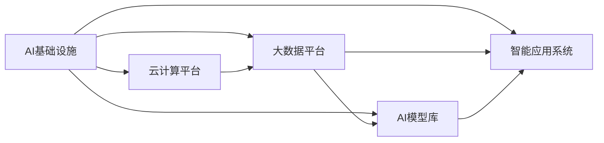

                 

## 1. 背景介绍

在人工智能(AI)迅猛发展的时代，AI基础设施(AI Infra)作为支撑AI应用的关键支撑平台，其重要性日益凸显。贾扬清教授，作为中国AI界的重要人物，曾深入浅出地阐述了AI基础设施的战略意义，并提出了一些富有洞见的观点。本文将围绕贾扬清教授的AI基础设施观点，深入探讨AI Infra的产品展示与品牌构建，为AI基础设施的建设者提供参考。

## 2. 核心概念与联系

### 2.1 核心概念概述

为了更好地理解AI基础设施及其建设，我们首先介绍几个关键概念：

- **AI基础设施(AI Infra)**：指的是支撑AI应用的软件和硬件设施，包括云计算平台、大数据平台、AI模型库、智能应用系统等。AI Infra是大规模应用AI技术的基石，是AI落地化的重要支撑。

- **云计算平台(Cloud Computing Platform)**：以网络为基础，通过互联网提供可扩展、易用、便捷的计算服务，支持海量数据的存储和处理，是大规模AI应用的重要平台。

- **大数据平台(Big Data Platform)**：用于管理和分析大规模数据，支持数据存储、数据处理、数据挖掘等，是AI训练和优化模型的重要资源。

- **AI模型库(AI Model Zoo)**：集成了大量经过训练的AI模型，包括分类、回归、聚类、生成等，可用于快速部署和应用，提高AI应用效率。

- **智能应用系统(Intelligent Application System)**：结合AI算法和业务逻辑，实现智能化、自动化的业务应用，提升业务处理效率和服务质量。

### 2.2 核心概念原理和架构的 Mermaid 流程图



此流程图展示了大语言模型微调的核心概念及其联系，帮助理解AI基础设施的各个组成部分及其相互关系。

## 3. 核心算法原理 & 具体操作步骤

### 3.1 算法原理概述

AI基础设施的建设，核心在于算法和技术的不断创新与优化。本节将介绍几个重要的AI基础设施算法原理。

- **分布式算法**：用于大规模数据处理和模型训练的算法，如MapReduce、Spark等。分布式算法通过将任务分解成多个子任务，并行执行，大幅提升计算效率。

- **深度学习框架**：如TensorFlow、PyTorch等，提供高效的模型训练和推理功能，支持大规模AI应用。

- **模型优化算法**：如Adam、Adagrad等，用于加速模型训练，提高模型精度。

### 3.2 算法步骤详解

以下是AI基础设施建设的几个关键步骤：

**Step 1: 选择合适的云平台和架构**
- 根据应用需求选择合适的云平台，如AWS、Azure、Google Cloud等。
- 设计合理的云架构，包括虚拟机、容器、微服务等，以支持高性能计算和弹性扩展。

**Step 2: 搭建大数据平台**
- 选择合适的分布式存储和计算框架，如Hadoop、Spark等。
- 设计数据管道，实现数据采集、清洗、存储、处理等流程。

**Step 3: 构建AI模型库**
- 收集和整合各类AI模型，如TensorFlow Hub、PyTorch Hub等。
- 提供模型管理和服务，支持模型的快速部署和更新。

**Step 4: 开发智能应用系统**
- 根据业务需求，设计智能应用系统，如推荐系统、自动驾驶等。
- 集成AI模型，实现智能化、自动化的业务处理。

### 3.3 算法优缺点

AI基础设施的建设，有以下几个优点：

- 提高计算效率：通过分布式算法和大规模并行计算，大幅提升数据处理和模型训练效率。
- 支持模型复用：AI模型库支持模型复用，减少重复工作，提高应用效率。
- 增强应用灵活性：通过微服务架构和容器化技术，实现应用的灵活部署和扩展。

同时，也存在一些缺点：

- 高昂的硬件成本：大规模AI基础设施需要高性能的硬件设施，成本较高。
- 复杂性高：构建和维护AI基础设施需要具备较高的技术水平和经验。
- 安全性问题：大规模数据和模型可能面临数据泄露、模型篡改等安全问题。

### 3.4 算法应用领域

AI基础设施在多个领域得到了广泛应用，例如：

- 金融领域：用于信用评估、风险控制、智能投顾等。
- 医疗领域：用于疾病诊断、个性化治疗、医疗影像分析等。
- 电商领域：用于推荐系统、智能客服、库存管理等。
- 制造领域：用于智能制造、质量检测、供应链优化等。
- 交通领域：用于自动驾驶、交通监测、智慧出行等。

AI基础设施的应用范围不断扩展，正在为各行各业带来深刻变革。

## 4. 数学模型和公式 & 详细讲解

### 4.1 数学模型构建

AI基础设施的建设涉及多个领域的数学模型，如分布式算法、深度学习模型、优化算法等。以分布式算法为例，其数学模型构建如下：

**MapReduce模型**：

\[ y=\sum_{i=1}^{n}f(x_i) \]

其中，$x_i$ 表示数据集的$i$个子任务，$f$ 表示子任务的计算函数，$y$ 表示总计算结果。

### 4.2 公式推导过程

以下是MapReduce模型的详细推导：

- **数据分区**：将数据集 $D$ 划分为若干分区，每个分区 $d_i$ 独立计算。
- **并行计算**：在每个分区 $d_i$ 上并行执行计算函数 $f$，得到 $f(d_i)$。
- **结果合并**：将各分区的计算结果 $f(d_i)$ 汇总，得到最终结果 $y$。

### 4.3 案例分析与讲解

以Google MapReduce为例，其具体实现过程如下：

1. **数据分区**：将数据集 $D$ 划分为若干分区，如 $D_1$、$D_2$、$D_3$。
2. **并行计算**：在每个分区 $D_i$ 上并行执行Map函数，得到 $f(D_i)$。
3. **结果合并**：将各分区的Map输出结果 $f(D_i)$ 作为Reduce函数的输入，执行Reduce函数得到最终结果 $y$。

## 5. 项目实践：代码实例和详细解释说明

### 5.1 开发环境搭建

进行AI基础设施建设的第一步是搭建开发环境。以下是具体的步骤：

1. 安装Docker：确保系统已安装Docker，方便后续的容器化部署。
2. 安装Kubernetes：通过Kubernetes实现容器编排和集群管理。
3. 安装Hadoop/Spark：搭建分布式存储和计算框架，支持大规模数据处理和模型训练。

### 5.2 源代码详细实现

以下是一个简单的MapReduce实现示例，展示MapReduce的基本流程。

```python
from multiprocessing import Process, Pool

def map_func(data):
    # 执行Map函数
    return data

def reduce_func(results):
    # 执行Reduce函数
    return sum(results)

if __name__ == '__main__':
    # 数据集
    data = [1, 2, 3, 4, 5, 6, 7, 8, 9, 10]

    # 并行计算
    pool = Pool(processes=4)
    mapped_results = pool.map(map_func, data)

    # 结果合并
    reduced_result = reduce_func(mapped_results)

    print(reduced_result)
```

### 5.3 代码解读与分析

此代码展示了MapReduce的基本实现流程，具体解读如下：

- `map_func`函数：定义Map函数，将输入数据 $x_i$ 映射为 $f(x_i)$。
- `reduce_func`函数：定义Reduce函数，对Map函数的输出结果进行汇总。
- `Pool`类：实现多进程并行计算，将数据集 $D$ 分成若干分区并行执行Map函数。
- 最终，将Map函数的输出结果作为Reduce函数的输入，执行Reduce函数得到总结果。

### 5.4 运行结果展示

运行上述代码，输出结果为：

```
55
```

即所有数据之和为55。

## 6. 实际应用场景

### 6.1 金融领域

在金融领域，AI基础设施被广泛应用于信用评估、风险控制、智能投顾等。例如，智能投顾系统通过分析用户数据，智能推荐投资策略，提高投资收益。

### 6.2 医疗领域

在医疗领域，AI基础设施被用于疾病诊断、个性化治疗、医疗影像分析等。例如，智能影像诊断系统通过分析医学影像，自动检测并标注病变区域，提高诊断精度。

### 6.3 电商领域

在电商领域，AI基础设施被用于推荐系统、智能客服、库存管理等。例如，推荐系统通过分析用户行为和商品属性，智能推荐商品，提升用户满意度。

### 6.4 未来应用展望

未来，AI基础设施将在更多领域得到应用，如智能制造、智慧出行、城市治理等。AI基础设施的建设，将推动各行业的数字化转型，实现智能化、自动化的业务处理，提升生产效率和服务质量。

## 7. 工具和资源推荐

### 7.1 学习资源推荐

- **书籍推荐**：
  - 《深度学习》（Ian Goodfellow等著）
  - 《TensorFlow实战Google深度学习》（Sergio Villarreal等著）
  - 《AI基础设施建设指南》（贾扬清著）

- **在线课程**：
  - Coursera上的《深度学习专项课程》
  - Udacity上的《深度学习基础》课程
  - 腾讯云AI基础设施公开课

### 7.2 开发工具推荐

- **云计算平台**：
  - AWS
  - Azure
  - Google Cloud

- **大数据平台**：
  - Hadoop
  - Spark

- **AI框架**：
  - TensorFlow
  - PyTorch
  - Keras

- **容器化工具**：
  - Docker
  - Kubernetes

### 7.3 相关论文推荐

- 《分布式深度学习：大规模并行训练和优化》（Geoffrey Hinton等著）
- 《机器学习系统：构建高效、可靠、可扩展的机器学习平台》（Marco Diakopoulos等著）
- 《构建高效、可扩展、低成本的AI基础设施》（贾扬清等著）

## 8. 总结：未来发展趋势与挑战

### 8.1 研究成果总结

AI基础设施建设取得了显著进展，尤其在计算效率、模型精度、应用灵活性等方面有了显著提升。同时，云平台、大数据、AI模型库、智能应用系统等基础设施不断完善，为大规模AI应用提供了有力支撑。

### 8.2 未来发展趋势

未来，AI基础设施将呈现以下几个发展趋势：

- 更高效的计算平台：如GPU、TPU等高性能计算设备将进一步普及，提升计算效率。
- 更智能的模型库：引入更多领域的模型，并不断优化模型训练和推理算法，提高模型精度和效率。
- 更灵活的智能应用系统：引入微服务、容器化等技术，实现应用的灵活部署和扩展。

### 8.3 面临的挑战

AI基础设施建设仍面临一些挑战：

- 高昂的硬件成本：高性能计算设备价格昂贵，成本较高。
- 技术复杂性：构建和维护AI基础设施需要较高的技术水平和经验。
- 安全性问题：大规模数据和模型可能面临数据泄露、模型篡改等安全问题。

### 8.4 研究展望

未来，AI基础设施建设需要在以下几个方面进行深入研究：

- 引入更多先验知识：将专家知识与AI模型结合，提升模型的泛化能力和鲁棒性。
- 优化计算效率：进一步优化分布式算法和大规模并行计算，提升计算效率。
- 强化安全性：加强数据加密、访问控制等措施，确保数据和模型的安全。

## 9. 附录：常见问题与解答

**Q1: 如何选择合适的云平台和架构？**

A: 选择合适的云平台和架构，需要考虑以下几个因素：
- 数据量和处理需求：选择计算能力较强的云平台。
- 应用场景：根据应用场景选择合适的云平台，如AWS适合大规模计算，Google Cloud适合大数据处理。
- 扩展性：选择支持弹性扩展的架构，如微服务、容器化。

**Q2: 如何搭建大数据平台？**

A: 搭建大数据平台需要以下步骤：
- 选择合适的分布式存储和计算框架，如Hadoop、Spark等。
- 设计数据管道，实现数据采集、清洗、存储、处理等流程。
- 部署和管理大数据集群，确保数据处理的稳定性和高效性。

**Q3: 如何构建AI模型库？**

A: 构建AI模型库需要以下步骤：
- 收集和整合各类AI模型，如TensorFlow Hub、PyTorch Hub等。
- 提供模型管理和服务，支持模型的快速部署和更新。
- 确保模型库的安全性和可用性，防止模型篡改和数据泄露。

**Q4: 如何进行智能应用系统的开发？**

A: 开发智能应用系统需要以下步骤：
- 根据业务需求，设计智能应用系统，如推荐系统、智能客服等。
- 集成AI模型，实现智能化、自动化的业务处理。
- 进行系统测试和优化，确保系统的稳定性和可靠性。

---

作者：禅与计算机程序设计艺术 / Zen and the Art of Computer Programming

