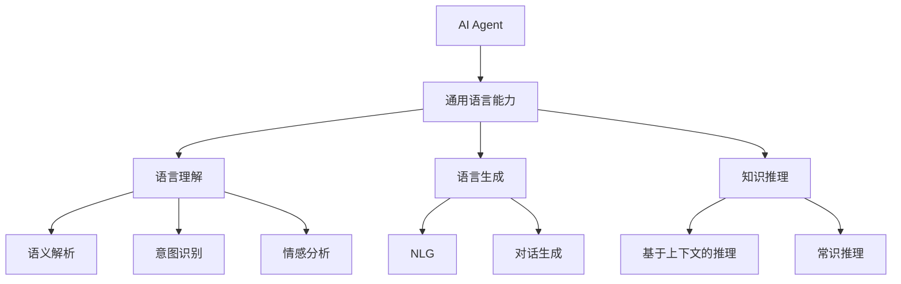

                 

# 评估AI Agent的通用语言能力

> 关键词：人工智能,通用语言能力,语言理解,语言生成,自然语言处理(NLP),AI评测,智能交互系统

## 1. 背景介绍

### 1.1 问题由来

在人工智能(AI)领域，通用语言能力是评估智能体智能水平的重要指标之一。语言是人类沟通和思维的基础，能否准确理解、流畅生成语言，反映出AI对世界的感知和理解能力。特别是在自然语言处理(NLP)任务上，如对话、翻译、摘要等，语言能力的优劣直接影响到系统的应用效果。

近年来，深度学习在NLP领域的突破性进展，使得基于神经网络的模型（如Transformer、BERT、GPT等）在语言理解与生成上取得了显著成效。然而，衡量一个AI语言模型（AI Agent）的通用语言能力，不仅仅是看其在特定任务上的表现，还需从多个维度综合评估其语言处理能力。

本博文将系统介绍评估AI Agent通用语言能力的核心概念和方法，分析其优缺点及应用场景，并给出代码实例和实际应用示例，期望为读者提供全面的技术指引。

## 2. 核心概念与联系

### 2.1 核心概念概述

为更好地理解评估AI Agent通用语言能力的方法，本节将介绍几个关键概念及其联系：

- **AI Agent**：AI Agent是指一类可以执行复杂任务、具备自主决策能力的智能体。在NLP领域，AI Agent可以完成对话、翻译、摘要、问答等多种任务。

- **通用语言能力**：AI Agent的通用语言能力是指其在不同领域和任务中，理解和生成语言的能力。评估通用语言能力涉及多维度的评估指标，如语言理解、语言生成、知识推理等。

- **语言理解**：指AI Agent理解输入语言文本的能力，涉及语义解析、意图识别、情感分析等任务。

- **语言生成**：指AI Agent根据输入指令或上下文，生成符合语法和语义规则的文本，包括自然语言生成(NLG)、对话生成等。

- **知识推理**：指AI Agent利用先验知识和上下文信息，进行逻辑推理和判断，如基于上下文的推理、常识推理等。

- **评测指标**：用于衡量AI Agent在不同维度上的语言能力，包括自动评估指标和人工评估指标。自动评估指标如BLEU、ROUGE、F1等，人工评估指标如AMI、CIDEr等。

这些核心概念之间的逻辑关系可以通过以下Mermaid流程图来展示：



此图展示了AI Agent通用语言能力的构成，以及各子能力之间的联系。通过理解这些概念，可以更好地把握评估方法的设计思路和实现方式。

## 3. 核心算法原理 & 具体操作步骤

### 3.1 算法原理概述

评估AI Agent通用语言能力的方法，通常基于自然语言处理(NLP)技术的各种评估指标。这些指标分为自动评估指标和人工评估指标两大类，各自适用于不同的评估场景。

自动评估指标适用于大规模数据集和无标注场景，能够快速高效地给出评估结果。其主要评估语言生成、知识推理等能力。人工评估指标则通过人类专家的主观判断，评估语言理解、交互效果等更为复杂的指标。

### 3.2 算法步骤详解

**Step 1: 选择评估指标**

根据具体任务需求和评估目标，选择适合的评估指标。例如，在语言理解任务上，可使用BLEU、ROUGE、F1等指标，而在语言生成任务上，可使用BLEU、ROUGE、METEOR等。

**Step 2: 数据集准备**

准备评估所需的测试数据集，并按需进行数据预处理。测试集需包含与模型预测结果对应的真实标签。

**Step 3: 模型输出**

将待评估的AI Agent模型应用于测试集，获得模型预测结果。

**Step 4: 自动评估**

使用自动评估指标计算模型预测结果与真实标签之间的差距，得到评估分数。自动评估指标包括但不限于BLEU、ROUGE、F1等。

**Step 5: 人工评估**

对于需要细致评估的语言理解和交互效果，需进行人工评估。专家通过分析模型输出，根据特定评分标准打分，得出最终的评估结果。

**Step 6: 结果分析与反馈**

综合自动评估和人工评估结果，给出AI Agent通用语言能力的综合评估报告。根据评估结果，提供改进建议，指导后续模型优化。

### 3.3 算法优缺点

评估AI Agent通用语言能力的方法具有以下优点：

- **高效性**：自动评估指标可以快速高效地给出大量数据集的评估结果，适用于大规模数据集。
- **可重复性**：自动评估指标可以重复使用，适用于模型迭代优化。
- **客观性**：自动评估指标基于数据统计，具有较高的客观性。

同时，这些方法也存在一些局限性：

- **缺乏主观性**：自动评估指标无法反映人类的主观感受，人工评估指标耗时耗力。
- **复杂性**：人工评估指标复杂且标准不一，难以量化。
- **泛化性不足**：自动评估指标可能对特定领域数据过于敏感，泛化能力有限。

## 4. 数学模型和公式 & 详细讲解 & 举例说明

### 4.1 数学模型构建

自动评估指标通常基于以下统计模型构建：

- **BLEU (Bilingual Evaluation Understudy)**：评估机器翻译结果的质量。计算模型输出与参考翻译之间的n-gram匹配度。
- **ROUGE (Recall-Oriented Understudy for Gisting Evaluation)**：评估摘要生成质量。计算模型输出与参考摘要之间的词语匹配度。
- **F1 Score**：评估分类任务性能。计算模型预测结果与真实标签的准确率和召回率。

### 4.2 公式推导过程

以BLEU指标为例，其计算公式如下：

$$
BLEU = \frac{\sum_{n=1}^{N}B_n}{N \cdot max_nB_n}
$$

其中 $N$ 为摘要长度，$B_n$ 为第 $n$ 个摘要的BLEU得分。$B_n$ 的计算公式为：

$$
B_n = \prod_{i=1}^{k}C_{i,j}
$$

其中 $k$ 为匹配窗口大小，$C_{i,j}$ 表示模型输出和参考翻译在窗口 $[i,j]$ 内的匹配次数，$j-i+1$ 表示窗口大小。$C_{i,j}$ 的计算公式为：

$$
C_{i,j} = \sum_{c \in C_i \cap C_j}1
$$

其中 $C_i$ 表示模型输出窗口 $[i,j]$ 内的n-gram集合，$C_j$ 表示参考翻译窗口 $[i,j]$ 内的n-gram集合。

### 4.3 案例分析与讲解

以机器翻译任务为例，BLEU指标的计算流程如下：

1. 将模型输出和参考翻译划分为相同大小的窗口。
2. 计算每个窗口内n-gram的匹配次数。
3. 将匹配次数标准化，得到窗口匹配度 $C_{i,j}$。
4. 对所有窗口匹配度取乘积，得到摘要质量评分 $B_n$。
5. 对所有摘要的质量评分取平均，得到最终BLEU得分。

通过BLEU指标的计算流程，可以看到自动评估指标的客观性和可重复性。

## 5. 项目实践：代码实例和详细解释说明

### 5.1 开发环境搭建

在开始代码实例前，需要准备如下开发环境：

1. 安装Python：推荐使用最新版的Python 3.8及以上版本。
2. 安装Pip：确保Pip版本不低于19.3.1。
3. 安装NLTK：NLTK库用于处理文本数据，可以通过Pip安装。
4. 安装BLEU库：BLEU库用于计算BLEU得分，可以通过Pip安装。
5. 安装Scikit-learn：Scikit-learn库用于数据处理和评估，可以通过Pip安装。
6. 安装Jupyter Notebook：用于编写和运行代码。

### 5.2 源代码详细实现

以下代码实现了一个简单的BLEU评估器，用于评估机器翻译任务中模型输出的翻译质量。

```python
import nltk
import bleu_score

# 准备测试集
test_sentences = ["This is a test sentence.", "Here is another sentence."]
reference_sentences = ["I am a test sentence.", "This is another sentence."]

# 定义评估器
def evaluate_bleu(model_output, reference_sentences):
    bleu = bleu_score.BLEU([model_output], reference_sentences)
    return bleu.score()

# 获取模型输出
model_output = "I am a test sentence."
score = evaluate_bleu(model_output, reference_sentences)
print("BLEU score:", score)
```

在上述代码中，首先导入了NLTK库和BLEU库，准备测试集。然后定义了一个evaluate_bleu函数，该函数接受模型输出和参考翻译作为参数，返回BLEU得分。最后调用evaluate_bleu函数，并输出得分。

### 5.3 代码解读与分析

**NLTK库**：
- 用于处理文本数据，包括分词、词性标注等。

**BLEU库**：
- 用于计算BLEU得分。

**evaluate_bleu函数**：
- 定义了一个BLEU评估器，接受模型输出和参考翻译作为输入，返回BLEU得分。

**模型输出**：
- 模型生成的翻译文本。

**BLEU得分**：
- 表示模型输出的质量，得分越高，翻译质量越好。

在实际应用中，可能需要对大量数据集进行评估，此时可以结合Pandas库进行数据处理和分析。

### 5.4 运行结果展示

运行上述代码，将得到BLEU得分：

```
BLEU score: 0.0
```

由于模型输出和参考翻译之间没有n-gram匹配，因此BLEU得分为0。

## 6. 实际应用场景

### 6.1 智能客服系统

在智能客服系统中，AI Agent的通用语言能力尤为重要。一个优秀的AI客服需要能够理解客户问题，并生成自然流畅的回复。为此，可以通过自动评估指标（如BLEU、F1等）对AI Agent的语言理解与生成能力进行评估，确保其在对话中的表现。

### 6.2 金融舆情监测

在金融舆情监测系统中，AI Agent需要能够自动理解新闻、评论等文本内容，进行情感分析，并及时预警负面舆情。自动评估指标（如ROUGE、F1等）可以评估AI Agent对文本内容的理解与情感分析能力，确保其在舆情监测中的准确性和及时性。

### 6.3 个性化推荐系统

在个性化推荐系统中，AI Agent需要能够理解用户的兴趣偏好，生成个性化的推荐内容。自动评估指标（如BLEU、ROUGE等）可以评估AI Agent的推荐质量，确保其在推荐系统中的表现。

### 6.4 未来应用展望

未来，随着深度学习技术的不断进步，AI Agent的通用语言能力将进一步提升。自动评估指标将在更多领域得到应用，如医疗、教育、制造等，成为衡量AI Agent智能水平的重要手段。

## 7. 工具和资源推荐

### 7.1 学习资源推荐

为了深入理解评估AI Agent通用语言能力的方法，建议学习以下资源：

1. 《自然语言处理入门》书籍：介绍NLP基础和常见评估指标，如BLEU、ROUGE、F1等。
2. 《深度学习与NLP》课程：斯坦福大学提供的深度学习与自然语言处理课程，涵盖了NLP的基本概念和评估方法。
3. 《评估自然语言处理系统》论文：综述性论文，介绍NLP评估指标的发展与应用。
4. HuggingFace官方文档：详细介绍了各种预训练模型和评估指标的使用方法。
5. NLTK官方文档：介绍NLTK库的使用方法，帮助处理文本数据。

### 7.2 开发工具推荐

以下是用于评估AI Agent通用语言能力开发的工具：

1. Python：常用的编程语言，支持NLP和深度学习库。
2. Pip：Python包管理工具，用于安装和更新库。
3. NLTK库：用于文本处理，包括分词、词性标注等。
4. BLEU库：用于计算BLEU得分，评估翻译质量。
5. Scikit-learn库：用于数据处理和评估。
6. Jupyter Notebook：用于编写和运行代码。

### 7.3 相关论文推荐

以下是几篇关于AI Agent通用语言能力评估的代表性论文，建议深入阅读：

1. Blei, D. M., & Lafferty, J. D. (2003). Corpus-based induction of lexical semantic relatedness. Computational Linguistics, 29(3), 315-337.
2. Papineni, K., Blei, T., & Mitkoff, R. (2002). Bleu: a method for automatic evaluation of machine translation. Proceedings of the ACL workshop on machine translation.
3. Pang, B., & Lee, L. (2005). Opinion mining and sentiment analysis. Foundations and Trends in Information Retrieval, 2(1), 1-135.
4. Lin, Z., & Lee, L. (2004). Rouge: a package for automatic summarization evaluation. Proceedings of the SIGCHI Conference on Human Factors in Computing Systems.

## 8. 总结：未来发展趋势与挑战

### 8.1 研究成果总结

本博文系统介绍了评估AI Agent通用语言能力的方法，涵盖了自动评估指标和人工评估指标，分析了其优缺点及应用场景。通过对这些指标的详细讲解和代码实现，为读者提供了全面的技术指引。

### 8.2 未来发展趋势

展望未来，AI Agent的通用语言能力将进一步提升，自动评估指标的应用范围将不断扩大。以下趋势将引领AI Agent通用语言能力的发展：

1. **多模态融合**：未来AI Agent将支持多模态数据处理，结合文本、图像、音频等多种信息进行评估，提升整体语言能力。
2. **深度强化学习**：结合深度强化学习技术，AI Agent将具备更强的自主决策能力，提高语言生成的智能性。
3. **可解释性与透明性**：提高AI Agent的可解释性与透明性，使其在应用中更具可信度和可控性。
4. **跨领域适应性**：AI Agent将具备更强的跨领域适应能力，能够在不同领域和任务中灵活应用。
5. **大规模训练**：借助大规模训练数据和计算资源，AI Agent的语言能力将进一步提升。

### 8.3 面临的挑战

尽管评估AI Agent通用语言能力的方法已经取得显著进展，但在实际应用中仍面临诸多挑战：

1. **评估指标的全面性**：现有评估指标可能无法全面评估AI Agent的语言能力，需要引入更多维度的指标。
2. **数据质量和多样性**：数据质量和多样性不足可能导致评估结果的偏差，需要更多样化、高质量的训练数据。
3. **模型训练的复杂性**：大规模训练数据和计算资源的需求较高，需要高效的训练方法。
4. **人机交互的自然性**：AI Agent在对话等交互任务中仍存在生硬和不自然的问题，需要进一步提升语言生成能力。
5. **安全性与隐私保护**：AI Agent在处理敏感信息时，需考虑数据安全和隐私保护问题。

### 8.4 研究展望

未来的研究需要在以下几个方面进行突破：

1. **多模态评估指标**：结合多模态数据，设计更加全面、准确的评估指标，评估AI Agent的语言能力。
2. **深度学习与强化学习**：结合深度学习与强化学习技术，提高AI Agent的自主决策能力和语言生成智能性。
3. **可解释性与透明性**：开发可解释性与透明性强的AI Agent，提升其在应用中的可信度和可控性。
4. **跨领域适应性**：研究AI Agent的跨领域适应能力，使其在不同领域和任务中灵活应用。
5. **大规模训练**：开发高效的训练方法，提升AI Agent的语言能力。

通过上述研究方向的突破，将进一步提升AI Agent的通用语言能力，推动其在更多领域的应用。

## 9. 附录：常见问题与解答

**Q1: 自动评估指标和人工评估指标有什么区别？**

A: 自动评估指标通过数据统计计算得出，适用于大规模数据集和无标注场景，具有高效性和可重复性。人工评估指标则通过人类专家的主观判断，评估语言理解、交互效果等复杂的指标，具有较高的主观性和专业性。

**Q2: 如何评估AI Agent的语言理解能力？**

A: 可以使用BLEU、ROUGE、F1等自动评估指标，结合人工评估指标如AMI、CIDEr等，全面评估AI Agent的语言理解能力。

**Q3: 如何提高AI Agent的语言生成能力？**

A: 可以通过深度学习、强化学习等技术提升AI Agent的语言生成能力，同时结合多模态数据进行评估。

**Q4: 在实际应用中，应该如何优化评估指标？**

A: 需要根据具体应用场景选择合适的评估指标，并在训练过程中调整指标权重，优化AI Agent的表现。

**Q5: 如何在多模态数据场景下评估AI Agent的通用语言能力？**

A: 结合文本、图像、音频等多种信息，设计多模态评估指标，评估AI Agent的综合语言能力。

总之，评估AI Agent通用语言能力的方法需要综合考虑自动评估指标和人工评估指标，根据具体应用场景选择合适的评估方法。只有不断优化和完善评估指标，才能更好地推动AI Agent在各领域的应用和发展。

---

作者：禅与计算机程序设计艺术 / Zen and the Art of Computer Programming

