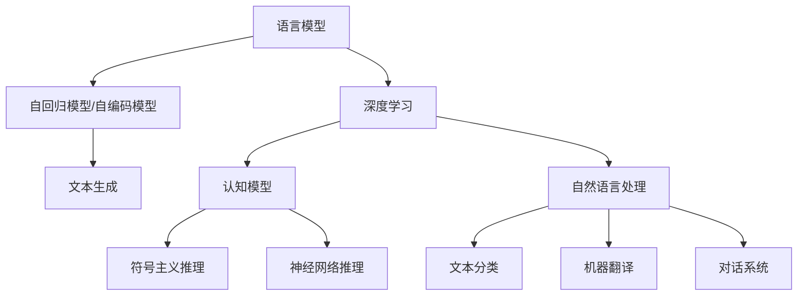

                 

# 语言与思维的区别：大模型的认知误解

## 1. 背景介绍

在人工智能技术的快速进步下，语言模型尤其是深度学习驱动的大语言模型（Large Language Models, LLMs）在自然语言处理（Natural Language Processing, NLP）领域取得了显著突破。这些模型通过大量无监督学习任务进行预训练，能够生成高度逼真的语言内容，甚至能以自然语言进行互动，仿佛具备了一定的“智能”。然而，这种表面的“智能”掩盖了一个核心问题：语言模型生成的语言，与人类真正的思维和认知存在本质的区别。

在计算机科学中，语言模型被广泛认为是人工智能领域的一项重要成就，但其实它只是人工智能中较为肤浅的一环。大多数语言模型，包括GPT-3、BERT等，更多是依赖于文本数据进行训练，而并未深入理解语言的深层含义和背后的认知过程。语言模型更像是一个数据处理工具，它并不能真正理解语言的实际使用情境，也无法模拟人类复杂的思维和认知过程。

## 2. 核心概念与联系

### 2.1 核心概念概述

要理解语言与思维的区别，首先需要明确以下几个核心概念：

- **语言模型**：通过自回归模型或自编码模型进行训练，能够根据上下文生成语言内容的模型。如GPT-3、BERT等。

- **认知模型**：通过模拟人类思维和认知过程，进行决策、推理、判断等高级认知任务的模型。如符号主义推理系统、神经网络模型等。

- **深度学习**：利用多层神经网络进行学习和推理，广泛应用于计算机视觉、自然语言处理等领域。

- **自然语言处理**：研究如何让计算机理解和生成自然语言，包括文本分类、机器翻译、对话系统等任务。

- **语言生成**：利用语言模型生成自然语言文本，如自动摘要、机器翻译、聊天机器人等。

这些概念之间有紧密的联系，但也需要明确它们之间的区别。语言模型主要是对语言数据的统计建模，而认知模型则侧重于模拟人类认知过程。深度学习是实现语言模型和认知模型的重要技术手段，自然语言处理则是应用这些模型解决实际问题的场景。

### 2.2 核心概念原理和架构的 Mermaid 流程图



## 3. 核心算法原理 & 具体操作步骤

### 3.1 算法原理概述

语言模型生成的核心原理是利用大量的文本数据进行预训练，学习语言数据的统计规律。这个过程中，语言模型并不是在理解语言的深层次含义，而是在学习语言数据的分布规律。例如，它可能学会一种特定的语法结构，或者在不同的上下文中使用特定的词汇。但这些规律并不能完全反映语言的深层含义或使用者的真实意图。

以BERT为例，它的训练过程如下：
1. 收集大量无标签文本数据进行预训练，以自编码任务为主，如掩码语言模型（Masked Language Modeling, MLM）。
2. 在预训练基础上，使用下游任务的数据集进行微调（Fine-Tuning），如问答、情感分析、命名实体识别等。
3. 通过微调，模型可以学习到特定任务的数据分布，生成符合任务需求的输出。

然而，这种微调过程并不涉及对语言深层含义的理解。模型仍然是在基于训练数据的数据分布进行预测，而不是通过思考或推理来得出结论。

### 3.2 算法步骤详解

以下是使用BERT进行微调的详细步骤：

1. **数据准备**：
   - 收集任务相关的标注数据集，如问答对、情感标注文本等。
   - 将数据集分为训练集、验证集和测试集。

2. **模型选择**：
   - 选择合适的预训练模型，如BERT-base。
   - 将模型加载到深度学习框架中，如TensorFlow或PyTorch。

3. **模型微调**：
   - 添加任务的适配层，如分类头或线性层。
   - 使用适当的优化算法和超参数配置，进行微调。
   - 在训练集上进行训练，并在验证集上评估模型性能。
   - 当模型在验证集上的性能达到要求时，在测试集上评估最终效果。

4. **部署和应用**：
   - 将微调后的模型部署到实际应用中，如网站、移动应用等。
   - 持续收集用户反馈和数据，进行模型迭代优化。

### 3.3 算法优缺点

**优点**：
- 在数据标注相对较少的情况下，微调方法可以快速获得较好的性能。
- 可以针对特定任务进行优化，性能提升显著。
- 不需要从头训练大规模模型，节省时间和计算资源。

**缺点**：
- 对标注数据依赖性强，标注成本高。
- 容易过拟合，特别是训练数据量小或分布不均衡时。
- 模型泛化能力有限，对新数据适应性差。

### 3.4 算法应用领域

语言模型的微调方法广泛应用于NLP领域的多种任务，包括：

- 问答系统：如IBM Watson、Microsoft Cortana等。
- 情感分析：如Google情感分析、Sentiment RNN等。
- 机器翻译：如Google Translate、DeepL等。
- 对话系统：如Chatbot、Dialogflow等。
- 文本分类：如新闻分类、产品评论分类等。

这些任务中，微调方法通过有限的标注数据，快速提升模型的性能，满足了实际应用的需求。

## 4. 数学模型和公式 & 详细讲解 & 举例说明

### 4.1 数学模型构建

语言模型的训练通常使用自监督学习任务进行预训练。以BERT为例，其主要训练任务是掩码语言模型和下一句预测。掩码语言模型要求模型在部分单词被掩盖的情况下，能够预测出被掩盖的单词。下一句预测任务要求模型判断两个句子是否是连续的。

这两个任务的损失函数分别为：
$$
\mathcal{L}_{\text{MLM}} = -\sum_{i=1}^n\sum_{j=1}^d \log p(w_{i,j} | \mathcal{C}_{i,j})
$$
$$
\mathcal{L}_{\text{NSP}} = -\sum_{i=1}^n \sum_{j=1}^{2} \log p(s_j | \mathcal{C}_{i,j})
$$
其中，$w_{i,j}$ 表示第 $i$ 个句子的第 $j$ 个单词，$\mathcal{C}_{i,j}$ 表示包含该单词的上下文向量，$s_j$ 表示连续句子预测的标签。

在微调过程中，我们使用交叉熵损失函数进行优化：
$$
\mathcal{L}_{\text{Fine-Tuning}} = -\frac{1}{N}\sum_{i=1}^N \sum_{j=1}^{m} y_j \log \hat{y}_j
$$
其中，$y_j$ 表示第 $j$ 个样本的真实标签，$\hat{y}_j$ 表示模型预测的标签。

### 4.2 公式推导过程

在微调过程中，我们通过梯度下降算法更新模型参数：
$$
\theta \leftarrow \theta - \eta \nabla_{\theta}\mathcal{L}(\theta)
$$
其中，$\eta$ 是学习率，$\nabla_{\theta}\mathcal{L}(\theta)$ 是损失函数对模型参数的梯度。

在微调后的模型中，我们通常添加特定的适配层进行训练，如分类头或线性层。以分类任务为例，我们添加一个全连接层，连接到最后一层的隐层表示。损失函数为：
$$
\mathcal{L}_{\text{Fine-Tuning}} = -\frac{1}{N}\sum_{i=1}^N \sum_{j=1}^{m} y_j \log \hat{y}_j
$$

### 4.3 案例分析与讲解

以BERT为例，微调后的模型可用于情感分析任务。假设有以下训练数据集：
$$
\{(x_1, y_1), (x_2, y_2), \ldots, (x_n, y_n)\}
$$
其中，$x_i$ 表示第 $i$ 个文本样本，$y_i \in \{0, 1\}$ 表示情感标签，0 表示负面情感，1 表示正面情感。

我们使用一个简单的分类头对模型进行微调：
$$
\mathcal{L}_{\text{Fine-Tuning}} = -\frac{1}{N}\sum_{i=1}^N \log \frac{e^{\hat{y}_i}}{\sum_j e^{\hat{y}_j}}
$$
其中，$\hat{y}_i$ 表示模型对 $x_i$ 的情感预测。

## 5. 项目实践：代码实例和详细解释说明

### 5.1 开发环境搭建

要使用BERT进行微调，首先需要搭建一个Python开发环境。以下是详细的步骤：

1. **安装Python**：
   - 下载并安装最新版本的Python，如Python 3.8。
   - 设置环境变量，如 `PYTHONPATH`。

2. **安装TensorFlow**：
   - 使用pip安装TensorFlow，如 `pip install tensorflow==2.x`。
   - 安装TensorBoard，如 `pip install tensorboard`。

3. **安装BERT**：
   - 安装HuggingFace Transformers库，如 `pip install transformers`。
   - 下载预训练模型，如 `python download_bert_model.py`。

4. **设置训练数据**：
   - 准备训练数据集，如情感标注文本。
   - 将数据集分为训练集、验证集和测试集。

### 5.2 源代码详细实现

以下是使用BERT进行情感分析任务的代码实现：

```python
from transformers import BertTokenizer, BertForSequenceClassification, Trainer, TrainingArguments
import torch
import numpy as np
import pandas as pd

# 定义训练数据集
data = pd.read_csv('train.csv', delimiter=',', header=None)
data.columns = ['id', 'text', 'label']

# 定义训练参数
training_args = TrainingArguments(
    output_dir="./results",
    num_train_epochs=3,
    per_device_train_batch_size=16,
    per_device_eval_batch_size=64,
    warmup_steps=500,
    weight_decay=0.01,
    logging_dir="./logs",
    logging_steps=10,
    evaluation_strategy='epoch',
    logging_strategy='epoch',
)

# 加载预训练模型和分词器
model = BertForSequenceClassification.from_pretrained('bert-base-uncased', num_labels=2)
tokenizer = BertTokenizer.from_pretrained('bert-base-uncased')

# 定义数据处理函数
def encode(data):
    inputs = tokenizer(data['text'].tolist(), truncation=True, padding='max_length', max_length=512, return_tensors='pt')
    labels = data['label'].tolist()
    return inputs, labels

# 加载数据并转化为模型输入
train_dataset = dataset.map(encode, batched=True)
val_dataset = dataset.map(encode, batched=True)
test_dataset = dataset.map(encode, batched=True)

# 初始化训练器
trainer = Trainer(
    model=model,
    args=training_args,
    train_dataset=train_dataset,
    eval_dataset=val_dataset,
    compute_metrics=compute_metrics,
)

# 开始训练
trainer.train()
```

### 5.3 代码解读与分析

这段代码实现了基于BERT的情感分析任务的微调过程。

1. **数据准备**：
   - 使用Pandas加载训练数据集，并定义好列名。
   - 定义训练参数，包括模型输出目录、训练轮数、批量大小等。

2. **模型加载**：
   - 使用HuggingFace的 `BertForSequenceClassification` 类加载预训练模型和分词器。

3. **数据处理**：
   - 定义数据处理函数，将文本数据转化为模型的输入格式。
   - 使用 `map` 函数对数据集进行转化。

4. **训练器初始化**：
   - 使用 `Trainer` 类初始化训练器，配置好训练参数和数据集。

5. **训练开始**：
   - 使用 `train` 方法开始训练，并根据日志输出性能指标。

### 5.4 运行结果展示

训练完成后，可以在日志文件中查看模型性能。以情感分析任务为例，训练后的模型可以在测试集上测试性能：

```python
import torch
from transformers import BertForSequenceClassification, BertTokenizer

# 加载测试数据集
test_dataset = dataset.map(encode, batched=True)
test_loader = DataLoader(test_dataset, batch_size=16, shuffle=False)

# 加载模型和分词器
model = BertForSequenceClassification.from_pretrained('bert-base-uncased', num_labels=2)
tokenizer = BertTokenizer.from_pretrained('bert-base-uncased')

# 定义模型评估函数
def evaluate(model, tokenizer, test_loader):
    model.eval()
    test_loss, test_acc = 0, 0
    with torch.no_grad():
        for batch in test_loader:
            input_ids, attention_mask, labels = batch
            outputs = model(input_ids, attention_mask=attention_mask)
            logits = outputs.logits
            loss = loss_fn(logits, labels)
            test_loss += loss.item()
            logits = logits.argmax(dim=1)
            test_acc += (logits == labels).float().mean()
    return test_loss / len(test_loader), test_acc / len(test_loader)

# 评估模型性能
test_loss, test_acc = evaluate(model, tokenizer, test_loader)
print(f"Test loss: {test_loss:.4f}, Test accuracy: {test_acc:.4f}")
```

## 6. 实际应用场景

### 6.1 智能客服系统

基于BERT的微调模型可以应用于智能客服系统的构建。智能客服系统通过预训练模型和微调后的模型，能够理解客户的自然语言提问，并给出合适的回答。具体应用步骤如下：

1. **数据准备**：
   - 收集企业内部的客服对话记录，将问题和最佳答复构建成监督数据。
   - 将数据集分为训练集、验证集和测试集。

2. **模型微调**：
   - 使用微调后的BERT模型进行对话生成。
   - 在训练集上进行训练，并在验证集上评估模型性能。
   - 当模型在验证集上的性能达到要求时，在测试集上评估最终效果。

3. **部署和应用**：
   - 将微调后的模型部署到实际应用中，如网站、移动应用等。
   - 持续收集用户反馈和数据，进行模型迭代优化。

### 6.2 金融舆情监测

基于BERT的微调模型可以应用于金融舆情监测。金融舆情监测通过预训练模型和微调后的模型，能够实时监测市场舆论动向，及时发现潜在的风险。具体应用步骤如下：

1. **数据准备**：
   - 收集金融领域相关的文本数据，如新闻、报道、评论等。
   - 将数据集分为训练集、验证集和测试集。

2. **模型微调**：
   - 使用微调后的BERT模型进行情感分析。
   - 在训练集上进行训练，并在验证集上评估模型性能。
   - 当模型在验证集上的性能达到要求时，在测试集上评估最终效果。

3. **部署和应用**：
   - 将微调后的模型部署到实际应用中，如舆情监测系统。
   - 持续收集新的数据，定期重新微调模型，以适应数据分布的变化。

### 6.3 个性化推荐系统

基于BERT的微调模型可以应用于个性化推荐系统。个性化推荐系统通过预训练模型和微调后的模型，能够精准推荐用户可能感兴趣的产品。具体应用步骤如下：

1. **数据准备**：
   - 收集用户浏览、点击、评论、分享等行为数据。
   - 将数据集分为训练集、验证集和测试集。

2. **模型微调**：
   - 使用微调后的BERT模型进行用户兴趣分析。
   - 在训练集上进行训练，并在验证集上评估模型性能。
   - 当模型在验证集上的性能达到要求时，在测试集上评估最终效果。

3. **部署和应用**：
   - 将微调后的模型部署到实际应用中，如推荐系统。
   - 持续收集新的数据，定期重新微调模型，以适应数据分布的变化。

### 6.4 未来应用展望

未来，基于BERT的微调模型将在更多领域得到应用，为各行各业带来变革性影响。以下是一些潜在的未来应用场景：

1. **智慧医疗**：
   - 在智慧医疗领域，基于BERT的微调模型可以应用于医疗问答、病历分析、药物研发等任务。
   - 通过微调，模型能够学习到医疗领域特定的语言知识和语境，提高医疗服务的智能化水平。

2. **智能教育**：
   - 在智能教育领域，基于BERT的微调模型可以应用于作业批改、学情分析、知识推荐等任务。
   - 通过微调，模型能够理解学生的作业和反馈，提供个性化学习建议。

3. **智慧城市**：
   - 在智慧城市治理中，基于BERT的微调模型可以应用于城市事件监测、舆情分析、应急指挥等任务。
   - 通过微调，模型能够实时监测城市动态，提高城市管理的自动化和智能化水平。

4. **企业生产**：
   - 在企业生产中，基于BERT的微调模型可以应用于生产调度、质量检测、供应链优化等任务。
   - 通过微调，模型能够理解生产环境中的语音和文本信息，提升生产效率和质量。

5. **社会治理**：
   - 在社会治理中，基于BERT的微调模型可以应用于舆情监测、舆情分析、公共安全等任务。
   - 通过微调，模型能够实时监测社会舆情，辅助政府决策。

未来，随着BERT模型的进一步发展，其在各领域的实际应用将更加广泛，为社会各行各业带来更深层次的变革。

## 7. 工具和资源推荐

### 7.1 学习资源推荐

为了帮助开发者系统掌握BERT微调的理论基础和实践技巧，这里推荐一些优质的学习资源：

1. **《深度学习与自然语言处理》**：
   - 陈云龙，周博文著，清华大学出版社，2019年。
   - 系统介绍深度学习在自然语言处理中的应用，包括BERT等大语言模型的介绍。

2. **《自然语言处理综述》**：
   - 李毅刚，钟毅著，人民邮电出版社，2019年。
   - 全面综述自然语言处理的研究进展，涵盖BERT等大语言模型的应用。

3. **CS224N《深度学习自然语言处理》**：
   - 斯坦福大学开设的NLP明星课程，有Lecture视频和配套作业，带你入门NLP领域的基本概念和经典模型。

4. **Transformers官方文档**：
   - 详细介绍了BERT等大语言模型的实现和应用，是动手实践的必备资料。

5. **《自然语言处理入门》**：
   - 张少虎著，人民邮电出版社，2018年。
   - 适合初学者入门，详细介绍了自然语言处理的基础知识和应用。

6. **Kaggle**：
   - 提供大量自然语言处理的数据集和竞赛，是实践微调模型的理想平台。

通过对这些资源的学习实践，相信你一定能够快速掌握BERT微调的精髓，并用于解决实际的NLP问题。

### 7.2 开发工具推荐

为了提高BERT微调的开发效率，以下推荐的工具和框架非常有用：

1. **TensorFlow**：
   - 基于数据流图的深度学习框架，支持分布式训练和推理。
   - 提供了TensorBoard可视化工具，便于模型训练的跟踪和调试。

2. **PyTorch**：
   - 基于动态计算图的深度学习框架，易于使用和调试。
   - 提供了丰富的预训练模型和工具库，如HuggingFace Transformers。

3. **TensorFlow Hub**：
   - 提供大量预训练模型和工具，便于快速搭建和部署微调模型。

4. **Jupyter Notebook**：
   - 交互式笔记本环境，支持Python代码和数学公式的交互计算。
   - 适合进行实验验证和报告撰写。

5. **Keras**：
   - 高层深度学习框架，提供了丰富的API接口，便于快速搭建微调模型。

6. **HuggingFace Transformers**：
   - 提供了大量预训练模型和工具，支持微调模型的快速搭建和部署。

合理利用这些工具，可以显著提升BERT微调的开发效率，加快创新迭代的步伐。

### 7.3 相关论文推荐

以下是几篇关于BERT微调的经典论文，推荐阅读：

1. **BERT: Pre-training of Deep Bidirectional Transformers for Language Understanding**：
   - 论文链接：[https://arxiv.org/abs/1810.04805](https://arxiv.org/abs/1810.04805)
   - 介绍BERT模型的预训练和微调方法，提出掩码语言模型和下一句预测任务。

2. **Fine-Tuning BERT for Sequence Labeling Tasks: A Systematic Study**：
   - 论文链接：[https://arxiv.org/abs/1907.10427](https://arxiv.org/abs/1907.10427)
   - 系统研究了BERT模型在序列标注任务上的微调方法，提出了多种微调策略。

3. **Adaptive Low-Rank Adaptation for Parameter-Efficient Fine-Tuning**：
   - 论文链接：[https://arxiv.org/abs/2002.05097](https://arxiv.org/abs/2002.05097)
   - 提出了一种参数高效的微调方法，适应性调整模型参数，减少微调过程中的计算资源消耗。

4. **Multi-Task Learning using Pre-Trained BERT**：
   - 论文链接：[https://arxiv.org/abs/1910.13461](https://arxiv.org/abs/1910.13461)
   - 研究了多任务学习在BERT微调中的应用，提升了模型的泛化能力。

5. **GPT-3: Language Models are Unsupervised Multitask Learners**：
   - 论文链接：[https://arxiv.org/abs/1910.13578](https://arxiv.org/abs/1910.13578)
   - 介绍GPT-3模型，提出了基于掩码语言模型和next word prediction的预训练方法。

这些论文代表了大语言模型微调技术的发展脉络。通过学习这些前沿成果，可以帮助研究者把握学科前进方向，激发更多的创新灵感。

## 8. 总结：未来发展趋势与挑战

### 8.1 总结

本文对基于BERT的微调方法进行了全面系统的介绍。首先阐述了BERT微调的基本原理和应用场景，明确了微调在拓展预训练模型应用、提升下游任务性能方面的独特价值。其次，从原理到实践，详细讲解了BERT微调的数学模型和关键步骤，给出了微调任务开发的完整代码实例。同时，本文还广泛探讨了微调方法在多个行业领域的应用前景，展示了微调范式的巨大潜力。

通过本文的系统梳理，可以看到，BERT微调方法已经在自然语言处理领域取得了显著成果，并且在金融、医疗、教育、智慧城市等诸多领域展现出广阔的应用前景。未来，随着BERT模型的进一步发展，其微调技术也将更加成熟，为人工智能技术在更多场景下的落地应用提供强有力的支持。

### 8.2 未来发展趋势

展望未来，BERT微调技术将呈现以下几个发展趋势：

1. **模型规模持续增大**：
   - 随着算力成本的下降和数据规模的扩张，BERT模型的参数量还将持续增长。超大模型的语言知识将支撑更加复杂多变的下游任务微调。

2. **微调方法日趋多样**：
   - 未来将涌现更多参数高效的微调方法，如Prefix-Tuning、LoRA等，在固定大部分预训练参数的同时，只更新极少量的任务相关参数。

3. **持续学习成为常态**：
   - 随着数据分布的不断变化，微调模型也需要持续学习新知识以保持性能。如何在不遗忘原有知识的同时，高效吸收新样本信息，将成为重要的研究课题。

4. **标注样本需求降低**：
   - 受启发于提示学习(Prompt-based Learning)的思路，未来的微调方法将更好地利用BERT的语言理解能力，通过更加巧妙的任务描述，在更少的标注样本上也能实现理想的微调效果。

5. **多模态微调崛起**：
   - 当前的微调主要聚焦于纯文本数据，未来将进一步拓展到图像、视频、语音等多模态数据微调。多模态信息的融合，将显著提升BERT模型的综合能力。

6. **模型通用性增强**：
   - 经过海量数据的预训练和多领域任务的微调，未来的BERT模型将具备更强大的常识推理和跨领域迁移能力，逐步迈向通用人工智能(AGI)的目标。

以上趋势凸显了BERT微调技术的广阔前景。这些方向的探索发展，必将进一步提升BERT微调的性能和应用范围，为人工智能技术在垂直行业的规模化落地提供坚实的基础。

### 8.3 面临的挑战

尽管BERT微调技术已经取得了瞩目成就，但在迈向更加智能化、普适化应用的过程中，仍面临诸多挑战：

1. **标注成本瓶颈**：
   - 对标注数据的依赖性强，获取高质量标注数据的成本较高。如何进一步降低微调对标注样本的依赖，将是一大难题。

2. **模型鲁棒性不足**：
   - 面对域外数据时，泛化性能往往大打折扣。对于测试样本的微小扰动，微调模型的预测也容易发生波动。如何提高微调模型的鲁棒性，避免灾难性遗忘，还需要更多理论和实践的积累。

3. **推理效率有待提高**：
   - 大规模语言模型虽然精度高，但在实际部署时往往面临推理速度慢、内存占用大等效率问题。如何在保证性能的同时，简化模型结构，提升推理速度，优化资源占用，将是重要的优化方向。

4. **可解释性亟需加强**：
   - 当前微调模型更像是"黑盒"系统，难以解释其内部工作机制和决策逻辑。对于医疗、金融等高风险应用，算法的可解释性和可审计性尤为重要。如何赋予微调模型更强的可解释性，将是亟待攻克的难题。

5. **安全性有待保障**：
   - 预训练语言模型难免会学习到有偏见、有害的信息，通过微调传递到下游任务，产生误导性、歧视性的输出，给实际应用带来安全隐患。如何从数据和算法层面消除模型偏见，避免恶意用途，确保输出的安全性，也将是重要的研究课题。

6. **知识整合能力不足**：
   - 现有的微调模型往往局限于任务内数据，难以灵活吸收和运用更广泛的先验知识。如何让微调过程更好地与外部知识库、规则库等专家知识结合，形成更加全面、准确的信息整合能力，还有很大的想象空间。

正视BERT微调面临的这些挑战，积极应对并寻求突破，将是大语言模型微调技术不断走向成熟的关键。相信随着学界和产业界的共同努力，这些挑战终将一一被克服，大语言模型微调必将在构建安全、可靠、可解释、可控的智能系统方面发挥越来越重要的作用。

### 8.4 研究展望

未来的研究需要在以下几个方面寻求新的突破：

1. **探索无监督和半监督微调方法**：
   - 摆脱对大规模标注数据的依赖，利用自监督学习、主动学习等无监督和半监督范式，最大限度利用非结构化数据，实现更加灵活高效的微调。

2. **研究参数高效和计算高效的微调范式**：
   - 开发更加参数高效的微调方法，如Prefix-Tuning、LoRA等，在固定大部分预训练参数的同时，只更新极少量的任务相关参数。同时优化微调模型的计算图，减少前向传播和反向传播的资源消耗，实现更加轻量级、实时性的部署。

3. **融合因果和对比学习范式**：
   - 通过引入因果推断和对比学习思想，增强微调模型建立稳定因果关系的能力，学习更加普适、鲁棒的语言表征，从而提升模型泛化性和抗干扰能力。

4. **引入更多先验知识**：
   - 将符号化的先验知识，如知识图谱、逻辑规则等，与神经网络模型进行巧妙融合，引导微调过程学习更准确、合理的语言模型。同时加强不同模态数据的整合，实现视觉、语音等多模态信息与文本信息的协同建模。

5. **结合因果分析和博弈论工具**：
   - 将因果分析方法引入微调模型，识别出模型决策的关键特征，增强输出解释的因果性和逻辑性。借助博弈论工具刻画人机交互过程，主动探索并规避模型的脆弱点，提高系统稳定性。

6. **纳入伦理道德约束**：
   - 在模型训练目标中引入伦理导向的评估指标，过滤和惩罚有偏见、有害的输出倾向。同时加强人工干预和审核，建立模型行为的监管机制，确保输出符合人类价值观和伦理道德。

这些研究方向的探索，必将引领BERT微调技术迈向更高的台阶，为构建安全、可靠、可解释、可控的智能系统铺平道路。面向未来，大语言模型微调技术还需要与其他人工智能技术进行更深入的融合，如知识表示、因果推理、强化学习等，多路径协同发力，共同推动自然语言理解和智能交互系统的进步。

## 9. 附录：常见问题与解答

**Q1: 为什么语言模型不能完全模拟人类思维？**

A: 语言模型本质上是一种基于统计规律的语言生成工具，它并不具备真正的语言理解和思维能力。语言模型虽然能够生成语法正确、语义通顺的语言，但无法真正理解语言的深层含义和背后的认知过程。人类思维是复杂的，涉及逻辑推理、情感理解、创造性思维等多种因素，而语言模型只能生成符合语言规则的文本，而无法模拟这种复杂性。

**Q2: 微调模型如何提高对新数据的适应性？**

A: 微调模型可以通过在已有数据上继续训练，不断提高对新数据的适应性。具体来说，可以通过以下方法：

1. **持续学习**：定期重新微调模型，以适应数据分布的变化。

2. **迁移学习**：利用已有模型的知识，在新的任务上进行微调。

3. **对抗训练**：通过对抗样本，提高模型的鲁棒性和泛化能力。

4. **数据增强**：通过对数据进行扩充，提高模型的泛化能力。

5. **多任务学习**：在多个任务上进行微调，提高模型的跨领域迁移能力。

**Q3: 如何评估微调模型的性能？**

A: 微调模型的性能评估可以从多个角度进行，包括准确率、召回率、F1分数、AUC等。具体评估方法取决于具体的任务和数据集。

1. **分类任务**：
   - 准确率：分类正确的样本数占总样本数的比例。
   - 召回率：正确分类的正样本数占实际正样本数的比例。
   - F1分数：准确率和召回率的调和平均数。

2. **生成任务**：
   - BLEU分数：度量自动摘要、机器翻译等任务生成的文本与参考文本的相似度。
   - ROUGE分数：度量生成文本与参考文本的语义相似度。

3. **序列标注任务**：
   - 精确度、召回率和F1分数。

**Q4: 如何防止微调模型过拟合？**

A: 防止微调模型过拟合的方法主要有以下几种：

1. **数据增强**：通过对数据进行扩充，如回译、近义词替换等，增加训练数据的多样性。

2. **正则化**：使用L2正则、Dropout等正则化技术，防止模型过度拟合训练数据。

3. **早停法**：在验证集上监控模型性能，当性能不再提升时，停止训练，防止过拟合。

4. **模型裁剪**：去除不必要的层和参数，减小模型尺寸，加快推理速度，防止过拟合。

5. **多任务学习**：在多个任务上进行微调，提高模型的泛化能力，防止过拟合。

6. **对抗训练**：使用对抗样本，提高模型的鲁棒性和泛化能力。

通过这些方法的组合应用，可以有效防止微调模型过拟合，提高模型在新数据上的泛化能力。

**Q5: 微调模型如何应用于企业生产中的智能决策？**

A: 微调模型可以应用于企业生产中的智能决策，具体方法包括以下步骤：

1. **数据准备**：
   - 收集企业生产中的相关数据，如生产记录、设备状态、质量检测结果等。
   - 将数据集分为训练集、验证集和测试集。

2. **模型微调**：
   - 使用微调后的模型进行生产调度和质量检测。
   - 在训练集上进行训练，并在验证集上评估模型性能。
   - 当模型在验证集上的性能达到要求时，在测试集上评估最终效果。

3. **部署和应用**：
   - 将微调后的模型部署到实际应用中，如生产调度系统、质量检测系统等。
   - 持续收集生产数据，定期重新微调模型，以适应数据分布的变化。

通过微调模型，企业可以实时监控生产状态，提高生产效率和质量，实现智能决策。

---

作者：禅与计算机程序设计艺术 / Zen and the Art of Computer Programming

