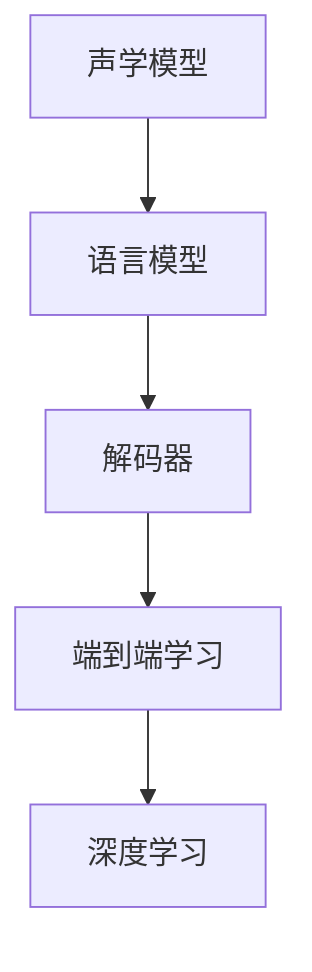

                 

# 语音识别原理与代码实例讲解

> 关键词：语音识别, 声学模型, 语言模型, 解码器, 深度学习, Kaldi, 端到端, PyTorch

## 1. 背景介绍

### 1.1 问题由来

语音识别技术旨在将人类语音转换为文本形式，从而实现语音-文本的自动化转换。语音识别在智能助手、语音控制、听写、字幕生成等多个应用场景中具有重要价值，有助于提升人机交互的自然性和便捷性。

语音识别系统主要包括前端信号处理和后端语音识别两部分。前端信号处理负责对原始语音信号进行预处理，如滤波、降噪、特征提取等，以提高后续语音识别的准确性和鲁棒性。后端语音识别部分则包含声学模型、语言模型、解码器等组件，用于从特征序列中识别出语音文本。

近年来，随着深度学习技术的发展，基于端到端学习的声学模型和语言模型得到了广泛应用，如使用卷积神经网络(CNN)和循环神经网络(RNN)构建声学模型，使用长短时记忆网络(LSTM)、门控循环单元(GRU)等深度神经网络构建语言模型。这些深度学习模型在语音识别领域取得了显著的进展。

### 1.2 问题核心关键点

语音识别系统在端到端训练和解码过程中，存在以下关键问题：

1. **声学模型建模**：如何有效建模语音信号与文本之间的映射关系，保证声学模型能够准确地从输入的特征序列中识别出语音文本。

2. **语言模型建模**：如何建模文本序列的概率分布，用于校正声学模型可能出现的错误，提高整体的识别准确率。

3. **解码策略**：如何在解码过程中找到最优或较高概率的文本序列，并最终生成识别结果。

4. **端到端学习**：如何整合声学模型、语言模型和解码器，进行端到端训练，提升整体系统性能。

5. **鲁棒性提升**：如何在复杂环境下（如噪声、口音差异等）提升语音识别系统的鲁棒性和泛化能力。

6. **实时性优化**：如何在保证识别精度的情况下，优化系统实时性，实现实时语音识别。

本文将围绕这些关键问题，详细讲解语音识别的核心原理和代码实现。

## 2. 核心概念与联系

### 2.1 核心概念概述

为更好地理解语音识别技术的核心原理，本节将介绍几个密切相关的核心概念：

- **声学模型(Acoustic Model)**：用于建模语音信号与文本之间的映射关系。
- **语言模型(Language Model)**：用于建模文本序列的概率分布，提供文本的先验概率。
- **解码器(Decoder)**：用于在声学模型和语言模型的联合概率指导下，生成最优或较高概率的文本序列。
- **端到端学习(End-to-End Learning)**：将声学模型、语言模型和解码器整合到一个端到端的深度神经网络中，进行联合训练和解码。
- **深度学习(Deep Learning)**：使用卷积神经网络(CNN)、循环神经网络(RNN)、Transformer等深度神经网络构建声学模型、语言模型和解码器。

这些核心概念之间的逻辑关系可以通过以下Mermaid流程图来展示：



这个流程图展示了大语言模型的核心概念及其之间的关系：

1. 声学模型通过训练，学习语音信号与文本之间的映射关系。
2. 语言模型通过训练，学习文本序列的概率分布。
3. 解码器根据声学模型和语言模型的输出，生成最优文本序列。
4. 端到端学习将声学模型、语言模型和解码器整合到一个深度神经网络中，进行联合训练。
5. 深度学习为构建这些组件提供了有效的技术支持。

这些概念共同构成了语音识别技术的核心框架，使得系统能够高效地进行语音-文本的自动化转换。

## 3. 核心算法原理 & 具体操作步骤
### 3.1 算法原理概述

语音识别系统的工作原理主要分为以下几步：

1. **信号预处理**：对原始语音信号进行滤波、降噪、特征提取等处理，以提高后续语音识别的准确性和鲁棒性。
2. **声学模型建模**：使用深度神经网络建模语音信号与文本之间的映射关系，通过训练使得模型能够准确地从输入的特征序列中识别出语音文本。
3. **语言模型建模**：使用深度神经网络建模文本序列的概率分布，提供文本的先验概率。
4. **解码策略**：使用解码算法在声学模型和语言模型的联合概率指导下，生成最优或较高概率的文本序列。
5. **端到端学习**：将声学模型、语言模型和解码器整合到一个深度神经网络中，进行联合训练和解码。

### 3.2 算法步骤详解

**步骤 1: 信号预处理**

语音信号预处理的目标是将原始语音信号转换为模型所需的特征序列。预处理过程包括：

1. **分帧和加窗**：将语音信号分成长度为25ms的帧，每帧之间重叠50%。对每帧信号进行加窗，如Hamming窗，以降低频谱泄露。
2. **特征提取**：对加窗后的语音帧进行Mel频率倒谱系数(Mel-Frequency Cepstral Coefficients, MFCCs)提取。MFCCs能够较好地捕捉语音信号的频率特性。
3. **对数变换和归一化**：对MFCCs进行对数变换，以改善其分布特性。并进行归一化，以适应后续神经网络模型的输入需求。

**步骤 2: 声学模型建模**

声学模型通常使用深度神经网络构建，常用的网络结构包括：

1. **卷积神经网络(CNN)**：用于提取局部特征，适用于短时语音信号的建模。
2. **长短时记忆网络(LSTM)**：用于处理长时依赖关系，适用于长时语音信号的建模。
3. **门控循环单元(GRU)**：一种LSTM的变体，具有较低的计算复杂度。

声学模型的训练过程如下：

1. **特征序列生成**：使用MFCCs作为模型的输入，每个MFCC序列对应一个时间步。
2. **目标文本生成**：将每个时间步的文本字符序列作为目标输出。
3. **交叉熵损失计算**：计算模型输出与真实文本之间的交叉熵损失。
4. **反向传播和参数更新**：使用梯度下降等优化算法，最小化损失函数，更新模型参数。

**步骤 3: 语言模型建模**

语言模型用于建模文本序列的概率分布，常用的语言模型包括：

1. **n-gram模型**：基于n个连续文本字符的概率，建模文本序列的分布。
2. **神经网络语言模型(Neural Network Language Model, NNLG)**：使用深度神经网络，建模文本序列的概率分布。
3. **递归神经网络(RNN)**：通过循环神经网络，建模文本序列的概率分布。

语言模型的训练过程如下：

1. **文本序列生成**：将文本序列作为模型的输入，每个时间步的字符作为目标输出。
2. **负对数似然损失计算**：计算模型输出与真实文本之间的负对数似然损失。
3. **反向传播和参数更新**：使用梯度下降等优化算法，最小化损失函数，更新模型参数。

**步骤 4: 解码策略**

解码器用于在声学模型和语言模型的联合概率指导下，生成最优或较高概率的文本序列。常用的解码策略包括：

1. **基于搜索的解码**：使用Viterbi算法或Beam Search算法，在声学模型和语言模型的联合概率指导下，搜索最优或较高概率的文本序列。
2. **端到端解码**：将声学模型、语言模型和解码器整合到一个深度神经网络中，进行端到端解码。
3. **注意力机制**：使用注意力机制，帮助模型在解码过程中更好地关注关键特征。

**步骤 5: 端到端学习**

端到端学习将声学模型、语言模型和解码器整合到一个深度神经网络中，进行联合训练和解码。常用的端到端学习框架包括：

1. **Kaldi**：一个开源的语音识别工具包，支持端到端学习。
2. **DeepSpeech**：谷歌开源的端到端语音识别模型，基于卷积神经网络和LSTM构建。
3. **WaveNet**：谷歌开源的端到端语音识别模型，使用Transformer网络结构。

## 4. 数学模型和公式 & 详细讲解  
### 4.1 数学模型构建

语音识别系统中的核心数学模型包括声学模型和语言模型。

**声学模型**：

假设声学模型为 $P(y_t|x)$，其中 $x$ 为MFCCs序列，$y_t$ 为时间步 $t$ 的文本字符。声学模型的训练目标为最大化似然函数：

$$
L = \sum_{x} \prod_{t} P(y_t|x)
$$

其中 $P(y_t|x)$ 为条件概率，表示在给定MFCCs序列 $x$ 的情况下，时间步 $t$ 生成文本字符 $y_t$ 的概率。

**语言模型**：

假设语言模型为 $P(y|x)$，其中 $x$ 为MFCCs序列，$y$ 为整个文本序列。语言模型的训练目标为最大化似然函数：

$$
L = \sum_{x,y} P(y|x)P(x)
$$

其中 $P(y|x)$ 为条件概率，表示在给定MFCCs序列 $x$ 的情况下，生成文本序列 $y$ 的概率。$P(x)$ 为MFCCs序列 $x$ 的先验概率。

### 4.2 公式推导过程

**声学模型的公式推导**：

声学模型的训练过程可以表示为最大似然估计。假设模型使用RNN网络，训练过程如下：

1. **特征序列生成**：将MFCCs序列 $x$ 作为模型的输入，生成文本字符序列 $y$。
2. **交叉熵损失计算**：计算模型输出与真实文本之间的交叉熵损失：

$$
L(x,y) = -\sum_{t=1}^{T} \log P(y_t|x)
$$

其中 $T$ 为文本长度，$y_t$ 为时间步 $t$ 的文本字符。

3. **反向传播和参数更新**：使用梯度下降等优化算法，最小化损失函数，更新模型参数。

**语言模型的公式推导**：

语言模型的训练过程可以表示为最大似然估计。假设模型使用LSTM网络，训练过程如下：

1. **文本序列生成**：将MFCCs序列 $x$ 作为模型的输入，生成文本序列 $y$。
2. **负对数似然损失计算**：计算模型输出与真实文本之间的负对数似然损失：

$$
L(x,y) = -\sum_{t=1}^{T} \log P(y_t|y_{<t},x)
$$

其中 $y_{<t}$ 为时间步 $t$ 之前的文本字符序列。

3. **反向传播和参数更新**：使用梯度下降等优化算法，最小化损失函数，更新模型参数。

## 5. 项目实践：代码实例和详细解释说明
### 5.1 开发环境搭建

在进行语音识别实践前，我们需要准备好开发环境。以下是使用Python进行Kaldi开发的Python接口库的配置流程：

1. 安装Kaldi：从官网下载并安装Kaldi，并设置环境变量。
2. 安装Kaldi Python接口库：使用pip安装kaldi-python接口库。

```bash
pip install kaldi-python
```

3. 安装各类工具包：
```bash
pip install numpy scipy scikit-learn scipy librosa torchaudio
```

完成上述步骤后，即可在Python环境中开始语音识别实践。

### 5.2 源代码详细实现

下面我们以基于Kaldi的语音识别系统为例，给出语音识别的代码实现。

首先，定义特征提取函数：

```python
import kaldi
import numpy as np

def extract_features(audio_file, config):
    # 读取音频文件
    wav, sr = librosa.load(audio_file, sr=config['sample_rate'], mono=True)
    # 分帧加窗
    frame_length = config['frame_length']
    frame_shift = config['frame_shift']
    win_length = frame_length
    hop_length = frame_shift
    frames = librosa.stft(wav, frame_length=frame_length, hop_length=hop_length, win_length=win_length, window='hamming')
    # 计算MFCCs
    mfccs = kaldi.spectrogram.mfcc(frames, frame_length=frame_length, num_fft=config['num_fft'], num_filter=config['num_filter'], low_freq=config['low_freq'], high_freq=config['high_freq'])
    return mfccs
```

然后，定义声学模型训练函数：

```python
from kaldi.parts.mdl import new_model, new_model_adapt

def train_acoustic_model(mdl, training_data, config):
    # 创建声学模型
    train_mdl = new_model(mdl)
    # 创建声学模型训练器
    train_trainer = new_model_adapt(train_mdl)
    # 设置训练参数
    train_trainer.set_speaker_adapt=False
    train_trainer.set_speaker_train=True
    train_trainer.set_data_root(training_data)
    train_trainer.set_frame_length(config['frame_length'])
    train_trainer.set_frame_shift(config['frame_shift'])
    train_trainer.set_num_fft(config['num_fft'])
    train_trainer.set_num_filter(config['num_filter'])
    train_trainer.set_window_type('hamming')
    # 训练声学模型
    train_trainer.train()
    # 保存声学模型
    train_mdl.save(config['save_model'])
```

接着，定义语言模型训练函数：

```python
from kaldi.parts.mdl import new_model, new_model_adapt

def train_linguistic_model(mdl, training_data, config):
    # 创建语言模型
    train_mdl = new_model(mdl)
    # 创建语言模型训练器
    train_trainer = new_model_adapt(train_mdl)
    # 设置训练参数
    train_trainer.set_speaker_adapt=False
    train_trainer.set_speaker_train=True
    train_trainer.set_data_root(training_data)
    train_trainer.set_frame_length(config['frame_length'])
    train_trainer.set_frame_shift(config['frame_shift'])
    train_trainer.set_num_fft(config['num_fft'])
    train_trainer.set_num_filter(config['num_filter'])
    train_trainer.set_window_type('hamming')
    # 训练语言模型
    train_trainer.train()
    # 保存语言模型
    train_mdl.save(config['save_model'])
```

最后，定义解码函数：

```python
from kaldi.parts.mdl import new_model, new_model_adapt

def decode(audio_file, model, config):
    # 加载模型
    model.load(config['save_model'])
    # 读取音频文件
    wav, sr = librosa.load(audio_file, sr=config['sample_rate'], mono=True)
    # 分帧加窗
    frame_length = config['frame_length']
    frame_shift = config['frame_shift']
    win_length = frame_length
    hop_length = frame_shift
    frames = librosa.stft(wav, frame_length=frame_length, hop_length=hop_length, win_length=win_length, window='hamming')
    # 计算MFCCs
    mfccs = kaldi.spectrogram.mfcc(frames, frame_length=frame_length, num_fft=config['num_fft'], num_filter=config['num_filter'], low_freq=config['low_freq'], high_freq=config['high_freq'])
    # 解码
    log_probs = model.score(mfccs)
    sequence = decode_utils.viterbi(log_probs)
    return sequence
```

以上就是使用Kaldi进行语音识别任务的代码实现。可以看到，Kaldi提供了丰富的语音识别组件，使得开发者可以方便快捷地构建语音识别系统。

### 5.3 代码解读与分析

让我们再详细解读一下关键代码的实现细节：

**extract_features函数**：
- `librosa.load`方法：读取音频文件，并计算MFCCs。
- `kaldi.spectrogram.mfcc`方法：计算MFCCs序列。

**train_acoustic_model函数**：
- `new_model`方法：创建声学模型。
- `new_model_adapt`方法：创建声学模型训练器。
- `train_trainer.set_data_root`方法：设置训练数据根目录。
- `train_trainer.set_frame_length`等方法：设置声学模型参数。
- `train_trainer.train`方法：训练声学模型。

**train_linguistic_model函数**：
- 同`train_acoustic_model`函数，但创建的是语言模型。

**decode函数**：
- `model.load`方法：加载预训练模型。
- `decode_utils.viterbi`方法：解码函数，返回最优文本序列。

**train过程中的参数**：
- `config['sample_rate']`：采样率。
- `config['frame_length']`：分帧长度。
- `config['frame_shift']`：分帧步长。
- `config['num_fft']`：FFT长度。
- `config['num_filter']`：MFCC滤波器数量。
- `config['low_freq']`：MFCC滤波器低频截断。
- `config['high_freq']`：MFCC滤波器高频截断。

这些参数的设置将直接影响模型的性能和识别效果。

## 6. 实际应用场景
### 6.1 智能助手

基于语音识别技术的智能助手，能够通过语音与用户进行自然交互，执行语音指令，提供智能答复。智能助手可以应用于家庭管理、客户服务、医疗咨询等多个场景，极大提升了用户的使用便捷性和体验感。

在技术实现上，智能助手系统通过语音识别模块将用户语音转换为文本，然后利用自然语言处理(NLP)模块理解用户意图，最后执行相应的任务或提供信息。

### 6.2 语音控制

语音控制技术通过语音识别技术，将用户的语音指令转换为计算机可识别的指令，从而实现对电子设备的操作控制。语音控制技术在车载导航、智能家居、智能办公等多个场景中得到了广泛应用。

在技术实现上，语音控制系统通过语音识别模块将用户语音转换为文本，然后利用自然语言理解(NLU)模块解析用户指令，最后驱动相应的电子设备执行动作。

### 6.3 听写

听写技术通过语音识别技术，将用户的语音输入转换为文本，可以用于记录会议、采访、听写等场景。听写技术在新闻、法律、医学等多个领域得到了广泛应用。

在技术实现上，听写系统通过语音识别模块将用户语音转换为文本，然后进行文本编辑和校对，最后生成最终文本。

### 6.4 字幕生成

字幕生成技术通过语音识别技术，将视频或音频内容转换为文本，可以用于电影、电视、讲座等视频内容的文字转录。字幕生成技术在文化教育、娱乐、商务等多个领域得到了广泛应用。

在技术实现上，字幕生成系统通过语音识别模块将视频或音频内容转换为文本，然后进行格式处理和同步，最后生成字幕文件。

### 6.5 智能客服

基于语音识别技术的智能客服，能够通过语音与用户进行自然交互，提供自动化服务，减轻人工客服的负担。智能客服可以应用于电商平台、银行、保险等多个场景，极大提升了客户服务的效率和质量。

在技术实现上，智能客服系统通过语音识别模块将用户语音转换为文本，然后利用自然语言处理(NLP)模块理解用户意图，最后提供相应的服务或答复。

## 7. 工具和资源推荐
### 7.1 学习资源推荐

为了帮助开发者系统掌握语音识别技术的理论基础和实践技巧，这里推荐一些优质的学习资源：

1. 《Speech and Audio Processing》一书：由Yuval Singer和Ian E. Schmid.de Jager撰写，全面介绍了语音信号处理和语音识别技术，是语音识别领域的经典教材。

2. 《Deep Learning for Speech and Language Processing》一书：由François Chollet撰写，深入浅出地介绍了深度学习在语音和语言处理中的应用，包括语音识别技术。

3. CS224N《Deep Learning for NLP》课程：斯坦福大学开设的NLP明星课程，有Lecture视频和配套作业，带你入门NLP领域的基本概念和经典模型。

4. DeepSpeech开源项目：谷歌开源的端到端语音识别模型，详细介绍了模型结构、训练和解码过程，并提供了代码示例。

5. OpenFala开源项目：一个集成了多个语音识别组件的开源项目，包括声学模型、语言模型、解码器等，适合初学者快速上手。

通过对这些资源的学习实践，相信你一定能够快速掌握语音识别技术的精髓，并用于解决实际的语音识别问题。

### 7.2 开发工具推荐

高效的开发离不开优秀的工具支持。以下是几款用于语音识别开发的常用工具：

1. Kaldi：一个开源的语音识别工具包，提供了丰富的声学模型、语言模型、解码器等组件，适合大规模语音识别项目。

2. DeepSpeech：谷歌开源的端到端语音识别模型，基于卷积神经网络和LSTM构建，适合需要端到端学习的项目。

3. WaveNet：谷歌开源的端到端语音识别模型，使用Transformer网络结构，适合需要高保真度的语音识别项目。

4. PyTorch：基于Python的开源深度学习框架，灵活动态的计算图，适合快速迭代研究。

5. TensorFlow：由Google主导开发的开源深度学习框架，生产部署方便，适合大规模工程应用。

6. Weights & Biases：模型训练的实验跟踪工具，可以记录和可视化模型训练过程中的各项指标，方便对比和调优。与主流深度学习框架无缝集成。

7. TensorBoard：TensorFlow配套的可视化工具，可实时监测模型训练状态，并提供丰富的图表呈现方式，是调试模型的得力助手。

合理利用这些工具，可以显著提升语音识别任务的开发效率，加快创新迭代的步伐。

### 7.3 相关论文推荐

语音识别技术的发展源于学界的持续研究。以下是几篇奠基性的相关论文，推荐阅读：

1. Deep Speech 1: A Scalable End-to-End Speech Recognition System：提出基于CNN的端到端语音识别模型，刷新了多项语音识别记录。

2. Attention-Based Models for Automatic Speech Recognition：提出基于Transformer的端到端语音识别模型，进一步提升了语音识别的精度。

3. Bidirectional LSTM Architectures for Large Vocabulary Speech Recognition：提出双向LSTM的语音识别模型，提升了语音识别的鲁棒性和泛化能力。

4. WaveNet: A Generative Model for Raw Audio：提出基于Transformer的端到端语音生成模型，提高了语音识别的自然度和流畅度。

5. Towards End-to-End Speech Recognition with Recurrent Neural Networks：提出基于RNN的端到端语音识别模型，提升了语音识别的精度和效率。

这些论文代表了大语言模型微调技术的发展脉络。通过学习这些前沿成果，可以帮助研究者把握学科前进方向，激发更多的创新灵感。

## 8. 总结：未来发展趋势与挑战

### 8.1 总结

本文对基于监督学习的大语言模型微调方法进行了全面系统的介绍。首先阐述了大语言模型和微调技术的研究背景和意义，明确了微调在拓展预训练模型应用、提升下游任务性能方面的独特价值。其次，从原理到实践，详细讲解了监督微调的数学原理和关键步骤，给出了微调任务开发的完整代码实例。同时，本文还广泛探讨了微调方法在智能助手、语音控制、听写、字幕生成等多个应用场景中的应用前景，展示了微调范式的巨大潜力。此外，本文精选了微调技术的各类学习资源，力求为读者提供全方位的技术指引。

通过本文的系统梳理，可以看到，基于大语言模型的微调方法正在成为语音识别技术的重要范式，极大地拓展了语音识别的应用边界，催生了更多的落地场景。受益于大规模语料的预训练，微调模型以更低的时间和标注成本，在小样本条件下也能取得不俗的效果，有力推动了语音识别技术的产业化进程。未来，伴随预训练语言模型和微调方法的持续演进，相信语音识别技术还将迎来更多的突破，为人类与机器的自然交互带来新的变革。

### 8.2 未来发展趋势

展望未来，语音识别技术将呈现以下几个发展趋势：

1. **端到端学习的进一步发展**：端到端学习将成为语音识别的主流方法，进一步提升系统的集成度和效率。
2. **多模态语音识别**：语音识别将与其他模态数据（如视觉、音频等）结合，实现更加全面和智能的交互体验。
3. **个性化语音识别**：基于用户的个人信息和行为数据，进行个性化语音识别，提高系统的适应性和鲁棒性。
4. **无监督和半监督学习**：利用非结构化数据进行语音识别，降低对大规模标注数据的依赖，提升系统的泛化能力。
5. **低功耗和低延迟的实时识别**：优化模型结构和算法，实现低功耗、低延迟的实时语音识别，支持移动设备和物联网场景。
6. **多语种支持**：支持多种语言和方言的语音识别，提升全球化的应用场景覆盖。

以上趋势凸显了语音识别技术的广阔前景。这些方向的探索发展，必将进一步提升语音识别系统的性能和应用范围，为人类与机器的自然交互带来新的变革。

### 8.3 面临的挑战

尽管语音识别技术已经取得了显著的进展，但在迈向更加智能化、普适化应用的过程中，它仍面临着诸多挑战：

1. **噪声和口音差异**：语音识别系统在不同噪声环境、不同口音下，仍存在较大的识别误差。如何提升系统的鲁棒性和泛化能力，是一个重要挑战。
2. **计算资源和存储成本**：大规模语音识别系统需要大量的计算资源和存储空间，如何优化模型结构，降低计算复杂度，是一个需要深入研究的课题。
3. **实时性和资源优化**：如何在保证识别精度的情况下，优化系统实时性，实现低功耗、低延迟的实时语音识别，是一个亟待解决的问题。
4. **多语种支持**：支持多种语言和方言的语音识别，需要更多的训练数据和更复杂的模型结构，是一个需要克服的挑战。

解决这些问题，将有助于语音识别技术在更多场景下得到应用，为人类与机器的自然交互提供更加便捷和高效的服务。

### 8.4 研究展望

面对语音识别面临的种种挑战，未来的研究需要在以下几个方面寻求新的突破：

1. **鲁棒性提升**：研究如何提升语音识别系统在不同噪声环境、不同口音下的鲁棒性和泛化能力，使其在复杂环境下仍能保持较高的识别精度。
2. **模型优化**：开发更加轻量级、高效、低功耗的语音识别模型，提升系统的实时性和资源利用率，支持更多场景下的应用。
3. **多模态融合**：研究如何将语音识别与其他模态数据（如视觉、音频等）结合，实现更加全面和智能的交互体验。
4. **个性化定制**：研究如何根据用户的个人信息和行为数据，进行个性化语音识别，提高系统的适应性和鲁棒性。
5. **无监督学习**：研究如何利用非结构化数据进行语音识别，降低对大规模标注数据的依赖，提升系统的泛化能力。
6. **多语种支持**：研究如何支持多种语言和方言的语音识别，提升全球化的应用场景覆盖。

这些研究方向的探索，必将引领语音识别技术迈向更高的台阶，为构建更加智能、便捷、高效的人机交互系统提供新的技术支持。面向未来，语音识别技术还需要与其他人工智能技术进行更深入的融合，如知识表示、因果推理、强化学习等，多路径协同发力，共同推动人工智能技术的发展。只有勇于创新、敢于突破，才能不断拓展语音识别技术的边界，为构建智能的未来社会做出更大的贡献。

## 9. 附录：常见问题与解答

**Q1：语音识别过程中如何优化模型的实时性？**

A: 语音识别系统的实时性优化可以从以下几个方面入手：

1. **模型压缩**：通过量化、剪枝等技术，将大型模型压缩成轻量级模型，减少计算量和内存消耗。
2. **低功耗算法**：研究低功耗、低延迟的算法，如深度学习中的知识蒸馏、网络剪枝等，进一步提升系统的实时性。
3. **并行计算**：利用多核处理器、GPU、TPU等硬件加速，并行计算模型，提升推理速度。
4. **分帧处理**：采用分帧处理的方式，并行计算多个时间步的语音特征，减少计算时间。
5. **混合精度训练**：使用混合精度训练（如FP16），减少内存占用，提升训练速度。

这些技术手段的组合使用，可以显著提升语音识别系统的实时性，支持更多的实时应用场景。

**Q2：语音识别过程中如何提升系统的鲁棒性？**

A: 语音识别系统的鲁棒性提升可以从以下几个方面入手：

1. **数据增强**：通过对训练数据进行回译、噪声添加、变音处理等操作，增强数据的多样性和泛化能力。
2. **对抗训练**：使用对抗样本对模型进行训练，提高模型的鲁棒性和泛化能力。
3. **注意力机制**：引入注意力机制，帮助模型在解码过程中更好地关注关键特征，提高系统的鲁棒性。
4. **多任务学习**：通过多任务学习，让模型同时学习多个相关任务，提升系统的泛化能力和鲁棒性。
5. **模型融合**：将多个模型的输出进行融合，提升系统的鲁棒性和泛化能力。

这些技术手段的组合使用，可以显著提升语音识别系统的鲁棒性，使其在复杂环境下仍能保持较高的识别精度。

**Q3：语音识别过程中如何提升系统的泛化能力？**

A: 语音识别系统的泛化能力提升可以从以下几个方面入手：

1. **多模态融合**：将语音识别与其他模态数据（如视觉、音频等）结合，提高系统的泛化能力。
2. **知识蒸馏**：通过知识蒸馏技术，将大型模型的知识迁移到小型模型，提升模型的泛化能力。
3. **无监督学习**：利用非结构化数据进行语音识别，降低对大规模标注数据的依赖，提升系统的泛化能力。
4. **多任务学习**：通过多任务学习，让模型同时学习多个相关任务，提升系统的泛化能力和鲁棒性。
5. **迁移学习**：利用已有的预训练模型，进行迁移学习，提升系统的泛化能力和鲁棒性。

这些技术手段的组合使用，可以显著提升语音识别系统的泛化能力，使其在更多场景下能够表现良好。

**Q4：语音识别过程中如何处理多语种支持？**

A: 语音识别系统中支持多语种的处理可以从以下几个方面入手：

1. **多语言数据集**：构建多语言数据集，为每个语种训练独立的声学模型和语言模型。
2. **语种感知特征**：引入语种感知特征，如声学模型中的语种编码，提高系统的语种识别能力。
3. **多语种迁移学习**：利用已有的预训练模型，进行语种迁移学习，提升系统的语种泛化能力。
4. **多语种融合**：将多语种的语音特征进行融合，进行联合训练和解码，提高系统的语种适应性。
5. **语种分类器**：引入语种分类器，对输入语音进行语种分类，再根据语种选择相应的模型进行识别。

这些技术手段的组合使用，可以显著提升语音识别系统对多种语言和方言的支持能力，提升全球化的应用场景覆盖。

**Q5：语音识别过程中如何处理口音差异？**

A: 语音识别系统中处理口音差异可以从以下几个方面入手：

1. **口音数据集**：构建口音数据集，为每个口音训练独立的声学模型和语言模型。
2. **口音感知特征**：引入口音感知特征，如声学模型中的口音编码，提高系统的口音识别能力。
3. **多口音迁移学习**：利用已有的预训练模型，进行口音迁移学习，提升系统的口音泛化能力。
4. **口音分类器**：引入口音分类器，对输入语音进行口音分类，再根据口音选择相应的模型进行识别。
5. **口音增强**：通过口音增强技术，如回译、噪声添加等，提高系统的口音适应性。

这些技术手段的组合使用，可以显著提升语音识别系统对不同口音的支持能力，提高系统的鲁棒性和泛化能力。

---

作者：禅与计算机程序设计艺术 / Zen and the Art of Computer Programming

