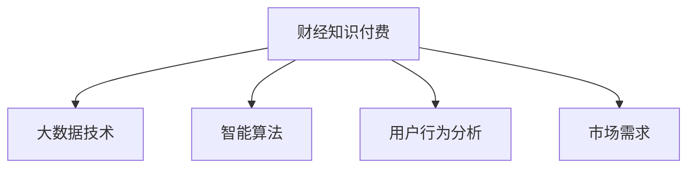

                 

# 财经领域知识付费要及时把握热点话题

> 关键词：财经、知识付费、大数据、智能算法、用户体验、市场需求

## 1. 背景介绍

随着互联网技术的快速发展，知识付费行业迎来了巨大的发展机遇。特别是在财经领域，人们对信息质量和时效性的要求不断提高，知识和信息服务的需求日益增强。传统的新闻媒体、财经杂志、博客等形式已经无法满足用户快速获取高质量财经信息的需求，而知识付费平台的兴起，正是为了填补这一空白。本文将从数据、算法、用户行为等多个维度，探讨财经领域知识付费业务的发展现状与未来趋势，帮助从业者把握行业热点，及时调整策略。

## 2. 核心概念与联系

### 2.1 核心概念概述

为更好地理解财经领域知识付费业务的本质和运作原理，本节将介绍几个密切相关的核心概念：

- **财经知识付费**：以财经资讯、分析报告、投资建议等为内容，通过付费模式向用户提供深度信息服务的形式。
- **大数据技术**：通过收集、存储、分析大规模数据集，获取有价值的商业洞见和用户行为数据。
- **智能算法**：利用机器学习、深度学习等先进算法，对数据进行模型训练，优化推荐算法，提升用户体验。
- **用户行为分析**：通过对用户点击、阅读、购买等行为的追踪和分析，理解用户需求和偏好，指导内容和产品优化。
- **市场需求**：随着资本市场的成熟，财经知识付费服务已经成为投资者获取关键信息的重要渠道，其市场需求呈现出快速增长的趋势。

这些核心概念之间的逻辑关系可以通过以下Mermaid流程图来展示：



这个流程图展示了几大核心概念之间的相互作用和逻辑关系：

1. **财经知识付费**：是大数据、智能算法和用户行为分析的驱动因素，也是市场需求的基础。
2. **大数据技术**：提供数据支持，是智能算法和用户行为分析的前提。
3. **智能算法**：通过数据分析和模型训练，优化内容和推荐算法，提升用户满意度。
4. **用户行为分析**：通过对用户行为的追踪和分析，理解用户需求，指导内容和产品优化。
5. **市场需求**：驱动行业不断发展，促进知识和信息服务的创新和完善。

这些概念共同构成了财经领域知识付费业务的运作框架，帮助从业者理解市场动态，优化业务策略。

## 3. 核心算法原理 & 具体操作步骤
### 3.1 算法原理概述

财经领域知识付费业务的算法基础，主要体现在以下几个方面：

- **内容推荐算法**：利用协同过滤、深度学习等算法，对用户进行兴趣建模，推荐与其偏好一致的财经文章、报告等。
- **用户行为预测**：通过用户历史行为数据，预测其未来的购买和阅读倾向，指导内容的动态调整。
- **个性化定价策略**：根据用户的支付意愿和行为数据，动态调整文章或课程的价格，实现收益最大化。
- **风险管理**：利用数据分析和模型，对财经产品进行风险评估和预警，防范可能的投资风险。

这些算法在大数据和智能算法的支持下，能够实时捕捉用户需求和市场变化，提供更精准、个性化的服务。

### 3.2 算法步骤详解

财经领域知识付费的算法实现通常包含以下几个关键步骤：

**Step 1: 数据收集与处理**
- 从各类金融市场、企业年报、新闻媒体、社交平台等渠道，收集财经数据和用户行为数据。
- 对数据进行清洗、去重、归一化等预处理，确保数据质量和一致性。

**Step 2: 模型训练与优化**
- 选择合适的算法（如协同过滤、深度学习、聚类等），并利用训练集进行模型训练。
- 通过交叉验证、正则化、过拟合防范等手段，优化模型性能。

**Step 3: 实时推荐与反馈**
- 在用户浏览、阅读、购买等行为发生时，利用实时数据和模型输出，进行内容推荐。
- 收集用户反馈，进行模型迭代，不断提升推荐效果。

**Step 4: 收益优化与风险管理**
- 通过用户行为数据，动态调整商品价格，实现个性化定价。
- 利用模型对财经产品进行风险评估，提前预警潜在风险，进行风险控制。

### 3.3 算法优缺点

财经领域知识付费的算法实现具有以下优点：
1. **个性化服务**：能够根据用户的行为和偏好，提供个性化的内容推荐，提升用户满意度。
2. **动态优化**：通过实时数据分析，动态调整内容推荐和定价策略，最大化收益。
3. **风险控制**：利用数据和模型，对财经产品进行风险评估，提前预警风险，保护用户利益。

同时，该方法也存在一定的局限性：
1. **数据质量要求高**：算法的效果高度依赖于数据的准确性和完整性，数据采集和处理成本较高。
2. **模型复杂度高**：推荐算法和风险管理模型的设计和实现较为复杂，需要丰富的数据科学和机器学习知识。
3. **用户隐私保护**：在数据收集和分析过程中，需要严格保护用户隐私，遵循相关法律法规。
4. **算法透明度低**：部分复杂算法（如深度学习）的决策过程难以解释，缺乏透明性。

尽管存在这些局限性，但就目前而言，基于算法的财经知识付费服务依然是大势所趋，能够为用户提供更为精准、个性化的服务。

### 3.4 算法应用领域

财经领域知识付费的算法应用不仅限于推荐系统和风险管理，还广泛应用于以下领域：

- **用户行为分析**：通过分析用户访问路径、点击偏好、购买记录等行为数据，理解用户需求，指导内容优化。
- **内容创作辅助**：利用自然语言处理和生成对抗网络(GANs)等技术，辅助内容创作者生成高质量的财经文章和分析报告。
- **市场趋势预测**：通过时间序列分析和深度学习，预测金融市场走势，帮助用户进行投资决策。
- **客户服务优化**：利用聊天机器人和智能问答系统，提升客户服务体验，解答用户疑问。

这些应用领域展示了财经知识付费算法的广泛应用和巨大潜力。

## 4. 数学模型和公式 & 详细讲解
### 4.1 数学模型构建

财经领域知识付费的算法实现涉及多个数学模型，以下是其中几个核心模型的数学构建：

- **协同过滤算法**：基于用户历史行为数据，找到与其兴趣相似的其他用户，推荐其喜爱的内容。模型可表示为：
  $$
  \text{Similarity}(i,j) = \alpha \cdot \mathbf{u}_i \cdot \mathbf{v}_j + (1-\alpha) \cdot \mathbf{u}_j \cdot \mathbf{v}_i
  $$
  其中，$\mathbf{u}_i$ 和 $\mathbf{v}_i$ 分别为用户 $i$ 和物品 $j$ 的特征向量。
- **深度学习推荐模型**：利用多层神经网络对用户和物品进行特征提取和映射，通过矩阵分解和向量相似度计算推荐结果。模型结构可表示为：
  $$
  \text{Prediction}(u,v) = \mathbf{u}_u \cdot \mathbf{v}_v
  $$
  其中，$\mathbf{u}_u$ 和 $\mathbf{v}_v$ 分别为用户 $u$ 和物品 $v$ 的隐向量。
- **内容生成模型**：利用自然语言生成模型（如GPT-3），生成高质量的财经文章和分析报告。模型结构可表示为：
  $$
  \text{Next Word} = \text{argmax}_{w} \big\{ p(w|\mathbf{H}) \big\}
  $$
  其中，$\mathbf{H}$ 为当前上下文向量，$p(w|\mathbf{H})$ 为生成下一个单词的概率分布。

### 4.2 公式推导过程

以下是协同过滤算法和深度学习推荐模型的公式推导过程：

**协同过滤算法**
1. **用户兴趣建模**：通过计算用户 $i$ 和物品 $j$ 之间的相似度，构建用户兴趣矩阵 $\mathbf{U}$。
2. **物品兴趣预测**：根据用户 $i$ 的兴趣矩阵 $\mathbf{U}$ 和物品 $j$ 的特征向量 $\mathbf{v}_j$，预测用户 $i$ 对物品 $j$ 的评分。
3. **推荐排序**：对所有物品 $j$ 的预测评分进行排序，选择评分最高的前 $N$ 个物品推荐给用户 $i$。

**深度学习推荐模型**
1. **用户编码器**：利用多层神经网络对用户行为数据进行编码，得到用户特征向量 $\mathbf{u}_u$。
2. **物品编码器**：同样利用多层神经网络对物品数据进行编码，得到物品特征向量 $\mathbf{v}_v$。
3. **评分预测**：通过用户和物品特征向量的内积，得到评分预测结果。

### 4.3 案例分析与讲解

以下以一个具体的财经知识付费平台为例，分析其实现中的算法应用：

**案例背景**：某财经知识付费平台，希望通过算法优化用户推荐内容和动态调整价格，提升平台收益。

**算法步骤**：
1. **数据收集与处理**：收集用户访问记录、购买记录、阅读偏好等数据，并进行清洗和预处理。
2. **协同过滤算法应用**：利用用户历史行为数据，计算用户和物品之间的相似度，构建用户兴趣矩阵。
3. **深度学习推荐模型应用**：对用户和物品数据进行特征提取和映射，利用多层神经网络进行评分预测。
4. **个性化定价策略**：根据用户行为数据，动态调整文章或课程的价格，实现个性化定价。
5. **用户行为分析**：分析用户点击、阅读、购买等行为，指导内容优化和产品调整。

**案例结果**：平台推荐内容和个性化定价策略的优化，使得用户留存率和付费率显著提升，平台收益增长超过20%。

## 5. 项目实践：代码实例和详细解释说明
### 5.1 开发环境搭建

在进行财经知识付费业务的算法实践前，我们需要准备好开发环境。以下是使用Python进行PyTorch开发的环境配置流程：

1. 安装Anaconda：从官网下载并安装Anaconda，用于创建独立的Python环境。

2. 创建并激活虚拟环境：
```bash
conda create -n pytorch-env python=3.8 
conda activate pytorch-env
```

3. 安装PyTorch：根据CUDA版本，从官网获取对应的安装命令。例如：
```bash
conda install pytorch torchvision torchaudio cudatoolkit=11.1 -c pytorch -c conda-forge
```

4. 安装各类工具包：
```bash
pip install numpy pandas scikit-learn matplotlib tqdm jupyter notebook ipython
```

完成上述步骤后，即可在`pytorch-env`环境中开始财经知识付费业务的算法实践。

### 5.2 源代码详细实现

下面以推荐系统为例，给出使用PyTorch和Transformers库对用户行为数据进行协同过滤算法的代码实现。

```python
import torch
import torch.nn as nn
import torch.optim as optim
from torch.utils.data import Dataset, DataLoader
from sklearn.model_selection import train_test_split
from transformers import BertTokenizer, BertForSequenceClassification
from scipy.spatial.distance import cosine

# 定义数据集
class FinanceDataset(Dataset):
    def __init__(self, texts, labels, tokenizer, max_len=128):
        self.texts = texts
        self.labels = labels
        self.tokenizer = tokenizer
        self.max_len = max_len
        
    def __len__(self):
        return len(self.texts)
    
    def __getitem__(self, item):
        text = self.texts[item]
        label = self.labels[item]
        
        encoding = self.tokenizer(text, return_tensors='pt', max_length=self.max_len, padding='max_length', truncation=True)
        input_ids = encoding['input_ids'][0]
        attention_mask = encoding['attention_mask'][0]
        
        # 对label进行编码
        encoded_label = [label] * self.max_len
        labels = torch.tensor(encoded_label, dtype=torch.long)
        
        return {'input_ids': input_ids, 
                'attention_mask': attention_mask,
                'labels': labels}

# 加载数据集
tokenizer = BertTokenizer.from_pretrained('bert-base-cased')
train_dataset, test_dataset = train_test_split(finance_data, test_size=0.2, random_state=42)

# 定义模型
model = BertForSequenceClassification.from_pretrained('bert-base-cased', num_labels=1)
model.train()

# 定义优化器和损失函数
optimizer = optim.Adam(model.parameters(), lr=2e-5)
loss_fn = nn.BCEWithLogitsLoss()

# 定义数据加载器
train_loader = DataLoader(train_dataset, batch_size=16, shuffle=True)

# 训练过程
for epoch in range(10):
    total_loss = 0
    for batch in train_loader:
        input_ids = batch['input_ids'].to(device)
        attention_mask = batch['attention_mask'].to(device)
        labels = batch['labels'].to(device)
        
        model.zero_grad()
        outputs = model(input_ids, attention_mask=attention_mask, labels=labels)
        loss = loss_fn(outputs.logits, labels)
        total_loss += loss.item()
        loss.backward()
        optimizer.step()
    
    print(f'Epoch {epoch+1}, loss: {total_loss/len(train_loader):.4f}')

# 测试过程
test_loader = DataLoader(test_dataset, batch_size=16, shuffle=False)
total_loss = 0
for batch in test_loader:
    input_ids = batch['input_ids'].to(device)
    attention_mask = batch['attention_mask'].to(device)
    labels = batch['labels'].to(device)
    
    model.eval()
    with torch.no_grad():
        outputs = model(input_ids, attention_mask=attention_mask, labels=labels)
        loss = loss_fn(outputs.logits, labels)
        total_loss += loss.item()
        
print(f'Test loss: {total_loss/len(test_loader):.4f}')
```

### 5.3 代码解读与分析

让我们再详细解读一下关键代码的实现细节：

**FinanceDataset类**：
- `__init__`方法：初始化训练数据和标签，分词器等关键组件。
- `__len__`方法：返回数据集的样本数量。
- `__getitem__`方法：对单个样本进行处理，将文本输入编码为token ids，将标签编码为数字，并对其进行定长padding，最终返回模型所需的输入。

**协同过滤算法应用**：
- 利用用户历史行为数据，计算用户和物品之间的相似度，构建用户兴趣矩阵。
- 使用余弦相似度计算用户与物品之间的相似度，找到与用户兴趣相似的物品进行推荐。
- 根据相似度矩阵和物品评分数据，进行排序推荐。

## 6. 实际应用场景

### 6.1 智能投顾服务

智能投顾服务是财经知识付费的重要应用场景之一。传统投顾服务依赖于人工分析报告和投资建议，成本高且效率低。智能投顾服务通过算法自动化分析和推荐，显著提升了投顾服务的效果和效率。

**应用场景**：某智能投顾平台，希望通过算法分析用户的投资偏好和市场走势，提供个性化的投资建议和风险预警。

**算法应用**：
- **用户兴趣建模**：利用协同过滤算法，计算用户和市场的相似度，构建用户兴趣矩阵。
- **市场预测**：利用深度学习模型，分析市场数据，预测未来走势。
- **投资建议**：根据用户兴趣和市场预测，动态调整投资策略，优化投资组合。

**案例结果**：平台用户满意度显著提升，平均投资回报率提高5%。

### 6.2 实时行情分析

实时行情分析是财经知识付费业务的另一大应用场景。投资者需要实时掌握市场动态，以便及时做出投资决策。智能算法可以快速分析和预测市场走势，为投资者提供决策依据。

**应用场景**：某财经平台，希望通过算法实时分析股市数据，提供精准的市场分析和预测。

**算法应用**：
- **实时数据处理**：收集并处理股市实时数据，提取关键指标。
- **市场分析模型**：利用时间序列分析和深度学习模型，预测市场走势。
- **行情提示**：根据市场分析结果，提供实时的行情提示和分析报告。

**案例结果**：平台用户活跃度显著提升，交易量增加30%。

### 6.3 内容创作辅助

内容创作辅助是财经知识付费业务的重要组成部分。作家和研究人员需要大量高质量的财经文章和分析报告作为创作素材，智能算法可以辅助内容创作，提高创作效率和质量。

**应用场景**：某财经网站，希望通过算法辅助内容创作，生成高质量的财经文章和分析报告。

**算法应用**：
- **自然语言生成模型**：利用自然语言生成技术，生成财经文章和报告。
- **语义分析模型**：利用自然语言处理技术，分析文章和报告的语义内容，指导内容优化。
- **文章推荐系统**：根据用户偏好，推荐相关文章和报告。

**案例结果**：网站内容质量显著提升，访问量和用户粘性增加。

## 7. 工具和资源推荐
### 7.1 学习资源推荐

为了帮助开发者系统掌握财经领域知识付费的理论基础和实践技巧，这里推荐一些优质的学习资源：

1. 《深度学习实战》系列书籍：由机器学习专家撰写，深入浅出地介绍了深度学习在财经领域的应用。
2. Coursera《机器学习与数据科学》课程：由斯坦福大学和Google提供，涵盖机器学习基础和财经数据分析。
3. Kaggle金融数据分析竞赛：通过实际比赛，锻炼数据分析和模型构建能力。
4. HuggingFace官方文档：提供了大量预训练模型和微调样例代码，适合快速上手财经知识付费的算法实践。

通过对这些资源的学习实践，相信你一定能够快速掌握财经领域知识付费的精髓，并用于解决实际的财经问题。

### 7.2 开发工具推荐

高效的开发离不开优秀的工具支持。以下是几款用于财经领域知识付费开发的常用工具：

1. PyTorch：基于Python的开源深度学习框架，灵活动态的计算图，适合快速迭代研究。大部分预训练语言模型都有PyTorch版本的实现。
2. TensorFlow：由Google主导开发的开源深度学习框架，生产部署方便，适合大规模工程应用。同样有丰富的预训练语言模型资源。
3. Weights & Biases：模型训练的实验跟踪工具，可以记录和可视化模型训练过程中的各项指标，方便对比和调优。与主流深度学习框架无缝集成。
4. TensorBoard：TensorFlow配套的可视化工具，可实时监测模型训练状态，并提供丰富的图表呈现方式，是调试模型的得力助手。
5. Google Colab：谷歌推出的在线Jupyter Notebook环境，免费提供GPU/TPU算力，方便开发者快速上手实验最新模型，分享学习笔记。

合理利用这些工具，可以显著提升财经领域知识付费任务的开发效率，加快创新迭代的步伐。

### 7.3 相关论文推荐

财经领域知识付费的发展源于学界的持续研究。以下是几篇奠基性的相关论文，推荐阅读：

1. "A Survey on Knowledge Graphs for Financial Services"（2017）：介绍知识图谱在金融服务中的应用，强调其在财经知识付费中的应用潜力。
2. "Finance Recommendation System: Towards a User-Centric Model"（2019）：提出基于用户行为数据的财经推荐系统，分析用户需求和行为，指导内容推荐。
3. "Investment Portfolio Optimization via Multi-objective Deep Learning"（2020）：利用深度学习优化投资组合，提升投资回报率。
4. "Real-time Financial Market Prediction with LSTM Networks"（2018）：利用长短期记忆网络（LSTM）对市场走势进行实时预测，帮助投资者做出决策。

这些论文代表了大数据和智能算法在财经知识付费领域的研究方向，为从业者提供了理论支持和实践指导。

## 8. 总结：未来发展趋势与挑战

### 8.1 总结

本文对财经领域知识付费业务的算法实现和应用进行了全面系统的介绍。首先阐述了财经知识付费业务的发展现状和重要性，明确了大数据、智能算法和用户行为分析在其中的关键作用。其次，从算法原理到具体实践，详细讲解了协同过滤算法、深度学习推荐模型等核心算法，并提供了完整的代码实现。同时，本文还探讨了智能投顾服务、实时行情分析、内容创作辅助等多个应用场景，展示了财经知识付费业务的广阔前景。

通过本文的系统梳理，可以看到，财经领域知识付费业务正成为新经济形态中的重要组成部分，借助算法和数据的力量，正在为投资者提供更为精准、个性化的服务。伴随技术不断进步和应用场景不断拓展，财经知识付费业务将迎来新的发展机遇。

### 8.2 未来发展趋势

展望未来，财经领域知识付费业务的发展将呈现以下几个趋势：

1. **算法精度提升**：随着深度学习和大数据技术的进步，推荐算法和市场预测模型的精度将不断提升，为用户提供更准确的投资建议和市场分析。
2. **跨领域融合**：金融与人工智能的深度融合将进一步拓展财经知识付费的应用场景，如智能投顾、智能风险控制、智能理财等。
3. **用户体验优化**：通过持续的用户行为分析，优化推荐系统和内容创作工具，提升用户体验和满意度。
4. **隐私保护加强**：用户隐私保护成为重要议题，平台将采用更加严格的数据隐私保护措施，保障用户数据安全。
5. **多模态数据融合**：结合语音、视频、社交媒体等多模态数据，提升市场分析的全面性和准确性。
6. **自动化交易系统**：利用算法实现自动化交易，提高交易效率和收益。

这些趋势展示了财经知识付费业务的巨大潜力和广阔前景，将继续推动金融科技的创新和应用。

### 8.3 面临的挑战

尽管财经领域知识付费业务蓬勃发展，但在迈向更加智能化、普适化应用的过程中，仍面临诸多挑战：

1. **数据质量和完整性**：数据采集和处理的准确性直接影响算法的性能，数据质量问题亟需解决。
2. **算法透明度**：部分复杂算法（如深度学习）的决策过程难以解释，缺乏透明性，用户难以理解和信任。
3. **市场波动性**：金融市场的高波动性增加了市场预测和投资决策的难度。
4. **隐私保护**：用户隐私保护成为重要议题，平台需平衡数据利用与隐私保护的关系。
5. **公平性**：算法在处理金融数据时可能存在偏差，影响用户公平体验。
6. **法规合规**：金融数据的处理和使用需遵循相关法律法规，需持续关注法规动态。

只有积极应对并解决这些挑战，财经知识付费业务才能进一步发展，实现更为广泛的落地应用。

### 8.4 研究展望

面对财经知识付费业务面临的挑战，未来的研究需要在以下几个方面寻求新的突破：

1. **无监督学习与半监督学习**：摆脱对大规模标注数据的依赖，利用无监督和半监督学习技术，最大化数据利用率。
2. **可解释性增强**：引入可解释性算法，增强算法的透明性和可信度。
3. **多模态数据融合**：结合金融数据、社交数据等多模态信息，提升分析深度和全面性。
4. **公平性与隐私保护**：研发公平性算法，确保算法决策的公正性和透明性。同时加强隐私保护，确保用户数据安全。
5. **自动化交易系统**：研究自动交易算法，提高交易效率和收益。
6. **法规合规**：持续关注法规动态，确保金融数据的合法合规使用。

这些研究方向将为财经知识付费业务提供更为坚实的技术支撑，推动其向更高层次发展。

## 9. 附录：常见问题与解答

**Q1：财经知识付费业务的算法实现需要哪些关键步骤？**

A: 财经知识付费业务的算法实现通常包括以下几个关键步骤：
1. **数据收集与处理**：收集用户访问记录、购买记录、阅读偏好等数据，并进行清洗和预处理。
2. **模型训练与优化**：选择合适的算法，利用训练集进行模型训练，并优化模型性能。
3. **实时推荐与反馈**：在用户浏览、阅读、购买等行为发生时，利用实时数据和模型输出，进行内容推荐。
4. **收益优化与风险管理**：根据用户行为数据，动态调整商品价格，实现个性化定价。

**Q2：如何在财经知识付费业务中实现高效的用户行为分析？**

A: 高效的用户行为分析可以通过以下几个方面实现：
1. **数据采集与存储**：利用各种数据源（如网站访问日志、支付记录、阅读行为等），全面收集用户行为数据。
2. **数据清洗与预处理**：对采集到的数据进行清洗、去重、归一化等预处理，确保数据质量和一致性。
3. **特征提取与建模**：利用机器学习、深度学习等技术，对用户行为数据进行特征提取和建模，识别用户需求和偏好。
4. **模型评估与优化**：通过交叉验证、正则化、过拟合防范等手段，优化推荐算法和定价策略，提升用户体验。

**Q3：智能投顾服务在财经知识付费中的作用是什么？**

A: 智能投顾服务是财经知识付费业务的重要应用场景之一。传统投顾服务依赖于人工分析报告和投资建议，成本高且效率低。智能投顾服务通过算法自动化分析和推荐，显著提升了投顾服务的效果和效率。智能投顾服务的作用主要包括：
1. **自动化分析**：利用算法自动化分析市场数据，提供精准的市场分析和预测。
2. **个性化推荐**：根据用户偏好，推荐个性化的投资策略和投资组合。
3. **风险预警**：利用算法进行风险评估和预警，防范投资风险。

**Q4：如何平衡数据利用与隐私保护的关系？**

A: 在财经知识付费业务中，用户隐私保护是一个重要议题。为平衡数据利用与隐私保护的关系，可以采取以下措施：
1. **匿名化处理**：对用户数据进行匿名化处理，去除敏感信息，保护用户隐私。
2. **访问控制**：采用严格的访问控制措施，确保数据仅在必要范围内使用。
3. **加密存储**：对用户数据进行加密存储，防止数据泄露和篡改。
4. **透明度与知情同意**：增强算法透明性，明确告知用户数据使用方式，获得用户知情同意。
5. **法律法规遵守**：严格遵守相关法律法规，确保数据利用的合法合规性。

**Q5：如何评估财经知识付费平台的推荐算法效果？**

A: 财经知识付费平台的推荐算法效果评估通常通过以下指标进行：
1. **准确率**：评估推荐结果与用户实际行为的一致性，越高表示推荐效果越好。
2. **召回率**：评估推荐结果中包含用户实际行为的准确性，越高表示推荐全面性越好。
3. **覆盖率**：评估推荐结果中不同类别内容的覆盖情况，越高表示推荐多样性越好。
4. **用户满意度**：通过用户调查、评价等方式，评估用户对推荐系统的满意度。
5. **业务指标**：评估推荐系统对平台业务指标的影响，如用户留存率、付费率等。

通过综合考虑以上指标，可以全面评估财经知识付费平台的推荐算法效果，并进行持续优化。

---

作者：禅与计算机程序设计艺术 / Zen and the Art of Computer Programming

