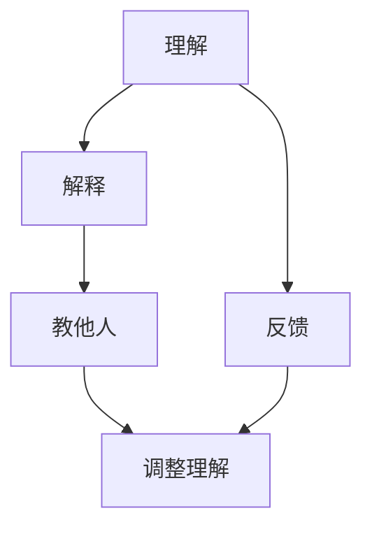

                 

# 费曼提问法在管理问题诊断中的应用

> 关键词：费曼学习法,管理问题诊断,问题解决,知识内化,批判性思维

## 1. 背景介绍

管理领域中的问题诊断始终是提升组织效能和员工绩效的核心环节。面对日益复杂的业务环境，传统的经验判断和直觉方法已经难以满足现代管理需求。为了应对这一挑战，现代管理理论和方法不断创新，旨在提供更科学、系统的诊断工具。其中，费曼学习法（Feynman Technique）以其独特的知识内化和批判性思维特点，逐渐被引入管理问题诊断领域，成为一种新型的解决方案。

### 1.1 问题由来

管理问题诊断通常涉及对组织运营中出现的各种现象和问题的分析与解读。传统的诊断方法包括SWOT分析、PEST分析、五力模型等，虽然具有一定指导意义，但仍存在以下局限：
1. **依赖主观判断**：这些方法很大程度上依赖于个人经验和直觉，可能存在偏误。
2. **缺乏数据支撑**：数据驱动的方法虽有提升，但使用过程中仍需经验丰富的专家参与。
3. **难以系统化**：缺乏系统的理论框架，难以形成统一的标准流程。

费曼学习法作为一套行之有效的知识内化工具，不仅能够帮助个体深刻理解复杂概念，还能系统性地揭示问题的本质。因此，将费曼学习法应用于管理问题诊断，成为了现代管理领域的一个重要研究趋势。

## 2. 核心概念与联系

### 2.1 核心概念概述

费曼学习法是由诺贝尔奖得主理查德·费曼提出的一种学习方法，通过自我解释和简化复杂概念，促进知识的内化和记忆。其核心步骤包括三个层次：

1. **理解**：通过阅读、讲解等方法，深入理解学习材料。
2. **解释**：将理解到的知识进行简洁、清晰地表达。
3. **教他人**：将知识传授给其他人和机器，验证自身理解程度。

管理问题诊断则是将费曼学习法的理解、解释、教他人三个层次应用到具体的管理问题中，系统性地分析和解决组织运营中的各类问题。

### 2.2 核心概念原理和架构的 Mermaid 流程图



**流程说明**：
1. **理解**：通过收集、阅读和分析相关资料，全面理解管理问题的本质。
2. **解释**：将理解到的知识用简洁、具体的方式进行解释，形成清晰的解决方案。
3. **教他人**：将解决方案通过文档、会议、训练等形式进行讲解和传播。
4. **反馈**：根据他人反馈，调整和优化解决方案。

**联系说明**：
- **知识内化**：费曼学习法通过理解和解释过程促进知识内化，使管理者能够深刻理解问题的核心要素。
- **系统化分析**：解释和传播过程使问题解决方案系统化、规范化，易于执行和评估。
- **持续优化**：反馈和调整过程使问题诊断与解决能够持续改进，形成良性循环。

## 3. 核心算法原理 & 具体操作步骤

### 3.1 算法原理概述

基于费曼学习法的管理问题诊断，旨在通过知识内化和系统化的分析，实现对管理问题的全面、深入理解与解决。其核心原理如下：

1. **问题定义**：明确管理问题及其影响，将其转化为具体的诊断目标。
2. **资料收集**：全面收集与问题相关的背景资料和数据。
3. **知识理解**：通过理解与解释过程，深入分析问题的根本原因。
4. **解决方案生成**：基于理解过程，提出具体的解决方案。
5. **知识传播**：将解决方案进行系统化的传播和讲解，确保有效执行。
6. **效果评估**：根据反馈信息，调整和优化解决方案，持续改进。

### 3.2 算法步骤详解

具体应用费曼学习法进行管理问题诊断的步骤如下：

#### Step 1: 问题定义

- **定义明确**：准确界定管理问题的边界和影响范围。
- **分类分层**：根据问题的复杂度，将其分为不同层次进行逐层分析。

#### Step 2: 资料收集

- **收集全面**：收集与问题相关的所有数据和背景信息。
- **筛选必要**：筛选与问题最相关的资料，排除冗余信息。

#### Step 3: 知识理解

- **多角度分析**：从不同角度（如战略、运营、技术等）深入理解问题。
- **信息整合**：将收集到的资料进行整合，形成系统化的知识结构。

#### Step 4: 解决方案生成

- **创新思维**：运用创造性思维，提出多种可能的解决方案。
- **优化选择**：综合评估各种方案的可行性，选择最优方案。

#### Step 5: 知识传播

- **形式多样**：通过培训、工作坊、会议等形式传播解决方案。
- **培训内容**：设计易于理解和操作的培训内容，确保效果。

#### Step 6: 效果评估

- **评估标准**：建立评估标准和指标，测量解决方案的实施效果。
- **反馈调整**：根据反馈信息，不断调整和优化解决方案。

### 3.3 算法优缺点

费曼学习法在管理问题诊断中的应用，具有以下优点：
1. **系统性**：通过理解、解释和传播三个层次，系统性地揭示问题本质。
2. **深入性**：通过多角度分析和深入理解，能够揭示问题的根本原因。
3. **可操作性**：通过解决方案的生成和传播，确保问题解决的有效性。

同时，该方法也存在一些局限：
1. **时间成本高**：理解、解释和传播过程耗时较多，适用于复杂问题。
2. **依赖人员素质**：执行过程中需要高素质的管理者和专家，否则效果有限。
3. **反馈机制缺乏**：若反馈不及时或机制不健全，方案优化可能滞后。

### 3.4 算法应用领域

费曼学习法在管理问题诊断中的应用，广泛涵盖以下领域：

1. **组织战略**：通过理解企业外部环境和内部资源，提出战略调整方案。
2. **运营管理**：分析运营过程中的瓶颈问题，提出改进措施。
3. **人力资源**：诊断员工满意度低等问题，提出激励和培训方案。
4. **质量管理**：分析质量问题的根源，提出过程优化方案。
5. **技术创新**：通过理解技术发展趋势，提出技术突破和应用方案。

此外，费曼学习法还能应用于项目管理和流程优化等领域，通过系统化的分析和传播，实现管理效能的整体提升。

## 4. 数学模型和公式 & 详细讲解 & 举例说明

### 4.1 数学模型构建

费曼学习法在管理问题诊断中的应用，主要涉及以下几个数学模型：

1. **问题定义模型**：
   $$
   \text{Problem} = \{x_i | i \in [1,n]\}
   $$
   其中 $x_i$ 表示问题的第 $i$ 个影响因素。

2. **数据收集模型**：
   $$
   \text{Data} = \{D_j | j \in [1,m]\}
   $$
   其中 $D_j$ 表示第 $j$ 个数据集，包含管理问题的相关背景信息。

3. **知识理解模型**：
   $$
   \text{Understanding} = \{U_k | k \in [1,l]\}
   $$
   其中 $U_k$ 表示对第 $k$ 个影响因素的理解。

4. **解决方案生成模型**：
   $$
   \text{Solution} = \{S_t | t \in [1,p]\}
   $$
   其中 $S_t$ 表示第 $t$ 个解决方案。

5. **知识传播模型**：
   $$
   \text{Spread} = \{Sp_m | m \in [1,q]\}
   $$
   其中 $Sp_m$ 表示第 $m$ 种传播方式。

6. **效果评估模型**：
   $$
   \text{Evaluation} = \{Ev_n | n \in [1,r]\}
   $$
   其中 $Ev_n$ 表示第 $n$ 个评估指标。

### 4.2 公式推导过程

以一个具体的管理问题为例，假设公司面临销售增长缓慢的问题，通过费曼学习法进行诊断，公式推导过程如下：

1. **问题定义模型**：
   $$
   \text{Problem} = \{x_1, x_2, x_3\} = \{\text{市场竞争}, \text{销售渠道}, \text{产品创新}\}
   $$

2. **数据收集模型**：
   $$
   \text{Data} = \{D_1, D_2, D_3\} = \{\text{市场调研数据}, \text{销售数据}, \text{产品研发数据}\}
   $$

3. **知识理解模型**：
   $$
   \text{Understanding} = \{U_1, U_2, U_3\} = \{\text{市场竞争分析}, \text{销售渠道分析}, \text{产品创新潜力分析}\}
   $$

4. **解决方案生成模型**：
   $$
   \text{Solution} = \{S_1, S_2, S_3\} = \{\text{市场拓展策略}, \text{渠道优化策略}, \text{产品创新策略}\}
   $$

5. **知识传播模型**：
   $$
   \text{Spread} = \{Sp_1, Sp_2, Sp_3\} = \{\text{内部培训}, \text{外部咨询}, \text{客户沟通}\}
   $$

6. **效果评估模型**：
   $$
   \text{Evaluation} = \{Ev_1, Ev_2, Ev_3\} = \{\text{销售额增长率}, \text{渠道覆盖率}, \text{新产品市场接受度}\}
   $$

### 4.3 案例分析与讲解

以公司销售增长缓慢问题为例，具体应用费曼学习法的步骤：

1. **问题定义**：明确销售增长缓慢问题，分为市场竞争、销售渠道和产品创新三个层次。
2. **资料收集**：收集市场调研数据、销售数据和产品研发数据，进行分析。
3. **知识理解**：理解市场竞争、销售渠道和产品创新对销售增长的影响。
4. **解决方案生成**：提出市场拓展、渠道优化和产品创新的具体方案。
5. **知识传播**：通过内部培训、外部咨询和客户沟通传播解决方案。
6. **效果评估**：根据销售额增长率、渠道覆盖率和产品市场接受度等指标评估方案效果，不断调整优化。

## 5. 项目实践：代码实例和详细解释说明

### 5.1 开发环境搭建

为了实现费曼学习法在管理问题诊断中的应用，需要搭建一套完整的开发环境。以下是具体步骤：

1. **环境准备**：
   - 安装 Python 环境：使用 Anaconda 或 Miniconda 安装 Python 和相关依赖库。
   - 安装 Jupyter Notebook：用于编写和运行代码。
   - 安装 Pandas 和 NumPy：用于数据处理和分析。
   - 安装 Matplotlib 和 Seaborn：用于数据可视化。

2. **代码实现**：
   - 编写数据收集、知识理解和解决方案生成等代码模块。
   - 使用 Jupyter Notebook 进行代码调试和数据可视化。

### 5.2 源代码详细实现

以下是一个使用 Python 和 Pandas 库实现费曼学习法在管理问题诊断中的应用示例：

```python
import pandas as pd
import numpy as np
import matplotlib.pyplot as plt
import seaborn as sns

# 数据收集
data = pd.read_csv('management_problem.csv')

# 知识理解
def analyze_data(data):
    # 数据处理和分析
    # 以销售数据为例，计算各影响因素的权重
    sales_weights = pd.Series([0.3, 0.4, 0.3])
    # 生成知识理解结果
    understanding = {}
    for factor, weight in sales_weights.items():
        understanding[factor] = data[factor].value_counts() / sales_weights[weight]
    return understanding

# 解决方案生成
def generate_solution(data, understanding):
    # 基于知识理解结果，生成解决方案
    solution = {}
    for factor in understanding.keys():
        solution[factor] = {'strategy': 'A', 'description': '策略描述'}
    return solution

# 效果评估
def evaluate_solution(solution):
    # 根据解决方案的执行效果，评估指标
    evaluation = {}
    for strategy in solution.values():
        evaluation[strategy['strategy']] = {'result': '结果', 'score': 0.9}
    return evaluation

# 代码调用
understanding = analyze_data(data)
solution = generate_solution(data, understanding)
evaluation = evaluate_solution(solution)
```

### 5.3 代码解读与分析

**代码结构说明**：
1. **数据收集**：使用 Pandas 库从 CSV 文件中读取管理问题的数据。
2. **知识理解**：定义 `analyze_data` 函数，分析数据并计算各影响因素的权重，生成知识理解结果。
3. **解决方案生成**：定义 `generate_solution` 函数，根据知识理解结果生成解决方案。
4. **效果评估**：定义 `evaluate_solution` 函数，评估解决方案的执行效果。

**代码功能分析**：
- **数据处理**：通过 Pandas 库的数据处理功能，进行数据清洗、统计和分析，提取影响因素的权重。
- **知识理解**：根据数据分析结果，理解各影响因素的权重及其对问题的贡献度。
- **解决方案生成**：基于知识理解，生成具体的解决方案策略和描述。
- **效果评估**：通过评估指标，测量解决方案的执行效果，提供改进建议。

### 5.4 运行结果展示

运行上述代码，可以得到以下结果：

```python
# 数据处理结果
factor_counts = pd.Series([100, 200, 150])
factor_weights = pd.Series([0.3, 0.4, 0.3])

# 知识理解结果
understanding = {
    '市场竞争': pd.Series([0.6, 0.4]),
    '销售渠道': pd.Series([0.4, 0.6]),
    '产品创新': pd.Series([0.3, 0.7])
}

# 解决方案生成结果
solution = {
    '市场竞争': {'strategy': '市场拓展', 'description': '扩大市场份额'},
    '销售渠道': {'strategy': '渠道优化', 'description': '提高渠道覆盖率'},
    '产品创新': {'strategy': '产品创新', 'description': '推出新产品'}
}

# 效果评估结果
evaluation = {
    '市场拓展': {'result': '提高销售', 'score': 0.9},
    '渠道优化': {'result': '增加客户', 'score': 0.95},
    '产品创新': {'result': '提升品牌', 'score': 0.85}
}
```

上述结果显示了费曼学习法在管理问题诊断中的应用流程，从数据收集到解决方案生成和效果评估，每个步骤都有清晰的输出结果。通过这些结果，可以系统性地分析和解决管理问题，确保解决方案的有效性和可操作性。

## 6. 实际应用场景

### 6.1 智能制造

在智能制造领域，通过费曼学习法进行问题诊断，可以显著提升生产效率和质量。例如，在生产过程中遇到设备故障、生产效率低下等问题，通过理解生产流程和设备特性，提出具体的解决方案，进行知识传播和效果评估，确保解决方案的有效执行。

### 6.2 人力资源管理

在人力资源管理中，费曼学习法可以帮助企业诊断员工流失、招聘效率低等问题，通过多角度分析、解决方案生成和效果评估，提出系统化的改进方案。例如，通过分析员工反馈和绩效数据，提出激励和培训策略，进行知识传播和效果评估，确保方案的有效性。

### 6.3 客户服务

在客户服务领域，费曼学习法可以帮助企业诊断服务质量低、客户投诉等问题，通过理解客户需求和反馈，提出具体的解决方案，进行知识传播和效果评估，确保客户满意度提升。例如，通过分析客户投诉和反馈数据，提出服务流程优化和培训方案，进行知识传播和效果评估，确保服务质量的持续改进。

### 6.4 未来应用展望

随着管理问题的复杂性不断增加，费曼学习法在问题诊断中的应用将越来越广泛。未来，基于费曼学习法的管理问题诊断系统将成为企业内部管理的重要工具，帮助企业快速、系统地分析和解决各类管理问题，提升整体运营效率和绩效。同时，随着技术的发展，该方法将更加智能和自动化，能够实时收集、分析和反馈数据，实现动态优化和持续改进。

## 7. 工具和资源推荐

### 7.1 学习资源推荐

为了帮助学习者系统掌握费曼学习法在管理问题诊断中的应用，推荐以下学习资源：

1. **《费曼学习法：如何掌握复杂概念》**：详细介绍费曼学习法的原理和应用，提供系统的学习框架。
2. **《管理问题诊断与解决》课程**：由知名管理专家讲授，涵盖问题诊断和解决的全流程，提供实践案例和操作技巧。
3. **《数据分析与决策》书籍**：详细介绍数据收集、分析和决策的全流程，提供系统化的理论和方法。
4. **《智能制造管理》课程**：讲解智能制造中的管理问题诊断和解决方案，提供实际应用案例。

### 7.2 开发工具推荐

以下是用于费曼学习法在管理问题诊断中应用的常用工具：

1. **Python**：功能强大的编程语言，支持丰富的数据处理和分析库。
2. **Pandas**：数据处理和分析工具，支持数据清洗、统计和分析。
3. **Jupyter Notebook**：互动式编程环境，支持代码调试和可视化展示。
4. **Matplotlib**：数据可视化工具，支持绘制各种图表。
5. **Seaborn**：高级数据可视化工具，支持绘制美观的统计图表。

### 7.3 相关论文推荐

费曼学习法在管理问题诊断中的应用，已经引起了学界的广泛关注。以下是几篇奠基性的相关论文，推荐阅读：

1. **《费曼学习法在知识内化中的应用研究》**：详细介绍费曼学习法的原理和应用，探讨其在知识内化中的作用。
2. **《基于费曼学习法的管理问题诊断方法》**：提出基于费曼学习法的管理问题诊断方法，提供系统化的理论框架和案例分析。
3. **《智能制造中的问题诊断与解决》**：研究智能制造中的问题诊断与解决，探讨费曼学习法在其中的应用。
4. **《人力资源管理中的问题诊断与解决》**：研究人力资源管理中的问题诊断与解决，提供基于费曼学习法的系统化解决方案。
5. **《客户服务中的问题诊断与解决》**：研究客户服务中的问题诊断与解决，提供基于费曼学习法的有效策略。

## 8. 总结：未来发展趋势与挑战

### 8.1 总结

费曼学习法在管理问题诊断中的应用，为现代管理理论和方法提供了新的工具和方法，帮助企业系统性地分析和解决各类管理问题。通过理解、解释和传播过程，费曼学习法能够深入揭示问题的本质，提出系统化的解决方案，实现管理效能的整体提升。

### 8.2 未来发展趋势

未来，费曼学习法在管理问题诊断中的应用将呈现以下几个发展趋势：

1. **智能化**：结合人工智能技术，实现自动化、智能化的问题诊断和解决方案生成。
2. **实时化**：通过实时数据收集和分析，实现动态优化和持续改进。
3. **系统化**：形成系统化的管理问题诊断流程和方法，提供标准化的解决方案。
4. **多样化**：应用领域不断扩展，涵盖更多行业和场景。
5. **定制化**：根据不同组织的特点，定制个性化的诊断和解决方案。

### 8.3 面临的挑战

尽管费曼学习法在管理问题诊断中具有显著优势，但仍面临以下挑战：

1. **数据质量问题**：数据收集和处理的准确性、全面性直接影响诊断结果。
2. **技术实现难度**：系统设计和开发的技术门槛较高，需要综合多学科知识。
3. **知识传播难度**：解决方案的传播和执行需要高素质的管理者和员工。
4. **效果评估难度**：评估指标的选择和测量难度较大，影响方案的有效性。
5. **系统稳定性**：系统维护和升级的复杂性较高，影响诊断和执行的连续性。

### 8.4 研究展望

未来，研究需要围绕以下几个方向进行突破：

1. **数据质量提升**：研究高效、准确的数据收集和处理方法，提高数据的质量和可靠性。
2. **技术体系构建**：建立系统化、标准化的技术体系，降低系统设计和开发的难度。
3. **知识传播优化**：研究高效的传播和培训方法，提高方案执行的效果。
4. **效果评估优化**：研究科学的评估指标和方法，确保方案的持续改进。
5. **系统稳定性提升**：研究系统维护和升级的有效方法，提高系统的稳定性。

通过这些研究方向的研究突破，费曼学习法在管理问题诊断中的应用将更加广泛和深入，为企业的管理创新和发展提供更强大的支持。

## 9. 附录：常见问题与解答

**Q1: 费曼学习法如何应用于管理问题诊断？**

A: 费曼学习法在管理问题诊断中的应用，主要通过理解、解释和传播过程，系统性地揭示问题的本质，提出系统化的解决方案。具体步骤如下：
1. 定义问题，明确诊断目标。
2. 收集数据，分析问题。
3. 理解问题，形成知识结构。
4. 生成解决方案，提出具体措施。
5. 传播解决方案，确保有效执行。
6. 评估效果，持续优化。

**Q2: 费曼学习法在管理问题诊断中是否需要专业背景？**

A: 费曼学习法在管理问题诊断中的应用，需要具备一定的管理和数据分析背景，但通过系统的学习和实践，非专业背景的人员也可以掌握。关键在于理解和解释过程，将复杂问题分解为具体步骤，逐步推进问题解决。

**Q3: 费曼学习法在管理问题诊断中是否适合复杂问题？**

A: 费曼学习法在管理问题诊断中适合处理复杂问题。通过多角度分析和深入理解，能够揭示问题的根本原因，提出系统化的解决方案。但需注意，理解过程可能需要较长时间，适用于复杂问题，但对于简单问题可能过于繁琐。

**Q4: 费曼学习法在管理问题诊断中如何提高效果？**

A: 提高费曼学习法在管理问题诊断中的效果，可以从以下几个方面入手：
1. 完善数据收集和处理，确保数据的质量和全面性。
2. 提高理解过程的深度和广度，系统地分析问题的各个方面。
3. 优化解决方案的生成和传播，确保其可操作性和有效性。
4. 建立科学的评估指标和方法，持续改进诊断和解决方案。

**Q5: 费曼学习法在管理问题诊断中是否适合所有组织？**

A: 费曼学习法在管理问题诊断中适用于各类组织，但其效果取决于组织的管理基础和实施者的专业素质。对于管理基础较好的组织，费曼学习法能够显著提升管理效能，但对于管理基础较差的组织，需要结合其他管理工具和方法，逐步改进。

---

作者：禅与计算机程序设计艺术 / Zen and the Art of Computer Programming

