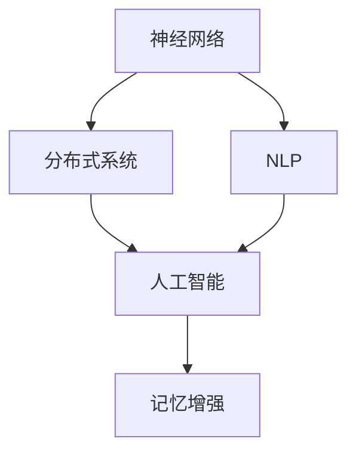

                 

# 赋予应用记忆的能力：Memory

> 关键词：记忆增强、神经网络、分布式系统、人工智能、自然语言处理(NLP)

## 1. 背景介绍

在现代信息技术的世界里，如何有效地存储、管理和利用数据是至关重要的。随着数据量的爆炸式增长，传统的数据库和存储技术已难以满足需求。而神经网络在人工智能(AI)领域的应用，特别是其在深度学习模型中的广泛应用，为解决这些问题提供了新的思路。本文将探讨如何在神经网络模型中赋予应用记忆的能力，并讨论其核心概念与联系、算法原理及操作步骤、数学模型与公式、项目实践及应用场景、工具与资源推荐以及未来发展趋势与挑战。

## 2. 核心概念与联系

### 2.1 核心概念概述

要理解如何赋予应用记忆的能力，我们需要先了解一些核心概念。

- **神经网络(Neural Network)**：由大量人工神经元(节点)构成的图结构，用于处理各种数据和任务。
- **分布式系统(Distributed System)**：将任务分散到多个计算节点上进行处理，以提高计算效率和系统可扩展性。
- **人工智能(AI)**：使机器能够执行通常需要人类智能的任务，包括学习、推理、感知等。
- **自然语言处理(NLP)**：使计算机能够理解和处理人类语言的技术。
- **记忆增强(Memory Augmentation)**：通过增强模型的记忆能力，提高其学习和推理效率。

这些概念之间存在着紧密的联系。例如，神经网络可以通过分布式系统来处理大规模数据集，人工智能则依赖神经网络来实现各种任务，而NLP是人工智能中的一个重要分支，通过记忆增强可以提高模型的语言理解和生成能力。

### 2.2 核心概念原理和架构的 Mermaid 流程图



这个流程图展示了神经网络、分布式系统、人工智能、自然语言处理和记忆增强之间的联系。其中，神经网络通过分布式系统来处理大规模数据集，而人工智能依赖神经网络来实现各种任务，NLP作为AI的一个重要分支，通过记忆增强来提高语言理解和生成能力。

## 3. 核心算法原理 & 具体操作步骤

### 3.1 算法原理概述

记忆增强是通过在神经网络模型中添加额外的存储单元，来增强模型的记忆能力。这些存储单元通常被称为“记忆模块”或“记忆细胞”，它们可以记录和存储历史信息，并在后续计算中重用这些信息。通过记忆增强，模型可以更好地捕捉和利用长时依赖关系，从而提高其学习和推理能力。

### 3.2 算法步骤详解

#### 3.2.1 选择记忆模块

选择合适的记忆模块是记忆增强的重要一步。常用的记忆模块包括：

- **序列到序列(S2S)**：用于处理序列到序列的问题，如机器翻译、对话系统等。
- **记忆网络(Memory Network)**：用于处理基于知识库的问题，如问答系统、推理系统等。
- **神经图网络(Neural Graph Network)**：用于处理图形结构数据，如社交网络、蛋白质结构等。

#### 3.2.2 设计存储机制

设计有效的存储机制，是记忆增强的核心。常用的存储机制包括：

- **向量模块(Scalar Module)**：将每个记忆模块存储为一个向量，通过向量运算来实现记忆的读写和更新。
- **哈希表(Hash Table)**：将记忆模块存储在哈希表中，通过哈希函数的计算来快速访问和更新。
- **链表(Linked List)**：将记忆模块存储在链表中，通过指针操作来实现记忆的读写和更新。

#### 3.2.3 实现记忆读写

实现记忆模块的读写操作，是记忆增强的实际执行步骤。常用的读写操作包括：

- **读取操作**：从记忆模块中读取数据，可以用于预测或推理。
- **写入操作**：向记忆模块中写入数据，可以用于记忆更新或学习。
- **删除操作**：从记忆模块中删除数据，可以用于记忆清理或优化。

#### 3.2.4 集成记忆模块

将记忆模块集成到神经网络中，是记忆增强的最终步骤。常用的集成方式包括：

- **串联(Concatenation)**：将记忆模块的输出与神经网络的输出相加，实现信息的融合。
- **并联(Parallelization)**：将记忆模块与神经网络并行计算，提高计算效率。
- **融合(Fusion)**：将记忆模块与神经网络深度融合，实现更高效的模型结构。

### 3.3 算法优缺点

#### 3.3.1 优点

- **提高记忆能力**：通过记忆增强，模型可以更好地捕捉和利用长时依赖关系，提高其学习和推理能力。
- **减少计算量**：通过记忆模块的存储和重用，可以降低计算量，提高计算效率。
- **增强模型泛化能力**：通过记忆增强，模型可以更好地泛化到不同的数据集和任务中。

#### 3.3.2 缺点

- **增加模型复杂度**：记忆模块的引入会增加模型的复杂度，可能导致模型难以训练。
- **存储开销大**：记忆模块的存储开销较大，可能导致内存不足或存储成本增加。
- **可解释性差**：记忆模块的复杂结构可能导致模型难以解释，影响模型的可解释性。

### 3.4 算法应用领域

记忆增强在人工智能的各个领域都有广泛应用，如：

- **自然语言处理(NLP)**：用于提高语言模型和对话系统的记忆能力，实现更好的文本理解和生成。
- **计算机视觉(CV)**：用于提高图像识别和生成的记忆能力，实现更好的图像分类和生成。
- **语音识别(SR)**：用于提高语音识别和生成的记忆能力，实现更好的语音识别和合成。
- **推荐系统(Recommendation System)**：用于提高推荐系统的记忆能力，实现更好的用户推荐。
- **时间序列分析(Time Series Analysis)**：用于提高时间序列预测的精度和泛化能力，实现更好的预测结果。

## 4. 数学模型和公式 & 详细讲解 & 举例说明

### 4.1 数学模型构建

记忆增强的数学模型通常包括：

- **输入层(Input Layer)**：用于接收输入数据，如文本、图像、语音等。
- **隐藏层(Hidden Layer)**：用于对输入数据进行处理，提取特征。
- **记忆模块(Memory Module)**：用于存储和更新记忆，实现记忆增强。
- **输出层(Output Layer)**：用于输出结果，如预测、分类、生成等。

### 4.2 公式推导过程

#### 4.2.1 序列到序列(S2S)

序列到序列模型的数学公式如下：

$$
\begin{aligned}
\boldsymbol{h}_t &= f(\boldsymbol{x}_t, \boldsymbol{h}_{t-1}, \boldsymbol{c}_{t-1}) \\
\boldsymbol{c}_t &= \text{Attention}(\boldsymbol{h}_t, \boldsymbol{c}_{t-1}) \\
\boldsymbol{y}_t &= g(\boldsymbol{c}_t, \boldsymbol{h}_t)
\end{aligned}
$$

其中，$\boldsymbol{h}_t$ 表示当前时刻的隐藏状态，$\boldsymbol{x}_t$ 表示当前时刻的输入，$\boldsymbol{c}_t$ 表示当前时刻的记忆状态，$\boldsymbol{y}_t$ 表示当前时刻的输出。$\text{Attention}$ 表示注意力机制，$f$ 和 $g$ 表示不同层的变换函数。

#### 4.2.2 记忆网络(Memory Network)

记忆网络的数学公式如下：

$$
\begin{aligned}
\boldsymbol{h}_t &= f(\boldsymbol{x}_t, \boldsymbol{h}_{t-1}, \boldsymbol{c}_{t-1}) \\
\boldsymbol{c}_t &= \text{Attention}(\boldsymbol{h}_t, \boldsymbol{M}) \\
\boldsymbol{y}_t &= g(\boldsymbol{c}_t, \boldsymbol{h}_t)
\end{aligned}
$$

其中，$\boldsymbol{M}$ 表示知识库，$\boldsymbol{x}_t$ 表示当前时刻的输入，$\boldsymbol{c}_t$ 表示当前时刻的记忆状态，$\boldsymbol{y}_t$ 表示当前时刻的输出。

### 4.3 案例分析与讲解

#### 4.3.1 案例一：机器翻译

机器翻译是序列到序列模型的典型应用。在机器翻译任务中，源语言文本序列和目标语言文本序列分别为输入和输出，通过记忆模块可以更好地捕捉和利用长时依赖关系，提高翻译精度。

#### 4.3.2 案例二：问答系统

问答系统是记忆网络的典型应用。在问答系统任务中，用户问题为输入，知识库为记忆模块，模型通过读取知识库中的信息，进行推理和生成，得到最终答案。

## 5. 项目实践：代码实例和详细解释说明

### 5.1 开发环境搭建

要实现记忆增强，首先需要搭建一个开发环境。常用的开发工具包括：

- **Python**：用于编写和执行代码，是深度学习的主流语言。
- **TensorFlow**：用于构建和训练神经网络模型，提供了丰富的API和工具。
- **PyTorch**：用于构建和训练神经网络模型，提供了动态图机制和高效的计算图优化。
- **Keras**：用于构建和训练神经网络模型，提供了高层API和可视化界面。

### 5.2 源代码详细实现

#### 5.2.1 实现序列到序列(S2S)

```python
import tensorflow as tf
from tensorflow.keras.layers import Input, LSTM, Dense, Dot, Concatenate

# 定义模型结构
input_layer = Input(shape=(max_len,), dtype='int32')
encoder_hidden = LSTM(256)(input_layer)
memory_cell = Dot(axes=[2, 1])([encoder_hidden, encoder_hidden])
decoder_input = Input(shape=(max_len,), dtype='int32')
decoder_hidden = LSTM(256)(decoder_input, return_sequences=True)
output = Dense(num_classes, activation='softmax')(tf.concat([memory_cell, decoder_hidden[1]], axis=-1))

# 编译模型
model = tf.keras.Model(inputs=[input_layer, decoder_input], outputs=output)
model.compile(optimizer='adam', loss='sparse_categorical_crossentropy', metrics=['accuracy'])
```

#### 5.2.2 实现记忆网络(Memory Network)

```python
import tensorflow as tf
from tensorflow.keras.layers import Input, LSTM, Dense, Attention, Concatenate

# 定义模型结构
input_layer = Input(shape=(max_len,), dtype='int32')
encoder_hidden = LSTM(256)(input_layer)
memory_cell = Attention()([encoder_hidden, memory])
decoder_input = Input(shape=(max_len,), dtype='int32')
decoder_hidden = LSTM(256)(decoder_input, return_sequences=True)
output = Dense(num_classes, activation='softmax')(tf.concat([memory_cell, decoder_hidden[1]], axis=-1))

# 编译模型
model = tf.keras.Model(inputs=[input_layer, decoder_input, memory], outputs=output)
model.compile(optimizer='adam', loss='sparse_categorical_crossentropy', metrics=['accuracy'])
```

### 5.3 代码解读与分析

#### 5.3.1 代码实现

通过上述代码，我们可以看到，实现记忆增强的过程包括：

- **输入层**：用于接收输入数据。
- **隐藏层**：用于处理输入数据，提取特征。
- **记忆模块**：用于存储和更新记忆，实现记忆增强。
- **输出层**：用于输出结果。

#### 5.3.2 代码优化

在实际应用中，需要对代码进行优化，以提高计算效率和模型性能。例如，可以使用GPU加速计算，使用批量归一化(Batch Normalization)技术，使用梯度裁剪(Gradient Clipping)技术等。

### 5.4 运行结果展示

在实际应用中，可以通过可视化工具，如TensorBoard，来展示模型的训练和推理过程，监控模型的性能指标，如损失值、准确率等。

## 6. 实际应用场景

### 6.1 自然语言处理(NLP)

在NLP领域，记忆增强可以应用于机器翻译、问答系统、文本生成等任务。例如，通过记忆模块可以更好地捕捉和利用长时依赖关系，提高翻译精度和生成质量。

### 6.2 计算机视觉(CV)

在CV领域，记忆增强可以应用于图像识别、图像生成等任务。例如，通过记忆模块可以更好地捕捉和利用图像中的上下文信息，提高识别精度和生成质量。

### 6.3 语音识别(SR)

在SR领域，记忆增强可以应用于语音识别、语音生成等任务。例如，通过记忆模块可以更好地捕捉和利用语音中的上下文信息，提高识别精度和生成质量。

### 6.4 推荐系统(Recommendation System)

在推荐系统领域，记忆增强可以应用于用户推荐、商品推荐等任务。例如，通过记忆模块可以更好地捕捉和利用用户的历史行为和偏好，提高推荐精度。

### 6.5 时间序列分析(Time Series Analysis)

在时间序列分析领域，记忆增强可以应用于预测、异常检测等任务。例如，通过记忆模块可以更好地捕捉和利用时间序列中的长时依赖关系，提高预测精度。

## 7. 工具和资源推荐

### 7.1 学习资源推荐

- **《深度学习》课程**：由斯坦福大学开设的深度学习课程，全面介绍了深度学习的理论和实践。
- **《机器学习》课程**：由Coursera开设的机器学习课程，介绍了机器学习的各种算法和模型。
- **《自然语言处理》课程**：由MIT开设的自然语言处理课程，介绍了自然语言处理的理论和实践。
- **《计算机视觉》课程**：由Coursera开设的计算机视觉课程，介绍了计算机视觉的各种算法和模型。

### 7.2 开发工具推荐

- **TensorFlow**：用于构建和训练神经网络模型，提供了丰富的API和工具。
- **PyTorch**：用于构建和训练神经网络模型，提供了动态图机制和高效的计算图优化。
- **Keras**：用于构建和训练神经网络模型，提供了高层API和可视化界面。
- **TensorBoard**：用于监控模型的训练和推理过程，提供了丰富的可视化界面。

### 7.3 相关论文推荐

- **《Attention is All You Need》**：Transformer模型的原论文，介绍了自注意力机制的原理和应用。
- **《Memory-Augmented Neural Networks》**：介绍了记忆增强的原理和应用，是记忆增强领域的奠基性论文。
- **《Recurrent Models of Memory》**：介绍了RNN和LSTM等序列模型的原理和应用，是序列模型的经典论文。

## 8. 总结：未来发展趋势与挑战

### 8.1 研究成果总结

本文介绍了记忆增强的基本原理和实现方法，并通过具体案例分析，展示了记忆增强在NLP、CV、SR、推荐系统、时间序列分析等领域的实际应用。通过学习资源和开发工具的推荐，帮助读者深入理解记忆增强的理论和实践。

### 8.2 未来发展趋势

未来的记忆增强技术将呈现以下发展趋势：

- **分布式存储**：随着数据量的不断增长，分布式存储技术将成为内存管理的核心。
- **高效算法**：高效算法将取代传统的神经网络，成为深度学习的主流技术。
- **融合知识图谱**：知识图谱与记忆增强的融合，将大大提高模型的知识和推理能力。

### 8.3 面临的挑战

尽管记忆增强技术在人工智能领域取得了显著进展，但仍面临着诸多挑战：

- **计算资源**：大规模内存和存储需求，对计算资源提出了更高的要求。
- **模型复杂度**：复杂的模型结构，可能导致模型难以训练和优化。
- **可解释性**：复杂的模型结构，可能导致模型难以解释，影响模型的可解释性。

### 8.4 研究展望

未来的研究需要在以下几个方面寻求新的突破：

- **分布式训练**：开发分布式训练算法，加速模型的训练过程。
- **模型压缩**：开发模型压缩技术，降低模型的内存和存储开销。
- **知识图谱融合**：将知识图谱与记忆增强进行更深层次的融合，提高模型的知识和推理能力。

## 9. 附录：常见问题与解答

### Q1: 什么是记忆增强？

**A**: 记忆增强是通过在神经网络模型中添加额外的存储单元，来增强模型的记忆能力。这些存储单元通常被称为“记忆模块”或“记忆细胞”，它们可以记录和存储历史信息，并在后续计算中重用这些信息。

### Q2: 如何选择合适的记忆模块？

**A**: 选择合适的记忆模块需要根据具体任务的需求。例如，序列到序列任务可以使用LSTM或GRU等，而记忆网络任务可以使用Attention等。

### Q3: 如何在神经网络中实现记忆增强？

**A**: 在神经网络中实现记忆增强，需要在模型中添加一个或多个记忆模块。常用的方法包括：

- **串联(Concatenation)**：将记忆模块的输出与神经网络的输出相加，实现信息的融合。
- **并联(Parallelization)**：将记忆模块与神经网络并行计算，提高计算效率。
- **融合(Fusion)**：将记忆模块与神经网络深度融合，实现更高效的模型结构。

### Q4: 记忆增强的优缺点有哪些？

**A**: 记忆增强的优点包括：

- **提高记忆能力**：通过记忆增强，模型可以更好地捕捉和利用长时依赖关系，提高其学习和推理能力。
- **减少计算量**：通过记忆模块的存储和重用，可以降低计算量，提高计算效率。
- **增强模型泛化能力**：通过记忆增强，模型可以更好地泛化到不同的数据集和任务中。

记忆增强的缺点包括：

- **增加模型复杂度**：记忆模块的引入会增加模型的复杂度，可能导致模型难以训练。
- **存储开销大**：记忆模块的存储开销较大，可能导致内存不足或存储成本增加。
- **可解释性差**：记忆模块的复杂结构可能导致模型难以解释，影响模型的可解释性。

### Q5: 记忆增强可以应用于哪些领域？

**A**: 记忆增强可以应用于NLP、CV、SR、推荐系统、时间序列分析等领域的各种任务。例如，在NLP领域，可以应用于机器翻译、问答系统、文本生成等任务；在CV领域，可以应用于图像识别、图像生成等任务；在SR领域，可以应用于语音识别、语音生成等任务。

---

作者：禅与计算机程序设计艺术 / Zen and the Art of Computer Programming

