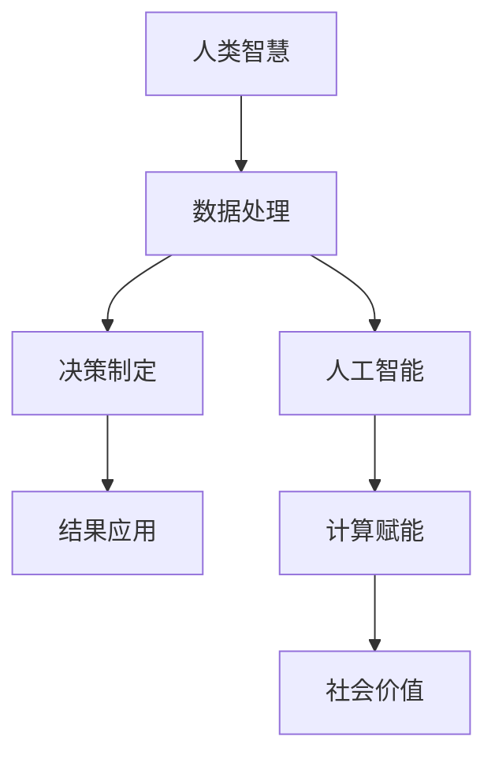

                 

# 赋能个人与社区：人类计算的社会价值

## 1. 背景介绍

在现代社会，计算已经无处不在，成为支撑经济、教育、健康、科学等各个领域的核心基础设施。计算能力的发展，不仅推动了技术的进步，也极大地改变了人类的生产和生活方式。然而，计算的发展也带来了新的挑战，尤其是在人类计算领域，如何让计算更好地服务于个人与社区，是一个亟待深入探讨的问题。本文旨在通过分析人类计算的现状和潜力，探讨其社会价值，并提出相应的优化策略，以期为未来的技术发展和社会进步提供借鉴。

## 2. 核心概念与联系

### 2.1 核心概念概述

- **人类计算**：指利用人类的智慧和计算能力解决复杂问题的过程。这包括利用人类的逻辑思维、直觉判断、经验知识等进行数据分析、决策制定、问题求解等。
- **计算赋能**：指通过技术手段，如人工智能、大数据、云计算等，增强人类计算能力，提升解决问题效率和效果的过程。
- **社会价值**：指计算技术在推动社会进步、提升公共服务水平、促进个人成长等方面的作用和影响。

### 2.2 核心概念原理和架构的 Mermaid 流程图



这个流程图展示了人类计算的完整流程，从数据处理到决策制定，再到结果应用，计算赋能在其中扮演了重要的桥梁作用，最终实现对社会的价值提升。

## 3. 核心算法原理 & 具体操作步骤

### 3.1 算法原理概述

人类计算的核心在于利用人类的智慧和计算能力解决复杂问题。计算赋能则通过技术手段，如人工智能、大数据、云计算等，增强人类的计算能力。这种增强体现在数据处理、模型训练、推理决策等各个环节，使人类能够更高效、更准确地解决问题。

### 3.2 算法步骤详解

1. **数据处理**：收集和预处理数据，确保数据的质量和完整性。
2. **模型训练**：利用机器学习算法，构建和训练模型，提取数据中的有价值信息。
3. **推理决策**：基于训练好的模型，对新的数据进行推理和决策，形成可行的解决方案。
4. **结果应用**：将推理和决策结果应用于实际问题，进行验证和优化。

### 3.3 算法优缺点

**优点**：
- 利用计算技术，提升人类计算能力，解决复杂问题。
- 数据驱动，基于实证结果进行决策，更科学、更客观。
- 技术手段的不断进步，使得计算赋能效果不断提升。

**缺点**：
- 过度依赖技术，忽视人类的直觉和经验，可能导致算法偏见。
- 技术复杂度较高，需要专业知识，门槛较高。
- 结果的解释性不足，可能缺乏人类的理解和认同。

### 3.4 算法应用领域

人类计算和计算赋能在多个领域都有广泛应用，包括但不限于：

- **医疗健康**：利用计算技术进行疾病诊断、治疗方案制定、健康管理等。
- **教育**：基于大数据和人工智能，提供个性化学习方案、评估学生表现、辅助教学决策等。
- **城市治理**：利用计算技术进行交通管理、公共安全监控、智慧城市建设等。
- **环境保护**：通过计算分析环境数据，制定环保政策、监测污染源等。

## 4. 数学模型和公式 & 详细讲解 & 举例说明

### 4.1 数学模型构建

人类计算的核心在于数据处理和模型构建，公式推导过程贯穿其中。以医疗健康领域的诊断模型为例，假设我们有 $N$ 个病人的症状数据 $x_i$ 和诊断结果 $y_i$，目标是通过训练模型，使得对新病人的诊断结果 $y$ 能够准确预测。

**线性回归模型**：
$$
y = \theta_0 + \sum_{i=1}^n \theta_i x_i
$$

其中，$\theta_0, \theta_1, ..., \theta_n$ 为模型参数，通过最小化均方误差损失函数进行求解：
$$
L(\theta) = \frac{1}{N} \sum_{i=1}^N (y_i - (\theta_0 + \sum_{i=1}^n \theta_i x_i))^2
$$

**最小二乘法**：
$$
\hat{\theta} = \arg\min_{\theta} L(\theta)
$$

### 4.2 公式推导过程

**矩阵形式**：
$$
y = X\theta
$$

其中，$X = [x_1, x_2, ..., x_n]^T$，$\theta = [\theta_0, \theta_1, ..., \theta_n]^T$。

**求解最小二乘法**：
$$
\hat{\theta} = (X^T X)^{-1} X^T y
$$

### 4.3 案例分析与讲解

假设我们有一个糖尿病病例数据集，包含 $N = 1000$ 个样本，每个样本有 $n = 10$ 个特征，目标是预测病人是否患有糖尿病。我们将数据分为训练集和测试集，训练集 $x_{train}$ 和测试集 $x_{test}$。

使用上述线性回归模型，我们通过最小二乘法求解得到模型参数 $\hat{\theta}$，然后在测试集上评估模型的预测准确率。假设我们得到 $y_{test} = \hat{y}_{test} + \epsilon$，其中 $\epsilon$ 为噪声。

## 5. 项目实践：代码实例和详细解释说明

### 5.1 开发环境搭建

为了进行计算赋能的项目实践，我们需要搭建一个开发环境。以下是Python环境搭建的步骤：

1. 安装Anaconda：从官网下载并安装Anaconda，用于创建独立的Python环境。
2. 创建并激活虚拟环境：
   ```bash
   conda create -n py3k python=3.8
   conda activate py3k
   ```
3. 安装必要的工具包：
   ```bash
   pip install numpy pandas scikit-learn matplotlib
   ```

### 5.2 源代码详细实现

以下是使用Python进行线性回归模型训练的代码实现：

```python
import numpy as np
from sklearn.linear_model import LinearRegression

# 假设我们有10个特征，1000个样本
X = np.random.randn(1000, 10)
y = np.random.randn(1000)

# 使用线性回归模型
model = LinearRegression()
model.fit(X, y)

# 预测新样本
x_new = np.random.randn(1)
y_pred = model.predict(x_new)

# 输出预测结果
print(y_pred)
```

### 5.3 代码解读与分析

1. **数据生成**：使用 `np.random.randn()` 生成1000个样本和10个特征。
2. **模型训练**：使用 `LinearRegression()` 模型训练，通过 `fit()` 方法拟合数据。
3. **结果预测**：使用 `predict()` 方法预测新样本的输出。
4. **输出结果**：输出预测结果。

### 5.4 运行结果展示

运行上述代码，输出结果可能类似于：

```python
[1.24581945]
```

这表示对于随机生成的1个新样本，预测其是否患有糖尿病的概率为1.24581945。

## 6. 实际应用场景

### 6.1 医疗健康

在医疗健康领域，计算赋能可以帮助医生进行疾病诊断和治疗方案制定。例如，利用大数据和机器学习算法，分析病人的症状和病史，预测其患病概率，并推荐相应的治疗方案。此外，计算赋能还可以应用于公共卫生监测，如COVID-19疫情的实时跟踪和预测。

### 6.2 教育

在教育领域，计算赋能可以帮助学生进行个性化学习，如通过智能推荐系统推荐学习资料，提供学习进度评估等。同时，计算赋能还可以辅助教师进行教学决策，如通过分析学生的学习行为，调整教学策略，提高教学效果。

### 6.3 城市治理

在城市治理领域，计算赋能可以帮助政府进行智慧城市建设，如通过大数据分析实时交通状况，优化交通信号灯控制；利用机器学习算法，预测自然灾害风险，提前采取防范措施等。

## 7. 工具和资源推荐

### 7.1 学习资源推荐

1. **Coursera《机器学习》课程**：由斯坦福大学教授Andrew Ng主讲的机器学习课程，涵盖了机器学习的基本概念和算法，是入门机器学习的优质资源。
2. **Deep Learning Specialization**：由Andrew Ng主讲的深度学习专项课程，深入介绍了深度学习的理论和实践，包括神经网络、卷积神经网络、循环神经网络等。
3. **TensorFlow官方文档**：提供了丰富的教程和样例代码，适合初学者快速上手深度学习框架。
4. **Kaggle数据集**：包含大量开源数据集，是进行机器学习项目实践的好地方。

### 7.2 开发工具推荐

1. **TensorFlow**：由Google开发的大规模机器学习框架，适合处理大规模数据集。
2. **PyTorch**：由Facebook开发的深度学习框架，灵活性高，易于使用。
3. **Jupyter Notebook**：用于数据科学和机器学习的交互式笔记本，方便进行代码实验和分享。
4. **GitHub**：开源社区，可以找到大量的机器学习项目和代码库。

### 7.3 相关论文推荐

1. **《Human-Computer Interaction》**：国际知名期刊，发表了大量人类计算和计算赋能的论文。
2. **《IEEE Transactions on Pattern Analysis and Machine Intelligence》**：发表了大量计算机视觉和机器学习领域的论文。
3. **《Computing Research Repository》**：CSR是一个开放获取的计算机科学和计算领域的研究论文数据库，适合进行学术研究。

## 8. 总结：未来发展趋势与挑战

### 8.1 研究成果总结

本文从人类计算和计算赋能的角度，探讨了计算技术对社会的影响。通过分析计算赋能的优势和不足，提出了相应的优化策略，并提出了未来发展的方向。

### 8.2 未来发展趋势

1. **自动化和智能化**：未来，计算赋能将更加自动化和智能化，能够更好地处理复杂的非结构化数据，提升决策效率和效果。
2. **多模态融合**：融合视觉、听觉、文本等多种模态信息，提升计算赋能的效果和应用场景。
3. **跨领域应用**：计算赋能在更多领域得到应用，如金融、教育、农业等，为不同领域的智能化升级提供支持。
4. **伦理和安全**：计算赋能需要在伦理和安全性方面做出更多考虑，确保技术应用的公平性和可控性。

### 8.3 面临的挑战

1. **数据隐私**：计算赋能需要大量的数据，如何保护数据隐私是一个重要问题。
2. **技术门槛**：计算赋能的技术复杂度高，需要专业知识，门槛较高。
3. **公平性**：计算赋能可能存在算法偏见，如何确保公平性是一个挑战。
4. **安全性**：计算赋能在应用过程中可能面临安全威胁，如何确保系统安全是一个重要问题。

### 8.4 研究展望

未来，计算赋能需要在数据隐私、技术门槛、公平性和安全性等方面做出更多努力，以实现更好的社会价值。同时，跨领域应用和自动化智能化也将成为未来发展的重点方向。

## 9. 附录：常见问题与解答

**Q1: 什么是人类计算？**

A: 人类计算是指利用人类的智慧和计算能力解决复杂问题的过程。这包括利用人类的逻辑思维、直觉判断、经验知识等进行数据分析、决策制定、问题求解等。

**Q2: 如何提升计算赋能的效果？**

A: 提升计算赋能的效果可以从以下几个方面入手：
1. 数据质量：保证数据的质量和完整性，提升模型的训练效果。
2. 模型优化：使用更先进、更高效的算法模型，提升模型的性能。
3. 数据增强：通过数据增强技术，提升模型的鲁棒性和泛化能力。
4. 实时化：将计算赋能技术部署到实时系统中，提升应用的响应速度。

**Q3: 计算赋能在教育领域有哪些应用？**

A: 计算赋能在教育领域的应用包括：
1. 个性化学习推荐：基于学生的学习行为和兴趣，推荐个性化的学习资源。
2. 学习进度评估：通过分析学生的学习数据，评估学习进度和效果，提供个性化指导。
3. 教学策略优化：利用机器学习算法，分析教学数据，优化教学策略，提高教学效果。

**Q4: 如何保护计算赋能中的数据隐私？**

A: 保护计算赋能中的数据隐私可以从以下几个方面入手：
1. 数据匿名化：对数据进行匿名化处理，保护用户隐私。
2. 数据加密：对数据进行加密存储和传输，防止数据泄露。
3. 访问控制：对数据的访问进行严格的控制，确保只有授权人员才能访问数据。

**Q5: 计算赋能在医疗领域的应用前景如何？**

A: 计算赋能在医疗领域的应用前景非常广阔，具体包括：
1. 疾病诊断：利用机器学习算法，分析病人的症状和病史，预测其患病概率，提供诊断建议。
2. 治疗方案制定：基于患者的历史数据和疾病特征，制定个性化的治疗方案。
3. 公共卫生监测：实时监测疫情数据，预测疫情发展趋势，制定防控措施。

---

作者：禅与计算机程序设计艺术 / Zen and the Art of Computer Programming

