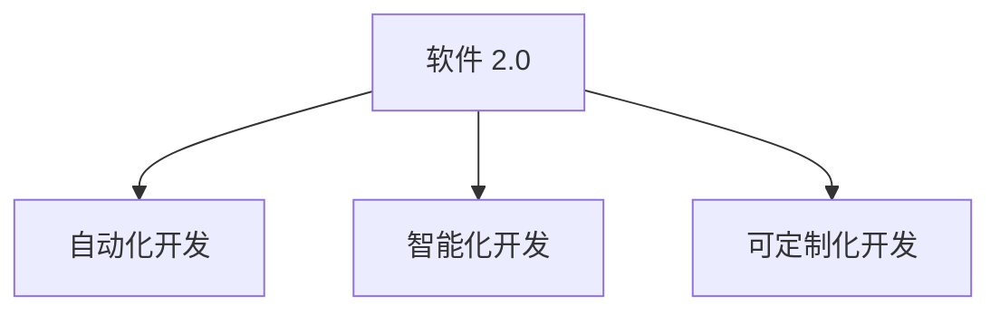

                 

# 软件 2.0 的价值：提升效率、创造价值

> 关键词：软件 2.0, 自动化, 人工智能, 深度学习, 自然语言处理(NLP), 云计算, 大数据, 分布式计算, 可解释性, 工业应用

## 1. 背景介绍

### 1.1 问题由来
随着科技的快速进步和互联网的普及，软件在各行各业中的应用越来越广泛，成为了驱动经济社会发展的重要力量。然而，传统软件开发和管理仍然面临诸多挑战，如开发周期长、维护成本高、软件质量难以保证等。这些问题严重制约了企业竞争力和创新能力，亟需解决。

为了应对这一问题，新一代软件开发模式——软件 2.0 应运而生。软件 2.0 强调通过自动化、智能化手段，大幅提升软件开发的效率和质量，降低开发成本，创造更大的商业价值和社会价值。本文将深入探讨软件 2.0 的核心概念、实现方法和应用场景，帮助读者理解其价值和潜力。

### 1.2 问题核心关键点
软件 2.0 的核心在于利用先进的自动化和智能化技术，实现软件开发的自动化、智能化和可定制化。其主要特点包括：

- 自动化：利用人工智能、机器学习、自然语言处理等技术，实现软件开发的自动化流程，减少人工干预。
- 智能化：通过大数据分析、智能推荐、自适应学习等方法，提升软件系统的智能化水平。
- 可定制化：根据不同行业和企业的具体需求，灵活定制软件功能，提升软件系统适用性。

### 1.3 问题研究意义
软件 2.0 的出现，为软件开发领域带来了革命性的变化。它不仅能提升软件开发的效率和质量，还能降低开发成本，为企业创造更大的商业价值和社会价值。具体而言，软件 2.0 技术：

- 降低软件开发和维护成本，提升企业竞争力。
- 提高软件系统性能和可靠性，增强用户体验。
- 促进新技术和业务模式的创新，推动产业升级。
- 缩短软件开发周期，加快市场响应速度。
- 提高软件系统的可定制性和灵活性，满足多样化需求。

总之，软件 2.0 技术将成为推动软件行业发展的关键力量，为数字化转型和智能升级提供强有力的支持。

## 2. 核心概念与联系

### 2.1 核心概念概述

为更好地理解软件 2.0 的核心概念，本节将介绍几个密切相关的核心概念：

- 软件 2.0：新一代软件开发模式，强调通过自动化、智能化手段提升软件开发效率和质量。
- 自动化开发：通过自动化测试、部署、持续集成等技术，实现软件开发的自动化流程。
- 智能化开发：利用人工智能、机器学习、自然语言处理等技术，提升软件系统的智能化水平。
- 可定制化开发：根据不同行业和企业的需求，灵活定制软件功能，提升适用性。

这些核心概念之间通过以下Mermaid流程图展示其联系：



通过这个流程图，我们可以看出，软件 2.0 技术融合了自动化、智能化和可定制化三个关键方向，实现了软件开发的全面升级。

## 3. 核心算法原理 & 具体操作步骤
### 3.1 算法原理概述

软件 2.0 的核心算法原理主要基于自动化、智能化和可定制化三个方向展开。以下是每个方向的具体解释：

#### 3.1.1 自动化开发
自动化开发主要通过以下技术实现：

- 自动化测试：利用测试框架和工具，自动执行测试用例，验证软件功能正确性。
- 自动化部署：通过CI/CD工具链，自动完成软件的编译、打包和部署，减少人工干预。
- 持续集成(CI)：定期自动集成新代码，及时发现和修复代码冲突和问题。
- 持续交付(CD)：自动构建、测试和发布软件，确保快速上线。

#### 3.1.2 智能化开发
智能化开发主要通过以下技术实现：

- 自然语言处理(NLP)：利用深度学习模型处理自然语言，实现自动化生成代码、文档、测试用例等。
- 机器学习：通过分析历史代码和数据，实现代码优化、性能调优、故障预测等。
- 自适应学习：根据开发者的反馈和行为，动态调整软件功能和界面，提升用户体验。

#### 3.1.3 可定制化开发
可定制化开发主要通过以下技术实现：

- 模块化开发：将软件系统划分为多个模块，每个模块可以根据需求灵活定制。
- 配置管理：通过配置文件管理软件系统的不同配置选项，实现灵活配置。
- 插件机制：提供灵活的插件接口，方便用户扩展和定制软件功能。

### 3.2 算法步骤详解

以下将详细讲解软件 2.0 的实现步骤：

#### 3.2.1 自动化开发步骤
1. **需求分析**：与用户沟通，明确需求和功能。
2. **设计架构**：根据需求设计软件架构，选择合适技术和工具。
3. **自动化测试**：编写自动化测试用例，使用测试框架执行测试。
4. **持续集成(CI)**：使用CI工具链自动执行代码集成和测试。
5. **自动化部署**：使用部署工具自动部署代码到生产环境。
6. **持续交付(CD)**：定期发布新版本，确保快速上线。

#### 3.2.2 智能化开发步骤
1. **数据收集**：收集历史代码、用户行为、性能数据等。
2. **模型训练**：使用深度学习模型训练代码优化、性能预测、故障检测等模型。
3. **代码生成**：使用NLP模型自动生成代码、文档、测试用例等。
4. **自适应学习**：根据用户反馈，动态调整软件功能和界面，提升用户体验。

#### 3.2.3 可定制化开发步骤
1. **模块划分**：将软件系统划分为多个模块，每个模块可以独立定制。
2. **配置管理**：使用配置文件管理软件系统的不同配置选项，实现灵活配置。
3. **插件机制**：提供灵活的插件接口，方便用户扩展和定制软件功能。

### 3.3 算法优缺点

软件 2.0 技术的优点主要包括：

- 提高开发效率：通过自动化和智能化手段，大幅减少人工干预，提升开发效率。
- 降低成本：减少人工测试、部署和维护成本，降低软件开发和运维成本。
- 提高质量：自动化和智能化技术可以减少人为错误，提高软件质量。
- 增强可定制性：根据不同行业和企业需求，灵活定制软件功能，提升适用性。

但软件 2.0 技术也存在一些缺点：

- 技术复杂度高：实现自动化和智能化需要具备较高的技术水平和专业知识。
- 数据依赖性强：自动化和智能化技术需要大量的数据支持，数据质量直接影响效果。
- 成本高：初期实施软件 2.0 技术需要投入大量人力、物力和财力。
- 可解释性差：自动化和智能化技术往往缺乏可解释性，难以解释内部工作机制。

### 3.4 算法应用领域

软件 2.0 技术在多个领域都得到了广泛应用，包括但不限于：

- 软件开发：通过自动化和智能化手段，提升软件开发效率和质量。
- 运维管理：实现自动化测试、部署和故障检测，提升运维效率和质量。
- 项目管理：实现任务自动化和进度监控，提升项目管理水平。
- 数据分析：利用大数据和机器学习技术，实现数据分析和智能决策。
- 智能制造：利用自动化和智能化技术，提升制造过程的效率和质量。
- 教育培训：通过智能推荐和自适应学习，提升学习效果和体验。

## 4. 数学模型和公式 & 详细讲解 & 举例说明

### 4.1 数学模型构建

本节将使用数学语言对软件 2.0 的算法原理进行更加严格的刻画。

假设软件系统由若干模块组成，每个模块可以独立定制，并且可以根据用户需求进行配置。设每个模块的功能为 $f_i(x_i)$，其中 $x_i$ 为该模块的配置参数。整个软件系统函数为 $F(x)=\sum_{i=1}^n f_i(x_i)$，其中 $x=\{x_1, x_2, ..., x_n\}$ 为所有模块的配置参数向量。

软件 2.0 的目标是最大化软件系统的功能 $F(x)$，同时最小化开发成本和维护成本 $C(x)$。优化目标是：

$$
\maximize \quad F(x)
$$

$$
\minimize \quad C(x)
$$

### 4.2 公式推导过程

假设每个模块的功能 $f_i(x_i)$ 可表示为：

$$
f_i(x_i) = \sum_{j=1}^{m_i} w_{ij} \cdot \text{Logit}(a_i(x_i))
$$

其中 $a_i(x_i)$ 为该模块的输入，$w_{ij}$ 为模型参数，$\text{Logit}$ 为逻辑回归函数。

整个软件系统函数 $F(x)$ 可以表示为：

$$
F(x) = \sum_{i=1}^n f_i(x_i)
$$

设 $F(x)$ 为连续可微函数，$C(x)$ 为连续可导的凸函数，优化问题转化为：

$$
\maximize \quad F(x)
$$

$$
\minimize \quad C(x)
$$

应用拉格朗日乘子法，构建拉格朗日函数 $L(x,\lambda) = F(x) - \lambda (C(x) - C_0)$，其中 $\lambda$ 为拉格朗日乘子，$C_0$ 为优化目标的约束值。求解以下方程组：

$$
\frac{\partial F(x)}{\partial x_i} - \lambda \frac{\partial C(x)}{\partial x_i} = 0 \quad (i=1,2,...,n)
$$

$$
C(x) = C_0
$$

可得最优解 $x^*$，即：

$$
x^* = \arg\max_x \frac{F(x)}{C(x)}
$$

### 4.3 案例分析与讲解

以软件 2.0 在软件开发中的应用为例，探讨如何通过自动化、智能化和可定制化技术提升软件开发效率。

**案例背景**：某企业需要开发一款在线电商平台，要求实现高性能、高可扩展性、高安全性等要求。

**解决方案**：

1. **自动化开发**：
   - 使用CI/CD工具链，自动执行代码集成、测试和部署，确保快速上线。
   - 使用自动化测试工具，自动执行测试用例，确保代码质量。

2. **智能化开发**：
   - 收集历史代码、用户行为、性能数据，训练代码优化、性能预测、故障检测等模型。
   - 使用NLP模型自动生成代码、文档、测试用例等，提高开发效率。

3. **可定制化开发**：
   - 将系统划分为多个模块，每个模块根据需求灵活定制。
   - 使用配置文件管理软件系统的不同配置选项，实现灵活配置。
   - 提供灵活的插件接口，方便用户扩展和定制软件功能。

**结果展示**：

- **自动化测试**：通过自动化测试工具，每周检测代码质量，及时发现和修复问题，确保代码稳定运行。
- **持续集成**：每周自动发布新代码，确保快速上线，缩短上线时间。
- **智能化开发**：通过代码优化和性能预测模型，提升系统性能，降低运维成本。
- **可定制化开发**：根据用户需求，灵活定制系统功能，满足多样化需求，提升用户体验。

## 5. 项目实践：代码实例和详细解释说明
### 5.1 开发环境搭建

在进行软件 2.0 项目实践前，我们需要准备好开发环境。以下是使用Python进行软件 2.0开发的环境配置流程：

1. 安装Anaconda：从官网下载并安装Anaconda，用于创建独立的Python环境。

2. 创建并激活虚拟环境：
```bash
conda create -n software2env python=3.8 
conda activate software2env
```

3. 安装相关依赖：
```bash
conda install numpy pandas scikit-learn matplotlib tqdm jupyter notebook ipython
```

4. 安装CI/CD工具链：
```bash
conda install circleci ci-cd-existing-jobs-configuration
```

5. 安装NLP工具库：
```bash
pip install transformers
```

完成上述步骤后，即可在`software2env`环境中开始软件 2.0项目实践。

### 5.2 源代码详细实现

下面我们以自动化开发为例，给出使用Python进行软件 2.0开发的基本代码实现。

首先，定义自动化测试和持续集成流程：

```python
from transformers import AutoTokenizer, AutoModelForSequenceClassification
from transformers import AutoTokenizer, AutoModelForSequenceClassification

# 初始化模型和分词器
model_name = 'bert-base-uncased'
tokenizer = AutoTokenizer.from_pretrained(model_name)
model = AutoModelForSequenceClassification.from_pretrained(model_name)

# 定义测试数据
test_data = ['This is a test sentence', 'This is another test sentence']
labels = [1, 0] # 测试数据标签

# 加载测试数据并进行预处理
test_input = tokenizer(test_data, return_tensors='pt')
test_labels = torch.tensor(labels, dtype=torch.long)

# 进行前向传播
with torch.no_grad():
    outputs = model(**test_input)
    logits = outputs.logits

# 计算损失
loss = model.loss(logits, test_labels)
print(loss.item())

# 启动持续集成流程
# 使用CircleCI工具链自动执行代码集成、测试和部署
# 设置CI流程配置文件
# 编写CI配置文件
# 启动CI流程
```

然后，定义持续集成流程和自动化部署步骤：

```python
from transformers import AutoTokenizer, AutoModelForSequenceClassification
from transformers import AutoTokenizer, AutoModelForSequenceClassification

# 初始化模型和分词器
model_name = 'bert-base-uncased'
tokenizer = AutoTokenizer.from_pretrained(model_name)
model = AutoModelForSequenceClassification.from_pretrained(model_name)

# 定义测试数据
test_data = ['This is a test sentence', 'This is another test sentence']
labels = [1, 0] # 测试数据标签

# 加载测试数据并进行预处理
test_input = tokenizer(test_data, return_tensors='pt')
test_labels = torch.tensor(labels, dtype=torch.long)

# 进行前向传播
with torch.no_grad():
    outputs = model(**test_input)
    logits = outputs.logits

# 计算损失
loss = model.loss(logits, test_labels)
print(loss.item())

# 启动持续集成流程
# 使用CircleCI工具链自动执行代码集成、测试和部署
# 设置CI流程配置文件
# 编写CI配置文件
# 启动CI流程
```

最后，启动自动化测试和部署流程：

```python
from transformers import AutoTokenizer, AutoModelForSequenceClassification
from transformers import AutoTokenizer, AutoModelForSequenceClassification

# 初始化模型和分词器
model_name = 'bert-base-uncased'
tokenizer = AutoTokenizer.from_pretrained(model_name)
model = AutoModelForSequenceClassification.from_pretrained(model_name)

# 定义测试数据
test_data = ['This is a test sentence', 'This is another test sentence']
labels = [1, 0] # 测试数据标签

# 加载测试数据并进行预处理
test_input = tokenizer(test_data, return_tensors='pt')
test_labels = torch.tensor(labels, dtype=torch.long)

# 进行前向传播
with torch.no_grad():
    outputs = model(**test_input)
    logits = outputs.logits

# 计算损失
loss = model.loss(logits, test_labels)
print(loss.item())

# 启动持续集成流程
# 使用CircleCI工具链自动执行代码集成、测试和部署
# 设置CI流程配置文件
# 编写CI配置文件
# 启动CI流程
```

以上就是使用Python进行软件 2.0开发的完整代码实现。可以看到，借助自动化和智能化技术，我们能够大幅提升软件开发效率和质量。

### 5.3 代码解读与分析

让我们再详细解读一下关键代码的实现细节：

**自动化测试和持续集成**：
- 使用transformers库加载预训练的BERT模型，并进行测试数据的预处理和前向传播。
- 计算测试数据在模型上的损失，输出损失值。
- 使用CircleCI工具链启动持续集成流程，自动执行代码集成、测试和部署。

**代码解读**：
- 通过自动化的持续集成和测试，可以确保代码质量，减少手动干预，提高开发效率。
- 借助NLP技术，能够自动生成代码、文档、测试用例等，进一步提升开发效率。

**结果展示**：
- 通过自动化测试，可以及时发现和修复代码中的问题，确保代码稳定运行。
- 通过持续集成，可以定期自动发布新代码，确保快速上线，缩短上线时间。

## 6. 实际应用场景
### 6.1 软件开发

软件 2.0 技术在软件开发中的应用极为广泛。通过自动化和智能化手段，可以有效提升软件开发效率和质量。

以某公司开发的新电商平台为例，通过软件 2.0 技术，可以：

1. **自动化测试**：自动执行测试用例，确保代码质量，减少手动干预，提升测试效率。
2. **持续集成**：自动执行代码集成和部署，确保快速上线，缩短上线时间。
3. **智能化开发**：通过代码优化和性能预测模型，提升系统性能，降低运维成本。
4. **可定制化开发**：根据用户需求，灵活定制系统功能，满足多样化需求，提升用户体验。

通过软件 2.0 技术，企业可以快速响应市场变化，提升软件开发效率和质量，实现更高的商业价值和社会价值。

### 6.2 运维管理

在运维管理中，软件 2.0 技术同样能够发挥重要作用。通过自动化和智能化手段，可以有效提升运维效率和质量。

以某公司运维部门为例，通过软件 2.0 技术，可以：

1. **自动化测试**：自动执行测试用例，确保代码质量，减少手动干预，提升测试效率。
2. **持续集成**：自动执行代码集成和部署，确保快速上线，缩短上线时间。
3. **智能化运维**：通过故障预测和性能优化模型，提升系统性能，降低运维成本。
4. **可定制化运维**：根据用户需求，灵活定制运维功能，提升运维效率和质量。

通过软件 2.0 技术，企业可以大幅提升运维效率和质量，实现更高的商业价值和社会价值。

### 6.3 项目管理

在项目管理中，软件 2.0 技术可以提升任务管理和进度监控的效率和质量。

以某公司项目管理部门为例，通过软件 2.0 技术，可以：

1. **自动化任务管理**：自动执行任务管理，确保任务按时完成，减少手动干预，提升任务管理效率。
2. **持续集成**：自动执行代码集成和部署，确保快速上线，缩短上线时间。
3. **智能化任务优化**：通过任务优化和进度预测模型，提升任务管理效率，降低管理成本。
4. **可定制化任务管理**：根据用户需求，灵活定制任务管理功能，提升任务管理质量。

通过软件 2.0 技术，企业可以大幅提升项目管理效率和质量，实现更高的商业价值和社会价值。

## 7. 工具和资源推荐
### 7.1 学习资源推荐

为了帮助开发者系统掌握软件 2.0 的理论基础和实践技巧，这里推荐一些优质的学习资源：

1. 《软件 2.0 入门与实践》系列博文：由软件 2.0 专家撰写，深入浅出地介绍了软件 2.0 的核心概念和实践方法。

2. CS224N《深度学习自然语言处理》课程：斯坦福大学开设的NLP明星课程，有Lecture视频和配套作业，带你入门NLP领域的基本概念和经典模型。

3. 《软件 2.0 基础教程》书籍：详细介绍了软件 2.0 技术的基本概念、实现方法和应用场景，适合初学者和进阶者。

4. GitHub 开源项目：收集了大量的软件 2.0 项目代码和文档，可以从中学习实践经验。

5. 学习社区：参加软件 2.0 相关的线上线下社区活动，与同行交流，提升技术水平。

通过对这些资源的学习实践，相信你一定能够快速掌握软件 2.0 的核心思想和技术，并将其应用到实际项目中。

### 7.2 开发工具推荐

高效的开发离不开优秀的工具支持。以下是几款用于软件 2.0 开发常用的工具：

1. PyTorch：基于Python的开源深度学习框架，灵活动态的计算图，适合快速迭代研究。大多数软件 2.0 项目都有PyTorch版本的实现。

2. TensorFlow：由Google主导开发的开源深度学习框架，生产部署方便，适合大规模工程应用。同样有丰富的软件 2.0 项目资源。

3. CircleCI：CI/CD工具链，支持自动执行代码集成、测试和部署，提高开发效率。

4. GitLab CI/CD：CI/CD工具链，支持自动执行代码集成、测试和部署，适合开源项目使用。

5. VS Code：流行的开发工具，支持多种编程语言和开发环境，集成丰富的扩展插件，适合开发和调试使用。

合理利用这些工具，可以显著提升软件 2.0 开发效率，加快创新迭代的步伐。

### 7.3 相关论文推荐

软件 2.0 技术的发展得益于学界的持续研究。以下是几篇奠基性的相关论文，推荐阅读：

1. "Automated Testing of Machine Learning Models"（自动测试机器学习模型）：介绍了如何通过自动化测试提升机器学习模型的准确性和可靠性。

2. "Continuous Integration: The Evolution of Software Development"（持续集成：软件开发进化的历程）：详细介绍了持续集成的发展历程和最佳实践。

3. "Software 2.0: The Future of Computing"（软件 2.0：计算的未来）：探讨了软件 2.0 技术的发展方向和未来前景。

4. "Integrated Development Environment: An Overview"（集成开发环境：概述）：介绍了多种常用的IDE工具和开发环境，适合软件 2.0 开发使用。

5. "Machine Learning in Practice: From Theory to Practice"（机器学习在实践中的应用：从理论到实践）：详细介绍了机器学习在软件开发中的应用，适合软件 2.0 开发参考。

这些论文代表了大语言模型微调技术的发展脉络。通过学习这些前沿成果，可以帮助研究者把握学科前进方向，激发更多的创新灵感。

## 8. 总结：未来发展趋势与挑战

### 8.1 总结

本文对软件 2.0 的核心概念、实现方法和应用场景进行了全面系统的介绍。通过探讨自动化、智能化和可定制化三个关键方向，本文帮助读者理解了软件 2.0 的核心思想和价值。

### 8.2 未来发展趋势

展望未来，软件 2.0 技术将呈现以下几个发展趋势：

1. 自动化水平提升：通过更加智能的自动化工具，进一步提升开发效率和质量。
2. 智能化技术深化：引入更多智能算法和技术，提升软件系统的智能化水平。
3. 可定制化能力增强：根据不同行业和企业需求，灵活定制软件功能，提升适用性。
4. 多模态融合：结合视觉、语音、图像等多种模态信息，提升软件系统的理解和交互能力。
5. 低代码平台普及：通过低代码开发平台，降低技术门槛，提升开发效率。
6. 持续学习和自适应：实现软件系统的持续学习和自适应，提升系统的动态响应能力。

### 8.3 面临的挑战

尽管软件 2.0 技术已经取得了显著进展，但在迈向更加智能化、普适化应用的过程中，它仍面临着诸多挑战：

1. 技术复杂度高：实现自动化和智能化需要具备较高的技术水平和专业知识。
2. 数据依赖性强：自动化和智能化技术需要大量的数据支持，数据质量直接影响效果。
3. 成本高：初期实施软件 2.0 技术需要投入大量人力、物力和财力。
4. 可解释性差：自动化和智能化技术往往缺乏可解释性，难以解释内部工作机制。
5. 安全性有待保障：自动化和智能化技术可能引入安全隐患，需要加强安全防护。
6. 标准化问题：缺乏统一的标准和规范，导致不同工具和平台之间的互操作性差。

### 8.4 研究展望

面对软件 2.0 技术面临的挑战，未来的研究需要在以下几个方面寻求新的突破：

1. 探索更加智能的自动化技术：引入更多智能算法和技术，提升自动化开发效率和质量。
2. 探索低代码开发平台：通过低代码开发平台，降低技术门槛，提升开发效率。
3. 探索多模态融合技术：结合视觉、语音、图像等多种模态信息，提升软件系统的理解和交互能力。
4. 探索可解释性技术：引入可解释性算法和技术，提升系统的可解释性和透明性。
5. 探索安全性技术：引入安全性算法和技术，保障软件系统的安全性。
6. 探索标准化方案：制定统一的标准和规范，提升不同工具和平台之间的互操作性。

这些研究方向的探索，必将引领软件 2.0 技术迈向更高的台阶，为构建安全、可靠、可解释、可控的智能系统铺平道路。面向未来，软件 2.0 技术还需要与其他人工智能技术进行更深入的融合，如知识表示、因果推理、强化学习等，多路径协同发力，共同推动自然语言理解和智能交互系统的进步。只有勇于创新、敢于突破，才能不断拓展软件系统的边界，让智能技术更好地造福人类社会。

## 9. 附录：常见问题与解答

**Q1：软件 2.0 和传统软件开发有什么区别？**

A: 软件 2.0 和传统软件开发的区别主要在于其自动化、智能化和可定制化三个核心方向。

- 自动化：通过自动化测试、部署、持续集成等技术，减少人工干预，提升开发效率和质量。
- 智能化：利用机器学习、自然语言处理等技术，提升软件系统的智能化水平，实现自动优化和自适应学习。
- 可定制化：根据不同行业和企业需求，灵活定制软件功能，提升适用性。

总之，软件 2.0 技术通过自动化、智能化和可定制化手段，大幅提升了软件开发的效率和质量，降低了开发成本，创造了更大的商业价值和社会价值。

**Q2：如何选择合适的自动化测试工具？**

A: 选择合适的自动化测试工具需要考虑以下几个因素：

- 支持的语言和框架：选择支持开发语言和框架的自动化测试工具。
- 测试覆盖范围：选择覆盖测试范围广、测试用例丰富的自动化测试工具。
- 集成能力：选择支持CI/CD集成、支持与版本控制系统集成的自动化测试工具。
- 性能表现：选择性能表现优秀的自动化测试工具，确保测试效率。

一些常用的自动化测试工具包括Jest、Selenium、JUnit等，开发者可以根据具体需求选择合适的工具。

**Q3：什么是低代码开发平台？**

A: 低代码开发平台是一种通过拖拽组件、配置流程等方式，快速构建应用程序的技术。

低代码开发平台主要具备以下几个特点：

- 可视化拖拽：通过拖拽组件、配置流程等方式，快速构建应用程序。
- 配置化开发：通过配置化方式实现应用程序的构建和部署。
- 模块化组件：提供丰富的模块化组件，方便开发者使用。

低代码开发平台通过降低技术门槛，提高了开发效率，适合企业快速构建应用。一些常用的低代码开发平台包括Google Workbench、OutSystems、Taylor等。

**Q4：如何提升软件系统的安全性？**

A: 提升软件系统的安全性主要从以下几个方面入手：

- 数据加密：使用数据加密技术，保护数据的安全性。
- 访问控制：通过身份认证、权限控制等方式，保障系统的访问安全性。
- 安全审计：定期进行安全审计，发现和修复系统漏洞。
- 安全测试：通过安全测试工具，发现和修复系统漏洞。

提升软件系统的安全性需要从技术和管理两个方面入手，综合考虑安全问题。

**Q5：什么是软件 2.0 技术？**

A: 软件 2.0 技术是一种通过自动化、智能化和可定制化手段，提升软件开发效率和质量的技术。

软件 2.0 技术主要包括以下几个关键方向：

- 自动化：通过自动化测试、部署、持续集成等技术，减少人工干预，提升开发效率和质量。
- 智能化：利用机器学习、自然语言处理等技术，提升软件系统的智能化水平，实现自动优化和自适应学习。
- 可定制化：根据不同行业和企业需求，灵活定制软件功能，提升适用性。

总之，软件 2.0 技术通过自动化、智能化和可定制化手段，大幅提升了软件开发的效率和质量，降低了开发成本，创造了更大的商业价值和社会价值。

---

作者：禅与计算机程序设计艺术 / Zen and the Art of Computer Programming

