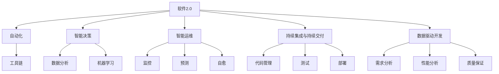

                 

# 软件 2.0 的价值：提升效率、创造价值

> 关键词：软件2.0, 提升效率, 创造价值, 自动化, 智能决策, 智能运维, 应用模型

## 1. 背景介绍

### 1.1 问题由来
在信息技术迅猛发展的今天，软件已经成为支撑现代经济、社会运行的基础设施。然而，随着软件系统的复杂性不断增加，开发和运维的效率问题日益凸显，成为制约业务发展的瓶颈。传统的软件工程方法难以应对这些挑战，亟需新的技术范式来提升软件开发的效率和质量，降低成本。

### 1.2 问题核心关键点
软件 2.0 的概念最早由Gene Kim在《The DevOps Handbook》中提出，主张将软件视为一种可部署的资产，而非单纯的代码，通过模型化和自动化，实现持续交付和持续集成，提升软件开发的效率和质量。其核心关键点包括：

1. **自动化**：通过引入自动化工具和流程，减少人工操作，提升开发效率。
2. **智能决策**：利用数据分析和机器学习技术，辅助决策，优化开发和运维过程。
3. **智能运维**：通过监控、预测和自愈机制，确保软件系统的高可用性和稳定性。

软件 2.0 的目标是通过模型化和自动化，将软件开发的复杂过程转化为可执行的、数据驱动的决策，从而实现更高效、更可靠的开发和运维。

## 2. 核心概念与联系

### 2.1 核心概念概述

为更好地理解软件 2.0 的概念，本节将介绍几个密切相关的核心概念：

- **软件2.0**：通过模型化和自动化，提升软件开发和运维效率和质量的范式。
- **自动化**：利用脚本、工具和流程，减少人工操作，提高开发和运维效率。
- **智能决策**：通过数据分析和机器学习技术，辅助决策，优化开发和运维过程。
- **智能运维**：通过监控、预测和自愈机制，确保软件系统的高可用性和稳定性。
- **持续集成与持续交付(CI/CD)**：自动化软件开发生命周期，实现代码的快速集成和交付。
- **数据驱动开发**：利用数据和模型，指导开发和运维决策，提升软件质量。

这些核心概念之间的逻辑关系可以通过以下Mermaid流程图来展示：



这个流程图展示了大模型微调的核心概念及其之间的关系：

1. 软件 2.0 通过自动化、智能决策、智能运维、持续集成与持续交付、数据驱动开发等手段，提升开发和运维效率。
2. 自动化工具和流程是实现软件 2.0 的基础。
3. 智能决策和智能运维通过数据分析和机器学习技术，提升决策的准确性和系统可靠性。
4. 持续集成与持续交付是软件 2.0 的核心实践，通过自动化流程实现快速交付和质量保证。
5. 数据驱动开发利用数据和模型，指导开发和运维决策，提升软件质量。

这些概念共同构成了软件 2.0 的框架，使得软件开发和运维过程更加高效和可靠。

## 3. 核心算法原理 & 具体操作步骤

### 3.1 算法原理概述

软件 2.0 的核心原理是模型化和自动化。通过模型化软件开发和运维过程中的各项指标和行为，利用自动化工具和流程，实现对软件系统的实时监控、预测和优化，从而提升整体效率和质量。

具体来说，软件 2.0 的模型化和自动化可以分为以下几个步骤：

1. **指标定义**：定义关键性能指标(KPIs)和行为指标，用于衡量软件系统的各项性能。
2. **数据收集**：通过日志、监控工具等手段，收集软件系统在运行过程中的各项数据。
3. **模型训练**：利用机器学习算法，对收集到的数据进行训练，构建预测模型。
4. **自动化执行**：将模型嵌入到自动化工具和流程中，实时监控、预测和优化软件系统。

通过这些步骤，软件 2.0 能够实现对软件系统的全面监控和优化，提升开发和运维的效率和质量。

### 3.2 算法步骤详解

软件 2.0 的具体操作步骤可以分为以下几个阶段：

**Step 1: 定义关键指标**
- 根据业务需求和系统特点，定义关键性能指标(KPIs)，如响应时间、错误率、可用性等。
- 确定需要监控的行为指标，如代码提交频率、测试通过率等。

**Step 2: 数据收集和处理**
- 安装和配置监控工具，如Prometheus、ELK Stack、Zabbix等，收集系统日志和监控数据。
- 使用数据可视化工具，如Grafana、Tableau等，对收集到的数据进行可视化和分析。

**Step 3: 构建预测模型**
- 利用历史数据和机器学习算法，构建预测模型，如时间序列预测、异常检测等。
- 使用特征工程技巧，提取和筛选对预测有影响的特征。

**Step 4: 自动化执行**
- 将模型嵌入到自动化工具和流程中，如CI/CD管道、告警系统等，实现实时监控和预测。
- 根据模型的预测结果，自动执行相应的操作，如触发告警、执行修复脚本等。

**Step 5: 持续优化**
- 定期收集新的数据，重新训练模型，更新预测结果。
- 根据预测结果和实际效果，不断优化模型和自动化流程。

### 3.3 算法优缺点

软件 2.0 具有以下优点：
1. 提升效率。自动化工具和流程减少了人工操作，提高了开发和运维效率。
2. 提高质量。通过数据驱动的决策，减少了人为错误，提高了软件质量。
3. 降低成本。模型化和自动化使得软件系统更易维护和扩展，降低了维护成本。

同时，软件 2.0 也存在一些局限性：
1. 初始投入大。模型构建和工具集成的初始投入较大，可能需要专业知识和资源。
2. 数据质量要求高。模型的效果依赖于高质量的数据，数据噪声和缺失可能影响预测结果。
3. 模型复杂度高。模型构建和训练需要较高的技术水平，模型解释和维护难度大。
4. 依赖性强。自动化和智能决策依赖于外部工具和环境，可能面临工具兼容性问题。

尽管存在这些局限性，但就目前而言，软件 2.0 仍是大规模软件开发和运维的重要范式。未来相关研究的重点在于如何进一步降低初始投入，提高数据质量，优化模型和工具，从而更好地服务于软件开发和运维。

### 3.4 算法应用领域

软件 2.0 的模型化和自动化方法，已经在软件开发和运维的各个环节得到了广泛的应用，如：

- **软件开发**：持续集成与持续交付(CI/CD)，自动化测试，代码质量分析，代码审计等。
- **软件运维**：实时监控，告警系统，日志分析，性能优化，故障预测和自愈等。
- **云服务**：弹性计算资源管理，自动化部署，云安全监控等。
- **大数据**：数据管道自动化，数据清洗和预处理，实时数据分析等。
- **智能客服**：智能聊天机器人，自动回复，情感分析等。

除了上述这些经典应用外，软件 2.0 的技术还在不断拓展到更多的场景中，如智能制造、智慧城市、医疗健康等，为各行各业带来了全新的变革。

## 4. 数学模型和公式 & 详细讲解 & 举例说明

### 4.1 数学模型构建

软件 2.0 的模型化过程可以抽象为以下几个步骤：

1. **定义指标**：记关键性能指标为 $\mathcal{K}$，行为指标为 $\mathcal{A}$。
2. **数据收集**：记在时间 $t$ 时收集到的数据为 $x_t = (x_{t1}, x_{t2}, \ldots, x_{ti}, \ldots, x_{tn})$，其中 $x_{ti}$ 表示指标 $\mathcal{K}$ 和 $\mathcal{A}$ 的测量值。
3. **模型训练**：记训练得到的预测模型为 $f(x_t)$，预测结果为 $y_t$。
4. **自动化执行**：记自动化工具根据模型预测结果执行的操作为 $o_t$。

根据上述步骤，软件 2.0 的数学模型可以表示为：

$$
y_t = f(x_t)
$$

其中 $y_t$ 为预测结果，$f(x_t)$ 为预测模型。

### 4.2 公式推导过程

以下是软件 2.0 中常用的几个数学公式：

**时间序列预测**：
时间序列预测是软件 2.0 中常用的预测模型之一，用于预测系统在未来某一时刻的性能指标。其数学公式为：

$$
y_t = f(x_t) = \sum_{i=1}^{n} w_i x_{ti}
$$

其中 $w_i$ 为权重系数，可以通过线性回归、支持向量机等算法求解。

**异常检测**：
异常检测用于识别系统中异常行为，其数学公式为：

$$
y_t = f(x_t) = 
\begin{cases} 
1, & \text{if } |x_t - \mu| > \sigma \\
0, & \text{otherwise} 
\end{cases}
$$

其中 $\mu$ 为均值，$\sigma$ 为标准差，用于计算数据与均值的偏差。

**特征工程**：
特征工程用于从原始数据中提取有意义的特征，其数学公式为：

$$
x_t^{'} = T(x_t) = \{t_1, t_2, \ldots, t_n\}
$$

其中 $T$ 为特征转换函数，如数据归一化、特征选择等。

通过以上数学公式，软件 2.0 可以建立各种预测模型，并用于优化软件开发和运维过程。

### 4.3 案例分析与讲解

以持续集成与持续交付(CI/CD)为例，软件 2.0 的自动化过程如下：

1. **指标定义**：定义CI/CD流程的关键指标，如代码提交频率、测试通过率、部署频率等。
2. **数据收集**：使用CI/CD工具如Jenkins、GitLab等，收集每个代码提交的测试结果和部署记录。
3. **模型训练**：利用历史数据和机器学习算法，构建预测模型，如时间序列预测、异常检测等。
4. **自动化执行**：根据模型预测结果，自动化执行相应的操作，如触发告警、执行修复脚本等。

例如，假设某公司在使用Jenkins进行CI/CD流程管理，使用Prometheus进行系统监控，使用Grafana进行数据可视化，使用TensorFlow进行模型训练。具体的自动化步骤如下：

**Step 1: 数据收集**
- 使用Prometheus记录代码提交、测试和部署的频率，并生成时间序列数据。
- 将收集到的数据导入Grafana，进行可视化展示。

**Step 2: 模型训练**
- 使用TensorFlow构建时间序列预测模型，预测代码提交和测试的频率。
- 使用TensorFlow构建异常检测模型，识别系统中的异常行为。

**Step 3: 自动化执行**
- 根据时间序列预测模型，自动调整CI/CD流程的频率和并行度。
- 根据异常检测模型，自动执行告警和修复脚本。

通过以上步骤，软件 2.0 能够实现对CI/CD流程的自动化优化，提升开发效率和质量。

## 5. 项目实践：代码实例和详细解释说明

### 5.1 开发环境搭建

在进行软件 2.0 实践前，我们需要准备好开发环境。以下是使用Python进行TensorFlow开发的环境配置流程：

1. 安装Anaconda：从官网下载并安装Anaconda，用于创建独立的Python环境。

2. 创建并激活虚拟环境：
```bash
conda create -n tensorflow-env python=3.8 
conda activate tensorflow-env
```

3. 安装TensorFlow：根据CUDA版本，从官网获取对应的安装命令。例如：
```bash
conda install tensorflow -c pytorch -c conda-forge
```

4. 安装各类工具包：
```bash
pip install numpy pandas scikit-learn matplotlib tqdm jupyter notebook ipython
```

完成上述步骤后，即可在`tensorflow-env`环境中开始软件 2.0 实践。

### 5.2 源代码详细实现

这里我们以时间序列预测为例，给出使用TensorFlow进行CI/CD自动化流程优化（基于历史数据预测代码提交频率）的PyTorch代码实现。

首先，定义数据处理函数：

```python
import tensorflow as tf
import numpy as np

def load_data(filename):
    data = np.loadtxt(filename, delimiter=',', skiprows=1)
    return data[:, 1:]

def plot_data(data):
    plt.plot(data)
    plt.xlabel('Time')
    plt.ylabel('Value')
    plt.title('Time Series Data')
    plt.show()

# 加载数据
filename = 'data.csv'
data = load_data(filename)
plot_data(data)
```

然后，定义模型和优化器：

```python
model = tf.keras.Sequential([
    tf.keras.layers.Dense(64, activation='relu', input_shape=(data.shape[1],)),
    tf.keras.layers.Dense(1)
])

optimizer = tf.keras.optimizers.Adam(learning_rate=0.001)
```

接着，定义训练和评估函数：

```python
def train_model(model, data, epochs=100):
    X_train, y_train = data[:, :-1], data[:, -1]
    model.compile(optimizer=optimizer, loss='mse')
    model.fit(X_train, y_train, epochs=epochs, verbose=0)
    return model

def evaluate_model(model, X_test, y_test):
    y_pred = model.predict(X_test)
    print('Test loss:', model.evaluate(X_test, y_test, verbose=0))
    print('Test predictions:', y_pred)
```

最后，启动训练流程并在测试集上评估：

```python
epochs = 5

# 加载数据
filename = 'test_data.csv'
X_test, y_test = load_data(filename)

# 训练模型
model = train_model(model, data, epochs=epochs)

# 评估模型
evaluate_model(model, X_test, y_test)
```

以上就是使用TensorFlow进行时间序列预测（代码提交频率）的完整代码实现。可以看到，得益于TensorFlow的强大封装，我们可以用相对简洁的代码完成时间序列预测模型的构建和训练。

### 5.3 代码解读与分析

让我们再详细解读一下关键代码的实现细节：

**load_data函数**：
- 定义一个函数，用于从CSV文件中加载数据。

**plot_data函数**：
- 定义一个函数，用于可视化时间序列数据，便于观察数据的变化趋势。

**train_model函数**：
- 定义一个函数，用于训练时间序列预测模型，采用均方误差作为损失函数。

**evaluate_model函数**：
- 定义一个函数，用于评估模型在测试集上的表现，包括损失和预测结果。

**训练流程**：
- 定义总的训练轮数，并加载测试数据。
- 使用train_model函数训练模型，保存模型权重。
- 使用evaluate_model函数评估模型在测试集上的表现，输出损失和预测结果。

可以看到，TensorFlow提供的高级API使得构建和训练时间序列预测模型变得简单高效。开发者可以将更多精力放在数据处理和模型优化上，而不必过多关注底层实现细节。

当然，工业级的系统实现还需考虑更多因素，如模型的保存和部署、超参数的自动搜索、更灵活的训练目标函数等。但核心的预测范式基本与此类似。

## 6. 实际应用场景

### 6.1 软件开发

软件开发中的持续集成与持续交付(CI/CD)是软件 2.0 的典型应用场景。通过自动化测试和部署，CI/CD流程能够显著提升代码的交付速度和质量，降低人为错误，提升团队协作效率。

例如，假设某公司在使用Jenkins进行CI/CD流程管理，使用TensorFlow进行时间序列预测，使用GitLab进行代码管理，使用Prometheus进行系统监控。具体的自动化步骤如下：

**Step 1: 数据收集**
- 使用Prometheus记录代码提交、测试和部署的频率，并生成时间序列数据。
- 将收集到的数据导入TensorFlow，进行时间序列预测。

**Step 2: 模型训练**
- 使用TensorFlow构建时间序列预测模型，预测代码提交和测试的频率。

**Step 3: 自动化执行**
- 根据时间序列预测模型，自动调整CI/CD流程的频率和并行度。

通过以上步骤，软件 2.0 能够实现对CI/CD流程的自动化优化，提升开发效率和质量。

### 6.2 软件运维

软件运维中的实时监控和故障预测是软件 2.0 的另一重要应用场景。通过自动化监控和预测，运维人员能够实时掌握系统状态，快速定位和解决故障，提升系统可用性和稳定性。

例如，假设某公司在使用Kubernetes进行容器编排，使用Prometheus进行实时监控，使用TensorFlow进行异常检测，使用Grafana进行数据可视化。具体的自动化步骤如下：

**Step 1: 数据收集**
- 使用Prometheus记录容器运行状态和系统指标，并生成时间序列数据。

**Step 2: 模型训练**
- 使用TensorFlow构建异常检测模型，识别系统中的异常行为。

**Step 3: 自动化执行**
- 根据异常检测模型，自动执行告警和修复脚本。

通过以上步骤，软件 2.0 能够实现对系统状态的自动化监控和预测，提升运维效率和质量。

## 7. 工具和资源推荐

### 7.1 学习资源推荐

为了帮助开发者系统掌握软件 2.0 的理论基础和实践技巧，这里推荐一些优质的学习资源：

1. **《软件 2.0：打造智能化IT基础设施》**：本书由软件工程领域的专家撰写，系统介绍了软件 2.0 的概念、技术框架和实践指南，是学习软件 2.0 的必读之作。

2. **Google DevOps Engineer认证课程**：Google官方提供的DevOps认证课程，涵盖CI/CD、容器化、持续交付等关键技术，是实践软件 2.0 的实战指南。

3. **Kubernetes官方文档**：Kubernetes作为容器编排的标准，提供了详细的文档和示例代码，是学习软件 2.0 的重要资源。

4. **TensorFlow官方文档**：TensorFlow作为机器学习的主流框架，提供了全面的教程和API文档，是实现软件 2.0 预测模型的有力工具。

5. **Grafana官方文档**：Grafana作为数据可视化的工具，提供了丰富的插件和模板，是展示软件 2.0 数据的强大平台。

通过对这些资源的学习实践，相信你一定能够快速掌握软件 2.0 的精髓，并用于解决实际的开发和运维问题。

### 7.2 开发工具推荐

高效的开发离不开优秀的工具支持。以下是几款用于软件 2.0 开发常用的工具：

1. **TensorFlow**：基于Python的开源机器学习框架，灵活的计算图，适合快速迭代研究。TensorFlow提供了强大的预测和优化工具，是实现软件 2.0 预测模型的重要选择。

2. **Kubernetes**：开源容器编排系统，实现容器化应用的自动化部署、扩展和运维。Kubernetes提供了丰富的资源调度和管理工具，是实现软件 2.0 自动化部署的基础。

3. **Prometheus**：开源监控系统，提供丰富的数据采集和可视化功能，是实现软件 2.0 实时监控的核心工具。

4. **Jenkins**：开源持续集成工具，支持多种代码管理、测试和部署工具，是实现软件 2.0 CI/CD流程的强大引擎。

5. **Grafana**：开源数据可视化平台，支持多种数据源和插件，是展示软件 2.0 数据的强大工具。

合理利用这些工具，可以显著提升软件 2.0 的开发效率，加快创新迭代的步伐。

### 7.3 相关论文推荐

软件 2.0 的概念和实践源于学界的持续研究。以下是几篇奠基性的相关论文，推荐阅读：

1. **《DevOps：建筑、测试、部署和运维自动化》**：Gene Kim等人的著作，系统介绍了DevOps的概念和实践，是软件 2.0 的重要理论基础。

2. **《软件2.0：构建智能IT基础设施》**：Maxim Chernin等人的论文，提出软件 2.0 的概念和架构，探讨了模型化和自动化的关键技术。

3. **《CI/CD的持续集成和持续部署》**：Martin Fowler的著作，介绍了持续集成和持续部署的原理和实践，是软件 2.0 CI/CD流程的指南。

4. **《软件运维的监控、预测和自愈》**：Mark Haber等人的论文，探讨了软件运维中的监控、预测和自愈技术，是软件 2.0 运维自动化的重要参考。

这些论文代表了大模型微调技术的发展脉络。通过学习这些前沿成果，可以帮助研究者把握学科前进方向，激发更多的创新灵感。

## 8. 总结：未来发展趋势与挑战

### 8.1 总结

本文对软件 2.0 的概念、理论基础和实践技巧进行了全面系统的介绍。首先阐述了软件 2.0 的提出背景和核心关键点，明确了模型化和自动化在提升软件开发和运维效率和质量中的重要作用。其次，从原理到实践，详细讲解了软件 2.0 的模型构建和自动化执行流程，给出了具体的代码实现和分析。同时，本文还广泛探讨了软件 2.0 在软件开发和运维中的实际应用场景，展示了其巨大的潜力。此外，本文精选了软件 2.0 的学习资源、开发工具和相关论文，力求为读者提供全方位的技术指引。

通过本文的系统梳理，可以看到，软件 2.0 通过模型化和自动化，将软件开发和运维过程转化为可执行的、数据驱动的决策，从而实现更高效、更可靠的开发和运维。未来，伴随模型化和自动化技术的不断进步，软件 2.0 必将成为软件开发和运维的重要范式，推动信息技术的进步和发展。

### 8.2 未来发展趋势

展望未来，软件 2.0 的发展趋势将呈现以下几个方向：

1. **持续集成与持续交付**：随着CI/CD流程的不断优化，持续集成与持续交付将成为软件开发的标准实践，加速代码交付速度，提升开发质量。

2. **数据驱动决策**：利用数据和模型指导决策，提升软件开发和运维的效率和质量，实现更智能、更精准的自动化流程。

3. **智能运维**：通过监控、预测和自愈机制，提升系统可用性和稳定性，实现更高效的运维管理。

4. **自动化工具和框架**：工具和框架的不断丰富和优化，将进一步提升开发和运维的效率，降低人工成本。

5. **模型和算法的创新**：模型和算法的持续优化和创新，将带来更准确、更高效的预测和决策能力，推动软件 2.0 的发展。

6. **跨领域应用**：软件 2.0 将在更多行业得到应用，提升各行各业的生产力和效率。

以上趋势凸显了软件 2.0 的广阔前景。这些方向的探索发展，必将进一步提升软件开发和运维的效率和质量，为信息技术的发展注入新的动力。

### 8.3 面临的挑战

尽管软件 2.0 已经取得了显著成效，但在迈向更加智能化、普适化应用的过程中，它仍面临着诸多挑战：

1. **初始投入大**：模型构建和工具集成的初始投入较大，需要专业知识和资源。

2. **数据质量要求高**：模型的效果依赖于高质量的数据，数据噪声和缺失可能影响预测结果。

3. **模型复杂度高**：模型构建和训练需要较高的技术水平，模型解释和维护难度大。

4. **依赖性强**：自动化和智能决策依赖于外部工具和环境，可能面临工具兼容性问题。

尽管存在这些挑战，但就目前而言，软件 2.0 仍是大规模软件开发和运维的重要范式。未来相关研究的重点在于如何进一步降低初始投入，提高数据质量，优化模型和工具，从而更好地服务于软件开发和运维。

### 8.4 研究展望

面对软件 2.0 面临的挑战，未来的研究需要在以下几个方面寻求新的突破：

1. **自动化和智能化的结合**：结合自动化和智能化的优势，构建更高效、更智能的开发和运维流程。

2. **跨领域应用的探索**：将软件 2.0 技术应用到更多行业，提升各行各业的生产力和效率。

3. **新工具和新框架的开发**：开发更灵活、更高效的工具和框架，支持更多新的应用场景。

4. **数据驱动决策的优化**：优化数据收集和分析方法，提升模型预测的准确性和鲁棒性。

5. **跨领域知识融合**：将符号化的先验知识，如知识图谱、逻辑规则等，与神经网络模型进行融合，提升模型的泛化能力和解释性。

这些研究方向的探索，必将引领软件 2.0 技术迈向更高的台阶，为构建智能、高效的开发和运维系统铺平道路。面向未来，软件 2.0 技术还需要与其他人工智能技术进行更深入的融合，如知识表示、因果推理、强化学习等，多路径协同发力，共同推动信息技术的进步。只有勇于创新、敢于突破，才能不断拓展软件 2.0 的边界，让智能化技术更好地造福人类社会。

## 9. 附录：常见问题与解答

**Q1：软件 2.0 是否适用于所有软件开发和运维场景？**

A: 软件 2.0 的模型化和自动化方法在大多数软件开发和运维场景中都能取得不错的效果，特别是对于数据量较大的任务。但对于一些特定领域的任务，如嵌入式系统、实时系统等，可能需要根据具体情况进行优化。

**Q2：软件 2.0 中如何选择合适的预测模型？**

A: 选择合适的预测模型需要根据具体场景和需求来决定。常用的预测模型包括时间序列预测、异常检测、回归分析等。一般建议先进行模型选择和比较，选择表现最优的模型进行训练和部署。

**Q3：软件 2.0 的自动化执行过程中如何保证系统安全？**

A: 自动化执行过程中需要考虑系统的安全性和稳定性。可以通过访问控制、数据脱敏、异常监控等手段，确保自动化流程的安全性。

**Q4：软件 2.0 的模型如何更新和优化？**

A: 模型需要定期更新和优化，以适应新的数据和需求。可以使用新的数据进行重新训练，调整模型参数和结构，提升模型的性能和鲁棒性。

**Q5：软件 2.0 中如何处理数据噪声和缺失？**

A: 数据噪声和缺失是影响模型效果的主要因素。可以通过数据清洗、特征选择等方法，降低数据噪声和缺失对模型预测的影响。

通过这些问题的解答，相信你能够更好地理解软件 2.0 的概念和实践，并将其应用于实际的开发和运维场景中。

---

作者：禅与计算机程序设计艺术 / Zen and the Art of Computer Programming

