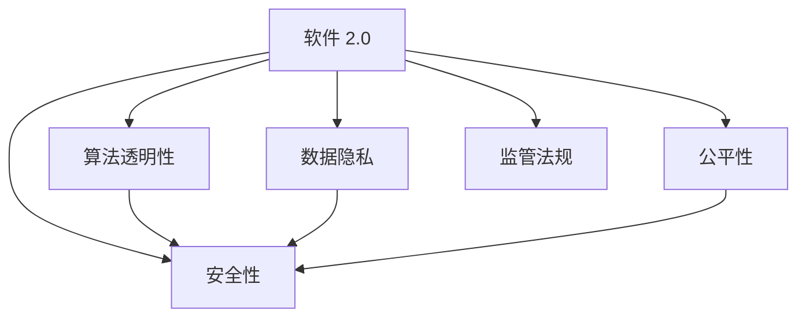

                 

# 软件 2.0 的伦理规范：人工智能的责任

> 关键词：人工智能,责任伦理,数据隐私,算法透明,可解释性,公平性,安全性,监管法规

## 1. 背景介绍

### 1.1 问题由来

随着人工智能技术的快速发展，尤其是深度学习和大数据分析技术的广泛应用，人类社会进入了“软件 2.0”时代。软件 2.0 是指基于人工智能和数据驱动的智能软件系统，其核心特性在于利用大规模数据和复杂算法，自动感知、学习、决策，实现自适应和自优化，极大提升了软件系统的智能化水平和效率。

然而，随着软件 2.0 的广泛应用，其带来的伦理和社会问题也日益凸显。例如，数据隐私保护、算法透明性、模型偏见、安全漏洞等问题，对个人权益、社会公平、国家安全等方面产生了深远影响。如何建立一套全面、合理的伦理规范，确保软件 2.0 在推广应用过程中，既能够发挥其潜力，又能够规避伦理风险，成为亟待解决的重要课题。

### 1.2 问题核心关键点

软件 2.0 的伦理问题主要集中在以下几个关键点：

- 数据隐私：如何保护用户数据的隐私和安全，避免滥用。
- 算法透明性：如何保证算法的决策过程透明、可解释，增强用户信任。
- 公平性：如何避免算法偏见，确保模型对不同群体公平对待。
- 安全性：如何防范软件 2.0 系统的安全漏洞，保障数据和系统的安全。
- 监管法规：如何制定和完善相关的法律法规，规范软件 2.0 的使用和开发。

这些问题不仅涉及技术实现，还牵扯到法律、伦理、社会价值观等多方面的复杂交织，需要在技术、法律、政策等层面上综合考虑，才能找到合理可行的解决方案。

### 1.3 问题研究意义

构建软件 2.0 的伦理规范，对于保障公众利益、促进技术健康发展、推动社会公平正义具有重要意义：

1. 保障公众利益：确保软件 2.0 在推广应用过程中，不会侵害用户隐私，造成社会不公。
2. 促进技术健康发展：通过伦理规范，引导开发者遵循合理使用数据、算法的原则，避免滥用技术，推动技术向善。
3. 推动社会公平正义：通过伦理规范，保障软件 2.0 系统对不同群体的公平对待，促进社会平等。
4. 加强法律法规建设：制定和完善相关法律法规，规范软件 2.0 的使用和开发，维护国家安全和社会稳定。

## 2. 核心概念与联系

### 2.1 核心概念概述

为了更好地理解软件 2.0 的伦理规范，本节将介绍几个关键核心概念：

- **软件 2.0**：指基于人工智能和数据驱动的智能软件系统，通过自动感知、学习、决策，实现自适应和自优化。
- **算法透明性**：指算法决策过程的透明、可解释性，允许用户理解和验证算法决策依据。
- **数据隐私**：指个人信息的保护，防止未经授权的数据收集、存储和使用。
- **公平性**：指算法对不同群体公平对待，避免偏见和歧视。
- **安全性**：指软件 2.0 系统的安全防护，防止恶意攻击和数据泄露。
- **监管法规**：指国家或行业对软件 2.0 使用的法律、政策和标准规范。

这些核心概念之间的逻辑关系可以通过以下Mermaid流程图来展示：



这个流程图展示了软件 2.0 与其关键伦理问题的相互关系：

1. 软件 2.0 的实现离不开算法、数据、安全性等多方面的支持。
2. 算法透明性、数据隐私、公平性和安全性，都是软件 2.0 伦理规范的重要组成部分。
3. 监管法规对软件 2.0 的使用和开发起到规范和监督作用，确保伦理规范的落实。

## 3. 核心算法原理 & 具体操作步骤
### 3.1 算法原理概述

软件 2.0 的伦理规范建立，依赖于对其核心算法原理的深刻理解。算法透明性、公平性和安全性是其中最为关键的三大原则。

- **算法透明性**：指算法决策过程的透明、可解释性，要求开发者能够清楚地解释算法如何做出决策。
- **公平性**：指算法对不同群体的公平对待，要求算法对所有用户一视同仁，避免偏见和歧视。
- **安全性**：指软件 2.0 系统的安全防护，要求系统能够抵御各种攻击和风险，保护数据和系统的安全。

### 3.2 算法步骤详解

构建软件 2.0 的伦理规范，通常需要经过以下几个关键步骤：

1. **数据收集与处理**：确保数据收集和使用过程中的合法性和透明度。
2. **算法设计**：在设计算法时，充分考虑公平性、透明性和安全性，避免偏见和漏洞。
3. **模型训练与优化**：在模型训练过程中，应用正则化技术、对抗训练等方法，增强模型的鲁棒性和公平性。
4. **系统部署与测试**：在软件 2.0 系统部署前，进行全面的测试和验证，确保系统的安全性、透明性和公平性。
5. **伦理审查与反馈**：建立伦理审查机制，定期对软件 2.0 系统进行评估和反馈，及时发现和解决问题。

### 3.3 算法优缺点

软件 2.0 的伦理规范构建，具有以下优点：

- **提升算法透明度**：通过算法透明性，增强用户对软件 2.0 系统的信任。
- **促进公平性**：避免算法偏见，确保模型对不同群体的公平对待。
- **保障安全性**：通过安全性防护，保障数据和系统的安全。

同时，这些规范也存在以下局限：

- **技术复杂性**：伦理规范的构建需要综合考虑技术、法律、伦理等多方面的因素，技术实现较为复杂。
- **法律挑战**：不同国家和地区对数据隐私、算法透明性等问题的法律法规差异较大，规范制定存在法律挑战。
- **伦理困境**：伦理规范需要在技术、社会价值观之间进行平衡，有时难以找到理想的解决方案。

### 3.4 算法应用领域

软件 2.0 的伦理规范构建，在多个领域具有广泛的应用：

- **金融行业**：确保算法透明性、公平性和安全性，防止金融诈骗、数据泄露等问题。
- **医疗健康**：保障患者数据隐私，确保算法对不同人群的公平对待，提升诊疗效果。
- **教育培训**：避免算法偏见，确保教育资源公平分配，促进教育公平。
- **智能城市**：确保系统透明性、安全性，保障城市运行安全、公平。
- **公共安全**：确保算法透明性、公平性，防止歧视性决策，保障社会公正。

## 4. 数学模型和公式 & 详细讲解 & 举例说明

### 4.1 数学模型构建

本节将使用数学语言对软件 2.0 的伦理规范构建过程进行更加严格的刻画。

假设软件 2.0 系统需要对大量用户数据进行预测，模型为 $f(x; \theta)$，其中 $x$ 为输入数据，$\theta$ 为模型参数。伦理规范的构建，需要从算法透明性、公平性和安全性三个方面进行数学建模。

### 4.2 公式推导过程

以下我们以数据隐私保护为例，推导隐私保护模型的构建方法。

假设需要保护的数据集为 $D=\{(x_i, y_i)\}_{i=1}^N$，其中 $x_i$ 为输入，$y_i$ 为标签。保护数据隐私的模型 $f(x; \theta)$ 应满足以下隐私保护条件：

1. **差分隐私**：任意两个用户 $x$ 和 $x'$ 的预测结果差异很小，即 $|f(x; \theta) - f(x'; \theta)| \leq \epsilon$，其中 $\epsilon$ 为隐私预算。

2. **去标识化**：无法从模型输出推断出用户具体信息，即对任意 $x$ 和 $x'$，存在 $P(f(x; \theta) = f(x'; \theta))$ 很小。

基于差分隐私的模型构建，可以通过加入噪声 $\xi$ 来扰动模型输出，即 $f(x; \theta) + \xi$，其中 $\xi$ 服从均值为0的高斯分布。具体推导过程如下：

$$
f(x; \theta) \approx f(x'; \theta) + \xi
$$

根据差分隐私条件，得到 $\xi$ 的方差：

$$
Var(\xi) \geq \frac{2\epsilon^2}{\delta^2}
$$

其中 $\delta$ 为模型的不确定性参数，与隐私预算 $\epsilon$ 和样本量 $N$ 有关。

### 4.3 案例分析与讲解

以医疗健康为例，分析如何通过伦理规范构建软件 2.0 系统，保障患者数据隐私和公平性。

**医疗数据隐私保护**：
- 在数据收集阶段，应确保患者知情同意，数据匿名化处理，防止个人信息泄露。
- 在模型训练和部署过程中，应用差分隐私等技术，防止模型学习到患者敏感信息。

**医疗数据公平性**：
- 在算法设计阶段，避免算法偏见，确保模型对不同病情的患者一视同仁。
- 在模型评估和优化阶段，定期评估模型对不同群体的公平性，及时调整模型参数。

## 5. 项目实践：代码实例和详细解释说明

### 5.1 开发环境搭建

在进行伦理规范构建实践前，我们需要准备好开发环境。以下是使用Python进行Sympy开发的环境配置流程：

1. 安装Anaconda：从官网下载并安装Anaconda，用于创建独立的Python环境。

2. 创建并激活虚拟环境：
```bash
conda create -n sympy-env python=3.8 
conda activate sympy-env
```

3. 安装Sympy：从官网获取对应的安装命令。例如：
```bash
conda install sympy
```

4. 安装各类工具包：
```bash
pip install numpy pandas scikit-learn matplotlib tqdm jupyter notebook ipython
```

完成上述步骤后，即可在`sympy-env`环境中开始伦理规范构建实践。

### 5.2 源代码详细实现

这里我们以差分隐私保护为例，给出使用Sympy进行隐私保护的代码实现。

首先，定义差分隐私保护的模型：

```python
from sympy import symbols, diffpriv, Uniform

theta = symbols('theta')
x = symbols('x')
f = theta.dot(x) + 1 # 简单线性模型

# 加入差分隐私噪声
xi = diffpriv(f, epsilon=1, delta=0.01) # epsilon为隐私预算，delta为不确定性参数
f_priv = f + xi

# 输出隐私保护模型
f_priv
```

然后，定义差分隐私保护的函数，并应用于数据集：

```python
from sympy.stats import density, P

# 定义数据集
D = [(xi, yi) for xi in range(10) for yi in range(10)]

# 应用差分隐私保护
D_priv = [(xi + xi_priv, yi) for xi, yi in D for xi_priv in diffpriv(xi, epsilon=1, delta=0.01)]

# 输出隐私保护后的数据集
D_priv
```

### 5.3 代码解读与分析

让我们再详细解读一下关键代码的实现细节：

**定义差分隐私模型**：
- `symbols`函数用于定义符号变量。
- `diffpriv`函数用于加入差分隐私噪声，其中`epsilon`为隐私预算，`delta`为不确定性参数。

**差分隐私保护函数**：
- `sympy.stats`模块用于定义数据分布和计算概率。
- `P`函数用于计算概率。
- `density`函数用于定义数据分布密度。

**数据集生成**：
- `sympy.stats`模块用于生成随机数。
- `diffpriv`函数用于加入差分隐私噪声。

这些代码展示了如何使用Sympy实现差分隐私保护，从而构建具有伦理规范的软件 2.0 系统。在实际应用中，还需要考虑更多的伦理规范，如算法透明性、公平性和安全性，通过类似的方法进行建模和优化。

## 6. 实际应用场景

### 6.1 金融行业

在金融行业中，软件 2.0 系统广泛用于信用评分、风险评估、反欺诈检测等场景。然而，这些系统在应用过程中，面临数据隐私保护、算法透明性和公平性等问题，需要建立完善的伦理规范。

具体而言，可以采取以下措施：

- **数据隐私保护**：采用差分隐私、联邦学习等技术，确保数据在传输和处理过程中不被泄露。
- **算法透明性**：建立模型审查机制，定期评估和审核算法决策过程，增强用户信任。
- **公平性**：通过公平性指标评估，识别并纠正算法偏见，确保对不同客户群体的公平对待。

### 6.2 医疗健康

在医疗健康领域，软件 2.0 系统可用于疾病预测、治疗方案推荐等场景。然而，这些系统在应用过程中，面临患者数据隐私保护、算法透明性和公平性等问题，需要建立完善的伦理规范。

具体而言，可以采取以下措施：

- **数据隐私保护**：采用数据去标识化、差分隐私等技术，确保患者数据安全。
- **算法透明性**：通过算法可解释性分析，解释模型决策过程，增强医生和患者信任。
- **公平性**：通过公平性指标评估，识别并纠正算法偏见，确保对不同病情患者的公平对待。

### 6.3 教育培训

在教育培训领域，软件 2.0 系统可用于智能作业批改、个性化学习推荐等场景。然而，这些系统在应用过程中，面临数据隐私保护、算法透明性和公平性等问题，需要建立完善的伦理规范。

具体而言，可以采取以下措施：

- **数据隐私保护**：采用数据去标识化、差分隐私等技术，确保学生数据安全。
- **算法透明性**：通过算法可解释性分析，解释模型推荐依据，增强教师和学生信任。
- **公平性**：通过公平性指标评估，识别并纠正算法偏见，确保对不同学生群体的公平对待。

### 6.4 未来应用展望

随着软件 2.0 技术的不断发展，未来伦理规范的应用将更加广泛，对技术推广和社会进步将产生深远影响。

在智慧医疗领域，基于伦理规范的软件 2.0 系统，可以更好地保护患者隐私，提升诊疗效果，促进医疗健康事业的发展。

在智能教育领域，基于伦理规范的软件 2.0 系统，可以避免算法偏见，确保教育资源公平分配，提升教育公平水平。

在智能城市治理中，基于伦理规范的软件 2.0 系统，可以确保系统透明性、安全性，提升城市管理效率和公平性。

此外，在企业生产、社会治理、文娱传媒等众多领域，基于伦理规范的软件 2.0 系统，也将不断涌现，为经济社会发展注入新的动力。相信随着学界和产业界的共同努力，伦理规范必将引领软件 2.0 技术迈向更高的台阶，推动人工智能技术更加健康、安全、公正地应用。

## 7. 工具和资源推荐

### 7.1 学习资源推荐

为了帮助开发者系统掌握软件 2.0 的伦理规范的理论基础和实践技巧，这里推荐一些优质的学习资源：

1. **《人工智能伦理导论》**：全面介绍人工智能伦理的基础概念和伦理规范，涵盖数据隐私、算法透明性、公平性等多个方面。
2. **《深度学习伦理》**：系统讲解深度学习技术在应用过程中面临的伦理问题，提出相应的解决方案。
3. **《人工智能法》**：研究人工智能技术的法律、伦理和社会影响，提出相应的规范和建议。
4. **《软件 2.0 伦理规范》**：由软件 2.0 专家撰写，介绍伦理规范在软件 2.0 系统中的应用。
5. **CS224N《深度学习伦理》课程**：斯坦福大学开设的深度学习伦理课程，深入浅出地讲解伦理规范的理论基础和应用案例。

通过对这些资源的学习实践，相信你一定能够快速掌握软件 2.0 的伦理规范的精髓，并用于解决实际的伦理问题。

### 7.2 开发工具推荐

高效的开发离不开优秀的工具支持。以下是几款用于软件 2.0 伦理规范开发的常用工具：

1. **Sympy**：符号计算库，用于数学建模和计算。
2. **TensorFlow**：开源深度学习框架，支持分布式计算和模型优化。
3. **PyTorch**：开源深度学习框架，支持动态计算图和模型训练。
4. **OpenAI**：提供先进的自然语言处理技术，用于构建具有伦理规范的AI系统。
5. **Fairness Indicators**：用于评估和纠正算法偏见的工具库，支持多种机器学习模型。
6. **diffpriv**：用于实现差分隐私保护的工具库，支持Python和R语言。

合理利用这些工具，可以显著提升软件 2.0 伦理规范的开发效率，加快创新迭代的步伐。

### 7.3 相关论文推荐

软件 2.0 的伦理规范发展源于学界的持续研究。以下是几篇奠基性的相关论文，推荐阅读：

1. **《软件 2.0: 深度学习与人工智能》**：介绍软件 2.0 技术的基本概念和发展历程，讨论其伦理问题。
2. **《人工智能伦理：一个视角》**：系统研究人工智能技术的伦理问题，提出相应的规范和建议。
3. **《深度学习伦理：挑战与对策》**：深入探讨深度学习技术在应用过程中面临的伦理问题，提出相应的解决方案。
4. **《数据隐私保护：理论与实践》**：全面介绍数据隐私保护的理论基础和实践技术。
5. **《公平算法：理论与应用》**：系统讲解公平算法的理论基础和实际应用，提出相应的规范和建议。

这些论文代表了大语言模型微调技术的发展脉络。通过学习这些前沿成果，可以帮助研究者把握学科前进方向，激发更多的创新灵感。

## 8. 总结：未来发展趋势与挑战

### 8.1 总结

本文对软件 2.0 的伦理规范进行了全面系统的介绍。首先阐述了软件 2.0 伦理规范的研究背景和意义，明确了伦理规范在推广应用过程中的重要价值。其次，从原理到实践，详细讲解了伦理规范的构建方法，给出了伦理规范构建的完整代码实例。同时，本文还广泛探讨了伦理规范在金融、医疗、教育等多个领域的应用前景，展示了伦理规范的广泛应用潜力。最后，本文精选了伦理规范的学习资源，力求为读者提供全方位的技术指引。

通过本文的系统梳理，可以看到，构建软件 2.0 的伦理规范，对于保障公众利益、促进技术健康发展、推动社会公平正义具有重要意义。伦理规范的构建，不仅需要技术支持，还需要法律、伦理、政策等多方面的综合考虑，才能找到合理可行的解决方案。

### 8.2 未来发展趋势

展望未来，软件 2.0 的伦理规范将呈现以下几个发展趋势：

1. **技术标准制定**：随着伦理规范研究的深入，将逐步形成一套完善的技术标准和规范，指导软件开发和应用。
2. **伦理指南发布**：各国政府和行业组织将发布伦理指南，提供具体的伦理规范实施方案，促进规范落实。
3. **伦理审查机制**：建立伦理审查机制，对软件 2.0 系统的开发和应用进行监督，确保规范的遵守。
4. **伦理培训普及**：开展伦理培训，提高开发者和用户的伦理意识，增强规范的执行力。
5. **伦理工具开发**：开发更多伦理工具，如隐私保护、公平性检测等，支持伦理规范的构建和应用。

以上趋势凸显了伦理规范的广阔前景。这些方向的探索发展，必将进一步提升软件 2.0 系统的性能和应用范围，为人类认知智能的进化带来深远影响。

### 8.3 面临的挑战

尽管软件 2.0 的伦理规范构建取得了一些进展，但在迈向更加智能化、普适化应用的过程中，仍然面临诸多挑战：

1. **技术实现复杂**：伦理规范的构建需要综合考虑技术、法律、伦理等多方面的因素，技术实现较为复杂。
2. **法律和政策差异**：不同国家和地区对数据隐私、算法透明性等问题的法律法规差异较大，规范制定存在法律挑战。
3. **伦理困境**：伦理规范需要在技术、社会价值观之间进行平衡，有时难以找到理想的解决方案。
4. **用户信任不足**：算法透明性和公平性问题，导致用户对软件 2.0 系统缺乏信任。
5. **监管落实难度**：伦理规范的实施需要多方协同，监管落实难度较大。

### 8.4 研究展望

面对软件 2.0 伦理规范所面临的挑战，未来的研究需要在以下几个方面寻求新的突破：

1. **多学科融合**：结合法律、伦理、政策等多学科知识，形成综合的伦理规范体系。
2. **技术自动化**：开发自动化伦理评估工具，提高伦理规范的实施效率。
3. **用户参与**：增强用户对伦理规范的参与和监督，形成良好的社会共识。
4. **隐私保护创新**：开发新的隐私保护技术，提升数据隐私保护水平。
5. **公平性优化**：研究公平性指标和优化算法，提升算法公平性。

这些研究方向的探索，必将引领软件 2.0 技术迈向更高的台阶，推动人工智能技术更加健康、安全、公正地应用。

## 9. 附录：常见问题与解答

**Q1：软件 2.0 系统的数据隐私保护如何实现？**

A: 软件 2.0 系统的数据隐私保护，可以通过差分隐私、联邦学习等技术实现。差分隐私通过加入噪声扰动，使得模型输出的分布变化不大，同时保证数据隐私；联邦学习通过在本地设备上进行训练，不传输原始数据，保障数据安全。

**Q2：如何构建具有算法透明性的软件 2.0 系统？**

A: 构建具有算法透明性的软件 2.0 系统，可以通过模型审查、可解释性分析等方法实现。模型审查通过对算法决策过程进行审计，确保透明性；可解释性分析通过解释模型内部工作机制，增强用户信任。

**Q3：如何评估软件 2.0 系统的公平性？**

A: 评估软件 2.0 系统的公平性，可以通过公平性指标和公平性检测工具实现。公平性指标包括公平性指标、准确率差异等，用于评估模型对不同群体的公平对待；公平性检测工具如Fairness Indicators，可以自动检测和纠正算法偏见。

**Q4：如何保障软件 2.0 系统的安全性？**

A: 保障软件 2.0 系统的安全性，可以通过安全加固、漏洞检测等方法实现。安全加固通过代码审计、漏洞扫描等手段，增强系统的安全性；漏洞检测通过自动化工具，及时发现和修复系统漏洞。

**Q5：如何制定软件 2.0 系统的伦理规范？**

A: 制定软件 2.0 系统的伦理规范，需要综合考虑技术、法律、伦理等多方面的因素。可以借鉴已有的伦理指南和标准，结合具体的业务场景，制定适用于特定领域的伦理规范。

---

作者：禅与计算机程序设计艺术 / Zen and the Art of Computer Programming

