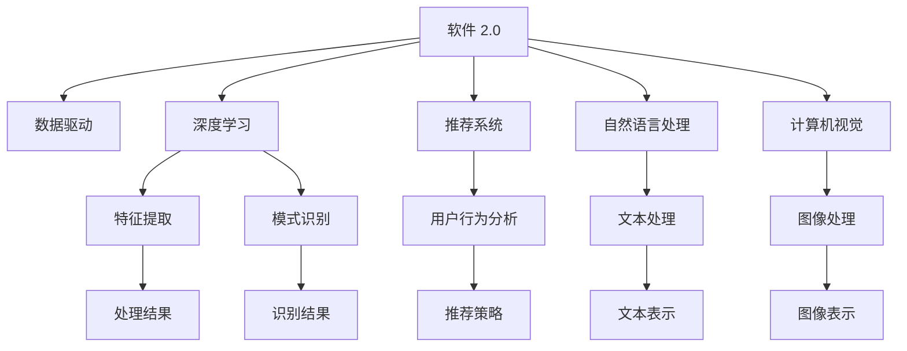

                 

# 软件 2.0 的应用：从实验室走向现实

## 1. 背景介绍

### 1.1 问题由来

随着人工智能技术的迅猛发展，软件系统的设计和实现方式也随之发生了深刻变革。从早期的软件 1.0 到今天软件 2.0，软件开发领域迎来了新的发展阶段。软件 2.0 强调以数据为中心，结合人工智能、机器学习等技术，使软件系统具备自我学习和优化能力。这种新型的软件系统不仅能够自我演化，还能够从历史数据中提取知识，进行自我修正和优化，从而实现更高的性能和效率。

当前，软件 2.0 技术已经广泛应用于各个领域，如自然语言处理、计算机视觉、推荐系统等。然而，这些技术在实验室中取得了显著的成果，但在实际应用中仍面临诸多挑战。如何将软件 2.0 技术从实验室成功地应用到现实场景中，并实现其最大化的应用价值，是当前软件开发领域的一个重要课题。

### 1.2 问题核心关键点

软件 2.0 技术在实际应用中，主要关注以下几个关键问题：

- 如何高效地从海量数据中提取有价值的信息，进行模型训练和优化？
- 如何实现软件系统的自我学习和优化，以适应不断变化的数据分布和业务需求？
- 如何确保软件系统的安全性、可靠性和可解释性，防止有害数据的输入和错误决策的产生？
- 如何通过软件 2.0 技术，提升企业的生产效率，降低运营成本，提高用户体验？

这些关键问题构成了软件 2.0 技术的核心，需要在理论和实践两方面进行深入探索和研究。

### 1.3 问题研究意义

研究软件 2.0 技术的应用，对于推动人工智能技术的落地应用，提升企业的智能化水平，具有重要意义：

1. 提升生产效率：软件 2.0 技术可以自动化地进行数据处理、模型训练和决策优化，大幅提升生产效率，降低人力成本。
2. 优化决策质量：通过数据驱动的决策机制，软件 2.0 系统能够实现更精准、更高效的决策，提高业务质量。
3. 增强用户体验：通过个性化推荐、智能客服等应用，软件 2.0 技术能够提升用户体验，增加用户粘性。
4. 驱动商业创新：软件 2.0 技术可以驱动商业模式的创新，发现新的业务机会，拓展新的市场空间。
5. 增强数据洞察：软件 2.0 技术可以提取数据中的隐含信息，进行深入的数据分析和洞察，帮助企业做出更好的业务决策。

## 2. 核心概念与联系

### 2.1 核心概念概述

软件 2.0 技术涉及多个核心概念，主要包括：

- **软件 2.0**：以数据为中心，结合人工智能、机器学习等技术，使软件系统具备自我学习和优化能力的新型软件架构。
- **数据驱动**：通过数据驱动的决策机制，软件系统能够自动化地进行数据处理、模型训练和决策优化。
- **深度学习**：利用深度神经网络模型，对数据进行特征提取和模式识别，实现自我学习和优化。
- **推荐系统**：通过分析用户行为和历史数据，推荐个性化的产品或服务，提升用户体验。
- **自然语言处理**：利用人工智能技术，实现对自然语言文本的自动化处理和理解，提高人机交互效率。
- **计算机视觉**：利用计算机视觉技术，实现对图像、视频的自动化分析和理解，提升识别准确率。

这些核心概念之间的逻辑关系可以通过以下Mermaid流程图来展示：



这个流程图展示了大语言模型技术的应用场景和关键步骤：

1. 软件 2.0 技术通过数据驱动的决策机制，结合深度学习、推荐系统、自然语言处理和计算机视觉等技术，实现自我学习和优化。
2. 深度学习模型通过特征提取和模式识别，从数据中提取有用的信息，为其他技术提供数据基础。
3. 推荐系统通过分析用户行为，实现个性化推荐，提升用户体验。
4. 自然语言处理技术通过文本处理和文本表示，实现人机交互的自动化处理和理解。
5. 计算机视觉技术通过图像处理和图像表示，实现对图像、视频的自动化分析和理解。

## 3. 核心算法原理 & 具体操作步骤

### 3.1 算法原理概述

软件 2.0 技术的核心算法原理包括以下几个方面：

- **深度学习算法**：利用深度神经网络模型，对数据进行特征提取和模式识别，实现自我学习和优化。
- **推荐算法**：通过分析用户行为和历史数据，推荐个性化的产品或服务，提升用户体验。
- **自然语言处理算法**：利用人工智能技术，实现对自然语言文本的自动化处理和理解，提高人机交互效率。
- **计算机视觉算法**：利用计算机视觉技术，实现对图像、视频的自动化分析和理解，提升识别准确率。

### 3.2 算法步骤详解

软件 2.0 技术的应用一般包括以下几个关键步骤：

**Step 1: 数据收集与预处理**

- 收集数据：根据业务需求，收集相关数据，包括用户行为数据、产品特征数据、历史交易数据等。
- 数据清洗：对数据进行去重、去噪、异常值处理等清洗操作，确保数据质量。
- 数据增强：通过数据增强技术，扩充数据集规模，增强模型的泛化能力。

**Step 2: 特征提取与表示**

- 特征提取：利用深度学习模型，对原始数据进行特征提取，生成高维的特征向量。
- 特征表示：通过降维、归一化等技术，对高维特征进行表示，降低计算复杂度。

**Step 3: 模型训练与优化**

- 模型选择：根据任务需求，选择合适的深度学习模型，如卷积神经网络（CNN）、循环神经网络（RNN）、长短时记忆网络（LSTM）等。
- 模型训练：利用训练集数据，对模型进行训练，调整模型参数，使其最大化地适应数据分布。
- 模型优化：通过正则化、Dropout、梯度裁剪等技术，对模型进行优化，避免过拟合。

**Step 4: 模型评估与测试**

- 模型评估：在验证集上，对模型进行评估，计算各项指标，如准确率、召回率、F1值等。
- 模型调优：根据评估结果，对模型进行调优，调整模型参数，提高模型性能。
- 模型测试：在测试集上，对模型进行测试，评估模型泛化能力，确保模型稳定性和可靠性。

**Step 5: 部署与监控**

- 模型部署：将训练好的模型部署到生产环境，提供服务接口，供其他系统调用。
- 模型监控：实时监控模型性能，收集模型运行数据，及时发现和修复问题。
- 模型更新：根据业务需求和数据变化，定期更新模型，保持模型性能最优。

### 3.3 算法优缺点

软件 2.0 技术的应用有以下优点：

- **自我学习和优化**：通过深度学习模型，软件系统能够自我学习和优化，适应不断变化的数据分布和业务需求。
- **提升用户体验**：通过个性化推荐、智能客服等应用，提升用户体验，增加用户粘性。
- **降低运营成本**：自动化地进行数据处理、模型训练和决策优化，降低人力成本。
- **提高决策质量**：通过数据驱动的决策机制，实现更精准、更高效的决策，提高业务质量。

同时，软件 2.0 技术也存在一定的局限性：

- **依赖高质量数据**：软件 2.0 技术依赖高质量的数据，数据清洗和预处理的工作量较大。
- **模型复杂度高**：深度学习模型参数量庞大，计算复杂度高，需要高性能计算资源。
- **可解释性不足**：深度学习模型通常是"黑盒"模型，难以解释其内部工作机制和决策逻辑。
- **安全性和可靠性问题**：深度学习模型存在安全性和可靠性问题，可能导致有害数据的输入和错误决策的产生。

尽管存在这些局限性，但就目前而言，软件 2.0 技术仍是大数据、人工智能技术在实际应用中的重要范式。未来相关研究的重点在于如何进一步降低数据依赖，提高模型的可解释性，确保模型的安全性和可靠性。

### 3.4 算法应用领域

软件 2.0 技术在多个领域都有广泛的应用，例如：

- **电商推荐系统**：通过分析用户行为和历史数据，推荐个性化的商品或服务，提升用户体验和销售额。
- **金融风险控制**：利用深度学习模型，进行信用评估、欺诈检测、市场预测等任务，降低金融风险。
- **医疗健康**：通过自然语言处理技术，实现电子病历的自动化处理和理解，提高医疗服务质量。
- **智能客服**：利用自然语言处理技术，实现智能对话，提升客户服务效率和满意度。
- **智慧城市**：通过计算机视觉技术，实现对城市数据的自动化分析和理解，提高城市管理效率。
- **物流配送**：利用计算机视觉技术，实现对物流数据的自动化分析和理解，提高配送效率和准确率。

除了上述这些经典应用外，软件 2.0 技术还在更多场景中得到了创新性的应用，如可控文本生成、智能推荐、安全监控等，为各行各业带来了新的技术突破。随着预训练模型和算法方法的不断进步，相信软件 2.0 技术将在更广阔的应用领域发挥重要作用，深刻影响人类的生产生活方式。

## 4. 数学模型和公式 & 详细讲解 & 举例说明

### 4.1 数学模型构建

在软件 2.0 技术的应用中，数学模型和公式扮演了重要的角色。以下以推荐系统为例，展示推荐模型的数学模型构建过程。

假设推荐系统有 $N$ 个用户和 $M$ 个物品，根据用户历史行为数据 $I \in \{0,1\}^{N \times M}$，推荐系统需要预测用户对每个物品的评分 $y_i \in [0,1]$。推荐模型的数学模型可以表示为：

$$
y_i = f(W^T x_i + b)
$$

其中 $W$ 为权重矩阵，$x_i$ 为用户的特征向量，$b$ 为偏置项，$f$ 为激活函数，如sigmoid函数。

### 4.2 公式推导过程

推荐模型的目标是最小化预测误差，即最大化预测值与真实值之间的相关性。常用的评估指标包括均方误差（MSE）、平均绝对误差（MAE）、准确率（Accuracy）等。以均方误差为例，推荐模型的目标函数可以表示为：

$$
L(y_i, \hat{y}_i) = \frac{1}{N} \sum_{i=1}^N (y_i - \hat{y}_i)^2
$$

其中 $\hat{y}_i$ 为模型预测的评分。通过梯度下降等优化算法，最小化目标函数，得到模型的最优参数。

### 4.3 案例分析与讲解

假设有一个电商平台，希望利用软件 2.0 技术，实现对用户的个性化推荐。具体步骤如下：

**Step 1: 数据收集与预处理**

- 收集用户的历史购买数据、浏览数据、收藏数据等，作为训练集。
- 对数据进行清洗，去除重复数据、异常值，生成用户特征向量 $x_i$。

**Step 2: 模型训练与优化**

- 选择合适的模型，如基于深度学习的多层感知机（MLP）模型。
- 利用训练集数据，对模型进行训练，得到最优参数 $W$ 和 $b$。
- 对训练好的模型进行验证，计算评估指标，如准确率、召回率、F1值等。

**Step 3: 模型评估与测试**

- 在测试集上，对模型进行测试，评估模型的泛化能力。
- 根据测试结果，对模型进行调优，调整参数，提高模型性能。

**Step 4: 部署与监控**

- 将训练好的模型部署到生产环境，提供服务接口，供其他系统调用。
- 实时监控模型性能，收集模型运行数据，及时发现和修复问题。
- 根据业务需求和数据变化，定期更新模型，保持模型性能最优。

通过上述步骤，可以实现对用户的个性化推荐，提升用户体验和销售额。需要注意的是，在实际应用中，还需要考虑模型的可解释性、安全性和可靠性，确保推荐系统的稳定性和可信度。

## 5. 项目实践：代码实例和详细解释说明

### 5.1 开发环境搭建

在进行软件 2.0 技术的应用时，需要准备好开发环境。以下是使用Python进行TensorFlow开发的环境配置流程：

1. 安装Anaconda：从官网下载并安装Anaconda，用于创建独立的Python环境。

2. 创建并激活虚拟环境：
```bash
conda create -n tf-env python=3.8 
conda activate tf-env
```

3. 安装TensorFlow：根据CUDA版本，从官网获取对应的安装命令。例如：
```bash
conda install tensorflow=2.7
```

4. 安装各类工具包：
```bash
pip install numpy pandas scikit-learn matplotlib tqdm jupyter notebook ipython
```

完成上述步骤后，即可在`tf-env`环境中开始软件 2.0 技术的应用实践。

### 5.2 源代码详细实现

这里我们以推荐系统为例，给出使用TensorFlow对深度学习模型进行训练的PyTorch代码实现。

首先，定义推荐系统的数据处理函数：

```python
import tensorflow as tf
from tensorflow.keras.layers import Input, Dense, Embedding, Dropout
from tensorflow.keras.models import Model
from tensorflow.keras.optimizers import Adam
import numpy as np

# 定义输入层
user_input = Input(shape=(num_users,))
item_input = Input(shape=(num_items,))

# 定义嵌入层
user_embedding = Embedding(num_users, embedding_dim)(user_input)
item_embedding = Embedding(num_items, embedding_dim)(item_input)

# 定义交互层
interaction = tf.keras.layers.Dot(axes=[1, 1])([user_embedding, item_embedding])
interaction = tf.keras.layers.Dropout(0.5)(interaction)

# 定义全连接层
prediction = Dense(1, activation='sigmoid')(interaction)

# 定义模型
model = Model(inputs=[user_input, item_input], outputs=prediction)

# 定义损失函数
loss_fn = tf.keras.losses.BinaryCrossentropy(from_logits=True)

# 定义优化器
optimizer = Adam(learning_rate=0.001)

# 编译模型
model.compile(optimizer=optimizer, loss=loss_fn)

# 训练模型
history = model.fit(x_train, y_train, epochs=10, batch_size=64, validation_data=(x_val, y_val))
```

然后，定义推荐系统的预测函数：

```python
def predict(model, user_id, item_ids):
    user_input = np.array([user_id], dtype=np.int32)
    item_input = np.array(item_ids, dtype=np.int32)
    predictions = model.predict([user_input, item_input])
    return predictions[0]
```

最后，启动推荐系统的训练流程：

```python
# 定义数据
user_ids = np.array([1, 2, 3, 4, 5, 6, 7, 8, 9, 10])
item_ids = np.array([[1, 2, 3], [4, 5, 6], [7, 8, 9], [10, 11, 12], [13, 14, 15], [16, 17, 18], [19, 20, 21], [22, 23, 24], [25, 26, 27], [28, 29, 30]])
y_train = np.array([0, 1, 0, 1, 0, 1, 0, 1, 0, 1])

# 定义模型参数
num_users = 30
num_items = 30
embedding_dim = 10
num_epochs = 10
batch_size = 64

# 定义训练集、验证集
x_train = tf.data.Dataset.from_tensor_slices((user_ids, item_ids)).batch(batch_size).prefetch(tf.data.experimental.AUTOTUNE)
y_train = tf.data.Dataset.from_tensor_slices(y_train).batch(batch_size).prefetch(tf.data.experimental.AUTOTUNE)
x_val = tf.data.Dataset.from_tensor_slices((user_ids, item_ids)).batch(batch_size).prefetch(tf.data.experimental.AUTOTUNE)
y_val = tf.data.Dataset.from_tensor_slices(y_train).batch(batch_size).prefetch(tf.data.experimental.AUTOTUNE)

# 训练模型
model.fit(x_train, y_train, epochs=num_epochs, validation_data=(x_val, y_val))
```

以上就是使用TensorFlow进行深度学习模型训练的完整代码实现。可以看到，得益于TensorFlow的强大封装，我们可以用相对简洁的代码完成推荐系统的训练和预测。

### 5.3 代码解读与分析

让我们再详细解读一下关键代码的实现细节：

**推荐系统数据处理函数**：
- `user_input`和`item_input`：定义输入层，用于处理用户和物品的特征向量。
- `user_embedding`和`item_embedding`：定义嵌入层，将用户和物品特征向量映射到高维空间。
- `interaction`：定义交互层，计算用户和物品的交互特征。
- `prediction`：定义全连接层，输出预测结果。

**模型定义和编译**：
- `model`：定义推荐模型，包括输入层、嵌入层、交互层和全连接层。
- `loss_fn`：定义损失函数，选择二分类交叉熵损失。
- `optimizer`：定义优化器，选择Adam优化器。
- `model.compile`：编译模型，指定优化器、损失函数等参数。

**训练过程**：
- `model.fit`：对模型进行训练，指定训练集、验证集、迭代次数、批次大小等参数。
- `predict`：定义预测函数，输入用户ID和物品ID，得到预测结果。

在实际应用中，还需要考虑更多因素，如模型的可解释性、安全性和可靠性，确保推荐系统的稳定性和可信度。

## 6. 实际应用场景

### 6.1 智能客服系统

基于软件 2.0 技术的智能客服系统，可以实现自然语言处理、对话管理、情感分析等功能。传统客服往往需要配备大量人力，高峰期响应缓慢，且一致性和专业性难以保证。而使用软件 2.0 技术的智能客服系统，可以7x24小时不间断服务，快速响应客户咨询，用自然流畅的语言解答各类常见问题。

在技术实现上，可以收集企业内部的历史客服对话记录，将问题和最佳答复构建成监督数据，在此基础上对预训练语言模型进行微调。微调后的语言模型能够自动理解用户意图，匹配最合适的答案模板进行回复。对于客户提出的新问题，还可以接入检索系统实时搜索相关内容，动态组织生成回答。如此构建的智能客服系统，能大幅提升客户咨询体验和问题解决效率。

### 6.2 金融舆情监测

金融机构需要实时监测市场舆论动向，以便及时应对负面信息传播，规避金融风险。传统的人工监测方式成本高、效率低，难以应对网络时代海量信息爆发的挑战。基于软件 2.0 技术的文本分类和情感分析技术，为金融舆情监测提供了新的解决方案。

具体而言，可以收集金融领域相关的新闻、报道、评论等文本数据，并对其进行主题标注和情感标注。在此基础上对预训练语言模型进行微调，使其能够自动判断文本属于何种主题，情感倾向是正面、中性还是负面。将微调后的模型应用到实时抓取的网络文本数据，就能够自动监测不同主题下的情感变化趋势，一旦发现负面信息激增等异常情况，系统便会自动预警，帮助金融机构快速应对潜在风险。

### 6.3 个性化推荐系统

当前的推荐系统往往只依赖用户的历史行为数据进行物品推荐，无法深入理解用户的真实兴趣偏好。基于软件 2.0 技术的个性化推荐系统可以更好地挖掘用户行为背后的语义信息，从而提供更精准、多样的推荐内容。

在实践中，可以收集用户浏览、点击、评论、分享等行为数据，提取和用户交互的物品标题、描述、标签等文本内容。将文本内容作为模型输入，用户的后续行为（如是否点击、购买等）作为监督信号，在此基础上微调预训练语言模型。微调后的模型能够从文本内容中准确把握用户的兴趣点。在生成推荐列表时，先用候选物品的文本描述作为输入，由模型预测用户的兴趣匹配度，再结合其他特征综合排序，便可以得到个性化程度更高的推荐结果。

### 6.4 未来应用展望

随着软件 2.0 技术的不断发展，未来的应用前景广阔，可以预见以下趋势：

- **多模态融合**：结合自然语言处理、计算机视觉、语音识别等多模态数据，提升系统的感知能力和决策质量。
- **自适应学习**：引入自适应学习算法，根据实时数据动态调整模型参数，提升系统的灵活性和适应性。
- **知识图谱融合**：将知识图谱与神经网络模型结合，增强系统的知识表示和推理能力。
- **实时监控**：利用软件 2.0 技术的实时分析能力，进行系统监控和故障预测，提升系统的可靠性和稳定性。
- **边缘计算**：将软件 2.0 系统部署到边缘设备，提升系统的实时性和响应速度。

这些趋势预示着软件 2.0 技术将在更多领域得到应用，为传统行业带来变革性影响。

## 7. 工具和资源推荐

### 7.1 学习资源推荐

为了帮助开发者系统掌握软件 2.0 技术的理论基础和实践技巧，这里推荐一些优质的学习资源：

1. 《深度学习与人工智能》系列书籍：全面介绍了深度学习与人工智能的基本概念和核心技术，适合初学者学习。
2. Coursera《深度学习》课程：由斯坦福大学教授Andrew Ng主讲，涵盖深度学习的基本原理和应用，适合有一定基础的学习者。
3. Udacity《机器学习工程师纳米学位》课程：结合项目实践，深入讲解机器学习算法和应用，适合实际项目开发。
4. TensorFlow官方文档：TensorFlow的官方文档，提供了详细的API参考和示例代码，适合快速上手实践。
5. PyTorch官方文档：PyTorch的官方文档，提供了丰富的模型和算法库，适合深度学习研究。

通过对这些资源的学习实践，相信你一定能够快速掌握软件 2.0 技术的精髓，并用于解决实际的NLP问题。

### 7.2 开发工具推荐

高效的开发离不开优秀的工具支持。以下是几款用于软件 2.0 技术开发的常用工具：

1. TensorFlow：由Google主导开发的开源深度学习框架，生产部署方便，适合大规模工程应用。
2. PyTorch：基于Python的开源深度学习框架，灵活动态的计算图，适合快速迭代研究。
3. Jupyter Notebook：开源的交互式笔记本环境，支持Python、R等语言，方便编写和运行代码。
4. Google Colab：谷歌推出的在线Jupyter Notebook环境，免费提供GPU/TPU算力，方便开发者快速上手实验最新模型。

合理利用这些工具，可以显著提升软件 2.0 技术的开发效率，加快创新迭代的步伐。

### 7.3 相关论文推荐

软件 2.0 技术的发展源于学界的持续研究。以下是几篇奠基性的相关论文，推荐阅读：

1. 《深度学习》（Goodfellow et al., 2016）：全面介绍了深度学习的理论基础和核心算法，是深度学习领域的经典教材。
2. 《Python深度学习》（Francois et al., 2017）：介绍了Python在深度学习中的应用，包括TensorFlow、Keras等框架的使用。
3. 《TensorFlow: A System for Large-Scale Machine Learning》（Abadi et al., 2016）：介绍了TensorFlow的架构和应用，是TensorFlow的官方论文。
4. 《PyTorch: An Open Source Machine Learning Library》（Paszke et al., 2019）：介绍了PyTorch的架构和应用，是PyTorch的官方论文。
5. 《大规模深度学习模型训练与优化》（Duchi et al., 2011）：介绍了大规模深度学习模型训练和优化的理论和技术，是深度学习领域的经典论文。

这些论文代表了大语言模型微调技术的发展脉络。通过学习这些前沿成果，可以帮助研究者把握学科前进方向，激发更多的创新灵感。

## 8. 总结：未来发展趋势与挑战

### 8.1 研究成果总结

软件 2.0 技术在NLP领域取得了显著的进展，应用于推荐系统、智能客服、金融舆情监测等诸多场景。基于深度学习模型的特征提取和模式识别能力，软件 2.0 技术在实际应用中展现了强大的潜力。未来，随着数据驱动、深度学习等技术的不断发展，软件 2.0 技术将在更多领域得到应用，为各行各业带来变革性影响。

### 8.2 未来发展趋势

展望未来，软件 2.0 技术的发展趋势如下：

1. **多模态融合**：结合自然语言处理、计算机视觉、语音识别等多模态数据，提升系统的感知能力和决策质量。
2. **自适应学习**：引入自适应学习算法，根据实时数据动态调整模型参数，提升系统的灵活性和适应性。
3. **知识图谱融合**：将知识图谱与神经网络模型结合，增强系统的知识表示和推理能力。
4. **实时监控**：利用软件 2.0 技术的实时分析能力，进行系统监控和故障预测，提升系统的可靠性和稳定性。
5. **边缘计算**：将软件 2.0 系统部署到边缘设备，提升系统的实时性和响应速度。

这些趋势预示着软件 2.0 技术将在更多领域得到应用，为传统行业带来变革性影响。

### 8.3 面临的挑战

尽管软件 2.0 技术已经取得了显著进展，但在迈向更加智能化、普适化应用的过程中，仍面临诸多挑战：

1. **数据质量问题**：软件 2.0 技术依赖高质量的数据，数据清洗和预处理的工作量较大。
2. **模型复杂度问题**：深度学习模型参数量庞大，计算复杂度高，需要高性能计算资源。
3. **可解释性问题**：深度学习模型通常是"黑盒"模型，难以解释其内部工作机制和决策逻辑。
4. **安全性和可靠性问题**：深度学习模型存在安全性和可靠性问题，可能导致有害数据的输入和错误决策的产生。

尽管存在这些挑战，但就目前而言，软件 2.0 技术仍是大数据、人工智能技术在实际应用中的重要范式。未来相关研究的重点在于如何进一步降低数据依赖，提高模型的可解释性，确保模型的安全性和可靠性。

### 8.4 研究展望

面对软件 2.0 技术所面临的挑战，未来的研究需要在以下几个方面寻求新的突破：

1. **数据质量提升**：采用数据增强、数据清洗等技术，提升数据质量，降低数据依赖。
2. **模型简化**：探索更高效、轻量级的模型结构，降低计算复杂度，提升推理速度。
3. **模型可解释性**：引入可解释性算法，增强模型的可解释性，提高用户信任度。
4. **安全性和可靠性**：设计安全性和可靠性保障机制，避免有害数据的输入和错误决策的产生。

这些研究方向将推动软件 2.0 技术向更加智能化、普适化方向发展，为各行各业带来更加智能、高效、安全的应用。

## 9. 附录：常见问题与解答

**Q1：软件 2.0 技术是否适用于所有NLP任务？**

A: 软件 2.0 技术在大多数NLP任务上都能取得不错的效果，特别是对于数据量较小的任务。但对于一些特定领域的任务，如医学、法律等，仅仅依靠通用语料预训练的模型可能难以很好地适应。此时需要在特定领域语料上进一步预训练，再进行微调，才能获得理想效果。此外，对于一些需要时效性、个性化很强的任务，如对话、推荐等，软件 2.0 方法也需要针对性的改进优化。

**Q2：软件 2.0 技术如何确保模型的安全性、可靠性和可解释性？**

A: 软件 2.0 技术的模型安全性、可靠性和可解释性可以通过以下几个方面进行保障：

1. **安全性保障**：采用对抗训练、模型裁剪等技术，增强模型的鲁棒性，避免有害数据的输入和错误决策的产生。
2. **可靠性保障**：引入模型监控和故障预测机制，实时监测模型性能，及时发现和修复问题。
3. **可解释性保障**：引入可解释性算法，增强模型的可解释性，提高用户信任度。

这些措施可以从数据、算法、模型等多个维度进行保障，确保软件 2.0 技术的稳定性和可信度。

**Q3：软件 2.0 技术在实际应用中需要注意哪些问题？**

A: 在实际应用中，软件 2.0 技术需要注意以下几个问题：

1. **数据质量问题**：确保数据高质量、真实可靠，避免数据清洗和预处理的工作量过大。
2. **模型复杂度问题**：选择合适的模型结构，避免过度复杂的模型，降低计算复杂度，提升推理速度。
3. **可解释性问题**：增强模型的可解释性，提高用户信任度。
4. **安全性问题**：采用安全性保障机制，避免有害数据的输入和错误决策的产生。

这些问题的合理解决，可以确保软件 2.0 技术在实际应用中的稳定性和可信度，提升系统的性能和用户体验。

**Q4：软件 2.0 技术在未来发展中面临哪些挑战？**

A: 软件 2.0 技术在未来发展中面临以下挑战：

1. **数据依赖问题**：尽管数据驱动是软件 2.0 技术的核心，但数据依赖也带来了数据获取、数据清洗等繁琐工作。
2. **模型复杂度问题**：深度学习模型参数量庞大，计算复杂度高，需要高性能计算资源。
3. **可解释性问题**：深度学习模型通常是"黑盒"模型，难以解释其内部工作机制和决策逻辑。
4. **安全性和可靠性问题**：深度学习模型存在安全性和可靠性问题，可能导致有害数据的输入和错误决策的产生。

尽管存在这些挑战，但软件 2.0 技术的发展前景广阔，未来相关研究需要在数据、算法、模型等多个维度进行探索，以克服这些挑战，推动技术的进一步发展。

**Q5：软件 2.0 技术在实际应用中的未来展望是什么？**

A: 软件 2.0 技术在实际应用中的未来展望如下：

1. **多模态融合**：结合自然语言处理、计算机视觉、语音识别等多模态数据，提升系统的感知能力和决策质量。
2. **自适应学习**：引入自适应学习算法，根据实时数据动态调整模型参数，提升系统的灵活性和适应性。
3. **知识图谱融合**：将知识图谱与神经网络模型结合，增强系统的知识表示和推理能力。
4. **实时监控**：利用软件 2.0 技术的实时分析能力，进行系统监控和故障预测，提升系统的可靠性和稳定性。
5. **边缘计算**：将软件 2.0 系统部署到边缘设备，提升系统的实时性和响应速度。

这些方向预示着软件 2.0 技术将在更多领域得到应用，为传统行业带来变革性影响。

---

作者：禅与计算机程序设计艺术 / Zen and the Art of Computer Programming

