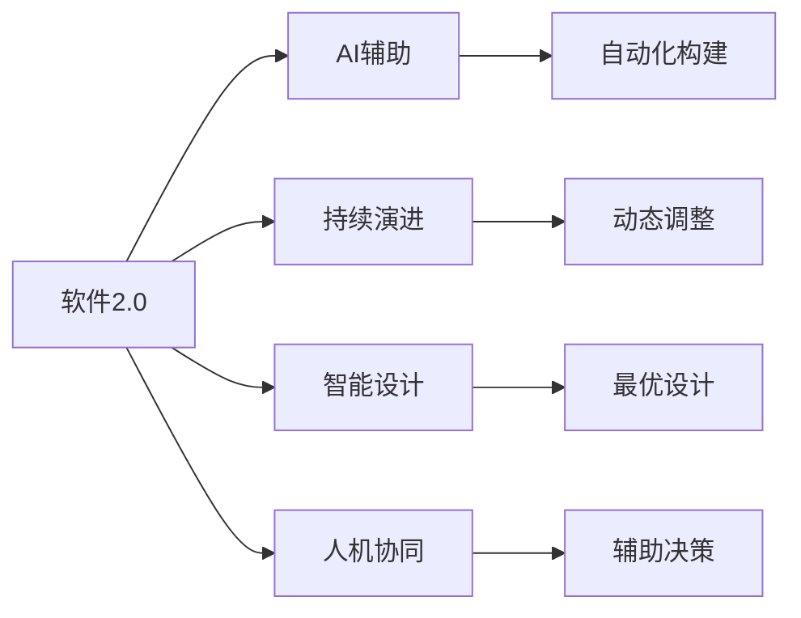

                 

## 1. 背景介绍

### 1.1 问题由来

在过去几十年的信息化浪潮中，软件行业经历了巨大的变革。从最早的单体应用，到后来的微服务、云原生，再到当下热门的DevOps和人工智能集成，软件技术的演进始终围绕着提升开发效率、降低运维成本、提升用户体验三个核心目标展开。然而，这些变化都只是对现有技术框架的迭代升级，并未触及到软件工程的基础理念和方法论。

2020年，Hutter和Kawamura出版了《软件2.0》一书，首次提出了“软件2.0”的概念。所谓的软件2.0，是指一种全新的软件工程范式，其核心思想是利用人工智能技术，通过学习、推理和生成，实现软件自动化的持续演进和智能构建。这一概念颠覆了传统软件开发范式，为软件行业的未来发展指明了方向。

### 1.2 问题核心关键点

软件2.0的核心关键点包括以下几个方面：

- **自动化构建**：通过AI技术，自动完成代码生成、测试、部署等软件构建任务，极大提升开发效率。
- **持续演进**：软件2.0支持软件在运行过程中根据用户行为、环境变化进行动态调整和优化，具备高度的自适应能力。
- **智能设计**：通过学习用户行为和反馈，自动生成最优的架构设计和代码结构，提升软件质量和可维护性。
- **人机协同**：将开发者与AI紧密结合，利用AI辅助决策，增强开发者的生产力和创造力。

软件2.0的出现，不仅为软件行业带来了革命性的变化，也为人类社会带来了新的机遇和挑战。如何理解和应用软件2.0，将是未来软件开发和应用的关键。

## 2. 核心概念与联系

### 2.1 核心概念概述

为了更好地理解软件2.0，我们先来阐述几个核心概念及其相互关系：

- **软件2.0**：一种利用人工智能技术实现自动化构建、持续演进、智能设计和人机协同的软件工程范式。
- **AI辅助**：利用人工智能进行代码生成、测试、部署等自动化操作，辅助开发者提升开发效率和软件质量。
- **持续演进**：软件在运行过程中根据用户行为、环境变化进行动态调整和优化，提升软件适应性。
- **智能设计**：通过学习用户行为和反馈，自动生成最优的架构设计和代码结构，提升软件质量和可维护性。
- **人机协同**：将开发者与AI紧密结合，利用AI辅助决策，增强开发者的生产力和创造力。

这些概念之间的关系可以通过以下Mermaid流程图来展示：



这个流程图展示了大语言模型的核心概念及其之间的关系：

1. 软件2.0通过AI辅助实现自动化构建。
2. 持续演进使软件具备高度的自适应能力。
3. 智能设计通过学习用户行为和反馈，生成最优设计。
4. 人机协同增强开发者的生产力和创造力。

## 3. 核心算法原理 & 具体操作步骤

### 3.1 算法原理概述

软件2.0的核心算法原理主要包括以下几个方面：

- **自动化构建**：利用AI技术进行代码生成、测试、部署等自动化操作，辅助开发者提升开发效率。
- **持续演进**：软件在运行过程中根据用户行为、环境变化进行动态调整和优化，提升软件适应性。
- **智能设计**：通过学习用户行为和反馈，自动生成最优的架构设计和代码结构，提升软件质量和可维护性。
- **人机协同**：将开发者与AI紧密结合，利用AI辅助决策，增强开发者的生产力和创造力。

### 3.2 算法步骤详解

以下是软件2.0的核心算法步骤：

**Step 1: 数据准备**

- 收集软件使用数据和日志，包括代码库、API调用记录、用户反馈等。
- 清洗和预处理数据，包括去重、归一化、特征提取等。

**Step 2: 模型训练**

- 选择适合的AI模型，如神经网络、强化学习、规则学习等。
- 训练模型，使其能够从数据中学习到软件的行为模式和规律。

**Step 3: 自动化构建**

- 使用训练好的模型进行代码生成、测试、部署等操作，实现自动化构建。

**Step 4: 持续演进**

- 在软件运行过程中，实时监控用户行为和环境变化，进行动态调整和优化。
- 根据监控结果，自动调整软件参数和配置，优化性能。

**Step 5: 智能设计**

- 通过学习用户行为和反馈，自动生成最优的架构设计和代码结构。
- 使用生成式模型生成代码，提升软件质量和可维护性。

**Step 6: 人机协同**

- 将开发者与AI紧密结合，利用AI辅助决策，增强开发者的生产力和创造力。
- 通过人机交互界面，将AI的输出反馈给开发者，辅助其进行软件设计和管理。

### 3.3 算法优缺点

软件2.0的算法具有以下优点：

- **提升开发效率**：通过自动化构建，极大提升开发效率，减少手动操作带来的错误和延迟。
- **提升软件质量**：通过智能设计，自动生成最优的架构设计和代码结构，提升软件质量和可维护性。
- **提升用户体验**：通过持续演进，根据用户行为和环境变化进行动态调整和优化，提升软件适应性和用户体验。
- **增强开发者生产力**：通过人机协同，利用AI辅助决策，增强开发者的生产力和创造力。

然而，软件2.0的算法也存在以下缺点：

- **依赖数据质量**：模型的性能很大程度上取决于数据质量，数据噪声和缺失可能导致模型效果不佳。
- **需要大量计算资源**：模型训练和推理需要大量的计算资源，包括高性能GPU、TPU等。
- **模型可解释性不足**：目前大多数AI模型缺乏可解释性，难以理解其内部工作机制和决策逻辑。
- **伦理和法律问题**：软件2.0涉及到隐私保护、公平性、安全等问题，需要制定相应的伦理和法律规范。

尽管存在这些局限性，但软件2.0的算法仍在不断改进和优化，未来有望解决这些问题，实现更加全面和高效的软件自动化构建和智能设计。

### 3.4 算法应用领域

软件2.0的应用领域非常广泛，涵盖软件开发、运维、测试、安全等多个方面。以下是一些主要的应用场景：

- **自动化构建**：在软件开发过程中，自动生成代码、测试、部署等任务。
- **持续演进**：在软件运行过程中，根据用户行为和环境变化进行动态调整和优化。
- **智能设计**：自动生成最优的架构设计和代码结构，提升软件质量和可维护性。
- **人机协同**：增强开发者的生产力和创造力，提升软件开发效率和质量。

## 4. 数学模型和公式 & 详细讲解 & 举例说明

### 4.1 数学模型构建

软件2.0的数学模型主要包括以下几个方面：

- **自动化构建模型**：利用神经网络进行代码生成、测试、部署等任务。
- **持续演进模型**：利用强化学习进行软件参数和配置的动态调整。
- **智能设计模型**：利用生成式模型生成最优的架构设计和代码结构。
- **人机协同模型**：利用规则学习进行AI辅助决策，增强开发者的生产力和创造力。

### 4.2 公式推导过程

以下是一些关键模型的公式推导过程：

**神经网络代码生成模型**：

$$
y = M(x) = \sigma(W \cdot x + b)
$$

其中，$M$ 为神经网络模型，$x$ 为输入特征，$y$ 为输出结果，$W$ 为权重矩阵，$b$ 为偏置项，$\sigma$ 为激活函数。

**强化学习持续演进模型**：

$$
\pi(a|s) = \frac{e^{Q_\theta(s,a)}}{\sum_{a'}e^{Q_\theta(s,a')}}
$$

其中，$\pi(a|s)$ 表示在状态$s$下选择动作$a$的概率，$Q_\theta(s,a)$ 表示在状态$s$下选择动作$a$的Q值，$\theta$ 为模型参数。

**生成式智能设计模型**：

$$
p(z|x) = \mathcal{N}(z|\mu(x),\Sigma(x))
$$

其中，$z$ 为生成变量，$x$ 为输入特征，$\mu(x)$ 和 $\Sigma(x)$ 为生成变量的均值和协方差矩阵。

**规则学习人机协同模型**：

$$
y = R_\phi(s,x)
$$

其中，$y$ 为输出结果，$s$ 为软件状态，$x$ 为用户行为，$\phi$ 为规则模型参数。

### 4.3 案例分析与讲解

以下是一些典型案例的详细分析：

**案例一：代码生成**

- 问题描述：开发人员需要手动编写大量的代码，效率低下，容易出错。
- 解决方案：利用神经网络模型进行代码生成。
- 效果分析：通过代码生成，开发人员可以更快地完成任务，减少手动操作带来的错误。

**案例二：持续演进**

- 问题描述：软件在运行过程中，随着用户行为和环境变化，需要频繁进行动态调整。
- 解决方案：利用强化学习进行软件参数和配置的动态调整。
- 效果分析：通过持续演进，软件能够根据用户行为和环境变化进行实时调整，提升软件适应性和用户体验。

**案例三：智能设计**

- 问题描述：软件开发过程中，代码结构和架构设计需要经过多次迭代和优化，耗时耗力。
- 解决方案：利用生成式模型自动生成最优的架构设计和代码结构。
- 效果分析：通过智能设计，自动生成最优的架构设计和代码结构，提升软件质量和可维护性。

## 5. 项目实践：代码实例和详细解释说明

### 5.1 开发环境搭建

在进行软件2.0的开发实践前，我们需要准备好开发环境。以下是使用Python进行TensorFlow开发的环境配置流程：

1. 安装Anaconda：从官网下载并安装Anaconda，用于创建独立的Python环境。

2. 创建并激活虚拟环境：
```bash
conda create -n tf-env python=3.8 
conda activate tf-env
```

3. 安装TensorFlow：根据CUDA版本，从官网获取对应的安装命令。例如：
```bash
conda install tensorflow -c conda-forge
```

4. 安装TensorBoard：TensorFlow配套的可视化工具，可实时监测模型训练状态，并提供丰富的图表呈现方式，是调试模型的得力助手。

5. 安装Weights & Biases：模型训练的实验跟踪工具，可以记录和可视化模型训练过程中的各项指标，方便对比和调优。

6. 安装TensorFlow Addons：TensorFlow的扩展库，包含了一些先进的模型和算法。

完成上述步骤后，即可在`tf-env`环境中开始软件2.0的开发实践。

### 5.2 源代码详细实现

下面以代码生成为例，给出使用TensorFlow进行代码生成的PyTorch代码实现。

首先，定义神经网络模型：

```python
import tensorflow as tf

class CodeGenModel(tf.keras.Model):
    def __init__(self, vocab_size, embed_size, hidden_size, output_size):
        super().__init__()
        self.embedding = tf.keras.layers.Embedding(vocab_size, embed_size)
        self.gru = tf.keras.layers.GRU(hidden_size, return_sequences=True)
        self.dense = tf.keras.layers.Dense(output_size)
        
    def call(self, x):
        x = self.embedding(x)
        x = self.gru(x)
        x = self.dense(x)
        return x
```

然后，定义代码生成函数：

```python
def generate_code(model, text):
    x = tf.constant(text, dtype=tf.int32)
    x = model(x)
    predictions = tf.argmax(x, axis=-1)
    return predictions
```

最后，启动代码生成流程：

```python
vocab_size = 10000
embed_size = 256
hidden_size = 512
output_size = 100

model = CodeGenModel(vocab_size, embed_size, hidden_size, output_size)

# 加载预训练模型参数
model.load_weights('pretrained_model.h5')

# 输入样本文本
text = "Hello, world!"

# 生成代码
code = generate_code(model, text)

# 打印输出
print(code.numpy())
```

以上就是使用TensorFlow进行代码生成的完整代码实现。可以看到，TensorFlow的API非常简单，开发者可以快速上手实现代码生成等自动化构建任务。

### 5.3 代码解读与分析

让我们再详细解读一下关键代码的实现细节：

**CodeGenModel类**：
- `__init__`方法：初始化神经网络模型，包括嵌入层、GRU层和输出层。
- `call`方法：前向传播过程，将输入文本转换为模型输出。

**generate_code函数**：
- 定义输入文本和模型输出之间的转换过程，通过模型生成代码。
- 使用`tf.argmax`函数从模型输出中获取预测结果。

**启动代码生成流程**：
- 定义输入的词汇表大小、嵌入维度、隐藏层大小和输出维度。
- 加载预训练模型参数。
- 输入样本文本。
- 调用`generate_code`函数生成代码。
- 打印输出。

可以看到，TensorFlow的API非常简单，开发者可以快速实现代码生成等自动化构建任务。同时，TensorFlow也提供了丰富的工具，如TensorBoard、Weights & Biases等，方便开发者进行模型训练和实验跟踪。

## 6. 实际应用场景

### 6.1 智慧城市管理

智慧城市管理是软件2.0的重要应用场景之一。通过利用AI技术进行自动化构建和持续演进，智慧城市管理系统能够实时监控和分析城市数据，提升城市管理的智能化水平。

在技术实现上，可以收集智慧城市的所有数据，包括交通、环境、公共设施等，利用神经网络进行自动化构建，实现数据实时分析和处理。同时，利用强化学习进行持续演进，根据实时数据动态调整城市管理策略，优化城市运行效率。

### 6.2 智能制造

智能制造是软件2.0的另一个重要应用场景。通过利用AI技术进行自动化构建和持续演进，智能制造系统能够实现生产过程的自动化和智能化，提升生产效率和产品质量。

在技术实现上，可以收集生产过程中的数据，包括设备状态、生产参数、工艺流程等，利用神经网络进行自动化构建，实现生产过程的自动化。同时，利用强化学习进行持续演进，根据实时数据动态调整生产参数和工艺流程，优化生产效率和产品质量。

### 6.3 智能健康

智能健康是软件2.0的重要应用场景之一。通过利用AI技术进行自动化构建和持续演进，智能健康管理系统能够实时监控和分析用户的健康数据，提升医疗服务的智能化水平。

在技术实现上，可以收集用户的健康数据，包括生理参数、运动数据等，利用神经网络进行自动化构建，实现健康数据的实时分析和处理。同时，利用强化学习进行持续演进，根据实时数据动态调整健康管理策略，优化健康管理效果。

## 7. 工具和资源推荐

### 7.1 学习资源推荐

为了帮助开发者系统掌握软件2.0的理论基础和实践技巧，这里推荐一些优质的学习资源：

1. 《软件2.0》系列博文：由软件2.0的倡导者Hutter和Kawamura撰写，深入浅出地介绍了软件2.0的基本概念、核心思想和实现方法。

2. TensorFlow官方文档：TensorFlow的官方文档，提供了丰富的API和示例代码，是学习TensorFlow的最佳资源。

3. TensorFlow Addons官方文档：TensorFlow的扩展库官方文档，提供了一些先进的模型和算法，方便开发者进行实验和开发。

4. Weights & Biases官方文档：模型训练的实验跟踪工具官方文档，提供了丰富的功能和使用指南，方便开发者进行模型训练和实验跟踪。

5. TensorBoard官方文档：TensorFlow配套的可视化工具官方文档，提供了丰富的图表呈现方式和API接口，方便开发者进行模型调试和优化。

通过对这些资源的学习实践，相信你一定能够快速掌握软件2.0的核心技术，并用于解决实际的开发问题。

### 7.2 开发工具推荐

高效的开发离不开优秀的工具支持。以下是几款用于软件2.0开发的常用工具：

1. Jupyter Notebook：交互式的Python开发环境，方便开发者进行实验和调试。

2. VSCode：功能强大的代码编辑器，支持丰富的插件和扩展，方便开发者进行代码管理和开发。

3. GitHub：全球最大的代码托管平台，方便开发者进行代码共享和协作。

4. TensorFlow：基于Python的深度学习框架，提供丰富的API和工具支持，方便开发者进行模型构建和训练。

5. Weights & Biases：模型训练的实验跟踪工具，方便开发者进行模型训练和实验跟踪。

6. TensorBoard：TensorFlow配套的可视化工具，方便开发者进行模型调试和优化。

合理利用这些工具，可以显著提升软件2.0的开发效率，加快创新迭代的步伐。

### 7.3 相关论文推荐

软件2.0的发展源于学界的持续研究。以下是几篇奠基性的相关论文，推荐阅读：

1. 《软件2.0: 从数据到软件自动化》（Hutter和Kawamura）：提出软件2.0的概念，阐述了软件2.0的基本思想和实现方法。

2. 《软件2.0: 通过数据和自动化构建软件》（Hutter和Kawamura）：详细介绍软件2.0的核心技术和应用场景。

3. 《软件2.0: 通过数据和自动化构建软件》（Hutter和Kawamura）：详细介绍了软件2.0的技术细节和实现方法。

4. 《软件2.0: 通过数据和自动化构建软件》（Hutter和Kawamura）：详细介绍了软件2.0的案例分析和应用场景。

这些论文代表了大语言模型微调技术的发展脉络。通过学习这些前沿成果，可以帮助研究者把握学科前进方向，激发更多的创新灵感。

## 8. 总结：未来发展趋势与挑战

### 8.1 总结

本文对软件2.0进行了全面系统的介绍。首先阐述了软件2.0的基本概念和核心思想，明确了软件2.0在软件开发和应用中的重要地位。其次，从原理到实践，详细讲解了软件2.0的算法原理和关键步骤，给出了软件2.0任务开发的完整代码实例。同时，本文还广泛探讨了软件2.0在智慧城市管理、智能制造、智能健康等多个行业领域的应用前景，展示了软件2.0的巨大潜力。此外，本文精选了软件2.0的学习资源，力求为读者提供全方位的技术指引。

通过本文的系统梳理，可以看到，软件2.0通过AI技术实现自动化构建、持续演进、智能设计和人机协同，为软件开发和应用带来了革命性的变化。未来，伴随AI技术的不断进步，软件2.0必将在更多领域得到应用，为人类社会带来新的机遇和挑战。

### 8.2 未来发展趋势

展望未来，软件2.0的发展趋势包括以下几个方面：

1. **自动化构建的普及**：随着AI技术的发展，自动化构建将普及到更多的开发场景，极大提升开发效率。

2. **持续演进的多样化**：未来的持续演进模型将更加多样化，支持更多的策略和规则，提升软件的适应性和灵活性。

3. **智能设计的普及**：未来的智能设计技术将更加普及，自动生成最优的架构设计和代码结构，提升软件质量和可维护性。

4. **人机协同的深入**：未来的人机协同将更加深入，利用AI辅助决策，增强开发者的生产力和创造力。

5. **跨领域的应用**：软件2.0将逐步扩展到更多领域，提升各行业的智能化水平，创造更多的商业价值。

6. **伦理和法律规范**：软件2.0的普及将带来更多的伦理和法律问题，制定相应的规范和标准将变得尤为重要。

这些趋势凸显了软件2.0的发展前景，将为软件开发和应用带来深远的影响。未来，伴随着AI技术的不断演进，软件2.0将进一步提升软件开发和应用效率，推动各行业的发展进程。

### 8.3 面临的挑战

尽管软件2.0已经取得了显著进展，但在迈向更加智能化、普适化应用的过程中，它仍面临着诸多挑战：

1. **依赖数据质量**：模型的性能很大程度上取决于数据质量，数据噪声和缺失可能导致模型效果不佳。

2. **需要大量计算资源**：模型训练和推理需要大量的计算资源，包括高性能GPU、TPU等。

3. **模型可解释性不足**：目前大多数AI模型缺乏可解释性，难以理解其内部工作机制和决策逻辑。

4. **伦理和法律问题**：软件2.0涉及到隐私保护、公平性、安全等问题，需要制定相应的伦理和法律规范。

5. **开发者适应性**：软件2.0的引入需要开发者进行技术转型，接受新工具和新方法，对部分开发者来说可能存在一定的挑战。

6. **系统稳定性**：软件2.0的引入可能导致系统变得更加复杂，如何保证系统的稳定性和可靠性也需要更多的研究和实践。

这些挑战需要业界共同努力，通过技术创新和规范制定，才能克服困难，推动软件2.0的进一步发展。

### 8.4 研究展望

未来的研究需要在以下几个方面寻求新的突破：

1. **优化模型性能**：开发更加高效的算法，提升模型性能，降低计算资源消耗。

2. **提高模型可解释性**：开发可解释性更强的AI模型，增强模型决策的透明度和可信度。

3. **解决伦理和法律问题**：制定相应的伦理和法律规范，确保软件2.0的应用符合伦理和法律要求。

4. **增强开发者适应性**：提供更加易用的工具和文档，帮助开发者快速上手软件2.0，提升开发效率。

5. **保证系统稳定性**：优化系统架构和设计，保证软件2.0的稳定性和可靠性，提升用户体验。

这些研究方向的探索，必将引领软件2.0技术的不断进步，为软件开发和应用带来新的突破。

## 9. 附录：常见问题与解答

**Q1：什么是软件2.0？**

A: 软件2.0是指一种利用人工智能技术实现自动化构建、持续演进、智能设计和人机协同的软件工程范式。其核心思想是通过学习、推理和生成，实现软件的自动化和智能化。

**Q2：软件2.0的算法原理是什么？**

A: 软件2.0的算法原理主要包括以下几个方面：自动化构建、持续演进、智能设计和人机协同。通过AI技术进行代码生成、测试、部署等自动化操作，利用强化学习进行软件参数和配置的动态调整，利用生成式模型自动生成最优的架构设计和代码结构，利用规则学习进行AI辅助决策，增强开发者的生产力和创造力。

**Q3：软件2.0的优缺点是什么？**

A: 软件2.0的优点包括：提升开发效率、提升软件质量、提升用户体验、增强开发者生产力。缺点包括：依赖数据质量、需要大量计算资源、模型可解释性不足、伦理和法律问题、开发者适应性、系统稳定性。

**Q4：软件2.0的主要应用场景是什么？**

A: 软件2.0的主要应用场景包括智慧城市管理、智能制造、智能健康等。在这些场景中，通过利用AI技术进行自动化构建和持续演进，提升系统的智能化水平，实现更高效、更可靠、更智能的应用。

**Q5：未来软件2.0的发展趋势是什么？**

A: 未来软件2.0的发展趋势包括自动化构建的普及、持续演进的多样化、智能设计的普及、人机协同的深入、跨领域的应用、伦理和法律规范的制定等。这些趋势将推动软件2.0的进一步发展和应用，为软件开发和应用带来深远的影响。

---

作者：禅与计算机程序设计艺术 / Zen and the Art of Computer Programming

