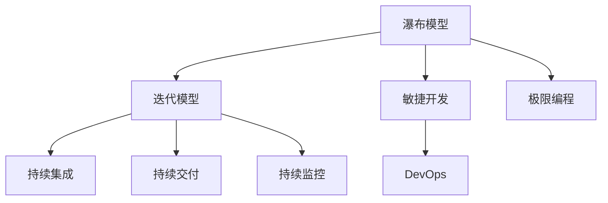

                 

# 软件工程的方法学体系介绍

## 1. 背景介绍

### 1.1 问题由来

随着信息技术的飞速发展，软件规模和复杂性不断增加，软件工程已成为信息技术领域的重要支柱。然而，软件的开发和维护仍然面临诸多挑战，如需求变更频繁、成本超支、质量不稳定等。为了解决这些问题，软件工程方法学应运而生。

### 1.2 问题核心关键点

软件工程方法学是一种科学、系统的软件开发方法和工具体系，旨在通过系统化的设计、实施、验证和维护，实现软件质量的高效、稳定和可控。其核心关键点包括：

- 系统化设计：将软件开发的每个步骤都纳入设计、分析和设计范畴，确保各环节之间的逻辑一致性。
- 严格实施：遵循标准化的流程和规范，避免个人主观因素对软件质量的影响。
- 全面验证：通过严格的测试和审查，确保软件的正确性、完整性和可靠性。
- 持续维护：软件交付后，通过持续的迭代和优化，保持软件的生命力。

## 2. 核心概念与联系

### 2.1 核心概念概述

为更好地理解软件工程的方法学体系，本节将介绍几个密切相关的核心概念：

- 瀑布模型(Waterfall Model)：一种传统的软件开发模型，将软件开发过程划分为需求分析、设计、实现、测试和维护五个阶段。每个阶段必须严格遵循前一个阶段的结果，逐层递进，保证开发顺序。
- 迭代模型(Iterative Model)：一种以用户为中心，通过多次迭代逐步完善产品的软件开发模型。每次迭代包括需求分析、设计、实现和测试，最终形成可用的软件产品。
- 敏捷开发(Agile Development)：一种响应快速变化的市场需求的开发模式，强调快速迭代、团队协作和用户反馈。常见方法包括Scrum和Kanban。
- 极限编程(Extreme Programming, XP)：一种将敏捷开发理念应用到极致的软件开发方法，强调简单化、快速反馈和持续集成。
- 持续集成(Continuous Integration, CI)：一种通过频繁集成和测试，确保软件构建过程稳定可靠的软件开发实践。
- 持续交付(Continuous Delivery, CD)：一种通过自动化部署和测试，快速发布软件产品的软件开发实践。
- 持续监控(Continuous Monitoring, CM)：一种通过实时监控和分析软件运行状态，及时发现和解决问题，提升软件可靠性的软件开发实践。
- DevOps：一种集成软件开发和运维过程的实践，强调团队协作、自动化和持续交付。

这些核心概念之间的逻辑关系可以通过以下Mermaid流程图来展示：



这个流程图展示了几类关键的软件开发模型的关系：

1. 瀑布模型作为传统开发模式，强调线性、严格的步骤性。
2. 迭代模型基于用户反馈，多次迭代逐步完善产品。
3. 敏捷开发和极限编程是迭代模型的特例，强调快速响应变化和团队协作。
4. 持续集成、持续交付和持续监控都是DevOps的一部分，强调自动化和快速交付。

## 3. 核心算法原理 & 具体操作步骤

### 3.1 算法原理概述

软件工程方法学的核心原理在于将软件开发过程标准化、流程化，通过系统化的设计、实施、验证和维护，实现软件质量的稳定和高效。

一般而言，软件工程方法学包括以下几个关键阶段：

- 需求分析：明确软件的功能、性能、安全性等需求。
- 设计：将需求转化为软件结构和组件。
- 实现：将设计转化为具体的代码实现。
- 测试：通过测试验证软件的正确性和可靠性。
- 维护：对软件进行持续的迭代和优化。

### 3.2 算法步骤详解

#### 3.2.1 需求分析

需求分析是软件开发的首要环节，需要明确软件的功能、性能、安全性、可用性等需求。常见的方法包括：

- 用户访谈：通过与用户交流，了解其需求和期望。
- 用例分析：通过设计用例，明确软件的各种功能和交互场景。
- 需求文档：通过编写需求文档，详细描述软件的功能和性能指标。

#### 3.2.2 设计

设计阶段是将需求转化为软件结构和组件的过程。常见的方法包括：

- 结构化设计：将软件划分为模块、组件和子系统，确保设计结构清晰、可维护。
- 面向对象设计：通过面向对象的方法，设计出可复用、可扩展的软件组件。
- 设计模式：通过设计模式，解决常见的软件设计问题，提升软件质量。

#### 3.2.3 实现

实现阶段是将设计转化为具体的代码实现。常见的方法包括：

- 代码编写：通过编写代码，实现软件的功能和逻辑。
- 版本控制：通过版本控制工具，管理代码的修改和协作。
- 自动化构建：通过自动化构建工具，确保代码的稳定性和一致性。

#### 3.2.4 测试

测试阶段是通过测试验证软件的正确性和可靠性。常见的方法包括：

- 单元测试：对单个模块或组件进行测试，确保其功能正确。
- 集成测试：对多个模块或组件进行集成测试，确保其协作正确。
- 系统测试：对整个软件系统进行全面测试，确保其功能和性能满足需求。

#### 3.2.5 维护

维护阶段是对软件进行持续的迭代和优化。常见的方法包括：

- 问题跟踪：记录和跟踪软件的问题和缺陷。
- 版本管理：管理软件的各个版本和发布。
- 性能优化：通过性能测试和优化，提升软件的运行效率。

### 3.3 算法优缺点

软件工程方法学具有以下优点：

- 规范化：通过标准化的流程和规范，提升软件的质量和可靠性。
- 可控性：通过系统化的管理和测试，控制软件开发的风险和成本。
- 可重复性：通过明确的步骤和规范，确保软件的可重复性。

同时，软件工程方法学也存在一定的局限性：

- 成本高：标准化的流程和规范需要投入大量时间和资源，导致开发成本较高。
- 灵活性不足：严格的流程和规范限制了开发团队的灵活性，可能导致开发效率低下。
- 适用性有限：不同的软件项目和团队可能需要不同的开发方法，需要根据具体情况选择合适的方法。

尽管存在这些局限性，但就目前而言，软件工程方法学仍是软件开发的主流范式。未来相关研究的重点在于如何进一步优化方法学，提升开发效率和灵活性，同时兼顾软件质量和可控性。

### 3.4 算法应用领域

软件工程方法学在各个软件开发领域都有广泛的应用，例如：

- 商业软件：通过系统化的开发方法，确保软件的稳定性和可维护性，提升商业软件的市场竞争力。
- 医疗软件：通过严格的测试和审查，确保医疗软件的可靠性，保障患者安全和医疗质量。
- 游戏开发：通过敏捷开发和极限编程，快速响应市场需求，实现游戏的高性能和高可用性。
- 工业控制：通过持续集成和持续交付，确保工业控制系统的稳定可靠，提升生产效率。
- 网络安全：通过持续监控和自动化测试，确保网络安全的实时性和可靠性，提升网络系统的安全防护能力。

## 4. 数学模型和公式 & 详细讲解 & 举例说明

### 4.1 数学模型构建

软件工程方法学的数学模型主要涉及软件质量的度量和评估。常见的质量度量指标包括：

- 可靠性(Reliability)：软件在规定条件下正常运行的概率。
- 可维护性(Maintainability)：软件被修改、维护和扩展的难易程度。
- 可移植性(Portability)：软件在不同环境下的适应能力和兼容性。
- 可扩展性(Scalability)：软件处理负载的能力。

### 4.2 公式推导过程

以可靠性度量为例，假设软件在规定条件下正常运行的概率为$R$，发生故障的概率为$F$，则软件在规定条件下的可靠性$R$可以表示为：

$$ R = 1 - P(F) $$

其中$P(F)$表示软件发生故障的概率，可以通过软件故障率$\lambda$和运行时间$t$来计算：

$$ P(F) = \lambda t $$

### 4.3 案例分析与讲解

假设某系统在运行24小时内的故障率为$\lambda=0.01$，则该系统在24小时内发生故障的概率为：

$$ P(F) = 0.01 \times 24 = 0.24 $$

因此，该系统在24小时内正常运行的概率为：

$$ R = 1 - 0.24 = 0.76 $$

即该系统在24小时内正常运行的概率为76%。

## 5. 项目实践：代码实例和详细解释说明

### 5.1 开发环境搭建

在进行软件开发实践前，我们需要准备好开发环境。以下是使用Java和Maven进行Spring Boot开发的开发环境配置流程：

1. 安装Java JDK：从官网下载并安装JDK，确保开发环境满足最低要求。
2. 安装Maven：从官网下载并安装Maven，用于管理项目依赖和构建。
3. 配置Spring Boot：通过Spring Initializr，创建新的Spring Boot项目。
4. 编写项目代码：在Spring Boot项目中编写Java代码，实现业务逻辑。
5. 运行项目：在命令行中运行项目，确保项目能够正常运行。

### 5.2 源代码详细实现

下面是一个简单的Java Spring Boot项目示例，用于展示软件工程方法学的应用：

```java
@SpringBootApplication
public class Application {
    public static void main(String[] args) {
        SpringApplication.run(Application.class, args);
    }
}
```

这是一个Spring Boot项目的基本结构，包括一个Spring Boot应用程序和启动类。在实际开发中，我们可以通过Spring MVC、Spring Data、Spring Security等模块，实现更加复杂的业务逻辑。

### 5.3 代码解读与分析

让我们再详细解读一下关键代码的实现细节：

- `@SpringBootApplication`注解：用于标识一个Spring Boot项目，自动配置Spring MVC、Spring Data等模块。
- `public static void main(String[] args)`方法：项目启动入口，调用`SpringApplication.run`方法启动Spring Boot应用程序。
- `@SpringBootApplication`类：包含项目配置信息和Bean的定义，由Spring Boot自动扫描和初始化。

通过这些代码，我们便能构建一个基本的Spring Boot项目，实现业务逻辑的开发和部署。

### 5.4 运行结果展示

在运行Spring Boot项目后，我们可以通过浏览器访问项目的URL，查看项目的运行结果。例如，我们定义了一个简单的控制器和视图，用于显示欢迎信息：

```java
@Controller
public class HomeController {
    @GetMapping("/")
    public String home(Model model) {
        model.addAttribute("message", "Hello, Spring Boot!");
        return "home";
    }
}
```

通过这个控制器，我们可以在浏览器中访问项目的根URL，看到“Hello, Spring Boot!”的欢迎信息。

## 6. 实际应用场景

### 6.1 商业软件

基于软件工程方法学的商业软件开发，可以确保软件的高质量和高可用性，提升企业的市场竞争力。常见的应用场景包括：

- ERP系统：通过系统化的开发方法，确保ERP系统的稳定性和可维护性，提升企业的业务效率和信息化水平。
- CRM系统：通过敏捷开发和持续集成，快速响应市场需求，实现客户关系管理的自动化和高效化。
- 电子商务平台：通过持续交付和持续监控，确保平台的高性能和高可用性，提升用户购物体验。

### 6.2 医疗软件

基于软件工程方法学的医疗软件开发，可以确保软件的可靠性和安全性，保障患者安全和医疗质量。常见的应用场景包括：

- 电子病历系统：通过严格的测试和审查，确保电子病历系统的可靠性和安全性，保障患者隐私和医疗数据的安全。
- 医疗影像处理系统：通过持续集成和持续交付，确保系统的稳定性和可靠性，提升医疗影像的诊断效率和准确性。
- 远程医疗平台：通过敏捷开发和持续监控，快速响应市场需求，实现远程医疗的高效化和普及化。

### 6.3 游戏开发

基于软件工程方法学的游戏开发，可以确保游戏的高性能和高可用性，提升游戏市场竞争力。常见的应用场景包括：

- 实时对战游戏：通过敏捷开发和持续集成，快速响应市场需求，实现游戏的稳定性和高性能。
- 多人在线游戏：通过持续监控和自动化测试，确保游戏的稳定可靠，提升用户的游戏体验。
- 虚拟现实游戏：通过持续交付和持续监控，确保游戏的稳定性和可靠性，提升用户的沉浸感和体验感。

## 7. 工具和资源推荐

### 7.1 学习资源推荐

为了帮助开发者系统掌握软件工程的方法学体系，这里推荐一些优质的学习资源：

- 《软件工程：原理与实践》书籍：由David C. Garlan和M. E. Myers共同撰写，全面介绍了软件工程的基本概念和实践方法。
- 《敏捷软件开发：原则、模式与实践》书籍：由Robert C. Martin撰写，介绍了敏捷开发的核心理念和方法。
- 《极限编程：简化软件开发流程的敏捷方法》书籍：由Kent Beck撰写，介绍了极限编程的具体实践和技术细节。
- 《Spring Boot实战》书籍：由P. Cosentino和R. J. Fish撰写，介绍了Spring Boot的开发实践和项目实现。
- 《Spring Cloud微服务架构》书籍：由Allen Fan撰写，介绍了Spring Cloud的微服务架构和应用实践。
- 《DevOps实践指南》书籍：由Gene Kim、Patrick Debois和John Willis共同撰写，介绍了DevOps的核心理念和方法。

通过对这些资源的学习实践，相信你一定能够快速掌握软件工程的方法学体系，并用于解决实际的软件开发问题。

### 7.2 开发工具推荐

高效的开发离不开优秀的工具支持。以下是几款用于软件工程开发的常用工具：

- IntelliJ IDEA：一款强大的Java开发工具，支持Spring Boot、Spring Data等框架。
- Eclipse：一款开源的Java开发工具，支持EJB、Spring等框架。
- Visual Studio Code：一款轻量级的代码编辑器，支持Java、C#等多种语言。
- Git：一款版本控制工具，支持代码的版本管理和协作。
- Maven：一款项目管理工具，用于管理项目依赖和构建。
- Docker：一款容器化工具，支持应用程序的打包、部署和管理。
- Kubernetes：一款容器编排工具，支持大规模应用程序的部署和管理。

合理利用这些工具，可以显著提升软件开发的效率和质量，加快创新迭代的步伐。

### 7.3 相关论文推荐

软件工程方法学的研究源于学界的持续探索。以下是几篇奠基性的相关论文，推荐阅读：

- "The Mythical Man-Month: Essays on Software Engineering"书籍：由Frederick P. Brooks撰写，探讨了软件工程中的常见问题和解决方法。
- "The Software Engineering Zoo: An Aardvark's Voyage"论文：由David Garlan撰写，总结了软件工程的多种开发方法。
- "A Manifesto for Agile Software Development"论文：由Kent Beck撰写，提出了敏捷开发的核心理念和方法。
- "Extreme Programming Explained: Embrace Change"书籍：由Kent Beck撰写，介绍了极限编程的具体实践和技术细节。
- "Continuous Integration: Software Engineering Applied"书籍：由James Shore撰写，介绍了持续集成的核心理念和方法。

这些论文和书籍代表了大软件工程方法学的研究脉络。通过学习这些前沿成果，可以帮助研究者把握学科前进方向，激发更多的创新灵感。

## 8. 总结：未来发展趋势与挑战

### 8.1 总结

本文对软件工程的方法学体系进行了全面系统的介绍。首先阐述了软件工程方法学的研究背景和意义，明确了方法学在软件开发中的独特价值。其次，从原理到实践，详细讲解了软件工程方法学的核心步骤，给出了方法学应用的完整代码实例。同时，本文还探讨了方法学在各个行业领域的应用前景，展示了方法学技术的广阔潜力。最后，本文精选了方法学的学习资源、开发工具和相关论文，力求为读者提供全方位的技术指引。

通过本文的系统梳理，可以看到，软件工程方法学在软件开发中起着至关重要的作用，其规范化、可控性和可重复性为软件质量提供了坚实保障。未来，伴随软件开发环境的不断演进和新技术的不断涌现，软件工程方法学仍将扮演关键角色，引领软件开发实践的不断进步。

### 8.2 未来发展趋势

展望未来，软件工程方法学将呈现以下几个发展趋势：

1. 云原生方法学：随着云原生技术的普及，软件工程方法学将更加注重云原生架构和DevOps实践，提升云环境下的开发和运维效率。
2. 微服务方法学：随着微服务架构的兴起，软件工程方法学将更加注重微服务的划分、组合和调用，提升系统的灵活性和扩展性。
3. 人工智能方法学：随着人工智能技术的不断进步，软件工程方法学将更加注重人工智能的应用，提升软件自动化的能力和效率。
4. 安全方法学：随着安全问题的日益凸显，软件工程方法学将更加注重安全测试和防御，提升系统的安全性和可靠性。
5. 绿色方法学：随着环境问题的日益严重，软件工程方法学将更加注重可持续性和环保，提升系统的能源效率和环保水平。

以上趋势凸显了软件工程方法学技术的广阔前景。这些方向的探索发展，必将进一步提升软件开发的质量和效率，为技术应用和产业发展带来新的机遇。

### 8.3 面临的挑战

尽管软件工程方法学已经取得了显著成果，但在迈向更加智能化、普适化应用的过程中，仍面临诸多挑战：

1. 技术更新换代快：随着新技术和新方法的出现，原有方法学可能逐渐过时，需要不断更新和升级。
2. 人才短缺：软件工程方法学的学习和实践需要大量的专业知识和经验，高水平人才的培养和储备成为难题。
3. 环境变化复杂：软件开发的环境和需求变化迅速，方法学需要快速适应新的环境和技术趋势。
4. 工具和平台多样化：开发工具和平台的日益增多，增加了方法学的复杂性和维护成本。
5. 文化和组织差异：不同组织和文化对方法学的接受度和实施方式存在差异，需要因地制宜。

尽管存在这些挑战，但通过不断学习和实践，结合新的技术和管理方法，软件工程方法学仍将在软件开发中发挥重要作用，推动软件技术的不断进步和应用。

### 8.4 研究展望

面对软件工程方法学所面临的种种挑战，未来的研究需要在以下几个方面寻求新的突破：

1. 自动化技术：通过引入自动化工具和框架，提高开发效率和质量，减少人工干预。
2. 模型驱动方法学：通过模型驱动的方法，提高软件开发的一致性和规范性，减少人为错误。
3. 智能方法学：通过引入人工智能技术，提高软件开发的智能性和自动化水平。
4. 跨学科融合：将软件工程与其他学科（如管理学、经济学等）进行融合，提升软件开发的方法和策略。
5. 持续改进：通过持续的反馈和改进，不断优化方法学的实施效果和应用范围。

这些研究方向的研究突破，必将引领软件工程方法学技术的进一步发展，推动软件开发实践的不断创新和优化。

## 9. 附录：常见问题与解答

**Q1：软件开发过程中的需求分析如何保障准确性和完整性？**

A: 需求分析是软件开发的首要环节，保障准确性和完整性需要采取以下措施：

- 多轮交流：通过与用户、客户、产品经理等多轮交流，了解其需求和期望，确保需求文档的完整性。
- 文档审查：通过需求文档的审查和评审，发现和修正潜在的问题和缺陷，确保需求文档的准确性。
- 原型设计：通过原型设计，展示和验证需求文档的准确性和完整性，及时调整和完善需求文档。
- 持续反馈：通过持续的反馈和调整，确保需求文档的动态适应性和可维护性。

**Q2：软件开发过程中的设计阶段需要注意哪些问题？**

A: 设计阶段是软件开发的关键环节，需要注意以下问题：

- 结构化设计：确保设计结构清晰、模块化，便于维护和扩展。
- 面向对象设计：设计可复用、可扩展的组件，提高软件的灵活性和可维护性。
- 设计模式：利用设计模式解决常见的设计问题，提升软件质量。
- 代码复用：通过代码复用，提高设计的一致性和规范性，减少重复劳动。
- 文档规范：通过编写设计文档，确保设计的可读性和可维护性。

**Q3：软件开发过程中的测试阶段需要注意哪些问题？**

A: 测试阶段是软件开发的重要环节，需要注意以下问题：

- 测试计划：制定详细的测试计划，涵盖测试策略、测试场景和测试用例，确保测试的全面性和有效性。
- 自动化测试：通过自动化测试工具，提高测试效率和覆盖率，减少人工测试成本。
- 测试覆盖：确保测试覆盖关键路径和边界条件，发现和修复潜在的问题和缺陷。
- 性能测试：通过性能测试，验证软件的稳定性和可扩展性，确保软件的高效性。
- 安全测试：通过安全测试，发现和修复潜在的安全漏洞，确保软件的安全性。

**Q4：软件开发过程中的维护阶段需要注意哪些问题？**

A: 维护阶段是软件开发的长期过程，需要注意以下问题：

- 问题跟踪：记录和跟踪软件的问题和缺陷，及时修复和优化。
- 版本管理：管理软件的各个版本和发布，确保软件的稳定性和一致性。
- 性能优化：通过性能测试和优化，提升软件的运行效率和可靠性。
- 用户反馈：通过用户反馈和评估，发现和解决软件的问题和缺陷，提升软件的用户体验。
- 持续改进：通过持续的反馈和改进，不断优化软件的功能和性能。

---

作者：禅与计算机程序设计艺术 / Zen and the Art of Computer Programming

