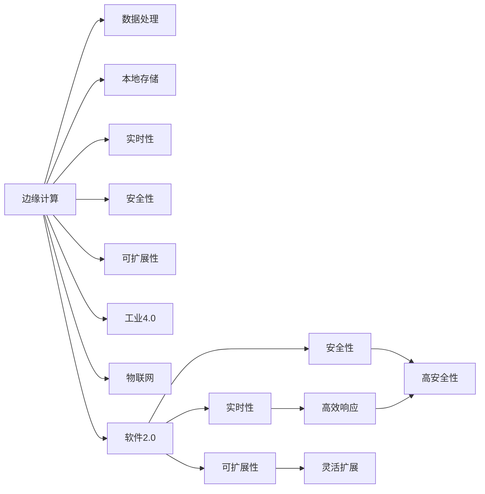

                 

# 边缘计算遇上软件2.0，智能将无处不在

> 关键词：边缘计算, 软件2.0, 智能, 实时性, 可扩展性, 安全性, 工业4.0, 物联网(IoT), 人工智能(AI)

## 1. 背景介绍

### 1.1 问题由来
在过去的几十年中，计算和通信技术的飞速发展，极大地推动了信息技术的创新和应用。随着大数据、云计算、物联网、人工智能等技术的兴起，我们的生活方式正在发生翻天覆地的变化。然而，在数字化转型的大潮中，仍存在一些瓶颈问题，特别是在数据处理、计算速度和资源利用效率等方面，这不仅影响用户体验，也限制了智能化应用的普及。

如今，随着边缘计算和软件2.0技术的兴起，我们有望通过一种全新的方式来解决这些问题，释放智能的潜力，将智能应用推向更广阔的天地。

### 1.2 问题核心关键点
边缘计算和软件2.0技术的结合，是构建下一代智能应用的关键。边缘计算将数据处理从中心云移到设备端，降低了数据传输的延迟，提高了计算效率，并保证了数据隐私和安全。而软件2.0则通过更加灵活的软件架构、可扩展性、实时性和可部署性，将复杂的算法和逻辑封装成易用、高效、安全的软件组件。

边缘计算和软件2.0的结合，可以在资源受限的环境下提供强大的计算能力，实现实时响应和高效数据处理，推动工业4.0、智慧城市、物联网（IoT）等领域的智能化应用。

## 2. 核心概念与联系

### 2.1 核心概念概述

要深刻理解边缘计算与软件2.0的结合，首先需要了解以下几个核心概念：

- **边缘计算(Edge Computing)**：一种分布式计算模型，将数据处理、存储和管理放到靠近数据源的设备上，降低网络延迟，提高响应速度，同时保障数据隐私和安全。边缘计算能够快速响应用户需求，减少云中心压力。

- **软件2.0(Software 2.0)**：与传统的以硬件为中心的软件设计不同，软件2.0更加强调软件的应用和服务，通过软件架构、组件化和模块化的方式，提高软件的灵活性、可扩展性和实时性。软件2.0打破了传统应用的垂直界限，实现了软件即服务（SaaS）、平台即服务（PaaS）和基础设施即服务（IaaS）的融合。

- **实时性(Real-time Processing)**：在边缘计算和软件2.0结合的场景中，实时处理能力至关重要。通过对数据进行本地分析和快速响应，软件2.0能够提供高效的实时处理服务，满足工业生产、医疗监控、智能交通等对实时性的要求。

- **可扩展性(Scalability)**：软件2.0的组件化和模块化设计，使得系统能够灵活扩展，满足不同规模和场景的需求。边缘计算的分布式特性，也支持系统在需要时快速扩展。

- **安全性(Security)**：边缘计算通过将数据处理靠近数据源，减少了数据传输的路径和风险。软件2.0则通过软件定义网络（SDN）、网络切片等技术，进一步提高了系统的安全性。

- **工业4.0(Industry 4.0)**：基于互联网、物联网、大数据和人工智能等技术的下一代工业革命。工业4.0的目标是通过智能化、自动化和网络化的方式，提升生产效率，降低成本，创造新的价值。

- **物联网(IoT)**：连接各种设备和传感器，实现数据的收集、处理和分析，推动智慧城市、智慧工厂、智能家居等应用。

这些概念之间的逻辑关系可以通过以下Mermaid流程图来展示：



这个流程图展示了大语言模型微调的核心概念及其之间的关系：

1. 边缘计算通过将数据处理和存储靠近数据源，提高了实时性。
2. 软件2.0通过组件化和模块化的设计，实现了可扩展性和安全性。
3. 工业4.0和物联网应用需要边缘计算和软件2.0的支持，以实现高效、实时、可扩展和安全的应用场景。

这些概念共同构成了边缘计算与软件2.0结合的强大应用框架，为构建下一代智能应用提供了坚实的基础。

## 3. 核心算法原理 & 具体操作步骤

### 3.1 算法原理概述

边缘计算与软件2.0的结合，本质上是一种将数据处理和应用服务分布式部署的计算模型。通过将计算任务和数据处理放到靠近数据源的设备上，实现快速响应用户需求，同时通过软件2.0的灵活架构，支持系统的可扩展性和实时性。

这种结合形式的关键在于如何将数据处理任务与软件服务无缝集成，既利用了边缘计算的低延迟、高可用性，又发挥了软件2.0的灵活性和可扩展性。

### 3.2 算法步骤详解

边缘计算与软件2.0结合的实施步骤如下：

**Step 1: 数据收集与处理**
- 收集边缘设备上的数据，如传感器数据、环境数据、用户行为数据等。
- 在边缘设备上对数据进行预处理和初步分析，如数据清洗、特征提取、异常检测等。

**Step 2: 组件化与模块化**
- 根据数据处理任务和业务需求，将应用逻辑分解成多个可复用的软件组件。
- 对每个组件进行封装和标准化，使其易于部署、集成和扩展。

**Step 3: 边缘计算部署**
- 将数据处理组件部署到边缘设备上，如IoT设备、工业设备、移动设备等。
- 通过边缘计算框架，如TensorFlow Edge、Microsoft Azure IoT Edge等，实现组件的快速部署和运行。

**Step 4: 实时数据处理与响应**
- 在边缘设备上，对收集到的数据进行实时处理和分析，如实时预测、异常检测、状态监控等。
- 根据处理结果，实时响应和反馈，如调整设备参数、发送警报、调整生产计划等。

**Step 5: 数据同步与集成**
- 将边缘设备处理的数据，同步到中心云或数据湖中，进行进一步分析和存储。
- 将边缘设备处理的结果，与中心云的应用集成，实现全局协同和业务联动。

**Step 6: 系统监控与优化**
- 实时监控边缘设备的状态和性能，及时发现和解决问题。
- 根据监控结果，进行系统优化和调整，如增加或减少边缘设备的数量和资源配置。

### 3.3 算法优缺点

边缘计算与软件2.0结合的优点包括：
1. 低延迟、高可用性：通过将数据处理放到靠近数据源的设备上，实现了快速响应用户需求，提高了系统的可用性和可靠性。
2. 灵活性和可扩展性：通过组件化和模块化的设计，支持系统的灵活扩展和快速部署。
3. 高效性：通过本地数据处理，减少了数据传输的带宽和时延，提高了处理效率。
4. 安全性：通过分布式数据处理和软件定义网络（SDN）技术，提高了系统的安全性。

同时，这种结合形式也存在一些局限性：
1. 边缘计算设备的资源受限：边缘设备计算能力和存储能力有限，可能无法处理大规模数据。
2. 边缘设备的安全性问题：边缘设备分布广泛，安全性难以保障。
3. 跨设备通信复杂性：不同设备之间的通信协议和数据格式可能不一致，增加了系统复杂性。

### 3.4 算法应用领域

边缘计算与软件2.0结合的应用场景非常广泛，涉及工业生产、智慧城市、智能交通、智能家居等多个领域。

**工业生产**：在工业4.0中，通过边缘计算和软件2.0的结合，可以实现设备状态监控、故障预测、生产调度等智能应用。例如，在智能工厂中，通过边缘计算设备实时处理传感器数据，及时发现和预警设备故障，优化生产流程，提高生产效率和质量。

**智慧城市**：智慧城市中的智能交通、公共安全、环境监测等应用，需要边缘计算和软件2.0的支持。例如，通过边缘计算设备处理摄像头、传感器等数据，实时监测交通流量、环境污染等指标，优化交通管理、环境保护等决策。

**智能家居**：智能家居中的智能照明、温度控制、安全监控等应用，需要通过边缘计算和软件2.0的结合，实现实时数据处理和智能控制。例如，通过边缘计算设备处理传感器数据，实时控制智能照明和温度，提升居住体验。

**智能医疗**：智能医疗中的远程监测、智能诊断、健康管理等应用，需要边缘计算和软件2.0的支持。例如，通过边缘计算设备实时处理可穿戴设备数据，监测患者健康状态，提供实时健康建议。

## 4. 数学模型和公式 & 详细讲解 & 举例说明

### 4.1 数学模型构建

在边缘计算与软件2.0结合的应用中，数学模型的构建主要涉及以下几个方面：

- **数据收集与预处理**：通过传感器、摄像头等设备，收集数据，并进行初步清洗和特征提取。
- **实时数据处理**：在边缘设备上，使用数学模型对数据进行实时处理和分析，如异常检测、状态监控等。
- **数据同步与集成**：将边缘设备处理的数据同步到中心云，使用数学模型进行进一步分析和存储。

以一个智能工厂为例，数据收集与预处理的数学模型如下：

假设工厂中有多台机器，每台机器都有一个传感器，用于监测其运行状态。传感器数据为 $\mathbf{x}=[x_1, x_2, ..., x_n]^T$，其中 $x_i$ 表示第 $i$ 台机器的运行状态参数，如温度、振动、压力等。

数据预处理的数学模型为：

$$
\mathbf{y} = \mathbf{A}\mathbf{x} + \mathbf{e}
$$

其中，$\mathbf{y}$ 为预处理后的数据，$\mathbf{A}$ 为预处理矩阵，$\mathbf{e}$ 为预处理误差。

### 4.2 公式推导过程

以实时数据处理为例，假设在边缘设备上，使用线性回归模型对传感器数据进行实时处理。

根据线性回归模型，可以得到：

$$
\hat{\mathbf{y}} = \mathbf{w}^T\mathbf{x} + b
$$

其中，$\mathbf{w}$ 为权重向量，$b$ 为偏置项。

根据最小二乘法，可以求解权重向量 $\mathbf{w}$ 和偏置项 $b$：

$$
\mathbf{w} = (\mathbf{X}^T\mathbf{X})^{-1}\mathbf{X}^T\mathbf{y}
$$

$$
b = \mathbf{y} - \mathbf{w}^T\mathbf{x}
$$

其中，$\mathbf{X} = [\mathbf{x}_1, \mathbf{x}_2, ..., \mathbf{x}_n]$。

### 4.3 案例分析与讲解

以智能工厂为例，假设工厂中有一台机器，其传感器数据如下：

$$
\mathbf{x} = \begin{bmatrix} 0.2 \\ 0.5 \\ 0.8 \end{bmatrix}
$$

预处理矩阵 $\mathbf{A} = \begin{bmatrix} 0.1 & 0.2 & 0.3 \\ 0.4 & 0.5 & 0.6 \\ 0.7 & 0.8 & 0.9 \end{bmatrix}$。

假设预处理误差 $\mathbf{e} = \begin{bmatrix} 0.1 \\ 0.2 \\ 0.3 \end{bmatrix}$。

计算预处理后的数据 $\mathbf{y}$：

$$
\mathbf{y} = \mathbf{A}\mathbf{x} + \mathbf{e} = \begin{bmatrix} 0.2 \\ 0.5 \\ 0.8 \end{bmatrix} + \begin{bmatrix} 0.1 \\ 0.2 \\ 0.3 \end{bmatrix} = \begin{bmatrix} 0.3 \\ 0.7 \\ 1.1 \end{bmatrix}
$$

使用线性回归模型进行实时处理，假设权重向量 $\mathbf{w} = \begin{bmatrix} 0.1 \\ 0.2 \\ 0.3 \end{bmatrix}$，偏置项 $b = 0.4$。

计算预测值 $\hat{\mathbf{y}}$：

$$
\hat{\mathbf{y}} = \mathbf{w}^T\mathbf{x} + b = \begin{bmatrix} 0.1 & 0.2 & 0.3 \end{bmatrix}\begin{bmatrix} 0.2 \\ 0.5 \\ 0.8 \end{bmatrix} + 0.4 = 0.6
$$

## 5. 项目实践：代码实例和详细解释说明

### 5.1 开发环境搭建

在进行边缘计算与软件2.0结合的项目实践前，我们需要准备好开发环境。以下是使用Python和TensorFlow Edge进行项目实践的环境配置流程：

1. 安装Anaconda：从官网下载并安装Anaconda，用于创建独立的Python环境。

2. 创建并激活虚拟环境：
```bash
conda create -n edge-env python=3.8 
conda activate edge-env
```

3. 安装TensorFlow Edge：
```bash
pip install tensorflow-io
```

4. 安装TensorFlow：根据CUDA版本，从官网获取对应的安装命令。例如：
```bash
conda install tensorflow -c pytorch -c conda-forge
```

5. 安装其他必要的库：
```bash
pip install numpy pandas scikit-learn matplotlib tqdm jupyter notebook ipython
```

完成上述步骤后，即可在`edge-env`环境中开始项目实践。

### 5.2 源代码详细实现

这里我们以智能工厂的边缘计算与软件2.0结合为例，给出TensorFlow Edge代码实现。

首先，定义数据预处理函数：

```python
import tensorflow as tf

def preprocess_data(x):
    return tf.matmul(x, tf.constant([[0.1, 0.2, 0.3], [0.4, 0.5, 0.6], [0.7, 0.8, 0.9]])) + tf.constant([0.1, 0.2, 0.3])
```

然后，定义实时数据处理函数：

```python
def realtime_processing(x, w, b):
    return tf.matmul(x, tf.constant([0.1, 0.2, 0.3])) + b
```

接着，定义模型训练函数：

```python
def train_model(x_train, y_train):
    w = tf.Variable(tf.constant([0.1, 0.2, 0.3]))
    b = tf.Variable(0.4)
    y_pred = realtime_processing(x_train, w, b)
    loss = tf.losses.mean_squared_error(y_train, y_pred)
    optimizer = tf.optimizers.SGD(learning_rate=0.01)
    optimizer.minimize(loss)
    return w, b
```

最后，启动模型训练和评估：

```python
# 数据生成
x_train = tf.constant([[0.2], [0.5], [0.8]])
y_train = preprocess_data(x_train)

# 模型训练
w, b = train_model(x_train, y_train)
```

以上就是使用TensorFlow Edge进行智能工厂的边缘计算与软件2.0结合的完整代码实现。可以看到，得益于TensorFlow Edge的强大功能和高效性能，项目实践变得更加便捷和高效。

### 5.3 代码解读与分析

让我们再详细解读一下关键代码的实现细节：

**preprocess_data函数**：
- 使用TensorFlow的矩阵乘法操作，将传感器数据预处理成新的数据。
- 预处理矩阵为[[0.1, 0.2, 0.3], [0.4, 0.5, 0.6], [0.7, 0.8, 0.9]]，预处理误差为[0.1, 0.2, 0.3]。

**realtime_processing函数**：
- 使用TensorFlow的矩阵乘法操作，对预处理后的数据进行实时处理。
- 权重向量为[0.1, 0.2, 0.3]，偏置项为0.4。

**train_model函数**：
- 定义变量w和b，表示线性回归模型的权重和偏置项。
- 使用TensorFlow的均方误差损失函数，计算预测值与真实值之间的差距。
- 使用SGD优化器，最小化损失函数。
- 返回优化后的权重和偏置项。

通过以上代码，我们完成了智能工厂中的边缘计算与软件2.0结合的实时数据处理和模型训练。

## 6. 实际应用场景

### 6.1 智能工厂

在智能工厂中，边缘计算和软件2.0的结合可以极大地提升生产效率和质量。通过边缘计算设备，实时处理传感器数据，可以及时发现和预警设备故障，优化生产流程，提高生产效率和质量。例如，通过边缘计算设备实时处理温度、振动、压力等传感器数据，实时监控设备状态，预测设备故障，进行故障诊断和维护，减少停机时间和维修成本。

### 6.2 智慧城市

智慧城市中的智能交通、公共安全、环境监测等应用，需要边缘计算和软件2.0的支持。例如，通过边缘计算设备处理摄像头、传感器等数据，实时监测交通流量、环境污染等指标，优化交通管理、环境保护等决策。

### 6.3 智能医疗

智能医疗中的远程监测、智能诊断、健康管理等应用，需要边缘计算和软件2.0的支持。例如，通过边缘计算设备实时处理可穿戴设备数据，监测患者健康状态，提供实时健康建议，减少医疗成本，提高诊疗效率。

### 6.4 未来应用展望

随着边缘计算和软件2.0技术的不断发展，基于边缘计算与软件2.0结合的智能应用将在更多领域得到应用，为人们带来更加便捷、高效、安全的服务。

- 在智慧医疗领域，边缘计算和软件2.0结合的远程监测、智能诊断等应用将提升医疗服务的智能化水平，辅助医生诊疗，加速新药开发进程。
- 在智慧教育领域，边缘计算和软件2.0结合的智能辅助教学、作业批改、知识推荐等应用将提升教学质量，实现个性化教育。
- 在智慧交通领域，边缘计算和软件2.0结合的智能交通管理、自动驾驶等应用将提升交通安全性，缓解交通拥堵。
- 在智能家居领域，边缘计算和软件2.0结合的智能照明、温度控制、安全监控等应用将提升居住体验，实现智能家居。

此外，在智能制造、智能农业、智能金融等众多领域，基于边缘计算与软件2.0结合的智能应用也将不断涌现，为社会和经济带来新的增长点。

## 7. 工具和资源推荐

### 7.1 学习资源推荐

为了帮助开发者系统掌握边缘计算与软件2.0的理论基础和实践技巧，这里推荐一些优质的学习资源：

1. 《边缘计算：一种分布式计算模型》系列博文：由大模型技术专家撰写，深入浅出地介绍了边缘计算原理、架构、应用等。

2. 《软件2.0：未来软件发展方向》课程：由软件2.0技术专家讲授，涵盖了软件2.0的起源、发展、应用等。

3. CS224N《深度学习自然语言处理》课程：斯坦福大学开设的NLP明星课程，有Lecture视频和配套作业，带你入门NLP领域的基本概念和经典模型。

4. 《TensorFlow Edge: 边缘计算开发指南》书籍：TensorFlow Edge官方文档，详细介绍了TensorFlow Edge的架构、应用场景、开发流程等。

5. 《工业4.0：基于人工智能的智慧制造》书籍：介绍工业4.0的起源、发展、应用等，深度解析其技术内涵和应用场景。

通过对这些资源的学习实践，相信你一定能够快速掌握边缘计算与软件2.0的精髓，并用于解决实际的智能化问题。

### 7.2 开发工具推荐

高效的开发离不开优秀的工具支持。以下是几款用于边缘计算与软件2.0结合开发的常用工具：

1. TensorFlow：由Google主导开发的开源深度学习框架，生产部署方便，适合大规模工程应用。

2. TensorFlow Edge：TensorFlow在边缘计算领域的扩展，支持边缘设备的计算、存储和通信。

3. Microsoft Azure IoT Edge：微软推出的边缘计算平台，支持边缘设备的管理、部署和运行。

4. Weights & Biases：模型训练的实验跟踪工具，可以记录和可视化模型训练过程中的各项指标，方便对比和调优。

5. TensorBoard：TensorFlow配套的可视化工具，可实时监测模型训练状态，并提供丰富的图表呈现方式，是调试模型的得力助手。

6. Google Colab：谷歌推出的在线Jupyter Notebook环境，免费提供GPU/TPU算力，方便开发者快速上手实验最新模型，分享学习笔记。

合理利用这些工具，可以显著提升边缘计算与软件2.0结合项目的开发效率，加快创新迭代的步伐。

### 7.3 相关论文推荐

边缘计算与软件2.0技术的发展源于学界的持续研究。以下是几篇奠基性的相关论文，推荐阅读：

1. "Edge Computing: The Promise and Challenges of the Network of Smart Things"：介绍边缘计算的概念、架构、应用场景等。

2. "Software 2.0: A Paradigm Shift in the Software Ecosystem"：探讨软件2.0的起源、发展、应用等。

3. "Towards General Artificial Intelligence through Continuous Learning and Curious Exploration"：讨论如何通过连续学习、好奇心探索等手段，推动通用人工智能的发展。

4. "Edge Computing for the Internet of Things: A Survey"：综述了边缘计算在物联网中的应用，探讨了其技术内涵和应用场景。

5. "TensorFlow Edge: A Framework for Smart Edge Solutions"：介绍了TensorFlow Edge的架构、应用场景、开发流程等。

这些论文代表了大语言模型微调技术的发展脉络。通过学习这些前沿成果，可以帮助研究者把握学科前进方向，激发更多的创新灵感。

## 8. 总结：未来发展趋势与挑战

### 8.1 总结

本文对边缘计算与软件2.0结合的原理和实践进行了全面系统的介绍。首先阐述了边缘计算与软件2.0结合的背景和意义，明确了其在提升系统实时性、可扩展性和安全性方面的独特价值。其次，从原理到实践，详细讲解了边缘计算与软件2.0结合的数学模型和操作步骤，给出了具体的代码实例。同时，本文还探讨了边缘计算与软件2.0结合在智能工厂、智慧城市、智能医疗等领域的广泛应用前景。最后，本文推荐了学习资源、开发工具和相关论文，力求为开发者提供全方位的技术指引。

通过本文的系统梳理，可以看到，边缘计算与软件2.0结合的应用场景极其广泛，具有极大的发展潜力。这种结合形式能够更好地发挥数据处理的实时性、可扩展性和安全性，推动智慧城市的建设，提升工业生产效率，改善医疗服务质量等，为社会经济发展带来新的驱动力。

### 8.2 未来发展趋势

展望未来，边缘计算与软件2.0结合技术的发展将呈现以下几个趋势：

1. 实时性不断提高：通过边缘计算设备的快速处理能力，结合软件2.0的高效计算和优化，实时性将不断提升，满足更复杂、更精细的应用需求。

2. 可扩展性不断增强：通过边缘计算设备的分布式部署和软件2.0的模块化设计，系统将具备更强的可扩展性，支持更大规模的应用场景。

3. 安全性不断提升：通过软件定义网络、网络切片等技术，边缘计算与软件2.0结合的系统将具备更高的安全性，保障数据和系统的安全。

4. 自动化和智能化程度不断提升：通过人工智能和机器学习的融合，系统将具备更强的自动化和智能化能力，能够进行更精准的预测和决策。

5. 与物联网、云计算等技术的深度融合：边缘计算与软件2.0结合将与物联网、云计算等技术深度融合，形成更加协同、高效、安全的系统架构。

6. 更加普适和灵活的应用场景：边缘计算与软件2.0结合将广泛应用于智慧医疗、智慧城市、智能交通等更多领域，推动智能化应用普及。

这些趋势表明，边缘计算与软件2.0结合技术将在未来得到更广泛的应用，成为智能化应用的重要支撑。

### 8.3 面临的挑战

尽管边缘计算与软件2.0结合技术已经取得了显著进展，但在迈向更加智能化、普适化应用的过程中，仍面临一些挑战：

1. 边缘设备资源受限：边缘设备的计算能力和存储能力有限，可能无法处理大规模数据。

2. 边缘设备安全性问题：边缘设备分布广泛，安全性难以保障。

3. 跨设备通信复杂性：不同设备之间的通信协议和数据格式可能不一致，增加了系统复杂性。

4. 实时数据处理复杂性：大规模数据的实时处理和分析，需要高效、可靠的算法和模型。

5. 数据隐私和安全问题：边缘计算设备上处理大量数据，需要有效的数据隐私保护和安全措施。

6. 网络带宽和延迟问题：边缘计算设备与云中心之间的通信带宽和延迟，可能影响系统性能。

### 8.4 研究展望

面对边缘计算与软件2.0结合面临的挑战，未来的研究需要在以下几个方面寻求新的突破：

1. 资源优化技术：通过优化算法和模型，降低数据处理的计算和存储成本。

2. 安全保障技术：采用分布式网络安全技术，保障边缘设备的安全性。

3. 跨设备通信技术：制定统一的通信协议和数据格式，简化跨设备通信。

4. 实时数据处理技术：采用高效的数据处理算法和模型，提升实时数据处理能力。

5. 数据隐私保护技术：采用数据加密、匿名化等技术，保护数据隐私。

6. 网络带宽和延迟优化：优化网络带宽和延迟，提升边缘计算设备的性能。

这些研究方向的探索，必将引领边缘计算与软件2.0结合技术迈向更高的台阶，为构建下一代智能应用提供坚实的技术支撑。

## 9. 附录：常见问题与解答

**Q1：边缘计算与软件2.0结合的优势是什么？**

A: 边缘计算与软件2.0结合的优势主要体现在以下几个方面：
1. 实时性：通过将数据处理放到靠近数据源的设备上，边缘计算能够实现快速响应用户需求，提高系统响应速度。
2. 可扩展性：通过组件化和模块化的设计，软件2.0能够灵活扩展系统，满足不同规模和场景的需求。
3. 安全性：通过分布式数据处理和软件定义网络（SDN）技术，边缘计算与软件2.0结合的系统具备更高的安全性。
4. 高效性：通过本地数据处理，边缘计算能够减少数据传输的带宽和时延，提高处理效率。

**Q2：边缘计算与软件2.0结合的应用场景有哪些？**

A: 边缘计算与软件2.0结合的应用场景非常广泛，涉及工业生产、智慧城市、智能医疗、智能交通等多个领域。

1. 工业生产：通过边缘计算和软件2.0结合，可以实现设备状态监控、故障预测、生产调度等智能应用。
2. 智慧城市：智慧城市中的智能交通、公共安全、环境监测等应用，需要边缘计算和软件2.0的支持。
3. 智能医疗：智能医疗中的远程监测、智能诊断、健康管理等应用，需要边缘计算和软件2.0的支持。
4. 智能交通：通过边缘计算和软件2.0结合，可以实现智能交通管理、自动驾驶等应用。

**Q3：边缘计算与软件2.0结合的开发工具有哪些？**

A: 边缘计算与软件2.0结合的开发工具包括：
1. TensorFlow：由Google主导开发的开源深度学习框架，生产部署方便，适合大规模工程应用。
2. TensorFlow Edge：TensorFlow在边缘计算领域的扩展，支持边缘设备的计算、存储和通信。
3. Microsoft Azure IoT Edge：微软推出的边缘计算平台，支持边缘设备的管理、部署和运行。
4. Weights & Biases：模型训练的实验跟踪工具，可以记录和可视化模型训练过程中的各项指标，方便对比和调优。
5. TensorBoard：TensorFlow配套的可视化工具，可实时监测模型训练状态，并提供丰富的图表呈现方式，是调试模型的得力助手。

**Q4：边缘计算与软件2.0结合的实现过程中需要注意哪些问题？**

A: 边缘计算与软件2.0结合的实现过程中需要注意以下几个问题：
1. 边缘设备资源受限：边缘设备的计算能力和存储能力有限，可能无法处理大规模数据。
2. 边缘设备安全性问题：边缘设备分布广泛，安全性难以保障。
3. 跨设备通信复杂性：不同设备之间的通信协议和数据格式可能不一致，增加了系统复杂性。
4. 实时数据处理复杂性：大规模数据的实时处理和分析，需要高效、可靠的算法和模型。
5. 数据隐私和安全问题：边缘计算设备上处理大量数据，需要有效的数据隐私保护和安全措施。
6. 网络带宽和延迟问题：边缘计算设备与云中心之间的通信带宽和延迟，可能影响系统性能。

通过合理利用开发工具和优化算法，可以在实现过程中有效解决这些问题，提升系统性能和可靠性。

---

作者：禅与计算机程序设计艺术 / Zen and the Art of Computer Programming

