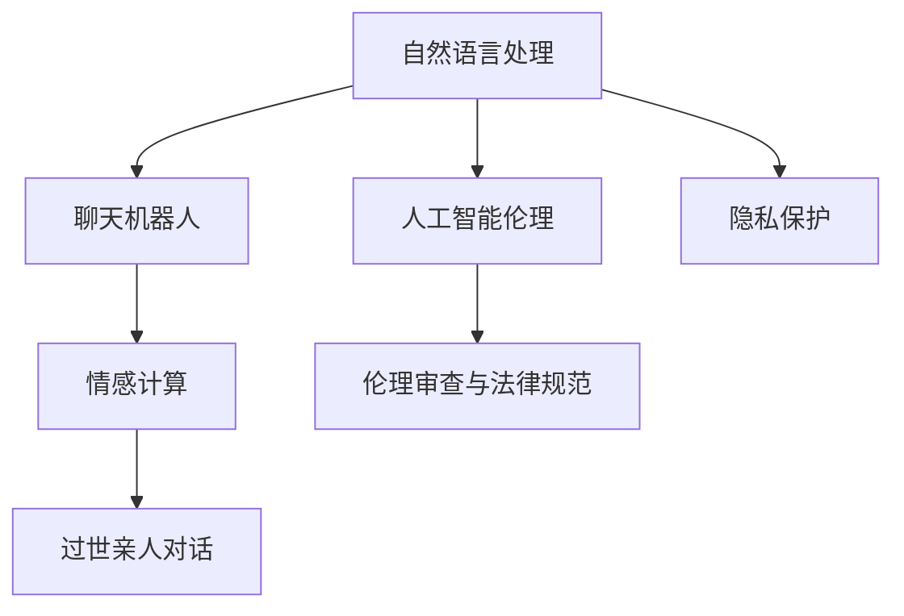

                 

# 过世亲人对话的伦理挑战

## 1. 背景介绍

### 1.1 问题由来
在数字化和人工智能迅猛发展的今天，我们面临着前所未有的便利和挑战。其中一个看似平常但极其深刻的挑战就是：在技术助力下，我们如何恰当地处理与过世亲人的对话？

技术提供了新的沟通方式，如自然语言处理(NLP)、聊天机器人等，使得虚拟对话成为了可能。然而，这种对话不仅仅是技术问题，还牵涉到伦理、隐私、文化、情感等多个维度。过世亲人对话，尤其涉及到了生与死的边界、家庭与历史的联结以及人机关系的处理。

### 1.2 问题核心关键点
- **技术进步与人文关怀**：技术如何恰当地嵌入人文关怀，避免冷漠与疏离。
- **隐私与数据安全**：如何保护用户隐私，尤其是涉及过世亲人的敏感信息。
- **情感与心理影响**：如何平衡技术带来的便利与用户的情感和心理健康。
- **文化与价值观**：不同文化背景下的对话伦理标准。
- **伦理审查与法律规范**：技术应用的伦理边界与法律规范。

本文将围绕这些问题点，探讨过世亲人对话的伦理挑战，分析技术在其中的角色，并提出可能的解决策略。

## 2. 核心概念与联系

### 2.1 核心概念概述

在探讨过世亲人对话时，有几个关键概念需要明确：

- **自然语言处理(NLP)**：使用计算机理解和生成人类语言的技术。
- **聊天机器人**：基于NLP技术的虚拟对话伙伴。
- **人工智能伦理**：在人工智能应用中，如何平衡技术与人文、法律、伦理的关系。
- **隐私保护**：在处理个人信息时，如何确保数据的安全与用户的隐私。
- **情感计算**：研究计算机如何理解和响应人类情感的技术。

这些概念之间存在着密切联系。NLP和聊天机器人技术为过世亲人对话提供了技术手段，而人工智能伦理、隐私保护、情感计算等则构成了其伦理和法律框架。

### 2.2 核心概念原理和架构的 Mermaid 流程图



这个流程图展示了核心概念之间的联系：自然语言处理技术通过聊天机器人，与情感计算相结合，实现了过世亲人对话的功能。同时，人工智能伦理和隐私保护构成了对话的伦理与法律框架，伦理审查与法律规范进一步保障了对话的合法性和道德性。

## 3. 核心算法原理 & 具体操作步骤

### 3.1 算法原理概述

过世亲人对话的核心算法原理基于自然语言处理和情感计算。其基本步骤如下：

1. **数据收集**：收集过世亲人的文字、语音记录，或他人对这些记录的情感反应。
2. **预处理**：清洗、标注数据，建立对话数据集。
3. **模型训练**：使用预处理后的数据集训练对话生成模型。
4. **对话生成**：模型接收用户输入，生成符合情感需求的对话回应。
5. **反馈与优化**：用户对回应的情感反馈用于优化模型。

### 3.2 算法步骤详解

**Step 1: 数据收集**
- 收集过世亲人的文字、语音记录，以及他人对这些记录的情感反应（如悲伤、怀念、感恩等）。
- 通过访谈、回忆录、社交媒体等多种渠道获取数据，确保数据的丰富性和多样性。

**Step 2: 预处理**
- 清洗数据，去除噪声和无关信息。
- 对对话进行标注，标记出情感类别，如悲伤、怀念、感恩等。
- 使用词向量技术将文本数据转化为数值形式。

**Step 3: 模型训练**
- 选择适当的NLP模型，如GPT、BERT等，对其进行微调。
- 在训练过程中加入情感标签，让模型学习情感信息的表达。
- 使用监督学习或无监督学习的方式进行训练，如使用情绪识别模型进行预训练。

**Step 4: 对话生成**
- 用户输入对话主题或情感需求，模型根据输入生成对话回应。
- 生成过程中，模型会结合训练数据中的情感信息和用户输入，产生情感共鸣的回应。

**Step 5: 反馈与优化**
- 用户对回应的情感反馈用于调整模型的参数，进一步优化模型性能。
- 定期收集用户的情感反馈，进行模型迭代。

### 3.3 算法优缺点

**优点**：
- 通过技术手段，为失去亲人的用户提供情感支持，缓解悲痛。
- 可以在任何时间、地点进行对话，方便用户随时回忆与亲人互动的美好时光。

**缺点**：
- 可能会因对话中的情感偏向而再次引发用户的悲痛。
- 对话质量依赖于模型的训练数据，数据质量不佳可能导致对话内容失真。
- 技术应用可能缺乏深度的人文关怀，无法完全替代人类情感的交流。

### 3.4 算法应用领域

基于此算法原理，过世亲人对话技术可以在以下领域得到应用：

- **情感支持**：为失去亲人的用户提供情感慰藉，帮助他们从悲痛中走出。
- **记忆保存**：记录与过世亲人的对话，保存家庭历史和文化记忆。
- **教育培训**：在心理咨询和治疗中，用于模拟过世亲人的对话，帮助用户处理悲伤情绪。
- **文化传承**：记录和传承过世亲人的智慧和价值观，传承家族文化。

## 4. 数学模型和公式 & 详细讲解 & 举例说明

### 4.1 数学模型构建

假设有一个简单的情感分类模型 $M$，输入为对话内容 $x$，输出为情感标签 $y$。模型的训练目标是最大化似然函数：

$$
\max \sum_{i=1}^N \log P(y_i | x_i)
$$

其中 $P(y_i | x_i)$ 表示在给定输入 $x_i$ 的情况下，输出 $y_i$ 的概率。

### 4.2 公式推导过程

利用交叉熵损失函数进行模型训练，可以得到：

$$
\mathcal{L} = -\frac{1}{N} \sum_{i=1}^N \left[ y_i \log P(y_i | x_i) + (1-y_i) \log (1-P(y_i | x_i)) \right]
$$

使用随机梯度下降（SGD）等优化算法更新模型参数 $\theta$，目标是最小化损失函数 $\mathcal{L}$。

### 4.3 案例分析与讲解

以一个简单的案例来说明上述过程。假设有一个对话，输入为“你是我生命中最重要的存在”，模型的输出为“悲伤”。在训练过程中，模型会根据标签和输入进行反向传播，更新参数，从而提高“悲伤”这一情感的预测准确率。

## 5. 项目实践：代码实例和详细解释说明

### 5.1 开发环境搭建

在搭建开发环境时，需要考虑以下几个方面：

- **语言环境**：安装Python环境，推荐使用Anaconda或Miniconda。
- **工具包**：安装TensorFlow、PyTorch等深度学习框架，以及相关的NLP库，如NLTK、spaCy等。
- **数据处理**：准备对话数据集，并使用Pandas、NumPy等工具进行数据预处理。

### 5.2 源代码详细实现

以下是一个简单的对话生成模型代码实现：

```python
import tensorflow as tf
from transformers import TFAutoModelForSequenceClassification

# 加载预训练模型
model = TFAutoModelForSequenceClassification.from_pretrained('bert-base-uncased', num_labels=3)

# 定义优化器和损失函数
optimizer = tf.keras.optimizers.Adam(learning_rate=2e-5)
loss_fn = tf.keras.losses.SparseCategoricalCrossentropy()

# 定义模型训练过程
@tf.function
def train_step(inputs, labels):
    with tf.GradientTape() as tape:
        outputs = model(inputs, training=True)
        loss = loss_fn(labels, outputs.logits)
    grads = tape.gradient(loss, model.trainable_variables)
    optimizer.apply_gradients(zip(grads, model.trainable_variables))
    return loss

# 训练循环
def train_epoch(model, dataset, batch_size):
    dataloader = tf.data.Dataset.from_tensor_slices((dataset['text'], dataset['label'])).batch(batch_size)
    for batch in dataloader:
        loss = train_step(batch[0], batch[1])
        if tf.math.equal(loss, 0.0):
            print('epoch converged')
            break
    else:
        print('epoch not converged')

# 加载对话数据集，进行模型训练
train_data = ...
train_epoch(model, train_data, batch_size=16)
```

### 5.3 代码解读与分析

**代码分析**：
- 使用了TensorFlow和HuggingFace的Transformers库，加载了预训练的BERT模型。
- 定义了优化器和损失函数，用于模型训练。
- 定义了`train_step`函数，用于进行单批次模型训练。
- 通过`train_epoch`函数，实现了一个简单的训练循环，并在每次迭代后输出训练损失。

## 6. 实际应用场景

### 6.1 情感支持
通过对话机器人，可以为失去亲人的用户提供情感支持，帮助他们缓解悲痛。用户可以通过输入关键词或短句，让机器人生成与过世亲人相关的对话回应，从而获得情感上的慰藉。

### 6.2 记忆保存
将与过世亲人的对话记录保存下来，可以作为家庭记忆的一部分，传承家族文化。这对于家族历史的研究和传承具有重要意义。

### 6.3 教育培训
在心理咨询和治疗中，对话机器人可以用于模拟过世亲人的对话，帮助用户处理悲伤情绪，逐步从悲痛中恢复过来。

### 6.4 未来应用展望

未来的技术发展可能会进一步优化对话模型的表现，使其更加细腻、自然。随着多模态对话、情感计算等技术的进步，对话机器人将能够更好地理解用户的情感需求，提供更贴心的服务。

## 7. 工具和资源推荐

### 7.1 学习资源推荐

为了深入理解过世亲人对话的技术实现和伦理挑战，以下是一些推荐的学习资源：

- **《人工智能伦理》课程**：多门大学开设的AI伦理课程，涵盖伦理、法律、社会影响等多个方面。
- **《自然语言处理入门》书籍**：介绍NLP基础概念和技术实现的经典书籍。
- **《情感计算导论》书籍**：探讨计算机如何理解和响应人类情感的专著。

### 7.2 开发工具推荐

- **TensorFlow**：强大的深度学习框架，支持分布式训练和模型优化。
- **PyTorch**：灵活的深度学习框架，适合研究和开发。
- **HuggingFace Transformers**：提供预训练模型的封装，便于快速实现对话生成等任务。

### 7.3 相关论文推荐

- **《基于深度学习的情感计算》**：探讨情感计算的基本原理和应用实例的论文。
- **《人工智能伦理与隐私保护》**：讨论AI应用中隐私保护和伦理问题的综述性论文。
- **《过世亲人对话系统的设计与实现》**：针对过世亲人对话系统的具体设计和实现过程的研究论文。

## 8. 总结：未来发展趋势与挑战

### 8.1 研究成果总结

基于NLP和情感计算技术的过世亲人对话系统，已经在多个领域得到了应用，展示了其巨大的潜力。然而，技术应用也面临着伦理、隐私、情感等多个维度的挑战。

### 8.2 未来发展趋势

- **多模态对话**：结合图像、视频等多模态信息，增强对话的自然性和情感表达。
- **深度情感计算**：发展更先进的情感识别和生成技术，提高对话的细腻度。
- **个性化定制**：根据用户的个性化需求，定制个性化的对话体验。

### 8.3 面临的挑战

- **伦理边界**：如何确保技术应用不侵犯用户隐私，不造成情感伤害。
- **数据隐私**：如何保护用户隐私，防止敏感信息泄露。
- **技术局限**：对话机器人无法完全替代人类情感交流，如何平衡技术与情感的关系。

### 8.4 研究展望

未来的研究应当关注以下几个方面：

- **伦理审查机制**：建立严格的伦理审查机制，确保技术应用符合伦理标准。
- **隐私保护技术**：开发隐私保护技术，如差分隐私、联邦学习等，保障用户数据安全。
- **情感计算研究**：进一步研究情感计算的算法和技术，提高对话的自然性和情感共鸣度。

## 9. 附录：常见问题与解答

**Q1: 为什么过世亲人对话技术会引发伦理争议？**

A: 过世亲人对话技术引发伦理争议的原因在于，它涉及生与死的边界、家庭与历史的联结以及人机关系的处理。技术的应用可能会引发对隐私、文化、情感等问题的深度思考，如何恰当地处理这些复杂的伦理问题，是技术发展中必须面对的挑战。

**Q2: 如何平衡技术便利与用户情感？**

A: 在技术开发中，应当注重人机关系的处理，避免冷漠与疏离。对话机器人应当设计成能够理解用户情感，尊重用户隐私，提供人性化的服务。同时，用户也应当有意识地控制技术的使用，避免沉迷于虚拟对话，影响现实生活中的情感交流。

**Q3: 对话机器人在实际应用中应注意哪些问题？**

A: 在实际应用中，对话机器人应注意以下问题：
- 确保数据质量，避免对话内容的失真。
- 注意对话的情感偏向，避免再次引发用户的悲痛。
- 设计合理的反馈机制，使用户能够随时调整对话的情感倾向。

---

作者：禅与计算机程序设计艺术 / Zen and the Art of Computer Programming

