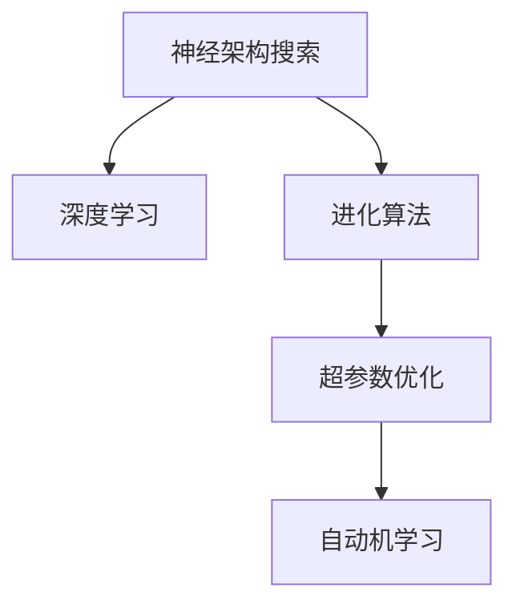

                 

# 进化算法在神经架构搜索中的应用

> 关键词：进化算法, 神经架构搜索, 深度学习, 自动机学习, 超参数优化

## 1. 背景介绍

在深度学习领域，神经网络架构的优化与选择一直是一个重要而复杂的问题。传统的神经网络设计依赖人工经验和反复实验，工作量巨大且往往效果不佳。随着深度学习的不断发展，神经网络规模不断扩大，网络架构变得更加复杂，人工设计成本越来越高。

为了应对这一挑战，一种基于进化算法的新型神经网络架构搜索方法——神经架构搜索(Neural Architecture Search, NAS)应运而生。NAS方法通过自动化搜索，找到最优的神经网络架构，在保证网络性能的前提下，显著减少设计成本，提升训练效率。

## 2. 核心概念与联系

### 2.1 核心概念概述

为了深入理解进化算法在神经架构搜索中的应用，本节将介绍几个关键概念：

- **神经架构搜索(NAS)**：通过自动搜索候选网络结构，找到最优或近似最优的网络架构的方法。NAS方法利用强化学习、遗传算法、进化算法等自动化技术，寻找能够提升特定任务性能的架构。
- **深度学习(Deep Learning, DL)**：一种基于神经网络的机器学习技术，能够自动从数据中学习特征，并在分类、回归、聚类等任务上取得优异表现。
- **进化算法(Evolutionary Algorithms, EAs)**：一种模拟自然界进化过程的算法，通过种群选择、交叉、变异等操作，逐步优化问题的解空间。
- **超参数优化(Hyperparameter Optimization, HPO)**：在深度学习模型训练过程中，超参数的选择对模型性能有重大影响。超参数优化旨在找到最优的超参数组合，以提升模型性能。

这些概念之间的关系可以通过以下Mermaid流程图来展示：



该流程图展示了各个概念之间的逻辑关系：

1. 神经架构搜索通过进化算法寻找最优的网络结构，应用于深度学习中。
2. 超参数优化配合神经架构搜索，进一步优化网络性能。
3. 自动机学习作为进化算法的一部分，用于学习种群中的优秀个体，并应用于网络架构的选择。

这些概念共同构成了深度学习模型自动设计的技术框架，使得深度学习应用更加自动化、高效化。

## 3. 核心算法原理 & 具体操作步骤

### 3.1 算法原理概述

进化算法在神经架构搜索中的应用，主要基于遗传算法和进化策略等。其基本思路是，将神经网络架构表示为一个“基因型”，通过模拟自然界进化过程，对架构进行种群选择、交叉和变异操作，逐步优化网络架构的“适应度”。适应度函数的定义需要根据具体任务进行设计，如网络的准确率、速度、内存消耗等。

### 3.2 算法步骤详解

#### 3.2.1 初始化种群

首先，需要生成一个初始的种群，每个个体表示一种可能的神经网络架构。种群大小一般设置为50到200。种群生成方式可以随机选择网络层数、节点数、激活函数、连接方式等，生成多种架构。

#### 3.2.2 适应度评估

对每个个体进行适应度评估，即计算其在目标任务上的性能。适应度函数的具体形式需要根据任务而定，如分类任务的准确率、回归任务的绝对误差等。

#### 3.2.3 选择操作

采用轮盘赌、锦标赛、排序选择等策略，选择适应度较高的个体进入下一代种群。选择概率取决于个体的适应度值，适应度值高的个体被选中的概率也大。

#### 3.2.4 交叉操作

采用单点交叉、多点交叉等方法，生成新的个体。交叉操作将两个个体的部分遗传信息进行交换，产生新的后代。交叉概率和数量需要根据实际情况进行调参。

#### 3.2.5 变异操作

对新生成的个体进行变异操作，以引入新的基因。变异方法包括基因交换、基因变异、基因插入等，变异概率一般设置为较低的值。

#### 3.2.6 生成下一代种群

将选择、交叉和变异操作产生的新个体加入种群，生成下一代种群。重复上述步骤，直到种群达到预设大小或满足停止条件。

#### 3.2.7 终止条件

终止条件可以包括达到最大迭代次数、种群适应度不再提升等。

### 3.3 算法优缺点

#### 3.3.1 优点

进化算法在神经架构搜索中的优点包括：

- **自动化**：不需要人工设计网络结构，自动化进行搜索，节省人力。
- **全局优化**：通过种群选择、交叉和变异操作，逐步搜索最优解。
- **可扩展性**：适用于多任务、多目标优化，能够同时优化多个超参数。
- **鲁棒性**：能够处理大规模搜索空间，避免局部最优解。

#### 3.3.2 缺点

进化算法在神经架构搜索中的缺点包括：

- **计算成本高**：搜索过程需要大量计算资源，尤其是大规模种群和多次迭代。
- **超参数敏感**：选择、交叉和变异操作的参数设置需要精细调整，否则可能导致性能不佳。
- **局部优化风险**：搜索过程可能陷入局部最优，无法找到全局最优解。

### 3.4 算法应用领域

进化算法在神经架构搜索中的应用，主要包括以下几个领域：

- **图像分类**：通过优化卷积神经网络架构，提升图像分类性能。
- **自然语言处理(NLP)**：通过优化循环神经网络、注意力机制等，提升文本处理和生成效果。
- **语音识别**：通过优化深度卷积神经网络、递归神经网络等，提升语音识别准确率。
- **自动驾驶**：通过优化感知网络、决策网络等，提升自动驾驶系统的性能。
- **推荐系统**：通过优化深度神经网络架构，提升个性化推荐效果。

这些领域中，进化算法通过优化网络架构，显著提升了模型的性能，为深度学习应用的发展提供了重要支持。

## 4. 数学模型和公式 & 详细讲解

### 4.1 数学模型构建

进化算法在神经架构搜索中的应用，主要依赖于以下几个数学模型：

- **种群**：种群中每个个体表示一种可能的神经网络架构。种群大小为$P$。
- **适应度**：表示个体的性能，需要通过任务评估得到。适应度函数$f$通常为分类准确率、回归误差等。
- **选择操作**：基于适应度值进行选择，采用轮盘赌、锦标赛等策略。
- **交叉操作**：通过交换个体部分基因产生新的后代。
- **变异操作**：通过基因交换、变异等方法产生新的个体。

### 4.2 公式推导过程

以下以简单的二分类任务为例，推导进化算法在神经架构搜索中的基本流程。

设初始种群大小为$P$，每个个体表示一种神经网络架构。第$i$个体的适应度为$f_i$，选择概率为$p_i$。采用轮盘赌选择策略，选择概率$p_i$与适应度$f_i$成正比：

$$ p_i \propto f_i $$

选择操作后，生成新的种群。设选择后的种群大小为$P'$，其中$n_i$为选择第$i$个体的次数。交叉和变异操作后，生成新的个体$X_{i,j}$，适应度为$f_{i,j}$。

采用单点交叉策略，选择个体$A$和$B$，随机选择一个点$c$，将$A$和$B$在$c$点之后的基因交换，生成新个体$X_{A,B,c}$：

$$ X_{A,B,c} = (A_1,\cdots,A_c,A_{c+1}^B,\cdots,A_n,B_{c+1}^A,\cdots,B_n) $$

采用基因变异策略，随机选择一个基因位$p$，并将$A_p$变异为$B_p$：

$$ X_A^p \rightarrow X_{A'}^p $$

通过上述步骤，生成新的种群，继续迭代搜索。

### 4.3 案例分析与讲解

以图像分类任务为例，假设初始种群大小为200，每个个体表示一种卷积神经网络架构，共有4层卷积、2层池化、2层全连接层。采用二进制基因编码，每个基因位表示一个层级或参数。

采用交叉和变异操作后，生成新的个体。选择操作基于分类准确率进行，适应度函数为：

$$ f = \frac{\text{分类准确率}}{100} $$

迭代100代后，选择适应度最高的个体，得到最优的网络架构。

## 5. 项目实践：代码实例和详细解释说明

### 5.1 开发环境搭建

在进行神经架构搜索项目实践前，我们需要准备好开发环境。以下是使用Python进行TensorFlow进行神经架构搜索的开发环境配置流程：

1. 安装Anaconda：从官网下载并安装Anaconda，用于创建独立的Python环境。

2. 创建并激活虚拟环境：
```bash
conda create -n nas-env python=3.7 
conda activate nas-env
```

3. 安装TensorFlow：从官网获取对应的安装命令，例如：
```bash
conda install tensorflow tensorflow-gpu=2.7
```

4. 安装TensorBoard：TensorFlow配套的可视化工具，可实时监测模型训练状态，并提供丰富的图表呈现方式。

5. 安装Keras Tuner：用于自动化调参的库，支持进化算法等优化方法。

```bash
pip install keras-tuner tensorflow-probability==0.12.1
```

6. 安装其他必要的库：
```bash
pip install tensorflow-patas
```

完成上述步骤后，即可在`nas-env`环境中开始神经架构搜索实践。

### 5.2 源代码详细实现

下面是使用TensorFlow和Keras Tuner进行神经架构搜索的代码实现：

```python
from tensorflow import keras
from tensorflow.keras import layers
from tensorflow.keras_tuner.tuners import RandomSearch

# 定义模型构建函数
def build_model(hp):
    model = keras.Sequential()
    for i in range(hp.Int('num_layers', 2, 20)):
        model.add(layers.Dense(units=hp.Int('units_' + str(i), min_value=32, max_value=512, step=32), activation='relu'))
    return model

# 定义适应度评估函数
def evaluate_model(model, data, benchmark):
    test_loss, test_acc = model.evaluate(data['val_x'], data['val_y'])
    return {'val_accuracy': test_acc}

# 配置搜索空间
hp = RandomSearch(
    build_model,
    objective='val_accuracy',
    max_trials=10,
    executions_per_trial=3,
    directory='nas_results',
    project_name='nas_example'
)

# 执行搜索
hp.search_space_summary()
hp.search()

# 选择最优模型
best_model = hp.get_best_models(num_models=1)[0]
best_model.summary()

# 评估最优模型
test_loss, test_acc = best_model.evaluate(data['test_x'], data['test_y'])
print('Test accuracy:', test_acc)
```

上述代码中，首先定义了模型构建函数`build_model`，用于生成不同层数、节点数的神经网络。然后定义了适应度评估函数`evaluate_model`，用于计算模型在验证集上的分类准确率。接着，配置了搜索空间和随机搜索器`RandomSearch`，并执行搜索。最后，选择最优模型并评估其性能。

### 5.3 代码解读与分析

让我们再详细解读一下关键代码的实现细节：

**build_model函数**：
- `hp.Int`：用于指定超参数搜索范围，如层数、节点数。
- `layers.Dense`：用于定义神经网络层，包括节点数和激活函数。

**evaluate_model函数**：
- 计算模型在验证集上的分类准确率，并返回适应度值。

**hp.RandomSearch配置**：
- `objective`：指定优化目标，如分类准确率。
- `max_trials`：指定最大迭代次数。
- `executions_per_trial`：指定每个超参数组合的实验次数。
- `directory`和`project_name`：用于保存搜索结果。

**代码执行流程**：
- `hp.search_space_summary`：展示搜索空间概览。
- `hp.search`：启动搜索。
- `hp.get_best_models`：选择适应度最高的模型。
- `best_model.summary`：展示最优模型概览。
- `best_model.evaluate`：评估最优模型性能。

这些步骤展示了使用TensorFlow和Keras Tuner进行神经架构搜索的基本流程。开发者可以根据具体任务调整模型构建函数、适应度评估函数和超参数搜索范围，实现更复杂的神经架构搜索。

## 6. 实际应用场景

### 6.1 图像分类

在图像分类任务中，进化算法可以用于优化卷积神经网络(CNN)的架构。例如，在CIFAR-10数据集上，通过优化CNN层数、节点数、激活函数等超参数，可以得到最优的神经网络架构，显著提升分类准确率。

### 6.2 自然语言处理(NLP)

在NLP任务中，进化算法可以用于优化循环神经网络(RNN)、卷积神经网络(CNN)和Transformer等架构。例如，在情感分析任务中，通过优化RNN的层数、节点数、激活函数等超参数，可以得到最优的模型架构，提升情感分析的准确率。

### 6.3 语音识别

在语音识别任务中，进化算法可以用于优化深度卷积神经网络(ConvNet)、递归神经网络(RNN)等架构。例如，在LibriSpeech数据集上，通过优化ConvNet的层数、节点数、激活函数等超参数，可以得到最优的语音识别模型架构，提升识别准确率。

### 6.4 自动驾驶

在自动驾驶任务中，进化算法可以用于优化感知网络、决策网络等架构。例如，在Kitti数据集上，通过优化感知网络的层数、节点数、激活函数等超参数，可以得到最优的感知网络架构，提升自动驾驶的感知和决策能力。

### 6.5 推荐系统

在推荐系统任务中，进化算法可以用于优化深度神经网络(Deep Neural Network, DNN)架构。例如，在MovieLens数据集上，通过优化DNN的层数、节点数、激活函数等超参数，可以得到最优的推荐系统模型架构，提升推荐效果。

## 7. 工具和资源推荐

### 7.1 学习资源推荐

为了帮助开发者系统掌握神经架构搜索的理论基础和实践技巧，这里推荐一些优质的学习资源：

1. Deep Learning with Python：由François Chollet编写，全面介绍了TensorFlow和Keras的深度学习开发，包括神经架构搜索的实现。

2. Neural Architecture Search (NAS) with Deep Learning：由Intel发布，详细介绍了NAS的概念、算法和应用。

3. AutoML: Methods, Systems, Challenges：由Google Brain Team发布，涵盖自动机器学习的最新研究进展。

4. Meta-Learning for Neural Architecture Search：由Huawei发布，介绍了元学习在神经架构搜索中的应用。

5. Keras Tuner官方文档：TensorFlow的Keras Tuner库的官方文档，提供了丰富的搜索算法和超参数优化方法。

通过对这些资源的学习实践，相信你一定能够快速掌握神经架构搜索的精髓，并用于解决实际的深度学习问题。

### 7.2 开发工具推荐

高效的开发离不开优秀的工具支持。以下是几款用于神经架构搜索开发的常用工具：

1. TensorFlow：由Google主导开发的开源深度学习框架，生产部署方便，适合大规模工程应用。

2. Keras：TensorFlow的高级接口，简单易用，适合快速迭代研究。

3. Keras Tuner：用于自动化调参的库，支持多种搜索算法和超参数优化方法。

4. TensorBoard：TensorFlow配套的可视化工具，可实时监测模型训练状态，并提供丰富的图表呈现方式。

5. Weights & Biases：模型训练的实验跟踪工具，可以记录和可视化模型训练过程中的各项指标，方便对比和调优。

6. Jupyter Notebook：交互式的开发环境，方便快速迭代和实验新模型。

合理利用这些工具，可以显著提升神经架构搜索任务的开发效率，加快创新迭代的步伐。

### 7.3 相关论文推荐

神经架构搜索是深度学习领域的前沿研究主题，以下是几篇奠基性的相关论文，推荐阅读：

1. NeuroEvolution: A Framework for Automated Neural Architecture Search：提出了神经进化算法在神经网络架构搜索中的应用，奠定了神经架构搜索的理论基础。

2. Automated Model-Tuning via Hyperparameter Optimization：介绍了超参数优化在神经架构搜索中的应用，提供了多种优化方法和算法。

3. Neural Architecture Search with Evolution Strategies：探讨了进化策略在神经架构搜索中的应用，提升了搜索效率和效果。

4. SpaceToBatch: An AutoML Solution for Mobile Image Classification：介绍了一种基于神经网络架构搜索的移动图像分类解决方案，展示了AutoML的应用潜力。

5. AutoML for Hyperparameter Optimization in Machine Learning：探讨了超参数优化在AutoML中的应用，提供了多种优化算法和策略。

这些论文代表了大规模搜索空间的自动化探索范式，为神经架构搜索技术的发展提供了重要参考。

## 8. 总结：未来发展趋势与挑战

### 8.1 总结

本文对进化算法在神经架构搜索中的应用进行了全面系统的介绍。首先阐述了神经架构搜索的概念、原理和应用场景，明确了进化算法在神经架构搜索中的独特价值。其次，从原理到实践，详细讲解了神经架构搜索的数学模型和算法流程，给出了神经架构搜索任务开发的完整代码实例。同时，本文还探讨了进化算法在多个实际应用领域中的应用，展示了神经架构搜索技术的广泛应用前景。

通过本文的系统梳理，可以看到，神经架构搜索通过自动化搜索，显著提升了深度学习模型的设计效率和性能，为深度学习应用的发展提供了重要支持。

### 8.2 未来发展趋势

展望未来，神经架构搜索技术将呈现以下几个发展趋势：

1. **自动化水平提升**：神经架构搜索的自动化水平将进一步提升，减少人工干预，实现全自动化搜索。

2. **多任务优化**：神经架构搜索将同时优化多个超参数，实现多目标优化，提升模型的泛化能力和性能。

3. **动态优化**：神经架构搜索将实时优化，能够根据当前数据分布和新任务要求，动态调整搜索策略和模型参数。

4. **分布式优化**：神经架构搜索将利用分布式计算，提升搜索效率和效果，适应大规模数据集和高复杂度任务。

5. **跨领域应用**：神经架构搜索将应用于更多领域，如医疗、金融、自动驾驶等，推动各领域的智能化进程。

6. **自适应学习**：神经架构搜索将引入自适应学习算法，提升模型的鲁棒性和适应性。

以上趋势凸显了神经架构搜索技术的广阔前景，这些方向的探索发展，必将进一步提升深度学习模型的设计效率和性能，为各领域的应用提供有力支持。

### 8.3 面临的挑战

尽管神经架构搜索技术已经取得了瞩目成就，但在迈向更加智能化、普适化应用的过程中，它仍面临着诸多挑战：

1. **计算成本高**：神经架构搜索需要大量计算资源，尤其是在大规模搜索空间和高维超参数的情况下。如何降低计算成本，提高搜索效率，仍是主要难题。

2. **搜索空间复杂**：神经架构搜索需要在大规模搜索空间中寻找最优解，容易陷入局部最优，无法找到全局最优解。如何设计高效的搜索策略，避免局部最优，仍是重要研究方向。

3. **超参数敏感**：神经架构搜索的性能高度依赖超参数设置，不同超参数组合可能带来截然不同的效果。如何自适应调整超参数，提高搜索效果，仍是重要挑战。

4. **模型可解释性**：神经架构搜索生成的模型结构复杂，难以解释其内部工作机制和决策逻辑。如何提高模型的可解释性，确保其可靠性，仍是重要问题。

5. **多目标优化**：神经架构搜索通常只优化单一指标，如准确率或速度。如何同时优化多个目标，实现多目标优化，仍是重要挑战。

6. **模型泛化性**：神经架构搜索生成的模型往往难以泛化到新数据集和新任务上，如何提升模型的泛化能力，仍是重要研究方向。

7. **鲁棒性和安全性**：神经架构搜索生成的模型可能存在鲁棒性不足和安全性问题。如何提升模型的鲁棒性和安全性，确保其可靠性和可用性，仍是重要问题。

以上挑战凸显了神经架构搜索技术在实际应用中的复杂性和困难性，未来需要在多方面进行深入研究和优化。

### 8.4 研究展望

面对神经架构搜索技术所面临的挑战，未来的研究需要在以下几个方面寻求新的突破：

1. **自适应搜索策略**：引入自适应搜索策略，根据数据分布和任务要求，动态调整搜索策略和模型参数，提高搜索效率和效果。

2. **多目标优化算法**：引入多目标优化算法，同时优化多个指标，提升模型的泛化能力和性能。

3. **分布式计算**：利用分布式计算，加速搜索过程，适应大规模数据集和高复杂度任务。

4. **模型压缩与优化**：引入模型压缩与优化技术，减少模型大小和计算资源消耗，提高模型的实时性和效率。

5. **自适应超参数优化**：引入自适应超参数优化方法，自适应调整超参数，提高搜索效果和模型性能。

6. **模型可解释性增强**：引入可解释性增强技术，提高模型的可解释性和可靠性，确保其安全性。

7. **模型鲁棒性提升**：引入鲁棒性提升技术，提升模型的鲁棒性和安全性，确保其可靠性和可用性。

这些研究方向将推动神经架构搜索技术向更高级、更普适的方向发展，为深度学习模型的设计提供有力支持。

## 9. 附录：常见问题与解答

**Q1：神经架构搜索是否适用于所有深度学习任务？**

A: 神经架构搜索在大多数深度学习任务上都能取得不错的效果，特别是对于数据量较小的任务。但对于一些特定领域的任务，如医疗、法律等，仅仅依靠通用语料预训练的模型可能难以很好地适应。此时需要在特定领域语料上进一步预训练，再进行搜索，才能获得理想效果。此外，对于一些需要时效性、个性化很强的任务，如对话、推荐等，搜索方法也需要针对性的改进优化。

**Q2：如何选择神经架构搜索的超参数？**

A: 神经架构搜索的超参数选择需要考虑任务特点和数据分布。通常建议先进行小规模探索，如随机搜索、网格搜索等，找到大致的搜索空间范围。然后采用进化算法等高级方法进行细化搜索。超参数选择应包括网络层数、节点数、激活函数、优化器、学习率等，根据具体任务进行调整。

**Q3：神经架构搜索的计算成本如何降低？**

A: 神经架构搜索的计算成本主要来自大规模搜索空间和高维超参数。降低计算成本的方法包括：
1. 使用分布式计算，加速搜索过程。
2. 引入预训练和迁移学习，减少搜索空间。
3. 引入自适应搜索策略，避免过拟合和局部最优。

**Q4：神经架构搜索生成的模型如何部署？**

A: 将神经架构搜索生成的模型部署到实际应用中，需要进行以下步骤：
1. 模型裁剪：去除不必要的层和参数，减小模型尺寸，加快推理速度。
2. 量化加速：将浮点模型转为定点模型，压缩存储空间，提高计算效率。
3. 服务化封装：将模型封装为标准化服务接口，便于集成调用。
4. 弹性伸缩：根据请求流量动态调整资源配置，平衡服务质量和成本。
5. 监控告警：实时采集系统指标，设置异常告警阈值，确保服务稳定性。
6. 安全防护：采用访问鉴权、数据脱敏等措施，保障数据和模型安全。

这些步骤展示了神经架构搜索生成的模型的部署流程，能够帮助开发者将模型转化为实际应用。

---

作者：禅与计算机程序设计艺术 / Zen and the Art of Computer Programming

