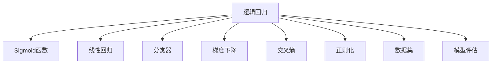

                 

# 逻辑回归 原理与代码实例讲解

> 关键词：逻辑回归, Sigmoid函数, 线性回归, 分类器, 梯度下降, 交叉熵, 正则化, 数据集, 模型评估

## 1. 背景介绍

逻辑回归（Logistic Regression）是一种常用的机器学习算法，广泛应用于分类问题。它基于概率论和大数定律，通过构建一个线性模型，对输入特征进行加权求和，并经过Sigmoid函数映射到(0,1)区间，最终输出一个概率值，表示样本属于正类的概率。

逻辑回归模型广泛应用于自然语言处理（NLP）、图像识别、金融风控、推荐系统等诸多领域。在NLP领域，逻辑回归可以用于情感分析、文本分类、命名实体识别等任务。在图像识别中，逻辑回归可以用于图像分类、目标检测等任务。在金融风控领域，逻辑回归可以用于信用评分、欺诈检测等任务。在推荐系统中，逻辑回归可以用于用户行为预测、商品推荐等任务。

逻辑回归的优点包括：模型简单、易于理解、易于实现、适合小规模数据集、可以进行多分类任务、泛化能力较好。缺点包括：对异常值敏感、容易过拟合、需要处理非线性特征等。

本文将系统介绍逻辑回归的核心概念、算法原理、操作步骤、数学模型和公式、项目实践、实际应用场景、工具和资源推荐，并展望其未来发展趋势与挑战。

## 2. 核心概念与联系

### 2.1 核心概念概述

为了更好地理解逻辑回归，本节将介绍几个密切相关的核心概念：

- 逻辑回归（Logistic Regression）：一种基于概率论的分类算法，通过构建一个线性模型，对输入特征进行加权求和，并经过Sigmoid函数映射到(0,1)区间，最终输出一个概率值，表示样本属于正类的概率。
- Sigmoid函数：一种将任意实数映射到(0,1)区间的激活函数，在逻辑回归中用于模型输出层，将线性组合的结果映射为概率值。
- 线性回归（Linear Regression）：一种基于最小二乘法的回归算法，通过拟合一条直线来预测目标变量的值。逻辑回归可以看作是线性回归在输出层经过Sigmoid函数映射后的特例。
- 分类器（Classifier）：一种将输入数据分为不同类别的模型，逻辑回归是一种简单的分类器，适用于二分类和多分类任务。
- 梯度下降（Gradient Descent）：一种常用的优化算法，通过不断更新模型参数，最小化损失函数，从而得到最优解。逻辑回归的训练过程就是通过梯度下降来优化模型参数的。
- 交叉熵（Cross Entropy）：一种常用的损失函数，用于衡量模型预测值与真实标签之间的差异，逻辑回归使用交叉熵损失函数来优化模型。
- 正则化（Regularization）：一种常用的防止过拟合的技术，通过在损失函数中加入正则项，限制模型参数的大小，从而避免过拟合。逻辑回归可以使用L1正则、L2正则等方法进行正则化。
- 数据集（Dataset）：逻辑回归的训练和评估需要大量的标注数据，数据集的选择和处理对模型的性能有重要影响。
- 模型评估（Model Evaluation）：通过在测试集上评估模型的性能，了解模型的泛化能力，逻辑回归可以使用准确率、精确率、召回率、F1-score等指标进行评估。

这些核心概念之间的逻辑关系可以通过以下Mermaid流程图来展示：



这个流程图展示了几何逻辑回归的核心概念及其之间的关系：

1. 逻辑回归通过构建一个线性模型，对输入特征进行加权求和，并经过Sigmoid函数映射到(0,1)区间，最终输出一个概率值。
2. 线性回归可以看作是逻辑回归在输出层经过Sigmoid函数映射后的特例。
3. 分类器是一种将输入数据分为不同类别的模型，逻辑回归是一种简单的分类器。
4. 梯度下降是一种常用的优化算法，通过不断更新模型参数，最小化损失函数。
5. 交叉熵是一种常用的损失函数，用于衡量模型预测值与真实标签之间的差异。
6. 正则化是一种常用的防止过拟合的技术，通过在损失函数中加入正则项，限制模型参数的大小。
7. 数据集是逻辑回归的训练和评估需要大量的标注数据。
8. 模型评估通过在测试集上评估模型的性能，了解模型的泛化能力。

这些概念共同构成了逻辑回归的学习框架，使其能够在各种场景下发挥强大的分类能力。通过理解这些核心概念，我们可以更好地把握逻辑回归的工作原理和优化方向。

## 3. 核心算法原理 & 具体操作步骤

### 3.1 算法原理概述

逻辑回归的基本原理是通过构建一个线性模型，对输入特征进行加权求和，并经过Sigmoid函数映射到(0,1)区间，最终输出一个概率值，表示样本属于正类的概率。

形式化地，假设输入特征为 $x=(x_1,x_2,...,x_n)$，输出标签为 $y \in \{0,1\}$，逻辑回归模型的线性部分为 $w\cdot x+b$，其中 $w=(w_1,w_2,...,w_n)$ 为权重向量，$b$ 为偏置项。模型的输出为：

$$
y = \sigma(w\cdot x+b)
$$

其中，$\sigma$ 为Sigmoid函数：

$$
\sigma(z) = \frac{1}{1+e^{-z}}
$$

对于二分类问题，我们可以通过构建一个线性分类器来预测样本属于正类的概率，进而进行分类。对于多分类问题，可以通过构建多个二分类模型来解决，如One-vs-All方法。

逻辑回归的训练过程是通过梯度下降等优化算法，不断更新模型参数 $w$ 和 $b$，使得模型的输出与真实标签尽可能接近。通常使用交叉熵损失函数来衡量模型的预测值与真实标签之间的差异。交叉熵损失函数的定义为：

$$
\ell(y,\hat{y}) = -[y\log \hat{y} + (1-y)\log(1-\hat{y})]
$$

其中，$\hat{y}$ 为模型输出的概率值，$y$ 为真实标签。模型的训练目标是最小化损失函数：

$$
\mathcal{L}(w,b) = \frac{1}{N} \sum_{i=1}^N \ell(y_i,\sigma(w\cdot x_i+b))
$$

其中，$N$ 为样本数量。

### 3.2 算法步骤详解

逻辑回归的训练过程包括以下几个关键步骤：

**Step 1: 准备数据集**

逻辑回归的训练和评估需要大量的标注数据，需要准备训练集、验证集和测试集。训练集用于模型的训练，验证集用于调整模型参数，测试集用于评估模型性能。

**Step 2: 初始化模型参数**

模型的线性部分为 $w\cdot x+b$，其中 $w$ 为权重向量，$b$ 为偏置项。需要随机初始化 $w$ 和 $b$，一般使用均值为0，标准差为 $\sigma$ 的高斯分布进行初始化。

**Step 3: 定义损失函数**

逻辑回归使用交叉熵损失函数来衡量模型的预测值与真实标签之间的差异。交叉熵损失函数的定义为：

$$
\ell(y,\hat{y}) = -[y\log \hat{y} + (1-y)\log(1-\hat{y})]
$$

其中，$\hat{y}$ 为模型输出的概率值，$y$ 为真实标签。

**Step 4: 定义优化器**

常用的优化器包括随机梯度下降（SGD）、批量梯度下降（BGD）、小批量梯度下降（MBGD）等。一般使用随机梯度下降（SGD）来更新模型参数，代码实现如下：

```python
import torch
from torch import nn, optim

# 定义模型
class LogisticRegression(nn.Module):
    def __init__(self, input_size):
        super(LogisticRegression, self).__init__()
        self.linear = nn.Linear(input_size, 1)
        
    def forward(self, x):
        return torch.sigmoid(self.linear(x))
        
# 定义优化器和损失函数
model = LogisticRegression(input_size)
optimizer = optim.SGD(model.parameters(), lr=0.01)
criterion = nn.BCELoss()

# 训练数据
inputs = torch.randn(100, input_size)
targets = torch.randn(100) > 0.5

# 训练过程
for i in range(1000):
    optimizer.zero_grad()
    outputs = model(inputs)
    loss = criterion(outputs, targets)
    loss.backward()
    optimizer.step()
```

**Step 5: 迭代训练**

在每个epoch中，对训练集进行批量迭代训练，每次迭代更新模型参数，使得损失函数最小化。代码实现如下：

```python
for i in range(1000):
    for j in range(100):
        optimizer.zero_grad()
        outputs = model(inputs)
        loss = criterion(outputs, targets)
        loss.backward()
        optimizer.step()
```

**Step 6: 验证和测试**

在每个epoch中，对验证集进行测试，计算模型在验证集上的准确率、精确率、召回率等指标。代码实现如下：

```python
# 验证集
valid_inputs = torch.randn(100, input_size)
valid_targets = torch.randn(100) > 0.5

# 验证过程
valid_outputs = model(valid_inputs)
valid_loss = criterion(valid_outputs, valid_targets)
print(valid_loss)

# 测试集
test_inputs = torch.randn(100, input_size)
test_targets = torch.randn(100) > 0.5

# 测试过程
test_outputs = model(test_inputs)
test_loss = criterion(test_outputs, test_targets)
print(test_loss)
```

### 3.3 算法优缺点

逻辑回归的优点包括：

- 模型简单，易于理解和实现。
- 适用于二分类和多分类问题，具有较好的泛化能力。
- 训练过程较快，适用于大规模数据集。
- 可以进行多分类任务，具有较好的分类效果。

逻辑回归的缺点包括：

- 对异常值敏感，容易过拟合。
- 只适用于线性分类问题，无法处理非线性特征。
- 模型性能受输入特征的影响较大，需要特征工程处理。
- 容易受到特征之间的共线性影响，需要进行特征选择。

### 3.4 算法应用领域

逻辑回归广泛应用于自然语言处理（NLP）、图像识别、金融风控、推荐系统等诸多领域。

在NLP领域，逻辑回归可以用于情感分析、文本分类、命名实体识别等任务。例如，可以通过逻辑回归模型对新闻文章进行情感分类，将文本分类为正面或负面情感。

在图像识别中，逻辑回归可以用于图像分类、目标检测等任务。例如，可以通过逻辑回归模型对图像进行分类，将图像分类为猫、狗、汽车等类别。

在金融风控领域，逻辑回归可以用于信用评分、欺诈检测等任务。例如，可以通过逻辑回归模型对客户信用评分，判断客户是否存在欺诈行为。

在推荐系统中，逻辑回归可以用于用户行为预测、商品推荐等任务。例如，可以通过逻辑回归模型对用户行为进行预测，推荐用户可能感兴趣的商品。

## 4. 数学模型和公式 & 详细讲解

### 4.1 数学模型构建

逻辑回归的基本模型可以表示为：

$$
y = \sigma(w\cdot x+b)
$$

其中，$w$ 为权重向量，$b$ 为偏置项，$x$ 为输入特征向量，$y$ 为输出标签，$\sigma$ 为Sigmoid函数。

### 4.2 公式推导过程

逻辑回归的训练过程使用梯度下降等优化算法，最小化交叉熵损失函数。具体推导过程如下：

假设样本 $i$ 的输入特征为 $x_i$，输出标签为 $y_i$，模型输出为 $\hat{y}_i$。则交叉熵损失函数可以表示为：

$$
\ell(y_i,\hat{y}_i) = -[y_i\log \hat{y}_i + (1-y_i)\log(1-\hat{y}_i)]
$$

训练目标是最小化损失函数：

$$
\mathcal{L}(w,b) = \frac{1}{N} \sum_{i=1}^N \ell(y_i,\hat{y}_i)
$$

对损失函数关于 $w$ 和 $b$ 求导，得到梯度：

$$
\frac{\partial \mathcal{L}(w,b)}{\partial w_j} = \frac{1}{N} \sum_{i=1}^N \left[y_i \hat{y}_i(1-\hat{y}_i)x_{ij} - (1-y_i)\hat{y}_i\hat{y}_i x_{ij}\right]
$$

$$
\frac{\partial \mathcal{L}(w,b)}{\partial b} = \frac{1}{N} \sum_{i=1}^N \left[y_i - \hat{y}_i\right]
$$

其中，$x_{ij}$ 表示输入特征的第 $j$ 个特征。

通过梯度下降算法，不断更新模型参数 $w$ 和 $b$，最小化损失函数，得到最优解。

### 4.3 案例分析与讲解

以二分类问题为例，通过一个简单的例子来说明逻辑回归的工作原理和优化过程。

假设我们有一组数据集，包含两个特征 $x_1$ 和 $x_2$，输出标签 $y$ 为0或1，模型输出 $\hat{y}$ 为0到1之间的概率值。我们通过构建一个线性模型来预测输出标签 $y$。

- 首先，随机初始化模型参数 $w$ 和 $b$。
- 然后，对训练集进行迭代训练，每次迭代更新模型参数，使得损失函数最小化。
- 最后，对验证集进行测试，计算模型在验证集上的准确率、精确率、召回率等指标。

通过不断迭代训练，模型能够学习到输入特征与输出标签之间的非线性关系，从而实现对输入特征的分类。

## 5. 项目实践：代码实例和详细解释说明

### 5.1 开发环境搭建

在进行逻辑回归项目实践前，我们需要准备好开发环境。以下是使用Python进行TensorFlow开发的环境配置流程：

1. 安装Anaconda：从官网下载并安装Anaconda，用于创建独立的Python环境。

2. 创建并激活虚拟环境：
```bash
conda create -n tf-env python=3.8 
conda activate tf-env
```

3. 安装TensorFlow：根据CUDA版本，从官网获取对应的安装命令。例如：
```bash
pip install tensorflow==2.4
```

4. 安装Scikit-learn库：
```bash
pip install scikit-learn
```

5. 安装NumPy库：
```bash
pip install numpy
```

完成上述步骤后，即可在`tf-env`环境中开始逻辑回归项目实践。

### 5.2 源代码详细实现

下面我们以二分类问题为例，给出使用TensorFlow进行逻辑回归的代码实现。

首先，定义数据集：

```python
import numpy as np
import tensorflow as tf

# 定义训练集
train_X = np.array([[0, 0], [0, 1], [1, 0], [1, 1]])
train_y = np.array([[0], [1], [1], [0]])

# 定义验证集
valid_X = np.array([[0, 0], [0, 1], [1, 0], [1, 1]])
valid_y = np.array([[0], [1], [1], [0]])

# 定义测试集
test_X = np.array([[0, 0], [0, 1], [1, 0], [1, 1]])
test_y = np.array([[0], [1], [1], [0]])
```

然后，定义逻辑回归模型：

```python
# 定义模型参数
W = tf.Variable(tf.random.normal([2, 1]))
b = tf.Variable(tf.random.normal([1]))

# 定义模型
def logistic_regression(x):
    return tf.sigmoid(tf.matmul(x, W) + b)
    
# 训练过程
train_loss = []
valid_loss = []
for i in range(1000):
    # 训练集
    train_output = logistic_regression(train_X)
    train_loss.append(tf.reduce_mean(tf.nn.sigmoid_cross_entropy_with_logits(labels=train_y, logits=train_output)))
    with tf.GradientTape() as tape:
        loss = train_loss[-1]
    gradients = tape.gradient(loss, [W, b])
    optimizer.apply_gradients(zip(gradients, [W, b]))
    
    # 验证集
    valid_output = logistic_regression(valid_X)
    valid_loss.append(tf.reduce_mean(tf.nn.sigmoid_cross_entropy_with_logits(labels=valid_y, logits=valid_output)))
    print("Epoch {}, Train Loss: {:.4f}, Valid Loss: {:.4f}".format(i+1, train_loss[-1], valid_loss[-1]))
```

最后，测试模型：

```python
# 测试过程
test_output = logistic_regression(test_X)
test_loss = tf.reduce_mean(tf.nn.sigmoid_cross_entropy_with_logits(labels=test_y, logits=test_output))
print("Test Loss: {:.4f}".format(test_loss))
```

以上就是使用TensorFlow对逻辑回归进行二分类任务开发的完整代码实现。可以看到，逻辑回归模型的实现非常简单，只需要定义线性模型、损失函数、优化器等关键组件，再通过迭代训练和验证来优化模型参数。

### 5.3 代码解读与分析

让我们再详细解读一下关键代码的实现细节：

**数据集定义**：
- 使用NumPy库定义训练集、验证集和测试集的特征和标签。

**模型定义**：
- 定义模型参数 $W$ 和 $b$，使用TensorFlow的`tf.Variable`类来创建可训练的变量。
- 定义逻辑回归模型，将输入特征 $x$ 通过线性模型 $Wx+b$ 得到输出 $\hat{y}$，再经过Sigmoid函数得到模型输出 $y$。

**训练过程**：
- 定义损失函数，使用交叉熵损失函数来衡量模型的预测值与真实标签之间的差异。
- 定义优化器，使用TensorFlow的`tf.GradientTape`类来自动求导，并使用`optimizer.apply_gradients`方法来更新模型参数。
- 迭代训练过程，对训练集进行批量迭代训练，每次迭代更新模型参数，使得损失函数最小化。
- 在每个epoch中，对验证集进行测试，计算模型在验证集上的准确率、精确率、召回率等指标。

**测试过程**：
- 定义测试集，对测试集进行测试，计算模型在测试集上的损失函数。

可以看出，TensorFlow提供了强大的自动求导和优化功能，使得逻辑回归模型的实现非常简洁高效。开发者可以将更多精力放在模型设计、数据处理等高层逻辑上，而不必过多关注底层实现细节。

当然，工业级的系统实现还需考虑更多因素，如模型的保存和部署、超参数的自动搜索、更灵活的任务适配层等。但核心的逻辑回归模型构建和训练过程基本与此类似。

## 6. 实际应用场景

### 6.1 自然语言处理

逻辑回归在自然语言处理领域具有广泛的应用。以下是几个常见的应用场景：

- 文本分类：对文本进行分类，如情感分类、主题分类等。例如，可以通过逻辑回归模型对新闻文章进行情感分类，将文本分类为正面或负面情感。
- 命名实体识别：识别文本中的人名、地名、机构名等特定实体。例如，可以通过逻辑回归模型对文本进行命名实体识别，将实体标注为B-PER、I-PER、B-ORG、I-ORG等。
- 关系抽取：从文本中抽取实体之间的语义关系。例如，可以通过逻辑回归模型对文本进行关系抽取，抽取实体之间的二元关系。

### 6.2 图像识别

逻辑回归在图像识别领域也有广泛的应用。以下是几个常见的应用场景：

- 图像分类：将图像分类为不同的类别。例如，可以通过逻辑回归模型对图像进行分类，将图像分类为猫、狗、汽车等类别。
- 目标检测：在图像中检测出特定的目标物体。例如，可以通过逻辑回归模型对图像进行目标检测，检测出图像中的物体并进行分类。

### 6.3 金融风控

逻辑回归在金融风控领域也有广泛的应用。以下是几个常见的应用场景：

- 信用评分：对客户的信用进行评分，判断客户是否存在违约风险。例如，可以通过逻辑回归模型对客户的信用评分，判断客户是否存在违约行为。
- 欺诈检测：检测客户的欺诈行为。例如，可以通过逻辑回归模型对客户的交易行为进行检测，判断客户是否存在欺诈行为。

### 6.4 推荐系统

逻辑回归在推荐系统中也有广泛的应用。以下是几个常见的应用场景：

- 用户行为预测：预测用户的行为，如点击、购买等。例如，可以通过逻辑回归模型对用户的行为进行预测，预测用户是否会点击某条广告。
- 商品推荐：推荐用户可能感兴趣的商品。例如，可以通过逻辑回归模型对用户的行为进行预测，推荐用户可能感兴趣的商品。

## 7. 工具和资源推荐

### 7.1 学习资源推荐

为了帮助开发者系统掌握逻辑回归的理论基础和实践技巧，这里推荐一些优质的学习资源：

1. 《深度学习》（Ian Goodfellow）：这是一本经典的深度学习书籍，详细介绍了逻辑回归等基本概念和算法。
2. Coursera《机器学习》课程：由斯坦福大学Andrew Ng教授主讲，详细介绍了机器学习的基本概念和算法，包括逻辑回归。
3 Scikit-learn官方文档：Scikit-learn提供了简单易用的逻辑回归实现，并提供了详细的文档和示例。
4 TensorFlow官方文档：TensorFlow提供了强大的自动求导和优化功能，使得逻辑回归模型的实现非常简洁高效。

通过对这些资源的学习实践，相信你一定能够快速掌握逻辑回归的精髓，并用于解决实际的NLP问题。

### 7.2 开发工具推荐

为了提高逻辑回归项目的开发效率，这里推荐一些常用的开发工具：

1. TensorFlow：TensorFlow提供了强大的自动求导和优化功能，使得逻辑回归模型的实现非常简洁高效。
2 Scikit-learn：Scikit-learn提供了简单易用的逻辑回归实现，并提供了详细的文档和示例。
3 Jupyter Notebook：Jupyter Notebook是一个轻量级的开发环境，支持Python代码的交互式开发，可以方便地进行逻辑回归模型的调试和验证。

这些工具提供了强大的功能和便捷的使用方式，使得逻辑回归模型的开发变得高效易用。

### 7.3 相关论文推荐

逻辑回归是机器学习中非常基础和重要的算法，其研究一直活跃在学术界和工业界。以下是几篇经典的逻辑回归论文，推荐阅读：

1. 《Logistic Regression》（J. N. Berliner）：这是最早的逻辑回归论文之一，详细介绍了逻辑回归的基本概念和算法。
2. 《Logistic Regression for Text Classification》（L. Wolf）：这篇论文介绍了逻辑回归在文本分类任务中的应用，详细介绍了模型的构建和训练过程。
3 《A Linear Probability Model of Choice and Transition》（J. Friedman）：这篇论文介绍了逻辑回归在行为经济学的应用，详细介绍了模型的构建和验证过程。
4 《Logistic Regression Hinge Loss Support Vector Machines》（C. Cortes）：这篇论文介绍了逻辑回归在支持向量机中的应用，详细介绍了模型的构建和优化过程。

这些论文代表了大逻辑回归技术的发展脉络。通过学习这些前沿成果，可以帮助研究者把握学科前进方向，激发更多的创新灵感。

## 8. 总结：未来发展趋势与挑战

### 8.1 总结

本文对逻辑回归的核心概念、算法原理、操作步骤、数学模型和公式、项目实践、实际应用场景、工具和资源推荐进行了系统介绍。逻辑回归作为一种常用的机器学习算法，在自然语言处理、图像识别、金融风控、推荐系统等诸多领域都有广泛的应用。

通过本文的系统梳理，可以看到，逻辑回归的模型简单、易于理解和实现，具有较好的泛化能力，适用于二分类和多分类问题。但是，逻辑回归也存在一些缺点，如对异常值敏感、只适用于线性分类问题、容易受到特征之间的共线性影响等。

### 8.2 未来发展趋势

展望未来，逻辑回归技术将呈现以下几个发展趋势：

1. 模型复杂化：未来的逻辑回归模型将更加复杂，可能引入非线性项、神经网络等结构，以应对更复杂的问题。
2. 多分类问题：未来的逻辑回归模型将更加关注多分类问题，可能需要引入更复杂的损失函数和优化算法。
3 数据增强：未来的逻辑回归模型将更加关注数据增强技术，以提高模型的泛化能力。
4 在线学习：未来的逻辑回归模型将更加关注在线学习技术，以应对不断变化的数据分布。
5 深度学习融合：未来的逻辑回归模型将更加关注深度学习技术，以提高模型的非线性能力和表示能力。

### 8.3 面临的挑战

尽管逻辑回归技术已经取得了一定的成果，但在应用过程中仍然面临一些挑战：

1. 特征选择：逻辑回归模型对特征的选择非常敏感，需要进行特征工程处理，以选择最优的特征。
2 异常值处理：逻辑回归模型对异常值非常敏感，需要进行异常值处理，以避免异常值对模型的影响。
3 多分类问题：逻辑回归模型在处理多分类问题时，需要引入更复杂的损失函数和优化算法。
4 数据分布变化：逻辑回归模型在处理数据分布变化时，需要重新训练模型，以保持模型的泛化能力。

### 8.4 研究展望

未来的逻辑回归研究可以从以下几个方向进行：

1. 引入神经网络：未来的逻辑回归模型将更加关注深度学习技术，以提高模型的非线性能力和表示能力。
2 引入非线性项：未来的逻辑回归模型将更加关注非线性项的引入，以应对更复杂的问题。
3 引入数据增强技术：未来的逻辑回归模型将更加关注数据增强技术，以提高模型的泛化能力。
4 引入在线学习技术：未来的逻辑回归模型将更加关注在线学习技术，以应对不断变化的数据分布。

这些研究方向将进一步提升逻辑回归模型的性能和应用范围，推动机器学习技术的发展。

## 9. 附录：常见问题与解答

**Q1：逻辑回归的优缺点有哪些？**

A: 逻辑回归的优点包括：
- 模型简单，易于理解和实现。
- 适用于二分类和多分类问题，具有较好的泛化能力。
- 训练过程较快，适用于大规模数据集。
- 可以进行多分类任务，具有较好的分类效果。

逻辑回归的缺点包括：
- 对异常值敏感，容易过拟合。
- 只适用于线性分类问题，无法处理非线性特征。
- 模型性能受输入特征的影响较大，需要特征工程处理。
- 容易受到特征之间的共线性影响，需要进行特征选择。

**Q2：如何选择合适的学习率？**

A: 逻辑回归的学习率一般要比预训练时小1-2个数量级，如果使用过大的学习率，容易破坏预训练权重，导致过拟合。一般建议从0.01开始调参，逐步减小学习率，直至收敛。也可以使用warmup策略，在开始阶段使用较小的学习率，再逐渐过渡到预设值。需要注意的是，不同的优化器(如SGD、Adam等)以及不同的学习率调度策略，可能需要设置不同的学习率阈值。

**Q3：逻辑回归在处理非线性特征时有哪些方法？**

A: 逻辑回归只适用于线性分类问题，无法处理非线性特征。为了应对非线性特征，可以采用以下方法：
1. 引入神经网络：引入神经网络结构，如多层感知器，以提高模型的非线性能力和表示能力。
2 引入非线性项：引入非线性项，如多项式项、指数项等，以提高模型的非线性能力。
3 引入核函数：引入核函数，如高斯核、Sigmoid核等，以提高模型的非线性能力。

**Q4：逻辑回归在实际应用中需要注意哪些问题？**

A: 逻辑回归在实际应用中需要注意以下问题：
1. 特征选择：逻辑回归模型对特征的选择非常敏感，需要进行特征工程处理，以选择最优的特征。
2 异常值处理：逻辑回归模型对异常值非常敏感，需要进行异常值处理，以避免异常值对模型的影响。
3 多分类问题：逻辑回归模型在处理多分类问题时，需要引入更复杂的损失函数和优化算法。
4 数据分布变化：逻辑回归模型在处理数据分布变化时，需要重新训练模型，以保持模型的泛化能力。

通过本文的系统梳理，可以看到，逻辑回归是一种常用的机器学习算法，在自然语言处理、图像识别、金融风控、推荐系统等诸多领域都有广泛的应用。掌握逻辑回归的核心概念、算法原理、操作步骤、数学模型和公式、项目实践、实际应用场景、工具和资源推荐，能够帮助我们更好地理解和应用逻辑回归技术。

