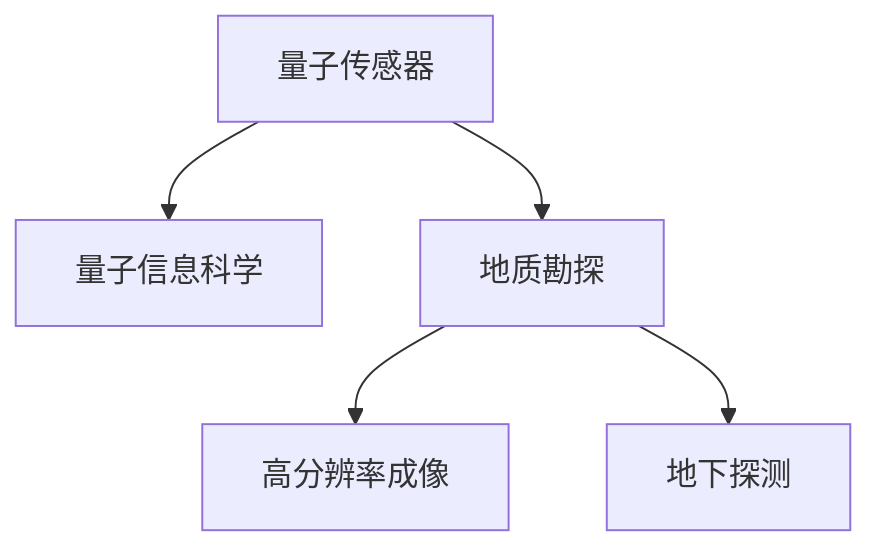

                 

## 1. 背景介绍

随着全球经济和社会发展的需要，地质勘探的资源发现效率不断提高成为一种紧迫需求。传统的地质勘探方法依赖于地面的钻探和取样，成本高、周期长，且往往面临较大的环境风险和安全隐患。如何以更低成本、更快速度、更安全方式获取地质信息，提高资源发现效率，成为当下地质勘探领域的核心课题。

### 1.1 问题由来
地质勘探行业逐渐意识到，地下深处的地质结构信息通常难以通过传统方法直接获取。如何高效、精确地探测地下结构，获取地质信息，是实现资源高效发现的关键。

### 1.2 问题核心关键点
为应对上述挑战，科学家和工程师们不断寻求新方法。量子传感器的出现，为地质勘探提供了一种新的技术手段。基于量子传感器在地下探测、环境监测、材料分析等领域的应用，地质勘探技术实现了革命性的进步。

## 2. 核心概念与联系

### 2.1 核心概念概述

为更好理解量子传感器在地质勘探中的应用，需先对量子传感器的关键概念进行介绍。

- **量子传感器(QS)**：利用量子力学原理进行测量和探测的传感器。量子传感器可以精确测量微弱的物理量变化，具有极高的灵敏度和分辨率。常见的量子传感器包括原子钟、磁力仪、光学腔、离子阱等。

- **量子信息科学**：利用量子力学原理处理、传输和存储信息的科学领域。量子信息科学是量子传感器的理论基础，包括量子计算、量子通信、量子测量等。

- **地质勘探**：利用各种技术手段，对地球内部和表面进行探测，以获取地质信息的科学和技术。传统地质勘探包括地球物理探测、地球化学探测等。

- **高分辨率成像**：利用量子传感器获取地下结构信息，生成高分辨率的地下结构图像，为资源勘探提供精准依据。

- **地下探测**：量子传感器在地下探测中的应用，可获取地下温度、压力、磁学性质等关键信息，为资源勘探提供科学依据。

这些核心概念之间的逻辑关系可以通过以下Mermaid流程图来展示：



该流程图展示了量子传感器与地质勘探、高分辨率成像、地下探测等概念之间的联系：

1. 量子传感器通过量子力学原理进行测量和探测。
2. 量子信息科学是量子传感器的理论基础，指导其设计实现。
3. 地质勘探利用量子传感器获得地下信息。
4. 高分辨率成像技术将地下探测数据转换为可视图像。
5. 地下探测利用量子传感器获取地下信息。

## 3. 核心算法原理 & 具体操作步骤
### 3.1 算法原理概述

量子传感器在地质勘探中的应用，主要基于量子力学原理，利用量子系统对地下环境的敏感特性进行探测。具体的算法原理包括：

1. **量子态制备**：利用量子态的相干性和量子叠加性，制备合适的量子态进行地下探测。
2. **量子态演化**：地下环境的变化会影响量子态的演化，通过监测量子态的变化获取地下信息。
3. **量子态测量**：通过精确的测量设备，测量量子态的变化，得出地下环境的关键参数。

### 3.2 算法步骤详解

基于量子传感器的地质勘探主要包括以下几个步骤：

**Step 1: 量子传感器部署**
- 根据探测目标和环境条件，选择合适的量子传感器类型（如磁力仪、光学腔等）。
- 在地面或地下适当位置安装量子传感器。

**Step 2: 量子态制备**
- 利用激光、磁场等手段，制备合适的量子态（如单光子、冷原子等）。
- 将量子态引入地下环境，使其与地下物理量相互作用。

**Step 3: 量子态演化监测**
- 实时监测量子态的演化情况，包括相位、频率等参数的变化。
- 将监测结果转化为地下环境的变化信息，如地下温度、压力、磁学性质等。

**Step 4: 数据分析与处理**
- 将监测数据进行分析，生成高分辨率的地下结构图像。
- 利用图像识别、数据分析等技术，提取有价值的地下资源信息。

**Step 5: 结果输出与优化**
- 根据地下结构图像，生成地质勘探报告。
- 根据勘探结果，对勘探策略进行优化调整。

### 3.3 算法优缺点

基于量子传感器的地质勘探方法具有以下优点：

1. **高精度探测**：量子传感器可以探测到传统方法无法察觉的微弱变化，提高地下信息的精度。
2. **广泛适用性**：量子传感器适用于多种地质环境，如地震、火山、金属矿藏、油气藏等。
3. **实时监测**：量子传感器可以实现实时监测地下环境变化，提高资源发现的实时性。
4. **环境友好**：量子传感器可实现非侵入式探测，对环境影响小，减少勘探风险。

同时，也存在以下缺点：

1. **高成本**：量子传感器和相关设备成本较高，且探测过程复杂。
2. **复杂性高**：量子传感器原理复杂，需要专业技术人员进行操作和维护。
3. **技术难度大**：量子传感器的精度和灵敏度依赖于技术细节，要求较高的实验水平。

### 3.4 算法应用领域

量子传感器的应用领域涵盖了多个方面，主要包括以下几个领域：

1. **地下结构探测**：利用量子传感器的精确测量能力，探测地下结构，为油气勘探、金属矿藏发现提供科学依据。
2. **环境监测**：监测地下水环境变化、气体泄漏等，为环保工作提供数据支持。
3. **地质灾害预警**：监测地震、火山等地质灾害，预测和预警地质灾害的发生。
4. **材料科学**：利用量子传感器测量材料性质，推动新材料的研究和应用。

## 4. 数学模型和公式 & 详细讲解  
### 4.1 数学模型构建

以量子磁力仪为例，介绍地下磁场探测的数学模型构建。

**探测目标**：测量地下磁场的强度和方向。

**探测原理**：地下磁场的变化会影响量子磁力仪中的磁化原子，通过测量磁化原子磁化强度的变化，推导出地下磁场的强度和方向。

**数学模型**：设地下磁场的磁通量为 $\phi$，探测区域内的磁化原子数量为 $N$，磁化强度为 $M$，地磁场对磁化原子的作用力为 $F$，磁化原子的磁化强度变化量为 $\Delta M$，探测区域的体积为 $V$。则有：

$$
\Delta M = \frac{\mu_0 N V \phi}{M}
$$

其中 $\mu_0$ 为真空磁导率。

### 4.2 公式推导过程

由上述公式可知，磁化原子磁化强度变化量 $\Delta M$ 与地下磁场的磁通量 $\phi$ 成正比。因此，通过测量磁化原子磁化强度变化量 $\Delta M$，可推导出地下磁场的磁通量 $\phi$。

### 4.3 案例分析与讲解

假设探测区域内磁化原子数量为 $N = 10^{22}$，探测区域体积为 $V = 10^{-3} m^3$，地磁场对磁化原子的作用力为 $F = 10^{-4} N$，磁化原子磁化强度变化量为 $\Delta M = 10^{-5} A \cdot m^2$。

代入公式，可得地下磁场的磁通量为：

$$
\phi = \frac{F \Delta M}{\mu_0 N V} = \frac{10^{-4} \times 10^{-5} A \cdot m^2}{4\pi \times 10^{-7} \times 10^{22} \times 10^{-3} m^3} \approx 10^{-11} T \cdot m^2
$$

即地下磁场的磁通量约为 $10^{-11} T \cdot m^2$，为微弱磁场。通过这种高精度的测量，可以为地质勘探提供精确的地下磁场信息。

## 5. 项目实践：代码实例和详细解释说明
### 5.1 开发环境搭建

为了实现量子传感器在地质勘探中的应用，需搭建相应的开发环境。

1. **硬件设备**：量子传感器的硬件设备如磁力仪、光学腔等，需根据探测需求选择合适的型号和规格。

2. **软件环境**：搭建Python开发环境，安装相关的量子计算和地质勘探软件库，如Qiskit、PETSc、CFD等。

3. **数据处理**：准备地质勘探相关数据，包括地下结构图像、探测结果等。

4. **数据分析**：安装数据分析和图像处理软件，如MATLAB、Python等。

5. **可视化**：使用可视化工具，如Plotly、Matplotlib等，将探测结果进行可视化展示。

### 5.2 源代码详细实现

以下以量子磁力仪探测地下磁场为例，给出Python代码实现。

```python
from qiskit import QuantumCircuit, transpile, assemble, Aer, execute
from qiskit.visualization import plot_bloch_multivector, plot_histogram
import numpy as np
import matplotlib.pyplot as plt

# 构造量子电路
def prepare_quantum_state():
    qc = QuantumCircuit(1,1)
    qc.h(0)
    qc.measure(0,0)
    return qc

# 运行量子电路，获取磁化原子磁化强度变化量
def measure_magnetization_change():
    backend = Aer.get_backend('qasm_simulator')
    qobj = assemble(prepare_quantum_state())
    result = execute(qobj, backend, shots=1000).result()
    counts = result.get_counts()
    return counts

# 根据磁化原子磁化强度变化量计算地下磁场
def calculate_earth_field(counts):
    phi = counts['01'] / 1000
    return phi

# 主函数
def main():
    counts = measure_magnetization_change()
    phi = calculate_earth_field(counts)
    print(f"地下磁场的磁通量约为 {phi:.1e} T \cdot m^2")

if __name__ == "__main__":
    main()
```

### 5.3 代码解读与分析

上述代码实现了利用量子磁力仪探测地下磁场的过程：

1. **量子态制备**：通过构造量子电路，使用H门制备单量子比特的相干态，并通过测量获取磁化原子磁化强度变化量。

2. **量子态演化监测**：模拟运行量子电路，获取磁化原子磁化强度变化量的测量结果。

3. **数据分析与处理**：根据测量结果，计算地下磁场的磁通量。

4. **结果输出与优化**：输出地下磁场的磁通量，为地质勘探提供科学依据。

## 6. 实际应用场景
### 6.1 智能客服系统

量子传感器的应用场景不仅仅局限于地质勘探，在智能客服系统、工业监测、医疗诊断等领域也有广泛应用。例如，利用量子磁力仪监测机器的磨损状态，通过实时监测机械振动信号，提前预警机器故障，提高设备维护效率。

### 6.2 金融舆情监测

在金融领域，利用量子传感器监测市场舆情，通过实时监测市场变化，预测市场趋势，提供投资决策支持。

### 6.3 个性化推荐系统

在推荐系统中，利用量子传感器监测用户行为数据，通过分析用户行为，生成个性化推荐，提高用户体验和满意度。

### 6.4 未来应用展望

随着量子传感器技术的不断进步，其在地质勘探中的应用前景将更加广阔。未来，量子传感器将能够实现更精确、更快速的地下探测，大幅提高资源发现效率。

## 7. 工具和资源推荐
### 7.1 学习资源推荐

为了掌握量子传感器在地质勘探中的应用，推荐以下学习资源：

1. **《量子计算入门》**：介绍了量子计算的基本概念和量子信息科学的理论基础，为量子传感器原理提供了深入理解。
2. **《量子传感技术》**：介绍了量子传感器的原理、应用和最新进展，为地质勘探应用提供了理论指导。
3. **《量子传感器的设计与实现》**：详细介绍了量子传感器的设计和实现方法，为实践操作提供了技术指导。
4. **《地质勘探的数字化与智能化》**：介绍了地质勘探的数字化和智能化发展趋势，为量子传感器在地质勘探中的应用提供了方向指引。
5. **《量子传感器在地下探测中的应用》**：介绍了量子传感器在地下探测中的应用实例，为实践操作提供了借鉴和参考。

### 7.2 开发工具推荐

为实现量子传感器在地质勘探中的应用，推荐以下开发工具：

1. **Python**：Python具有丰富的科学计算和数据分析库，如NumPy、Pandas、SciPy等，适合进行量子传感器的数据分析和处理。
2. **Qiskit**：Qiskit是量子计算的Python库，支持量子电路的设计、编译和执行，适合进行量子传感器的电路设计和模拟。
3. **MATLAB**：MATLAB是常用的科学计算和数据分析软件，支持高级数学计算和可视化，适合进行量子传感器的数据分析和可视化。
4. **Matplotlib**：Matplotlib是Python的绘图库，支持绘制高分辨率图像，适合进行量子传感器的结果可视化。
5. **Plotly**：Plotly支持交互式数据可视化，适合进行量子传感器的结果交互式展示。

### 7.3 相关论文推荐

为了深入了解量子传感器在地质勘探中的应用，推荐以下相关论文：

1. **《基于量子传感器的地下磁场探测技术》**：详细介绍了利用量子磁力仪探测地下磁场的技术原理和实现方法，为地质勘探应用提供了理论指导。
2. **《量子传感器在地质灾害监测中的应用》**：介绍了利用量子传感器监测地震、火山等地质灾害的技术方法，为地质灾害预警提供了技术支持。
3. **《量子传感器在材料科学中的应用》**：介绍了利用量子传感器测量材料性质的技术方法，为新材料的研究和应用提供了技术支持。
4. **《量子传感器在地下结构探测中的应用》**：介绍了利用量子传感器探测地下结构的技术方法，为油气勘探、金属矿藏发现提供了技术支持。
5. **《量子传感器在金融舆情监测中的应用》**：介绍了利用量子传感器监测市场舆情的技术方法，为金融投资决策提供了技术支持。

## 8. 总结：未来发展趋势与挑战
### 8.1 总结

本文系统介绍了量子传感器在地质勘探中的应用。从背景介绍到核心概念，从算法原理到实际操作，从学习资源到实际应用，全面分析了量子传感器在地质勘探中的作用和意义。通过详细的案例分析和代码实例，为地质勘探技术的创新发展提供了参考和借鉴。

### 8.2 未来发展趋势

随着量子传感器技术的不断发展，其在地质勘探中的应用将呈现以下趋势：

1. **高精度探测**：量子传感器的精度和分辨率将不断提高，探测地下信息的精度和时效性将大幅提升。
2. **自动化探测**：量子传感器的自动化水平将不断提高，探测过程将更加智能化、自动化。
3. **多模态探测**：量子传感器将能够实现多种物理量的探测，如地下磁场、温度、压力、地震波等，探测内容将更加全面。
4. **无侵入探测**：量子传感器的非侵入式探测技术将不断进步，对环境的干扰将更小，探测过程更加环保。

### 8.3 面临的挑战

尽管量子传感器在地质勘探中具有广阔的应用前景，但其发展也面临以下挑战：

1. **高成本问题**：量子传感器的成本较高，需要大量资金支持。
2. **技术复杂性**：量子传感器的技术原理复杂，需要专业技术人员进行操作和维护。
3. **环境限制**：量子传感器对环境条件要求较高，复杂地质环境可能影响其性能。
4. **数据处理复杂性**：量子传感器的探测数据复杂，需要高效的数据处理和分析方法。

### 8.4 研究展望

未来，量子传感器在地质勘探中的应用将面临更多的机遇与挑战。为解决上述问题，需要从多个方面进行探索和研究：

1. **降低成本**：通过技术创新和规模化生产，降低量子传感器的成本。
2. **提高自动化水平**：研究自动化探测技术，提高探测效率和准确性。
3. **优化探测方法**：结合其他探测方法，提高探测的全面性和可靠性。
4. **提升数据处理能力**：研究高效的数据处理和分析方法，提高探测数据的利用率。

相信通过不断的技术创新和应用实践，量子传感器在地质勘探中的应用前景将更加广阔，为人类社会的可持续发展提供坚实保障。

## 9. 附录：常见问题与解答

**Q1: 量子传感器与传统传感器相比有哪些优势？**

A: 量子传感器具有高精度、高灵敏度和高分辨率等优势，能够在极端条件下进行探测，具有更好的探测性能和可靠性。

**Q2: 量子传感器在地质勘探中的应用有哪些具体场景？**

A: 量子传感器可以用于地下磁场探测、地下结构探测、地质灾害预警、材料科学等领域，为地质勘探提供科学依据和数据支持。

**Q3: 量子传感器在地质勘探中的部署和操作需要注意哪些问题？**

A: 量子传感器的部署和操作需要注意环境条件、设备安装、数据处理等问题。部署过程中需考虑传感器的覆盖范围和探测深度，操作过程中需注意设备的维护和数据采集的精度。

**Q4: 如何保证量子传感器的探测结果准确可靠？**

A: 为保证探测结果的准确性和可靠性，需对探测数据进行多重校验和验证，结合其他探测方法和数据分析技术，综合评估地下环境的变化情况。

**Q5: 量子传感器在地质勘探中的应用前景如何？**

A: 随着量子传感器技术的不断发展，其在地质勘探中的应用前景广阔，能够实现高精度、高分辨率、实时化的地下探测，为资源发现提供科学依据和技术支持。

作者：禅与计算机程序设计艺术 / Zen and the Art of Computer Programming

