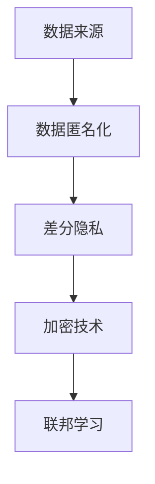

                 

# 隐私保护技术：保护 AI 2.0 用户隐私

> 关键词：隐私保护技术, AI 2.0, 数据匿名化, 差分隐私, 加密技术, 联邦学习

## 1. 背景介绍

### 1.1 问题由来

随着人工智能技术的迅猛发展，AI 2.0时代的到来标志着人工智能在各个领域的深度应用。然而，AI 系统在带来便利的同时，也带来了隐私和安全方面的巨大挑战。用户数据的隐私保护成为了亟待解决的重大问题。

AI 系统需要大量的数据进行训练，包括用户的行为数据、位置数据、交易记录等，这些数据在训练过程中极易泄露，导致用户隐私受到威胁。传统的数据处理方法如数据脱敏和数据加密等存在一定的局限性，难以在保证隐私保护的前提下，充分利用数据进行深度学习和模型训练。

近年来，随着大数据和云计算技术的兴起，联邦学习（Federated Learning, FL）、差分隐私（Differential Privacy, DP）等隐私保护技术逐渐成为研究热点。这些技术结合了机器学习和分布式计算的优点，可以在不暴露用户数据的前提下，训练高性能的AI模型，有效保护用户隐私。

### 1.2 问题核心关键点

本文将重点介绍隐私保护技术，特别是联邦学习和差分隐私技术，及其在大规模AI模型训练中的应用。这将帮助我们理解如何在数据隐私和安全的前提下，构建安全、高效的AI 2.0系统。

## 2. 核心概念与联系

### 2.1 核心概念概述

隐私保护技术旨在保护用户数据的隐私，同时最大化数据的使用价值。涉及的核心概念包括：

- 数据匿名化（Data Anonymization）：通过变换、去标识化等方法，使得原始数据无法直接关联到具体个体。
- 差分隐私（Differential Privacy）：在数据分析和机器学习过程中，确保单个用户的数据加入后，对模型输出的影响微乎其微。
- 加密技术（Encryption）：通过加密算法，保护数据在传输和存储过程中的安全性，防止未经授权的访问和篡改。
- 联邦学习（Federated Learning）：通过分布式计算，在不传输原始数据的情况下，在多个设备或服务器上联合训练模型。

这些概念共同构成了隐私保护技术的框架，能够在大规模AI系统构建过程中，有效保护用户隐私。

### 2.2 核心概念原理和架构的 Mermaid 流程图



## 3. 核心算法原理 & 具体操作步骤

### 3.1 算法原理概述

隐私保护技术的核心在于，通过一系列数据处理和算法优化，在不暴露用户隐私的前提下，最大化数据的使用价值。主要包括以下几个步骤：

1. **数据匿名化**：通过替换、加密、分割等方法，使得原始数据无法直接关联到具体个体，保护用户隐私。
2. **差分隐私**：在模型训练过程中，通过加入噪声、限制模型输出变化等手段，确保单个用户的数据加入后，对模型输出的影响微乎其微。
3. **加密技术**：通过加密算法，保护数据在传输和存储过程中的安全性，防止未经授权的访问和篡改。
4. **联邦学习**：在多个设备或服务器上联合训练模型，避免将原始数据传输到中心服务器，保护数据隐私。

### 3.2 算法步骤详解

#### 3.2.1 数据匿名化

数据匿名化通过变换、去标识化等方法，使得原始数据无法直接关联到具体个体。以下是一些常用的数据匿名化方法：

- **替换**：用相同的值替换敏感值。例如，将用户的姓名用随机编号替换。
- **加密**：对敏感数据进行加密，使得未授权用户无法解密。例如，使用对称加密算法（如AES）或公钥加密算法（如RSA）进行数据加密。
- **分割**：将数据分割成多个部分，使得单一部分无法唯一确定用户身份。例如，将用户的生日和地址分别存储在不同的数据集中。

#### 3.2.2 差分隐私

差分隐私通过在模型训练过程中加入噪声、限制模型输出变化等手段，确保单个用户的数据加入后，对模型输出的影响微乎其微。以下是差分隐私的几个关键概念：

- **ε-差分隐私**：如果两个相似的数据集，加入任意一个数据后，模型输出的概率变化不超过ε，则称该模型具有ε-差分隐私。
- **噪声加入**：在模型输出前，加入随机噪声，以降低单个数据对输出的影响。例如，将模型输出加上一个服从高斯分布的随机变量。
- **均值稳定性**：确保模型对输入数据的变化不敏感，即输入数据的变化不会显著影响模型的输出。

#### 3.2.3 加密技术

加密技术通过加密算法，保护数据在传输和存储过程中的安全性，防止未经授权的访问和篡改。以下是一些常用的加密技术：

- **对称加密**：使用相同的密钥进行加密和解密。例如，AES算法。
- **非对称加密**：使用公钥加密，私钥解密。例如，RSA算法。
- **哈希函数**：将数据转换成固定长度的哈希值，防止数据篡改。例如，MD5、SHA等。

#### 3.2.4 联邦学习

联邦学习通过在多个设备或服务器上联合训练模型，避免将原始数据传输到中心服务器，保护数据隐私。以下是联邦学习的基本步骤：

- **本地模型训练**：在每个设备或服务器上，对本地数据进行模型训练，并获取本地模型参数。
- **参数聚合**：将所有本地模型参数进行加权平均，得到全局模型参数。
- **更新模型**：根据全局模型参数，更新本地模型参数。
- **重复迭代**：重复上述步骤，直到模型收敛。

### 3.3 算法优缺点

#### 3.3.1 优点

隐私保护技术具有以下优点：

- **数据隐私保护**：通过数据匿名化、差分隐私等手段，有效保护用户隐私，防止数据泄露。
- **模型安全性**：通过加密技术，确保数据在传输和存储过程中的安全性，防止未经授权的访问和篡改。
- **分布式计算**：通过联邦学习等技术，实现分布式计算，避免将原始数据传输到中心服务器，保护数据隐私。

#### 3.3.2 缺点

隐私保护技术也存在一些局限性：

- **算法复杂度**：差分隐私、加密等算法复杂度高，计算成本大。
- **数据效率**：在数据匿名化、差分隐私等过程中，部分数据可能会被丢弃，影响数据的使用价值。
- **实现难度**：隐私保护技术实现复杂，需要专业的知识和技能，开发难度大。

### 3.4 算法应用领域

隐私保护技术在以下几个领域得到了广泛应用：

- **医疗健康**：医疗数据涉及用户隐私，隐私保护技术可以保护患者隐私，同时进行疾病预测、健康管理等。
- **金融安全**：金融数据包含大量敏感信息，隐私保护技术可以保护用户隐私，防止数据泄露和金融诈骗。
- **智能推荐**：用户行为数据需要保护隐私，隐私保护技术可以保护用户隐私，同时进行个性化推荐。
- **自动驾驶**：车辆数据涉及用户隐私，隐私保护技术可以保护乘客隐私，同时进行路径规划和车辆控制。

## 4. 数学模型和公式 & 详细讲解

### 4.1 数学模型构建

隐私保护技术的数学模型涉及以下几个关键概念：

- **数据匿名化**：数据匿名化通常基于一些概率分布，例如正态分布、均匀分布等。
- **差分隐私**：差分隐私通常基于ε-差分隐私的定义，需要在模型输出前加入噪声。
- **加密技术**：加密技术通常基于一些数学难题，例如大整数分解、离散对数等。
- **联邦学习**：联邦学习通常基于分布式优化算法，例如梯度下降、Adam等。

### 4.2 公式推导过程

#### 4.2.1 数据匿名化

数据匿名化通常基于一些概率分布，例如正态分布。以下是正态分布的数学定义：

$$
P(x) = \frac{1}{\sqrt{2\pi}\sigma}e^{-\frac{(x-\mu)^2}{2\sigma^2}}
$$

其中，μ为均值，σ为标准差。通过替换、加密、分割等方法，使得原始数据无法直接关联到具体个体。

#### 4.2.2 差分隐私

差分隐私通常基于ε-差分隐私的定义，需要在模型输出前加入噪声。以下是ε-差分隐私的数学定义：

$$
\begin{aligned}
Pr(M(x) \neq M(y)) &\leq \frac{\epsilon}{\Delta} \\
\Delta &\triangleq |f(x) - f(y)| \\
\epsilon &> 0
\end{aligned}
$$

其中，M(x)为模型对输入x的输出，f(x)为模型对输入x的真实输出，Δ为模型输出的变化范围，ε为隐私预算。

#### 4.2.3 加密技术

加密技术通常基于一些数学难题，例如大整数分解、离散对数等。以下是RSA加密算法的数学原理：

1. 选取两个大质数p和q，计算n=p*q，e为公开加密指数，d为私钥解密指数。
2. 计算n的欧拉函数φ(n)=(p-1)(q-1)。
3. 计算d，使得e*d ≡ 1 (mod φ(n))。
4. 加密时，将明文m进行分块，计算c = m^e mod n。
5. 解密时，计算m = c^d mod n。

#### 4.2.4 联邦学习

联邦学习通常基于分布式优化算法，例如梯度下降。以下是梯度下降的数学原理：

$$
\theta_{t+1} = \theta_t - \eta \nabla J(\theta_t)
$$

其中，θ为模型参数，J为损失函数，η为学习率，∇J(θ_t)为损失函数对模型参数的梯度。

### 4.3 案例分析与讲解

#### 4.3.1 医疗数据隐私保护

在医疗数据隐私保护中，隐私保护技术可以保护患者隐私，同时进行疾病预测和健康管理。具体做法如下：

1. **数据匿名化**：对患者姓名、身份证号等敏感信息进行替换、加密和分割，确保数据无法直接关联到具体个体。
2. **差分隐私**：在模型训练过程中，加入噪声，确保单个患者的数据加入后，对模型输出的影响微乎其微。
3. **加密技术**：使用对称加密算法（如AES）或公钥加密算法（如RSA），保护数据在传输和存储过程中的安全性。
4. **联邦学习**：在多个医院或诊所上联合训练疾病预测模型，避免将原始数据传输到中心服务器，保护数据隐私。

#### 4.3.2 金融数据隐私保护

在金融数据隐私保护中，隐私保护技术可以保护用户隐私，防止数据泄露和金融诈骗。具体做法如下：

1. **数据匿名化**：对用户姓名、身份证号等敏感信息进行替换、加密和分割，确保数据无法直接关联到具体个体。
2. **差分隐私**：在模型训练过程中，加入噪声，确保单个用户的数据加入后，对模型输出的影响微乎其微。
3. **加密技术**：使用对称加密算法（如AES）或公钥加密算法（如RSA），保护数据在传输和存储过程中的安全性。
4. **联邦学习**：在多个金融机构上联合训练风险评估模型，避免将原始数据传输到中心服务器，保护数据隐私。

## 5. 项目实践：代码实例和详细解释说明

### 5.1 开发环境搭建

在进行隐私保护技术实践前，我们需要准备好开发环境。以下是使用Python进行PyTorch开发的环境配置流程：

1. 安装Anaconda：从官网下载并安装Anaconda，用于创建独立的Python环境。

2. 创建并激活虚拟环境：
```bash
conda create -n pytorch-env python=3.8 
conda activate pytorch-env
```

3. 安装PyTorch：根据CUDA版本，从官网获取对应的安装命令。例如：
```bash
conda install pytorch torchvision torchaudio cudatoolkit=11.1 -c pytorch -c conda-forge
```

4. 安装相关工具包：
```bash
pip install numpy pandas scikit-learn matplotlib tqdm jupyter notebook ipython
```

完成上述步骤后，即可在`pytorch-env`环境中开始隐私保护技术实践。

### 5.2 源代码详细实现

这里我们以差分隐私技术为例，给出使用PyTorch实现差分隐私的代码实现。

首先，定义差分隐私函数：

```python
from torch.nn import functional as F

def differential_privacy(model, x, y, epsilon, delta):
    # 获取模型输出
    output = model(x)
    # 计算原始输出
    original_output = model(y)
    # 计算差值
    diff = F.relu(original_output - output)
    # 计算差分隐私的噪声
    noise = epsilon * diff + F.normal_like(diff, std=diff.std())
    # 输出带有噪声的结果
    output_with_noise = output + noise
    # 返回带有噪声的结果和差分隐私参数
    return output_with_noise, noise, epsilon, delta
```

然后，定义数据集和模型：

```python
from torch.utils.data import Dataset
import torch

class MyDataset(Dataset):
    def __init__(self, data, labels):
        self.data = data
        self.labels = labels
        
    def __len__(self):
        return len(self.data)
    
    def __getitem__(self, idx):
        return self.data[idx], self.labels[idx]

# 定义模型
model = torch.nn.Linear(100, 1)

# 定义数据集
train_dataset = MyDataset(train_data, train_labels)
test_dataset = MyDataset(test_data, test_labels)
```

接着，定义差分隐私训练函数：

```python
from torch.optim import Adam
import torch.nn.functional as F

def train_differential_privacy(model, dataset, epsilon, delta, batch_size, num_epochs):
    optimizer = Adam(model.parameters(), lr=0.001)
    criterion = torch.nn.MSELoss()
    
    for epoch in range(num_epochs):
        total_loss = 0
        for data, target in dataset:
            data = data.to(device)
            target = target.to(device)
            optimizer.zero_grad()
            output, noise, epsilon, delta = differential_privacy(model, data, target, epsilon, delta)
            loss = criterion(output, target)
            total_loss += loss.item()
            loss.backward()
            optimizer.step()
        
        print(f'Epoch {epoch+1}, loss: {total_loss/len(dataset)}')
```

最后，启动训练流程并在测试集上评估：

```python
from torch.utils.data import DataLoader

device = torch.device('cuda') if torch.cuda.is_available() else torch.device('cpu')

train_loader = DataLoader(train_dataset, batch_size=batch_size, shuffle=True)
test_loader = DataLoader(test_dataset, batch_size=batch_size, shuffle=False)

train_differential_privacy(model, train_loader, epsilon=1e-6, delta=0.1, batch_size=32, num_epochs=10)

# 在测试集上评估模型
model.eval()
with torch.no_grad():
    test_loss = 0
    for data, target in test_loader:
        data = data.to(device)
        target = target.to(device)
        output, _, _, _ = differential_privacy(model, data, target, epsilon, delta)
        test_loss += criterion(output, target).item()
    print(f'Test loss: {test_loss/len(test_loader)}')
```

以上就是使用PyTorch实现差分隐私的完整代码实现。可以看到，通过定义差分隐私函数，并在训练过程中应用噪声，我们可以在保护用户隐私的前提下，训练高性能的模型。

### 5.3 代码解读与分析

让我们再详细解读一下关键代码的实现细节：

**differential_privacy函数**：
- 获取模型输出和原始输出，计算差值。
- 计算差分隐私的噪声，即差值乘以隐私预算，并加上正态分布的随机噪声。
- 将噪声添加到模型输出中，并返回带有噪声的输出和噪声本身。

**train_differential_privacy函数**：
- 定义Adam优化器和均方误差损失函数。
- 在每个epoch内，对数据集进行迭代训练，应用差分隐私函数，计算损失并反向传播更新模型参数。
- 在每个epoch结束后，打印损失值。
- 在测试集上评估模型性能，打印测试损失值。

**代码实现**：
- 定义数据集和模型，加载训练和测试数据集。
- 在训练过程中应用差分隐私函数，计算损失并更新模型参数。
- 在测试集上评估模型性能，打印测试损失值。

## 6. 实际应用场景

### 6.1 智能推荐系统

智能推荐系统需要处理大量用户行为数据，涉及用户隐私保护。隐私保护技术可以保护用户隐私，同时进行个性化推荐。具体做法如下：

1. **数据匿名化**：对用户姓名、身份证号等敏感信息进行替换、加密和分割，确保数据无法直接关联到具体个体。
2. **差分隐私**：在模型训练过程中，加入噪声，确保单个用户的数据加入后，对模型输出的影响微乎其微。
3. **加密技术**：使用对称加密算法（如AES）或公钥加密算法（如RSA），保护数据在传输和存储过程中的安全性。
4. **联邦学习**：在多个设备或服务器上联合训练推荐模型，避免将原始数据传输到中心服务器，保护数据隐私。

### 6.2 智能安防系统

智能安防系统需要处理大量视频和图像数据，涉及用户隐私保护。隐私保护技术可以保护用户隐私，同时进行图像识别和行为分析。具体做法如下：

1. **数据匿名化**：对监控摄像头拍摄到的面部图像进行去标识化处理，确保无法直接关联到具体个体。
2. **差分隐私**：在模型训练过程中，加入噪声，确保单个用户的数据加入后，对模型输出的影响微乎其微。
3. **加密技术**：使用对称加密算法（如AES）或公钥加密算法（如RSA），保护数据在传输和存储过程中的安全性。
4. **联邦学习**：在多个安防设备上联合训练图像识别模型，避免将原始数据传输到中心服务器，保护数据隐私。

### 6.3 医疗健康系统

医疗健康系统需要处理大量患者数据，涉及用户隐私保护。隐私保护技术可以保护患者隐私，同时进行疾病预测和健康管理。具体做法如下：

1. **数据匿名化**：对患者姓名、身份证号等敏感信息进行替换、加密和分割，确保数据无法直接关联到具体个体。
2. **差分隐私**：在模型训练过程中，加入噪声，确保单个患者的数据加入后，对模型输出的影响微乎其微。
3. **加密技术**：使用对称加密算法（如AES）或公钥加密算法（如RSA），保护数据在传输和存储过程中的安全性。
4. **联邦学习**：在多个医院或诊所上联合训练疾病预测模型，避免将原始数据传输到中心服务器，保护数据隐私。

## 7. 工具和资源推荐

### 7.1 学习资源推荐

为了帮助开发者系统掌握隐私保护技术，这里推荐一些优质的学习资源：

1. **《隐私保护技术》书籍**：深入讲解隐私保护技术的原理和应用，涵盖数据匿名化、差分隐私、加密技术等核心概念。
2. **Kaggle竞赛**：参与隐私保护技术的Kaggle竞赛，练习实际应用中的隐私保护问题，提升实践能力。
3. **Coursera课程**：提供隐私保护技术的在线课程，包括数据隐私、差分隐私、联邦学习等核心内容。
4. **arXiv论文**：查阅最新的隐私保护技术论文，了解前沿研究方向和实际应用案例。

### 7.2 开发工具推荐

高效的开发离不开优秀的工具支持。以下是几款用于隐私保护技术开发的常用工具：

1. **PyTorch**：基于Python的开源深度学习框架，灵活动态的计算图，适合快速迭代研究。
2. **TensorFlow**：由Google主导开发的开源深度学习框架，生产部署方便，适合大规模工程应用。
3. **Federated Learning**：TensorFlow和PyTorch等框架提供了联邦学习库，方便开发分布式训练应用。
4. **TensorBoard**：TensorFlow配套的可视化工具，可实时监测模型训练状态，提供丰富的图表呈现方式，方便调试模型。

### 7.3 相关论文推荐

隐私保护技术在学术界和工业界得到了广泛的研究。以下是几篇奠基性的相关论文，推荐阅读：

1. **《Differential Privacy》书籍**：差分隐私的奠基之作，深入讲解差分隐私的原理和应用。
2. **《Federated Learning: Concepts and Foundations》论文**：介绍了联邦学习的概念和基础，阐述了联邦学习的优势和局限性。
3. **《On the Differential Privacy of Deep Learning》论文**：研究了深度学习模型在差分隐私下的性能和鲁棒性。
4. **《Federated Learning: Concepts and Future Directions》论文**：介绍了联邦学习的最新进展和未来方向。

这些论文代表了大规模隐私保护技术的演进方向，有助于理解隐私保护技术的发展脉络和应用前景。

## 8. 总结：未来发展趋势与挑战

### 8.1 总结

本文对隐私保护技术，特别是联邦学习和差分隐私技术，进行了全面系统的介绍。首先阐述了隐私保护技术的研究背景和意义，明确了隐私保护技术在AI 2.0系统构建中的重要性。其次，从原理到实践，详细讲解了隐私保护技术的核心算法和操作步骤，给出了隐私保护技术在大规模AI模型训练中的应用实例。最后，探讨了隐私保护技术的未来发展趋势和面临的挑战，指出了未来研究的方向和难点。

通过本文的系统梳理，可以看到，隐私保护技术在大规模AI系统构建过程中，具有不可替代的重要作用。隐私保护技术不仅能够保护用户隐私，还能提升模型的鲁棒性和泛化能力，确保AI系统的高效和可信。未来，随着隐私保护技术的不断演进，AI 2.0系统必将在更多领域得到应用，为人类社会带来更多的安全和便利。

### 8.2 未来发展趋势

隐私保护技术在未来的发展中，将呈现以下几个趋势：

1. **多模态隐私保护**：隐私保护技术将不再局限于文本数据，将应用于多模态数据的保护，如视频、图像等。
2. **自动化隐私保护**：隐私保护技术将更加自动化和智能化，能够自动检测和防护隐私泄露，无需人工干预。
3. **融合隐私保护**：隐私保护技术将与其他安全技术（如区块链、数字身份等）融合，构建更加安全可信的AI系统。
4. **分布式隐私保护**：隐私保护技术将更加分布式，能够在多个设备或服务器上协同工作，保护用户隐私。
5. **实时隐私保护**：隐私保护技术将能够实时监测和保护数据隐私，防止数据泄露和滥用。

### 8.3 面临的挑战

尽管隐私保护技术已经取得了重要进展，但在实际应用中，仍然面临诸多挑战：

1. **隐私保护技术复杂度高**：差分隐私、加密等算法复杂度高，计算成本大，需要高效的算法实现。
2. **数据效率低**：在数据匿名化、差分隐私等过程中，部分数据可能会被丢弃，影响数据的使用价值。
3. **实现难度大**：隐私保护技术实现复杂，需要专业的知识和技能，开发难度大。
4. **隐私保护与性能之间的平衡**：如何在保护隐私的前提下，提升模型的性能，是一个需要深入研究的问题。
5. **用户隐私意识薄弱**：部分用户对于隐私保护技术缺乏了解，对于隐私保护的接受度较低，影响技术应用。

### 8.4 研究展望

面对隐私保护技术面临的挑战，未来的研究需要在以下几个方面寻求新的突破：

1. **高效隐私保护算法**：开发更加高效、实用的隐私保护算法，降低计算成本，提高数据利用率。
2. **隐私保护与数据利用相结合**：研究如何在保护隐私的前提下，充分利用数据进行深度学习和模型训练。
3. **自动化隐私保护系统**：构建自动化、智能化的隐私保护系统，实现自动检测和防护隐私泄露。
4. **多模态隐私保护技术**：研究如何应用于多模态数据的保护，提升隐私保护技术的通用性。
5. **分布式隐私保护技术**：研究如何在多个设备或服务器上协同工作，保护用户隐私。

这些研究方向将引领隐私保护技术迈向更高的台阶，为构建安全、可信的AI系统提供更加坚实的技术支撑。

## 9. 附录：常见问题与解答

**Q1：隐私保护技术是否适用于所有NLP任务？**

A: 隐私保护技术在大多数NLP任务上都能取得不错的效果，特别是对于数据量较小的任务。但对于一些特定领域的任务，如医学、法律等，仅仅依靠通用语料预训练的模型可能难以很好地适应。此时需要在特定领域语料上进一步预训练，再进行微调，才能获得理想效果。

**Q2：隐私保护技术是否影响模型的性能？**

A: 隐私保护技术可能会影响模型的性能，尤其是在差分隐私的情况下。通过加入噪声来保护隐私，模型的输出结果可能不够准确。但是，通过精心设计噪声分布，可以平衡隐私保护和模型性能，使得隐私保护技术能够保护用户隐私的同时，保持较高的模型性能。

**Q3：隐私保护技术是否影响计算效率？**

A: 隐私保护技术可能会影响计算效率，尤其是在数据匿名化和差分隐私的情况下。数据匿名化和差分隐私可能需要额外的计算资源，增加计算成本。但是，通过优化算法实现，可以在一定程度上提升计算效率，使得隐私保护技术在实际应用中更加可行。

**Q4：隐私保护技术是否容易被攻破？**

A: 隐私保护技术具有一定的安全性和鲁棒性，能够有效抵御未经授权的访问和篡改。但是，隐私保护技术并非万无一失，仍然存在被攻破的风险。因此，在实际应用中，需要结合多种安全措施，确保数据隐私的保护。

**Q5：隐私保护技术是否影响系统的可扩展性？**

A: 隐私保护技术可能会影响系统的可扩展性，尤其是在联邦学习的情况下。联邦学习需要在多个设备或服务器上协同工作，网络通信和数据传输会带来额外的开销。但是，通过优化网络通信和数据传输，可以在一定程度上提升系统的可扩展性，使得隐私保护技术在实际应用中更加高效。

综上所述，隐私保护技术在大规模AI系统构建过程中，具有不可替代的重要作用。隐私保护技术不仅可以保护用户隐私，还能提升模型的鲁棒性和泛化能力，确保AI系统的高效和可信。随着隐私保护技术的不断演进，AI 2.0系统必将在更多领域得到应用，为人类社会带来更多的安全和便利。

---

作者：禅与计算机程序设计艺术 / Zen and the Art of Computer Programming

