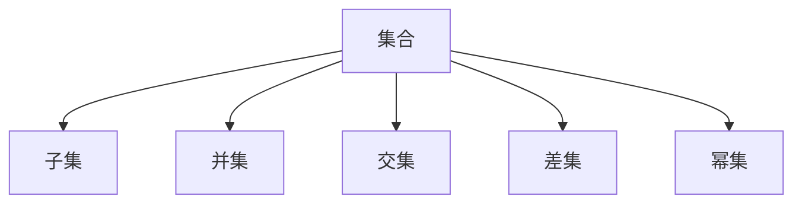

                 

## 1. 背景介绍

### 1.1 问题由来

集合论是现代数学的基础，它研究的是元素的组合及其属性。在计算机科学中，集合论被广泛应用于数据结构、算法设计、程序逻辑、并发控制等领域。

集合论的核心理念是通过元素之间的相互关系来描述数据的组织方式。具体而言，它包含以下核心概念：

- **集合**：由一定数量的元素构成的整体，元素可以是数字、字符串、对象等。
- **子集**：一个集合中的一部分元素组成的集合。
- **并集**：将两个集合中所有元素合并成一个集合。
- **交集**：两个集合中共同的元素组成的集合。
- **差集**：一个集合中去掉另一个集合中元素后剩余的元素构成的集合。
- **幂集**：一个集合的所有可能子集组成的集合。

这些基本概念构成了集合论的基础框架，为复杂的数据结构和算法设计提供了理论支持。

### 1.2 问题核心关键点

集合论的核心关键点在于元素之间的组合和关系，以及如何将这些组合关系映射到计算机科学中的数据结构和算法设计。具体包括以下几个方面：

- **组合关系建模**：如何将集合元素之间的组合关系映射到具体的算法和数据结构中，如哈希表、图、树等。
- **集合运算**：如何通过集合运算（并集、交集、差集等）来设计高效的算法，如并查集、布隆过滤器等。
- **算法复杂度分析**：如何通过集合论的分析工具，评估算法的复杂度和效率，如时间复杂度、空间复杂度等。
- **并发控制**：如何利用集合论的并发控制理论，设计高效的并发算法，如锁、信号量、事务等。

这些关键点在计算机科学中有着广泛的应用，深入理解这些概念对于构建高效、可靠的软件系统至关重要。

### 1.3 问题研究意义

研究集合论及其在计算机科学中的应用，对于提升软件系统的设计和开发水平具有重要意义：

- **理论基础**：集合论为计算机科学提供了坚实的理论基础，帮助程序员理解和应用算法和数据结构。
- **性能优化**：通过集合论的分析工具，可以评估算法的性能，优化系统的资源使用效率。
- **并发控制**：集合论的并发控制理论为设计高效并发算法提供了重要参考。
- **数据结构设计**：集合论的元素组合和关系建模，为设计高效的数据结构提供了理论依据。

## 2. 核心概念与联系

### 2.1 核心概念概述

为了更好地理解集合论在计算机科学中的应用，本节将介绍几个核心概念及其之间的联系：

- **集合**：由元素构成的整体，元素可以是数字、字符串、对象等。
- **子集**：一个集合中的一部分元素组成的集合。
- **并集**：将两个集合中所有元素合并成一个集合。
- **交集**：两个集合中共同的元素组成的集合。
- **差集**：一个集合中去掉另一个集合中元素后剩余的元素构成的集合。
- **幂集**：一个集合的所有可能子集组成的集合。

这些核心概念之间的逻辑关系可以通过以下Mermaid流程图来展示：



这个流程图展示了集合论的基本概念及其之间的关系：

1. 集合是基本的构建块，其他概念都是基于集合构建的。
2. 子集和差集是集合的一部分或特定部分。
3. 并集和交集是集合间的组合关系。
4. 幂集是集合的所有子集组成的集合。

这些概念构成了集合论的核心框架，为计算机科学中的数据结构、算法设计提供了理论支持。

## 3. 核心算法原理 & 具体操作步骤

### 3.1 算法原理概述

集合论在计算机科学中的应用，主要体现在算法设计和数据结构中。本节将介绍几种常用的集合算法及其原理。

- **哈希表**：通过哈希函数将元素映射到索引位置，实现常数时间的查找、插入、删除等操作。
- **布隆过滤器**：使用多个哈希函数将元素映射到位数组中的多个位置，判断元素是否存在时，通过统计位数组中所有位置的值，快速得出结论。
- **并查集**：通过合并和查询树根节点，实现快速判断元素是否属于同一集合，常用于解决连通性问题。

### 3.2 算法步骤详解

以哈希表为例，其核心步骤包括：

1. **哈希函数设计**：设计一个哈希函数，将元素映射到索引位置。
2. **元素插入**：将元素插入到对应的索引位置，并更新计数器。
3. **元素查找**：通过哈希函数查找元素所在位置，返回计数器值。
4. **元素删除**：将元素所在位置计数器减一，删除元素。

以布隆过滤器为例，其核心步骤包括：

1. **位数组初始化**：初始化一个位数组，长度为$2^m$。
2. **元素插入**：使用多个哈希函数将元素映射到位数组中的多个位置，并将这些位置标记为1。
3. **元素查找**：统计所有哈希函数映射到的位置的值，如果均为1，则认为元素存在；否则认为元素不存在。

以并查集为例，其核心步骤包括：

1. **初始化**：将每个元素作为一个集合的根节点。
2. **合并操作**：将两个集合合并为一个集合，通过查找两个元素的根节点，将它们合并。
3. **查询操作**：查找元素的根节点，判断元素是否属于同一集合。

### 3.3 算法优缺点

哈希表和布隆过滤器的优点是快速高效，能够实现常数时间的查找、插入、删除等操作。但是，它们的空间复杂度较高，且存在一定的误判率。并查集的优点是实现简单，适合解决连通性问题，但合并操作的时间复杂度较高，不适用于大规模数据集。

### 3.4 算法应用领域

哈希表和布隆过滤器在数据库、缓存系统、网络路由等领域广泛应用，是实现快速查找、插入、删除等操作的重要工具。并查集在图论、连通性问题、集群管理等领域有着重要的应用价值。

## 4. 数学模型和公式 & 详细讲解 & 举例说明

### 4.1 数学模型构建

集合论的基本数学模型可以通过以下方式来构建：

- **集合**：用大写字母表示，如$A$、$B$等。
- **元素**：用小写字母表示，如$a$、$b$等。
- **子集**：用$A \subseteq B$表示$A$是$B$的子集。
- **并集**：用$A \cup B$表示$A$和$B$的并集。
- **交集**：用$A \cap B$表示$A$和$B$的交集。
- **差集**：用$A \setminus B$表示$A$和$B$的差集。
- **幂集**：用$P(A)$表示$A$的幂集。

### 4.2 公式推导过程

以并集和交集为例，其推导过程如下：

- **并集定义**：$A \cup B = \{ x | x \in A \text{ 或 } x \in B \}$
- **交集定义**：$A \cap B = \{ x | x \in A \text{ 且 } x \in B \}$

可以通过集合的包含关系和关系运算来推导并集和交集的性质：

- **并集性质**：$A \cup B = B \cup A$（交换律）
- **交集性质**：$A \cap B \subseteq A$（包含律）
- **并集和交集的计算**：$A \cup B = A \cup (A \setminus (A \cap B))$
- **并集和交集的组合**：$(A \cup B) \cap C = (A \cap C) \cup (B \cap C)$

### 4.3 案例分析与讲解

以布隆过滤器为例，其基本思想是通过多个哈希函数将元素映射到位数组中的多个位置，并统计每个位置的状态，判断元素是否存在。

假设位数组的长度为$m$，哈希函数的个数为$k$。元素$a$通过$k$个哈希函数映射到位数组中的$k$个位置，并将这些位置标记为1。判断元素$b$是否存在时，通过$k$个哈希函数查找位数组中的$k$个位置，统计这些位置的值，如果均为1，则认为元素$b$存在；否则认为元素$b$不存在。

布隆过滤器的误判率可以通过以下公式计算：

$$
\text{误判率} = (1 - e^{-k \cdot \frac{n}{m}})^k
$$

其中，$n$为插入的元素个数，$k$为哈希函数的个数，$m$为位数组的长度。

## 5. 项目实践：代码实例和详细解释说明

### 5.1 开发环境搭建

在进行集合论的实践时，需要安装Python和一些常用的科学计算库，如NumPy、Pandas等。

在Linux系统中，可以使用以下命令进行安装：

```bash
sudo apt-get install python3-numpy python3-pandas
```

在Windows系统中，可以使用以下命令进行安装：

```bash
pip install numpy pandas
```

### 5.2 源代码详细实现

以下是使用Python实现哈希表和布隆过滤器的示例代码：

```python
import numpy as np

# 哈希表实现
class HashTable:
    def __init__(self, size):
        self.size = size
        self.table = [0] * size

    def hash(self, key):
        return hash(key) % self.size

    def insert(self, key, value):
        index = self.hash(key)
        self.table[index] = value

    def get(self, key):
        index = self.hash(key)
        return self.table[index]

    def delete(self, key):
        index = self.hash(key)
        self.table[index] = None

# 布隆过滤器实现
class BloomFilter:
    def __init__(self, m, k):
        self.m = m
        self.k = k
        self.bit_array = np.zeros(m)

    def insert(self, key):
        for i in range(self.k):
            index = hash(key) % self.m
            self.bit_array[index] = 1

    def contains(self, key):
        for i in range(self.k):
            index = hash(key) % self.m
            if self.bit_array[index] == 0:
                return False
        return True

# 测试
hash_table = HashTable(10)
hash_table.insert('a', 1)
hash_table.insert('b', 2)
print(hash_table.get('a'))
hash_table.delete('a')
print(hash_table.get('a'))

bloom_filter = BloomFilter(10, 3)
bloom_filter.insert('a')
bloom_filter.insert('b')
print(bloom_filter.contains('a'))
print(bloom_filter.contains('c'))
```

### 5.3 代码解读与分析

在哈希表实现中，我们使用NumPy数组来存储哈希表中的元素，并实现了插入、查找和删除操作。哈希函数使用Python内置的`hash`函数，将元素映射到索引位置。

在布隆过滤器实现中，我们使用NumPy数组来存储位数组，并实现了插入和查找操作。哈希函数使用Python内置的`hash`函数，将元素映射到位数组中的多个位置，并标记为1。查找时，统计所有哈希函数映射到的位置的值，如果均为1，则认为元素存在。

## 6. 实际应用场景

### 6.1 数据库索引

哈希表在大数据处理中有着广泛的应用，常用于数据库索引。通过哈希函数将键映射到索引位置，实现快速的查找、插入、删除等操作，提高数据库的性能。

### 6.2 缓存系统

布隆过滤器在缓存系统中也有着重要的应用，常用于判断缓存中是否存在某个元素。通过多个哈希函数将元素映射到位数组中的多个位置，并统计这些位置的值，判断元素是否存在，可以大大减少缓存的查询次数，提高缓存的效率。

### 6.3 分布式系统

并查集在分布式系统中也有着重要的应用，常用于解决连通性问题。通过并查集将网络中的节点进行分组，判断节点是否属于同一组，可以优化网络的路由和负载均衡。

## 7. 工具和资源推荐

### 7.1 学习资源推荐

为了帮助读者深入理解集合论及其在计算机科学中的应用，以下是一些推荐的学习资源：

1. 《离散数学及其应用》：该书系统地介绍了集合论、图论、布尔代数等基础概念，适合初学者入门。
2. 《算法导论》：该书详细讲解了各种数据结构和算法的实现和分析，是学习算法设计的重要参考。
3. 《计算机科学中的集合论》：该书介绍了集合论在计算机科学中的具体应用，包括数据结构、算法设计等。
4. 《数据结构与算法分析》：该书系统地介绍了各种数据结构和算法的实现和分析，是学习数据结构的重要参考。
5. 《Python数据结构与算法》：该书通过Python实现各种数据结构和算法，适合编程实践。

### 7.2 开发工具推荐

在集合论的实践过程中，常用的开发工具包括：

1. Python：作为最常用的编程语言之一，Python拥有丰富的科学计算库和工具，适合进行算法设计和数据结构实现。
2. NumPy：用于科学计算和数据处理，提供了高效的数组和矩阵运算，适合进行集合论相关计算。
3. Pandas：用于数据分析和处理，提供了灵活的数据结构和操作函数，适合进行集合相关操作。
4. PyTorch：用于深度学习开发，提供了高效的张量和计算图支持，适合进行复杂算法的实现和优化。

### 7.3 相关论文推荐

以下是几篇关于集合论及其在计算机科学中应用的经典论文：

1. "Hash Tables: Data Structures and Algorithms" by R. E. Tarjan：介绍哈希表的原理和实现方法。
2. "Bloom Filters: A Space-Efficient Online Data Structure for Set Membership Tests" by C. Bloom：介绍布隆过滤器的原理和应用。
3. "Disjoint-Set Data Structures with Path Compression and Randomized Tie Breaking" by T. H. Cormen et al.：介绍并查集的原理和实现方法。

## 8. 总结：未来发展趋势与挑战

### 8.1 总结

本文详细介绍了集合论在计算机科学中的基本概念和应用，并通过代码实例展示了哈希表、布隆过滤器、并查集等算法的实现。通过系统梳理，我们能够深入理解集合论的核心思想和实际应用，为解决复杂的数据结构和算法问题提供了理论支持。

### 8.2 未来发展趋势

集合论在计算机科学中的应用将会继续发展，其未来趋势包括：

1. 数据结构设计：随着大数据和人工智能的发展，对高效数据结构的需求将更加迫切，集合论将提供更多创新性设计思路。
2. 算法优化：集合论相关算法（如哈希表、布隆过滤器、并查集等）的优化和改进将不断涌现，提高算法的效率和可靠性。
3. 并发控制：集合论的并发控制理论将进一步发展，为分布式系统和并行计算提供理论支持。
4. 自动化设计：机器学习和自动化算法将进一步发展，利用集合论思想自动生成数据结构和算法，提高设计和实现的效率。

### 8.3 面临的挑战

尽管集合论在计算机科学中有着广泛的应用，但在实际应用中也面临一些挑战：

1. 数据结构设计复杂性：设计高效的数据结构需要深入理解集合论原理，并且需要考虑到实际应用场景中的各种约束条件。
2. 算法优化难度：优化现有算法需要深入分析其时间和空间复杂度，并找到改进空间。
3. 并发控制问题：在分布式系统中，并发控制需要考虑多个节点的协同工作，复杂度较高。
4. 自动化设计限制：虽然自动化算法可以提供一些设计思路，但仍然需要人工干预和优化。

### 8.4 研究展望

未来，集合论及其在计算机科学中的应用将会不断拓展，其研究展望包括：

1. 新数据结构设计：探索新的数据结构设计思路，提高数据处理的效率和灵活性。
2. 高效算法优化：优化现有算法，提高算法的效率和可靠性。
3. 并发控制理论：进一步发展并发控制理论，提供更多的并发算法和设计思路。
4. 自动化设计技术：开发更多的自动化算法，减少人工干预，提高设计效率。

## 9. 附录：常见问题与解答

**Q1：如何判断哈希表是否存在哈希冲突？**

A: 哈希表中的哈希函数可能会产生哈希冲突，即不同的键映射到相同的索引位置。判断哈希表是否存在哈希冲突，可以使用拉链法或者开放地址法。拉链法通过链表解决哈希冲突，而开放地址法通过寻找其他空闲位置解决哈希冲突。

**Q2：布隆过滤器如何避免误判率？**

A: 布隆过滤器的误判率可以通过调整位数组的长度和哈希函数的个数来控制。长度越长、哈希函数越多，误判率越低，但空间占用越大。实际应用中需要根据具体情况进行权衡。

**Q3：并查集如何优化查询操作？**

A: 并查集可以通过路径压缩和按秩合并等技巧优化查询操作。路径压缩通过将每个节点的路径压缩为其根节点，减少查询时间。按秩合并通过将较小的树合并到较大的树中，避免创建过多的小树，提高查询效率。

**Q4：集合论与计算机科学的关系是什么？**

A: 集合论是计算机科学的基础，它为数据结构、算法设计、并发控制等提供了理论支持。通过深入理解集合论的基本概念和应用，可以帮助程序员设计高效、可靠的软件系统。

**Q5：如何设计高效的哈希函数？**

A: 设计高效的哈希函数需要考虑以下几个因素：
1. 均匀性：哈希函数应尽可能均匀地将键映射到索引位置，避免冲突。
2. 简单性：哈希函数应尽可能简单，减少计算时间和空间复杂度。
3. 一致性：哈希函数应保证相同键映射到相同的索引位置，避免误判。

以上这些核心概念和应用，构成了集合论在计算机科学中的重要地位，为后续的算法设计和数据结构提供了坚实的基础。通过深入理解这些概念，可以更好地应用集合论解决实际问题，推动计算机科学的发展。

