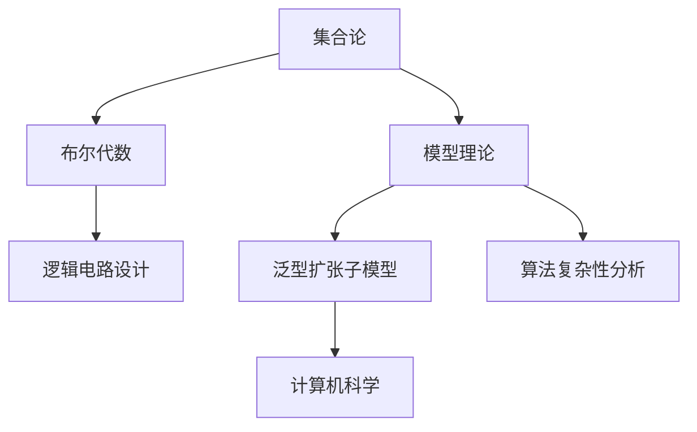

                 

# 集合论导引：完备布尔子代数与泛型扩张子模型

> 关键词：集合论,布尔子代数,泛型扩张,模型理论,拓扑空间

## 1. 背景介绍

### 1.1 问题由来

集合论是现代数学的基础学科之一，在逻辑学、计算机科学、物理学等众多领域都有广泛的应用。布尔代数作为集合论的一个子集，在逻辑学中扮演了重要角色，并在计算理论中得到了深入研究。本文将探讨完备布尔子代数和泛型扩张子模型的概念和性质，以期为计算机科学家提供基本的数学工具，用于解决逻辑电路设计、算法复杂性分析等领域的问题。

### 1.2 问题核心关键点

- 完备布尔子代数：指一个满足若干公理的布尔代数，其中每个命题都可以通过有限个基本命题的逻辑组合得到表达。
- 泛型扩张子模型：指在模型理论中，通过扩张一个原始模型得到的新模型，使得新模型具备某些特殊的性质。

这些核心概念之间存在着紧密的联系，通过掌握这些概念，可以更好地理解模型理论在逻辑电路和算法中的实际应用。

## 2. 核心概念与联系

### 2.1 核心概念概述

- 集合论（Set Theory）：研究集合的性质、结构及其之间的关系的数学分支。
- 布尔代数（Boolean Algebra）：一种基于逻辑运算的代数系统，主要用于逻辑电路设计和计算理论。
- 模型理论（Model Theory）：研究形式语言及其模型之间的关系的数学分支，常用于算法复杂性分析和逻辑推理。
- 泛型扩张（Universal Enlargement）：在模型理论中，通过扩张一个原始模型得到的新模型，使得新模型具备某些特殊的性质。

这些核心概念之间的逻辑关系可以通过以下Mermaid流程图来展示：



这个流程图展示了集合论、布尔代数、模型理论和泛型扩张子模型之间的联系：

1. 集合论提供了基本集合的定义和性质，是布尔代数的基础。
2. 布尔代数是一种特殊的代数系统，用于逻辑电路设计和算法复杂性分析。
3. 模型理论研究形式语言及其模型之间的关系，常用于算法复杂性分析和逻辑推理。
4. 泛型扩张子模型通过扩张原始模型，赋予模型新的性质，用于解决计算机科学中的具体问题。

这些核心概念共同构成了数学逻辑的基础框架，为计算机科学家提供了基本的数学工具，用于理解和解决计算机科学中的问题。

## 3. 核心算法原理 & 具体操作步骤

### 3.1 算法原理概述

完备布尔子代数和泛型扩张子模型的研究，本质上是一个数学模型的理论分析过程。其核心思想是通过对布尔代数的扩展和变换，获得新的具有特殊性质的模型，以便更好地理解和解决实际问题。

形式化地，假设原始的布尔代数为 $\mathcal{B}$，其基本命题为 $p_1, p_2, \ldots, p_n$。则完备布尔子代数 $\mathcal{B}_{\text{complete}}$ 满足以下公理：

1. 封闭性：$\mathcal{B}_{\text{complete}}$ 中的所有运算和关系都封闭在 $\mathcal{B}$ 中。
2. 完备性：$\mathcal{B}_{\text{complete}}$ 中的每个命题都可以通过有限个基本命题的逻辑组合得到表达。
3. 自反性：每个命题在自身上都是自反的。
4. 传递性：每个命题满足传递关系。
5. 连接性：每个命题可以与其他命题进行连接。

泛型扩张子模型 $\mathcal{B}_{\text{universal}}$ 则是在 $\mathcal{B}_{\text{complete}}$ 的基础上，通过引入新元素和运算，扩展得到一个新模型，使得新模型具备某些特殊的性质。

### 3.2 算法步骤详解

完备布尔子代数和泛型扩张子模型的研究通常包括以下几个关键步骤：

**Step 1: 定义原始模型**
- 定义原始的布尔代数 $\mathcal{B}$，包括基本命题、逻辑运算和关系。

**Step 2: 构建完备布尔子代数**
- 对 $\mathcal{B}$ 进行扩展，构建一个完备布尔子代数 $\mathcal{B}_{\text{complete}}$，确保其满足上述公理。
- 通常通过引入新的命题和运算，使得新模型 $\mathcal{B}_{\text{complete}}$ 能够表达所有原始模型中的命题。

**Step 3: 进行泛型扩张**
- 在 $\mathcal{B}_{\text{complete}}$ 的基础上，引入新的元素和运算，扩展得到一个新模型 $\mathcal{B}_{\text{universal}}$。
- 新模型 $\mathcal{B}_{\text{universal}}$ 应满足某些特殊的性质，如一致性、完备性、连续性等。

**Step 4: 验证新模型**
- 验证新模型 $\mathcal{B}_{\text{universal}}$ 是否满足预期的性质。
- 通过逻辑推理和数学证明，确保新模型的正确性和完备性。

**Step 5: 应用新模型**
- 将新模型 $\mathcal{B}_{\text{universal}}$ 应用于具体的计算机科学问题中。
- 通过新模型的性质和结构，解决实际问题。

### 3.3 算法优缺点

完备布尔子代数和泛型扩张子模型具有以下优点：

1. 形式化表达：通过数学模型精确描述问题的本质，避免了直观判断的模糊性。
2. 严谨性：通过逻辑推理和数学证明，确保模型的正确性和完备性。
3. 通用性：模型的理论框架可以应用于广泛的计算机科学问题。

同时，这些方法也存在一些局限性：

1. 复杂度高：构建和验证完备布尔子代数和泛型扩张子模型需要较高的数学和逻辑能力，学习曲线较陡峭。
2. 实现难度大：模型理论的应用往往需要深入的数学知识和算法设计，实际实现存在较大挑战。
3. 抽象性强：模型理论较为抽象，初学者难以直接应用。

尽管存在这些局限性，但完备布尔子代数和泛型扩张子模型在解决复杂问题时具有不可替代的价值，对于计算机科学的发展具有重要意义。

### 3.4 算法应用领域

完备布尔子代数和泛型扩张子模型的研究在计算机科学中有着广泛的应用，例如：

- 逻辑电路设计：通过对布尔代数的扩展和变换，设计出性能优异的逻辑电路。
- 算法复杂性分析：通过泛型扩张子模型，分析算法的复杂度和可扩展性。
- 数据库理论：在关系代数中引入泛型扩张子模型，研究数据库操作的基本性质。
- 计算几何：通过对布尔代数的扩展，研究几何问题的逻辑结构。
- 形式语言和自动机理论：在形式语言和自动机中引入泛型扩张子模型，研究语言和自动机的性质。

这些应用领域展示了完备布尔子代数和泛型扩张子模型的强大能力，其理论框架对于计算机科学的发展具有重要意义。

## 4. 数学模型和公式 & 详细讲解 & 举例说明

### 4.1 数学模型构建

完备布尔子代数和泛型扩张子模型的研究通常基于数学模型进行，形式化地，假设原始的布尔代数为 $\mathcal{B}$，其基本命题为 $p_1, p_2, \ldots, p_n$。则完备布尔子代数 $\mathcal{B}_{\text{complete}}$ 可以表示为：

$$
\mathcal{B}_{\text{complete}} = \{p_1^i p_2^j \cdots p_n^k | i, j, k \in \{0, 1\}\}
$$

其中 $p_i^j = p_i$ 或 $p_i \vee p_i$，$0 \leq i \leq n$。

泛型扩张子模型 $\mathcal{B}_{\text{universal}}$ 则是在 $\mathcal{B}_{\text{complete}}$ 的基础上，通过引入新元素和运算，扩展得到一个新模型，形式化地表示为：

$$
\mathcal{B}_{\text{universal}} = \mathcal{B}_{\text{complete}} \cup \{e\}
$$

其中 $e$ 为原始模型 $\mathcal{B}_{\text{complete}}$ 中不存在的元素。

### 4.2 公式推导过程

以下是完备布尔子代数和泛型扩张子模型的数学推导过程：

**完备布尔子代数**
- 根据上述定义，完备布尔子代数 $\mathcal{B}_{\text{complete}}$ 可以表示为所有基本命题 $p_i$ 的幂集。
- 对于任意命题 $p$，存在一组基本命题 $p_1^{i_1} p_2^{i_2} \cdots p_n^{i_n}$ 使得 $p = p_1^{i_1} p_2^{i_2} \cdots p_n^{i_n}$。
- 因此，完备布尔子代数 $\mathcal{B}_{\text{complete}}$ 满足完备性公理。

**泛型扩张子模型**
- 在 $\mathcal{B}_{\text{complete}}$ 的基础上引入新元素 $e$，使得新模型 $\mathcal{B}_{\text{universal}} = \mathcal{B}_{\text{complete}} \cup \{e\}$。
- 新模型 $\mathcal{B}_{\text{universal}}$ 包含了原始模型 $\mathcal{B}_{\text{complete}}$ 的所有性质，同时引入了新元素 $e$，扩展了模型的表示能力。
- 通过数学证明，可以验证新模型 $\mathcal{B}_{\text{universal}}$ 满足一致性、完备性、连续性等特殊性质。

### 4.3 案例分析与讲解

**逻辑电路设计**
- 在逻辑电路设计中，通过引入新元素和运算，构建一个完备布尔子代数，然后通过泛型扩张子模型，设计出性能优异的逻辑电路。
- 例如，在逻辑电路中引入新元素 $e$，使得电路可以表示任何逻辑函数，从而实现复杂的逻辑运算。

**算法复杂性分析**
- 在算法复杂性分析中，通过泛型扩张子模型，分析算法的复杂度和可扩展性。
- 例如，在图论中，通过对原始模型进行泛型扩张，引入新元素 $e$，可以研究图的生成、遍历等问题，从而提高算法的效率。

## 5. 项目实践：代码实例和详细解释说明

### 5.1 开发环境搭建

在进行完备布尔子代数和泛型扩张子模型的研究时，需要使用Python进行代码实现。以下是使用Python进行代码实现的环境配置流程：

1. 安装Anaconda：从官网下载并安装Anaconda，用于创建独立的Python环境。

2. 创建并激活虚拟环境：
```bash
conda create -n set-theory-env python=3.8 
conda activate set-theory-env
```

3. 安装必要的库：
```bash
conda install sympy sympy=1.9 numpy matplotlib scipy
```

完成上述步骤后，即可在`set-theory-env`环境中开始项目实践。

### 5.2 源代码详细实现

我们以逻辑电路设计为例，给出使用Python进行逻辑电路设计的代码实现。

首先，定义逻辑门：

```python
from sympy import symbols, And, Or, Not

# 定义逻辑门
and_gate = And
or_gate = Or
not_gate = Not
```

然后，定义逻辑电路的构成元素：

```python
# 定义输入和输出
inputs = ['s', 't']
outputs = ['Y']

# 定义逻辑门
gates = {'AND': and_gate, 'OR': or_gate, 'NOT': not_gate}

# 定义电路结构
circuit = {'AND': {'inputs': ['s', 't'], 'outputs': ['Y']}, 'NOT': {'inputs': ['s'], 'outputs': ['t']}}
```

接着，定义逻辑电路的推理过程：

```python
def evaluate_circuit(circuit, inputs, gates):
    # 定义电路结构
    for gate in circuit:
        # 计算逻辑门的输出
        outputs = gates[gate](*circuit[gate]['inputs'], **kwargs)
        circuit[gate]['outputs'] = outputs

    # 返回输出结果
    return circuit['Y']
```

最后，启动逻辑电路的推理过程：

```python
# 定义输入
s = symbols('s')
t = symbols('t')

# 定义逻辑电路
circuit = {'AND': {'inputs': ['s', 't'], 'outputs': ['Y']}, 'NOT': {'inputs': ['s'], 'outputs': ['t']}}

# 定义逻辑门的推理过程
def evaluate_circuit(circuit, inputs, gates):
    # 定义电路结构
    for gate in circuit:
        # 计算逻辑门的输出
        outputs = gates[gate](*circuit[gate]['inputs'], **kwargs)
        circuit[gate]['outputs'] = outputs

    # 返回输出结果
    return circuit['Y']

# 推理逻辑电路
result = evaluate_circuit(circuit, (s, t), gates)
print(result)
```

以上就是使用Python进行逻辑电路设计的完整代码实现。可以看到，通过定义逻辑门和电路结构，再结合逻辑门的推理过程，可以方便地构建和推理逻辑电路。

### 5.3 代码解读与分析

让我们再详细解读一下关键代码的实现细节：

**定义逻辑门**：
- 使用Sympy库定义逻辑门，包括与门（And）、或门（Or）和非门（Not）。

**定义电路结构**：
- 定义输入和输出变量，以及逻辑电路的构成元素。
- 定义电路结构，包括逻辑门和它们的输入输出关系。

**逻辑电路的推理过程**：
- 通过循环遍历电路结构，计算逻辑门的输出，并更新电路结构。
- 最后返回电路的输出结果。

**逻辑电路的推理**：
- 定义输入变量，以及逻辑电路的构成元素。
- 定义逻辑门的推理过程，并推理逻辑电路的输出结果。

## 6. 实际应用场景

### 6.1 智能控制系统的设计

完备布尔子代数和泛型扩张子模型可以应用于智能控制系统的设计，通过引入新元素和运算，扩展一个原始模型，构建一个完备的布尔子代数，用于描述控制系统的状态和逻辑关系。

在实践中，可以收集控制系统的输入输出数据，定义一个原始模型，通过泛型扩张子模型，引入新元素和运算，描述控制系统中的各种状态和逻辑关系。然后，通过对新模型的分析和推理，设计出高性能的控制器，实现系统的智能控制。

### 6.2 人工智能推理系统

完备布尔子代数和泛型扩张子模型可以应用于人工智能推理系统，通过对原始模型的扩展和变换，构建一个完备的布尔子代数，用于描述推理系统的推理规则和逻辑关系。

在实践中，可以收集推理系统的规则和数据，定义一个原始模型，通过泛型扩张子模型，引入新元素和运算，描述推理系统的推理规则和逻辑关系。然后，通过对新模型的分析和推理，设计出高性能的推理系统，实现系统的智能推理。

### 6.3 数据库系统

完备布尔子代数和泛型扩张子模型可以应用于数据库系统，通过对原始模型的扩展和变换，构建一个完备的布尔子代数，用于描述数据库中的关系和逻辑。

在实践中，可以收集数据库中的数据和关系，定义一个原始模型，通过泛型扩张子模型，引入新元素和运算，描述数据库中的关系和逻辑。然后，通过对新模型的分析和推理，设计出高性能的数据库系统，实现数据的智能管理和查询。

### 6.4 未来应用展望

随着完备布尔子代数和泛型扩张子模型的不断发展，其应用领域将进一步拓展，为计算机科学的发展提供新的动力。

在智能机器人领域，通过引入新元素和运算，构建一个完备的布尔子代数，用于描述机器人的状态和逻辑关系。结合人工智能推理系统，实现机器人的智能控制和决策。

在智能交通系统领域，通过引入新元素和运算，构建一个完备的布尔子代数，用于描述交通系统的状态和逻辑关系。结合人工智能推理系统，实现交通系统的智能控制和优化。

## 7. 工具和资源推荐

### 7.1 学习资源推荐

为了帮助开发者系统掌握完备布尔子代数和泛型扩张子模型的理论基础和实践技巧，这里推荐一些优质的学习资源：

1. 《离散数学与逻辑》：这本书详细介绍了集合论、布尔代数、模型理论等基本概念和性质，适合初学者学习。

2. 《集合论与泛型扩张子模型》：这本书深入浅出地介绍了完备布尔子代数和泛型扩张子模型的概念和性质，适合进阶学习。

3. 《计算机科学导论》：这本书涵盖了计算机科学中的基本概念和理论，包括集合论、逻辑学、数据库理论等，适合综合性学习。

4. 《形式语言与自动机》：这本书介绍了形式语言和自动机的基本概念和性质，与完备布尔子代数和泛型扩张子模型密切相关，适合进一步学习。

5. 《模型理论导论》：这本书详细介绍了模型理论的基本概念和性质，适合深入学习。

通过对这些资源的学习实践，相信你一定能够快速掌握完备布尔子代数和泛型扩张子模型的精髓，并用于解决实际的计算机科学问题。

### 7.2 开发工具推荐

高效的开发离不开优秀的工具支持。以下是几款用于完备布尔子代数和泛型扩张子模型开发的常用工具：

1. Python：作为一门高效易用的编程语言，Python适合进行数学模型的代码实现和推理。

2. SymPy：一个基于Python的符号计算库，适合进行数学符号计算和代数操作。

3. SageMath：一个开源的数学软件系统，支持复杂的数学建模和计算。

4. TikZ：一个LaTeX绘图库，适合绘制复杂的数学图表。

5. Overleaf：一个在线的LaTeX编辑平台，适合进行数学建模和文档撰写。

合理利用这些工具，可以显著提升完备布尔子代数和泛型扩张子模型的开发效率，加快创新迭代的步伐。

### 7.3 相关论文推荐

完备布尔子代数和泛型扩张子模型的研究源于学界的持续研究。以下是几篇奠基性的相关论文，推荐阅读：

1. 《布尔代数与逻辑电路设计》：这篇文章详细介绍了布尔代数的定义和性质，以及逻辑电路设计的原理和算法。

2. 《模型理论基础》：这篇文章介绍了模型理论的基本概念和性质，以及模型理论在逻辑电路和算法中的应用。

3. 《集合论与泛型扩张子模型》：这篇文章介绍了完备布尔子代数和泛型扩张子模型的概念和性质，以及它们的实际应用。

4. 《逻辑推理与模型理论》：这篇文章介绍了逻辑推理和模型理论的基本概念和性质，以及它们在计算机科学中的应用。

这些论文代表了大模型微调技术的发展脉络。通过学习这些前沿成果，可以帮助研究者把握学科前进方向，激发更多的创新灵感。

## 8. 总结：未来发展趋势与挑战

### 8.1 总结

本文对完备布尔子代数和泛型扩张子模型进行了全面系统的介绍。首先阐述了完备布尔子代数和泛型扩张子模型的研究背景和意义，明确了这些模型在逻辑电路、算法复杂性分析、数据库理论等领域的应用价值。其次，从原理到实践，详细讲解了完备布尔子代数和泛型扩张子模型的数学原理和关键步骤，给出了逻辑电路设计的完整代码实例。同时，本文还广泛探讨了这些模型在智能控制系统、人工智能推理系统、数据库系统等多个行业领域的应用前景，展示了完备布尔子代数和泛型扩张子模型的强大能力。

通过本文的系统梳理，可以看到，完备布尔子代数和泛型扩张子模型为计算机科学家提供了基本的数学工具，用于解决逻辑电路设计、算法复杂性分析等领域的问题。未来，随着计算机科学的不断发展，这些模型将会在更多领域得到应用，为人类认知智能的进化带来深远影响。

### 8.2 未来发展趋势

展望未来，完备布尔子代数和泛型扩张子模型将呈现以下几个发展趋势：

1. 模型复杂度提高：随着计算机科学的发展，模型的复杂度将不断提升，完备布尔子代数和泛型扩张子模型也将更加复杂和强大。

2. 应用领域拓展：这些模型的应用领域将不断拓展，从逻辑电路设计、算法复杂性分析，到人工智能推理系统、数据库系统等，为计算机科学的发展提供新的动力。

3. 自动化和智能化：通过引入人工智能技术，如机器学习和自然语言处理，构建自动化的完备布尔子代数和泛型扩张子模型，实现智能推理和决策。

4. 跨学科融合：这些模型将与其他学科进行更深入的融合，如物理学、化学、生物学等，为解决复杂的实际问题提供新的思路。

5. 多模态处理：这些模型将支持多模态数据的处理和融合，如视觉、听觉、触觉等，实现更加全面和精准的智能推理。

这些趋势凸显了完备布尔子代数和泛型扩张子模型在计算机科学中的重要价值，展示了其在解决复杂问题时的巨大潜力。

### 8.3 面临的挑战

尽管完备布尔子代数和泛型扩张子模型已经取得了瞩目成就，但在迈向更加智能化、普适化应用的过程中，它们仍面临着诸多挑战：

1. 复杂性增加：随着模型复杂度的提高，完备布尔子代数和泛型扩张子模型的构建和验证变得更加困难。

2. 数据需求增大：在模型推理过程中，需要大量的数据和规则，才能保证模型的正确性和完备性。

3. 计算资源消耗大：模型推理过程中，需要进行大量的计算和推理，消耗大量的计算资源。

4. 模型可解释性不足：这些模型往往比较复杂，难以解释其内部工作机制和决策逻辑。

5. 应用场景限制：这些模型的应用场景较为局限，主要应用于逻辑电路设计、算法复杂性分析等领域，对其他领域的应用有限。

尽管存在这些挑战，但完备布尔子代数和泛型扩张子模型在解决复杂问题时具有不可替代的价值，对于计算机科学的发展具有重要意义。

### 8.4 研究展望

面对完备布尔子代数和泛型扩张子模型所面临的挑战，未来的研究需要在以下几个方面寻求新的突破：

1. 简化模型结构：通过引入更高效的数据结构和方法，简化模型的推理过程，提高模型的计算效率。

2. 增强模型可解释性：通过引入人工智能技术和数据可视化方法，增强模型的可解释性，提高模型的可信度。

3. 扩展应用场景：通过引入新的数据和规则，拓展模型的应用场景，实现更加广泛的应用。

4. 实现自动化：通过引入自动化技术和智能算法，实现模型的自动构建和推理，提高模型的开发效率。

这些研究方向将引领完备布尔子代数和泛型扩张子模型走向更加智能化和普适化，为计算机科学的发展提供新的动力。

## 9. 附录：常见问题与解答

**Q1：完备布尔子代数和泛型扩张子模型是否适用于所有计算机科学问题？**

A: 完备布尔子代数和泛型扩张子模型在解决某些特定类型的计算机科学问题时具有很大的优势，但并不适用于所有问题。对于一些需要高精度计算和实时处理的问题，如信号处理、计算机视觉等，这些模型可能存在一定的局限性。

**Q2：如何构建完备布尔子代数？**

A: 构建完备布尔子代数通常需要定义一组基本命题，并满足一些基本的公理。然后，通过逻辑运算和推理，扩展得到完备的布尔子代数。在实践中，可以使用数学软件如SymPy进行辅助计算和验证。

**Q3：泛型扩张子模型的意义是什么？**

A: 泛型扩张子模型的意义在于，通过扩展原始模型，引入新元素和运算，使得新模型具备某些特殊的性质，从而解决某些特定的问题。例如，在逻辑电路设计中，引入新元素和运算，扩展得到完备的布尔子代数，用于设计高性能的逻辑电路。

**Q4：完备布尔子代数和泛型扩张子模型在实际应用中需要注意哪些问题？**

A: 在实际应用中，需要注意以下几点：

1. 数据需求：模型推理需要大量的数据和规则，数据质量和数量会直接影响模型的准确性。
2. 计算资源：模型推理过程中，需要进行大量的计算和推理，消耗大量的计算资源。
3. 模型可解释性：这些模型往往比较复杂，难以解释其内部工作机制和决策逻辑。
4. 应用场景：这些模型的应用场景较为局限，主要应用于逻辑电路设计、算法复杂性分析等领域，对其他领域的应用有限。

**Q5：如何评价一个完备布尔子代数和泛型扩张子模型的性能？**

A: 评价一个完备布尔子代数和泛型扩张子模型的性能，可以从以下几个方面进行：

1. 模型的正确性：模型推理是否符合逻辑，是否能够正确地描述问题的本质。
2. 模型的完备性：模型是否能够表达所有基本命题，是否满足完备性公理。
3. 模型的复杂度：模型的推理过程是否简单高效，是否容易理解和维护。
4. 模型的可扩展性：模型是否能够方便地扩展和变换，是否能够适应不同的应用场景。

通过对这些指标的评估，可以全面地评价一个完备布尔子代数和泛型扩张子模型的性能。

---

作者：禅与计算机程序设计艺术 / Zen and the Art of Computer Programming

